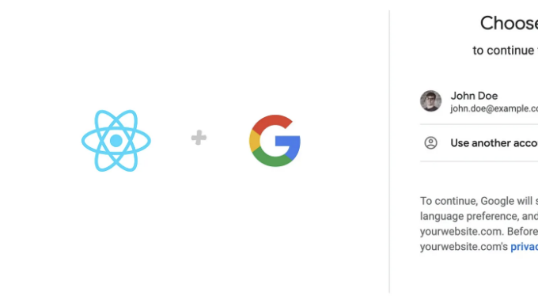
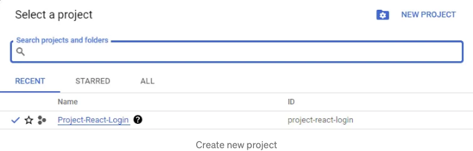
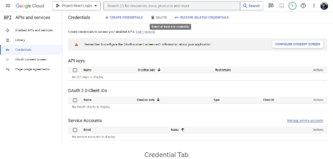
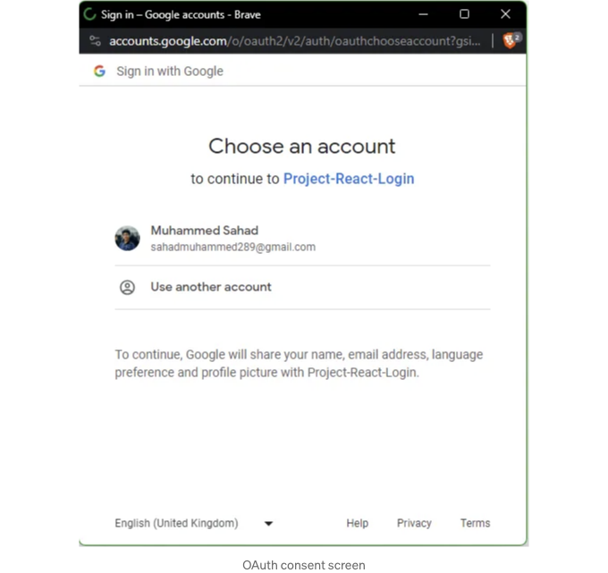
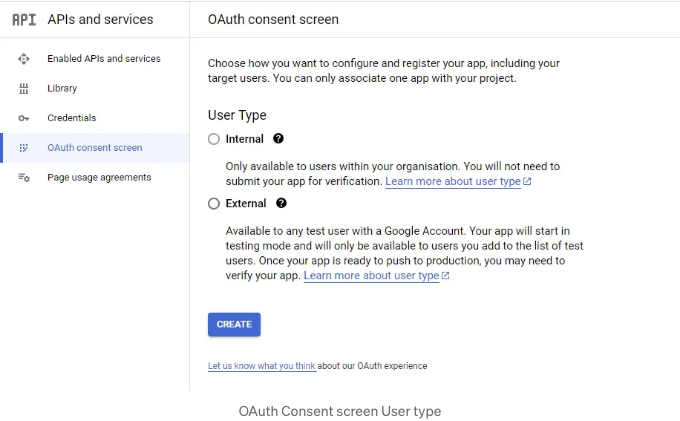
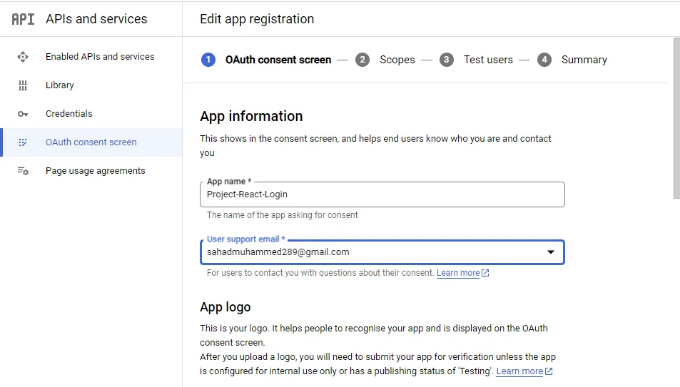
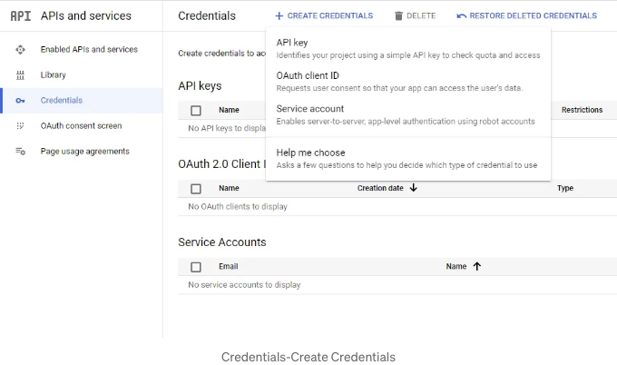
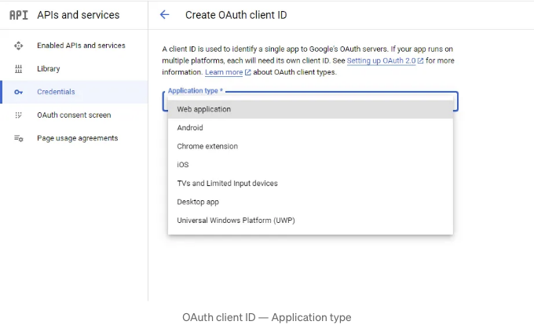
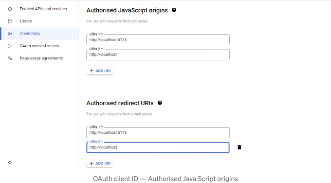
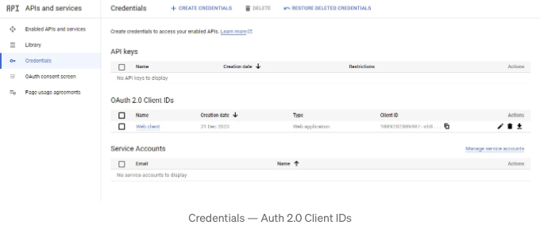

🚀 안녕하세요! 'React JS: 구글 인증 단계별 안내서'에 오신 것을 환영합니다. 이 여정에서는 과정을 명료하게 풀어내어 React 애플리케이션에 안전한 인증을 손쉽게 통합할 수 있도록 도와드리겠습니다. 함께 시작해볼까요! 💻🔐

이 튜토리얼을 따라가기 위해서는 로컬 컴퓨터에 React가 설치되어 있고 사용하는 방법에 익숙해야 합니다. React를 설치했다면 이미 Node.js, NPM 및 Yarn도 설치되어 있어야 합니다.

# 구글 로그인에 필요한 패키지 설치하기

<!-- ui-log 수평형 -->
<ins class="adsbygoogle"
  style="display:block"
  data-ad-client="ca-pub-4877378276818686"
  data-ad-slot="9743150776"
  data-ad-format="auto"
  data-full-width-responsive="true"></ins>
<component is="script">
(adsbygoogle = window.adsbygoogle || []).push({});
</component>

@react-oauth/google 패키지를 설치해야 합니다. 이 Google Identity Services JavaScript 라이브러리는 Google API를 호출하는 데 필요한 액세스 토큰을 빠르고 안전하게 얻는 데 도움이 됩니다.

패키지 설치 방법:

```js
$ npm install @react-oauth/google@latest
```

```js
$ yarn add @react-oauth/google@latest
```

<!-- ui-log 수평형 -->
<ins class="adsbygoogle"
  style="display:block"
  data-ad-client="ca-pub-4877378276818686"
  data-ad-slot="9743150776"
  data-ad-format="auto"
  data-full-width-responsive="true"></ins>
<component is="script">
(adsbygoogle = window.adsbygoogle || []).push({});
</component>

# 구글 API 클라이언트 ID 가져오기

클라이언트 ID는 클라이언트 및 서버 OAuth 2.0 인증을 지원하는 애플리케이션과 관련된 고유한 식별자입니다.

클라이언트 ID를 얻으려면 구글 클라우드 콘솔로 이동하여 새 프로젝트를 생성하십시오. 프로젝트 이름은 "프로젝트-리액트-로그인"으로 지었습니다. 



<!-- ui-log 수평형 -->
<ins class="adsbygoogle"
  style="display:block"
  data-ad-client="ca-pub-4877378276818686"
  data-ad-slot="9743150776"
  data-ad-format="auto"
  data-full-width-responsive="true"></ins>
<component is="script">
(adsbygoogle = window.adsbygoogle || []).push({});
</component>

프로젝트를 생성한 후 프로젝트 이름을 클릭하면 아래에 표시된 대시보드가 나타납니다. 구글 클라우드 로고 오른쪽 상단에 현재 프로젝트 이름이 표시됩니다.



# OAuth Consent Screen 구성

동의 화면은 사용자가 외부 또는 제3자 라이브러리를 사용하여 로그인할 것인지를 안내하는 화면입니다. 이 단계에서 사용자에게 앱의 루트 페이지를 떠나 제3자 페이지에 액세스하는 것을 허용하도록 경고합니다.

<!-- ui-log 수평형 -->
<ins class="adsbygoogle"
  style="display:block"
  data-ad-client="ca-pub-4877378276818686"
  data-ad-slot="9743150776"
  data-ad-format="auto"
  data-full-width-responsive="true"></ins>
<component is="script">
(adsbygoogle = window.adsbygoogle || []).push({});
</component>

당신의 앱이 사용자에게 표시하는 Google 로그인 동의 화면에는 프로젝트에 대한 간략한 설명, 정책 및 요청된 액세스 범위가 포함될 수 있습니다.



React 앱을 위해 Google 동의 페이지를 구성하려면 Google Cloud Console의 왼쪽 메뉴에서 "OAuth 동의 화면" 탭으로 이동하십시오.

이 탭에 들어가면 외부를 선택하세요. Google에서 확인된 조직 또는 애플리케이션을 사용하지 않는 한 선택할 수 있는 유일한 옵션입니다. 그리고 동의 화면을 만들려면 만들기 버튼을 클릭하세요.

<!-- ui-log 수평형 -->
<ins class="adsbygoogle"
  style="display:block"
  data-ad-client="ca-pub-4877378276818686"
  data-ad-slot="9743150776"
  data-ad-format="auto"
  data-full-width-responsive="true"></ins>
<component is="script">
(adsbygoogle = window.adsbygoogle || []).push({});
</component>



그리고 동일한 탭에서 응용 프로그램의 이름과 프로젝트에 대한 변경 사항 알림을받을 이메일 주소를 선택하세요. 다른 요구 사항 및 옵션은 일단 비워두세요. 준비가 된 경우 이 단계 중에 세부 정보를 추가할 수도 있습니다:



일단 나머지 등록 섹션은 건너뛰세요. 완료 후 대시보드로 돌아 오도록 구성 완료를 클릭할 때까지 각 섹션을 아래로 스크롤하고 "저장하고 계속"을 클릭하세요.

<!-- ui-log 수평형 -->
<ins class="adsbygoogle"
  style="display:block"
  data-ad-client="ca-pub-4877378276818686"
  data-ad-slot="9743150776"
  data-ad-format="auto"
  data-full-width-responsive="true"></ins>
<component is="script">
(adsbygoogle = window.adsbygoogle || []).push({});
</component>

# 웹 클라이언트 ID 생성하기

다음으로, 왼쪽 메뉴에서 자격 증명 탭을 클릭하여 웹 클라이언트 ID를 생성할 수 있는 페이지로 이동하세요.

이 페이지에서 페이지 상단에 있는 "자격 증명 생성"을 클릭한 후 OAuth 클라이언트 ID 옵션을 선택하세요:



<!-- ui-log 수평형 -->
<ins class="adsbygoogle"
  style="display:block"
  data-ad-client="ca-pub-4877378276818686"
  data-ad-slot="9743150776"
  data-ad-format="auto"
  data-full-width-responsive="true"></ins>
<component is="script">
(adsbygoogle = window.adsbygoogle || []).push({});
</component>

아래에 표시된 대로 애플리케이션 유형을 선택하라는 프롬프트가 표시됩니다. React 애플리케이션에 대해 이 단계를 따르는 경우 Google 클라이언트 ID를 웹용으로 사용하므로 웹 애플리케이션을 선택하십시오:



다음으로, 두 가지 유형의 URL을 추가할 것입니다: 승인된 자바스크립트 출처 및 승인된 리디렉션 URL.

승인된 자바스크립트 출처 URL은 애플리케이션이 로그인을 시작하는 URL입니다. 즉, React 개발자의 경우 localhost 및 localhost:3000이거나 애플리케이션을 호스팅했다면 호스팅된 URL입니다.

<!-- ui-log 수평형 -->
<ins class="adsbygoogle"
  style="display:block"
  data-ad-client="ca-pub-4877378276818686"
  data-ad-slot="9743150776"
  data-ad-format="auto"
  data-full-width-responsive="true"></ins>
<component is="script">
(adsbygoogle = window.adsbygoogle || []).push({});
</component>

인증된 리디렉트 URL은 Google이 로그인이 성공한 후 사용자를 리디렉트할 링크입니다. 예를 들어, 사용자를 원래 링크로 돌아가거나 또는 다른 링크로 리디렉트할 수도 있습니다. 어떤 방식이든 URL을 여기에 포함해야 합니다.



마지막으로, 웹 클라이언트 ID를 만들기 위해 '만들기' 버튼을 클릭하세요. 새롭게 생성된 자격 증명이 표시되는 홈페이지로 돌아갑니다. 새로운 웹 클라이언트 ID를 복사하려면 복사 아이콘을 클릭하세요:



<!-- ui-log 수평형 -->
<ins class="adsbygoogle"
  style="display:block"
  data-ad-client="ca-pub-4877378276818686"
  data-ad-slot="9743150776"
  data-ad-format="auto"
  data-full-width-responsive="true"></ins>
<component is="script">
(adsbygoogle = window.adsbygoogle || []).push({});
</component>

우리가 웹 클라이언트 ID를 성공적으로 생성했으니, 이제 React 앱으로 들어가서 설치하고 Google 로그인을 통합해봅시다.

# @react-oauth/google과 통합하기

이전에 말했듯이 필요한 패키지를 설치해야 합니다. 이미 완료하셨기를 바랍니다. 설치 후에는 GoogleAuthProvider로 애플리케이션을 감싸고 Google 웹 클라이언트 ID를 제공해야 합니다. 이렇게 하면 우리의 전체 React 앱이 Google Auth Provider에 한 번 접근할 수 있습니다.

index.js 파일 안에서는 애플리케이션을 다음과 같이 감쌀 것입니다;

<!-- ui-log 수평형 -->
<ins class="adsbygoogle"
  style="display:block"
  data-ad-client="ca-pub-4877378276818686"
  data-ad-slot="9743150776"
  data-ad-format="auto"
  data-full-width-responsive="true"></ins>
<component is="script">
(adsbygoogle = window.adsbygoogle || []).push({});
</component>

```js
// Index.js

import React from 'react'
import ReactDOM from 'react-dom/client'
import App from './App.jsx'
import './index.css'
import { GoogleOAuthProvider } from "@react-oauth/google"

ReactDOM.createRoot(document.getElementById('root')).render(
  <GoogleOAuthProvider clientId='1009282809407-sh8h2kgmot2q295a503sl5530pldnaj9.apps.googleusercontent.com'>
    <React.StrictMode>
      <App />
    </React.StrictMode>,
  </GoogleOAuthProvider>
)
```

리액트에서 설치된 모든 패키지와 마찬가지로 사용하기 전에 먼저 모듈을 가져와야 합니다. 그래서 React 앱 내에서 App.js 파일로 이동하고 다음 코드를 복사하세요;

```js
// app.js

import React from 'react';
import { GoogleLogin } from '@react-oauth/google';

function App() {
    const responseMessage = (response) => {
        console.log(response);
    };
    const errorMessage = (error) => {
        console.log(error);
    };
    return (
        <div>
            <h2>React Google Login</h2>
            <br />
            <br />
            <GoogleLogin onSuccess={responseMessage} onError={errorMessage} />
        </div>
    )
}
export default App;
```

위의 코드는 Google 로그인을 사용하는 방법을 간단하게 보여주는 방법입니다. @react-oauth/google에서 GoogleLogin 모듈을 가져와 컴포넌트에서 호출했습니다. 그 다음 로그인이 성공했을 때 응답을 console에 기록하는 두 함수를 만들었고, 로그인에 실패했을 때는 오류를 기록했습니다.```

<!-- ui-log 수평형 -->
<ins class="adsbygoogle"
  style="display:block"
  data-ad-client="ca-pub-4877378276818686"
  data-ad-slot="9743150776"
  data-ad-format="auto"
  data-full-width-responsive="true"></ins>
<component is="script">
(adsbygoogle = window.adsbygoogle || []).push({});
</component>

표 태그를 Markdown 형식으로 변경해주세요.

<!-- ui-log 수평형 -->
<ins class="adsbygoogle"
  style="display:block"
  data-ad-client="ca-pub-4877378276818686"
  data-ad-slot="9743150776"
  data-ad-format="auto"
  data-full-width-responsive="true"></ins>
<component is="script">
(adsbygoogle = window.adsbygoogle || []).push({});
</component>

```js
/*App.js*/

import React, { useState, useEffect } from 'react';
import { googleLogout, useGoogleLogin } from '@react-oauth/google';
import axios from 'axios';

function App() {
    const [user, setUser] = useState([]);
    const [profile, setProfile] = useState([]);

    const login = useGoogleLogin({
        onSuccess: (codeResponse) => setUser(codeResponse),
        onError: (error) => console.log('Login Failed:', error)
    });

    useEffect(
        () => {
            if (user) {
                axios
                    .get(`https://www.googleapis.com/oauth2/v1/userinfo?access_token=${user.access_token}`, {
                        headers: {
                            Authorization: `Bearer ${user.access_token}`,
                            Accept: 'application/json'
                        }
                    })
                    .then((res) => {
                        setProfile(res.data);
                    })
                    .catch((err) => console.log(err));
            }
        },
        [user]
    );

    // log out function to log the user out of google and set the profile array to null
    const logOut = () => {
        googleLogout();
        setProfile(null);
    };

    return (
        <div>
            <h2>React Google Login</h2>
            <br />
            <br />
            {profile ? (
                <div>
                    
                    <h3>User Logged in</h3>
                    <p>Name: {profile.name}</p>
                    <p>Email Address: {profile.email}</p>
                    <br />
                    <br />
                    <button onClick={logOut}>Log out</button>
                </div>
            ) : (
                <button onClick={() => login()}>Sign in with Google 🚀</button>
            )}
        </div>
    );
}

export default App;
```

위의 코드에서 @react-oauth/google에서 googleLogout 및 useGoogleLogin을 가져오았습니다.

useGoogleLogin API를 사용하면 사용자 정의 버튼으로 Google에 로그인할 수 있습니다. @react-oauth/google이 제공하는 GoogleLogin 버튼을 사용하고 싶지 않다면, 선호하는 버튼을 스타일링하고 제공한 클라이언트 ID로 로그인 요청을 만들기 위해 useGoogleLogin API를 사용할 수 있습니다.

요청이 성공하면 useGoogleLogin이 여전히 제공하는 onSuccess 함수에서 처리하고, 요청이 실패하면 실패 함수에서 오류를 처리합니다.```

<!-- ui-log 수평형 -->
<ins class="adsbygoogle"
  style="display:block"
  data-ad-client="ca-pub-4877378276818686"
  data-ad-slot="9743150776"
  data-ad-format="auto"
  data-full-width-responsive="true"></ins>
<component is="script">
(adsbygoogle = window.adsbygoogle || []).push({});
</component>

그 다음으로, onSuccess 함수에서 우리는 반환된 데이터로 프로필 상태를 설정합니다. 이 데이터에는 google_id, access_token, email, name 등 사용자의 세부 정보가 포함되어 있습니다. 사용자 배열이 변경될 때마다 useEffect 훅이 실행되어 Google 로그인에서 반환된 액세스 토큰을 사용하여 사용자 세부 정보를 가져옵니다. 사용자가 종속성으로 지정되어 있어서 사용자 배열이 변경될 때, 즉 null 배열에서 Google 로그인에서 응답을 받을 때 useEffect가 감시하고 그에 맞게 트리거됩니다.

마지막으로, UI를 변경하기 위해 조건문을 사용합니다: 프로필이 true이면 UI에 로그인한 사용자의 프로필을 이미지, 이름, 이메일과 함께 표시합니다. 프로필이 null이 되면(즉, 사용자가 GoogleLogout 버튼을 사용하여 로그아웃한 경우) 로그인 버튼이 표시됩니다.

# 결론

Google 로그인은 시간을 절약하고 사용자 경험을 향상시키기 위해 응용 프로그램에 포함해야 하는 중요한 기능입니다. 또 다른 좋은 추가 기능인 이유는 구현 및 사용이 간단하고 빠르다는 것입니다. 궁금한 사항이 있으면 언제든지 문의해 주세요!

<!-- ui-log 수평형 -->
<ins class="adsbygoogle"
  style="display:block"
  data-ad-client="ca-pub-4877378276818686"
  data-ad-slot="9743150776"
  data-ad-format="auto"
  data-full-width-responsive="true"></ins>
<component is="script">
(adsbygoogle = window.adsbygoogle || []).push({});
</component>

깃허브 저장소: React-Google-Authentication.

링크드인: Muhammed Sahad

이메일: Sahadmuhammed289@gmail.com

그리고,

<!-- ui-log 수평형 -->
<ins class="adsbygoogle"
  style="display:block"
  data-ad-client="ca-pub-4877378276818686"
  data-ad-slot="9743150776"
  data-ad-format="auto"
  data-full-width-responsive="true"></ins>
<component is="script">
(adsbygoogle = window.adsbygoogle || []).push({});
</component>

🎊🎉신년 복 많이 받으세요!🎊🎉✨