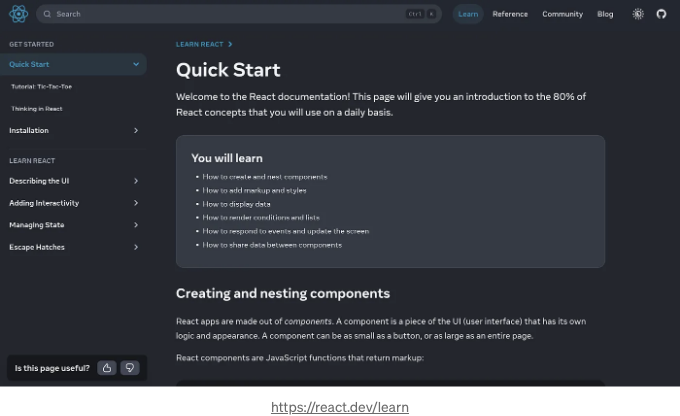
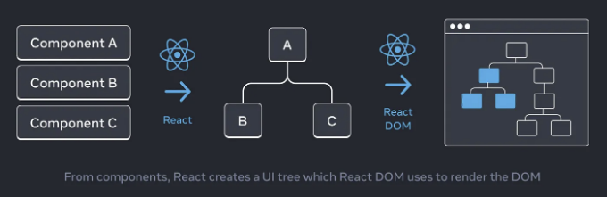
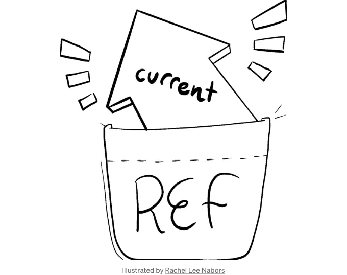
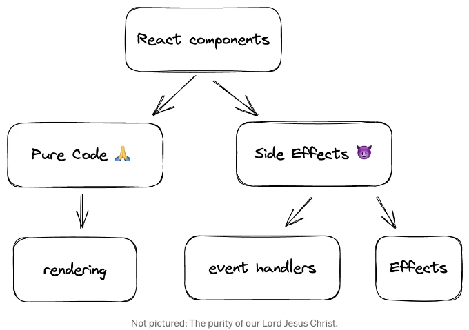

## 새로운 React 문서를 읽을 시간이 없다면, 난 대신 그것들을 걸러 냈습니다.


최근에 공식 React 웹사이트에서 새로운 React 문서가 공개되었습니다. 이것이 프레임워크를 배우는 가장 좋은 방법입니다.

  

<!-- ui-log 수평형 -->
<ins class="adsbygoogle"
  style="display:block"
  data-ad-client="ca-pub-4877378276818686"
  data-ad-slot="9743150776"
  data-ad-format="auto"
  data-full-width-responsive="true"></ins>
<component is="script">
(adsbygoogle = window.adsbygoogle || []).push({});
</component>

리액트 베테랑 개발자 여러분들은 진정한 리액트 그랜드마스터가 되기 위해 모든 리액트 팀 멤버의 트위터를 팔로우해야 한다는 것을 알고 있죠. 소중한 정보 덩어리를 놓치지 않으려면요.

하지만 더 이상 걱정하지 마세요! 이제 그 모든 심오한 지식이 쉽게 읽을 수 있는 형식으로 제공됩니다. 새로운 리액트 문서 덕분에 뒤에서 스며든 무자비한 신 예니들이 여러분의 일자리를 빼앗을 수 있어요!

앞서 나가기 위한 유일한 기회는 겸손해지고 앉아서 새로운 문서의 모든 단어를 읽는 것입니다.

하지만 두려워 하지 마세요. 저는 팀을 위해 희생적으로 일을 해서 모든 문서를 처음부터 끝까지 살펴보고 여러분을 위해 모두 정리했답니다.

<!-- ui-log 수평형 -->
<ins class="adsbygoogle"
  style="display:block"
  data-ad-client="ca-pub-4877378276818686"
  data-ad-slot="9743150776"
  data-ad-format="auto"
  data-full-width-responsive="true"></ins>
<component is="script">
(adsbygoogle = window.adsbygoogle || []).push({});
</component>

면책 사항: 본 문서에는 욕설이 포함되어 있습니다. 나를 어수선한 React 고수로 생각해주세요. 이제 지혜로운 핫한 견해를 제공하고 깊은 관점을 통해 제로펙을 줍니다.

## 소개

새로운 React 문서에는 "배우기"와 "API 참조" 두 가지 섹션이 있습니다.

본 문서는 "배우기" 섹션을 다룹니다. 순차적으로 읽기를 권장합니다.

<!-- ui-log 수평형 -->
<ins class="adsbygoogle"
  style="display:block"
  data-ad-client="ca-pub-4877378276818686"
  data-ad-slot="9743150776"
  data-ad-format="auto"
  data-full-width-responsive="true"></ins>
<component is="script">
(adsbygoogle = window.adsbygoogle || []).push({});
</component>

경험 많은 React 개발자라면 앞으로 넘어가서 제목을 살펴보세요. 흥미로운 내용이 있으면 깊이 파고들어도 좋아요.

# 섹션 1: React에 관하여

## 1. React는 처음에 Jordan Walke에 의해 만들어졌습니다.

지금은 Jordan Walke가 메타에서 일하고 있지 않아요.

<!-- ui-log 수평형 -->
<ins class="adsbygoogle"
  style="display:block"
  data-ad-client="ca-pub-4877378276818686"
  data-ad-slot="9743150776"
  data-ad-format="auto"
  data-full-width-responsive="true"></ins>
<component is="script">
(adsbygoogle = window.adsbygoogle || []).push({});
</component>

## 2. 리액트에는 17명의 핵심 팀 멤버가 있어요.

뷰의 19명의 팀 멤버와 솔리드의 7명의 팀 멤버와 비교해보면, 스벨트는 핵심 팀 멤버 수를 공개하지 않아요.

# 섹션 2: 시작하기

## 3. 문서에서는 인터랙티브 코드 예시에 CodeSandbox를 사용해요.

<!-- ui-log 수평형 -->
<ins class="adsbygoogle"
  style="display:block"
  data-ad-client="ca-pub-4877378276818686"
  data-ad-slot="9743150776"
  data-ad-format="auto"
  data-full-width-responsive="true"></ins>
<component is="script">
(adsbygoogle = window.adsbygoogle || []).push({});
</component>

문서에는 React가 다른 샌드박스 서비스에서도 지원된다고 언급합니다. 명시적으로 CodeSandbox, StackBlitz, 그리고 CodePen을 언급하고 있어요.

## 4. 새 문서는 React의 다양한 사용 사례를 설명할 때 Vue에서 영감을 받았어요.

"일부 상호 작용 추가"부터 "더 복잡한 앱" 그리고 "대규모 앱"까지, 새 문서는 React 사용의 다양한 수준을 잘 설명해 주고 있어요.

## 5. 간단한 HTML 페이지에 React를 추가하는 것은 쉬워요. 빌드 단계조차 필요하지 않아요.

<!-- ui-log 수평형 -->
<ins class="adsbygoogle"
  style="display:block"
  data-ad-client="ca-pub-4877378276818686"
  data-ad-slot="9743150776"
  data-ad-format="auto"
  data-full-width-responsive="true"></ins>
<component is="script">
(adsbygoogle = window.adsbygoogle || []).push({});
</component>

React를 스크립트 태그로 추가하고 컴포넌트를 작성하여 루트에 렌더링하세요. JSX 지원을 추가하려면 babel-cli로 간단한 빌드 단계를 설정할 수도 있습니다.

## 6. 여러 개의 React 루트를 가질 수 있습니다.

다시 말하지만, 이것은 정적 HTML 페이지에 상호작용 컴포넌트를 추가하고 싶을 때 유용합니다. 전체 문서를 위한 루트를 만드는 대신 각 컴포넌트마다 루트를 만들 수 있습니다. 그러나 문서에서는 서로 다른 루트에있는 컴포넌트 간에 정보를 공유할 수 있는지에 대해 명확히 설명하지 않습니다.

## 7. 새 문서에서는 더 이상 권장하지 않던 Create React App을 이제 추천하지 않습니다.

<!-- ui-log 수평형 -->
<ins class="adsbygoogle"
  style="display:block"
  data-ad-client="ca-pub-4877378276818686"
  data-ad-slot="9743150776"
  data-ad-format="auto"
  data-full-width-responsive="true"></ins>
<component is="script">
(adsbygoogle = window.adsbygoogle || []).push({});
</component>

Create React App은 편리했지만 중요한 버그를 해결하지 않고 구식 쓰레기 더미였어요. 제 말을 믿지 않는다면 Github 이슈를 확인해보세요. 이제 문서에서는 Vite와 Parcel과 같은 인기 있는 대안들을 추천합니다.

## 8. 프로덕션에 준비된 프로젝트를 위해 Next.js를 추천합니다.

여기 놀랄만한 점 없습니다. Next.js는 좋습니다, 특히 페이지 레이아웃에 더 많은 유연성을 허용하는 것이 가능해졌습니다. 다른 추천사항으로는 Gatsby, Remix, Razzle 등이 있습니다.

## 9. 자신만의 도구 체인을 구축하기 위한 훌륭한 도구 추천 목록이 있습니다.

<!-- ui-log 수평형 -->
<ins class="adsbygoogle"
  style="display:block"
  data-ad-client="ca-pub-4877378276818686"
  data-ad-slot="9743150776"
  data-ad-format="auto"
  data-full-width-responsive="true"></ins>
<component is="script">
(adsbygoogle = window.adsbygoogle || []).push({});
</component>

혼자서 날아다니고 싶다면, 문서에서 합리적이고 트렌디한 옵션 목록을 제안합니다. 나에게는 기쁜 놀라움이었는데, 최근의 문제들을 생각하면 Lerna에 대한 언급이 없다는 것이 합리적으로 느껴졌습니다. 대신, 모노 레포지토리에 대한 권장 사항은 Nx와 Turborepo입니다.

## 10. 권장되는 편집기는 VS Code, WebStorm, Sublime Text 및 Vim입니다.

크게 놀라운 점은 없습니다. 젯브레인의 편집기 중 WebStorm만이 아니라 다른 모든 젯브레인 편집기가 작업에 충분합니다. 또한 Sublime Text는 인터넷 유행어일 뿐이며, Dan Abramov는 화면에 라이센스 구매 팝업이 나타나는 컨퍼런스 토크 때 그 미안한 기억 때문에 언급한 것뿐입니다(그는 라이센스를 가지고 있었고, 그저 기술적 문제였습니다).

또한 Vim의 웹사이트는 90년대 그대로인 것으로, 편집기를 실제로 사용할 수 없게 만듭니다. 몇 년 후 문서에서 Neovim으로 교체될 것으로 예상됩니다.

<!-- ui-log 수평형 -->
<ins class="adsbygoogle"
  style="display:block"
  data-ad-client="ca-pub-4877378276818686"
  data-ad-slot="9743150776"
  data-ad-format="auto"
  data-full-width-responsive="true"></ins>
<component is="script">
(adsbygoogle = window.adsbygoogle || []).push({});
</component>

## 11. React를 올바르게 사용하려면 ESLint가 필요합니다.

현재 상태에서 React를 제대로 사용하려면 항상 eslint-plugin-react-hooks가 실행되어야 합니다. 나중에는 Rome(로메)의 컴파일러 단계나 다른 도구에 구현될 수도 있습니다.

## 12. Prettier가 최고입니다.

놀랄 것이 없습니다. 문서에서 prettier 사용을 권장하고 있고, 그것은 좋은 일입니다. 코드베이스에서 ESLint와 prettier를 모두 사용하는 경우 eslint-config-prettier 프리셋을 사용하는 것이 좋습니다. 이렇게 하면 ESLint가 논리적인 실수를 잡는 데만 사용되고 중요한 작업은 Prettier에게 맡겨집니다.

<!-- ui-log 수평형 -->
<ins class="adsbygoogle"
  style="display:block"
  data-ad-client="ca-pub-4877378276818686"
  data-ad-slot="9743150776"
  data-ad-format="auto"
  data-full-width-responsive="true"></ins>
<component is="script">
(adsbygoogle = window.adsbygoogle || []).push({});
</component>

## 13. 사파리용 React Developer Tools 브라우저 확장 프로그램이 없습니다.

크롬, 파이어폭스 및 엣지용 확장 프로그램은 있습니다.

사파리에서 디버그하려면, 스탠드얼론 react-devtools npm 패키지를 사용하여 React Native 앱을 테스트할 수 있는 해결책이 있습니다.

## 14. React 앱은 컴포넌트로 이루어져 있습니다.

<!-- ui-log 수평형 -->
<ins class="adsbygoogle"
  style="display:block"
  data-ad-client="ca-pub-4877378276818686"
  data-ad-slot="9743150776"
  data-ad-format="auto"
  data-full-width-responsive="true"></ins>
<component is="script">
(adsbygoogle = window.adsbygoogle || []).push({});
</component>

문서에서 명확하게 말하고 있는 것은 프레임워크의 주요 추상화가 컴포넌트라는 것이에요. 
이미 많이 언급된 MVC 킬러에 대해 이야기할 게 뭘 더 남겼을까요?

문서에 명확하게 기술되어 있는 것 중 하나는 “컴포넌트는 버튼처럼 작을 수도 있고 전체 페이지처럼 크게 만들 수도 있습니다.” 그리고 “모든 것이 컴포넌트로 이루어져 있습니다”라는데. 정말 아름다운 말이죠?

## 15. 자바스크립트에 대해 배우려면 MDN과 javascript.info를 추천합니다.

제가 javascript.info에 대해 몰랐는데, 오픈소스이고 상당히 신뢰할 만해 보여서 놀랐어요.

<!-- ui-log 수평형 -->
<ins class="adsbygoogle"
  style="display:block"
  data-ad-client="ca-pub-4877378276818686"
  data-ad-slot="9743150776"
  data-ad-format="auto"
  data-full-width-responsive="true"></ins>
<component is="script">
(adsbygoogle = window.adsbygoogle || []).push({});
</component>

## 16. 그들은 HTML을 JSX로 변환하는 온라인 도구를 추천합니다

이것은 HTML이 많이 있는 상태에서 시작하면 유용할 수 있습니다. JSX가 HTML보다 엄격하기 때문에 필요합니다. 예를 들어, JSX는 닫는 태그를 요구합니다. 아래에 도구가 있습니다.

그 도구는 SVG를 JSX로, CSS를 Tailwind로 변환하는 등 많은 기능을 제공하기 때문에 보물 같은 것이에요.

## 17. React에서 CSS를 추가하는 방법을 명시적으로 규정하지 않습니다.

<!-- ui-log 수평형 -->
<ins class="adsbygoogle"
  style="display:block"
  data-ad-client="ca-pub-4877378276818686"
  data-ad-slot="9743150776"
  data-ad-format="auto"
  data-full-width-responsive="true"></ins>
<component is="script">
(adsbygoogle = window.adsbygoogle || []).push({});
</component>

가장 간단한 경우에는 HTML에 `link` 태그를 추가하시면 됩니다. 빌드 도구나 프레임워크를 사용하는 경우 프로젝트에 스타일을 추가하는 방법을 학습하기 위해 해당 문서를 참고하세요.

## 18. JSX에서 중괄호를 JavaScript로 “탈출구”로 생각할 수 있습니다.

이것을 생각하는 것이 좋은 방법입니다. JSX 속성 값이나 JSX 태그 내부에 중괘호를 넣을 수 있습니다.

중괄호는 “JavaScript 세계로의 창문”입니다.

<!-- ui-log 수평형 -->
<ins class="adsbygoogle"
  style="display:block"
  data-ad-client="ca-pub-4877378276818686"
  data-ad-slot="9743150776"
  data-ad-format="auto"
  data-full-width-responsive="true"></ins>
<component is="script">
(adsbygoogle = window.adsbygoogle || []).push({});
</component>

## 19. JSX 내부에서 조건부 렌더링을 원한다면 ?와 && 연산자를 권장합니다.

시간이 지난 전통적인 방법이 여전히 권장되는 것을 보는 것은 참 좋아요. 이러한 연산자를 사용했을 때 얻는 만족감은 다른 것에 뒤떨어지지 않아요.

## 20. "key" 속성에 대한 명확한 설명이 제공됩니다.

key라는 종종 혼란스러운 용어가 새로운 문서에서 잘 설명되어 있습니다. 새로운 문서에서 그 내용 전체를 여기에 복사해 올까 고민 중이에요:

<!-- ui-log 수평형 -->
<ins class="adsbygoogle"
  style="display:block"
  data-ad-client="ca-pub-4877378276818686"
  data-ad-slot="9743150776"
  data-ad-format="auto"
  data-full-width-responsive="true"></ins>
<component is="script">
(adsbygoogle = window.adsbygoogle || []).push({});
</component>

나중에 확인하겠지만 "key"는 컴포넌트의 상태를 재설정하는 고급 케이스에도 사용됩니다. 하지만 저는 여전히 해당 고급 케이스가 상기한 "고유성"의 결과일 뿐이라고 생각합니다.

그리고 기억하세요! 키는 변경해서는 안 되며, 그렇게 되면 그 목적이 사라집니다! 렌더링하는 동안 키를 생성하지 마세요. 대신 데이터를 기반으로 안정적인 ID를 사용하세요.

## 21. 문서는 규칙과 관습을 설명하는 데 매우 좋습니다.

예를 들어, useState가 두 가지를 반환한다는 것을 설명하고 있지만, 우리가 [something, setSomething]라고 부르는 것은 관습뿐이라고 설명합니다.

<!-- ui-log 수평형 -->
<ins class="adsbygoogle"
  style="display:block"
  data-ad-client="ca-pub-4877378276818686"
  data-ad-slot="9743150776"
  data-ad-format="auto"
  data-full-width-responsive="true"></ins>
<component is="script">
(adsbygoogle = window.adsbygoogle || []).push({});
</component>

다른 예시로, 이벤트 핸들러를 만들 때 일반적으로 이벤트 이름 뒤에 "handle"라는 접두사를 붙이는 것이 일반적이라고 설명합니다. (onClick={handleClick}, onMouseEnter={handleMouseEnter} 등)

반면에, 후크는 일반적으로 "use"로 시작해야 하는 함수들입니다.

## 22. "만약 조건문이나 반복문에서 후크를 사용하고 싶다면, 새로운 컴포넌트를 추출해서 거기에 넣어주세요."

여기서 먼저 들었습니다.

<!-- ui-log 수평형 -->
<ins class="adsbygoogle"
  style="display:block"
  data-ad-client="ca-pub-4877378276818686"
  data-ad-slot="9743150776"
  data-ad-format="auto"
  data-full-width-responsive="true"></ins>
<component is="script">
(adsbygoogle = window.adsbygoogle || []).push({});
</component>

새로운 React 문서에서는 훅이 주요 레벨에만 있어야 한다는 점을 강조합니다. 만약 조건문이나 반복문 안에 훅을 넣고 싶다면, 새로운 컴포넌트를 만들어야 한다는 뜻입니다.

## 23. "상태 끌어올리기"가 중심에 있습니다.

유명한 리팩터링 패턴이 너무 흔해져서 "빠른 시작" 페이지에서 자세히 설명합니다. 이렇게 하면 엉뚱한 개발자들을 잡을 수 있을 것 같네요.

## 24. UI 모작을 컴포넌트 계층구조로 변환하는 것은 창의적인 과정입니다.

<!-- ui-log 수평형 -->
<ins class="adsbygoogle"
  style="display:block"
  data-ad-client="ca-pub-4877378276818686"
  data-ad-slot="9743150776"
  data-ad-format="auto"
  data-full-width-responsive="true"></ins>
<component is="script">
(adsbygoogle = window.adsbygoogle || []).push({});
</component>

문서는 UI 모킹이 주어졌을 때 React 컴포넌트로 변환하는 하나의 옳은 방법이 없다는 사실을 회피하지 않습니다. 

하지만 "컴포넌트는 이상적으로 한 가지 일만 해야합니다. 만약 컴포넌트가 계속 성장하게 된다면, 더 작은 하위 컴포넌트로 분해해야 한다"와 같은 상식적인 지침을 장려합니다.

## 25. 상단 또는 하단에 위치해도 좋습니다.

컴포넌트 계층 구조를 만들 때, 문서는 "먼저 정적 버전을 먼저 만드는"와 같은 선택적 기술을 언급하며 "위에서 아래로" 구축하거나 계층 구조에서 상위 컴포넌트부터 시작하는 것 또는 하위 컴포넌트부터 작업하는 "아래에서 위로" 건설의 차이를 탐구합니다.

<!-- ui-log 수평형 -->
<ins class="adsbygoogle"
  style="display:block"
  data-ad-client="ca-pub-4877378276818686"
  data-ad-slot="9743150776"
  data-ad-format="auto"
  data-full-width-responsive="true"></ins>
<component is="script">
(adsbygoogle = window.adsbygoogle || []).push({});
</component>

## 26. 최소 상태가 멋져요.

문서에서는 상태에 관해 이때까지 말한 'DRY(Don't Repeat Yourself)' 원칙을 강조합니다. 특히, 기존 상태에서 계산할 수 있는 상태를 만들 필요가 없다는 것을 강조합니다.

리액트 팀도 다른 개발자들이 보았던 데이터 축적과 관련된 일종의 연락을 받았는지 같아 보입니다.

## 27. Props와 State의 차이가 명확하게 설명되어 있습니다.

<!-- ui-log 수평형 -->
<ins class="adsbygoogle"
  style="display:block"
  data-ad-client="ca-pub-4877378276818686"
  data-ad-slot="9743150776"
  data-ad-format="auto"
  data-full-width-responsive="true"></ins>
<component is="script">
(adsbygoogle = window.adsbygoogle || []).push({});
</component>

"Props는 함수에 전달하는 인수와 같습니다." 반면에 "State는 컴포넌트의 메모리와 같습니다."

## 28. 공유 상태를 보유하는 데 전용 컴포넌트를 만드는 것은 괜찮습니다.

여러 자식이 사용하는 상태를 소유하는 데 합리적인 컴포넌트를 찾지 못하면 새로운 컴포넌트를 만드는 것이 괜찮습니다.

## 29. Hooks라고 불리는 이유는 그들이 컴포넌트의 렌더링 주기에 "후크되도록" 허용하기 때문입니다.

<!-- ui-log 수평형 -->
<ins class="adsbygoogle"
  style="display:block"
  data-ad-client="ca-pub-4877378276818686"
  data-ad-slot="9743150776"
  data-ad-format="auto"
  data-full-width-responsive="true"></ins>
<component is="script">
(adsbygoogle = window.adsbygoogle || []).push({});
</component>

당신이 무엇에 연결하는지 알아두는 것은 언제나 좋습니다. 이제 알았네요.

## 30. 어느 면에서 React는 실제로 "양방향 데이터 바인딩"을 사용합니다.

양방향 데이터 바인딩은 현재 가장 유명한 프레임워크인 Angular의 혁명적인 해결책이었습니다. 순수주의자들은 놀라실지 모르지만 React는 "단방향 데이터 흐름"과 "반대 방향 데이터 흐름"을 모두 사용하기 때문에 거의 동일한 기능을 합니다.

"단방향 데이터 흐름"은 데이터가 컴포넌트 계층 구조의 위에서 아래로 전달되는 것을 말합니다. "반대 방향 데이터 흐름"은 계층구조 깊은 곳에 있는 컴포넌트가 상단에서(일반적으로 사용자 입력으로 인해) 상태를 업데이트해야 할 때 발생합니다.

<!-- ui-log 수평형 -->
<ins class="adsbygoogle"
  style="display:block"
  data-ad-client="ca-pub-4877378276818686"
  data-ad-slot="9743150776"
  data-ad-format="auto"
  data-full-width-responsive="true"></ins>
<component is="script">
(adsbygoogle = window.adsbygoogle || []).push({});
</component>

React가 기술적으로 "양방향 데이터 바인딩"이 아닌 이유는 React가 "역 데이터 흐름"에 대해 매우 명확하기 때문입니다. 개발자는 실제로 onChange 이벤트 처리기를 작성해야 합니다.

# 섹션 3: UI 설명

## 31. 문서에서는 컴포넌트 라이브러리 Chakra UI와 Material UI를 권장합니다.

네, 그 순서대로입니다. Chakra UI가 Material UI보다 먼저 권장됩니다.

<!-- ui-log 수평형 -->
<ins class="adsbygoogle"
  style="display:block"
  data-ad-client="ca-pub-4877378276818686"
  data-ad-slot="9743150776"
  data-ad-format="auto"
  data-full-width-responsive="true"></ins>
<component is="script">
(adsbygoogle = window.adsbygoogle || []).push({});
</component>

Material UI의 추가적인 모독으로 현재 명칭이라고 할 수 없습니다. 요즘에는 특정 예술적 운동과 결부된 라이브러리에서 멀어지고자 MUI라고 불립니다.

## 32. React는 "상호작용 먼저"라는 철학을 가지고 있어요.

순수주의자들은 요즘 웹이 주로 문서 공유 플랫폼인데 상호작용은 보조적이어야 한다고 주장하고 있습니다.

React 팀은 이에 강하게 반대하며 새로운 문서에서 명확히 밝히고 있어요. 그들이 이에 대해 어떻게 생각하는지 그대로 복사해 보겠습니다. 왜냐하면 정말 잔인하게 재치있게 말했기 때문이에요:

<!-- ui-log 수평형 -->
<ins class="adsbygoogle"
  style="display:block"
  data-ad-client="ca-pub-4877378276818686"
  data-ad-slot="9743150776"
  data-ad-format="auto"
  data-full-width-responsive="true"></ins>
<component is="script">
(adsbygoogle = window.adsbygoogle || []).push({});
</component>

Linux 초보자는 화상에 알로에를 바르는 것이 좋습니다.

공정을 위해, 문서에는 React가 "상호 작용을 더하는데 사용될 수 있다"고 명확히 언급되어 있습니다.

## 33. React에서 렌더링 로직과 마크업이 함께 존재합니다.

문서에 명시된 또 다른 지침은 로직과 마크업이 함께 있어야 한다는 것입니다 (즉, 같은 파일에 있어야 합니다). 이것은 "각 편집 시에 서로 동기화되어 있음을 보장하기 때문에" 좋은 점입니다.

<!-- ui-log 수평형 -->
<ins class="adsbygoogle"
  style="display:block"
  data-ad-client="ca-pub-4877378276818686"
  data-ad-slot="9743150776"
  data-ad-format="auto"
  data-full-width-responsive="true"></ins>
<component is="script">
(adsbygoogle = window.adsbygoogle || []).push({});
</component>

저자의 언급: 아마도 Styled Components와 Tailwind가 인기를 얻은 이유는 비슷한 방식으로 스타일을 마크업과 로직과 함께 동일한 파일에 유지할 수 있기 때문이겠죠.

## 34. React는 "default vs named exports" 논쟁에 중립을 취합니다.

그들의 신용을 주면, 그들은 기본(default) 익스포트의 단점을 간결하게 설명하며 "import Banana from `./button.js`와 같이 작성할 수 있고 여전히 동일한 기본 익스포트를 제공할 것"이라고 말합니다.

하지만, 그들의 최종 결론은 "파일이 하나의 컴포넌트만 익스포트하는 경우 대부분의 사람들이 기본 익스포트를 사용하며, 여러 컴포넌트와 값들을 익스포트하는 경우에는 named exports를 사용한다"는 관찰일 뿐입니다.

<!-- ui-log 수평형 -->
<ins class="adsbygoogle"
  style="display:block"
  data-ad-client="ca-pub-4877378276818686"
  data-ad-slot="9743150776"
  data-ad-format="auto"
  data-full-width-responsive="true"></ins>
<component is="script">
(adsbygoogle = window.adsbygoogle || []).push({});
</component>

그들은 기꺼이 "하나의 기본 내보내기와 여러 개의 명명된 내보내기"를 사용합니다.

## 35. 절대 다른 컴포넌트 내에 컴포넌트를 정의하지 마세요!

문서에 따르면 기술적으로 가능합니다. 그러나 매우 느리고 버그를 유발합니다. 대신, 모든 컴포넌트를 최상위 레벨에서 정의하세요.

## 36. 컴포넌트가 재사용되지 않더라도 만들어도 괜찮습니다.

<!-- ui-log 수평형 -->
<ins class="adsbygoogle"
  style="display:block"
  data-ad-client="ca-pub-4877378276818686"
  data-ad-slot="9743150776"
  data-ad-format="auto"
  data-full-width-responsive="true"></ins>
<component is="script">
(adsbygoogle = window.adsbygoogle || []).push({});
</component>

리액트는 "구성 요소가 모든 것을 결정한다"는 방식이기 때문에 항상 적어도 하나의 재사용 가능하지 않은 구성 요소인 최상위 "앱 구성 요소"가 있게 됩니다.

그러나 일회용 구성 요소가 더 많은 것도 괜찮습니다. 왜냐하면 "구성 요소는 UI 코드와 마크업을 구성하는 편리한 방법이므로 한 번만 사용되는 경우가 있더라도 그중 일부는 항상 유용합니다."

## 37. 프래그먼트를 사용하여 한 번에 하나 이상의 요소를 반환할 수 있습니다.

문서에서 구성 요소가 한 번에 하나 이상의 요소를 반환할 수 없는 이유를 설명합니다. 그것은 "하드하면 JSX가 내부적으로 일반 자바스크립트 객체로 변환되기 때문입니다. 함수에서 두 개의 객체를 배열로 래핑하지 않고 반환할 수 없습니다."

<!-- ui-log 수평형 -->
<ins class="adsbygoogle"
  style="display:block"
  data-ad-client="ca-pub-4877378276818686"
  data-ad-slot="9743150776"
  data-ad-format="auto"
  data-full-width-responsive="true"></ins>
<component is="script">
(adsbygoogle = window.adsbygoogle || []).push({});
</component>

하지만 걱정하지 마세요. "다른 태그나 프래그먼트로 감싸는 것"을 통해 두 개의 JSX 태그를 반환할 수 있습니다.

프래그먼트는 브라우저 HTML 트리에 어떤 흔적도 남기지 않고 요소를 그룹화할 수 있는 "빈 태그"(`<>...</>`)입니다.

프래그먼트의 또 다른 장점은 키를 전달할 수 있다는 것인데, 이는 구성 요소 목록에서 항목이 여러 요소를 렌더링해야 할 때 훌륭합니다.

## 38. aria-*와 data-*는 대시로 작성된 유일한 JSX 속성입니다.

<!-- ui-log 수평형 -->
<ins class="adsbygoogle"
  style="display:block"
  data-ad-client="ca-pub-4877378276818686"
  data-ad-slot="9743150776"
  data-ad-format="auto"
  data-full-width-responsive="true"></ins>
<component is="script">
(adsbygoogle = window.adsbygoogle || []).push({});
</component>

이것은 역사적인 이유로 그런 것이에요.

일반적으로 JSX에서는 모든 것이 camelCase로 작성돼요. 심지어 인라인 스타일 속성도 JavaScript가 변수명에 제한을 두기 때문이에요.

게다가 class가 예약어이기 때문에 React에서는 className 대신에 써야 해요.

## 39. "더블 컬리즈"는 공식 용어에요.

<!-- ui-log 수평형 -->
<ins class="adsbygoogle"
  style="display:block"
  data-ad-client="ca-pub-4877378276818686"
  data-ad-slot="9743150776"
  data-ad-format="auto"
  data-full-width-responsive="true"></ins>
<component is="script">
(adsbygoogle = window.adsbygoogle || []).push({});
</component>

JSX에서 JS 객체를 전달하는 명시적인 방법입니다. 객체를 또 다른 쌍의 중괄호로 묶어야 합니다: {}.

특별한 구문이 아니라 JSX 중괏 괄호 안에 JavaScript 객체가 포함된 것입니다.

화살표 함수에서 객체를 반환할 때에 사용되는 "음모 구문(vagina syntax)"과 혼동되지 않도록 주의하세요: ({}).

## 40. HTML 태그에 전달할 수 있는 속성들은 미리 정의되어 있습니다.

<!-- ui-log 수평형 -->
<ins class="adsbygoogle"
  style="display:block"
  data-ad-client="ca-pub-4877378276818686"
  data-ad-slot="9743150776"
  data-ad-format="auto"
  data-full-width-responsive="true"></ins>
<component is="script">
(adsbygoogle = window.adsbygoogle || []).push({});
</component>

예를 들어, “className”, “src”, “alt”, “width”, 그리고 “height”은 `img` 태그에 전달할 수 있는 몇 가지 속성입니다.

하지만 여러분이 직접 만든 컴포넌트에는 어떤 속성이든 전달할 수 있습니다.

## 41. 계속해서 전개 연산자를 사용하면 도덕적으로 부적절한 행동을 할 수 있습니다.

몇몇 컴포넌트는 모든 속성을 자식 컴포넌트로 전달합니다. 그들은 자신의 속성을 직접 사용하지 않기 때문에 간결한 “전개” 구문인 {...props}를 사용하는 것이 의미가 있을 수 있습니다.

<!-- ui-log 수평형 -->
<ins class="adsbygoogle"
  style="display:block"
  data-ad-client="ca-pub-4877378276818686"
  data-ad-slot="9743150776"
  data-ad-format="auto"
  data-full-width-responsive="true"></ins>
<component is="script">
(adsbygoogle = window.adsbygoogle || []).push({});
</component>

그러나 문서에는 "스프레드 구문을 분별하여 사용하십시오. 모든 다른 구성 요소에서 사용 중이라면, 무언가 잘못된 것입니다. 종종 이것은 구성 요소를 분할해야 한다는 것을 나타낼 수 있습니다."

Spread 문법을 사용할 때 주의하세요.

## 42. 일부 구성 요소에는 "채워질" 수 있는 "구멍"이 있습니다.

자식 prop을 가진 구성 요소는 임의의 JSX를 사용하여 부모 구성 요소에서 "채워질" 수 있는 "구멍"을 가지고 있다고 생각할 수 있습니다.

<!-- ui-log 수평형 -->
<ins class="adsbygoogle"
  style="display:block"
  data-ad-client="ca-pub-4877378276818686"
  data-ad-slot="9743150776"
  data-ad-format="auto"
  data-full-width-responsive="true"></ins>
<component is="script">
(adsbygoogle = window.adsbygoogle || []).push({});
</component>

자주 사용하는 시각적 래퍼(패널, 그리드 등)들에 대해 children prop을 사용할 것입니다.

## 43. 컴포넌트는 시간이 지남에 따라 다른 prop을 받을 수 있습니다.

상태(state)와 프롭(props)의 차이를 얕게 이해하면 프롭이 변경되지 않는 것으로 생각할 수 있습니다.

하지만, 부모 컴포넌트는 시간이 지남에 따라 변하는 상태를 가질 수 있고, 이를 자식 컴포넌트로 prop으로 전달할 수 있습니다.

<!-- ui-log 수평형 -->
<ins class="adsbygoogle"
  style="display:block"
  data-ad-client="ca-pub-4877378276818686"
  data-ad-slot="9743150776"
  data-ad-format="auto"
  data-full-width-responsive="true"></ins>
<component is="script">
(adsbygoogle = window.adsbygoogle || []).push({});
</component>

그러나 자식 컴포넌트의 관점에서 props는 "불변"이라는 컴퓨터 과학 용어로 표현됩니다.

따라서 자식 컴포넌트가 props를 변경해야 하는 경우(예: 사용자 상호 작용 또는 새 데이터에 대한 응답), 이전에 언급한 "역 데이터 흐름"을 사용하여 부모 컴포넌트에게 "새로운 props"를 생성하고 전달하도록 요청해야 합니다.

우리는 props를 시간별로 읽기 전용 스냅샷이라고 할 수 있습니다: 각 렌더링은 새로운 버전의 props를 받습니다. (그리고 나중에 보게 되겠지만, state도 시간별로 읽기 전용 스냅샷입니다)

## 문서에서는 삼항 연산자를 "적당히 사용"하라고 권장합니다.

<!-- ui-log 수평형 -->
<ins class="adsbygoogle"
  style="display:block"
  data-ad-client="ca-pub-4877378276818686"
  data-ad-slot="9743150776"
  data-ad-format="auto"
  data-full-width-responsive="true"></ins>
<component is="script">
(adsbygoogle = window.adsbygoogle || []).push({});
</component>

JSX 내에서 조건부 렌더링하는 것은 괜찮지만, "컴포넌트가 너무 많은 중첩된 조건부 마크업으로 혼란스러워진다면, 자식 컴포넌트를 추출하여 정리하는 것을 고려해보세요."

만약 동료 개발자들이 삼항 연산자의 스파게티 소스를 만들겠다고 주장한다면, React 문서나 여기를 보여주는 것도 좋은 방법일지도요:

## 45. && 연산자 왼쪽에 숫자를 놓지 마세요.

오래된 개발자들만 알고 있는 팁이에요.

<!-- ui-log 수평형 -->
<ins class="adsbygoogle"
  style="display:block"
  data-ad-client="ca-pub-4877378276818686"
  data-ad-slot="9743150776"
  data-ad-format="auto"
  data-full-width-responsive="true"></ins>
<component is="script">
(adsbygoogle = window.adsbygoogle || []).push({});
</component>

만약 조건부 렌더링에 &&를 사용하면 0으로 인해 골치가 아플 수 있어요. 아마도 매끈하고 산세리프 형태의 머티리얼 UI에 작은 스타일이 없는 0이 추가될 가능성이 높아요.

수학자들은 싫어해요.

## 46. 때로는 단축키를 피하고 조건에 따라 JSX를 변수에 할당하는 것이 더 좋을 수도 있어요.

삼항 연산자와 &&는 좋지만, 방해가 된다면 오히려 조건부 JSX를 저장할 때는 옛날 방식의 변수를 사용하는 것이 좋아요.

<!-- ui-log 수평형 -->
<ins class="adsbygoogle"
  style="display:block"
  data-ad-client="ca-pub-4877378276818686"
  data-ad-slot="9743150776"
  data-ad-format="auto"
  data-full-width-responsive="true"></ins>
<component is="script">
(adsbygoogle = window.adsbygoogle || []).push({});
</component>

특별한 JavaScript를 작성해도 괜찮다는 문서 내용을 읽어서 기뻐요. 자바스크립트로 코드를 작성하는 것도 좋지만, 순수한 JS도 충분히 좋아요.

### 47. 문서에서는 "crypto.randomUUID()" 또는 "uuid"와 같은 패키지를 추천합니다.

이것들은 데이터에 대한 고유 식별자를 생성하고 로컬로 저장된 후 키로 사용할 수 있도록 도와줄 수 있어요.

네, 그들은 "uuid" 패키지보다 "crypto.randomUUID()"를 먼저 추천합니다.

<!-- ui-log 수평형 -->
<ins class="adsbygoogle"
  style="display:block"
  data-ad-client="ca-pub-4877378276818686"
  data-ad-slot="9743150776"
  data-ad-format="auto"
  data-full-width-responsive="true"></ins>
<component is="script">
(adsbygoogle = window.adsbygoogle || []).push({});
</component>

그 네이티브 암호 라이브러리는 처음 들어본 것인데, 견고해 보이네요. 만약 'uuid' 패키지의 유지보수자였다면 새 직업 찾기를 시작할 거예요. 이 설명서는 정말 그들의 전체 경력을 끝냈어요.

## 48. 컴포넌트에 키가 프롭으로 전달되지 않습니다.

React 자체에서 힌트로만 사용됩니다.

키로 사용된 ID가 필요한 경우, 별도의 프롭으로 전달해야 합니다.

<!-- ui-log 수평형 -->
<ins class="adsbygoogle"
  style="display:block"
  data-ad-client="ca-pub-4877378276818686"
  data-ad-slot="9743150776"
  data-ad-format="auto"
  data-full-width-responsive="true"></ins>
<component is="script">
(adsbygoogle = window.adsbygoogle || []).push({});
</component>

## 49. React는 여러분이 작성하는 모든 컴포넌트가 순수 함수라고 가정합니다.

React 뒷담을 하지 말고 불순한 일을 하지 마세요. React는 순수 함수 개념을 기반으로 설계되었습니다.

순수 함수는 다음과 같은 특성을 가지고 있습니다:

- 자신의 일에만 집중합니다. 호출되기 전에 존재했던 어떤 객체나 변수도 변경하지 않습니다. (이는 함수의 범위 외부 변수를 변형하지 않으며, 입력값을 변형하지 않는다는 것을 의미합니다. React에서는 "props", "state", "context"가 모두 입력값으로 간주됩니다.)
- 동일한 입력에 대해 동일한 출력을 반환합니다. 동일한 입력이 주어지면 순수 함수는 항상 동일한 결과를 반환해야 합니다.

<!-- ui-log 수평형 -->
<ins class="adsbygoogle"
  style="display:block"
  data-ad-client="ca-pub-4877378276818686"
  data-ad-slot="9743150776"
  data-ad-format="auto"
  data-full-width-responsive="true"></ins>
<component is="script">
(adsbygoogle = window.adsbygoogle || []).push({});
</component>

하지만, 함수 내부에서 만들어진 변수와 객체를 변경하는 것은 전혀 괜찮습니다. 함수 외부의 코드는 이 변경 사항을 전혀 모르기 때문에 괜찮습니다. 이것을 "로컬 변경"이라고 합니다.

React는 성능, 서버 렌더링에 도움이 되고, 곧 멋진 새로운 기능들을 지원할 것이기 때문에 순수성에 신경을 씁니다.

참고: 이 규칙의 유일한 예외 사항은 (99)를 확인하십시오.

## 50. StrictMode로 불순한 계산 감지하기.

<!-- ui-log 수평형 -->
<ins class="adsbygoogle"
  style="display:block"
  data-ad-client="ca-pub-4877378276818686"
  data-ad-slot="9743150776"
  data-ad-format="auto"
  data-full-width-responsive="true"></ins>
<component is="script">
(adsbygoogle = window.adsbygoogle || []).push({});
</component>

만약 엄격한 모드에 있다면 모든 구성 요소가 두 번 렌더링됩니다. 이건 당신이 잘못된 일을 하는지 감지하기 위한 것이에요.

## 51. 모든 것이 React에서 순수하지 않아요 ;)

작은 비밀을 알려줄게요, 우리 React 개발자들은 항상 순수하지 않은 일을 합니다. 그리고 그걸 좋아해요!

함수형 프로그래밍은 순수성에 많은 의존을 두지만, 언젠가는 어딘가에서 무언가가 변해야 합니다. 그게 프로그래밍의 요지죠!

<!-- ui-log 수평형 -->
<ins class="adsbygoogle"
  style="display:block"
  data-ad-client="ca-pub-4877378276818686"
  data-ad-slot="9743150776"
  data-ad-format="auto"
  data-full-width-responsive="true"></ins>
<component is="script">
(adsbygoogle = window.adsbygoogle || []).push({});
</component>

그래서, 리액트에서 우리는 원하는 대로 할 수 있는 작은 비밀 스팟을 갖고 있어요. 우리는 "곁에서" 다르게 행동해!

리액트에서 부수 효과는 일반적으로 "이벤트 핸들러" 안에 속해 있어요. 여기서는 외부 변수를 수정하거나 상태를 설정하고 원하는 모든 불순한 작업을 할 수 있어요. 이벤트 핸들러는 컴포넌트 내에서 정의되지만 렌더링 중에 실행되지 않기 때문에 순수할 필요가 없어요!

만약 다른 옵션을 모두 고려했지만 적절한 이벤트 핸들러를 찾지 못했다면, 여전히 "useEffect" 호출을 사용하여 반환된 JSX에 부수 효과를 추가할 수 있어요. 이렇게 하면 리액트에게 렌더링 후에, 부수 효과가 허용되는 시점에 실행하도록 알려줄 수 있어요.

# 섹션 4: 상호 작용 추가하기

<!-- ui-log 수평형 -->
<ins class="adsbygoogle"
  style="display:block"
  data-ad-client="ca-pub-4877378276818686"
  data-ad-slot="9743150776"
  data-ad-format="auto"
  data-full-width-responsive="true"></ins>
<component is="script">
(adsbygoogle = window.adsbygoogle || []).push({});
</component>

## 52. 디자인 시스템에 대한 미디엄 기사로 링크가 있어요.

진짜요. 여기 있어요:

축하해요 
Audrey Hacq
, React 문서에 진짜 들어가셨네요. 기사의 영화화가 기대돼요.

## 53. 이벤트 객체는 보통 관례적으로 "e"로 부르곤 해요.

<!-- ui-log 수평형 -->
<ins class="adsbygoogle"
  style="display:block"
  data-ad-client="ca-pub-4877378276818686"
  data-ad-slot="9743150776"
  data-ad-format="auto"
  data-full-width-responsive="true"></ins>
<component is="script">
(adsbygoogle = window.adsbygoogle || []).push({});
</component>

이런, React 문서야, 그렇게 하면 안 돼.

개발자들과 "이벤트"로 작성하도록 해 오래 싸워왔어.

이제 어떻게 해야 해, React? 말해봐, 이제 나의 청결한 코드베이스에 모여있는 "e"들을 어떻게 처리해야 하는 거야?

## 54. 이벤트 핸들러는 그냥 props로 전달되는 함수일 뿐이에요.

<!-- ui-log 수평형 -->
<ins class="adsbygoogle"
  style="display:block"
  data-ad-client="ca-pub-4877378276818686"
  data-ad-slot="9743150776"
  data-ad-format="auto"
  data-full-width-responsive="true"></ins>
<component is="script">
(adsbygoogle = window.adsbygoogle || []).push({});
</component>

그들에 대해 특별한 점은 없어요.

물론 클릭, 호버링 등과 같은 상호작용에 응답하도록 의도된 것이지만요.

즉, React 컴포넌트 트리 맨 아래에 있는 모든 이벤트 핸들러는 "button"과 같은 HTML 태그에서 "onClick"과 같은 내장 핸들러 중 하나에 착지하게 됩니다.

## 55. 앱별 개념에 기반을 둔 이벤트 핸들러를 지어야 해요.

<!-- ui-log 수평형 -->
<ins class="adsbygoogle"
  style="display:block"
  data-ad-client="ca-pub-4877378276818686"
  data-ad-slot="9743150776"
  data-ad-format="auto"
  data-full-width-responsive="true"></ins>
<component is="script">
(adsbygoogle = window.adsbygoogle || []).push({});
</component>

컴포넌트가 여러 상호 작용을 지원하는 경우, 앱별 개념에 맞는 이벤트 핸들러 props의 이름을 지정할 수 있습니다. 예를 들어 "onPlayMovie"나 "onUploadImage"와 같이 설정할 수 있어요.

## 56. 문서에서 캡처와 전파가 존재한다고 상기시킵니다.

만약 고수준 작업을 하고 이벤트 핸들러에만 의존할 수 있는 행운을 누르셨다면, React 문서는 완전한 의도치 않은 DOM 이벤트 전파의 지옥이 아직도 존재함을 상기시켜줍니다. 모든 이에게 하나님의 도움을 빕니다.

## 57. e.stopPropagation()은 전파를 중단합니다.

<!-- ui-log 수평형 -->
<ins class="adsbygoogle"
  style="display:block"
  data-ad-client="ca-pub-4877378276818686"
  data-ad-slot="9743150776"
  data-ad-format="auto"
  data-full-width-responsive="true"></ins>
<component is="script">
(adsbygoogle = window.adsbygoogle || []).push({});
</component>

이렇게 하면 부모 구성 요소로 이벤트가 전달되지 않습니다.

### 58. e.preventDefault()는 기본 동작을 막습니다.

좋네요. 이렇게 하면 일부 이벤트에서 기본 브라우저 동작을 방지할 수 있어요. 예를 들어, 브라우저는 폼 제출 이벤트에서 기본적으로 전체 페이지를 다시로드합니다.

### 59. 로컬 변수는 렌더 사이에 유지되지 않습니다.

<!-- ui-log 수평형 -->
<ins class="adsbygoogle"
  style="display:block"
  data-ad-client="ca-pub-4877378276818686"
  data-ad-slot="9743150776"
  data-ad-format="auto"
  data-full-width-responsive="true"></ins>
<component is="script">
(adsbygoogle = window.adsbygoogle || []).push({});
</component>

리액트가 컴포넌트를 두 번 렌더링할 때는 처음부터 다시 렌더링합니다. - 로컬 변수의 변경 사항을 고려하지 않습니다.

여기서 "로컬 변수"라고 말하는 것은 컴포넌트 본문에 let index = 0과 같이 선언된 변수를 의미합니다.

## 60. 로컬 변수의 변경 사항은 렌더링을 트리거하지 않습니다.

렌더링을 트리거하는 요소는 몇 가지뿐입니다. 로컬 변수를 변경하는 것은 그 중 하나가 아닙니다. 이건 스벨트인 줄 알았나요?

<!-- ui-log 수평형 -->
<ins class="adsbygoogle"
  style="display:block"
  data-ad-client="ca-pub-4877378276818686"
  data-ad-slot="9743150776"
  data-ad-format="auto"
  data-full-width-responsive="true"></ins>
<component is="script">
(adsbygoogle = window.adsbygoogle || []).push({});
</component>

## 61. 컴포넌트를 새 데이터로 업데이트하려면 두 가지가 필요합니다.

첫째, 렌더 사이에 데이터를 유지해야 합니다. 둘째, React에게 새 데이터로 컴포넌트를 렌더링하도록 유도해야 합니다 (재랜더링).

여기서 useState Hook이 필요합니다. 이는 다음 두 가지를 제공합니다:

- 렌더 사이에서 데이터를 유지하는 상태 변수.
- 변수를 업데이트하고 React에게 컴포넌트를 다시 렌더링하도록 유도하는 상태 설정 함수(즉, "설정 함수" 또는 "상태 설정 함수").

<!-- ui-log 수평형 -->
<ins class="adsbygoogle"
  style="display:block"
  data-ad-client="ca-pub-4877378276818686"
  data-ad-slot="9743150776"
  data-ad-format="auto"
  data-full-width-responsive="true"></ins>
<component is="script">
(adsbygoogle = window.adsbygoogle || []).push({});
</component>

더 간단한 방법이 있을까요? 물론, 그렇지만 여기는 Svelte가 아니에요. 이곳은 React, 우리는 메탈에 가깝게 살아가며 그것을 좋아해요. JavaScript에서 마법은 없어요.

## 62. 화면에 있는 각 구성 요소 인스턴스에 대해 상태는 개인적이에요.

상태는 특정 구성 요소 함수에 묶이지 않아요. 화면의 두 곳에 동일한 구성 요소를 렌더링하더라도 각각의 복사본은 자체 상태를 갖게돼요.

이것은 베테랑들에게는 당연한 일처럼 보일 수 있지만 React를 처음 사용할 때는 혼란스러울 수 있어요. 특히 useState를 사용할 때, 이것을 가져와야 하고, 가져오는 것이 신비로울 때가 있어요 - 누가 어떤 것이 있는지 아무도 모르니까요.

<!-- ui-log 수평형 -->
<ins class="adsbygoogle"
  style="display:block"
  data-ad-client="ca-pub-4877378276818686"
  data-ad-slot="9743150776"
  data-ad-format="auto"
  data-full-width-responsive="true"></ins>
<component is="script">
(adsbygoogle = window.adsbygoogle || []).push({});
</component>

## 63. 트리거, 렌더링, 그리고 커밋.

React에서 화면의 구성 요소를 업데이트하는 프로세스는 세 가지 단계로 이루어집니다.

트리거링은 렌더링이 즉시 실행되도록 React에 대기열을 지정하는 것입니다. CPU 사이클을 소모하는 다른 작업을 처리하는 동안 화면의 구성 요소를 렌더링합니다.

렌더링은 구성 요소를 실행하고 결과를 얻는 것을 의미합니다.

<!-- ui-log 수평형 -->
<ins class="adsbygoogle"
  style="display:block"
  data-ad-client="ca-pub-4877378276818686"
  data-ad-slot="9743150776"
  data-ad-format="auto"
  data-full-width-responsive="true"></ins>
<component is="script">
(adsbygoogle = window.adsbygoogle || []).push({});
</component>

커밋은 결과물을 진짜로 적용하는 것을 말해. 문서 .createElement() 메서드와 같은 장치들을 사용해 브라우저 DOM API에 렌더링 결과물을 적용한다.

## 63. 컴포넌트가 렌더링되는 두 가지 이유가 있다.

- 컴포넌트의 초기 렌더링이다.
- 컴포넌트(또는 그 조상 중 하나)의 상태가 업데이트되었기 때문이다.

이게 전부야.

<!-- ui-log 수평형 -->
<ins class="adsbygoogle"
  style="display:block"
  data-ad-client="ca-pub-4877378276818686"
  data-ad-slot="9743150776"
  data-ad-format="auto"
  data-full-width-responsive="true"></ins>
<component is="script">
(adsbygoogle = window.adsbygoogle || []).push({});
</component>

그러나 상황이 변할 때는 어떨까요? 아니요, 그 경우는 이미 "상위 요소 중 하나의 상태가 업데이트되었음"에 포함되어 있습니다.

## 64. 성능을 향상시키는 방법이 있지만 조심스럽게 처리하세요.

업데이트된 구성 요소 내에 중첩된 모든 구성 요소를 렌더링하는 기본 동작은 업데이트된 구성 요소가 트리의 맨 위에 있을 때 성능적으로 최적이 아닙니다.

성능 문제에 부딪히면 해결할 수 있는 여러 가지 방법이 있지만, 너무 일찍 최적화를 하지 마세요!

<!-- ui-log 수평형 -->
<ins class="adsbygoogle"
  style="display:block"
  data-ad-client="ca-pub-4877378276818686"
  data-ad-slot="9743150776"
  data-ad-format="auto"
  data-full-width-responsive="true"></ins>
<component is="script">
(adsbygoogle = window.adsbygoogle || []).push({});
</component>

문서에서 권장하는 주요 최적화 기술은 "memo" API입니다. 이를 통해 입력이 변경되지 않은 컴포넌트의 렌더링을 건너뛸 수 있습니다. 순수 함수는 항상 동일한 결과를 반환하기 때문에 캐싱해도 안전합니다.

알겠죠? 따라서 모든 그 순수성에 대한 권할은 시간 낭비가 아닙니다!

## 65. 리액트는 똑똑해요. 혹시 당신보다 더 똑똑할 수도 있어요!

재렌더링 시, 리액트는 최신 렌더링 결과와 DOM을 일치시키기 위해 필요한 최소한의 작업을 수행합니다 (렌더링하는 동안 계산됩니다!).

<!-- ui-log 수평형 -->
<ins class="adsbygoogle"
  style="display:block"
  data-ad-client="ca-pub-4877378276818686"
  data-ad-slot="9743150776"
  data-ad-format="auto"
  data-full-width-responsive="true"></ins>
<component is="script">
(adsbygoogle = window.adsbygoogle || []).push({});
</component>

여기서 바로 React의 명성이 발동됩니다. 처음에는 Virtual DOM 또는 "차이"라고 불렸지만, 최근에는 특히 몇 가지 신랄한 비난 이후에는 그저 "React가 하는 그 것"으로 언급되며, 구현이 너무 어렵고 난해해서 거의 일루미나티에 가입해야 할 것입니다.

## 66. React는 렌더링 사이에 차이가 있을 때에만 DOM 노드를 변경합니다.

이겪어보신 것 중에 가장 멋진 일 중 하나가 아닐까 싶네요.

여기서 분명히 말씀드리겠습니다: 컴포넌트가 다시 렌더링되더라도 무엇인가 바뀌었다 하더라도 React는 변경된 특정 DOM 요소만 변경을 커밋할 것입니다!

<!-- ui-log 수평형 -->
<ins class="adsbygoogle"
  style="display:block"
  data-ad-client="ca-pub-4877378276818686"
  data-ad-slot="9743150776"
  data-ad-format="auto"
  data-full-width-responsive="true"></ins>
<component is="script">
(adsbygoogle = window.adsbygoogle || []).push({});
</component>

재렌더링된 컴포넌트 내의 영향받지 않은 DOM 요소는 그대로 유지됩니다! 정말 대단한 발상이죠! React 개발자들은 정말로 대단한 아이디어를 가지고 있네요!

## 67. State는 시간의 UI 스냅샷과 같습니다.

State는 단순한 JavaScript 변수처럼 보일 수 있지만, state는 스냅샷과 같이 동작합니다. state를 설정하면 이미 있는 state 변수를 변경하지 않고, 대신 재렌더링을 일으킵니다.

이것은 실제로 "렌더링"이 UI의 스냅샷을 찍는 것이기 때문입니다. React가 컴포넌트 함수를 호출할 때 해당 스냅샷이 생성됩니다. 프롭스, state, 이벤트 핸들러, 이펙트 및 로컬 변수는 렌더링 시간의 상태를 사용하여 계산됩니다.


<!-- ui-log 수평형 -->
<ins class="adsbygoogle"
  style="display:block"
  data-ad-client="ca-pub-4877378276818686"
  data-ad-slot="9743150776"
  data-ad-format="auto"
  data-full-width-responsive="true"></ins>
<component is="script">
(adsbygoogle = window.adsbygoogle || []).push({});
</component>

사진이나 영화 장면과 달리 반환하는 UI “스냅샷”은 상호 작용적입니다. 입력에 대한 응답으로 발생하는 이벤트 핸들러와 같은 논리를 포함합니다.

그러니까 주의하세요: 이벤트 핸들러에서 상태를 변경하고, 동일한 이벤트 핸들러에서 업데이트된 값을 읽기를 기대해서는 안 됩니다. 왜냐하면 여전히 동일한 시간 스냅샷에 갇혀 있기 때문입니다. 상태를 설정하면 다음 렌더링을 위해만 변경됩니다.

## 68. 렌더링 내에서 상태 변수의 값은 결코 변경되지 않습니다.

이 원칙을 기억하세요: “렌더링 내에서 상태 변수의 값은 결코 변경되지 않습니다.”

<!-- ui-log 수평형 -->
<ins class="adsbygoogle"
  style="display:block"
  data-ad-client="ca-pub-4877378276818686"
  data-ad-slot="9743150776"
  data-ad-format="auto"
  data-full-width-responsive="true"></ins>
<component is="script">
(adsbygoogle = window.adsbygoogle || []).push({});
</component>

뭐든 해보세요. 콘솔 로그를 세 번의 setTimeout으로 감싸도, 렌더 스냅샷을 벗어날 수는 없어요. 업데이트된 상태는 미래 렌더를 위해 예약된 특권이에요. 모든 희망을 버려야 해요.

## 69. React는 상태 업데이트를 일괄 처리해요.

React는 이벤트 핸들러 내의 모든 코드가 실행된 후에 상태 업데이트를 처리해요. 이는 이벤트 핸들러가 여러 상태를 설정하거나 동일한 상태를 여러 번 변경하는 경우 유용해요.

이렇게 일괄 처리하는 이 동작을 배치(batching)라고 해요. 불필요한 다시 렌더링을 피할 수 있어 앱이 훨씬 빠르게 실행되고, 몇 가지 변수만 업데이트된 "미완성" 렌더를 처리하지 않아도 돼서 혼란을 피할 수 있어요.

<!-- ui-log 수평형 -->
<ins class="adsbygoogle"
  style="display:block"
  data-ad-client="ca-pub-4877378276818686"
  data-ad-slot="9743150776"
  data-ad-format="auto"
  data-full-width-responsive="true"></ins>
<component is="script">
(adsbygoogle = window.adsbygoogle || []).push({});
</component>

여러분들, 예시 이벤트 핸들러를 살펴보겠습니다:

```js
function handleClick() {
  setCount(c => c + 1);
  setFlag(f => !f);
}
```

상태 업데이트마다 두 번 렌더링하는 대신, React는 마지막에 한 번만 다시 렌더링합니다.

## 70. 비동기 이벤트 핸들러의 경우, "async" 부분은 미래의 일괄 작업에서 실행될 수 있습니다.

<!-- ui-log 수평형 -->
<ins class="adsbygoogle"
  style="display:block"
  data-ad-client="ca-pub-4877378276818686"
  data-ad-slot="9743150776"
  data-ad-format="auto"
  data-full-width-responsive="true"></ins>
<component is="script">
(adsbygoogle = window.adsbygoogle || []).push({});
</component>

우리는 방금 React가 모든 코드가 실행된 후 상태 업데이트를 처리하기 전까지 기다린다고 말했습니다. 그러나 예외가 있습니다.

비동기 이벤트 핸들러를 일괄 처리할 때, React는 "비동기" 부분을 기다리지 않고 이벤트 핸들러 자체만을 기다립니다. 즉, 이벤트 핸들러가 타임아웃, 프라미스 또는 await 이후에 상태를 설정한다면, 지연된 상태 업데이트는 미래의 일괄 처리에서 실행될 수 있습니다. 그러나 이벤트 핸들러는 시간에 스냅숏이므로 미래의 일괄 처리도 렌더링 시점의 상태와 연결될 것입니다.

예시를 살펴보겠습니다:

```js
async function handleClick() {
  setPending(pending + 1);      // 일괄 처리 1
  setYolo(true);                // 일괄 처리 1
  await delay(3000);         
  setPending(pending - 1);      // 일괄 처리 2
  setCompleted(completed + 1);  // 일괄 처리 2
}
```

<!-- ui-log 수평형 -->
<ins class="adsbygoogle"
  style="display:block"
  data-ad-client="ca-pub-4877378276818686"
  data-ad-slot="9743150776"
  data-ad-format="auto"
  data-full-width-responsive="true"></ins>
<component is="script">
(adsbygoogle = window.adsbygoogle || []).push({});
</component>

여기서 "await" 이후에 실행되는 상태 업데이트는 미래의 일괄 처리에서 실행되고, "await" 이전의 상태 업데이트는 한 번에 실행됩니다.

React 18 이전에는 비동기 부분이 전혀 일괄 처리되지 않았습니다. 이 어두운 시기에 대한 역사적 정보는 [여기](링크)를 확인하세요.

## 71. "업데이터 함수"를 사용하면 이벤트 핸들러에서 동일한 상태를 여러 번 설정할 수 있습니다.

이는 일반적이지 않은 사용 사례이지만, 다음 렌더링 전에 동일한 상태를 여러 번 업데이트하려면 다음 값을 전달하는 대신 이전 상태를 기반으로 다음 상태를 계산하는 업데이터 함수를 전달할 수 있습니다. 예를 들어 setNumber(n =` n + 1)처럼요.

<!-- ui-log 수평형 -->
<ins class="adsbygoogle"
  style="display:block"
  data-ad-client="ca-pub-4877378276818686"
  data-ad-slot="9743150776"
  data-ad-format="auto"
  data-full-width-responsive="true"></ins>
<component is="script">
(adsbygoogle = window.adsbygoogle || []).push({});
</component>

React에게 상태 값을 특정 값으로 교체하는 대신 "상태 값으로 무언가를 수행하도록" 지시하는 방법입니다.

상태를 업데이터 함수와 함께 여러 번 설정할 수 있으며, 모두 다음 일괄 업데이트로 대기열에 들어갑니다.

작성자의 노트: 새 문서에서 '업데이터 함수'를 '일반적이지 않은 사용 사례'로 소개하는 것을 보면 조금 웃긴 것 같습니다. 이전에는 흔히 발생하는 일괄 처리 버그를 피하려면 상태를 업데이트하는 데 업데이터 함수가 가장 좋았기 때문입니다. 하지만 아마 더 그렇지 않은 것 같습니다.

## 72. '업데이터 함수'는 순수해야 합니다.

<!-- ui-log 수평형 -->
<ins class="adsbygoogle"
  style="display:block"
  data-ad-client="ca-pub-4877378276818686"
  data-ad-slot="9743150776"
  data-ad-format="auto"
  data-full-width-responsive="true"></ins>
<component is="script">
(adsbygoogle = window.adsbygoogle || []).push({});
</component>

내가 진정으로 어떤 부도덕한 개발자들이 있는지도 알고 싶지 않아. 하지만 이런 점 알아두어, 만약 업데이터 함수에서 부도덕한 일을 한다면, StrictMode가 널 잡을 거야.

## 73. 문서에서는 업데이터 함수에 대해 명명 규칙을 추천하고 있어.

문서에서는 상태 변수의 첫 글자로 업데이터 함수의 인수를 명명하도록 권장하고 있어:

```js
setEnabled(e => !e);
setLastName(ln => ln.reverse());
```

<!-- ui-log 수평형 -->
<ins class="adsbygoogle"
  style="display:block"
  data-ad-client="ca-pub-4877378276818686"
  data-ad-slot="9743150776"
  data-ad-format="auto"
  data-full-width-responsive="true"></ins>
<component is="script">
(adsbygoogle = window.adsbygoogle || []).push({});
</component>

조금 이상한 제안이긴 한데, 나는 상태 값에 항상 "value"를 사용한다. 어쨌든, React 문서야, 너 마음대로 해.

## 74. 일괄 상태 업데이트는 내부적으로 간단한 큐로 구현됩니다.

새 문서에서 React 내부 동작 방식을 설명하는 것을 좋아해.

React가 상태 업데이트를 일괄로 처리하기 위해 사용하는 내부 큐는 매우 간단해서 어떤 개발자든 재현할 수 있다. 그리고 React 지식을 저하신 나의 아미갈라에 깊이 형성시키는 좋은 방법이기도 하다.

<!-- ui-log 수평형 -->
<ins class="adsbygoogle"
  style="display:block"
  data-ad-client="ca-pub-4877378276818686"
  data-ad-slot="9743150776"
  data-ad-format="auto"
  data-full-width-responsive="true"></ins>
<component is="script">
(adsbygoogle = window.adsbygoogle || []).push({});
</component>

내부 큐는 단순히 일괄 처리된 항목을 포함하는 배열이에요. 여기에는 다음이 포함될 수 있어요:

- 일반 업데이트의 값 또는
- '업데이터 함수'들

작동 방식은 이렇죠: 큐가 반복됩니다. 값이 발견되면 상태가 대체되요. 함수가 발견되면 현재 상태 값에서 실행돼요. 쉽죠?

## 75. 상태는 읽기 전용으로 취급하세요.

<!-- ui-log 수평형 -->
<ins class="adsbygoogle"
  style="display:block"
  data-ad-client="ca-pub-4877378276818686"
  data-ad-slot="9743150776"
  data-ad-format="auto"
  data-full-width-responsive="true"></ins>
<component is="script">
(adsbygoogle = window.adsbygoogle || []).push({});
</component>

당신이 뭘 하고 있니? 저기 위에 홀로 남겨진 'setPerson' 함수를 보지 못하니까?

<!-- ui-log 수평형 -->
<ins class="adsbygoogle"
  style="display:block"
  data-ad-client="ca-pub-4877378276818686"
  data-ad-slot="9743150776"
  data-ad-format="auto"
  data-full-width-responsive="true"></ins>
<component is="script">
(adsbygoogle = window.adsbygoogle || []).push({});
</component>

해당 코드에는 두 가지 문제가 있습니다:

- 상태 업데이트를 트리거하지 않습니다. 왜냐하면 set 함수를 호출하지 않기 때문입니다.
- JavaScript에서 객체는 가변적이므로 코드가 실제로 하는 작업은 이전 렌더 "스냅샷"에서 상태를 변경하는 것입니다. 마치 식사를 이미 먹은 후에 주문을 변경하려고 하는 것과 같습니다. 또한 이는 디버깅 및 React의 내부 최적화를 방해합니다.

대신 이렇게 시도해보세요:

```js
const [person, setPerson] = useState({
  firstName: 'Barbara',
  lastName: 'Hepworth',
  email: 'bhepworth@sculpture.com'
});

function handleFirstNameChange(e) {
  setPerson({
    ...person, // 이전 필드를 복사합니다
    firstName: e.target.value // 그 중 이 필드만 재정의합니다
  });
}
```

<!-- ui-log 수평형 -->
<ins class="adsbygoogle"
  style="display:block"
  data-ad-client="ca-pub-4877378276818686"
  data-ad-slot="9743150776"
  data-ad-format="auto"
  data-full-width-responsive="true"></ins>
<component is="script">
(adsbygoogle = window.adsbygoogle || []).push({});
</component>

그 의견에 따르면, 상태 내 기존 객체를 기반으로 새 객체를 만들 때 스프레드 구문을 사용해야 합니다.

```js
setPerson({
  ...person, // 이전 필드를 복사합니다
  firstName: e.target.value // 그러나 이 필드를 덮어씁니다
});
```

<!-- ui-log 수평형 -->
<ins class="adsbygoogle"
  style="display:block"
  data-ad-client="ca-pub-4877378276818686"
  data-ad-slot="9743150776"
  data-ad-format="auto"
  data-full-width-responsive="true"></ins>
<component is="script">
(adsbygoogle = window.adsbygoogle || []).push({});
</component>

## 77. 상태에서 중첩된 객체에 주의하세요.

조심하세요, spread는 "얕은" 것입니다. 한 단계만 복사합니다.

상태에 중첩된 객체를 원한다면 더 많이 spread하고 중첩의 각 수준마다 새 객체를 만들어야 합니다.

## 78. 자바스크립트에서 객체는 "실제로" 중첩되지 않습니다.

<!-- ui-log 수평형 -->
<ins class="adsbygoogle"
  style="display:block"
  data-ad-client="ca-pub-4877378276818686"
  data-ad-slot="9743150776"
  data-ad-format="auto"
  data-full-width-responsive="true"></ins>
<component is="script">
(adsbygoogle = window.adsbygoogle || []).push({});
</component>

이 모든 펼치기와 중첩에 관한 이야기를 하면서, 문서에서는 객체가 실제로 서로 중첩되어 있지 않고 서로를 참조한다는 것을 상기시키는 것이 현명합니다.

실제로, 중첩 메타포를 완전히 파괴할 수 있는 모든 종류의 순환 및 사이키 크로스 참조가 있을 수 있습니다. 서양 문명의 모든 구조가 무너짐을 절망 속에서 지켜볼 수밖에 없습니다!

## 79. 만약 퍼뜨리기를 싫어한다면 문서는 Immer를 추천합니다.

깊게 중첩된 상태에 대해서는 문서가 Immer를 추천합니다. 여기서 업데이트는 모든 규칙을 어기고 상태를 변이시키는 것처럼 보입니다:

<!-- ui-log 수평형 -->
<ins class="adsbygoogle"
  style="display:block"
  data-ad-client="ca-pub-4877378276818686"
  data-ad-slot="9743150776"
  data-ad-format="auto"
  data-full-width-responsive="true"></ins>
<component is="script">
(adsbygoogle = window.adsbygoogle || []).push({});
</component>

```js
const [person, updatePerson] = useImmer({
  name: "Michel",
  age: 33
});

updatePerson(draft => {
  draft.name = 'Sebastian';
});
```

하지만 Immer은 JavaScript Proxies의 마법 덕분에 백그라운드에서 새 객체를 생성합니다.

React 문서에서는 심지어 useState 대신 useImmer을 import하여 React 특화 use-immer 래퍼를 제안합니다.

## 80. 상태 안의 배열도 읽기 전용으로 취급하십시오.

<!-- ui-log 수평형 -->
<ins class="adsbygoogle"
  style="display:block"
  data-ad-client="ca-pub-4877378276818686"
  data-ad-slot="9743150776"
  data-ad-format="auto"
  data-full-width-responsive="true"></ins>
<component is="script">
(adsbygoogle = window.adsbygoogle || []).push({});
</component>

객체와 마찬가지로 상태에 저장된 배열을 업데이트하려면 새 배열을 만들어야 합니다(또는 기존 배열을 복사해야 합니다).

## 81. 문서에는 상태의 배열에서 피해야 할 메서드를 나열한 표가 제공됩니다.

여기 있습니다:


<!-- ui-log 수평형 -->
<ins class="adsbygoogle"
  style="display:block"
  data-ad-client="ca-pub-4877378276818686"
  data-ad-slot="9743150776"
  data-ad-format="auto"
  data-full-width-responsive="true"></ins>
<component is="script">
(adsbygoogle = window.adsbygoogle || []).push({});
</component>

당연히 Immer를 사용하면 모든 메소드를 사용할 수 있습니다.

개인적으로 "concat"을 사용하지 않아요. 대신 전개 연산자를 선호해요.

"slice"을 사용하는 것을 좋아하지 않아요. 항상 그 불쾌한 쌍둥이인 "splice"와 헷갈리기 때문이에요. 하지만 때로는 배열에 특정 위치에 삽입해야 할 때가 있습니다. 다행히 Github Copilot이 그런 상황이 발생할 때 StackOverflow로 가는 수고를 덜어줄 수 있어요.

## 82. 문서에서 배열이 객체를 포함할 수 있다는 것을 상기하라.

<!-- ui-log 수평형 -->
<ins class="adsbygoogle"
  style="display:block"
  data-ad-client="ca-pub-4877378276818686"
  data-ad-slot="9743150776"
  data-ad-format="auto"
  data-full-width-responsive="true"></ins>
<component is="script">
(adsbygoogle = window.adsbygoogle || []).push({});
</component>

가끔 새 배열을 만드는 것만으로는 충분하지 않을 수 있어요. 객체를 포함할 경우, 상태를 업데이트할 때 새 객체를 만드는 것에 주의해야 해요.

다시 한번 말씀드리지만, 특히 중첩된 데이터 구조를 다룰 때는 Immer가 도움이 될 수 있어요.

# 섹션 5: 상태 관리

## 83. 상태 관리 시 디자이너처럼 생각해보세요.

<!-- ui-log 수평형 -->
<ins class="adsbygoogle"
  style="display:block"
  data-ad-client="ca-pub-4877378276818686"
  data-ad-slot="9743150776"
  data-ad-format="auto"
  data-full-width-responsive="true"></ins>
<component is="script">
(adsbygoogle = window.adsbygoogle || []).push({});
</component>

문서는 기쁘게 알려드립니다. 더 이상 jQuery 시대의 어둠 속에 살지 않는다는 것을 상기해주세요. 당신은 명령적인 괴물이 아닌 선언적 프레임워크를 구축하고 있습니다.

따라서 당신은 높은 수준으로 생각하는 것이 좋습니다. 버튼이나 div의 미세한 동작에 집중하는 대신, “로딩,” “초기,” “에러,” “성공”과 같이 전체 컴포넌트가 가질 수 있는 다양한 상태를 고려해야 합니다. 그리고 이들 간의 전환을 일으키는 작업을 파악해야 합니다.

상태 기계(State Machines) 및 디자이너 모형(Designer Mockups)을 정의할 때 상기하고, React가 이를 활용하여 복잡성을 낮추도록 노력하세요.

이게 마법같은 생각처럼 들린다면, 그렇습니다. 하지만 이것은 현대의 가장 성공한 UX 프로그래머들에 의한 마법같은 사고입니다. 그러니 잠잠하고 들어주세요.

<!-- ui-log 수평형 -->
<ins class="adsbygoogle"
  style="display:block"
  data-ad-client="ca-pub-4877378276818686"
  data-ad-slot="9743150776"
  data-ad-format="auto"
  data-full-width-responsive="true"></ins>
<component is="script">
(adsbygoogle = window.adsbygoogle || []).push({});
</component>

## 84. 선언적 논리는 명령형 논리보다 더 많은 코드 줄을 사용할 수 있습니다.

위에서 언급한 바와 같이 디자이너처럼 생각하는 것이 더 많은 코드 줄을 만들어낼 수 있습니다. 문서에는 이에 대한 예시가 있습니다.

그래도 선언적 코드는 보다 취약하지 않아야 하며 새로운 상태를 도입할 때 이전 상태를 파괴하지 않아야 하므로 이는 가치 있는 교환입니다.

## 85. 문서에서는 Storybook과 같은 도구의 유용성에 대해 다룹니다.

<!-- ui-log 수평형 -->
<ins class="adsbygoogle"
  style="display:block"
  data-ad-client="ca-pub-4877378276818686"
  data-ad-slot="9743150776"
  data-ad-format="auto"
  data-full-width-responsive="true"></ins>
<component is="script">
(adsbygoogle = window.adsbygoogle || []).push({});
</component>

여기에 표시된 내용은 Storybook이 명시적으로 언급되지는 않았지만, 문서에는 컴포넌트에 많은 시각적 상태가 있다면 그 모든 상태를 한 페이지에 편리하게 표시하는 것이 좋다고 합니다. 이러한 페이지들은 종종 "리빙 스타일가이드" 또는 "스토리북"이라고도 불립니다.

이 부분의 문서에서는 "스토리북"을 가지려면 반드시 외부 도구가 필요하지 않다는 것을 제안하며, 이를 단순히 메인 앱의 일부로 구현할 수도 있다고 합니다.

## 86. 관련된 상태를 그룹화하세요.

그냥 해 보세요.

<!-- ui-log 수평형 -->
<ins class="adsbygoogle"
  style="display:block"
  data-ad-client="ca-pub-4877378276818686"
  data-ad-slot="9743150776"
  data-ad-format="auto"
  data-full-width-responsive="true"></ins>
<component is="script">
(adsbygoogle = window.adsbygoogle || []).push({});
</component>

만약 두 상태 변수가 항상 함께 변경된다면, 이를 하나의 상태 변수로 통합하는 것이 좋은 아이디어일 수 있습니다. 그렇게 하면 항상 동기화를 유지해야 한다는 것을 잊지 않게 됩니다.

## 87. 상태에서 모순을 피하세요.

문서에서는 "불가능한" 또는 "모순된" 상태가 발생하지 않도록 상태를 디자인하라고 제안합니다.

예를 들어, isSending과 isSent 두 상태를 가지고 있는 대신, 어떤 혼란스러운 개발자가 그들을 올바르게 업데이트하는 것을 잊는다면 두 상태가 모두 true인 모순된 경우를 허용하는 것 대신, 가능한 값인 sending과 sent를 가진 단일 상태 변수를 가져야 합니다.

<!-- ui-log 수평형 -->
<ins class="adsbygoogle"
  style="display:block"
  data-ad-client="ca-pub-4877378276818686"
  data-ad-slot="9743150776"
  data-ad-format="auto"
  data-full-width-responsive="true"></ins>
<component is="script">
(adsbygoogle = window.adsbygoogle || []).push({});
</component>

안녕하세요,

가독성을 위해 몇 가지 상수를 선언할 수 있어요:
```js
const isSending = status === ‘sending’;
const isSent = status === ‘sent’;
```

하지만 이들은 상태 변수가 아니기 때문에 언제나 동기화되지는 않을 거예요.

## 88. 상태에서 props를 반대로 미러링하지 마세요.

<!-- ui-log 수평형 -->
<ins class="adsbygoogle"
  style="display:block"
  data-ad-client="ca-pub-4877378276818686"
  data-ad-slot="9743150776"
  data-ad-format="auto"
  data-full-width-responsive="true"></ins>
<component is="script">
(adsbygoogle = window.adsbygoogle || []).push({});
</component>

그냥 그러지 마세요. 두 가지 이유가 있어요:

- 왜 그런 걸 하려고 하죠?
- 만약 그렇게 한다면, 프롭이 변경될 때 상태가 동기화되지 않을 거에요. 왜냐하면 상태는 초기 렌더링 이후에는 업데이트되지 않거든요.

상태 값을 반영하는 유일한 합법적인 경우는 바로 특정 프롭에 대한 모든 업데이트를 무시하려는 경우입니다. 이 경우에는 관례적으로 새 값이 무시된다는 것을 명확히 하기 위해 초기 값이나 기본 값으로 프롭 이름을 시작해야 합니다.

## 89. 중첩된 상태를 피하세요.

<!-- ui-log 수평형 -->
<ins class="adsbygoogle"
  style="display:block"
  data-ad-client="ca-pub-4877378276818686"
  data-ad-slot="9743150776"
  data-ad-format="auto"
  data-full-width-responsive="true"></ins>
<component is="script">
(adsbygoogle = window.adsbygoogle || []).push({});
</component>

문서에서는 데이터가 깊게 중첩된 상태 대신 "평평한(flatten)" 또는 "정규화(normalized)" 상태를 가지는 것을 권장합니다. 이는 일종의 데이터베이스 테이블을 모방하여 ID와 ID 배열을 가지도록 함으로써 이루어집니다.

이 패턴이 여전히 권장된다는 것을 보니 마음이 기쁩니다. 리덕스 시대의 댄 아브라모프가 우리 미개한 프론트엔드 개발자들에게 백앤드스럽게 일을 하는 법을 가르쳐줬던 게 엊그제 같은데요.

## 90. 데이터가 깊게 중첩된 상태를 피하라 — 추가 팁!

가끔은 중첩된 상태를 줄이기 위해 일부 중첩된 상태를 자식 컴포넌트로 이동시키는 것도 좋은 방법입니다.

<!-- ui-log 수평형 -->
<ins class="adsbygoogle"
  style="display:block"
  data-ad-client="ca-pub-4877378276818686"
  data-ad-slot="9743150776"
  data-ad-format="auto"
  data-full-width-responsive="true"></ins>
<component is="script">
(adsbygoogle = window.adsbygoogle || []).push({});
</component>

## 91. "제어 컴포넌트 vs 비제어 컴포넌트"가 명확하게 설명되어 있습니다.

이 신화는 종말을 맞이했습니다. 이 용어들의 설명이 너무 좋아서 제가 문서에서 직접 복사하여 붙여넣을 예정입니다:

## 92. CSSOM이라는 것이 있습니다.

브라우저가 UI를 구조화하기 위해 많은 트리를 사용한다는 것을 입증하려는 문서에서는 DOM 뿐만 아니라 CSSOM (CSS Object Model)도 있다고 말합니다! 브라우저에는 심지어 접근성 트리도 있습니다!

<!-- ui-log 수평형 -->
<ins class="adsbygoogle"
  style="display:block"
  data-ad-client="ca-pub-4877378276818686"
  data-ad-slot="9743150776"
  data-ad-format="auto"
  data-full-width-responsive="true"></ins>
<component is="script">
(adsbygoogle = window.adsbygoogle || []).push({});
</component>

## 93. React에는 내부 "UI 트리"가 있습니다.

React도 UI를 구조화하기 위해 내부 트리를 사용한다는 사실에는 놀라지 않을 것입니다:



## 94. 상태는 UI 트리 내의 위치에 바인딩됩니다.

<!-- ui-log 수평형 -->
<ins class="adsbygoogle"
  style="display:block"
  data-ad-client="ca-pub-4877378276818686"
  data-ad-slot="9743150776"
  data-ad-format="auto"
  data-full-width-responsive="true"></ins>
<component is="script">
(adsbygoogle = window.adsbygoogle || []).push({});
</component>

컴포넌트 안에 '상태가 존재한다'라고 간단히 말하는 것은 조금 과장된 표현일 수 있습니다. 왜냐하면 컴포넌트는 UI 트리에서 여러 위치에 렌더링될 수 있으며, 각 위치마다 고유한 분리된 상태를 가질 수 있기 때문입니다.

따라서 정확히 말하자면, 상태는 UI 트리 중 특정 위치에 있는 컴포넌트에 묶여있다고 말할 수 있습니다.

React는 동일한 컴포넌트를 동일한 위치에서 렌더링하기만 한다면 상태를 유지합니다.

특정 위치에서 컴포넌트 렌더링을 중지하면(컴포넌트가 제거되거나 다른 컴포넌트가 동일한 위치에 렌더링되기 때문이든), 해당 컴포넌트의 상태가 완전히 사라집니다. 실제로 해당 하위 트리의 상태도 완전히 사라집니다.

<!-- ui-log 수평형 -->
<ins class="adsbygoogle"
  style="display:block"
  data-ad-client="ca-pub-4877378276818686"
  data-ad-slot="9743150776"
  data-ad-format="auto"
  data-full-width-responsive="true"></ins>
<component is="script">
(adsbygoogle = window.adsbygoogle || []).push({});
</component>

UI 트리에서의 위치가 React에서 중요한 것이라는 것을 기억해주세요! 컴포넌트가 조건에 따라 다른 JSX 태그를 반환하더라도, 결과적으로 동일한 위치에 있는 동일한 컴포넌트에 상태가 유지됩니다. 심지어 속성이 변경되더라도요!

예시를 살펴보겠습니다:

```js
if (isFancy) {
  return (
    <div className="fancy">
      <Counter isFancy={true} />
    </div>
  )
} else {
  return (
    <div>
      <Counter isFancy={false} />
    </div>
  )
}
```

조건이 변경될 때 Counter의 내부 상태가 재설정될 것으로 예상할 수 있지만, 사실은 그렇지 않습니다!

<!-- ui-log 수평형 -->
<ins class="adsbygoogle"
  style="display:block"
  data-ad-client="ca-pub-4877378276818686"
  data-ad-slot="9743150776"
  data-ad-format="auto"
  data-full-width-responsive="true"></ins>
<component is="script">
(adsbygoogle = window.adsbygoogle || []).push({});
</component>

여기 한 가지 좋은 지침이 있어요: 다시 렌더링 사이에 상태를 보존하려면 트리의 구조가 한 번 랜더링할 때 다음에 랜더링할 때와 일치해야 합니다.

## 96. 같은 위치에서 상태를 재설정하는 방법: 기틀을 이루다.

가끔은 컴포넌트의 상태를 재설정하길 원할 때가 있어요. 예를 들어, 플레이어의 스코어를 보여주는 Counter 컴포넌트가 있다고 상상해보세요:

```js
{isPlayerA ? (
  <Counter person="Taylor" />
) : (
  <Counter person="Sarah" />
)}
```

<!-- ui-log 수평형 -->
<ins class="adsbygoogle"
  style="display:block"
  data-ad-client="ca-pub-4877378276818686"
  data-ad-slot="9743150776"
  data-ad-format="auto"
  data-full-width-responsive="true"></ins>
<component is="script">
(adsbygoogle = window.adsbygoogle || []).push({});
</component>

여기에 버그가 있어요: 조건이 변경되어도 점수가 그대로 남아 있어요. 

조건이 변경될 때 상태를 재설정하려면 두 가지 방법이 있어요. 먼저 조금 억지스럽지만 작동하는 방법부터 알아볼게요:

```js
{isPlayerA &&
  <Counter person="Taylor" />
}
{!isPlayerA &&
  <Counter person="Sarah" />
}
```

이 방법은 UI 트리에 유효한 요소로서 null을 사용하기 때문에 작동해요. React는 이 설정을 두 개의 독립된 위치로 인식해요.

<!-- ui-log 수평형 -->
<ins class="adsbygoogle"
  style="display:block"
  data-ad-client="ca-pub-4877378276818686"
  data-ad-slot="9743150776"
  data-ad-format="auto"
  data-full-width-responsive="true"></ins>
<component is="script">
(adsbygoogle = window.adsbygoogle || []).push({});
</component>

당연히, 이 방법은 요소가 몇 개인 경우에만 좋은 해결책입니다. 문서에서 이렇게 꼼수부리는 걸 보니 놀랐어요! 전 전혀 추천하지 않습니다.

## 97. 같은 위치에서 상태 재설정: 차드 방식.

React 빌자님들은 이미 알고 계실 거에요. 같은 위치에서 상태를 재설정하는 정통적이고 일반적인 방법은 고유한 키를 전달하는 것입니다.

리스트를 렌더링할 때 키를 본 적이 있을 거예요. 그게 다라고 생각하시나요? 마음을 뒤집어 놓을 준비하세요.

<!-- ui-log 수평형 -->
<ins class="adsbygoogle"
  style="display:block"
  data-ad-client="ca-pub-4877378276818686"
  data-ad-slot="9743150776"
  data-ad-format="auto"
  data-full-width-responsive="true"></ins>
<component is="script">
(adsbygoogle = window.adsbygoogle || []).push({});
</component>

키는 리스트뿐만 아니라 React에서 형제 컴포넌트를 구별하는 데 사용할 수 있어요.

기본적으로 React는 부모 안에서의 순서("첫 번째 카운터", "두 번째 카운터")를 사용하여 컴포넌트를 구분해요. 그런데 키를 사용하면 React에게 이것이 그냥 첫 번째 카운터나 두 번째 카운터가 아닌, 예를 들어 Taylor의 카운터임을 알려줄 수 있어요:

```js
{isPlayerA ? (
  <Counter key="Taylor" person="Taylor" />
) : (
  <Counter key="Sarah" person="Sarah" />
)}
```

여기서 플레이어가 변경될 때 상태가 재설정됩니다.

<!-- ui-log 수평형 -->
<ins class="adsbygoogle"
  style="display:block"
  data-ad-client="ca-pub-4877378276818686"
  data-ad-slot="9743150776"
  data-ad-format="auto"
  data-full-width-responsive="true"></ins>
<component is="script">
(adsbygoogle = window.adsbygoogle || []).push({});
</component>

부모 내 위치를 지정하는 것만 키가 되도록 전역적으로 고유할 필요는 없다는 것을 기억하세요.

## 98. 이전 상태로 되돌리고 싶다면 어떻게 해야 할까요?

React가 모든 것을 대신 처리할 것이라고 생각하십니까? 아니에요!

React는 동일한 위치에 동일한 컴포넌트의 상태를 유지하는 상식적인 기본값을 제공합니다. 그리고 컴포넌트를 고유하게 표시하기 위해 키를 전달하여 이를 선택적으로 제외할 수 있게 해줍니다. 이제 더 많이 원하십니까? 예전 키로 컴포넌트를 다시 렌더링할 때 이전 상태를 회복하려고 하십니까?

<!-- ui-log 수평형 -->
<ins class="adsbygoogle"
  style="display:block"
  data-ad-client="ca-pub-4877378276818686"
  data-ad-slot="9743150776"
  data-ad-format="auto"
  data-full-width-responsive="true"></ins>
<component is="script">
(adsbygoogle = window.adsbygoogle || []).push({});
</component>

만약 원한다면, 실제 코드를 작성하고 "state lifting up"과 같은 실행된 패턴을 사용하거나 localStorage를 사용하거나 CSS로 요소를 숨길 수 있어요.

## 99. React™️에서 가장 추한 패턴 — 렌더링에 대한 상태 조정.

준비하세요. React 세계의 모든 지저분함 중에서 이것에 준하는 것은 없어요.

보통 이벤트 핸들러에서 상태를 업데이트할 거에요. 그러나 드물게는 렌더링에 대응하여 상태를 조정하고 싶을 수도 있어요 — 예를 들어, 프롭이 변경될 때 상태 변수를 변경하고 싶을 수도 있어요.

<!-- ui-log 수평형 -->
<ins class="adsbygoogle"
  style="display:block"
  data-ad-client="ca-pub-4877378276818686"
  data-ad-slot="9743150776"
  data-ad-format="auto"
  data-full-width-responsive="true"></ins>
<component is="script">
(adsbygoogle = window.adsbygoogle || []).push({});
</component>

부여합니다. 대부분의 경우, 당신은 이것이 필요하지 않습니다:

- 만약 필요한 값이 현재 프롭스나 다른 상태에서 완전히 계산될 수 있다면, 중복된 상태를 제거할 수 있습니다.
- 전체 컴포넌트 트리의 상태를 재설정하려면, 방금 본 것처럼 컴포넌트에 다른 키를 전달하세요.
- 이벤트 핸들러에서 모든 관련 상태를 업데이트할 수 있다면 업데이트하세요.

하지만, 위의 어떤 조건도 해당되지 않고 프롭이 변경될 때 여전히 상태를 업데이트해야 하는 상황이라고 가정해봅시다.

이 문제를 해결하기 위해 경험 많은 React 개발자들은 어떻게해야 할지 알고 있습니다: **`Effect`**에서 상태를 업데이트하세요.

<!-- ui-log 수평형 -->
<ins class="adsbygoogle"
  style="display:block"
  data-ad-client="ca-pub-4877378276818686"
  data-ad-slot="9743150776"
  data-ad-format="auto"
  data-full-width-responsive="true"></ins>
<component is="script">
(adsbygoogle = window.adsbygoogle || []).push({});
</component>

Nope! 새 문서에서는 Effect(효과)가 이 작업에 적합하지 않다고 명시적으로 알려줍니다. 왜냐하면 자식 트리를 두 번 렌더링하게 되기 때문입니다. 추가 렌더링을 피하려고 하겠지만, 그 대가는 무엇인가요?

새로운 문서에서 권장하는 대안은 React™️에서 제일 추악한 패턴이라고밖에 부를 수 없다고 합니다. 직접 확인하고 싶다면 용감히 시도해 보세요.

```js
function List({ items }) {
  const [selection, setSelection] = useState(null);

  // 렌더링 동안 상태 조정
  const [prevItems, setPrevItems] = useState(items);
  if (items !== prevItems) {
    setPrevItems(items);
    setSelection(null);
  }
  // ...
}
```

공포스러운 일이죠! 네, 이것이 렌더 함수 내부에서 상태를 변경하는 것입니다! React에서 가장 중요한 규칙 중 하나인 렌더 함수가 순수해야 한다는 규칙을 어기는 것이죠.

<!-- ui-log 수평형 -->
<ins class="adsbygoogle"
  style="display:block"
  data-ad-client="ca-pub-4877378276818686"
  data-ad-slot="9743150776"
  data-ad-format="auto"
  data-full-width-responsive="true"></ins>
<component is="script">
(adsbygoogle = window.adsbygoogle || []).push({});
</component>

문서들이 자기들을 변명하게 놔둘게요. 전체적인 상세한 내용 설명을 할게요:

네, 그들은 심각한 세부 사항까지 상세히 알려줍니다. 조기 반환을 상상하게 만들기 위해 상태를 설정하는 if 문 안에 넣는 렌더 함수 *오싹한 진실*까지.

제가 제공할 수 있는 유일한 위로는 React에서 이보다 더 추하고 못 생긴 것이 없다는 것입니다.

공정하게 말하자면, 이 패턴은 훅이 처음 출시된 이후부터 계속 존재했습니다. 하지만, React 팀이 부작용의 원치 않는 사용을 줄이기 위해 재조명했으므로 앞으로 조금 더 권장될 것입니다.

<!-- ui-log 수평형 -->
<ins class="adsbygoogle"
  style="display:block"
  data-ad-client="ca-pub-4877378276818686"
  data-ad-slot="9743150776"
  data-ad-format="auto"
  data-full-width-responsive="true"></ins>
<component is="script">
(adsbygoogle = window.adsbygoogle || []).push({});
</component>

아마 추려운 모습은 더 나은 대안을 활용하기 위해 코드를 완전히 바꾸도록 우리를 독려하는 미덕일지도 모릅니다. 어찌 되었든, "랜더링에 대한 상태 조정"은 항상 이해하기 어려운 코드로 이어질 겁니다.

# 섹션 6: 리듀서

## 100. 때때로 리듀서는 복잡한 상태를 모델링하는 데 도움이 될 수 있습니다.

문서에 따르면, 때로는 리듀서(useReducer()의 리듀서를 의미합니다)를 사용하는 것이 여러 상태를 이용하는 것보다 더 나은 대안일 수 있습니다. 복잡한 상태 머신을 정확하게 모델링하고 "불가능한" 또는 "모순되는" 상태를 쉽게 피하고 싶을 때 사용할 수 있습니다.

<!-- ui-log 수평형 -->
<ins class="adsbygoogle"
  style="display:block"
  data-ad-client="ca-pub-4877378276818686"
  data-ad-slot="9743150776"
  data-ad-format="auto"
  data-full-width-responsive="true"></ins>
<component is="script">
(adsbygoogle = window.adsbygoogle || []).push({});
</component>

또한, 테이블 태그를 마크다운 형식으로 변경하세요.

## 101. 각 reducer 액션은 단일 사용자 상호작용을 설명해야 합니다.

리듀서를 사용하여 상태를 관리하는 방법은 상태를 직접 설정하는 것과 약간 다릅니다. 문서에서는 React에 상태를 설정하는 대신 이벤트 핸들러에서 "사용자가 무엇을 했는지"를 지정하기 위해 "액션"을 디스패치하는 것을 권장합니다.

각 액션은 단일 사용자 상호작용을 설명해야 합니다. 데이터에 여러 변경 사항이 발생한다 하더라도 하나의 reset_form 액션을 디스패치하는 것이 다섯 개의 별도의 set_field 액션을 보내는 것보다 더 의미가 있습니다.

<!-- ui-log 수평형 -->
<ins class="adsbygoogle"
  style="display:block"
  data-ad-client="ca-pub-4877378276818686"
  data-ad-slot="9743150776"
  data-ad-format="auto"
  data-full-width-responsive="true"></ins>
<component is="script">
(adsbygoogle = window.adsbygoogle || []).push({});
</component>

상태 업데이트 로직은 리듀서에 있을 것입니다.

## 102. 리듀서 액션 객체 규칙.

액션 객체는 어떤 모양이든 가질 수 있습니다. 일반적으로 무엇이 발생했는지 설명하는 문자열 유형을 가지고, 다른 필드에 추가 정보를 전달하는 것이 일반적입니다.

```js
dispatch({
  type: '무슨일이_일어났는가',
  // 다른 필드들이 여기에 들어갑니다
});
```

<!-- ui-log 수평형 -->
<ins class="adsbygoogle"
  style="display:block"
  data-ad-client="ca-pub-4877378276818686"
  data-ad-slot="9743150776"
  data-ad-format="auto"
  data-full-width-responsive="true"></ins>
<component is="script">
(adsbygoogle = window.adsbygoogle || []).push({});
</component>

## 103. 컴포넌트 외부에 리듀서를 위치시키세요.

리듀서 함수는 상태와 액션을 인자로 받기 때문에 컴포넌트 외부에 선언할 수 있습니다. 이렇게 하면 들여쓰기 수준이 줄어들어 코드를 더 쉽게 읽을 수 있습니다.

또한 다른 파일에 넣을 수도 있습니다. 이렇게 관심사를 분리하면 컴포넌트 로직을 읽기 쉬울 수 있습니다.

## 104. 리듀서에서 "switch" 문을 사용하는 것이 관례입니다.

<!-- ui-log 수평형 -->
<ins class="adsbygoogle"
  style="display:block"
  data-ad-client="ca-pub-4877378276818686"
  data-ad-slot="9743150776"
  data-ad-format="auto"
  data-full-width-responsive="true"></ins>
<component is="script">
(adsbygoogle = window.adsbygoogle || []).push({});
</component>

물론 if 문을 사용할 수도 있지만, 좀 밋밋할 수도 있어요.

"switch" 문을 사용할 때 문서에서는 각 case 블록을 { and } 중괄호로 감싸는 것을 권장하여 서로 다른 case에서 선언된 변수들이 충돌하지 않도록 해야 합니다. 또한, case는 보통 return으로 끝나야 합니다. return을 빼먹으면 코드가 다음 case로 "떨어지게" 됩니다.

## 105. 리듀서가 왜 리듀서라고 불리는지에 대한 만족스러운 설명은 없어요.

하지만 문서에서는 애써 설명하려는 시도를 해 봤어요:

<!-- ui-log 수평형 -->
<ins class="adsbygoogle"
  style="display:block"
  data-ad-client="ca-pub-4877378276818686"
  data-ad-slot="9743150776"
  data-ad-format="auto"
  data-full-width-responsive="true"></ins>
<component is="script">
(adsbygoogle = window.adsbygoogle || []).push({});
</component>

Reducers는 배열의 "reduce" 메소드와 비슷한 거 같아요. 그러나 "지금까지의 결과와 현재 아이템"을 가져오는 대신 reducers는 "지금까지의 상태와 액션"을 가져와요.

라디 퍼킹 다. 

## 106. Reducers를 사용하는 건 개인적인 취향의 문제에요.

문서에서 reducers가 모두에게 적합하지 않을 수도 있다고 말해준 것은 좋은 일이에요.

<!-- ui-log 수평형 -->
<ins class="adsbygoogle"
  style="display:block"
  data-ad-client="ca-pub-4877378276818686"
  data-ad-slot="9743150776"
  data-ad-format="auto"
  data-full-width-responsive="true"></ins>
<component is="script">
(adsbygoogle = window.adsbygoogle || []).push({});
</component>

일반적으로 리듀서는 디버그와 테스트가 더 쉽다고 합니다. 복잡한 로직이라면 더 읽기 쉽습니다. 하지만 코드가 더 많이 필요하죠.

저자의 의견은 리듀서가 좋지만 과거의 Redux 흥행으로 인한 유물이며, useState에 대한 신뢰할만한 대안이 필요했던 시기에 hooks가 처음 출시되었을 때 발생한 일관성 부족으로 인한 버그와 함께 언급되었다는 것입니다. 긍휼을 베풀어 주소서!

## 107. 리듀서는 순수해야 합니다.

React의 거의 모든 것과 마찬가지로 리듀서도 순수해야 합니다. 이상한 짓은 하지 마세요. 언제든 Immer를 사용하여 삶이 조금 덜 고통스럽게 만들 수 있습니다.

<!-- ui-log 수평형 -->
<ins class="adsbygoogle"
  style="display:block"
  data-ad-client="ca-pub-4877378276818686"
  data-ad-slot="9743150776"
  data-ad-format="auto"
  data-full-width-responsive="true"></ins>
<component is="script">
(adsbygoogle = window.adsbygoogle || []).push({});
</component>

# 섹션 7: 컨텍스트

## 108. 컨텍스트를 사용하면 "prop drilling"을 거치지 않고 정보를 전달할 수 있습니다.

새로운 리액트 문서에서 "prop drilling"라는 구문을 사용한다는 것에 기뻐요. 이미 다른 프레임워크인 Vue에서도 인정받은 구문이에요. 제 프랍을 드릴해주세요, 대디!

그렇죠, 데이터를 깊이 전달해야 할 때는 컨텍스트를 선언하는 것이 좋아요. 컨텍스트는 부모 컴포넌트가 아래 트리 전체에 데이터를 제공할 수 있게 해줍니다.

<!-- ui-log 수평형 -->
<ins class="adsbygoogle"
  style="display:block"
  data-ad-client="ca-pub-4877378276818686"
  data-ad-slot="9743150776"
  data-ad-format="auto"
  data-full-width-responsive="true"></ins>
<component is="script">
(adsbygoogle = window.adsbygoogle || []).push({});
</component>

## 109. 컨텍스트는 초급자도 쉬워요!

컨텍스트를 사용하는 것은 매우 쉬운데, 이 세 가지 단계를 따르세요:

- 컨텍스트를 생성하세요. (createContext로 생성합니다.)
- 데이터가 필요한 컴포넌트에서 해당 컨텍스트를 사용하세요. (useContext를 사용하세요.)
- 데이터를 지정하는 컴포넌트에서 해당 컨텍스트를 제공하세요. (컨텍스트 제공자로 자식을 감싸는 것으로 `<SomeContext.Provider value={1}>`)(컨텍스트를 제공하지 않으면 React는 컨텍스트의 기본값을 사용합니다.)

컨텍스트를 다룰 때 총 세 가지 요소를 다뤄야 한다는 것이 조금 아쉬워요. 그와는 대조적으로 Vue와 Svelte의 컨텍스트 버전은 두 가지만 필요합니다. React와 Solid의 왜 한 단계가 더 필요한지 알고 계시면 댓글로 알려주세요!

<!-- ui-log 수평형 -->
<ins class="adsbygoogle"
  style="display:block"
  data-ad-client="ca-pub-4877378276818686"
  data-ad-slot="9743150776"
  data-ad-format="auto"
  data-full-width-responsive="true"></ins>
<component is="script">
(adsbygoogle = window.adsbygoogle || []).push({});
</component>

## 110. 가장 가까운 프로바이더로부터 값을 가져올 수 있는 컨텍스트를 사용하는 자녀입니다.

맞아요, 위에 여러 개의 동일한 컨텍스트 프로바이더가 있을 수 있지만, 컨텍스트를 사용하면 가장 근처에 있는 것에서 값을 가져옵니다.

## 111. 동일한 컴포넌트에서 동일한 컨텍스트를 사용하고 제공할 수 있습니다.

그렇습니다, 이것은 정말 이상한 거죠, 하지만 문서에는 합리적인 예제가 제공됩니다.

<!-- ui-log 수평형 -->
<ins class="adsbygoogle"
  style="display:block"
  data-ad-client="ca-pub-4877378276818686"
  data-ad-slot="9743150776"
  data-ad-format="auto"
  data-full-width-responsive="true"></ins>
<component is="script">
(adsbygoogle = window.adsbygoogle || []).push({});
</component>

내부 구성요소가 동일한 컨텍스트를 덮어쓰기를 원할 때 유용할 수 있어요. 그 이유는 잘 모르지만요. 난 판단하지 않아요.

한 구성요소는 문제 없이 많은 다른 컨텍스트를 사용하거나 제공할 수 있어요.

## 112. 컨텍스트를 CSS 속성 상속으로 생각할 수 있어요.

CSS에서 `div`에 color: blue를 지정할 수 있고, 그 안에 있는 모든 DOM 노드는 얼마나 깊게 있든 해당 색상을 상속받아요. 중간에 다른 DOM 노드가 color: green으로 재정의하지 않는 한요. 비슷하게, React에서 위에서 오는 일부 컨텍스트를 덮어쓰는 유일한 방법은 아이들을 다른 값으로 갖는 컨텍스트 제공자 안으로 감싸는 것이에요.

<!-- ui-log 수평형 -->
<ins class="adsbygoogle"
  style="display:block"
  data-ad-client="ca-pub-4877378276818686"
  data-ad-slot="9743150776"
  data-ad-format="auto"
  data-full-width-responsive="true"></ins>
<component is="script">
(adsbygoogle = window.adsbygoogle || []).push({});
</component>

다른 속성들인 색상과 배경색이 서로 덮어씌우지 않습니다. 비슷하게, 다른 리액트 컨텍스트들도 서로 덮어씌우지 않아요.

## 113. 컨텍스트 남용 금지!

정지! 협업하고 듣기. 문서에서는 컨텍스트를 남용하는 유혹에 대해 경고합니다.

컨텍스트에 손을 뻗기 전에, 속성 전달이 조금 더 명시적으로 데이터 흐름을 만들어 줄 수 있기 때문에 괜찮다는 것을 기억해 주세요.

<!-- ui-log 수평형 -->
<ins class="adsbygoogle"
  style="display:block"
  data-ad-client="ca-pub-4877378276818686"
  data-ad-slot="9743150776"
  data-ad-format="auto"
  data-full-width-responsive="true"></ins>
<component is="script">
(adsbygoogle = window.adsbygoogle || []).push({});
</component>

이거 고민해 볼 거 있는데, 혹시 드릴러로 이렇게 많이 향하는 이유가 데이터와는 아무 상관 없는 성가신 시각 구성 요소를 추출하지 않았기 때문일 수도 있어요. 아마 그냥 children 속성을 가져야 할 지도 몰라요.

## 114. 문서에는 문맥(context)의 일반적인 사용 사례가 나와 있어요.

- 테마(예: 다크 모드).
- 현재 로그인한 사용자.
- 라우팅 (대부분의 라우팅 솔루션은 현재 경로를 저장하기 위해 내부적으로 문맥을 사용합니다. 모든 링크가 활성화 상태인지 여부를 "알아"내는 방법이 바로 이것이죠.)
- 많은 상태를 관리하는 것.

## 115. 기억하세요, 문맥은 정적 값에만 해당하는 것이 아닙니다.

<!-- ui-log 수평형 -->
<ins class="adsbygoogle"
  style="display:block"
  data-ad-client="ca-pub-4877378276818686"
  data-ad-slot="9743150776"
  data-ad-format="auto"
  data-full-width-responsive="true"></ins>
<component is="script">
(adsbygoogle = window.adsbygoogle || []).push({});
</component>

만약 다음 렌더링에 다른 값이 전달되면 React는 그 값을 읽는 모든 컴포넌트를 업데이트합니다!

## 116. 컨텍스트 + 리듀서 = 체드 개발자.

React 전체에서 가장 강력한 패턴을 사용할 자신이 있나요? 그럼 준비하세요. 우리는 더 이상 Redux에서 작업하지 않습니다.

컨텍스트 + 리듀서 패턴을 사용하면 복잡한 상태를 갖는 부모 컴포넌트가 리듀서로 관리합니다. 트리의 깊은 곳에 있는 다른 컴포넌트들은 이 상태를 컨텍스트를 통해 읽을 수 있을 뿐만 아니라 해당 상태를 업데이트하는 액션도 디스패치할 수 있습니다.

<!-- ui-log 수평형 -->
<ins class="adsbygoogle"
  style="display:block"
  data-ad-client="ca-pub-4877378276818686"
  data-ad-slot="9743150776"
  data-ad-format="auto"
  data-full-width-responsive="true"></ins>
<component is="script">
(adsbygoogle = window.adsbygoogle || []).push({});
</component>

## 117. 더 많은 Chad: 리듀서에 두 가지 컨텍스트를 가지세요.

이 패턴을 더 발전시키기 위해, 리듀서에 두 가지 컨텍스트를 가지세요: 하나는 상태를 위한 것이고, 다른 하나는 디스패처(또는 사용자 정의 이벤트 핸들러를 위한 것)를 위한 것입니다. 요로!

각 컴포넌트는 필요한 컨텍스트를 읽습니다.

이렇게 하면 모든 컴포넌트가 상태와 "dispatch"를 모두 필요로 하지 않기 때문에 불필요한 다시 렌더링을 방지할 수 있습니다. 그리고 "dispatch"는 절대 변하지 않기 때문에 오직 디스패치만 하는 컴포넌트를 다시 렌더링하지 않습니다.

<!-- ui-log 수평형 -->
<ins class="adsbygoogle"
  style="display:block"
  data-ad-client="ca-pub-4877378276818686"
  data-ad-slot="9743150776"
  data-ad-format="auto"
  data-full-width-responsive="true"></ins>
<component is="script">
(adsbygoogle = window.adsbygoogle || []).push({});
</component>

## 118. 기가 차드: 컨텍스트를 위한 사용자 정의 훅 만들기

다음과 같이:

```js
export function useTasks() {
  return useContext(TasksContext);
}

export function useTasksDispatch() {
  return useContext(TasksDispatchContext);
}
```

이제 context와 useContext 모두를 import하지 않고도 context를 사용할 수 있습니다. 하나의 import만으로 가능합니다!

<!-- ui-log 수평형 -->
<ins class="adsbygoogle"
  style="display:block"
  data-ad-client="ca-pub-4877378276818686"
  data-ad-slot="9743150776"
  data-ad-format="auto"
  data-full-width-responsive="true"></ins>
<component is="script">
(adsbygoogle = window.adsbygoogle || []).push({});
</component>

경고: 이렇게 타자를 칠 때 동료가 보게되면 여러분이 대단한 기가 차드임을 알 수 있을 거예요.

# 섹션 8: Refs

## 119. Refs를 "비밀 주머니"로 생각해보세요.

컴포넌트에 ref를 추가하는 방법을 살펴봅시다:

<!-- ui-log 수평형 -->
<ins class="adsbygoogle"
  style="display:block"
  data-ad-client="ca-pub-4877378276818686"
  data-ad-slot="9743150776"
  data-ad-format="auto"
  data-full-width-responsive="true"></ins>
<component is="script">
(adsbygoogle = window.adsbygoogle || []).push({});
</component>

```js
const ref = useRef(0);
```

useRef는 다음과 같은 객체를 반환합니다:

```js
{
  current: 0 // useRef에 전달한 값
}
```

문서에서는 리액트 Ref를 간결하고 풍부한 은유와 사랑스러운 그림으로 설명합니다. 저는 그림을 훔쳐야 했어요:```

<!-- ui-log 수평형 -->
<ins class="adsbygoogle"
  style="display:block"
  data-ad-client="ca-pub-4877378276818686"
  data-ad-slot="9743150776"
  data-ad-format="auto"
  data-full-width-responsive="true"></ins>
<component is="script">
(adsbygoogle = window.adsbygoogle || []).push({});
</component>

```markdown


ref은 React가 추적하지 않는 컴포넌트의 "비밀 주머니"와 같습니다.

ref는 수정할 수 없는(불변) 일반적인 JavaScript 객체입니다. 사실 useRef는 항상 동일한 ref 객체를 반환합니다. 수정할 수 있는(mutable) current 프로퍼티를 가지고 있습니다.

위 그림에서 current 프로퍼티는 화살표로 표시되는데, 객체 프로퍼티로서 원하는 것을 추적할 수 있습니다. (또한, 보다 전문적인 관점에서 보면 JavaScript 객체 프로퍼티는 기본 C++ 런타임에서 "포인터"로 구현되므로, 화살표 비유가 매우 적절합니다.)
```

<!-- ui-log 수평형 -->
<ins class="adsbygoogle"
  style="display:block"
  data-ad-client="ca-pub-4877378276818686"
  data-ad-slot="9743150776"
  data-ad-format="auto"
  data-full-width-responsive="true"></ins>
<component is="script">
(adsbygoogle = window.adsbygoogle || []).push({});
</component>

주머니는 바꿀 수 없고 "현재" 화살표도 바꿀 수 없어요. 하지만 화살표가 가리키는 곳은 바꿀 수 있어요.

## 120. refs를 사용하는 시점.

그렇다면 시크릿 주머니는 멋지지만, 왜 사용해야 할까요?

Refs는 state와 매우 유사해요. state처럼, refs도 React에 의해 다시 랜더링되는 동안 유지됩니다. 사실, 대부분의 경우에는 state를 사용해야 해요.

<!-- ui-log 수평형 -->
<ins class="adsbygoogle"
  style="display:block"
  data-ad-client="ca-pub-4877378276818686"
  data-ad-slot="9743150776"
  data-ad-format="auto"
  data-full-width-responsive="true"></ins>
<component is="script">
(adsbygoogle = window.adsbygoogle || []).push({});
</component>

하지만 여기에 차이가 있어요: 상태를 설정하면 컴포넌트가 다시 렌더링됩니다. 반면 ref를 변경하면 그렇지 않아요!

그래서 ref를 사용해야 하는 시기에 대한 규칙을 알려드릴게요:

- 렌더링에 사용되는 정보라면 상태에 유지하세요.
- 렌더링에 사용되지 않는 정보(이벤트 핸들러나 useEffect 호출에만 필요할 수도 있음)이며 그것을 변경해도 다시 렌더링이 필요하지 않다면, ref를 사용하는 것이 더 효율적일 수 있어요.

일반적으로 컴포넌트가 React 외부로 나가서 외부 API와 통신해야 하는 경우에 ref를 사용할 거예요. 이는 주로 컴포넌트의 모양에 영향을주지 않는 브라우저 API와 소통해야 하는 경우에 해당돼요. 이에 대한 일반적인 예시는 다음과 같아요:

<!-- ui-log 수평형 -->
<ins class="adsbygoogle"
  style="display:block"
  data-ad-client="ca-pub-4877378276818686"
  data-ad-slot="9743150776"
  data-ad-format="auto"
  data-full-width-responsive="true"></ins>
<component is="script">
(adsbygoogle = window.adsbygoogle || []).push({});
</component>

- setTimeout 또는 setInterval을 위해 timeout ID 저장
- DOM 요소 저장

## 121. 렌더링 중에 ref.current 값을 읽거나 쓰지 말아야 합니다.

ref.current은 가변적이지만, 렌더링 중에 상호작용하려고 한다면 잘못된 작업을 하고 있는 것입니다.

렌더링 중에 필요한 정보가 있다면 대신 상태를 사용하세요.

<!-- ui-log 수평형 -->
<ins class="adsbygoogle"
  style="display:block"
  data-ad-client="ca-pub-4877378276818686"
  data-ad-slot="9743150776"
  data-ad-format="auto"
  data-full-width-responsive="true"></ins>
<component is="script">
(adsbygoogle = window.adsbygoogle || []).push({});
</component>

React는 ref.current가 언제 변경되는지 모르기 때문에, 렌더링 중에 해당 값을 읽는 것만으로도 컴포넌트의 동작을 예측하기 어렵게 만듭니다.

(이 규칙의 유일한 예외는 if (!ref.current) ref.current = new Thing()와 같은 코드입니다. 이 코드는 첫 번째 렌더링 중에만 ref를 설정하기 때문에 ref를 한 번만 설정합니다. 그러나 대부분의 경우 useRef() 호출 시 ref를 초기화하기 때문에 이 패턴은 이미 조금 억지스러운 것입니다.)

## 122. 같은 컴포넌트에서 ref와 상태를 결합할 수 있습니다.

물론 가능합니다. 왜 안 될까요?

<!-- ui-log 수평형 -->
<ins class="adsbygoogle"
  style="display:block"
  data-ad-client="ca-pub-4877378276818686"
  data-ad-slot="9743150776"
  data-ad-format="auto"
  data-full-width-responsive="true"></ins>
<component is="script">
(adsbygoogle = window.adsbygoogle || []).push({});
</component>

## 123. useRef가 내부에서 어떻게 작동합니까?

당신의 마음을 불태울 준비를 하세요.

문서에 따르면 원칙적으로 useRef는 useState를 기반으로 구현될 수 있다고 설명하고 있습니다. React 내부에서는 useRef가 이렇게 구현되어 있다고 상상할 수 있습니다:

```js
// React 내부에서
function useRef(initialValue) {
  const [ref, unused] = useState({ current: initialValue });
  return ref;
}
```

<!-- ui-log 수평형 -->
<ins class="adsbygoogle"
  style="display:block"
  data-ad-client="ca-pub-4877378276818686"
  data-ad-slot="9743150776"
  data-ad-format="auto"
  data-full-width-responsive="true"></ins>
<component is="script">
(adsbygoogle = window.adsbygoogle || []).push({});
</component>

이 예시에서는 state setter가 사용되지 않았어요. useRef는 항상 동일한 객체를 반환해야하기 때문에 불필요합니다.

React는 실무에서 충분히 흔하기 때문에 useRef의 내장 버전을 제공합니다.

그리고 위에 있는 useState 구현은 "상태는 읽기 전용" 원칙을 깨뜨려야만 작동하는데, 이것은 신성모독적인 행위입니다! React는 자비로이 useRef를 제공하여 "단방향 데이터 흐름"과 독립적인 가변 상태를 가질 수 있는 신성한 방법을 제공해줍니다.

## 124. ref.current를 변경하면 즉시 변경됩니다.

<!-- ui-log 수평형 -->
<ins class="adsbygoogle"
  style="display:block"
  data-ad-client="ca-pub-4877378276818686"
  data-ad-slot="9743150776"
  data-ad-format="auto"
  data-full-width-responsive="true"></ins>
<component is="script">
(adsbygoogle = window.adsbygoogle || []).push({});
</component>

React 상태의 한계를 참고하세요. 예를 들어 상태는 모든 렌더링에 대한 스냅샷처럼 작용하며 동기적으로 업데이트되지 않습니다. 그러나 현재 ref 값을 변경하면 즉시 변경됩니다:

```js
ref.current = 5;
console.log(ref.current); // 5
```

이는 ref 자체가 일반 JavaScript 객체이기 때문에 해당 동작이 발생하는 것입니다.

## 125. 컴포넌트 외부의 변수 대신 ref를 사용해보는 것은 어떨까요?

<!-- ui-log 수평형 -->
<ins class="adsbygoogle"
  style="display:block"
  data-ad-client="ca-pub-4877378276818686"
  data-ad-slot="9743150776"
  data-ad-format="auto"
  data-full-width-responsive="true"></ins>
<component is="script">
(adsbygoogle = window.adsbygoogle || []).push({});
</component>

주의깊게 읽는 독자라면 이렇게 생각할 수도 있겠죠: "잠깐, ref는 렌더링에 사용되지 않는 가변 데이터인데, 왜 ref가 필요할까요? 컴포넌트 외부에서 변수에 데이터를 유지하면 안 되나요?"

맞아요, 그렇게 할 수도 있지만, 그것은 컴포넌트의 인스턴스가 하나뿐인 경우에만 가능합니다. 한 번에 여러 인스턴스를 렌더링하면, 모두 같은 외부 변수를 공유하고 그것이 원하는 대로 동작하지 않을 수도 있어요.

ref를 사용하는 것은 많은 컴포넌트에서 잘 작동합니다. 왜냐하면 상태와 마찬가지로 ref도 UI 트리의 특정 위치에 있는 컴포넌트에 묶여 있기 때문이에요.

## 126. Ref는 비동기 작업으로부터 최신 상태를 읽는 데 도움을 줍니다.

<!-- ui-log 수평형 -->
<ins class="adsbygoogle"
  style="display:block"
  data-ad-client="ca-pub-4877378276818686"
  data-ad-slot="9743150776"
  data-ad-format="auto"
  data-full-width-responsive="true"></ins>
<component is="script">
(adsbygoogle = window.adsbygoogle || []).push({});
</component>

문서에는 매우 일반적인 패턴이 언급되어 있어요.

상태는 스냅샷처럼 작동하기 때문에 타임아웃과 같은 비동기 작업에서 최신 상태를 읽을 수 없어요. 그러나 최신 상태를 ref에 보관할 수 있어요! ref는 변경 가능하기 때문에 언제든지 현재 속성을 읽을 수 있어요.

이를 수행하려면 약간의 베이스 코드가 필요해요: 현재 ref 값을 수동으로 업데이트해야 해요. 문서 예제에서 이것을 하는 방법이 좋습니다. 이것은 상태와 ref를 동기화하기 위해 useEffect를 사용하는 최악의 안티 패턴보다는 이벤트 핸들러에서 두 번의 호출로 수행된다는 것을 보여줍니다.

```js
const [text, setText] = useState('');
const textRef = useRef(text);

function handleChange(e) {
  setText(e.target.value);
  textRef.current = e.target.value;
}
```

<!-- ui-log 수평형 -->
<ins class="adsbygoogle"
  style="display:block"
  data-ad-client="ca-pub-4877378276818686"
  data-ad-slot="9743150776"
  data-ad-format="auto"
  data-full-width-responsive="true"></ins>
<component is="script">
(adsbygoogle = window.adsbygoogle || []).push({});
</component>

## 127. React는 DOM에서 손을 떼도록 요청합니다.

너무 많은 요리사는 요리를 망치게 할 수 있어요. React를 사용하는 이유는 React가 DOM의 더러운 부분을 처리하도록 하는 것입니다.

그러나 가끔씩 React에서 관리하는 DOM 요소에 접근해야 할 때가 있습니다. 예를 들어 노드에 초점을 맞추거나 스크롤하거나 크기와 위치를 측정하는 경우입니다. DOM 요소에 접근하려면 refs를 사용해야 합니다.

## 128. 실제로 DOM 노드가 필요한 경우 ref를 사용하세요.

<!-- ui-log 수평형 -->
<ins class="adsbygoogle"
  style="display:block"
  data-ad-client="ca-pub-4877378276818686"
  data-ad-slot="9743150776"
  data-ad-format="auto"
  data-full-width-responsive="true"></ins>
<component is="script">
(adsbygoogle = window.adsbygoogle || []).push({});
</component>

위와 같이 하면 됩니다:

```js
const myRef = useRef(null);
// ...
<div ref={myRef}>
```

이 단계를 올바르게 수행하면 React가 그 노드에 대한 참조를 myRef.current에 자동으로 넣어줍니다.

그런 다음 myRef.current.scrollIntoView()처럼 DOM 노드에 대해 할 수 있는 나쁜 일을 자유롭게 할 수 있습니다. 항상 그런 기획을 이벤트 핸들러나 useEffect 호출에서 유지하십시오.

<!-- ui-log 수평형 -->
<ins class="adsbygoogle"
  style="display:block"
  data-ad-client="ca-pub-4877378276818686"
  data-ad-slot="9743150776"
  data-ad-format="auto"
  data-full-width-responsive="true"></ins>
<component is="script">
(adsbygoogle = window.adsbygoogle || []).push({});
</component>

## 129. DOM 노드 참조의 알 수없는 수량을 관리하는 방법은?

위의 예제에서는 미리 정의된 수량의 참조가 있습니다. 그러나 때로는 목록의 각 항목에 대한 참조가 필요하며 수량을 모르는 경우가 있을 수 있습니다.

그럴 때는 조금 손을 더럽히는 시간입니다. 두 가지 방법이 있습니다:

- 부모 요소에 단일 참조를 받은 다음 querySelectorAll과 같은 DOM 조작 방법을 사용합니다. 허술하지만 합법적인 방법!
- React의 스타일에 더 가까운 해결책은 ref 속성에 함수를 전달하는 방식으로, "ref 콜백"이라고 합니다. 간단히 말해 이전 경우에 React가 대신 수행하는 마법을 수동으로 코드로 작성해야 합니다. 자세한 내용은 여기를 참조하세요.

<!-- ui-log 수평형 -->
<ins class="adsbygoogle"
  style="display:block"
  data-ad-client="ca-pub-4877378276818686"
  data-ad-slot="9743150776"
  data-ad-format="auto"
  data-full-width-responsive="true"></ins>
<component is="script">
(adsbygoogle = window.adsbygoogle || []).push({});
</component>

## 130. 다른 컴포넌트의 DOM 노드에 액세스하려면 'forwardRef'를 사용하십시오.

지금까지 DOM 노드에 대한 내장 컴포넌트의 ref 속성을 다뤘습니다. 그러나 자체 컴포넌트에 ref를 넣으려고하면 기본적으로 null이 반환됩니다.

무엇을 기대하고 있었나요? React는 사용자 정의 컴포넌트를 어떻게 사용할지에 대해 전혀 알지 못합니다.

자신의 DOM 노드를 노출하려는 컴포넌트는 다음과 같이 선택해야 합니다:

<!-- ui-log 수평형 -->
<ins class="adsbygoogle"
  style="display:block"
  data-ad-client="ca-pub-4877378276818686"
  data-ad-slot="9743150776"
  data-ad-format="auto"
  data-full-width-responsive="true"></ins>
<component is="script">
(adsbygoogle = window.adsbygoogle || []).push({});
</component>

```js
const MyInput = forwardRef((props, ref) => {
  return <input {...props} ref={ref} />;
});
```

당연히, 이 컴포넌트는 받은 ref를 원하는 내부 컴포넌트로 전달할 수 있습니다.

완전한 초보자가 아니라면 이미 본 적이 있을 것입니다. 컴포넌트 라이브러리에서는 버튼, 입력란 등과 같은 저수준 컴포넌트가 refs를 자신의 DOM 노드로 전달하는 것이 일반적입니다.

## 131. ‘forwardRef’를 사용하여 여러 DOM 노드 refs를 전달할 수 있을까요?

<!-- ui-log 수평형 -->
<ins class="adsbygoogle"
  style="display:block"
  data-ad-client="ca-pub-4877378276818686"
  data-ad-slot="9743150776"
  data-ad-format="auto"
  data-full-width-responsive="true"></ins>
<component is="script">
(adsbygoogle = window.adsbygoogle || []).push({});
</component>

문서에는 설명되어 있지 않았지만 제가 궁금해서 StackOverflow에서 신뢰할 만한 가이드를 찾아 보았어요.

그건 'useImperativeHandle' 훅을 사용하는 것인데, 이에 대해 바로 설명할 거에요.

## 132. 'useImperativeHandle'를 사용하면 'forwardRef'로 노출할 기능을 제어할 수 있어요.

맞아요, 'useImperativeHandle'은 'forwardRef'와 함께 사용하려면 어떤 사용자 정의한 해킹을 하려고 할 때 사용해야 하는 거에요.

<!-- ui-log 수평형 -->
<ins class="adsbygoogle"
  style="display:block"
  data-ad-client="ca-pub-4877378276818686"
  data-ad-slot="9743150776"
  data-ad-format="auto"
  data-full-width-responsive="true"></ins>
<component is="script">
(adsbygoogle = window.adsbygoogle || []).push({});
</component>

또는 부모 컴포넌트가 노출된 DOM 노드로 수행할 수 있는 작업을 제한하는 데 사용할 수도 있어요.

```js
const MyInput = forwardRef((props, ref) => {
  const realInputRef = useRef(null);
  useImperativeHandle(ref, () => ({
    // 포커스만 노출되도록 설정
    focus() {
      realInputRef.current.focus();
    },
  }));
  return <input {...props} ref={realInputRef} />;
});
```

이것은 흔하지 않은 사용 사례이기 때문에 이 훅에 대해 너무 걱정하지 마세요.

## 133. 리액트에서 관리되는 DOM 노드를 변경하지 마세요.

<!-- ui-log 수평형 -->
<ins class="adsbygoogle"
  style="display:block"
  data-ad-client="ca-pub-4877378276818686"
  data-ad-slot="9743150776"
  data-ad-format="auto"
  data-full-width-responsive="true"></ins>
<component is="script">
(adsbygoogle = window.adsbygoogle || []).push({});
</component>

만약 포커싱이나 스크롤링과 같은 파괴적이지 않은 동작에 집중한다면 어떤 문제도 발생하지 않을 것입니다.

그러나 DOM을 수동으로 수정하려고 하면 React가 하는 변경과 충돌할 위험이 있습니다. 이는 전체적인 크래시로 이어질 수 있습니다.

하지만 문서에서는 때때로 이러한 상황을 피할 수 없을 수도 있다고 인정하며, 그런 경우에는 운이 좋아지도록 해커 모자를 쓰고 진행하는 것이 권장됩니다.

# 섹션 9: 이펙트

<!-- ui-log 수평형 -->
<ins class="adsbygoogle"
  style="display:block"
  data-ad-client="ca-pub-4877378276818686"
  data-ad-slot="9743150776"
  data-ad-format="auto"
  data-full-width-responsive="true"></ins>
<component is="script">
(adsbygoogle = window.adsbygoogle || []).push({});
</component>

## 134. 효과는 문서에서 소개된 두 번째-to-last 개념입니다.

React Hooks가 처음으로 출시된 2019년 2월에는 useEffect 훅에 많은 관심이 기울여졌습니다. 그 당시에는 새로운 훅 패러다임과 "컴포넌트 라이프사이클"이라는 익숙한 개념 사이의 접점이었기 때문에 그것은 이치에 맞는 선택이었습니다.

그러나 그 당시 useEffect에 대한 과도한 의존과 적절한 방법의 부족은 많은 문제의 산뜻한 함정으로 이어졌습니다. 말하자면, 모든 React 개발자들은 유지보수하기 어려운 효과의 더미를 읽음으로써 인생에서 상처받았습니다. 우리는 이 고통에서 회복할 수 없을 것입니다.

효과를 문서의 끝에 두는 것으로, React 팀은 문제를 해결하고 효과의 과도한 사용과 찬양을 억제하기 위해 노력하고 있습니다.

<!-- ui-log 수평형 -->
<ins class="adsbygoogle"
  style="display:block"
  data-ad-client="ca-pub-4877378276818686"
  data-ad-slot="9743150776"
  data-ad-format="auto"
  data-full-width-responsive="true"></ins>
<component is="script">
(adsbygoogle = window.adsbygoogle || []).push({});
</component>

## 135. "효과"와 "부작용"에는 차이가 있습니다.

"효과"가 무엇인지 깊이 알아보기 전에 한번 멈추어서 단어에 집중해 봅시다.

새 문서에서, useEffect 훅으로 구성 요소에 추가하는 것은 "Effect"(항상 대문자)라고 부릅니다.

"Effect"를 대문자로 작성하면 이것을 "부작용"이라는 일반적인 개념과 쉽게 구별할 수 있습니다.

<!-- ui-log 수평형 -->
<ins class="adsbygoogle"
  style="display:block"
  data-ad-client="ca-pub-4877378276818686"
  data-ad-slot="9743150776"
  data-ad-format="auto"
  data-full-width-responsive="true"></ins>
<component is="script">
(adsbygoogle = window.adsbygoogle || []).push({});
</component>

이는 이전 문서와 대조적입니다. useEffect 훅을 사용하여 컴포넌트에 추가하는 것을 "부수 효과" 또는 "효과"라고 불렀던 이전 문서와는 다릅니다.

이전 문서에서는 부수 효과가 useEffect 훅에만 있는 것처럼 생각될 수 있었을 것입니다. 하지만 실제로는 아닙니다. React에서 대부분의 부수 효과는 이벤트 핸들러에 있어야 합니다.

## 136. 효과는 렌더링에 의해 발생하는 부수 효과입니다. 사용자 조작이 아닙니다.

리마인더로, React 컴포넌트에는 두 종류의 코드가 있습니다:

<!-- ui-log 수평형 -->
<ins class="adsbygoogle"
  style="display:block"
  data-ad-client="ca-pub-4877378276818686"
  data-ad-slot="9743150776"
  data-ad-format="auto"
  data-full-width-responsive="true"></ins>
<component is="script">
(adsbygoogle = window.adsbygoogle || []).push({});
</component>

- 렌더링 코드(99에서 한가지 예외를 제외하고는 순수합니다)
- 그리고 실제로 무언가를 하는 부수 효과들

대부분의 경우, 막 방금 말한대로 부수 효과를 원할 때는 이벤트 핸들러를 사용해야 합니다.

하지만 때로는 적절한 사용자 이벤트가 없을 수도 있습니다. 여기에 "효과(Effects)"가 등장합니다.

효과를 통해 사용자 조치에 의한 특정 이벤트가 아니라 컴포넌트 자체의 렌더링으로 인한 부수 효과를 지정할 수 있습니다.

<!-- ui-log 수평형 -->
<ins class="adsbygoogle"
  style="display:block"
  data-ad-client="ca-pub-4877378276818686"
  data-ad-slot="9743150776"
  data-ad-format="auto"
  data-full-width-responsive="true"></ins>
<component is="script">
(adsbygoogle = window.adsbygoogle || []).push({});
</component>



## 137. 컴포넌트에 효과를 빠르게 추가하지 마세요.

사실 많은 React 앱은 새로운 문서에서 권장하는 최상의 모법을 따를 경우 효과를 거의 사용하지 않아도 됩니다.

하지만 왜 효과를 피하는 것이 좋을까요? 간단하게 말하자면, 효과는 너무 강력하고 종종 이해하기 어려운 코드를 생성하기 때문입니다.

<!-- ui-log 수평형 -->
<ins class="adsbygoogle"
  style="display:block"
  data-ad-client="ca-pub-4877378276818686"
  data-ad-slot="9743150776"
  data-ad-format="auto"
  data-full-width-responsive="true"></ins>
<component is="script">
(adsbygoogle = window.adsbygoogle || []).push({});
</component>

어느 면에서는, 효과(Effects)는 React 프레임워크와 개발자 간의 계약을 이행하는 것입니다: 우리는 자바스크립트의 모든 힘을 이용하여 React의 작동을 조절할 수 있지만, 복잡성의 리바이어단(Leviathan)에 삼켜지지 않도록 자제해야 합니다.

효과(Effects)는 마지막 수단인 "탈출구(escape hatch)"로 생각해보세요.

## 138. 효과(Effects)는 컴포넌트와 외부 시스템을 동기화하는 데 사용됩니다.

이전에 언급한 대로, 컴포넌트 렌더링으로 인해 발생하는 부작용이 필요한 경우 언제든지 효과(Effect)를 사용할 수 있습니다. 걱정마세요, 제가 말리지 않을게요.

<!-- ui-log 수평형 -->
<ins class="adsbygoogle"
  style="display:block"
  data-ad-client="ca-pub-4877378276818686"
  data-ad-slot="9743150776"
  data-ad-format="auto"
  data-full-width-responsive="true"></ins>
<component is="script">
(adsbygoogle = window.adsbygoogle || []).push({});
</component>

하지만 새 문서에 따르면, 컴포넌트 렌더링으로 인한 사이드 이펙트가 필요한 유일한 이유가 하나만 있습니다.

그것은 바로: 외부 시스템과 컴포넌트를 동기화해야 할 때입니다.

여기서 외부 시스템이란 React로 제어되지 않는 코드 조각을 의미합니다. 이는 다음과 같은 것들입니다:

- DOM API. 예를 들어 setInterval()로 관리되는 타이머나 window.addEventListener()를 사용한 이벤트 구독과 같은 것들입니다.
- 서드 파티 라이브러리. animation.start()와 animation.reset()과 같은 API를 가진 애니메이션 라이브러리와 같은 것들입니다.
- 네트워크. 네트워크 요청을 수행하기 위해 fetch() API를 사용하는 것입니다.

<!-- ui-log 수평형 -->
<ins class="adsbygoogle"
  style="display:block"
  data-ad-client="ca-pub-4877378276818686"
  data-ad-slot="9743150776"
  data-ad-format="auto"
  data-full-width-responsive="true"></ins>
<component is="script">
(adsbygoogle = window.adsbygoogle || []).push({});
</component>

참고: 컴포넌트가 외부 시스템과 상호 작용한다는 것만으로도 Effect를 사용하는 충분한 이유가 되지는 않습니다. 외부 시스템과의 상호 작용이 refs와 이벤트 핸들러를 사용하여 처리될 수 있다면, 그렇게 해주시기 바랍니다.

## 139. Effects run after rendering.

Effects는 렌더링 프로세스가 끝난 후에 실행됩니다. 브라우저가 화면을 업데이트한 후에 실행됩니다. 즉, useEffect는 해당 렌더가 화면에 반영되기까지 코드가 실행되지 않도록 "지연"시킵니다.

React 팀은 모두의 지혜와 지식을 바탕으로 React 컴포넌트를 외부 시스템과 동기화하는 것이 좋은 시기라고 생각합니다. 그 이유는 React의 핵심 업무가 화면에서 픽셀을 춤추게 하는 것이기 때문에 외부 시스템은 React가 작업을 완료할 때까지 물러나야 합니다.

<!-- ui-log 수평형 -->
<ins class="adsbygoogle"
  style="display:block"
  data-ad-client="ca-pub-4877378276818686"
  data-ad-slot="9743150776"
  data-ad-format="auto"
  data-full-width-responsive="true"></ins>
<component is="script">
(adsbygoogle = window.adsbygoogle || []).push({});
</component>

하지만 여러분의 효과가 시각적인 작업을 수행하고 시각적인 깜박임을 일으킨다면, React는 useLayoutEffect 훅을 제공합니다. 이 훅은 브라우저가 렌더링하기 전까지 Effect가 실행될 때까지 화면을 그리지 않습니다.

## 140. Effect를 작성하는 방법.

쉽습니다. 단순히 Effect를 가져와 선언하면 됩니다:

```js
import { useEffect } from 'react';

function MyComponent() {
  useEffect(() => {
    // 이곳에 작성한 코드는 *모든* 렌더 이후에 실행됩니다
  });
  return <div />;
}
```

<!-- ui-log 수평형 -->
<ins class="adsbygoogle"
  style="display:block"
  data-ad-client="ca-pub-4877378276818686"
  data-ad-slot="9743150776"
  data-ad-format="auto"
  data-full-width-responsive="true"></ins>
<component is="script">
(adsbygoogle = window.adsbygoogle || []).push({});
</component>

컴포넌트를 외부 시스템과 동기화할 때, 동기화 동작을 정의하는 데 prop을 사용할 수 있어요.

그 예시를 살펴봅시다. 여기 동영상 플레이어 컴포넌트가 있어요. 이 컴포넌트는 "isPlaying" prop에 기반하여 브라우저 미디어 API와 동기화돼요:

```js
function VideoPlayer({ src, isPlaying }) {
  const ref = useRef(null);
  
  useEffect(() => {
    if (isPlaying) {
      ref.current.play();
    } else {
      ref.current.pause();
    }
  });
  return <video ref={ref} src={src} loop playsInline />;
}
```

여기 VideoPlayer가 렌더링될 때(최초 또는 다시 렌더링될 때) 어떻게 동작하는지 살펴보겠습니다:

<!-- ui-log 수평형 -->
<ins class="adsbygoogle"
  style="display:block"
  data-ad-client="ca-pub-4877378276818686"
  data-ad-slot="9743150776"
  data-ad-format="auto"
  data-full-width-responsive="true"></ins>
<component is="script">
(adsbygoogle = window.adsbygoogle || []).push({});
</component>

- 먼저, React가 화면을 업데이트합니다.
- 그런 다음 React가 효과를 실행하고, isPlaying prop의 값에 따라 play() 또는 pause()가 호출됩니다.

비슷한 방식을 사용하여 jQuery 플러그인과 같은 비 React 코드를 선언적 React 컴포넌트로 감쌀 수 있습니다.

## 141. 의존성을 선언하지 않는 한 효과는 *모든* 렌더링 후에 실행됩니다.

기본적으로 효과는 모든 렌더링 후에 실행됩니다. 종종 이는 원하는 동작이 아닙니다.

<!-- ui-log 수평형 -->
<ins class="adsbygoogle"
  style="display:block"
  data-ad-client="ca-pub-4877378276818686"
  data-ad-slot="9743150776"
  data-ad-format="auto"
  data-full-width-responsive="true"></ins>
<component is="script">
(adsbygoogle = window.adsbygoogle || []).push({});
</component>

- 때로는 느릴 수 있어요. 외부 시스템과 동기화가 즉시 이루어지지 않을 수 있으므로 꼭 필요하지 않으면 그 작업을 건너뛰는 것이 좋을 수 있어요.
- 때로는 잘못된 작업일 수도 있어요. 예를 들어, 컴포넌트가 처음으로 나타날 때만 fade-in 애니메이션을 트리거하고 싶은데 모든 렌더링 시마다 실행하지는 말아야 해요.

위 VideoPlayer 예제에서는 효과가 모든 렌더링 시마다 실행되며, 이 역시 괜찮아요. 하지만 이를 변경하고 싶다면, 두 번째 인수로 의존성 배열을 추가하세요.

먼저 빈 배열을 추가하는 것으로 시작해봐요:

```js
useEffect(() => {
    // ...
  }, []);
```

<!-- ui-log 수평형 -->
<ins class="adsbygoogle"
  style="display:block"
  data-ad-client="ca-pub-4877378276818686"
  data-ad-slot="9743150776"
  data-ad-format="auto"
  data-full-width-responsive="true"></ins>
<component is="script">
(adsbygoogle = window.adsbygoogle || []).push({});
</component>

그러면 린터가 의존성을 누락했다며 경고 메시지를 날릴 거에요. 근데 걱정하지 마세요! 지시 사항을 따라서 Effect가 다음과 같이 보이도록 수정해보세요.

```js
useEffect(() => {
    if (isPlaying) { // 여기서 사용되었어요...
      // ...
    } else {
      // ...
    }
  }, [isPlaying]); // ...그래서 여기서 선언되어야 해요!
```

그렇게 하면 끝났어요! [isPlaying]를 의존성 배열로 명시함으로써 React에게 이전 렌더링 중 isPlaying이 동일하면 Effect를 다시 실행하지 말라고 알려줄 수 있어요.

의존성 배열에는 여러 개의 의존성을 포함시킬 수 있어요. React는 지정한 모든 의존성이 이전 렌더링 중과 정확히 같은 값을 가졌을 때에만 Effect 실행을 건너뛸 거에요. React는 의존성 값들을 Object.is 비교를 통해 비교해요.

<!-- ui-log 수평형 -->
<ins class="adsbygoogle"
  style="display:block"
  data-ad-client="ca-pub-4877378276818686"
  data-ad-slot="9743150776"
  data-ad-format="auto"
  data-full-width-responsive="true"></ins>
<component is="script">
(adsbygoogle = window.adsbygoogle || []).push({});
</component>

## 142. 리액트에서는 의존성이 당신을 선택합니다.

의존성을 "선택"할 수 없다는 것을 주목하세요.

리액트 개발자로서, 당신의 역할은 효과 코드를 작성하는 것입니다. 의존성에 관한 당신의 유일한 선택은 다음과 같습니다:

- 매 렌더링마다 효과를 실행하려면 의존성 배열을 추가하지 마세요.
- 매 렌더링마다 효과를 실행하지 않으려면 의존성 배열을 추가하고 리액트가 채우도록 하세요.

<!-- ui-log 수평형 -->
<ins class="adsbygoogle"
  style="display:block"
  data-ad-client="ca-pub-4877378276818686"
  data-ad-slot="9743150776"
  data-ad-format="auto"
  data-full-width-responsive="true"></ins>
<component is="script">
(adsbygoogle = window.adsbygoogle || []).push({});
</component>

맞아요, 의존성 배열은 React가 기대하는 것과 일치해야 해요. 이 문제에 대해 어떤 의견도 허용되지 않아요. 이 동작은 코드에서 많은 버그를 잡아주는 데 도움이 되요.

주의깊게 읽는 사람들은 묻겠지만: React는 어떻게 의존성 배열에 무엇이 들어가야 하는지 결정할까요?

기술적으로, 의존성 배열은 효과 내부에서 참조된 모든 반응적 값들의 목록입니다. 나중에 "반응적 값"이 무엇을 의미하는지 살펴볼 거에요.

독자들은 또 물어볼지도 모르겠네요: 의존성 배열을 변경해서 효과가 정확히 언제 실행되는지 정의할 수 있어야 할 텐데요?

<!-- ui-log 수평형 -->
<ins class="adsbygoogle"
  style="display:block"
  data-ad-client="ca-pub-4877378276818686"
  data-ad-slot="9743150776"
  data-ad-format="auto"
  data-full-width-responsive="true"></ins>
<component is="script">
(adsbygoogle = window.adsbygoogle || []).push({});
</component>

안심하세요. 곧 새롭고 강력한 useEffectEvent 훅을 포함해 의존성 배열을 건드리지 않고 Effect가 실행되는 시기를 엄격하게 제어하는 다양한 기술들이 많이 나올 거에요!

## 143. 의존성 배열 유무에 따른 다른 동작

요약하면, 의존성 배열의 존재 여부에 따라 어떻게 동작이 변화하는지 살펴봅시다:

```js
useEffect(() => {
  // 이 코드는 매 렌더링 이후에 실행됩니다
});
useEffect(() => {
  // 이 코드는 오직 컴포넌트가 마운트될 때(나타날 때)만 실행됩니다
}, []);
useEffect(() => {
  // 이 코드는 컴포넌트가 마운트될 때 *그리고* 마지막 렌더링 이후에 a나 b 중 하나라도 변경되었을 때 실행됩니다
}, [a, b]);
```

<!-- ui-log 수평형 -->
<ins class="adsbygoogle"
  style="display:block"
  data-ad-client="ca-pub-4877378276818686"
  data-ad-slot="9743150776"
  data-ad-format="auto"
  data-full-width-responsive="true"></ins>
<component is="script">
(adsbygoogle = window.adsbygoogle || []).push({});
</component>

## 144. 의존성 배열에는 참조와 set 함수가 제외됩니다.

위의 VideoPlayer 예제에서 Effect가 "ref"를 사용한 것에 주목했을 것입니다. 그러나 React는 "ref"를 의존성으로 포함시키고 싶어하지 않습니다.

이는 "ref" 객체가 안정적인 식별성을 갖고 있기 때문입니다. 이 객체는 절대 변하지 않기 때문에 단독으로 Effect를 다시 실행할 수 없습니다.

useState에서 반환된 set 함수도 안전한 식별성을 가지므로 이 또한 제외됩니다.

<!-- ui-log 수평형 -->
<ins class="adsbygoogle"
  style="display:block"
  data-ad-client="ca-pub-4877378276818686"
  data-ad-slot="9743150776"
  data-ad-format="auto"
  data-full-width-responsive="true"></ins>
<component is="script">
(adsbygoogle = window.adsbygoogle || []).push({});
</component>

이 행동은 린터가 볼 수 있는 것에 따라 달려있어요. 문서가 정말 깔끔하게 설명하고 있죠:

## 145. 필요한 경우 정리 추가하기

때로는 외부 시스템과의 동기화를 중지하거나 취소하거나 정리하는 방법을 명시해야 할 수도 있어요. 예를 들어, "connect"는 "disconnect"가 필요하고, "subscribe"는 "unsubscribe"가 필요하며, "fetch"는 "cancel" 또는 "ignore"가 필요할 수 있어요.

그래서 이를 위해 자신의 Effect에서 정리(clean up) 함수를 반환하세요:

<!-- ui-log 수평형 -->
<ins class="adsbygoogle"
  style="display:block"
  data-ad-client="ca-pub-4877378276818686"
  data-ad-slot="9743150776"
  data-ad-format="auto"
  data-full-width-responsive="true"></ins>
<component is="script">
(adsbygoogle = window.adsbygoogle || []).push({});
</component>

```js
useEffect(() => {
  const connection = createConnection();
  connection.connect();
  return () => {
    connection.disconnect();
  };
}, []);

```

리액트는 Effect가 다시 실행되기 전에 매번 cleanup 함수를 호출하고 컴포넌트가 언마운트되기 전에 마지막으로 호출합니다.

일부 Effects는 cleanup 함수가 필요하지 않을 수도 있습니다. 그러나 더 자주 필요합니다. 하지만 필요 없다면, 리액트는 아무것도 수행하지 않는 빈 cleanup 함수를 반환한 것처럼 동작할 것입니다.

## 146. 개발 환경에서 Effects가 두 번 실행됩니다.
```

<!-- ui-log 수평형 -->
<ins class="adsbygoogle"
  style="display:block"
  data-ad-client="ca-pub-4877378276818686"
  data-ad-slot="9743150776"
  data-ad-format="auto"
  data-full-width-responsive="true"></ins>
<component is="script">
(adsbygoogle = window.adsbygoogle || []).push({});
</component>

제1차 세계대전 당시에는 스위스가 소수의 상주 군대를 보유하고 있었지만 숙련된 소총병으로 이루어진 백성을 가지고 있었습니다. 1912년, 카이저 빌헬름 2세가 스위스의 25만 군대가 있을 때 독일 50만 군대로 스위스가 침공당하면 어떤 일이 일어날까 물었을 때 스위스는 "두 번 쏘고 집에 돌아갈 것"이라고 대답했습니다.

React의 엄격 모드도 일말의 용감함을 보입니다. 두 번 발사하는 것이 조금 거슬릴 수 있지만, 여러분이 상상조차 못한 버그를 해결하는 데 도움을 줄 것이며, 효과적으로 집에 빨리 돌아갈 수 있게 해줄 것입니다.

한 예를 살펴보겠습니다: 컴포넌트를 재마운트함으로써 React는 이동한 후 다시 돌아왔을 때 코드가 깨지지 않는지 확인합니다. 사용자들은 아무 이유 없이 다시 다시 앞뒤로 이동하기도 합니다. 그래서 이 속임수는 여러분에게 수많은 시간을 절약시켜줄 수 있습니다!

만약 효과가 두 번 발동하여 발생한 버그를 다루고 있다면, 올바른 질문은 "어떻게 효과를 한 번만 실행할 수 있을까"가 아니라 "어떻게 효과를 수정하여 재마운트한 후에도 작동할 수 있게 할 것인가"입니다.

<!-- ui-log 수평형 -->
<ins class="adsbygoogle"
  style="display:block"
  data-ad-client="ca-pub-4877378276818686"
  data-ad-slot="9743150776"
  data-ad-format="auto"
  data-full-width-responsive="true"></ins>
<component is="script">
(adsbygoogle = window.adsbygoogle || []).push({});
</component>

일반적으로, 정리 함수를 구현하는 것이 답입니다. 정리 함수는 Effect가 수행한 작업을 중지하거나 되돌리는 역할을 해야 합니다.

## 147. 애니메이션을 정리하는 방법은 무엇인가요?

만약 Effect가 어떤 것을 애니메이션으로 표현했다면, 정리 함수는 애니메이션을 초기 값으로 재설정해야 합니다:

```js
useEffect(() => {
  const node = ref.current;
  node.style.opacity = 1; // 애니메이션 실행
  return () => {
    node.style.opacity = 0; // 초기 값으로 재설정
  };
}, []);
```

<!-- ui-log 수평형 -->
<ins class="adsbygoogle"
  style="display:block"
  data-ad-client="ca-pub-4877378276818686"
  data-ad-slot="9743150776"
  data-ad-format="auto"
  data-full-width-responsive="true"></ins>
<component is="script">
(adsbygoogle = window.adsbygoogle || []).push({});
</component>

개발 중에는 불투명도가 1로 설정되고, 다음에 0으로 설정되고, 다시 1로 설정됩니다. 이는 프로덕션 환경에서 바로 1로 설정하는 것과 동일한 사용자가 볼 수 있는 행동을 가져야 합니다.

## 147. 데이터를 가져오는 효과를 정리하는 방법

당신의 효과가 무언가를 가져오는 경우, 정리 함수는 가져오기를 중단하거나 결과를 무시해야 합니다:

```js
useEffect(() => {
  let ignore = false;
  async function startFetching() {
    const json = await fetchTodos(userId);
    if (!ignore) {
      setTodos(json);
    }
  }
  startFetching();
  return () => {
    ignore = true;
  };
}, [userId]);
```

<!-- ui-log 수평형 -->
<ins class="adsbygoogle"
  style="display:block"
  data-ad-client="ca-pub-4877378276818686"
  data-ad-slot="9743150776"
  data-ad-format="auto"
  data-full-width-responsive="true"></ins>
<component is="script">
(adsbygoogle = window.adsbygoogle || []).push({});
</component>

문서에 명시적으로 언급되어 있습니다. 비정상 종료 플래그는 fetch 이후에 비동기적 단계가 연결되어 있으면 AbortController 보다 더 신뢰할 수 있습니다.

## 147. 라이브러리를 만들지 않는 한, Effects에서 데이터를 가져오지 마세요.

이상적으로는, 마지막 예제는 컴포넌트가 마운트될 때 데이터를 가져오는 로직을 직접 작성해서는 안 되기 때문에 걱정할 필요가 없습니다. 라우팅과 마찬가지로 이를 잘 처리하는 것은 쉽지 않습니다.

왜 그럴까요? 문서에서 많은 이유를 제시하고 있습니다:

<!-- ui-log 수평형 -->
<ins class="adsbygoogle"
  style="display:block"
  data-ad-client="ca-pub-4877378276818686"
  data-ad-slot="9743150776"
  data-ad-format="auto"
  data-full-width-responsive="true"></ins>
<component is="script">
(adsbygoogle = window.adsbygoogle || []).push({});
</component>

- 서버에서는 효과가 실행되지 않기 때문에 서버 측 렌더링과 효과 기반 데이터 가져오기를 함께 사용하기가 어렵습니다.
- "네트워크 폭포"가 발생하기 쉽고 데이터를 병렬로 가져오는 것을 지원하기 어렵습니다.
- 사전로딩 또는 캐싱하기가 어렵습니다.
- 경합 조건을 피하기 위해 많은 보일러플레이트 코드가 필요합니다.

대신, 문서에서는 두 가지 대안을 제안합니다:

- 메타 프레임워크(예: Next.js, Gatsby, Remix)를 사용하는 경우 해당 프레임워크의 내장 데이터 가져오기 메커니즘을 사용합니다.
- 그렇지 않으면 클라이언트 측 캐시를 사용하는 것을 고려해보세요. 인기있는 오픈 소스 솔루션에는 TanStack Query, useSWR, React Router 6.4+가 있습니다.

## 148. 제품 구매는 효과가 아닙니다.

<!-- ui-log 수평형 -->
<ins class="adsbygoogle"
  style="display:block"
  data-ad-client="ca-pub-4877378276818686"
  data-ad-slot="9743150776"
  data-ad-format="auto"
  data-full-width-responsive="true"></ins>
<component is="script">
(adsbygoogle = window.adsbygoogle || []).push({});
</component>

가끔 정리 기능을 작성해도, Effect가 두 번 실행되어 사용자에게 불이익이 생기는 경우가 있습니다:

```js
useEffect(() => {
  // 잘못된 예: 이 효과는 개발 중에 두 번 실행되어 코드 문제가 드러납니다.
  fetch('/api/buy', { method: 'POST' });
}, []);
```

제품을 두 번 구입하는 것은 원치 않겠죠. 그러나 "개발 중에 두 번 실행되는" 동작은 이 로직을 Effect에 넣어서는 안 되는 이유를 잘 나타냅니다. 사용자가 다른 페이지로 이동한 후 뒤로 가기 버튼을 누르면 Effect가 다시 실행됩니다.

구매는 렌더링으로 인한 것이 아니라 특정 상호 작용으로 인해 발생합니다. 따라서 Effect를 삭제하고 "구매" 버튼의 이벤트 핸들러에서 요청을 보내는 것이 좋습니다.

<!-- ui-log 수평형 -->
<ins class="adsbygoogle"
  style="display:block"
  data-ad-client="ca-pub-4877378276818686"
  data-ad-slot="9743150776"
  data-ad-format="auto"
  data-full-width-responsive="true"></ins>
<component is="script">
(adsbygoogle = window.adsbygoogle || []).push({});
</component>

POST 요청이 사용자 이벤트와 관련이 없고 컴포넌트 렌더링과 관련이 있다면 효과(Effects)에서 문제없이 작동합니다(예: 분석 추적을 위한 POST 요청).

## 149. 각 렌더는 자체 Effects를 갖습니다.

useEffect를 "붙이는" 행위로 생각할 수 있습니다.

React에서 "렌더링"은 UI의 한 순간을 캡처하는 것과 같습니다. 컴포넌트의 속성(props), 상태(state), 지역 변수, 이벤트 핸들러 및 Effects는 모두 클로저의 마법 덕분에 계산되고 렌더 출력에 첨부됩니다.

<!-- ui-log 수평형 -->
<ins class="adsbygoogle"
  style="display:block"
  data-ad-client="ca-pub-4877378276818686"
  data-ad-slot="9743150776"
  data-ad-format="auto"
  data-full-width-responsive="true"></ins>
<component is="script">
(adsbygoogle = window.adsbygoogle || []).push({});
</component>

새로운 문서에서는 이것이 이펙트에 대해 어떻게 작동하는지에 대한 두 가지 깊이 있는 탐구를 제공합니다.

## 150. 비싼 계산을 캐시하기 위해 이펙트가 필요하지 않습니다.

만약 렌더링 시에 비싼 계산이 필요하지만, 일부 관련 없는 상태 변수가 변경되어도 다시 계산하고 싶지 않다면 useMemo 훅으로 감싸서 캐시할 수 있습니다.

의존성을 정의하면 해당 값이 변경됐을 때에만 실행됩니다.

<!-- ui-log 수평형 -->
<ins class="adsbygoogle"
  style="display:block"
  data-ad-client="ca-pub-4877378276818686"
  data-ad-slot="9743150776"
  data-ad-format="auto"
  data-full-width-responsive="true"></ins>
<component is="script">
(adsbygoogle = window.adsbygoogle || []).push({});
</component>

기억하세요, useMemo에 넣는 것은 순수해야 합니다.

그리고 언제나 너무 일찍 최적화하지 마세요. 새 문서에는 계산이 비용이 많이 드는지 확인하는 좋은 가이드가 있습니다. 일반적으로, 어떤 계산이 1밀리초 이상 걸린다면, useMemo를 활용하는 것이 도움이 될 수 있습니다.

## 151. 효과 체인을 피하세요.

가끔 다른 상태에 따라 상태 조정을 하는 효과를 연쇄적으로 연결하고 서로를 트리거하려는 유혹을 느낄 수 있습니다.

<!-- ui-log 수평형 -->
<ins class="adsbygoogle"
  style="display:block"
  data-ad-client="ca-pub-4877378276818686"
  data-ad-slot="9743150776"
  data-ad-format="auto"
  data-full-width-responsive="true"></ins>
<component is="script">
(adsbygoogle = window.adsbygoogle || []).push({});
</component>

그것은 효율적이지 않을 뿐만 아니라 당신의 코드베이스가 사탄에게 점령당했음을 명백히 나타냅니다. 간단히 말해서, 코드가 발전함에 따라 "체인"이 새로운 요구사항과 맞지 않는 경우가 발생하게 될 것이고, 때로는 그 쓰레기를 리팩토링하기 위해 의식적인 가축 희생을 도모할 것입니다. 주님, 자비를 베푸소서!

규칙처럼: 효과 체인을 만들기 전에 렌더링 중에 계산할 수 있는 것을 계산하고, 이벤트 핸들러에서 상태를 가능한 한 많이 조정하십시오.

그러나 때로는 체인을 피할 수 없을 때가 있습니다. 예를 들어, 이전 드롭다운의 선택값에 따라 다음 드롭다운의 옵션이 의존하는 여러 드롭다운이 있는 양식을 상상해보십시오. 그리고 새로운 값을 네트워크에서 가져와야 합니다. 그런 경우, 외부 시스템과 동기화하고 있는 데이터를 가져오는 효과 체인을 사용하는 것이 ang색합니다.

네, 오늘날에도, 사소하지 않은 양식은 가장할 시간도 따뜻한 스파게티 볼로네제를 쉽게 요리할 수 있어, 이탈리아 친모님께 자랑스러운 요리를 만들어낼 수 있습니다.

<!-- ui-log 수평형 -->
<ins class="adsbygoogle"
  style="display:block"
  data-ad-client="ca-pub-4877378276818686"
  data-ad-slot="9743150776"
  data-ad-format="auto"
  data-full-width-responsive="true"></ins>
<component is="script">
(adsbygoogle = window.adsbygoogle || []).push({});
</component>

## 152. 애플리케이션을 이펙트로 초기화할 때 조심하세요.

일부 로직은 애플리케이션이 로드될 때 한 번만 실행되어야 합니다.

최상위 컴포넌트의 이펙트에 이를 배치할 수 있습니다. 하지만 이렇게 하면 안돼요! 개발 중에 두 번 실행된다는 것을 빨리 알게 될 거예요.

이 문제를 해결하는 두 가지 방법이 있습니다. 애플리케이션에 가장 잘 맞는 방법을 선택하셔도 좋습니다. 두 가지 중 하나:

<!-- ui-log 수평형 -->
<ins class="adsbygoogle"
  style="display:block"
  data-ad-client="ca-pub-4877378276818686"
  data-ad-slot="9743150776"
  data-ad-format="auto"
  data-full-width-responsive="true"></ins>
<component is="script">
(adsbygoogle = window.adsbygoogle || []).push({});
</component>

```js
let didInit = false;

function App() {
  useEffect(() => {
    if (!didInit) {
      didInit = true;
      // 앱로드 당 한 번만 실행됩니다.
      loadDataFromLocalStorage();
      checkAuthToken();
    }
  }, []);
  // ...
}
```

또는 이렇게:

```js
if (typeof window !== 'undefined') { // 브라우저에서 실행 중인지 확인합니다.
   // 앱로드 당 한 번만 실행됩니다.
  checkAuthToken();
  loadDataFromLocalStorage();
}

function App() {
  // ...
}
```

Tradeoffs에 대한 문서를 확인해보세요.

<!-- ui-log 수평형 -->
<ins class="adsbygoogle"
  style="display:block"
  data-ad-client="ca-pub-4877378276818686"
  data-ad-slot="9743150776"
  data-ad-format="auto"
  data-full-width-responsive="true"></ins>
<component is="script">
(adsbygoogle = window.adsbygoogle || []).push({});
</component>

## 153. 외부 시스템이 "store"라면 useSyncExternalStore를 사용해보세요.

만약 외부 저장소와 같은 것을 동기화하는 Effect를 사용 중이고, Redux와 같은 것이나 내장 브라우저 API와 같은 것에 구독하는 컴포넌트를 동기화하려면 useSyncExternalStore를 사용할 수 있습니다.

솔직히 말하자면, 새로운 문서가 이 상상할 수 없는 새로운 훅에 대해 왜 이렇게 강조하는지 이해가 잘 되지 않습니다. 왜 useEffect보다 나은지 명확하지 않습니다. 또한, useSyncExternalStore가 라이브러리 작성자를 위한 것인 줄로 알았습니다.

내 말을 믿어 이것은 지금은 무시하는 것이 좋을 것 같습니다. 하지만 미래에 이 훅이 더 유용해질 수도 있으니 주시해두세요. 시간이 알려줄 것입니다.

<!-- ui-log 수평형 -->
<ins class="adsbygoogle"
  style="display:block"
  data-ad-client="ca-pub-4877378276818686"
  data-ad-slot="9743150776"
  data-ad-format="auto"
  data-full-width-responsive="true"></ins>
<component is="script">
(adsbygoogle = window.adsbygoogle || []).push({});
</component>

## 154. 효과의 라이프사이클은 컴포넌트의 라이프사이클과 다릅니다.

모든 리액트 컴포넌트는 동일한 라이프사이클을 거칩니다:

- 컴포넌트는 화면에 추가될 때 마운트됩니다.
- 컴포넌트는 새로운 프롭스나 상태를 받을 때 업데이트됩니다. 이는 일반적으로 상호작용에 응답하여 발생합니다.
- 컴포넌트는 화면에서 제거될 때 언마운트됩니다.

이것은 컴포넌트에 대해 생각하는 좋은 방법이지만, 효과에 대해서는 그렇지 않습니다.

<!-- ui-log 수평형 -->
<ins class="adsbygoogle"
  style="display:block"
  data-ad-client="ca-pub-4877378276818686"
  data-ad-slot="9743150776"
  data-ad-format="auto"
  data-full-width-responsive="true"></ins>
<component is="script">
(adsbygoogle = window.adsbygoogle || []).push({});
</component>

만약 의존성 배열 규칙을 무시하는 완벽한 괴물이 아니라면, 외부 시스템을 구성 요소 렌더링에 동기화하는 방법을 설명하는 효과라는 것에 동의할 것입니다.

그것을 염두에 두고 효과를 작성한다면, 동기화를 시작하는 방법과 중지하는 방법을 설명하는 것만이 필요하다고 말할 수 있습니다. 잘 작성한다면, 효과는 필요한 만큼 여러 번 시작하고 중지할 수 있을 만큼 견고할 것입니다.

이제 효과와 함께 생각하고 있습니다!

## 155. 각 효과는 별도의 동기화 프로세스를 나타냅니다.

<!-- ui-log 수평형 -->
<ins class="adsbygoogle"
  style="display:block"
  data-ad-client="ca-pub-4877378276818686"
  data-ad-slot="9743150776"
  data-ad-format="auto"
  data-full-width-responsive="true"></ins>
<component is="script">
(adsbygoogle = window.adsbygoogle || []).push({});
</component>

무의식적으로 이미 작성한 이펙트와 동시에 실행되어야 하는 논리를 추가하려는 유혹을 견디세요.

이 단일 논리가 별도의 프로세스를 나타내는 경우 두 개의 이펙트를 가짐으로써 더 쉽게 관리할 수 있습니다.

## 156. 반응 값: 의존성을 바라보는 또 다른 방법.

친애하는 독자 여러분, 이 글을 읽어주셔서 감사합니다. 당신들에게 자부심을 느낍니다. 걱정 마세요, 우리가 이펙트가 작동하는 방식을 재정의할 마지막 시간입니다. 거의 다 됐습니다.

<!-- ui-log 수평형 -->
<ins class="adsbygoogle"
  style="display:block"
  data-ad-client="ca-pub-4877378276818686"
  data-ad-slot="9743150776"
  data-ad-format="auto"
  data-full-width-responsive="true"></ins>
<component is="script">
(adsbygoogle = window.adsbygoogle || []).push({});
</component>

그래서, 반응 값(reactive values)이 뭔가요?

Props, state 및 구성 요소 내에서 선언된 모든 변수는 반응 값입니다. 렌더링 중에 계산되고 React 데이터 흐름에 참여하기 때문입니다.

재렌더링 시 반응 값은 변경될 수 있으므로 Effect에서 사용하는 반응 값은 종속성(dependencies) 배열에 포함되어야 합니다.

효과(Effects)는 구성 요소의 본문에서 어떤 값이든 "반응"할 수 있어요. (제목 떨어짐!)

<!-- ui-log 수평형 -->
<ins class="adsbygoogle"
  style="display:block"
  data-ad-client="ca-pub-4877378276818686"
  data-ad-slot="9743150776"
  data-ad-format="auto"
  data-full-width-responsive="true"></ins>
<component is="script">
(adsbygoogle = window.adsbygoogle || []).push({});
</component>

효과는 코드 블록의 반응적인 부분이기도 합니다. 그들은 내부에서 읽은 값이 변경될 때 다시 동기화됩니다.

따라서 효과가 컴포넌트 외부에서 정의된 값 사용하는 경우, 린터가 해당 값을 종속성으로 추가하라고 요청하지 않습니다.

## 157. 가변 값(전역 변수 포함)은 종속성이 될 수 없습니다.

location.pathname과 같은 가변 값은 종속성이 될 수 없습니다. 이는 가변하기 때문에 React 렌더링 데이터 흐름 외에서 언제든지 변경될 수 있습니다. 이것은 또한 React의 규칙을 어기게 되며, 렌더링 중에 가변 데이터를 읽는 것(종속성을 계산할 때)은 순수성을 깨뜨립니다.

<!-- ui-log 수평형 -->
<ins class="adsbygoogle"
  style="display:block"
  data-ad-client="ca-pub-4877378276818686"
  data-ad-slot="9743150776"
  data-ad-format="auto"
  data-full-width-responsive="true"></ins>
<component is="script">
(adsbygoogle = window.adsbygoogle || []).push({});
</component>

동일한 이유로 ref.current와 같이 가변 값 또는 해당 값에서 읽어들이는 내용도 의존성이 될 수 없어요.

## 158. 동기화를 원치 않을 때 어떻게 해야 할까요?

알겠어요, 이것이 큰 질문입니다. 배열에 일부 의존성이 있는데 이들이 동기화를 트리거하길 원치 않는다고 가정해봅시다. 개발자로서 의존성에 많은 제어권이 없다면 어떻게 해야 할까요?

린터에게 이 값들이 반응형 값이 아님을 입증할 수 있어요. 예를 들어 컴포넌트 밖으로 이동하거나 Effect 안으로 이동시켜서 그렇게 할 수 있어요.

<!-- ui-log 수평형 -->
<ins class="adsbygoogle"
  style="display:block"
  data-ad-client="ca-pub-4877378276818686"
  data-ad-slot="9743150776"
  data-ad-format="auto"
  data-full-width-responsive="true"></ins>
<component is="script">
(adsbygoogle = window.adsbygoogle || []).push({});
</component>

객체와 함수를 의존성으로 사용하지 않는 것도 좋은 방법입니다. 렌더링 중에 객체와 함수를 생성하고 나중에 효과에서 읽으면 매 렌더링마다 다를 수 있습니다.

## 159. 린터를 무시하지 마세요.

가끔 사람들은 다시 동기화를 피하기 위해 극단적인 조치를 취하기도 합니다. 기존 코드베이스가 있는 경우 다음과 같이 린터를 억제하는 일부 효과가 있을 수 있습니다:

```js
useEffect(() => {
  // ...
  // eslint-disable-next-line react-hooks/exhaustive-dependencies
}, []);
```

<!-- ui-log 수평형 -->
<ins class="adsbygoogle"
  style="display:block"
  data-ad-client="ca-pub-4877378276818686"
  data-ad-slot="9743150776"
  data-ad-format="auto"
  data-full-width-responsive="true"></ins>
<component is="script">
(adsbygoogle = window.adsbygoogle || []).push({});
</component>

거기서 마크다운으로 양식을 변경할 필요가 없어요. 린터가 당신의 친구에요. 린터가 의존성을 제안하지만 추가하면 루프나 다른 문제가 발생한다면, 그것은 린터를 무시해야 한다는 것이 아니라, Effect 내부(또는 외부)의 코드를 변경해야 한다는 것을 의미해요.

## 160. React의 궁극적인 무기: useEffectEvent

번쩍이는 효과로 효과들의 투어를 마무리해봐요!

오랫동안, React 코드베이스는 Effect를 처리하기 위해 //estlint-disable-next-lines와 같은 것들로 오염되었어요. 우리, React 개발자들은 2019년 2월 이후로 기다리고 있었어요!

<!-- ui-log 수평형 -->
<ins class="adsbygoogle"
  style="display:block"
  data-ad-client="ca-pub-4877378276818686"
  data-ad-slot="9743150776"
  data-ad-format="auto"
  data-full-width-responsive="true"></ins>
<component is="script">
(adsbygoogle = window.adsbygoogle || []).push({});
</component>

기쁨을 너무 강조할 수가 없어요. 코드가 알아서 말해줄게요:

```js
function Page({ url }) {
  const { items } = useContext(ShoppingCartContext);
  const numberOfItems = items.length;

  const onVisit = useEffectEvent(visitedUrl => {
    logVisit(visitedUrl, numberOfItems);
  });

  useEffect(() => {
    onVisit(url);
  }, [url]); // 모든 종속성이 선언됨
  
  // ...
}
```

여기서 onVisit은 Effect 이벤트입니다. 그 안의 코드는 반응적이지 않아요. 그래서 numberOfItems(또는 다른 반응적인 값!)을 사용해도 주변 코드가 변경될 때 다시 실행되는 것을 걱정하지 않아도 돼요!

참고로, 이 기능은 아직 실험적인 단계에 있어요. 그러나 React 팀이 새로운 React 문서가 베타 버전에서 벗어날 때까지 이 기능을 곧 릴리스할 예정이라는 힌트를 주었어요.

<!-- ui-log 수평형 -->
<ins class="adsbygoogle"
  style="display:block"
  data-ad-client="ca-pub-4877378276818686"
  data-ad-slot="9743150776"
  data-ad-format="auto"
  data-full-width-responsive="true"></ins>
<component is="script">
(adsbygoogle = window.adsbygoogle || []).push({});
</component>

# 마무리 글

친구들아, 이야기 하나 해줄게. 프로그래머로서 처음 시작할 때, 리액트 문서가 이렇게 좋을 줄은 상상도 못 했어.

이전에도 항상 좋았지만, 이렇게 좋을 줄은 몰랐어.

리액트에 대해 배울 유일한 방법이 멋진 컨퍼런스에 가서 멋진 해커들과 어울리는 것이었던 것을 기억해. 그들이 네 팜 파이롯을 해킹하지 않았다면 다행했을거야.

<!-- ui-log 수평형 -->
<ins class="adsbygoogle"
  style="display:block"
  data-ad-client="ca-pub-4877378276818686"
  data-ad-slot="9743150776"
  data-ad-format="auto"
  data-full-width-responsive="true"></ins>
<component is="script">
(adsbygoogle = window.adsbygoogle || []).push({});
</component>

젊은이든 어른이든, 하루 시간을 내어 새로운 React 문서를 읽어보는 걸 권장해요.

가능하다면 컴퓨터 프로그래밍이 우리 세상에 평화와 번영을 가져다 줄 수 있는 활동임을 발견할지도 몰라요.

하지만 무엇보다 중요한 건, 재미를 느낄 거에요. 그것이 전부니까요. 행운을 빕니다.

도전을 받아들일 준비가 되어 있다면, 문서의 마지막 주제인 "Custom Hooks"을 확인해보세요.

<!-- ui-log 수평형 -->
<ins class="adsbygoogle"
  style="display:block"
  data-ad-client="ca-pub-4877378276818686"
  data-ad-slot="9743150776"
  data-ad-format="auto"
  data-full-width-responsive="true"></ins>
<component is="script">
(adsbygoogle = window.adsbygoogle || []).push({});
</component>

읽어 주셔서 감사합니다! 이런 재미있는 기술 이야기를 즐기고 영원히 쓰려면 Medium 회원이 되어 지원해 주시기를 고려해 보세요. 매월 $5로 Medium에서 이야기에 무제한으로 액세스할 수 있습니다. 제 링크를 사용하여 가입하면 제가 소액 커미션을 받을 수 있습니다. 또한 Medium과 Twitter에서도 제 소식을 받아볼 수 있습니다.