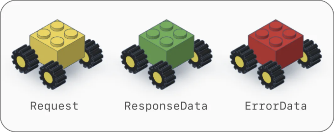
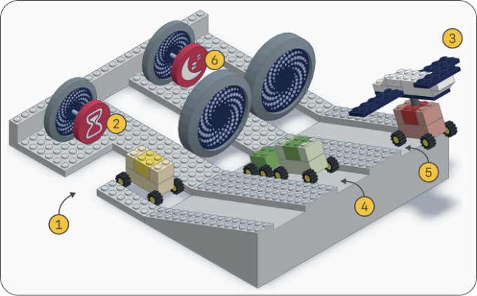
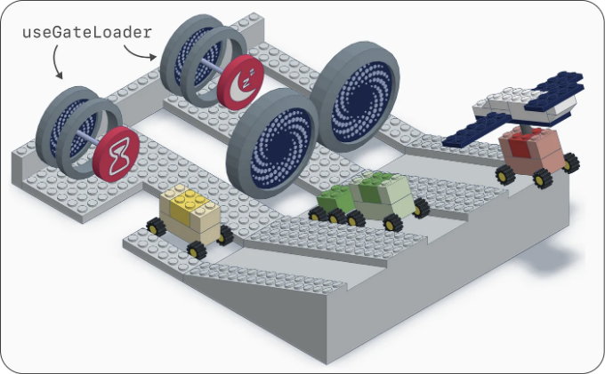
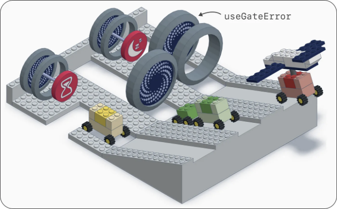
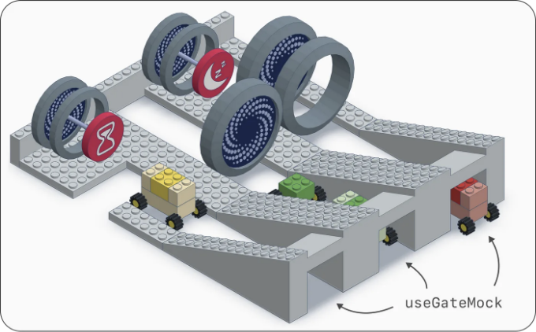

## React TS와 레고 블록이 만나면…


# 초록

레고 세계는 놀랍습니다. 그 특별한 간단함으로 어린이와 성인들의 창의력을 자극합니다. 저는 여기에 잠재력을 보고 React TS 개발자로서 레고 블록의 마법을 일터 경험으로 가져오고 싶습니다.

<!-- ui-log 수평형 -->
<ins class="adsbygoogle"
  style="display:block"
  data-ad-client="ca-pub-4877378276818686"
  data-ad-slot="9743150776"
  data-ad-format="auto"
  data-full-width-responsive="true"></ins>
<component is="script">
(adsbygoogle = window.adsbygoogle || []).push({});
</component>

React TS를 선택해야 하는 이유는 웹 애플리케이션을 구현하는 가장 좋은 방법이기 때문이죠.
React 16.8에서 소개된 훅스가 그 핵심입니다. 훅스가 무엇인지, 코드를 덜 verbose하게 만들어주며 더 읽기 쉽고 다양하게 만드는 방법을 살펴보겠습니다. 물론, LEGO로 표현합니다. 🙂

# 목차

- 소개
- 타입 – 요청(request), 응답 데이터(ResponseData), 에러 데이터(ErrorData)
- 타입 – GateRequest, GateResponse, GateError
- 타입 – GateCallbacks
- 훅스 – useAxios
- 훅스 – useGateLoader
- 훅스 – useGateError
- 훅스 – useGateMock

# 1. 소개

<!-- ui-log 수평형 -->
<ins class="adsbygoogle"
  style="display:block"
  data-ad-client="ca-pub-4877378276818686"
  data-ad-slot="9743150776"
  data-ad-format="auto"
  data-full-width-responsive="true"></ins>
<component is="script">
(adsbygoogle = window.adsbygoogle || []).push({});
</component>

이 기사에는 형식 관리에 관한 세 가지 섹션이 포함되어 있고 후크 구현에 관한 네 개의 섹션이 더 있습니다.

여기서 React TS 애플리케이션의 네트워킹 레이어에 초점을 맞춥니다. 이 레이어는 useAxios라는 사용자 정의 React 후크에 의해 처리될 것입니다. 이미 axios를 알고 계신가요? REST(Representational State Transfer)가 가장 일반적인 시나리오인 HTTP 클라이언트를 통합하는 데 가장 인기 있는 라이브러리입니다.

제가 모르는 것일지도 모르겠지만, 네트워킹 레이어는 공항을 떠올리게 합니다. 특히:

- Gate = REST API (예: POST /payment, GET /payment-status 게이트)
- Terminal = scope에 따라 그룹화된 게이트 세트 (예: "payment" 터미널)

<!-- ui-log 수평형 -->
<ins class="adsbygoogle"
  style="display:block"
  data-ad-client="ca-pub-4877378276818686"
  data-ad-slot="9743150776"
  data-ad-format="auto"
  data-full-width-responsive="true"></ins>
<component is="script">
(adsbygoogle = window.adsbygoogle || []).push({});
</component>

우리의 레고 경험 중에 이것을 기억해주세요. 설레시나요? 그럼, 출발해봅시다!

## 2. 종류 – 요청(Request), 응답 데이터(ResponseData), 오류 데이터(ErrorData)

React TS 애플리케이션에서 영웅들의 목록을 관리하기 위해 구현 중이라고 상상해봅시다. 오늘은 지정된 목록에 영웅을 추가하기 위해 POST API를 통합해야 합니다. 따라서 백엔드 친구가 다음 가짜 정보를 제공했습니다:

```js
const method = 'POST'
const url = `https://my-backend/v1/hero/${heroesListId}?top=${top}`

type Hero = {
  name: string
  terrestrial: boolean
  strength: number | undefined
}

type Request = {
  headers: { token: string }     // 요청 헤더
  path: { heroesListId: number } // 경로 매개변수
  params: { top: boolean }       // 쿼리 문자열 매개변수
  data: Hero                     // 본문
}

type ResponseData = Hero // ✅ 성공한 경우 (추가된 영웅)

type ErrorData = { // ❌ 실패한 경우 (오류 발생)
  code: string
  description: string
}
```

<!-- ui-log 수평형 -->
<ins class="adsbygoogle"
  style="display:block"
  data-ad-client="ca-pub-4877378276818686"
  data-ad-slot="9743150776"
  data-ad-format="auto"
  data-full-width-responsive="true"></ins>
<component is="script">
(adsbygoogle = window.adsbygoogle || []).push({});
</component>

지금까지 꽤 쉬웠죠. 마지막 세 가지 유형(Request, ResponseData, ErrorData)은 API 왕복 여정의 형태를 정의합니다. LEGO 세계에서 이러한 유형들은 다음과 같은 멋진 차량으로 변합니다.



바퀴들은 어디에 사용할까요? 곧 알게 될 거에요. 😜

### 3. 유형 – GateRequest, GateResponse, GateError

<!-- ui-log 수평형 -->
<ins class="adsbygoogle"
  style="display:block"
  data-ad-client="ca-pub-4877378276818686"
  data-ad-slot="9743150776"
  data-ad-format="auto"
  data-full-width-responsive="true"></ins>
<component is="script">
(adsbygoogle = window.adsbygoogle || []).push({});
</component>

자, 이제 POST API를 공항 게이트로 상상해봅시다. 제가 소개한 대로요. 그러면 axios에 의해 노출된 다음 세 가지 일반적인 형식들의 이름을 변경할 수 있어요:

```js
import { AxiosError, AxiosRequestConfig, AxiosResponse } from 'axios'

type GateRequest<D> = AxiosRequestConfig & D
type GateResponse<T> = AxiosResponse<T>
type GateError<E> = AxiosError<E>
```

알겠죠, 이것은 복잡해 보일 수 있어요... 이 새로운 형식들은 뭐죠?? 음, axios는 요청의 모양, responseData 및 errorData를 지정할 수 있도록 일반 형식을 사용해요. 이 개념을 명확히 하기 위해 두 가지 예제를 살펴보죠:

```js
// 예제 1
const request: Request = {
  headers: { token: '1234' },
  path: { heroListId: 0 },
  params: { top: true },
  data: { name: 'Ironman', terrestrial: true },
}
const gateRequest: GateRequest<Request> = {
  method: 'POST',
  url: `https://my-backend/v1/hero/${request.path.heroListId}`,
  ...request,
}

// 예제 2
const responseData: ResponseData = {
  name: 'Ironman',
  terrestrial: true,
}
const gateResponse: GateResponse<ResponseData> = {
  status: 200,
  statusText: 'OK',
  data: responseData,
}
```

<!-- ui-log 수평형 -->
<ins class="adsbygoogle"
  style="display:block"
  data-ad-client="ca-pub-4877378276818686"
  data-ad-slot="9743150776"
  data-ad-format="auto"
  data-full-width-responsive="true"></ins>
<component is="script">
(adsbygoogle = window.adsbygoogle || []).push({});
</component>

❗중요 – 위에서 언급된 Gate* 유형들은 내부적으로 다음과 같은 특징을 가지고 있습니다:

- meta-info = 유형이 고정될 수 있는 필드들 (예: method, url, status, …)
- data-info = 유형이 확장될 수 있는 필드들 (예: data, params, …)

후자는 이전에 본 Request, ResponseData, ErrorData 유형과 일치합니다. 아마도 이것들이 Gate* 유형들과 일대일 대응됨을 짐작할 수 있습니다. 요약하면, 우리는 Gate* 유형들을 랩퍼로 생각할 수 있습니다. 아래의 LEGO 차량들로 표시된 것처럼요.

이 텍스트를 Markdown 형식으로 바꾸었습니다.


<!-- ui-log 수평형 -->
<ins class="adsbygoogle"
  style="display:block"
  data-ad-client="ca-pub-4877378276818686"
  data-ad-slot="9743150776"
  data-ad-format="auto"
  data-full-width-responsive="true"></ins>
<component is="script">
(adsbygoogle = window.adsbygoogle || []).push({});
</component>

조금 헷갈리신 가요? 걱정하지 마세요. 곧 이러한 유형들을 사용하면 모든 것이 더욱 명확해질 거예요. 💪

# 4. 유형 - GateCallbacks

위에서 설명한 세 가지 Gate* 유형에 추가로 일반적인 유형을 소개해야 합니다:

```js
export type GateCallbacks<T, E> = {
  onIdle?: () => void
  onPending?: () => void
  onSuccess?: (data: T, response: GateResponse<T>) => void
  onFailure?: (error: GateError<E>) => void
}
```

<!-- ui-log 수평형 -->
<ins class="adsbygoogle"
  style="display:block"
  data-ad-client="ca-pub-4877378276818686"
  data-ad-slot="9743150776"
  data-ad-format="auto"
  data-full-width-responsive="true"></ins>
<component is="script">
(adsbygoogle = window.adsbygoogle || []).push({});
</component>

4 개의 콜백을 형성하기 위해 useAxios 훅에서 사용되는 콜백 유형은 다음과 같습니다.

필요하다면, 이 섹션으로 다시 돌아오세요.

# 5. Hook – useAxios

지금까지 우리는 타입을 다루었는데, 이제 useAxios 훅을 구현하는 재미있는 시간입니다.

<!-- ui-log 수평형 -->
<ins class="adsbygoogle"
  style="display:block"
  data-ad-client="ca-pub-4877378276818686"
  data-ad-slot="9743150776"
  data-ad-format="auto"
  data-full-width-responsive="true"></ins>
<component is="script">
(adsbygoogle = window.adsbygoogle || []).push({});
</component>

```typescript
// axios.hook.ts

import axios from 'axios'
import { GateCallbacks, GateError, GateRequest, GateResponse } from 'src/types'

export const useAxios = <D, T, E>() => {

  const crossGate = async (
    request: GateRequest<D>,
    callbacks: GateCallbacks<T, E>
  ) => {
    const { onSuccess, onFailure, onIdle, onPending } = callbacks
    try {
      onPending?.()
      const response = (await axios.request(request)) as GateResponse<T>
      onSuccess?.(response.data, response)
    } catch (error) {
      onFailure?.(error as GateError<E>)
    } finally {
      onIdle?.()
    }
  }

  return { crossGate }
}
```

이 기사를 읽고 계신다면 프로그래밍 경험이 있으시다는 걸 알겠습니다. 그래서 설명은 생략하겠습니다. 제가 두 가지 관찰 내용을 공유하겠습니다:

- 모든 콜백은 crossGate 함수의 선택적 매개변수이므로 .? 연산자를 사용하여 안전하게 호출됩니다.
- 해당 후크는 이전 섹션에서 보았던 D, T, E 제네릭 타입을 사용합니다.

여기에 사용 예시가 있습니다:

<!-- ui-log 수평형 -->
<ins class="adsbygoogle"
  style="display:block"
  data-ad-client="ca-pub-4877378276818686"
  data-ad-slot="9743150776"
  data-ad-format="auto"
  data-full-width-responsive="true"></ins>
<component is="script">
(adsbygoogle = window.adsbygoogle || []).push({});
</component>

```js
// 사용 예시

const request: Request = { // ⬅️ 위에서 정의된대로
  headers: { token: '1234' },
  path: { heroListId: 0 },
  params: { top: true },
  data: { name: 'Ironman', terrestrial: true },
}
const gateRequest: GateRequest<Request> = { // ⬅️ 위에서 정의된대로
  method: 'POST',
  url: `https://my-backend/v1/hero/${request.path.heroListId}`,
  ...request,
}

const { crossGate } = useAxios()

crossGate(
  gateRequest,
  {
    onSuccess: (responseData, gateResponse) => {
      console.log(responseData)
      console.log(gateResponse.data) // responseData와 동일
      console.log(gateResponse.status)
    },
    onFailure: console.error,
  }
)
```

그럼 이상으로, 이를 LEGO 블록으로 어떻게 번역할까요?



위 그림에서 보시다시피, 흐름은 아래와 같습니다:```

<!-- ui-log 수평형 -->
<ins class="adsbygoogle"
  style="display:block"
  data-ad-client="ca-pub-4877378276818686"
  data-ad-slot="9743150776"
  data-ad-format="auto"
  data-full-width-responsive="true"></ins>
<component is="script">
(adsbygoogle = window.adsbygoogle || []).push({});
</component>

- crossGate 함수가 게이트 요청(노란 차량)과 함께 호출됩니다.
- 대기 중인 콜백인 onPending이 호출됩니다.
- 게이트 차량을 운송하는 비행기로 표시된 HTTP 왕복이 시작됩니다.
- 요청이 성공적으로 이행될 수 있으므로, ResponseData와 GateResponse(녹색 차량)와 함께 onSuccess 콜백이 호출됩니다.
- 요청이 실패할 수 있으므로, 발생한 GateError(빨간 차량)와 함께 onFailure 콜백이 호출됩니다.
- 4와 5의 경우에는 onIdle 콜백이 모두 호출됩니다.

# 6. 후크 – useGateLoader

이전 섹션에서, 요청 상태에 대해 crossGate 호출자에게 알리기 위해 onIdle과 onPending 선택적 콜백을 사용했습니다. 코드를 중앙 집중화하기 위해 useGateLoader라는 새로운 후크를 통합하여 기본 동작을 설정할 수 있습니다.

```js
// gate-loader.hook.ts

export const useGateLoader = (gateId: string) => { // ⬅️ 새로운 후크
  const handleIdle = () => {
    console.log('TODO - 대기 중 상태의 중앙 관리 (예: Recoil 사용)')
    console.log(`gateId=${gateId}`)
  }

  const handlePending = () => {
    console.log('TODO - 대기 중 상태의 중앙 관리 (예: Recoil 사용)')
    console.log(`gateId=${gateId}`)
  }

  return { handleIdle, handlePending }
}
```

<!-- ui-log 수평형 -->
<ins class="adsbygoogle"
  style="display:block"
  data-ad-client="ca-pub-4877378276818686"
  data-ad-slot="9743150776"
  data-ad-format="auto"
  data-full-width-responsive="true"></ins>
<component is="script">
(adsbygoogle = window.adsbygoogle || []).push({});
</component>

```js
// axios.hook.ts

import axios from 'axios'
import { GateCallbacks, GateError, GateRequest, GateResponse } from 'src/types'

import { useGateLoader } from './gate-loader.hook' // ⬅️ 새로운 import

export const useAxios = <D, T, E>(gateId: string) => { // ⬅️ 새로운 gateId 매개변수 (중앙화에 유용함)
  const { handleIdle, handlePending } = useGateLoader(gateId) // ⬅️ 새로운 hook 호출 

  const crossGate = async (
    request: GateRequest<D>,
    callbacks: GateCallbacks<T, E>
  ) => {
    const { 
      onSuccess,
      onFailure,
      onIdle = handleIdle,      // ⬅️ 새로운 기본 콜백
      onPending = handlePending // ⬅️ 새로운 기본 콜백
    } = callbacks
    try {
      onPending() // ⬅️ 새로운 기본 콜백 덕분에 더 이상 ?. 연산자가 필요하지 않음
      const response = (await axios.request(request)) as GateResponse<T>
      onSuccess?.(response.data, response)
    } catch (error) {
      onFailure?.(error as GateError<E>)
    } finally {
      onIdle() // ⬅️ 새로운 기본 콜백 덕분에 더 이상 ?. 연산자가 필요하지 않음
    }
  }

  return { crossGate }
}
```

여기가 훅의 힘입니다: 두 가지 다른 구현을 두 가지 다른 훅으로 분리한 다음, 마치... 레고처럼 통합했습니다!



이제 onIdle 및 onPending에 관계된 두 개의 전방 포털이 꺼져 있습니다. 왜냐하면 이 시나리오에서 호출자가 그 값을 전달하지 않았기 때문이죠. 그러나 코드에서 볼 수 있듯이 기본 콜백을 나타내는 두 개의 켜진 포털이 뒤에 있습니다.```

<!-- ui-log 수평형 -->
<ins class="adsbygoogle"
  style="display:block"
  data-ad-client="ca-pub-4877378276818686"
  data-ad-slot="9743150776"
  data-ad-format="auto"
  data-full-width-responsive="true"></ins>
<component is="script">
(adsbygoogle = window.adsbygoogle || []).push({});
</component>

# 7. 후크 - useGateError

요행이 먹어들이는 것과 함께 오류 처리를 위해 이전 방법을 적응시킬 수 있습니다. 그래서 우리는 useGateError 후크를 소개합니다.

```js
// gate-error.hook.ts

import { GateError } from 'src/types'

export const useGateError = <E>(gateId: string) => { // ⬅️ 새로운 후크
  const handleFailure = (error: GateError<E>) => {
    console.log('할 일 - 오류들의 중앙 집중 관리 (예를 들어 Recoil 사용)')
    console.log(`gateId=${gateId}`)
    console.log(error)
  }
  return { handleFailure }
}
```

```js
// axios.hook.ts

import axios from 'axios'
import { GateCallbacks, GateError, GateRequest, GateResponse } from 'src/types'

import { useGateError } from './gate-error.hook' // ⬅️ 새로운 임포트
import { useGateLoader } from './gate-loader.hook'

export const useAxios = <D, T, E>(gateId: string) => {
  const { handleIdle, handlePending } = useGateLoader(gateId)
  const { handleFailure } = useGateError<E>(gateId) // ⬅️ 새로운 후크 호출

  const crossGate = async (request: GateRequest<D>, callbacks: GateCallbacks<T, E>) => {
    const {
      onSuccess,
      onFailure = handleFailure, // ⬅️ 기본 콜백
      onIdle = handleIdle,
      onPending = handlePending,
    } = callbacks
    try {
      onPending()
      const response = (await axios.request(request)) as GateResponse<T>
      onSuccess?.(response.data, response)
    } catch (error) {
      onFailure(error as GateError<E>) // ⬅️ 새로운: 기본 콜백 덕분에 ?. 연산자가 더 이상 필요하지 않습니다
    } finally {
      onIdle()
    }
  }

  return { crossGate }
}
```

<!-- ui-log 수평형 -->
<ins class="adsbygoogle"
  style="display:block"
  data-ad-client="ca-pub-4877378276818686"
  data-ad-slot="9743150776"
  data-ad-format="auto"
  data-full-width-responsive="true"></ins>
<component is="script">
(adsbygoogle = window.adsbygoogle || []).push({});
</component>

상상하실 수 있겠지만, LEGO 버전의 이 통합은 이전 것과도 비슷합니다.



이 시나리오에서 호출자는 onFailure 콜백을 매개변수로 전달하지 않기 때문에 발생한 GateError는 기본 콜백(켜진 뒷문 포털로 나타냄)에 의해 처리됩니다.

# 8. 훅 – useGateMock

<!-- ui-log 수평형 -->
<ins class="adsbygoogle"
  style="display:block"
  data-ad-client="ca-pub-4877378276818686"
  data-ad-slot="9743150776"
  data-ad-format="auto"
  data-full-width-responsive="true"></ins>
<component is="script">
(adsbygoogle = window.adsbygoogle || []).push({});
</component>

useAxios에 통합하는 마지막 후크는 모의 데이터를 관리하는 useGateMock과 관련이 있습니다.

모의 데이터를 관리하고 활성화/비활성화하는 것은 쉽지 않을 수 있으므로, console.log에서 추천하는 대로 전용 외부 후크(e.g. useMockend)에 의존하는 것이 더 나을 수 있습니다.

```js
// gate-mock.hook.ts

export const useGateMock = (gateId: string) => {
  console.log(
    'TODO - 중앙 집중식 모의 데이터 활성화/비활성화 (예: 사용자 지정 후크 "useMockend"를 사용하여)'
  )
  console.log(`gateId=${gateId}`)
  const mocked = false

  const getMock = () => {
    console.log('TODO - 여기서 모의 데이터를 반환할 수 있습니다 (예: 사용자 지정 후크 "useMockend"를 사용하여)')
    console.log(`gateId=${gateId}`)
    return Promise.resolve({ data: {} })
  }

  return { mocked, getMock }
}
```

```js
// axios.hook.ts

import axios from 'axios'
import { GateCallbacks, GateError, GateRequest, GateResponse } from 'src/types'

import { useGateError } from './gate-error.hook'
import { useGateLoader } from './gate-loader.hook'
import { useGateMock } from './gate-mock.hook' // ⬅️ 새로운 import 부분

export const useAxios = <D, T, E>(gateId: string) => {
  const { handleIdle, handlePending } = useGateLoader(gateId)
  const { handleFailure } = useGateError<E>(gateId)
  const { mocked, getMock } = useGateMock(gateId) // ⬅️ 새로운 후크 호출 부분

  const crossGate = async (request: GateRequest<D>, callbacks: GateCallbacks<T, E>) => {
    const {
      onSuccess,
      onFailure = handleFailure,
      onIdle = handleIdle,
      onPending = handlePending,
    } = callbacks
    try {
      onPending()
      const response = (
        mocked              // ⬅️ 모의 데이터인지 확인
          ? await getMock() // ⬅️ 모의 데이터 사용 부분
          : await axios.request(request)
      ) as GateResponse<T>
      onSuccess?.(response.data, response)
    } catch (error) {
      onFailure(error as GateError<E>)
    } finally {
      onIdle()
    }
  }

  return { crossGate }
}
```

<!-- ui-log 수평형 -->
<ins class="adsbygoogle"
  style="display:block"
  data-ad-client="ca-pub-4877378276818686"
  data-ad-slot="9743150776"
  data-ad-format="auto"
  data-full-width-responsive="true"></ins>
<component is="script">
(adsbygoogle = window.adsbygoogle || []).push({});
</component>

이제 응답은 목 모드가 활성화되어 있는지에 따라 실제일 수도 가짜일 수도 있습니다. 이것은 길에 갈림길처럼 보입니다, 따라서 useGateMock의 LEGO 표현은 다음과 같습니다.



여기에는 비행기나 비행이 없습니다: 호출 결과는 이제 터널에 표시된 것처럼 가짜입니다.

LEGO 비유를 즐기셨기를 바랍니다. 개선할 점이 있다면 피드백을 주시고 비슷한 기사를 더 작성하도록 격려해 주셔서 미디엄에서 팔로우해 주십시오.

<!-- ui-log 수평형 -->
<ins class="adsbygoogle"
  style="display:block"
  data-ad-client="ca-pub-4877378276818686"
  data-ad-slot="9743150776"
  data-ad-format="auto"
  data-full-width-responsive="true"></ins>
<component is="script">
(adsbygoogle = window.adsbygoogle || []).push({});
</component>

읽어 주셔서 감사합니다.