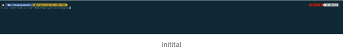
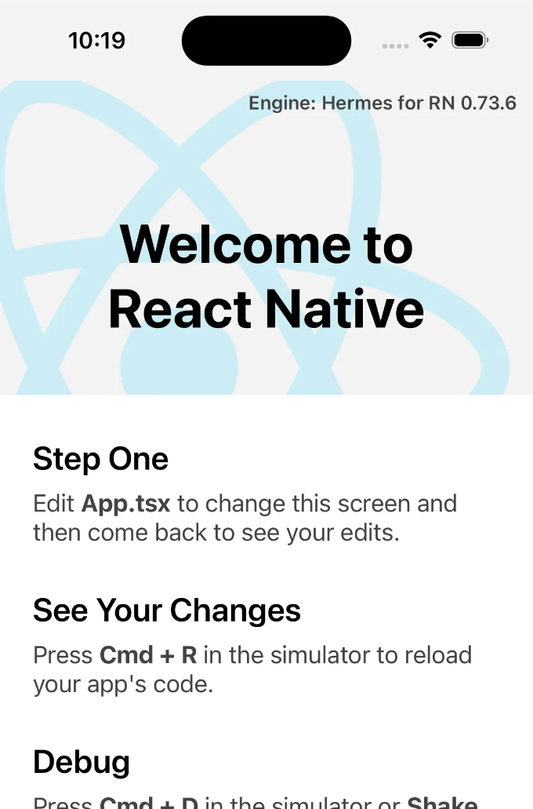
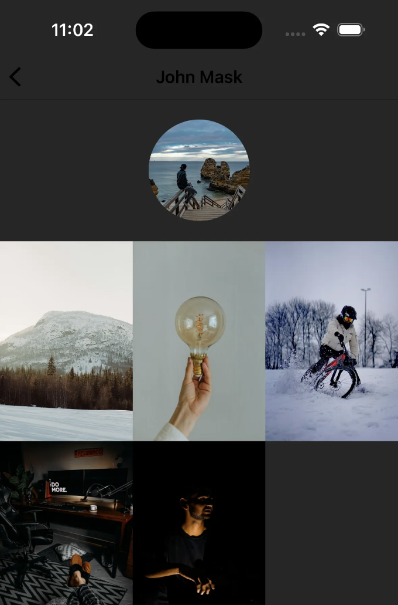
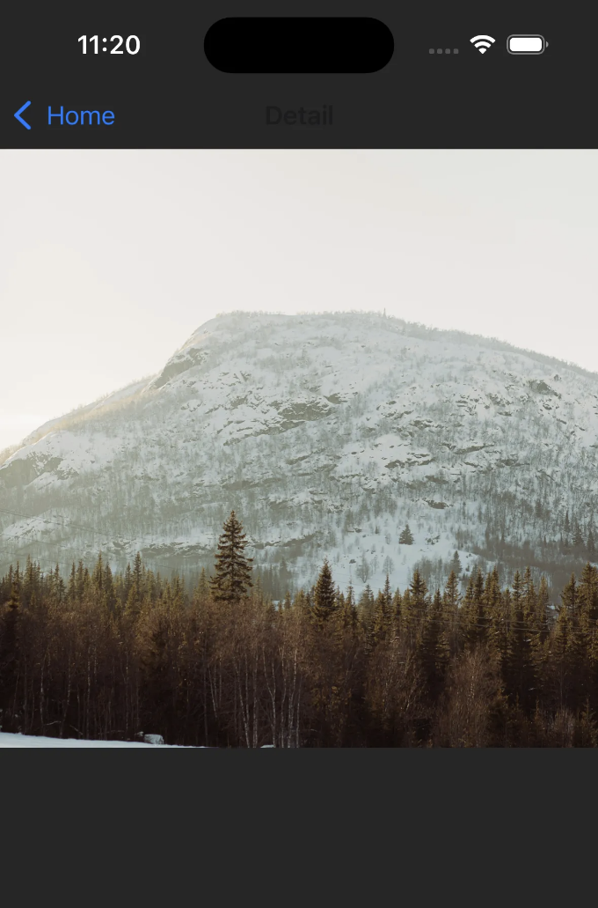

리액트 네이티브는 여러 플랫폼에서 동작하는 모바일 애플리케이션을 만드는 데 개발자들 사이에서 점점 더 인기를 얻고 있어요. 모바일 앱을 구축할 때 가장 중요한 요소 중 하나는 사용자에게 부드럽고 직관적인 내비게이션 경험을 제공하는 것이에요. 인스타그램은 세련되고 사용하기 편한 내비게이션으로 유명한데, 이를 참고하여 리액트 네이티브 앱을 개발할 때 영감을 받을 수 있어요.

인스타그램의 내비게이션은 간단하면서도 효과적인 구조를 따르는데, 피드, 검색, 카메라, 알림, 프로필 등 앱의 다양한 섹션 사이를 이동하기 위한 하단 탭이 있어요. 내비게이션 바는 화면 하단에 고정되어 있어 앱의 모든 주요 기능에 쉽게 접근할 수 있어요.

리액트 네이티브 앱에서 비슷한 내비게이션 경험을 제공하기 위해, 개발자들은 React Navigation과 같은 라이브러리를 활용할 수 있어요. React Navigation은 스택, 탭, 드로어 내비게이션을 포함한 다양한 내비게이션 옵션을 제공해요. 인스타그램과 유사한 내비게이션을 구현하기 위해서는 탭 내비게이션이 가장 적합한 선택일 거예요.

탭 내비게이션 외에도, 인스타그램은 새로운 사진이나 비디오를 게시하는 기능과 같은 모달 화면을 활용해요. 이는 현재 화면 위에 겹쳐지는 모달 컴포넌트를 사용하여 리액트 네이티브에서 구현할 수 있어요. 이렇게하면 새로운 포스트를 만드는 등 특정 작업을 위해 집중된 화면을 제공할 수 있어요.

<!-- ui-log 수평형 -->
<ins class="adsbygoogle"
  style="display:block"
  data-ad-client="ca-pub-4877378276818686"
  data-ad-slot="9743150776"
  data-ad-format="auto"
  data-full-width-responsive="true"></ins>
<component is="script">
(adsbygoogle = window.adsbygoogle || []).push({});
</component>

목차

- 재료
- React Navigation 초기화 및 통합
- UI 구성
- react-native-reanimated를 사용한 애니메이션 설정

# 재료

여기에 제 설치에 대한 간단한 요약이 있습니다:

<!-- ui-log 수평형 -->
<ins class="adsbygoogle"
  style="display:block"
  data-ad-client="ca-pub-4877378276818686"
  data-ad-slot="9743150776"
  data-ad-format="auto"
  data-full-width-responsive="true"></ins>
<component is="script">
(adsbygoogle = window.adsbygoogle || []).push({});
</component>

- 안드로이드 스튜디오 (이구아나)
- Xcode (v15.2)
- iTerm
- Nvim (나의 설정, 타쿠야와 레이지 빔에 의해 사용자 정의된 설정)
- Node.js (v18.19.0)
- Yarn (v1.22.21)
- Npm (v10.2.3)
- Ruby (v2.7.6)
- Cocoapods (v1.15.2)

# React Navigation 초기 설정 및 통합

오늘은 그들을 하는 방법에 대해 안내해 드리겠습니다.

먼저, 리액트 네이티브 프로젝트를 초기화해야 합니다.

<!-- ui-log 수평형 -->
<ins class="adsbygoogle"
  style="display:block"
  data-ad-client="ca-pub-4877378276818686"
  data-ad-slot="9743150776"
  data-ad-format="auto"
  data-full-width-responsive="true"></ins>
<component is="script">
(adsbygoogle = window.adsbygoogle || []).push({});
</component>

```markdown


```js
npx react-native init ReactNavigationInstagram
```

처음으로 성공했을 때,

```js
cd ReactNavigationInstagram
yarn ios
```

<!-- ui-log 수평형 -->
<ins class="adsbygoogle"
  style="display:block"
  data-ad-client="ca-pub-4877378276818686"
  data-ad-slot="9743150776"
  data-ad-format="auto"
  data-full-width-responsive="true"></ins>
<component is="script">
(adsbygoogle = window.adsbygoogle || []).push({});
</component>

우선 실행하십시오,



이제 React Native에서 화면간에 이동하기 위해 react-navigation을 설치해야 합니다.
저는 react-navigation 버전 6.x를 사용하고 있어요.
react-navigation 가이드를 따라해보세요.
제가 통합한 react-navigation 버전은 다음과 같아요.

```js
"@react-navigation/native": "^6.1.17",
"@react-navigation/native-stack": "^6.9.26",
"react-native-safe-area-context": "^4.9.0",
"react-native-screens": "^3.30.1"
```

<!-- ui-log 수평형 -->
<ins class="adsbygoogle"
  style="display:block"
  data-ad-client="ca-pub-4877378276818686"
  data-ad-slot="9743150776"
  data-ad-format="auto"
  data-full-width-responsive="true"></ins>
<component is="script">
(adsbygoogle = window.adsbygoogle || []).push({});
</component>

```js
yarn add @react-navigation/native

yarn add react-native-screens react-native-safe-area-context

yarn add @react-navigation/native-stack


// 그런 다음 @react-navigation을 성공적으로 설치한 후 IOS에 설치하십시오

cd ios && pod install && cd ..
```

그런 다음 App.tsx 파일을 업데이트해야 합니다.

```js
/**
 * 샘플 React Native 앱
 * https://github.com/facebook/react-native
 *
 * @format
 */

import {NavigationContainer, useNavigation} from '@react-navigation/native';
import React from 'react';
import {
  NativeStackNavigationProp,
  createNativeStackNavigator,
} from '@react-navigation/native-stack';

import {StyleSheet, Text, TouchableOpacity, View} from 'react-native';

function DetailsScreen() {
  return (
    <View style={styles.sectionContainer}>
      <Text>세부 화면</Text>
    </View>
  );
}

type HomeScreenNavigationProp = NativeStackNavigationProp<
  RootStackParamList,
  'Home'
>;

function HomeScreen() {
  const navigation = useNavigation<HomeScreenNavigationProp>();
  return (
    <View style={styles.sectionContainer}>
      <Text>홈 화면</Text>
      <TouchableOpacity
        style={styles.button}
        onPress={() => navigation.navigate('Detail')}>
        <Text style={styles.titleButton}>상세 화면 열기</Text>
      </TouchableOpacity>
    </View>
  );
}

type RootStackParamList = {
  Home: undefined;
  Detail: undefined;
};

const Stack = createNativeStackNavigator<RootStackParamList>();

function App(): React.JSX.Element {
  return (
    <NavigationContainer>
      <Stack.Navigator initialRouteName="Home">
        <Stack.Screen name="Home" component={HomeScreen} />
        <Stack.Screen name="Detail" component={DetailsScreen} />
      </Stack.Navigator>
    </NavigationContainer>
  );
}

const styles = StyleSheet.create({
  sectionContainer: {
    flex: 1,
    alignItems: 'center',
    justifyContent: 'center',
  },
  button: {
    padding: 24,
    marginTop: 20,
    backgroundColor: '#f5c1f5',
  },
  titleButton: {
    fontSize: 14,
    color: 'black',
  },
});

export default App;
```

이것은 react-navigation 통합 결과입니다.
```  

<!-- ui-log 수평형 -->
<ins class="adsbygoogle"
  style="display:block"
  data-ad-client="ca-pub-4877378276818686"
  data-ad-slot="9743150776"
  data-ad-format="auto"
  data-full-width-responsive="true"></ins>
<component is="script">
(adsbygoogle = window.adsbygoogle || []).push({});
</component>


# UI 구축

홈, 포스트, 상세 3개의 화면을 만들어야 합니다.
홈 화면에는 여러 이미지를 포함한 포스트 목록이 있을 것입니다. 이미지를 클릭하면 해당 이미지의 세부 정보인 상세 화면이 표시됩니다. 또한 사용자는 작성자의 프로필 세부 정보를 보기 위해 아바타를 클릭하여 포스트 화면으로 이동할 수 있습니다.

홈 화면에서는 포스트 컴포넌트를 만들어 포스트 목록을 렌더링할 것입니다.

<!-- ui-log 수평형 -->
<ins class="adsbygoogle"
  style="display:block"
  data-ad-client="ca-pub-4877378276818686"
  data-ad-slot="9743150776"
  data-ad-format="auto"
  data-full-width-responsive="true"></ins>
<component is="script">
(adsbygoogle = window.adsbygoogle || []).push({});
</component>

```js
import {NativeStackNavigationProp} from '@react-navigation/native-stack';
import React, {useState} from 'react';
import {
  View,
  Text,
  StyleSheet,
  Image,
  Dimensions,
  NativeSyntheticEvent,
  NativeScrollEvent,
  TouchableOpacity,
  FlatList,
} from 'react-native';
import {RootStackParamList} from '../App';
import {useNavigation} from '@react-navigation/native';

export interface IPost {
  id: number;
  name: string;
  avatar: string;
  images: {id: number; image: string}[];
}

const {width: WIDTH_SCREEN, height: HEIGHT_SCREEN} = Dimensions.get('window');

type PostScreenNavigationProp = NativeStackNavigationProp<
  RootStackParamList,
  'Post'
>;

const Post: React.FC<IPost> = ({id, images, avatar, name}) => {
  const navigation = useNavigation<PostScreenNavigationProp>();
  const [currentImageIndex, setCurrentImageIndex] = useState<number>(0);
  const handleScroll = (event: NativeSyntheticEvent<NativeScrollEvent>) => {
    const contentOffsetX = event.nativeEvent.contentOffset.x;
    const imageIndex = Math.floor(contentOffsetX / WIDTH_SCREEN);
    setCurrentImageIndex(imageIndex);
  };

  let bullets = [];
  for (let i = 1; i <= images.length; i++) {
    bullets.push(
      <Text
        key={i}
        style={
          ...styles.bullet,
          opacity: currentImageIndex + 1 === i ? 0.5 : 0.1,
        }>
        &bull;
      </Text>,
    );
  }

  return (
    <View style={styles.container}>
      <TouchableOpacity
        onPress={event => {
          event.stopPropagation();
          navigation.navigate('Post', {
            data: {
              id,
              images,
              avatar,
              name,
            },
          });
        }}
        style={styles.header}
      >
        <View style={styles.headerContent}>
          <Image src={avatar} resizeMode="center" style={styles.avatar} />
          <Text>{name}</Text>
        </View>
      </TouchableOpacity>
      <FlatList
        horizontal
        decelerationRate={0}
        snapToInterval={WIDTH_SCREEN}
        onScroll={handleScroll}
        snapToAlignment={'center'}
        pagingEnabled
        scrollEventThrottle={200}
        contentContainerStyle={{ width: WIDTH_SCREEN * images.length }}
        showsHorizontalScrollIndicator={false}
        data={images}
        renderItem={({ item }) => (
          <TouchableOpacity
            key={item.id.toString()}
            activeOpacity={0.9}
            onPress={() => navigation.navigate('Detail', { data: item })}
          >
            <Image src={item.image} resizeMode="cover" style={styles.img} />
          </TouchableOpacity>
        )}
      />
      <View style={styles.bullets}>{bullets}</View>
    </View>
  );
};

const styles = StyleSheet.create({
  container: {
    width: '100%',
    height: HEIGHT_SCREEN * 0.7,
    position: 'relative',
  },
  img: {
    width: WIDTH_SCREEN,
    height: '100%',
  },
  headerContent: {
    flexDirection: 'row',
    alignItems: 'center',
  },
  header: {
    position: 'absolute',
    top: 14,
    left: 14,
    zIndex: 1,
  },
  bullets: {
    position: 'absolute',
    bottom: 0,
    display: 'flex',
    justifyContent: 'flex-start',
    right: 'auto',
    alignSelf: 'center',
    flexDirection: 'row',
    paddingHorizontal: 10,
    paddingTop: 5,
  },
  bullet: {
    paddingHorizontal: 5,
    fontSize: 20,
  },
  avatar: {
    width: 50,
    height: 50,
    borderRadius: 60,
    marginRight: 10,
  },
});

export default Post;
```

이후, Post 컴포넌트를 기반으로 한 게시물 목록을 생성하여 홈 화면을 형성하겠습니다.

```js
import React from 'react';
import {StyleSheet, View, FlatList, Dimensions} from 'react-native';
import Post, {IPost} from '../components/Post';
import {HOME_DATA} from '../data/home-data';
import {SafeAreaView} from 'react-native-safe-area-context';
const {height: HEIGHT_SCREEN} = Dimensions.get('window');

function HomeScreen() {
  const renderItem = ({ item }: { item: IPost }) => {
    return <Post {...item} />;
  };
  return (
    <View style={styles.container}>
      <SafeAreaView style={styles.container}>
        <FlatList
          data={Array.from({ length: 5 }, (_, index) => ({
            ...HOME_DATA,
            id: index + 1,
          }))}
          showsVerticalScrollIndicator={false}
          renderItem={renderItem}
          getItemLayout={(data, index) => ({
            length: HEIGHT_SCREEN * 0.7,
            offset: HEIGHT_SCREEN * 0.7 * index,
            index,
          })}
          keyExtractor={item => item.id.toString()}
        />
      </SafeAreaView>
    </View>
  );
}

const styles = StyleSheet.create({
  container: {
    flex: 1,
    backgroundColor: '#262626',
  },
});

export default HomeScreen;
```

그리고 여기가 홈 화면의 UI 결과입니다.
```

<!-- ui-log 수평형 -->
<ins class="adsbygoogle"
  style="display:block"
  data-ad-client="ca-pub-4877378276818686"
  data-ad-slot="9743150776"
  data-ad-format="auto"
  data-full-width-responsive="true"></ins>
<component is="script">
(adsbygoogle = window.adsbygoogle || []).push({});
</component>


다음 단계로는 디테일 화면과 포스트 화면을 위한 UI를 생성할 예정이에요.

```js
import {useNavigation, useRoute} from '@react-navigation/native';
import React, {useLayoutEffect} from 'react';
import {
  View,
  StyleSheet,
  Image,
  FlatList,
  Dimensions,
  TouchableOpacity,
} from 'react-native';
import {NativeStackNavigationProp} from '@react-navigation/native-stack';
import {RootStackParamList} from '../App';

const {width: WIDTH_SCREEN} = Dimensions.get('window');

type DetailScreenNavigationProp = NativeStackNavigationProp<
  RootStackParamList,
  'Detail'
>;

function PostScreen() {
  const router = useRoute();
  const navigation = useNavigation<DetailScreenNavigationProp>();
  const {data} = router.params;
  useLayoutEffect(() => {
    navigation.setOptions({
      headerTitle: data.name,
      headerTitleStyle: {
        color: '#000000',
      },
      headerBackTitleVisible: false,
      headerTintColor: '#000000',
    });
  }, [navigation, data]);

  return (
    <View style={styles.container}>
      <Image src={data.avatar} style={styles.avatar} resizeMode={'center'} />
      <View style={styles.content}>
        <FlatList
          numColumns={3}
          data={data.images}
          keyExtractor={(_, index) => index.toString()}
          renderItem={({item}) => {
            return (
              <TouchableOpacity
                onPress={() => navigation.navigate('Detail', {data: item})}
                activeOpacity={0.9}>
                <Image src={item.image} style={styles.image} />
              </TouchableOpacity>
            );
          }
        />
      </View>
    </View>
  );
}

const styles = StyleSheet.create({
  container: {
    flex: 1,
    backgroundColor: '#262626',
  },
  content: {
    flex: 1,
    marginTop: 20,
  },
  avatar: {
    width: 100,
    height: 100,
    borderRadius: 60,
    alignSelf: 'center',
    marginTop: 20,
  },
  image: {
    width: WIDTH_SCREEN / 3,
    height: (WIDTH_SCREEN / 3) * 1.5,
  },
});

export default PostScreen;
```



<!-- ui-log 수평형 -->
<ins class="adsbygoogle"
  style="display:block"
  data-ad-client="ca-pub-4877378276818686"
  data-ad-slot="9743150776"
  data-ad-format="auto"
  data-full-width-responsive="true"></ins>
<component is="script">
(adsbygoogle = window.adsbygoogle || []).push({});
</component>

```js
import {useRoute} from '@react-navigation/native';
import React from 'react';
import {View, StyleSheet, Text, Image} from 'react-native';

interface IProps {}

const DetailScreen: React.FC<IProps> = () => {
  const route = useRoute();
  const {data} = route.params;

  return (
    <View style={styles.container}>
      <Image src={data.image} style={styles.image} />
    </View>
  );
};

const styles = StyleSheet.create({
  container: {
    flex: 1,
    backgroundColor: '#262626',
  },
  image: {
    width: '100%',
    aspectRatio: '1/1',
    justifyContent: 'center',
  },
});

export default DetailScreen;
```



```js
/**
 * Sample React Native App
 * https://github.com/facebook/react-native
 *
 * @format
 */

import {NavigationContainer} from '@react-navigation/native';
import React from 'react';
import {createNativeStackNavigator} from '@react-navigation/native-stack';

import HomeScreen from './screens/HomeScreen';
import PostScreen from './screens/PostScreen';
import {IPost} from './components/Post';
import DetailScreen from './screens/DetailScreen';
import 'react-native-gesture-handler';

export type RootStackParamList = {
  Home: undefined;
  Detail: {data: {id: number; image: string}};
  Post: {data: IPost};
};

const Stack = createNativeStackNavigator<RootStackParamList>();

function App(): React.JSX.Element {
  return (
    <NavigationContainer>
      <Stack.Navigator initialRouteName="Home">
        <Stack.Screen
          name="Home"
          screenOptions={{presentation: 'transparentModal'}}
          component={HomeScreen}
        />
        <Stack.Screen
          name="Detail"
          options={{
            headerStyle: {
              backgroundColor: '#262626',
            },
          }}
          component={DetailScreen}
        />
        <Stack.Screen
          name="Post"
          options={{
            headerStyle: {
              backgroundColor: '#262626',
            },
            headerBackTitle: '',
          }}
          component={PostScreen}
        />
      </Stack.Navigator>
    </NavigationContainer>
  );
}

export default App;
```


```

<!-- ui-log 수평형 -->
<ins class="adsbygoogle"
  style="display:block"
  data-ad-client="ca-pub-4877378276818686"
  data-ad-slot="9743150776"
  data-ad-format="auto"
  data-full-width-responsive="true"></ins>
<component is="script">
(adsbygoogle = window.adsbygoogle || []).push({});
</component>

# react-native-reanimated을 사용하여 애니메이션 설정하기

먼저, react-native-reanimated 및 react-native-gesture-handler 라이브러리를 설치하고 설정해야 합니다.

## 1. react-native-reanimated

# 설치

<!-- ui-log 수평형 -->
<ins class="adsbygoogle"
  style="display:block"
  data-ad-client="ca-pub-4877378276818686"
  data-ad-slot="9743150776"
  data-ad-format="auto"
  data-full-width-responsive="true"></ins>
<component is="script">
(adsbygoogle = window.adsbygoogle || []).push({});
</component>

프로젝트에 Reanimated를 추가하는 데 세 가지 단계가 필요합니다:

# 단계 1: 패키지 설치

yarn을 통해 react-native-reanimated 패키지를 설치합니다:

```js
yarn add react-native-reanimated
```

<!-- ui-log 수평형 -->
<ins class="adsbygoogle"
  style="display:block"
  data-ad-client="ca-pub-4877378276818686"
  data-ad-slot="9743150776"
  data-ad-format="auto"
  data-full-width-responsive="true"></ins>
<component is="script">
(adsbygoogle = window.adsbygoogle || []).push({});
</component>

# 단계 2: Reanimated의 babel 플러그인 추가

babel.config.js에 react-native-reanimated/plugin 플러그인을 추가해주세요.

```js
module.exports = {
    presets: [
      ... // 여기에 추가하지 마세요 :)
    ],
    plugins: [
      ...
      'react-native-reanimated/plugin',
    ],
  };
```

# 단계 3: Metro 번들러 캐시 지우기 (권장 사항)

<!-- ui-log 수평형 -->
<ins class="adsbygoogle"
  style="display:block"
  data-ad-client="ca-pub-4877378276818686"
  data-ad-slot="9743150776"
  data-ad-format="auto"
  data-full-width-responsive="true"></ins>
<component is="script">
(adsbygoogle = window.adsbygoogle || []).push({});
</component>

```js
yarn start --reset-cache
```

# 플랫폼별 설정

## 안드로이드

추가 단계는 필요하지 않습니다.

<!-- ui-log 수평형 -->
<ins class="adsbygoogle"
  style="display:block"
  data-ad-client="ca-pub-4877378276818686"
  data-ad-slot="9743150776"
  data-ad-format="auto"
  data-full-width-responsive="true"></ins>
<component is="script">
(adsbygoogle = window.adsbygoogle || []).push({});
</component>

## iOS

iOS 개발 시, 앱을 실행하기 전에 먼저 pods를 설치해야 합니다:

```js
cd ios && pod install && cd ..
```

## 2. react-native-gesture-handler

<!-- ui-log 수평형 -->
<ins class="adsbygoogle"
  style="display:block"
  data-ad-client="ca-pub-4877378276818686"
  data-ad-slot="9743150776"
  data-ad-format="auto"
  data-full-width-responsive="true"></ins>
<component is="script">
(adsbygoogle = window.adsbygoogle || []).push({});
</component>

```js
yarn add react-native-gesture-handler

// 그리고 @react-navigation을 성공적으로 설치한 후에 IOS에서 다음을 설치하세요

cd ios && pod install && cd ..
```

우리가 해야 할 첫 번째 일은 애니메이션과 함께 작동할 수 있도록 만드는 것입니다. 네비게이션 효과를 전환하는 것.

```js
/**
 * 샘플 React Native 앱
 * https://github.com/facebook/react-native
 *
 * @format
 */

import {NavigationContainer} from '@react-navigation/native';
import React from 'react';
import {createNativeStackNavigator} from '@react-navigation/native-stack';
import {LogBox} from 'react-native';

import HomeScreen from './screens/HomeScreen';
import PostScreen from './screens/PostScreen';
import {IPost} from './components/Post';
import DetailScreen from './screens/DetailScreen';
import 'react-native-gesture-handler';
import {GestureHandlerRootView} from 'react-native-gesture-handler';

LogBox.ignoreLogs([
  'Non-serializable values were found in the navigation state',
]);
export type RootStackParamList = {
  Home: undefined;
  Detail: {
    data: {id: number; image: string};
    from?: any;
    parentId?: number;
    callback?: () => void;
  };
  Post: {data: IPost};
};

const Stack = createNativeStackNavigator<RootStackParamList>();

function App(): React.JSX.Element {
  return (
    <GestureHandlerRootView style={{flex: 1}}>
      <NavigationContainer>
        <Stack.Navigator initialRouteName="Home">
          <Stack.Screen
            options={{headerShown: false}}
            name="Home"
            component={HomeScreen}
          />
          <Stack.Screen
            options={{headerShown: false, presentation: 'transparentModal'}}
            name="Detail"
            component={DetailScreen}
          />
          <Stack.Screen
            name="Post"
            options={{
              headerStyle: {
                backgroundColor: '#262626',
              },
              headerBackTitle: '',
            }}
            component={PostScreen}
          />
        </Stack.Navigator>
      </NavigationContainer>
    </GestureHandlerRootView>
  );
}

export default App;
```

다음으로, Post 구성 요소에 일부 속성을 추가해야하며, 목록에서 고유한 키를 가져야 합니다. 여기서 중요한 속성은 sharedTransitionTag이며, 다음 네비게이션을 식별하는 데 사용됩니다. Reanimated가 sharedTransitionTag가있는 구성 요소가 마운트되거나 언마운트되고 있는 것을 감지하면, 동일한 sharedTransitionTag를 가진 마지막 등록된 뷰를 찾으려고 합니다.```

<!-- ui-log 수평형 -->
<ins class="adsbygoogle"
  style="display:block"
  data-ad-client="ca-pub-4877378276818686"
  data-ad-slot="9743150776"
  data-ad-format="auto"
  data-full-width-responsive="true"></ins>
<component is="script">
(adsbygoogle = window.adsbygoogle || []).push({});
</component>

```js
// 포스트 컴포넌트에서

const Post: React.FC<IPost> = ({id, images, avatar, name}) => {
  const navigation = useNavigation<PostScreenNavigationProp>();

  const [currentImageIndex, setCurrentImageIndex] = useState<number>(0);
  const avatarOpacity = useSharedValue(1);
  const handleScroll = (event: NativeSyntheticEvent<NativeScrollEvent>) => {
    const contentOffsetX = event.nativeEvent.contentOffset.x;
    const imageIndex = Math.floor(contentOffsetX / WIDTH_SCREEN);
    setCurrentImageIndex(imageIndex);
  };

  let bullets = [];
  for (let i = 1; i <= images.length; i++) {
    bullets.push(
      <Text
        key={i}
        style={
          ...styles.bullet,
          opacity: currentImageIndex + 1 === i ? 0.5 : 0.1,
        }>
        &bull;
      </Text>,
    );
  }

  const avatarAnimated = useAnimatedStyle(() => ({
    opacity: avatarOpacity.value,
  }));

  const onBackCallback = useCallback(() => {
    avatarOpacity.value = withTiming(1, {duration: 300});
  }, [avatarOpacity]);

  const onNavigatePost = useCallback(
    (event: GestureResponderEvent) => {
      event.stopPropagation();
      navigation.navigate('Post', {
        data: {
          id,
          images,
          avatar,
          name,
        },
      });
    },
    [navigation, id, images, avatar, name],
  );

  const onNavigateDetail = useCallback(
    (data: {id: number; image: string}) => {
      avatarOpacity.value = withTiming(0, {duration: 300});
      navigation.navigate('Detail', {
        data,
        parentId: id,
        callback: onBackCallback,
        from: 'List',
      });
    },
    [avatarOpacity, id, navigation, onBackCallback],
  );

  return (
    <View style={styles.container}>
      <TouchableOpacity onPress={onNavigatePost} style={styles.header}>
        <Animated.View style={[styles.headerContent, avatarAnimated]}>
          <Image src={avatar} resizeMode="center" style={styles.avatar} />
          <Text>{name}</Text>
        </Animated.View>
      </TouchableOpacity>
      <FlatList
        horizontal
        decelerationRate={0}
        snapToInterval={WIDTH_SCREEN}
        onScroll={handleScroll}
        snapToAlignment={'center'}
        pagingEnabled
        scrollEventThrottle={200}
        keyExtractor={data => data.id.toString()}
        contentContainerStyle={width: WIDTH_SCREEN * images.length}
        showsHorizontalScrollIndicator={false}
        data={images}
        renderItem={({item}) => (
          <TouchableOpacity
            key={item.id.toString()}
            activeOpacity={0.9}
            onPress={() => onNavigateDetail(item)}>
            <Animated.View sharedTransitionTag={'List' + item.id.toString()}>
              <Animated.Image
                src={item.image}
                resizeMode="cover"
                style={styles.img}
                sharedTransitionTag={'List' + item.id.toString() + id}
              />
            </Animated.View>
          </TouchableOpacity>
        )}
      />
      <View style={styles.bullets}>{bullets}</View>
    </View>
  );
};
```

상세 화면에서 애니메이션을 수행하려면 일부 조정이 필요합니다. sharedTransitionTag가 동일해야한다는 것에 유의하세요.
어느 화면에서 탐색되었는지 구별하기 위해 params를 사용하세요.

```js
const DetailScreen: React.FC<IProps> = () => {
  const route = useRoute();
  const {data, parentId, callback, from} = route.params;
  const navigation = useNavigation<DetailScreenNavigationProp>();

  const translateX = useSharedValue(0);
  const translateY = useSharedValue(0);
  const opacity = useSharedValue(1);
  const scale = useSharedValue(1);

  const gesture = Gesture.Pan()
    .onUpdate(value => {
      translateX.value = value.translationX * 0.8;
      translateY.value = value.translationY * 0.8;
      const distance = Math.sqrt(
        value.translationX * value.translationX +
          value.translationY * value.translationY,
      );
      const scaleValue = Math.min(Math.max(distance / 100, 1), 0.9);
      scale.value = withTiming(scaleValue, {duration: 300});
    })
    .onEnd(() => {
      if (translateY.value > 50 || translateX.value > 90) {
        opacity.value = 0;
        callback && runOnJS(callback)();
        runOnJS(navigation.goBack)();
      } else {
        translateX.value = withTiming(0, {duration: 100});
        translateY.value = withTiming(0, {duration: 100});
        scale.value = withTiming(1, {duration: 300});
        opacity.value = withTiming(1, {duration: 400});
      }
    });

  const animatedStyle = useAnimatedStyle(() => ({
    transform: [
      {translateX: translateX.value},
      {translateY: translateY.value},
      {scale: scale.value},
    ],
    backgroundColor: interpolateColor(
      opacity.value,
      [0, 1],
      ['transparent', '#262626'],
    ),
    borderRadius: 20,
    overflow: 'hidden',
  }));
  const parentTransitionTag = useMemo(() => {
    if (from) {
      return from + data.id.toString();
    }
    return data.id.toString();
  }, [data.id, from]);

  const childrenTransitionTag = useMemo(() => {
    if (from) {
      return from + data.id.toString() + parentId.toString();
    }
    return data.id.toString() + parentId.toString();
  }, [data.id, parentId, from]);

  return (
    <GestureDetector gesture={gesture}>
      <Animated.View
        style={[styles.container, animatedStyle]}
        sharedTransitionTag={parentTransitionTag}>
        <Animated.Image
          sharedTransitionTag={childrenTransitionTag}
          src={data.image}
          style={styles.image}
        />
      </Animated.View>
    </GestureDetector>
  );
};
```

 ```

<!-- ui-log 수평형 -->
<ins class="adsbygoogle"
  style="display:block"
  data-ad-client="ca-pub-4877378276818686"
  data-ad-slot="9743150776"
  data-ad-format="auto"
  data-full-width-responsive="true"></ins>
<component is="script">
(adsbygoogle = window.adsbygoogle || []).push({});
</component>

다음 단계는 포스트 화면에서 상세 화면으로의 전환 효과를 만드는 것입니다.

```js
function PostScreen() {
  const router = useRoute();
  const navigation = useNavigation<DetailScreenNavigationProp>();
  const {data} = router.params;
  const avatarOpacity = useSharedValue(1);
  useLayoutEffect(() => {
    navigation.setOptions({
      headerTitle: data.name,
      headerTitleStyle: {
        color: '#000000',
      },
      headerBackTitleVisible: false,
      headerTintColor: '#000000',
    });
  }, [navigation, data]);

  const avatarAnimated = useAnimatedStyle(() => ({
    opacity: avatarOpacity.value,
  }));

  const onBackCallback = useCallback(() => {
    avatarOpacity.value = withTiming(1, {duration: 300});
  }, [avatarOpacity]);

  const onNavigateDetail = useCallback(
    (currentData: {id: number; image: string}) => {
      avatarOpacity.value = withTiming(0, {duration: 300});
      navigation.navigate('Detail', {
        data: currentData,
        parentId: data.id,
        callback: onBackCallback,
        from: 'Post',
      });
    },
    [avatarOpacity, data.id, navigation, onBackCallback],
  );

  return (
    <View style={styles.container} key={'PostDetail' + data.id.toString()}>
      <Animated.Image
        src={data.avatar}
        style={[styles.avatar, avatarAnimated]}
        resizeMode={'center'}
      />
      <View style={styles.content}>
        <FlatList
          numColumns={3}
          data={data.images}
          extraData={data.images}
          keyExtractor={_data => _data.id.toString()}
          renderItem={({item}) => {
            return (
              <TouchableOpacity
                key={item.id.toString()}
                onPress={() => onNavigateDetail(item)}
                activeOpacity={0.9}>
                <Animated.View
                  sharedTransitionTag={'Post' + item.id.toString()}>
                  <Animated.Image
                    src={item.image}
                    style={styles.image}
                    sharedTransitionTag={
                      'Post' + item.id.toString() + data.id.toString()
                    }
                  />
                </Animated.View>
              </TouchableOpacity>
            );
          }
        />
      </View>
    </View>
  );
}
```


이 글은 Instagram과 유사한 React Native 앱에서 아름다운 내비게이션을 만드는 방법에 대해 설명합니다. 탭 내비게이션, 모달 화면, 스와이프 제스처의 중요성을 이야기하며 사용자 친화적인 경험을 제공합니다. react-navigation 설정, 서로 다른 화면을 위한 UI 구성 요소 작성, 애니메이션을 위해 react-native-reanimated 사용하는 과정을 다룹니다. Instagram의 부드러운 내비게이션을 복제하고 사용자를 효과적으로 동원하는 것이 목표입니다.```

<!-- ui-log 수평형 -->
<ins class="adsbygoogle"
  style="display:block"
  data-ad-client="ca-pub-4877378276818686"
  data-ad-slot="9743150776"
  data-ad-format="auto"
  data-full-width-responsive="true"></ins>
<component is="script">
(adsbygoogle = window.adsbygoogle || []).push({});
</component>

## 관련 포스트:

- React Navigation: [getting-started 문서](https://navigation.org/docs/getting-started)
- React Native Reanimated: [공유 요소 전환 문서](https://docs.swmansion.com/react-native-reanimated/docs/shared-element-transitions/overview/)
- 소스 코드: [react-native-navigation-instagram](https://github.com/votrai123/react-native-navigation-instagram)
- React Native Gesture Handler: [문서](https://docs.swmansion.com/react-native-gesture-handler/docs/)
- 이메일: trainguyen1199@gmail.com