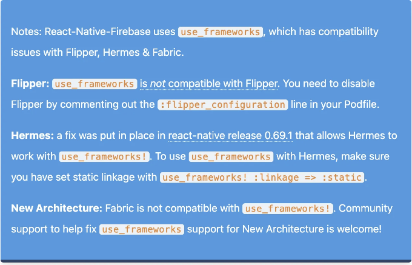

이 블로그 포스트는 공식 발표에서 영감을 받아 중요한 포인트를 보다 이해하기 쉬운 방식으로 강조하기 위해 작성되었습니다.

## 1. 더 나은 디버깅

React Native 팀은 개발 중 문제를 해결하는 방법을 업그레이드했으며 Flipper를 사용하지 않을 방안에 대해 고민 중입니다. 이미 Firebase와 작업 중에 이런 문제가 있었는데, 특히 고통스러웠습니다:

<!-- ui-log 수평형 -->
<ins class="adsbygoogle"
  style="display:block"
  data-ad-client="ca-pub-4877378276818686"
  data-ad-slot="9743150776"
  data-ad-format="auto"
  data-full-width-responsive="true"></ins>
<component is="script">
(adsbygoogle = window.adsbygoogle || []).push({});
</component>

```markdown


Flipper를 사용하여 디버깅하는 것이 좋지 않은 경험을 했어요. 대신 터미널이나 Chrome 디버거를 사용하는 편입니다 (RN 버전에 따라 다르겠죠). RN 팀이 Flipper를 대체하기로 한 최근 결정에 정말 기대돼요. 그들은 이러한 결정을 내린 이유를 더 자세히 공유했어요:

- Flipper를 사용한 디버깅 경험의 불안정성, 빈번한 충돌, 초기 설치/호스트 응용프로그램과의 연결 등 핵심 작업을 수행하는 데 어려움이 있었어요.
- Flipper 디버깅 경험의 성능 및 사용자 인터페이스 응답성이 다른 RN 개발 도구 모음의 모든 다른 도구와 비교하여 훨씬 부족했어요.
- React Native에서 Flipper 경험에 필요한 문제들을 해결하는 데 역사적으로 느렸다는 점.
- Android 및 iOS에 각각 많은 종속성을 추가하는 Flipper는 빌드 시간을 더 오래 걸리게 하고 릴리스 프로세스를 복잡하게 만들었어요.

React Native는 새로운 JavaScript 디버거에 대한 작업 중이라고 발표했어요. 점진적으로 Flipper를 React Native 앱의 디버깅을 위한 기본 도구로부터 이동하고 있어요.
```

<!-- ui-log 수평형 -->
<ins class="adsbygoogle"
  style="display:block"
  data-ad-client="ca-pub-4877378276818686"
  data-ad-slot="9743150776"
  data-ad-format="auto"
  data-full-width-responsive="true"></ins>
<component is="script">
(adsbygoogle = window.adsbygoogle || []).push({});
</component>

헤르메스의 콘솔 로그 기록:

- 헤르메스는 이제 백그라운드에서 모든 console.log() 호출을 캡처하며, 이는 디버거가 처음 연결될 때 콘솔 탭으로 전송됩니다. 이는 웹 브라우저에서의 디버깅 경험과 일치합니다.
- 이 새로운 동작은 Flipper, Hermes에 연결된 Chrome DevTools 및 실험적인 새 디버거와 호환됩니다.

업데이트된 디버깅 문서:

- RN 팀이 문서의 디버깅 섹션을 업데이트했으며, 이제 모든 지원되는 디버거에 연결하는 방법에 대한 최신 정보, React DevTools에 대한 자세한 정보, 그리고 새롭게 업데이트된 시각적 자료가 포함되어 있습니다.

<!-- ui-log 수평형 -->
<ins class="adsbygoogle"
  style="display:block"
  data-ad-client="ca-pub-4877378276818686"
  data-ad-slot="9743150776"
  data-ad-format="auto"
  data-full-width-responsive="true"></ins>
<component is="script">
(adsbygoogle = window.adsbygoogle || []).push({});
</component>

향후 새로운 React Native 프로젝트에서 Flipper가 제거되더라도, 개발자들은 원하는 경우에 앱에 Flipper를 수동으로 추가할 수 있습니다.

## 2. Metro에서의 안정적인 심볼릭 링크 지원

React Native는 이제 Metro에서 심볼릭 링크를 자동으로 해결하여, 모노리포 설정과 더 쉽게 작업할 수 있게 되었습니다. 이 지원에는 Fast Refresh와 같은 기능이 포함되어 있으며, 번들링 중에 성능에 미치는 영향을 최소화합니다. 모든 데스크톱 플랫폼에서 Watchman 유무에 관계없이 작동합니다.

## 3. 안드로이드에서의 Kotlin 템플릿

<!-- ui-log 수평형 -->
<ins class="adsbygoogle"
  style="display:block"
  data-ad-client="ca-pub-4877378276818686"
  data-ad-slot="9743150776"
  data-ad-format="auto"
  data-full-width-responsive="true"></ins>
<component is="script">
(adsbygoogle = window.adsbygoogle || []).push({});
</component>

- React Native (RN) 팀이 안드로이드 앱을 React Native로 구축하는 데 선호하는 언어로 Kotlin을 공식적으로 지지했습니다. 이 결정은 안드로이드 생태계에서 현대적인 언어로의 지속적인 추세를 반영하고 있습니다.
- 안드로이드용 React Native 템플릿이 변경되어 Java 대신 Kotlin이 통합되었습니다.
- 결과적으로, 새로운 MainActivity.kt 및 MainApplication.kt 파일 크기가 이전 대비 36% 감소했습니다.

## 4. Android 14 지원

- 0.73 버전은 안드로이드 14를 완전히 지원하며 최신 안드로이드 SDK 버전인 API 레벨 34 또는 "Upside Down Cake"로 대상 지정할 수 있습니다.
- Java 17로 업그레이드하고 Android Gradle 플러그인을 업데이트해야 합니다.

```bash
brew tap homebrew/cask-versions
brew install --cask zulu17
```

<!-- ui-log 수평형 -->
<ins class="adsbygoogle"
  style="display:block"
  data-ad-client="ca-pub-4877378276818686"
  data-ad-slot="9743150776"
  data-ad-format="auto"
  data-full-width-responsive="true"></ins>
<component is="script">
(adsbygoogle = window.adsbygoogle || []).push({});
</component>

- React Native앱은 이제 사진 및 비디오에 부분적인 액세스 권한을 부여하기 위해 PermissionsAndroid API의 READ_MEDIA_VISUAL_USER_SELECTED 권한을 사용하여 이 기능을 지원합니다.

## 5. 새로운 아키텍처 업데이트

- 브릿지 없는 모드(Bridgeless Mode): React Native 0.73에서 새로운 기능인 브릿지 없는 모드가 도입되었습니다. 완전히 브릿지를 제거하고 새로운 방향으로 나아갑니다.
- 네이티브 모듈 상호 운용 계층(Native Module Interop Layer): 브릿지 없는 모드와 함께 도입된 것으로, 기존 모듈의 재사용을 용이하게 하는 네이티브 모듈 상호 운용 계층과 렌더러 상호 운용 계층이 있습니다.
- 실험 단계: 새로운 아키텍처의 일환으로, 브릿지 없는 모드는 초기에 실험적입니다. 사용자들은 이를 활성화하고 문제가 있을 경우 새로운 아키텍처 작업 그룹에 보고하는 것이 권장됩니다.

## 6. 사용이 중단된 디버깅 기능

<!-- ui-log 수평형 -->
<ins class="adsbygoogle"
  style="display:block"
  data-ad-client="ca-pub-4877378276818686"
  data-ad-slot="9743150776"
  data-ad-format="auto"
  data-full-width-responsive="true"></ins>
<component is="script">
(adsbygoogle = window.adsbygoogle || []).push({});
</component>

과거에는 원격 JavaScript 디버깅 기능이 외부 웹 브라우저(예: Chrome)를 앱에 연결하는 레거시 디버깅 모드로 사용되었습니다. http://localhost:8081/debugger-ui에 자바스크립트 코드를 실행하여 작동했습니다. 그러나 이 접근 방식은 종종 디버깅 중 예측할 수없는 앱 동작을 일으키고 New Architecture의 네이티브 모듈과 호환되지 않았습니다. 0.73 버전부터, 원격 JavaScript 디버깅은 폐기되었으며 더 이상 개발 메뉴에서 제거되었습니다. 원격 디버거를 활성화하려면 사용자가 NativeDevSettings API를 수동으로 사용해야 합니다. 이 수동 활성화 프로세스에 대한 지침은 기타 디버깅 방법에 대한 문서에서 찾을 수 있습니다.

# 중요 변경 사항

이것은 0.73 버전의 주요 중단 변경 사항 중 일부입니다. 전체 변경 로그를 참고하시기 바랍니다.

- 단순화된 유지 관리를 위해 Babel 패키지가 이름이 변경되었습니다. metro-react-native-babel-preset이 @react-native/babel-preset으로, metro-react-native-babel-transformer가 @react-native/metro-babel-transformer로 이름이 변경되었습니다.
- Node.js 최소 버전 요구 사항이 18로 올라갔습니다.
- 템플릿은 이제 TypeScript 5.0을 사용합니다. React Native 타입은 계속해서 TypeScript 4.8에서 작동합니다.
- Android: 안드로이드 앱 빌드 요구 사항으로 Java 17이 필요합니다 (위 참조).
- Android: Fresco를 3.0으로 주요 업데이트했습니다.
- iOS: 최소 iOS 버전을 13.4로 상향조정했습니다.
- iOS: Xcode를 통해 빌드를 실행할 때 Metro가 자동으로 시작되지 않습니다.

<!-- ui-log 수평형 -->
<ins class="adsbygoogle"
  style="display:block"
  data-ad-client="ca-pub-4877378276818686"
  data-ad-slot="9743150776"
  data-ad-format="auto"
  data-full-width-responsive="true"></ins>
<component is="script">
(adsbygoogle = window.adsbygoogle || []).push({});
</component>

## React Native CLI 변경 사항:

- build-android 명령어에서 기본 작업 접두사를 변경했습니다. 이제 build-android를 실행할 때 assemble 대신 번들 작업이 실행됩니다.
- Metro 구성 기본값에 대한 대체 흐름을 제거했습니다. CLI에서 이러한 기본값에 대한 후속 복사본을 제거했기 때문에 0.73에서는 0.72에서 업데이트된 metro.config.js 형식이 필요합니다.
- run-ios에서 --configuration 옵션을 제거했습니다 (--mode로 대체되었습니다).
- build-android 명령에서 --variant 옵션을 제거했습니다 (--mode로 대체되었습니다).

버전 v12.0.0의 전체 변경 로그를 확인하세요.

## Deprecated @types/react-native

<!-- ui-log 수평형 -->
<ins class="adsbygoogle"
  style="display:block"
  data-ad-client="ca-pub-4877378276818686"
  data-ad-slot="9743150776"
  data-ad-format="auto"
  data-full-width-responsive="true"></ins>
<component is="script">
(adsbygoogle = window.adsbygoogle || []).push({});
</component>

- RN 팀은 이제 0.73에 0.71 @types/react-native을 사용하지 않을 예정입니다.

