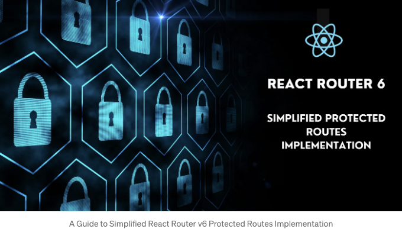

React Router v6로 보호된 경로를 만드는 것은 이제 간단합니다. 중첩된 경로 및 레이아웃 컴포넌트를 사용하여 이를 어떻게 구현하는지 살펴봅시다.

## 단계 1: 앱 라우트 설정

이제 공개 및 보호된 라우트가 모두 포함된 AppRoutes 컴포넌트를 만들어 봅시다. 여기서 ProtectedRoute 컴포넌트가 중심이 되어 "/dashboard" 또는 "/profile"과 같은 보호된 경로 구성 요소 내의 모든 경로의 기본 역할을 합니다.

<!-- ui-log 수평형 -->
<ins class="adsbygoogle"
  style="display:block"
  data-ad-client="ca-pub-4877378276818686"
  data-ad-slot="9743150776"
  data-ad-format="auto"
  data-full-width-responsive="true"></ins>
<component is="script">
(adsbygoogle = window.adsbygoogle || []).push({});
</component>

```js
export const AppRoutes = () => {
  return (
    <Routes>
      <Route path="/sign-up" element={<SignUp />} />
      <Route path="/sign-in" element={<SignIn />} />
      <Route element={<ProtectedRoute />}>
        <Route path="/dashboard" element={<Dashboard />} />
        <Route path="/profile" element={<UserProfile />} />
        {/* Handle other routes */}
      </Route>
    </Routes>
  );
};
```

## 단계 2: 보호된 경로 구성요소 구현

ProtectedRoute 컴포넌트를 구축하기 전에 사용자 인증을 결정할 수 있는 메커니즘이 있는지 확인하십시오. 사용자가 인증되지 않은 경우 "/sign-in" 경로로 리디렉션됩니다.

React Router v6에는 여기서 중요한 Outlet 컴포넌트가 제공됩니다. 이 컴포넌트를 사용하면 부모 경로 내에서 자식 경로 요소를 쉽게 렌더링할 수 있습니다. 이 기능을 활용하여 부모 경로 내에서 중첩된 경로 요소를 로드할 수 있습니다. 또한 모든 중첩된 경로 요소에서 공유할 수 있는 레이아웃 컴포넌트(헤더 및 사이드바와 같은)를 추가할 수도 있습니다.```

<!-- ui-log 수평형 -->
<ins class="adsbygoogle"
  style="display:block"
  data-ad-client="ca-pub-4877378276818686"
  data-ad-slot="9743150776"
  data-ad-format="auto"
  data-full-width-responsive="true"></ins>
<component is="script">
(adsbygoogle = window.adsbygoogle || []).push({});
</component>

```js
export const ProtectedRoute = () => {
  const navigate = useNavigate();
  const { isAuthenticated } = useAuth();
  if (!isAuthenticated) {
    navigate("/sign-in");
  }
  return (
    <Grid container direction="column" width="100%" flexWrap="nowrap">
      <DashboardHeader />
      <Grid container direction="row" flexWrap="nowrap">
        <Grid item>
          <SideBar />
        </Grid>
        <Outlet />
      </Grid>
    </Grid>
  );
};
```

간단히 말하면, React Router v6은 outlet 컴포넌트와 중첩 라우트를 통해 보호된 경로 구현을 간소화합니다. 이는 보호된 경로를 처리하는 더 간단한 방법으로, 앱의 인증된 섹션을 탐색하는 것을 더 원활하고 직관적으로 만듭니다.