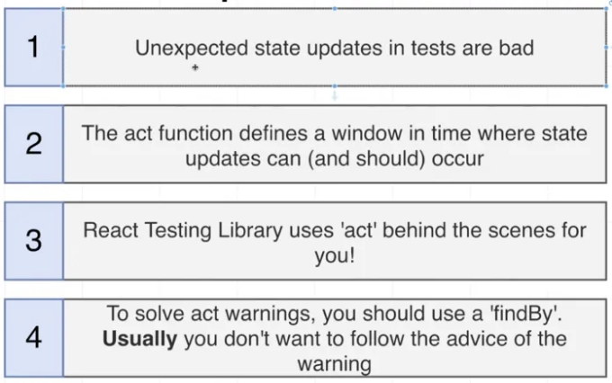
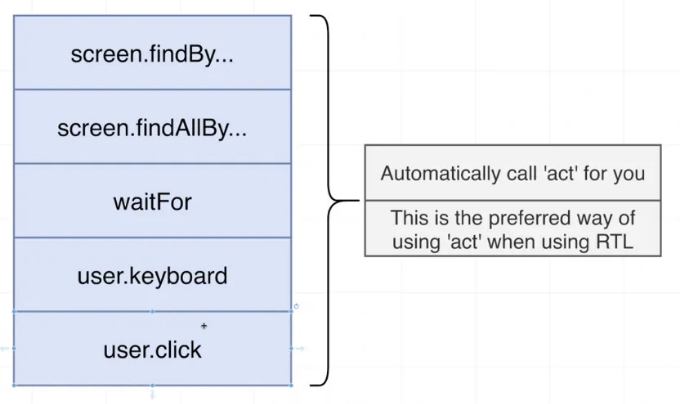

리액트 테스팅 라이브러리의 세계에서 act() 함수는 종종 다소 신비로운 존재로 나타납니다. "테스트 내부의 ComponentName 업데이트가 act(...)로 래핑되지 않았습니다"와 같은 경고를 본 적이 있을 것입니다. 이 기사에서는 act() 함수를 해석하고 특정 테스트 시나리오에서 왜 중요한지 설명하겠습니다.

# act() 함수의 목적

act()의 주요 목적은 React 컴포넌트와 관련된 모든 업데이트(예: 상태 변경, 효과 등)가 처리되고 적용된 후 테스트에서 다음 작업으로 넘어가도록 하는 것입니다. 이는 테스트가 실제 브라우저 환경에서 React가 작동하는 방식을 시뮬레이션하도록 도와줍니다.

<!-- ui-log 수평형 -->
<ins class="adsbygoogle"
  style="display:block"
  data-ad-client="ca-pub-4877378276818686"
  data-ad-slot="9743150776"
  data-ad-format="auto"
  data-full-width-responsive="true"></ins>
<component is="script">
(adsbygoogle = window.adsbygoogle || []).push({});
</component>

# `act()` 함수를 사용해야 하는 경우

`act()` 함수를 사용해야 하는 경우는 주로 테스트 중에 사용자 상호 작용이 발생하여 구성 요소에서 상태 업데이트나 효과를 일으키는 경우입니다. 예를 들어 구성 요소 내의 일부 상태를 수정하는 버튼 클릭과 같은 상호 작용을 트리거하는 경우입니다.

# `act()` 함수를 사용하지 않은 예시

다음과 같은 간단한 컴포넌트를 살펴보겠습니다:

<!-- ui-log 수평형 -->
<ins class="adsbygoogle"
  style="display:block"
  data-ad-client="ca-pub-4877378276818686"
  data-ad-slot="9743150776"
  data-ad-format="auto"
  data-full-width-responsive="true"></ins>
<component is="script">
(adsbygoogle = window.adsbygoogle || []).push({});
</component>

```js
import React, { useState } from 'react';

const Counter = () => {
  const [count, setCount] = useState(0);
  
  return (
    <div>
      <button onClick={() => setCount(count + 1)}>증가</button>
      <span>{count}</span>
    </div>
  );
};
export default Counter;
```

이제 act()를 사용하지 않는 테스트 케이스를 작성해봅시다:

```js
import React from 'react';
import { render, fireEvent } from '@testing-library/react';
import Counter from './Counter';

it("카운트를 증가시킵니다", () => {
  const { getByText } = render(<Counter />);
  
  fireEvent.click(getByText('증가'));
  expect(getByText('1')).toBeInTheDocument();
});
```

이 예시에서는 어떤 경고 메시지도 보이지 않을 수 있습니다. 그러나 비동기 호출과 같은 부작용이 있는 컴포넌트의 경우 "not wrapped in act(...)" 경고가 나타날 수 있습니다.```

<!-- ui-log 수평형 -->
<ins class="adsbygoogle"
  style="display:block"
  data-ad-client="ca-pub-4877378276818686"
  data-ad-slot="9743150776"
  data-ad-format="auto"
  data-full-width-responsive="true"></ins>
<component is="script">
(adsbygoogle = window.adsbygoogle || []).push({});
</component>

# findBy로 이동

findBy 쿼리는 getBy 쿼리의 슈퍼히어로 버전 같은 것인데 비동기 작업을 위한 것이에요. 지정된 시간 내에 요소를 찾으면 해결되는 Promise를 반환하고 해당 요소가 찾아지지 않을 경우에는 거부돼요.

문법은 getBy와 유사해요:

```js
const button = await findByRole('button', { name: 'Click Me' });
```

<!-- ui-log 수평형 -->
<ins class="adsbygoogle"
  style="display:block"
  data-ad-client="ca-pub-4877378276818686"
  data-ad-slot="9743150776"
  data-ad-format="auto"
  data-full-width-responsive="true"></ins>
<component is="script">
(adsbygoogle = window.adsbygoogle || []).push({});
</component>

# 왜 findBy를 사용하는 것이 더 나은 이유

## act() 암시적으로 적용

findBy는 쿼리를 자동으로 act()로 래핑합니다. 이는 테스트를 더 깔끔하게 만들 뿐만 아니라 비동기 호출을 act()로 래핑하는 것을 잊지 않도록 보장합니다.

## 쉬운 비동기 처리

<!-- ui-log 수평형 -->
<ins class="adsbygoogle"
  style="display:block"
  data-ad-client="ca-pub-4877378276818686"
  data-ad-slot="9743150776"
  data-ad-format="auto"
  data-full-width-responsive="true"></ins>
<component is="script">
(adsbygoogle = window.adsbygoogle || []).push({});
</component>

한 예시를 살펴보겠습니다:

```js
import React, { useEffect, useState } from 'react';

const AsyncComponent = () => {
  const [data, setData] = useState(null);
  useEffect(() => {
    fetch('/api/data')
      .then((res) => res.json())
      .then((data) => setData(data));
  }, []);
  return <div>{data ? data.message : '로딩 중...'}</div>;
};
```

## act() 사용하기

```js
import { render, act } from '@testing-library/react';

it('데이터를 가져와서 표시해야 합니다', async () => {
  const { getByText } = render(<AsyncComponent />);
  
  await act(async () => {
    await new Promise((resolve) => setTimeout(resolve, 1000));
  });
  expect(getByText('안녕')).toBeInTheDocument();
});
```

<!-- ui-log 수평형 -->
<ins class="adsbygoogle"
  style="display:block"
  data-ad-client="ca-pub-4877378276818686"
  data-ad-slot="9743150776"
  data-ad-format="auto"
  data-full-width-responsive="true"></ins>
<component is="script">
(adsbygoogle = window.adsbygoogle || []).push({});
</component>

## findBy 사용

```js
import { render } from '@testing-library/react';

it('데이터를 가져와서 표시해야 합니다', async () => {
  const { findByText } = render(<AsyncComponent />);
  
  const message = await findByText('Hello');
  expect(message).toBeInTheDocument();
});
```

findBy 예제에서 코드가 훨씬 더 깔끔하다는 것을 알 수 있습니다. act() 예제와 동일한 작업을 하지만 더 간결하고 직관적입니다.

# 에러 처리

<!-- ui-log 수평형 -->
<ins class="adsbygoogle"
  style="display:block"
  data-ad-client="ca-pub-4877378276818686"
  data-ad-slot="9743150776"
  data-ad-format="auto"
  data-full-width-responsive="true"></ins>
<component is="script">
(adsbygoogle = window.adsbygoogle || []).push({});
</component>

만약 findBy가 지정된 시간 내에 요소를 찾지 못하면 자동으로 오류를 throw하며, 어떤 문제가 발생했는지 쉽게 디버깅할 수 있습니다. 이는 테스트 코드를 작성할 때 실제 코드가 실제 환경에서 동작하는 방식과 유사하도록 만드는 철학과 일치합니다.

# 다른 암묵적 act() 호출

findBy가 act()로 쿼리를 암묵적으로 감싸는 유일한 함수가 아닙니다. 이런 경우에도 act()가 발생하는 다른 경우가 있습니다.



<!-- ui-log 수평형 -->
<ins class="adsbygoogle"
  style="display:block"
  data-ad-client="ca-pub-4877378276818686"
  data-ad-slot="9743150776"
  data-ad-format="auto"
  data-full-width-responsive="true"></ins>
<component is="script">
(adsbygoogle = window.adsbygoogle || []).push({});
</component>

# 결론

act()은 강력하며 더 많은 제어 수준을 제공하지만, findBy 쿼리는 React 컴포넌트에서 비동기 작업을 테스트하는 더 우아하고 덜 장황한 방법을 제공합니다. 암시적인 act() 래핑은 테스트가 깨끗하고 신뢰할 수 있도록 보장하며, 종종 findBy를 사용하여 테스트에서 비동기 동작을 다루는 것이 선호되는 선택지가 됩니다.