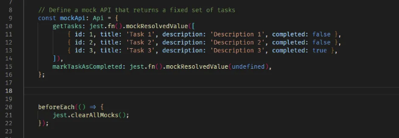

유닛 테스팅은 모든 소프트웨어 개발 프로세스의 필수 요소입니다. 이를 통해 개발자들은 응용 프로그램의 개별 구성 요소를 테스트하고 프로덕션 환경에 배포되기 전에 발생할 수 있는 버그를 잡을 수 있습니다. React.js는 가장 인기 있는 프론트엔드 프레임워크 중 하나로, 유닛 테스팅을 위한 많은 리소스가 제공됩니다.

이 블로그에서는 React.js 유닛 테스팅을 위한 몇 가지 최상의 실천 방법과 도구를 살펴보겠습니다.

## React.js 애플리케이션에 대한 유닛 테스트를 하는 이유

유닛 테스팅을 통해 개발자는 응용 프로그램의 각 구성 요소가 의도대로 작동하는지 확인할 수 있습니다. React.js 컴포넌트는 다양한 상태와 동작을 갖고 있을 수 있으며, 잠재적인 문제를 피하기 위해 그 모든 것을 테스트하는 것이 중요합니다. 유닛 테스트는 또한 개발 프로세스 초기에 버그를 발견해 수정하기 쉽게 하여, 프로덕션 환경에 이르기 전에 이러한 문제를 해결할 수 있도록 도와줍니다.

<!-- ui-log 수평형 -->
<ins class="adsbygoogle"
  style="display:block"
  data-ad-client="ca-pub-4877378276818686"
  data-ad-slot="9743150776"
  data-ad-format="auto"
  data-full-width-responsive="true"></ins>
<component is="script">
(adsbygoogle = window.adsbygoogle || []).push({});
</component>

## React.js 유닛 테스트의 모범 사례

1. 한 번에 하나의 기능만 테스트하기

React.js 컴포넌트에 대한 유닛 테스트를 작성할 때, 한 번에 하나의 기능만 테스트하는 것이 중요합니다. 예를 들어, 아이템 목록을 표시하는 컴포넌트를 테스트한다면 먼저 목록의 렌더링을 테스트하고, 그 다음에 사용자가 상호작용할 때 컴포넌트의 동작을 테스트해야 합니다.

한 번에 하나의 기능만 테스트함으로써 문제를 분리하고 테스트가 구체적이고 집중되도록 할 수 있습니다. 이는 문제가 발생할 때 디버그하고 수정하기가 더 쉽게 만들어줍니다.

<!-- ui-log 수평형 -->
<ins class="adsbygoogle"
  style="display:block"
  data-ad-client="ca-pub-4877378276818686"
  data-ad-slot="9743150776"
  data-ad-format="auto"
  data-full-width-responsive="true"></ins>
<component is="script">
(adsbygoogle = window.adsbygoogle || []).push({});
</component>

2. Mocks와 Stubs 사용하기

React.js 애플리케이션에는 종종 API, 데이터베이스 및 외부 라이브러리와 같은 많은 종속성이 있습니다. 이러한 종속성을 테스트하는 것을 피하려면 모의 객체 및 스텁을 사용하는 것이 가장 좋습니다.

Mocks는 종속성의 가짜 구현이며, 스텁은 종속성의 동작을 시뮬레이션하는 자리 표시자입니다. 모의 객체와 스텁을 사용함으로써 네트워크 지연이나 데이터베이스 오류와 같은 외부 요인으로 인해 테스트가 영향을 받지 않도록 할 수 있습니다.

3. 코드 작성 전에 테스트 작성하기

<!-- ui-log 수평형 -->
<ins class="adsbygoogle"
  style="display:block"
  data-ad-client="ca-pub-4877378276818686"
  data-ad-slot="9743150776"
  data-ad-format="auto"
  data-full-width-responsive="true"></ins>
<component is="script">
(adsbygoogle = window.adsbygoogle || []).push({});
</component>

React.js 유닛 테스트의 또 다른 모범 사례는 코드를 작성하기 전에 테스트를 작성하는 것입니다. 이 방법은 Test-Driven Development (TDD)로 알려져 있으며 더 신뢰할 수 있고 예측 가능한 코드를 만들어낼 수 있습니다.

코드를 작성하기 전에 테스트를 작성하면 코드의 원하는 결과와 해당 결과를 테스트하는 방법에 대해 고민을 강요받게 됩니다. 이는 더 나은 설계 결정과 집중된 개발로 이어질 수 있습니다.

4. 테스팅 프레임워크 사용하기

React.js에는 Jest, React Testing Library (RTL), Enzyme과 같은 여러 테스팅 프레임워크가 있습니다. 이러한 프레임워크는 테스트를 쉽게 작성하고 실행하며 결과에 대한 보고서를 생성하는 방법을 제공합니다.

<!-- ui-log 수평형 -->
<ins class="adsbygoogle"
  style="display:block"
  data-ad-client="ca-pub-4877378276818686"
  data-ad-slot="9743150776"
  data-ad-format="auto"
  data-full-width-responsive="true"></ins>
<component is="script">
(adsbygoogle = window.adsbygoogle || []).push({});
</component>

테스트 프레임워크를 사용하면 개발자가 시간을 절약할 수 있고 테스트가 일관되고 신뢰할 수 있도록 할 수 있습니다. 또한 코드 커버리지 분석 및 테스트 병렬화와 같은 추가 기능을 제공할 수도 있습니다.

# React.js 단위 테스트 도구

1. Jest

Jest는 React.js 애플리케이션을 위한 인기있는 테스트 프레임워크입니다. 테스트를 작성하고 실행하기 위한 간단하고 사용하기 쉬운 인터페이스를 제공합니다. Jest에는 내장된 모킹 기능이 있으며, 이를 사용하면 의존성에 대해 걱정하지 않고 구성 요소를 테스트할 수 있습니다.

<!-- ui-log 수평형 -->
<ins class="adsbygoogle"
  style="display:block"
  data-ad-client="ca-pub-4877378276818686"
  data-ad-slot="9743150776"
  data-ad-format="auto"
  data-full-width-responsive="true"></ins>
<component is="script">
(adsbygoogle = window.adsbygoogle || []).push({});
</component>

Jest는 매우 구성 가능하며 Enzyme 및 React Testing Library와 같은 다양한 테스트 유틸리티와 함께 사용할 수 있습니다.

2. React Testing Library

React Testing Library는 React.js 애플리케이션을 위한 또 다른 인기있는 테스트 라이브러리입니다. 이 라이브러리는 구현 세부사항이 아닌 사용자가 상호 작용하는 방식으로 구성 요소를 테스트하는 데 중점을 두고 있습니다.

이는 구성 요소의 동작을 테스트하고 있음을 보장하여 더 효과적이고 신뢰할 수 있는 테스트를 작성하기 쉽게 만들어 줍니다. React Testing Library 또한 매우 구성 가능하며 다양한 테스트 프레임워크와 함께 사용할 수 있습니다.

<!-- ui-log 수평형 -->
<ins class="adsbygoogle"
  style="display:block"
  data-ad-client="ca-pub-4877378276818686"
  data-ad-slot="9743150776"
  data-ad-format="auto"
  data-full-width-responsive="true"></ins>
<component is="script">
(adsbygoogle = window.adsbygoogle || []).push({});
</component>

3. Enzyme

Enzyme은 React.js를 위한 테스팅 유틸리티로, 개발자들이 컴포넌트의 출력과 동작을 테스트할 수 있게 해줍니다. Enzyme은 컴포넌트를 렌더링하고 출력을 검사하기 위한 간단한 API를 제공합니다. Enzyme은 많은 다양한 테스팅 프레임워크와 호환됩니다.

Enzyme은 특히 컴포넌트의 라이프사이클 메소드를 테스트하고 시각적 회귀 테스트를 위해 컴포넌트의 스냅샷을 생성하는 데 유용합니다.

# 데모 시간

<!-- ui-log 수평형 -->
<ins class="adsbygoogle"
  style="display:block"
  data-ad-client="ca-pub-4877378276818686"
  data-ad-slot="9743150776"
  data-ad-format="auto"
  data-full-width-responsive="true"></ins>
<component is="script">
(adsbygoogle = window.adsbygoogle || []).push({});
</component>

나는 React Testing Library (RTL)과 Jest를 함께 사용하는데, RTL과 Jest의 조합은 React 애플리케이션을 테스트하는 강력한 경험을 제공하면서 설정, 유지 보수 및 확장이 쉽습니다.

React Testing Library를 사용한 예제를 살펴봅시다. 이 예제는 React 컴포넌트의 단위 테스트에 대한 최선의 방법을 따르며, 외부 종속성을 모의화하고 구현 세부 사항이 아닌 컴포넌트 동작을 테스트하며, 렌더링된 컴포넌트와 상호 작용하고 확인하기 위해 React Testing Library의 API를 사용합니다. 또한 TypeScript로 작성되었으며 React 16+를 사용합니다.

이 예제에서는 일정한 작업 세트를 반환하고 getTasks 및 markTaskAsCompleted 메서드가 호출되었는지를 추적하는 목 Api 개체를 정의합니다. 그 후 각 테스트 전에 모든 모의 호출을 지우기 위해 beforeEach를 사용합니다.

1. React 테스팅 라이브러리 및 jest 설정하기.

<!-- ui-log 수평형 -->
<ins class="adsbygoogle"
  style="display:block"
  data-ad-client="ca-pub-4877378276818686"
  data-ad-slot="9743150776"
  data-ad-format="auto"
  data-full-width-responsive="true"></ins>
<component is="script">
(adsbygoogle = window.adsbygoogle || []).push({});
</component>

```js
npm install --save-dev @testing-library/react @testing-library/jest-dom jest ts-jest @types/jest
```

2. __tests__ 폴더 아래 taskList.test.tsx 파일을 설정합니다.


3. mockApi를 작성하고, 테스트마다 모든 모의 객체를 지우기 위해 beforeEach를 호출하는 hooks를 작성합니다.```

<!-- ui-log 수평형 -->
<ins class="adsbygoogle"
  style="display:block"
  data-ad-client="ca-pub-4877378276818686"
  data-ad-slot="9743150776"
  data-ad-format="auto"
  data-full-width-responsive="true"></ins>
<component is="script">
(adsbygoogle = window.adsbygoogle || []).push({});
</component>




4. TaskList 컴포넌트의 기능을 확인하기 위해 세 가지 테스트를 작성할 것입니다:

1. 첫 번째 테스트는 TaskList가 API에서 작업을 가져오는지 확인합니다. React Testing Library의 waitFor 메서드를 사용하여 mock getTasks 메서드가 호출될 때까지 기다립니다.


<!-- ui-log 수평형 -->
<ins class="adsbygoogle"
  style="display:block"
  data-ad-client="ca-pub-4877378276818686"
  data-ad-slot="9743150776"
  data-ad-format="auto"
  data-full-width-responsive="true"></ins>
<component is="script">
(adsbygoogle = window.adsbygoogle || []).push({});
</component>

2. 두 번째 테스트는 모의 API에서 반환된 작업을 TaskList가 렌더링하는지 확인합니다. 이를 위해 React Testing Library의 screen.getByText 메서드를 사용하여 렌더링된 구성 요소에서 특정 텍스트 요소를 찾습니다.


3. 세 번째 테스트는 TaskList가 작업을 클릭할 때 모의 API의 markTaskAsCompleted 메서드를 올바른 작업 ID로 호출하는지 확인합니다. React Testing Library의 fireEvent.click 메서드를 사용하여 작업을 클릭한 것처럼 시뮬레이션하고 waitFor 메서드를 사용하여 모의 markTaskAsCompleted 메서드가 호출될 때까지 기다립니다.


<!-- ui-log 수평형 -->
<ins class="adsbygoogle"
  style="display:block"
  data-ad-client="ca-pub-4877378276818686"
  data-ad-slot="9743150776"
  data-ad-format="auto"
  data-full-width-responsive="true"></ins>
<component is="script">
(adsbygoogle = window.adsbygoogle || []).push({});
</component>

# 결론

유닛 테스트는 소프트웨어 개발 프로세스의 필수 요소이며, React.js 애플리케이션도 예외가 아닙니다. 최선의 방법을 따르고 적절한 도구를 사용함으로써 개발자는 코드가 신뢰성이 있고 예측 가능하며 버그가 없도록 할 수 있습니다.

React.js 컴포넌트를 테스트할 때 한 번에 한 가지를 테스트하고, 의존성을 테스트하지 않기 위해 모의 객체와 스텁을 사용하며, 코드를 작성하기 전에 테스트를 작성하고, 테스트 프레임워크를 사용하여 시간을 절약하고 일관성을 확보하는 것이 중요합니다.

React.js 유닛 테스트에 대한 가장 인기 있는 도구로는 Jest, Enzyme, React Testing Library 등이 있습니다. 이러한 도구들은 개발자에게 효과적이고 신뢰할 수 있는 코드를 작성할 수 있는 필요한 기능을 제공합니다.

<!-- ui-log 수평형 -->
<ins class="adsbygoogle"
  style="display:block"
  data-ad-client="ca-pub-4877378276818686"
  data-ad-slot="9743150776"
  data-ad-format="auto"
  data-full-width-responsive="true"></ins>
<component is="script">
(adsbygoogle = window.adsbygoogle || []).push({});
</component>

여기 도움이 될 만한 몇 가지 자료들이 있어요:

- React Testing Library: [링크](https://testing-library.com/docs/react-testing-library/intro/)
- Jest: [링크](https://jestjs.io/docs/en/getting-started)
- Enzyme: [링크](https://enzymejs.github.io/enzyme/)
- Mocha: [링크](https://mochajs.org/)
- 왜 React Testing Library가 Enzyme보다 더 나은 선택인지: [링크](https://kentcdodds.com/blog/why-i-prefer-testing-library-over-enzyme)
- Jest를 이용한 스냅샷 테스팅: [링크](https://jestjs.io/docs/en/snapshot-testing)
- Jest vs. Mocha: [링크](https://blog.logrocket.com/jest-vs-mocha-comparing-javascript-testing-frameworks/)

이 자료들은 React 애플리케이션을 테스트하는 데 유용한 다양한 프레임워크와 도구에 대한 정보를 제공해요.