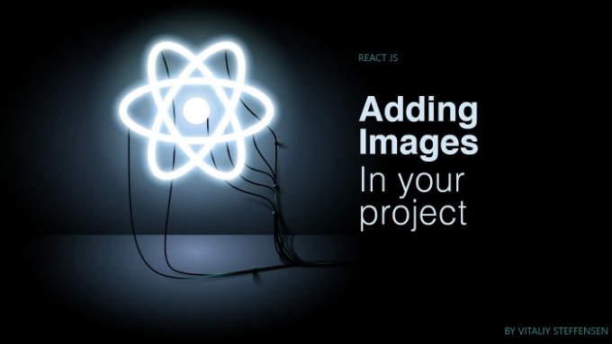

리액트 JS에서 이미지를 추가하고 스타일을 지정하는 초보자를 위한 완벽 가이드입니다.



- 이미지 추가하는 방법들
- 이미지 스타일링
- 예시 코드

# 이미지 추가

<!-- ui-log 수평형 -->
<ins class="adsbygoogle"
  style="display:block"
  data-ad-client="ca-pub-4877378276818686"
  data-ad-slot="9743150776"
  data-ad-format="auto"
  data-full-width-responsive="true"></ins>
<component is="script">
(adsbygoogle = window.adsbygoogle || []).push({});
</component>

리액트에서 이미지를 삽입하는 여러 가지 방법이 있어요.

- 이미지 태그 사용하기

`img/` 태그를 사용하면 두 가지 값을 제공해야 해요:

"src" (소스): 이미지의 URL이나 경로.

<!-- ui-log 수평형 -->
<ins class="adsbygoogle"
  style="display:block"
  data-ad-client="ca-pub-4877378276818686"
  data-ad-slot="9743150776"
  data-ad-format="auto"
  data-full-width-responsive="true"></ins>
<component is="script">
(adsbygoogle = window.adsbygoogle || []).push({});
</component>

“alt” (alternate): 이미지를 사용할 수 없는 경우 대체 텍스트입니다.

```js

```

- 배경 이미지 설정

CSS를 사용하여 요소의 배경을 설정할 수 있습니다. 이는 이미지 위에 콘텐츠를 표시하고 싶을 때 가장 유용합니다.

<!-- ui-log 수평형 -->
<ins class="adsbygoogle"
  style="display:block"
  data-ad-client="ca-pub-4877378276818686"
  data-ad-slot="9743150776"
  data-ad-format="auto"
  data-full-width-responsive="true"></ins>
<component is="script">
(adsbygoogle = window.adsbygoogle || []).push({});
</component>

```js
.app {
    background-image: url(https://reactjs.org/logo-og.png);
}
```

# 컴퓨터에서 이미지 추가하기

##  태그를 사용

이미지를 프로젝트로 드래그하여 원하는 컴포넌트로 가져옵니다. 그 후에 가져온 이름을 source 속성에 삽입할 수 있습니다.

<!-- ui-log 수평형 -->
<ins class="adsbygoogle"
  style="display:block"
  data-ad-client="ca-pub-4877378276818686"
  data-ad-slot="9743150776"
  data-ad-format="auto"
  data-full-width-responsive="true"></ins>
<component is="script">
(adsbygoogle = window.adsbygoogle || []).push({});
</component>

## 로컬 배경 이미지 삽입하기

이전과 마찬가지로 이미지를 가져올 것입니다. 그런 다음 CSS URL(…)을 사용하거나 아래에 표시된 것처럼 인라인 스타일링을 사용하여 이미지를 삽입할 수 있습니다.

## 코드 구조화

프로젝트에서 이미지를 구조화하는 올바른 방법은 이미지를 "이미지" 폴더에 추가하는 것입니다. 이미지 이외의 자산을 사용한다면 모든 자산 폴더를 하나로 추가하고 싶을 수 있습니다.

<!-- ui-log 수평형 -->
<ins class="adsbygoogle"
  style="display:block"
  data-ad-client="ca-pub-4877378276818686"
  data-ad-slot="9743150776"
  data-ad-format="auto"
  data-full-width-responsive="true"></ins>
<component is="script">
(adsbygoogle = window.adsbygoogle || []).push({});
</component>

<!DOCTYPE html>
<html>
<head>
  <title>Hello World</title>
</head>
<body>

<div>
  <h1>Welcome to my website</h1>
  <p>This is a simple HTML document.</p>
</div>

</body>
</html>

<!-- ui-log 수평형 -->
<ins class="adsbygoogle"
  style="display:block"
  data-ad-client="ca-pub-4877378276818686"
  data-ad-slot="9743150776"
  data-ad-format="auto"
  data-full-width-responsive="true"></ins>
<component is="script">
(adsbygoogle = window.adsbygoogle || []).push({});
</component>

- 너비와/높이: 요소의 너비와 높이 설정
- 테두리 반지름: 요소의 가장자리를 둥글게 만들기
- 필터: 필터에 대해 더 알아보기...
- 불투명도: 요소의 불투명도를 설명하는 십진수 값

`img/` 특정:

- 수직 정렬: 이미지를 수직으로 맞추기

배경 이미지 특정:

<!-- ui-log 수평형 -->
<ins class="adsbygoogle"
  style="display:block"
  data-ad-client="ca-pub-4877378276818686"
  data-ad-slot="9743150776"
  data-ad-format="auto"
  data-full-width-responsive="true"></ins>
<component is="script">
(adsbygoogle = window.adsbygoogle || []).push({});
</component>

- 배경 이미지: 파일 경로 또는 이미지 URL
- 배경 반복: 이미지 반복 설정을 축별 또는 양 축에 대해 설정
- 배경 크기: 이미지의 크기 설정
- 배경 위치: 이미지의 배경 내 위치 설정