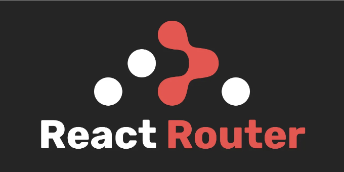

새로운 react-router-dom 버전 6을 사용하여 React에서 다중 레이아웃을 렌더링하는 단계별 가이드입니다.

새로운 react-router-dom 패키지에서 많은 변화가 있습니다:

- component가 element로 대체되었습니다.
- exact prop은 더 이상 지원되지 않습니다.
- Switch가 Routes로 대체되었습니다.
- useHistory()가 useNavigate()로 대체되었습니다.
- Redirect가 Navigate로 대체되었습니다.

<!-- ui-log 수평형 -->
<ins class="adsbygoogle"
  style="display:block"
  data-ad-client="ca-pub-4877378276818686"
  data-ad-slot="9743150776"
  data-ad-format="auto"
  data-full-width-responsive="true"></ins>
<component is="script">
(adsbygoogle = window.adsbygoogle || []).push({});
</component>

알겠어요, 일이 어떻게 진행될지 살펴봅시다.

## 1 — 새 애플리케이션 만들기

터미널을 열고 프로젝트를 만들고 싶은 디렉터리로 이동하세요:

```js
$ npx create-react-app multiple-layouts
```

<!-- ui-log 수평형 -->
<ins class="adsbygoogle"
  style="display:block"
  data-ad-client="ca-pub-4877378276818686"
  data-ad-slot="9743150776"
  data-ad-format="auto"
  data-full-width-responsive="true"></ins>
<component is="script">
(adsbygoogle = window.adsbygoogle || []).push({});
</component>

만약 TypeScript로 앱을 만들고 싶다면:

```js
$ npx create-react-app multiple-layouts --template typescript
```

# 2 — React Router DOM과 lodash 설치

이제 react-router-dom 패키지를 설치하고, 나중에 코딩에서 lodash 패키지를 사용할 것입니다.

<!-- ui-log 수평형 -->
<ins class="adsbygoogle"
  style="display:block"
  data-ad-client="ca-pub-4877378276818686"
  data-ad-slot="9743150776"
  data-ad-format="auto"
  data-full-width-responsive="true"></ins>
<component is="script">
(adsbygoogle = window.adsbygoogle || []).push({});
</component>

```js
$ npm install react-router-dom lodash
// 또는
$ yarn add react-router-dom lodash
```

이 글을 작성할 때의 정확한 버전은 6.6.2입니다.

# 3 — 페이지 만들기

로직을 설정하기 위해 몇 가지 페이지를 만들어봅시다.

<!-- ui-log 수평형 -->
<ins class="adsbygoogle"
  style="display:block"
  data-ad-client="ca-pub-4877378276818686"
  data-ad-slot="9743150776"
  data-ad-format="auto"
  data-full-width-responsive="true"></ins>
<component is="script">
(adsbygoogle = window.adsbygoogle || []).push({});
</component>

/src 폴더 내에 /pages 폴더를 만들어서 새로운 페이지 4개를 생성해주세요:

- src/pages/Login/index.jsx
- src/pages/Home/index.jsx
- src/pages/ListUsers/index.jsx
- src/pages/CreateUser/index.jsx

```jsx
const Login = () => {
  return (
    <div>Login</div>
  )
}

export default Login;
```

```jsx
const Home = () => {
  return (
    <div>Home</div>
  )
}

export default Home;
```

<!-- ui-log 수평형 -->
<ins class="adsbygoogle"
  style="display:block"
  data-ad-client="ca-pub-4877378276818686"
  data-ad-slot="9743150776"
  data-ad-format="auto"
  data-full-width-responsive="true"></ins>
<component is="script">
(adsbygoogle = window.adsbygoogle || []).push({});
</component>

```js
const CreateUser = () => {
  return (
    <div>사용자 생성</div>
  )
}

export default CreateUser;
```

```js
const ListUsers = () => {
  return (
    <div>사용자 목록</div>
  )
}

export default ListUsers;
```

# 4— 레이아웃 생성

이제 2개의 레이아웃만 있다고 가정하고 레이아웃을 생성합시다.```

<!-- ui-log 수평형 -->
<ins class="adsbygoogle"
  style="display:block"
  data-ad-client="ca-pub-4877378276818686"
  data-ad-slot="9743150776"
  data-ad-format="auto"
  data-full-width-responsive="true"></ins>
<component is="script">
(adsbygoogle = window.adsbygoogle || []).push({});
</component>

- 익명 레이아웃 — 사용자가 앱에 로그인하지 않은 경우.
- 메인 레이아웃 — 사용자가 앱에 로그인한 경우.

/src 폴더 내에 양 레이아웃을 포함하는 /layouts 폴더를 만듭니다:

```js
const AnonymousLayout = () => {
  return (
    <div>익명 레이아웃</div>
  )
}

export default AnonymousLayout;
```

```js
const MainLayout = () => {
  return (
    <div>메인 레이아웃</div>
  )
}

export default MainLayout;
```

<!-- ui-log 수평형 -->
<ins class="adsbygoogle"
  style="display:block"
  data-ad-client="ca-pub-4877378276818686"
  data-ad-slot="9743150776"
  data-ad-format="auto"
  data-full-width-responsive="true"></ins>
<component is="script">
(adsbygoogle = window.adsbygoogle || []).push({});
</component>

# 5 — 라우트 파일 생성

좋아요!! 이제 라우트를 생성해 봅시다.

이전 예제처럼, /src 폴더 안에 /routes 라는 이름의 새 폴더를 만들어야 합니다. 이 폴더 안에 다음 파일들이 포함될 것입니다:

- /routes/index.js — 페이지 및 레이아웃 목록입니다.
- /routes/ProtectedRoute/index.jsx — 라우트를 보호하고 미로그인 사용자가 페이지에 접근하는 것을 방지할 컴포넌트입니다.
- /routes/generate-routes.jsx — 이 파일에서 라우트를 순회하고 라우트와 레이아웃을 생성할 것입니다.

<!-- ui-log 수평형 -->
<ins class="adsbygoogle"
  style="display:block"
  data-ad-client="ca-pub-4877378276818686"
  data-ad-slot="9743150776"
  data-ad-format="auto"
  data-full-width-responsive="true"></ins>
<component is="script">
(adsbygoogle = window.adsbygoogle || []).push({});
</component>

우선 routes 배열을 생성해 봅시다.

참고: routes 배열은 헤더나 사이드바에 네비게이션 항목을 렌더링하는 데에도 사용될 수 있습니다. 그래서 우리는 사이드바에 네비게이션 링크를 배치하고 그 옆에 서브 항목이나 서브 메뉴를 두는 것을 고려하고 있습니다.

/routes/index.js

```js
// Layouts
import AnonymousLayout from "../layouts/AnonymousLayout";
import MainLayout from "../layouts/MainLayout";

// Pages
import Login from "../pages/Login";
import Home from "../pages/Home";
import CreateUser from "../pages/CreateUser";
import ListUsers from "../pages/ListUsers";

export const routes = [
{
    layout: AnonymousLayout,
    routes: [
      {
        name: 'login',
        title: 'Login page',
        component: Login,
        path: '/login',
        isPublic: true,
      }
    ]
  },
{
    layout: MainLayout,
    routes: [
      {
        name: 'home',
        title: 'Home page',
        component: Home,
        path: '/home'
      },
      {
        name: 'users',
        title: 'Users',
        hasSiderLink: true,
        routes: [
          {
            name: 'list-users',
            title: 'List of users',
            hasSiderLink: true,
            component: ListUsers,
            path: '/users'
          },
          {
            name: 'create-user',
            title: 'Add user',
            hasSiderLink: true,
            component: CreateUser,
            path: '/users/new'
          }
        ]
      }
    ]
  }
];
```

<!-- ui-log 수평형 -->
<ins class="adsbygoogle"
  style="display:block"
  data-ad-client="ca-pub-4877378276818686"
  data-ad-slot="9743150776"
  data-ad-format="auto"
  data-full-width-responsive="true"></ins>
<component is="script">
(adsbygoogle = window.adsbygoogle || []).push({});
</component>

각 속성을 더 자세히 살펴보고 어떻게 유용할지 살펴보겠습니다:

— 레이아웃:

- layout: 대상 페이지를 감쌀 대상 레이아웃입니다. [필수]
- routes: 레이아웃 안에 렌더링될 경로 목록입니다. [필수]

— 레이아웃 경로:

<!-- ui-log 수평형 -->
<ins class="adsbygoogle"
  style="display:block"
  data-ad-client="ca-pub-4877378276818686"
  data-ad-slot="9743150776"
  data-ad-format="auto"
  data-full-width-responsive="true"></ins>
<component is="script">
(adsbygoogle = window.adsbygoogle || []).push({});
</component>

- 이름: 경로의 이름으로, 경로 매핑시 고유해야 합니다. [필수]
- 제목: 브라우저 탭 제목 및 내비게이션 링크 레이블로 표시될 텍스트입니다. [필수]
- hasSiderLink: 대상 경로가 사이드바 내비게이션 링크로 렌더링되어야 하는지 여부를 지정하는 부울 속성입니다. true로 설정하면 경로가 사이드바 안에 표시됩니다. [옵션]
- 컴포넌트: 경로에 일치하는 경우 레이아웃 내에서 렌더링할 페이지 컴포넌트입니다. [옵션]
- 경로: 페이지 컴포넌트에 연결된 경로입니다. [옵션]
- isPublic: 페이지가 공개되어 있는지 또는 로그인이 필요한지를 나타내는 부울 속성입니다. true로 설정하면 익명 모드로 페이지에 액세스할 수 있습니다. [옵션]
- routes: 특정 경로의 하위 경로 목록입니다. 드롭다운 내비게이션 링크로 하위 경로를 렌더링할 때, 상위 경로는 경로 또는 컴포넌트를 가져서는 안 됩니다. [옵션]

참고: 프로젝트 요구사항에 맞게 속성을 사용자 정의할 수 있습니다.

/routes/ProtectedRoute/index.jsx

```js
import React from 'react';
import { Navigate, Outlet } from 'react-router-dom';

const ProtectedRoute = ({ isPublic, isAuthorized }) => {
  return (isPublic || isAuthorized) ? <Outlet /> : <Navigate to='/login' />
}

export default ProtectedRoute;
```

<!-- ui-log 수평형 -->
<ins class="adsbygoogle"
  style="display:block"
  data-ad-client="ca-pub-4877378276818686"
  data-ad-slot="9743150776"
  data-ad-format="auto"
  data-full-width-responsive="true"></ins>
<component is="script">
(adsbygoogle = window.adsbygoogle || []).push({});
</component>

위의 코드에서는 로그인이 필요한 페이지를 비로그인 사용자로부터 보호하기 위해 ProtectedRoute 컴포넌트를 생성했습니다.

인증된 사용자인 경우, 컴포넌트는 다음 두 가지 props를 수락합니다:

- isPublic: 현재 경로를 보호해야 하는지 여부를 알려주는 부울 prop입니다.
- isAuthorized: 사용자가 유효한 JWT를 가지고 있는지 여부를 알려주는 부울 prop입니다.

isPublic 또는 isAuthorized 중 하나라도 true이면 컴포넌트는 Outlet 컴포넌트를 반환합니다.

<!-- ui-log 수평형 -->
<ins class="adsbygoogle"
  style="display:block"
  data-ad-client="ca-pub-4877378276818686"
  data-ad-slot="9743150776"
  data-ad-format="auto"
  data-full-width-responsive="true"></ins>
<component is="script">
(adsbygoogle = window.adsbygoogle || []).push({});
</component>

나머지 설명은 나중에 제공될 예정입니다… `Outlet`에 대한 자세한 설명은 여기를 참조하세요.

`/routes/generate-routes.jsx`

그러니까, 다음을 import 해봅시다:

- Route, Routes as ReactRoutes from react-router-dom
- ProtectedRoute from ProtectedRoute
- flattenDeep from lodash/flattenDeep

<!-- ui-log 수평형 -->
<ins class="adsbygoogle"
  style="display:block"
  data-ad-client="ca-pub-4877378276818686"
  data-ad-slot="9743150776"
  data-ad-format="auto"
  data-full-width-responsive="true"></ins>
<component is="script">
(adsbygoogle = window.adsbygoogle || []).push({});
</component>

참고: ReactRoutes를 원하는 대로 이름을 지을 수 있습니다. 이 예시에서는 generateFlattenRoutes 함수가 Routes라는 컴포넌트를 반환합니다.

```js
import flattenDeep from 'lodash/flattenDeep';
import React from 'react';
import { Route, Routes as ReactRoutes } from 'react-router-dom';
import ProtectedRoute from './ProtectedRoute';
```

이제, 라우트를 가져와서 동일한 수준으로 펼치는 함수를 만들어봅시다. 이해하기 어렵다고요? 걱정하지 마세요. 아래 예시를 보고 이해해봅시다.

```js
// 이 배열을 함수에 전달합니다.
[2, 4, [5, 41, [100, 200], 500], 10, [50, 30], 30];

// 그리고 모든 값을 동일한 수준으로 뽑아낼 겁니다.
[2, 4, 5, 41, 100, 200, 500, 10, 50, 30, 30]

// 중첩된 배열은 전혀 없을 겁니다.
```

<!-- ui-log 수평형 -->
<ins class="adsbygoogle"
  style="display:block"
  data-ad-client="ca-pub-4877378276818686"
  data-ad-slot="9743150776"
  data-ad-format="auto"
  data-full-width-responsive="true"></ins>
<component is="script">
(adsbygoogle = window.adsbygoogle || []).push({});
</component>

앞서 제시한 예제가 이해되셨기를 바랍니다.

generateFlattenRoutes 함수를 계속해봅시다:

```js
import flattenDeep from 'lodash/flattenDeep';
import React from 'react';
import { Route, Routes as ReactRoutes } from 'react-router-dom';
import ProtectedRoute from './ProtectedRoute';

const generateFlattenRoutes = (routes) => {
  if (!routes) return [];
  return flattenDeep(routes.map(({ routes: subRoutes, ...rest }) => [rest, generateFlattenRoutes(subRoutes)]));
}
```

위 코드는 재귀 함수로, 루트에 중첩된 경로 배열이 있는 경우마다 스스로를 호출합니다. 함수가 정의되지 않은 매개변수를 받으면 앱이 크래시되지 않도록 빈 배열을 반환합니다. routes 속성이 옵션인 것을 알 수 있습니다.

<!-- ui-log 수평형 -->
<ins class="adsbygoogle"
  style="display:block"
  data-ad-client="ca-pub-4877378276818686"
  data-ad-slot="9743150776"
  data-ad-format="auto"
  data-full-width-responsive="true"></ins>
<component is="script">
(adsbygoogle = window.adsbygoogle || []).push({});
</component>

다음으로, 주요 기능을 생성하여 라우트를 생성할 것입니다:

```js
import flattenDeep from 'lodash/flattenDeep';
import React from 'react';
import { Route, Routes as ReactRoutes } from 'react-router-dom';
import ProtectedRoute from './ProtectedRoute';

const generateFlattenRoutes = (routes) => {
  if (!routes) return [];
  return flattenDeep(routes.map(({ routes: subRoutes, ...rest }) => [rest, generateFlattenRoutes(subRoutes)]));
}

export const renderRoutes = (mainRoutes) => {
  const Routes = ({ isAuthorized }) => {
    // 여기에 코드를 작성하세요
  }
  return Routes;
}
```

위의 함수는 레이아웃 목록을 매개변수로 사용하여 Routes라는 구성 요소를 반환하고 isAuthorized라는 단일 속성을 가져야 합니다. 나중에 이 속성은 ProtectedRoute 컴포넌트로 전달됩니다.

renderRoutes 함수는 라우트를 생성한 뒤 Routes 컴포넌트를 반환할 것입니다.

<!-- ui-log 수평형 -->
<ins class="adsbygoogle"
  style="display:block"
  data-ad-client="ca-pub-4877378276818686"
  data-ad-slot="9743150776"
  data-ad-format="auto"
  data-full-width-responsive="true"></ins>
<component is="script">
(adsbygoogle = window.adsbygoogle || []).push({});
</component>

이제 Routes 컴포넌트는 매핑된 경로 목록을 반환합니다:

```js
import flattenDeep from 'lodash/flattenDeep';
import React from 'react';
import { Route, Routes as ReactRoutes } from 'react-router-dom';
import ProtectedRoute from './ProtectedRoute';

const generateFlattenRoutes = (routes) => {
  if (!routes) return [];
  return flattenDeep(routes.map(({ routes: subRoutes, ...rest }) => [rest, generateFlattenRoutes(subRoutes)]));
}

export const renderRoutes = (mainRoutes) => {
  const Routes = ({ isAuthorized }) => {
    const layouts = mainRoutes.map(({ layout: Layout, routes }, index) => {
      const subRoutes = generateFlattenRoutes(routes);

      return (
        <Route key={index} element={<Layout />}>
          <Route element={<ProtectedRoute isPublic={isPublic} isAuthorized={isAuthorized} />}>
            {subRoutes.map(({ component: Component, path, name }) => {
              return (
                Component && path && (<Route key={name} element={<Component />} path={path} />)
              )
            })}
          </Route>
        </Route>
      )
    });
    return <ReactRoutes>{layouts}</ReactRoutes>;
  }
  return Routes;
}
```

위의 코드 조각이 하는 일을 살펴보겠습니다:

1 — layouts라는 이름의 const를 생성하고 mainRoutes 매개변수를 매핑한 결과가 됩니다.

<!-- ui-log 수평형 -->
<ins class="adsbygoogle"
  style="display:block"
  data-ad-client="ca-pub-4877378276818686"
  data-ad-slot="9743150776"
  data-ad-format="auto"
  data-full-width-responsive="true"></ins>
<component is="script">
(adsbygoogle = window.adsbygoogle || []).push({});
</component>

2 — 맵 함수의 콜백에서는 레이아웃과 해당 루트 목록을 추출합니다. 물론 나중에 React 구성 요소로 사용하기 위해 레이아웃을 Layout으로 이름을 변경했습니다. 또한 콜백 함수에서 항목 인덱스를 고려했습니다.

3 — 콜백 함수 내에서 const subRoutes는 generateFlattenRoutes 함수를 호출하여 추출된 루트를 인수로 전달하여 평탄화된 루트를 포함할 것입니다.

```js
const subRoutes = generateFlattenRoutes(routes);
```

이제 결과적으로... 우리는 HTML 요소를 반환하고 있습니다:

<!-- ui-log 수평형 -->
<ins class="adsbygoogle"
  style="display:block"
  data-ad-client="ca-pub-4877378276818686"
  data-ad-slot="9743150776"
  data-ad-format="auto"
  data-full-width-responsive="true"></ins>
<component is="script">
(adsbygoogle = window.adsbygoogle || []).push({});
</component>

```js
반환 (
  <Route key={index} element={<Layout />}>
    <Route element={<ProtectedRoute isAuthorized={isAuthorized} />}>
      {subRoutes.map(({ component: Component, path, name }) => {
        return (
          Component && path && (<Route key={name} element={<Component />} path={path} />)
        )
      })}
    </Route>
  </Route>
)
```

4 — Route 요소는 react-router-dom에서 가져온 컴포넌트입니다. key prop은 맵 반복의 인덱스를 가져오고 element(react-router-dom v.5 에서의 컴포넌트)는 'Layout /'을 가져옵니다. 이 Route는 'Layout /'으로 렌더링됩니다.

이 Route의 하위 요소는 또한 Route 요소이지만 ProtectedRoute 컴포넌트를 나타냅니다. element prop은 해당 props와 함께 'ProtectedRoute /' 컴포넌트를 가져옵니다.

ProtectedRoute 컴포넌트 내부에서는 컴포넌트 prop이 이전에 언급했던대로 element로 바뀌어 v.5의 react-router-dom을 사용하고 있습니다.```

<!-- ui-log 수평형 -->
<ins class="adsbygoogle"
  style="display:block"
  data-ad-client="ca-pub-4877378276818686"
  data-ad-slot="9743150776"
  data-ad-format="auto"
  data-full-width-responsive="true"></ins>
<component is="script">
(adsbygoogle = window.adsbygoogle || []).push({});
</component>

5 - subRoutes const은 우리의 평면 라우트이며, 우리는 라우트를 생성하기 위해 map 메서드를 호출하여 ProtectedRoute 컴포넌트에 자식으로 표시될 라우트를 생성합니다.

이제 ProtectedRoute 컴포넌트에서 반환된 `Outlet` 컴포넌트로 돌아갑니다. 이는 react-router-dom에 자식 컴포넌트를 렌더링할 위치를 알려줍니다.

Layout 컴포넌트에서도 동일한 작업을 수행했습니다.

```js
return (
  <Route key={index} element={<Layout />}>
    {/* ... */}
  </Route>
)
```

<!-- ui-log 수평형 -->
<ins class="adsbygoogle"
  style="display:block"
  data-ad-client="ca-pub-4877378276818686"
  data-ad-slot="9743150776"
  data-ad-format="auto"
  data-full-width-responsive="true"></ins>
<component is="script">
(adsbygoogle = window.adsbygoogle || []).push({});
</component>

# 6 — 레이아웃 내용 업데이트

결과적으로 두 레이아웃 모두 자식 요소를 렌더링할 위치를 알려주는 `Outlet`을 반환하도록 업데이트해야 합니다. 아래와 같이 하세요:

```js
import React from 'react';
import { Outlet } from 'react-router-dom';

const AnonymousLayout = () => {
  return (
    <Outlet />
  )
}

export default AnonymousLayout;
```

```js
import React from 'react';
import { Outlet } from 'react-router-dom';

const MainLayout = () => {
  return (
    <Outlet />
  )
}

export default MainLayout;
```

<!-- ui-log 수평형 -->
<ins class="adsbygoogle"
  style="display:block"
  data-ad-client="ca-pub-4877378276818686"
  data-ad-slot="9743150776"
  data-ad-format="auto"
  data-full-width-responsive="true"></ins>
<component is="script">
(adsbygoogle = window.adsbygoogle || []).push({});
</component>

# 7 — 라우트 생성기 함수 호출

이제 라우트 생성기가 완료되었으므로, /routes/index.js 파일로 돌아가서 위의 함수를 호출하고 다음과 같이 결과를 내보내세요:

```js
// 레이아웃
import AnonymousLayout from "../layouts/AnonymousLayout";
import MainLayout from "../layouts/MainLayout";

// 페이지
import Login from "../pages/Login";
import Home from "../pages/Home";
import CreateUser from "../pages/CreateUser";
import ListUsers from "../pages/ListUsers";

// 이 코드는 건드리지 마세요
export const routes = [
{...},
{...}
]

// 이 한 줄을 추가하세요
export const Routes = renderRoutes(routes);
```

# 8 — 라우팅 시스템 구현

<!-- ui-log 수평형 -->
<ins class="adsbygoogle"
  style="display:block"
  data-ad-client="ca-pub-4877378276818686"
  data-ad-slot="9743150776"
  data-ad-format="auto"
  data-full-width-responsive="true"></ins>
<component is="script">
(adsbygoogle = window.adsbygoogle || []).push({});
</component>

우리의 라우팅 시스템을 준비했으니, 마지막 단계가 시작됩니다.

index.jsx 파일에서 App 컴포넌트를 react-router-dom에서 import한 BrowserRouter 요소로 감싸세요:

```js
import React from 'react';
import ReactDOM from 'react-dom';
import { BrowserRouter } from 'react-router-dom';
import App from './App';

const root = ReactDOM.createRoot(
  document.getElementById('root') as HTMLElement
);
root.render(
  <React.StrictMode>
    <BrowserRouter>
      <App />
    </BrowserRouter>
  </React.StrictMode>
);
```

그런 다음, App.jsx 파일로 이동하여 아래와 같이 ./routes에서 Routes를 import하세요:

<!-- ui-log 수평형 -->
<ins class="adsbygoogle"
  style="display:block"
  data-ad-client="ca-pub-4877378276818686"
  data-ad-slot="9743150776"
  data-ad-format="auto"
  data-full-width-responsive="true"></ins>
<component is="script">
(adsbygoogle = window.adsbygoogle || []).push({});
</component>

```js
import React, { useEffect } from 'react';
import { Routes } from './routes';

const App = () => {
  return (
    <Routes isAuthorized={true} />
  );
}

export default App;
```

# 9— 결론

지금까지 react-router-dom의 6번째 버전에서 여러 레이아웃을 다루는 방법을 살펴봤습니다. 또한, 모든 라우트가 한 파일에 추가되어 있는 것이 아니라 동적 라우트를 생성하는 방법도 살펴보았습니다.

이 게시물을 읽어주셔서 감사합니다. 도움이 되었기를 바라며, 궁금한 점이 있으시면 댓글란에 남겨주세요. 기꺼이 답변해 드리겠습니다. 그리고 이 게시물이 마음에 드신다면 응원해 주세요.```

<!-- ui-log 수평형 -->
<ins class="adsbygoogle"
  style="display:block"
  data-ad-client="ca-pub-4877378276818686"
  data-ad-slot="9743150776"
  data-ad-format="auto"
  data-full-width-responsive="true"></ins>
<component is="script">
(adsbygoogle = window.adsbygoogle || []).push({});
</component>

행복한 코딩하세요 ❤

Sami Bouafif님에게 큰 감사를 전합니다