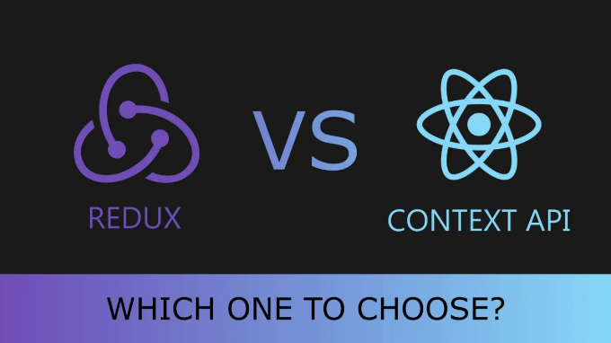
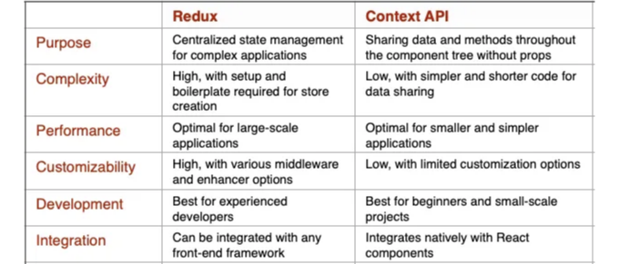

React가 프런트엔드 개발에서 주요 JavaScript 라이브러리 중 하나로 부상함에 따라, 개발자들은 이제 복잡한 애플리케이션 상태를 관리하기 위한 여러 옵션을 가지고 있습니다. 이 옵션들 가운데 React Context API와 Redux가 React 애플리케이션에서 상태 관리에 널리 활용됩니다. 이 두 가지는 동일한 문제를 해결하려고 하지만, 각각의 접근 방식과 장점이 있습니다. 따라서 React Context API와 Redux 중 어떤 것을 선택할지는 특히 React에 익숙하지 않은 개발자들에게 어려운 결정일 수 있습니다.



# Context API란 무엇인가요?

Context API를 시작하려면 React에 추가적인 패키지나 라이브러리가 필요하지 않습니다. React에 내장된 기능이기 때문에 간단히 다음 단계를 따라 설정할 수 있습니다.

<!-- ui-log 수평형 -->
<ins class="adsbygoogle"
  style="display:block"
  data-ad-client="ca-pub-4877378276818686"
  data-ad-slot="9743150776"
  data-ad-format="auto"
  data-full-width-responsive="true"></ins>
<component is="script">
(adsbygoogle = window.adsbygoogle || []).push({});
</component>

- 다른 파일에서 Context를 생성하세요.

```js
import { createContext } from 'react';

export const MyContext = createContext("");
```

2. 앞서 생성한 Context에 대한 Provider를 만드세요.

```js
// 자식 요소들을 Provider로 감싸는 부모 컴포넌트 생성

import { useState, React } from "react";
import { MyContext } from "./MyContext";
import MyComponent from "./MyComponent";

function App() {
  const [text, setText] = useState("");

  return (
    <div>
      <MyContext.Provider value={ {text, setText} }>
        <MyComponent />
      </MyContext.Provider>
    </div>
  );
}

export default App;
```

<!-- ui-log 수평형 -->
<ins class="adsbygoogle"
  style="display:block"
  data-ad-client="ca-pub-4877378276818686"
  data-ad-slot="9743150776"
  data-ad-format="auto"
  data-full-width-responsive="true"></ins>
<component is="script">
(adsbygoogle = window.adsbygoogle || []).push({});
</component>

```js
import { useContext } from 'react';
import { MyContext } from './MyContext';

function MyComponent() {
  const { text, setText } = useContext(MyContext);

  return (
    <div>
      <h1>{text}</h1>
      <button onClick={() => setText('Hello, world!')}>
        Click me
      </button>
    </div>
  );
}

export default MyComponent;
```

Context Api의 장점:

- 데이터 공유 프로세스를 간소화합니다
- 프롭 드릴링에 대한 편리한 대안을 제공합니다
- 효율적인 업데이트를 가능하게 합니다

<!-- ui-log 수평형 -->
<ins class="adsbygoogle"
  style="display:block"
  data-ad-client="ca-pub-4877378276818686"
  data-ad-slot="9743150776"
  data-ad-format="auto"
  data-full-width-responsive="true"></ins>
<component is="script">
(adsbygoogle = window.adsbygoogle || []).push({});
</component>

# Redux

- Redux 라이브러리 설치

```js
npm install @reduxjs/toolkit react-redux
```

2. Slice 생성

<!-- ui-log 수평형 -->
<ins class="adsbygoogle"
  style="display:block"
  data-ad-client="ca-pub-4877378276818686"
  data-ad-slot="9743150776"
  data-ad-format="auto"
  data-full-width-responsive="true"></ins>
<component is="script">
(adsbygoogle = window.adsbygoogle || []).push({});
</component>

```js
import { createSlice, PayloadAction } from '@reduxjs/toolkit';

interface State {
  count: number;
}

const initialState: State = {
  count: 0
};

const counterSlice = createSlice({
  name: 'counter',
  initialState,
  reducers: {
    increment: (state) => {
      state.count += 1;
    },
    decrement: (state) => {
      state.count -= 1;
    }
  }
});

export const { increment, decrement } = counterSlice.actions;

export default counterSlice.reducer;
```

3. 위에서 생성한 Slice로 redux Store를 생성합니다.

```js
import { configureStore } from '@reduxjs/toolkit';
import counterReducer from './counterSlice';

const store = configureStore({
  reducer: {
    counter: counterReducer
  }
});

export default store;
```

4. 위에서 생성한 Store를 React 컴포넌트에 추가합니다.```

<!-- ui-log 수평형 -->
<ins class="adsbygoogle"
  style="display:block"
  data-ad-client="ca-pub-4877378276818686"
  data-ad-slot="9743150776"
  data-ad-format="auto"
  data-full-width-responsive="true"></ins>
<component is="script">
(adsbygoogle = window.adsbygoogle || []).push({});
</component>

```js
import React, { useCallback } from 'react';
import { useDispatch, useSelector } from 'react-redux';
import { increment, decrement } from './counterSlice';
import store from './store';

const Counter = () => {
  const count = useSelector((state: any) => state.counter.count);
  const dispatch = useDispatch();

  const handleIncrement = useCallback(() => {
    dispatch(increment());
  }, [dispatch]);

  const handleDecrement = useCallback(() => {
    dispatch(decrement());
  }, [dispatch]);

  return (
    <div>
      <p>Count: {count}</p>
      <button onClick={handleIncrement}>Increment</button>
      <button onClick={handleDecrement}>Decrement</button>
    </div>
  );
}

export default Counter;
```

마지막으로, Redux 라이브러리에서 Provider로 컴포넌트를 감싸고 store를 위에서 생성한 store로 지정하십시오.

```js
import React from 'react';
import { Provider } from 'react-redux';
import store from './store';
import Counter from './Counter';

const App = () => {
  return (
    <Provider store={store}>
      <Counter />
    </Provider>
  );
}

export default App;
```

Redux를 사용하는 장점 몇 가지는 다음과 같습니다:

<!-- ui-log 수평형 -->
<ins class="adsbygoogle"
  style="display:block"
  data-ad-client="ca-pub-4877378276818686"
  data-ad-slot="9743150776"
  data-ad-format="auto"
  data-full-width-responsive="true"></ins>
<component is="script">
(adsbygoogle = window.adsbygoogle || []).push({});
</component>

- 중앙 집중식 상태 관리: Redux는 애플리케이션 상태를 저장할 중앙 위치를 제공하여 관리하고 디버깅하기 쉽게 만듭니다.
- 예측 가능한 상태 업데이트: 애플리케이션 상태는 액션과 리듀서를 통해서만 업데이트되기 때문에 상태 변경사항이 예측 가능하고 이해하기 쉽습니다.
- 시간 여행 디버깅: Redux를 사용하면 애플리케이션의 상태를 언제든지 추적할 수 있어 디버깅이 쉬워집니다.

# 리액트 Context API와 Redux의 차이점



# 리액트 Context API와 Redux를 언제 사용해야 할까요?

<!-- ui-log 수평형 -->
<ins class="adsbygoogle"
  style="display:block"
  data-ad-client="ca-pub-4877378276818686"
  data-ad-slot="9743150776"
  data-ad-format="auto"
  data-full-width-responsive="true"></ins>
<component is="script">
(adsbygoogle = window.adsbygoogle || []).push({});
</component>

React Context API 또는 Redux를 사용할 지 결정하는 것은 애플리케이션의 특정 요구사항과 복잡성에 따라 다릅니다.

React Context API 사용 시:
1. 소형에서 중간 규모의 애플리케이션

2. 데이터 공유 수준이 적을 때

3. 컴포넌트별 상태:

<!-- ui-log 수평형 -->
<ins class="adsbygoogle"
  style="display:block"
  data-ad-client="ca-pub-4877378276818686"
  data-ad-slot="9743150776"
  data-ad-format="auto"
  data-full-width-responsive="true"></ins>
<component is="script">
(adsbygoogle = window.adsbygoogle || []).push({});
</component>

리덕스 사용하기:
1. 크고 복잡한 애플리케이션

2. 깊게 중첩된 컴포넌트

3. 비동기 데이터 흐름

최종적으로 애플리케이션의 특정 요구 사항, 복잡성 및 규모를 평가하여 React Context API 또는 Redux가 상태 관리에 가장 적합한 선택인지 결정하는 것이 중요합니다. 어떤 경우에는, 지역 상태 관리에 React Context API를 사용하고 전역 상태 관리에 Redux를 사용하는 것이 적절할 수 있습니다.

<!-- ui-log 수평형 -->
<ins class="adsbygoogle"
  style="display:block"
  data-ad-client="ca-pub-4877378276818686"
  data-ad-slot="9743150776"
  data-ad-format="auto"
  data-full-width-responsive="true"></ins>
<component is="script">
(adsbygoogle = window.adsbygoogle || []).push({});
</component>

# 결론

요약하자면, React Context API는 간단한 상태 관리가 필요한 작은 애플리케이션에 적합한 간단한 솔루션이며, Redux는 고급 상태 관리가 필요한 크고 복잡한 애플리케이션에 적합한 강력한 솔루션입니다.

React Context API와 Redux 사이의 선택은 귀하의 애플리케이션의 고유한 요구 사항과 제약 사항에 따라 다릅니다.

문서를 개선하는 데 도움을 주시려면 언제든지 환영합니다.

<!-- ui-log 수평형 -->
<ins class="adsbygoogle"
  style="display:block"
  data-ad-client="ca-pub-4877378276818686"
  data-ad-slot="9743150776"
  data-ad-format="auto"
  data-full-width-responsive="true"></ins>
<component is="script">
(adsbygoogle = window.adsbygoogle || []).push({});
</component>

이 블로그를 읽어 주셔서 감사합니다 :)