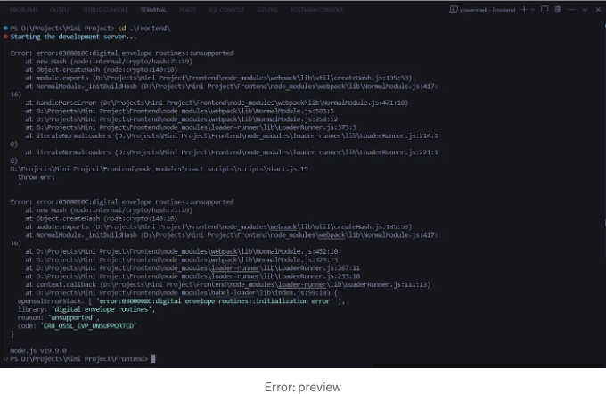
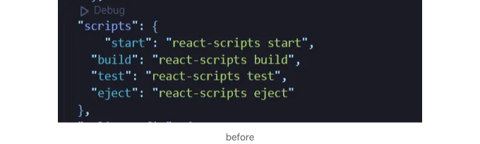

```md


아래는 오류 메시지의 내용입니다:

```js
Error: error:0308010C:digital envelope routines::unsupported
 at new Hash (node:internal/crypto/hash:71:19)
 at Object.createHash (node:crypto:140:10)
 at module.exports (D:\Projects\Mini Project\Frontend\node_modules\webpack\lib\util\createHash.js:135:53)
 at NormalModule._initBuildHash (D:\Projects\Mini Project\Frontend\node_modules\webpack\lib\NormalModule.js:417:16)
 at D:\Projects\Mini Project\Frontend\node_modules\webpack\lib\NormalModule.js:452:10
 at D:\Projects\Mini Project\Frontend\node_modules\webpack\lib\NormalModule.js:323:13
 at D:\Projects\Mini Project\Frontend\node_modules\loader-runner\lib\LoaderRunner.js:367:11
 at D:\Projects\Mini Project\Frontend\node_modules\loader-runner\lib\LoaderRunner.js:233:18
 at context.callback (D:\Projects\Mini Project\Frontend\node_modules\loader-runner\lib\LoaderRunner.js:111:13)
 at D:\Projects\Mini Project\Frontend\node_modules\babel-loader\lib\index.js:59:103 {
 opensslErrorStack: [ 'error:03000086:digital envelope routines::initialization error' ],
 library: 'digital envelope routines',
 reason: 'unsupported',
 code: 'ERR_OSSL_EVP_UNSUPPORTED'
}
Node.js v19.9.0
```

```js
Error: error:0308010C:digital envelope routines::unsupported
    at new Hash (node:internal/crypto/hash:71:19)
    at Object.createHash (node:crypto:140:10)
    at module.exports (D:\Projects\Mini Project\Frontend\node_modules\webpack\lib\util\createHash.js:135:53)       
    at NormalModule._initBuildHash (D:\Projects\Mini Project\Frontend\node_modules\webpack\lib\NormalModule.js:417:16)
    at handleParseError (D:\Projects\Mini Project\Frontend\node_modules\webpack\lib\NormalModule.js:471:10)        
    at D:\Projects\Mini Project\Frontend\node_modules\webpack\lib\NormalModule.js:503:5
    at D:\Projects\Mini Project\Frontend\node_modules\webpack\lib\NormalModule.js:358:12
    at D:\Projects\Mini Project\Frontend\node_modules\loader-runner\lib\LoaderRunner.js:373:3
    at iterateNormalLoaders (D:\Projects\Mini Project\Frontend\node_modules\loader-runner\lib\LoaderRunner.js:214:10)
    at iterateNormalLoaders (D:\Projects\Mini Project\Frontend\node_modules\loader-runner\lib\LoaderRunner.js:221:10)
D:\Projects\Mini Project\Frontend\node_modules\react-scripts\scripts\start.js:19
  throw err;
  ^
```

<!-- ui-log 수평형 -->
<ins class="adsbygoogle"
  style="display:block"
  data-ad-client="ca-pub-4877378276818686"
  data-ad-slot="9743150776"
  data-ad-format="auto"
  data-full-width-responsive="true"></ins>
<component is="script">
(adsbygoogle = window.adsbygoogle || []).push({});
</component>

# 원인:

에러 메시지는 OpenSSL 라이브러리의 디지털 봉투 루틴 초기화에 문제가 있다고 합니다. 이는 종속성의 호환되지 않는 버전, 잘못된 구성 또는 Angular 프로젝트에서 사용되는 암호화 함수에 문제가 있는 등 다양한 요소에 의해 발생할 수 있습니다.

# 해결 방법:

단계 1: “package.json” 파일을 엽니다.

<!-- ui-log 수평형 -->
<ins class="adsbygoogle"
  style="display:block"
  data-ad-client="ca-pub-4877378276818686"
  data-ad-slot="9743150776"
  data-ad-format="auto"
  data-full-width-responsive="true"></ins>
<component is="script">
(adsbygoogle = window.adsbygoogle || []).push({});
</component>

Step2: "Script"을 검색합니다:  

  

Step3: 다음과 같이 "start" 및 "build"를 업데이트하고 저장하세요:

```js
 "start": "set NODE_OPTIONS=--openssl-legacy-provider && react-scripts start",
 "build": "set NODE_OPTIONS=--openssl-legacy-provider && react-scripts build",
```  

<!-- ui-log 수평형 -->
<ins class="adsbygoogle"
  style="display:block"
  data-ad-client="ca-pub-4877378276818686"
  data-ad-slot="9743150776"
  data-ad-format="auto"
  data-full-width-responsive="true"></ins>
<component is="script">
(adsbygoogle = window.adsbygoogle || []).push({});
</component>

아래는 Markdown 형식으로 테이블 태그를 변경하세요.