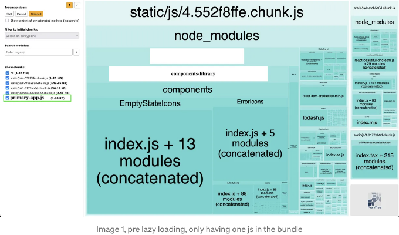
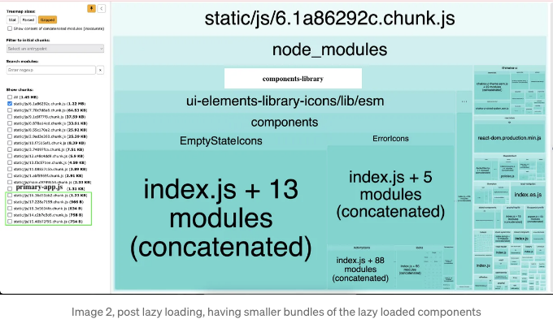
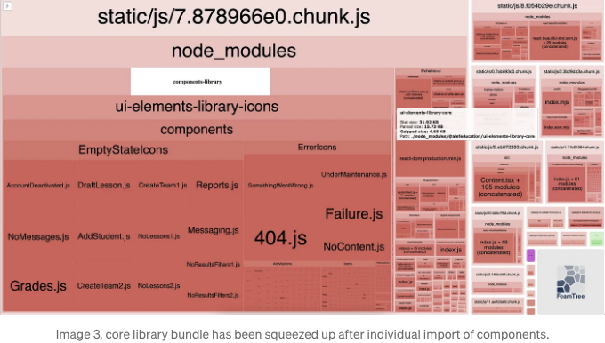

기존 웹 어플리케이션에 새로운 프론트엔드 어플리케이션을 통합하기 위한 전략을 마련하는 것이 제 주어진 일이었어요. 기존 어플리케이션은 이미 상당히 크고 거대했기 때문에 마이크로 프론트엔드 접근 방식을 제안했습니다. 이렇게 하면 저희가 원하는 라이브러리와 프레임워크를 사용하고, 팀의 의견과 결정에 따라 구조를 조정할 수 있을 거예요.

## 화려한 아키텍처로의 만남

얼마 전 온클 밥이 제시한 '화려한 아키텍처(Screaming Architecture)' 개념을 발견했어요. 이는 일반 리액트 어플리케이션과 약간 다르며, 모든 기능이 각각의 컴포넌트로 분리되어 src 하위의 components 디렉토리에 배치된다는 아이디어에 기반해요. 하지만 저희는 모든 기능을 기능별로 나누고 특정 기능에서 다른 기능과 상호 작용해야 하는 단일 또는 다중의 컴포넌트를 내보내는 방식으로 변경하기로 했어요. 이렇게 하면 추상화되고 분리된 상태로 유지할 수 있어요. 따라서 각 기능은 다음과 같은 구조를 가질 것이에요 :-

<!-- ui-log 수평형 -->
<ins class="adsbygoogle"
  style="display:block"
  data-ad-client="ca-pub-4877378276818686"
  data-ad-slot="9743150776"
  data-ad-format="auto"
  data-full-width-responsive="true"></ins>
<component is="script">
(adsbygoogle = window.adsbygoogle || []).push({});
</component>

```js
src/features/awesome-feature
|
+ - api # 주로 graphql 변이 및 쿼리를 포함한 내보낸 API 요청 선언
|
+ - components # 특정 기능에 대한 구성 요소
|
+ - hooks # 특정 기능에 대한 훅
|
+ - routes # 특정 기능 페이지용 라우트 구성 요소
|
+ - stores # 특정 기능에 대한 상태 저장소
|
+ - types # TS 특정 기능 도메인을 위한 TypeScript 타입
|
+ - utils # 특정 기능을 위한 유틸리티 함수
|
+ - index.ts # 해당 기능의 진입점으로, 주어진 기능의 공용 API로 작동해야 하며 기능 외부에서 사용해야 할 모든 것을 내보냅니다
```

또한 이 리포지토리를 발견했는데, 이것은 구현된 개념을 확인하는 아주 좋은 시작점이었습니다.

# 멀리 있는 지평선에서 번개가 치는 중입니다. :-

개발 초기에 모든 것이 순조롭고 빨랐습니다. 그러나 애플리케이션의 기능이 계속 성장함에 따라 기능을 추가할수록 초기 로드 시간과 번들 크기도 증가한다는 것을 알게 되었습니다. 이는 팀 내에서 계속 논의되고 다른 이해관계자도 몇 번 이 문제에 대해 접수했습니다. 우리는 이것이 현재 주요 문제는 아니지만 계속 기능을 추가할 경우 대형 문제로 바뀔 것이라는 것을 알고 있었습니다.

<!-- ui-log 수평형 -->
<ins class="adsbygoogle"
  style="display:block"
  data-ad-client="ca-pub-4877378276818686"
  data-ad-slot="9743150776"
  data-ad-format="auto"
  data-full-width-responsive="true"></ins>
<component is="script">
(adsbygoogle = window.adsbygoogle || []).push({});
</component>

# 팀 모여라! :-

우리의 초기 개발을 마치고 나서, 우리는 이 문제를 살펴보고 해결하려고 결심했습니다.

그래서 우리가 시도한 매우 첫 번째 단계는, 이 문제에 대해 react 문서를 방문하여 그들이 제안하는 것을 이해하는 것이었습니다. 우리는 몇 가지 제안을 발견했습니다: -

- "source-map-explorer"을 사용하고 다음 명령을 실행하여 번들 크기가 증가하는 문제의 원인을 파악하는 방법에 대해 이해했습니다. “analyze”: “source-map-explorer ‘build/static/js/*.js’”
이를 통해 우리는 우리의 앱이 하나의 JS 파일로 번들링되고 있음을 알 수 있었습니다. 우리는 동일한 것을 분할해야 했습니다.
- 그러나 CRA에서 앱을 시작했고 npm eject를 수행하지 않았기 때문에 웹팩 구성이 우리에게 숨겨졌습니다. 우리 자체 구성을 제공하기 위해 webpack 위에 래퍼 역할을 하는 Craco를 사용하고 있었습니다.
- 그 다음으로, react 문서에서 제안하는 두 가지 코드 분할 기술을 사용했습니다.

<!-- ui-log 수평형 -->
<ins class="adsbygoogle"
  style="display:block"
  data-ad-client="ca-pub-4877378276818686"
  data-ad-slot="9743150776"
  data-ad-format="auto"
  data-full-width-responsive="true"></ins>
<component is="script">
(adsbygoogle = window.adsbygoogle || []).push({});
</component>

i. 라우트 분할: 초기에 앱을 위해 두 가지 라우트를 정의했습니다. /courses는 Courses 목록 페이지로 이동하고, /courses/{courseId}는 강의 세부 페이지로 이동합니다. 그러나 이제 두 가지 다른 라우트를 소개했습니다. /course/create-course는 코스 생성 양식 페이지로 이동하고, /course/edit-course/:courseId는 동일한 코스 생성 양식 페이지로 이동하지만 코스를 편집할 때 사용됩니다.

ii. 동적 import로 분할: 모달, 팝오버와 같은 구성 요소들을 지연 로딩하는 방법을 도입했습니다. 이는 페이지 로드 초기에 필요하지 않았습니다.

열매를 맺는 조치:
두 가지 코드 분할 기법을 수행한 후에 BundleAnalyzerPlugin을 실행하여 보고서를 받았습니다. 지연 로딩을 추가함으로써 해당 구성 요소의 번들 크기를 줄였다는 결과가 나왔습니다. 아래 이미지 두 장을 참고하세요,



<!-- ui-log 수평형 -->
<ins class="adsbygoogle"
  style="display:block"
  data-ad-client="ca-pub-4877378276818686"
  data-ad-slot="9743150776"
  data-ad-format="auto"
  data-full-width-responsive="true"></ins>
<component is="script">
(adsbygoogle = window.adsbygoogle || []).push({});
</component>



- 다음으로, 우리는 위 이미지에서 쉽게 확인할 수 있는 대로 lodash와 컴포넌트 라이브러리(아이콘 및 코어)가 번들 크기의 대부분을 차지하고 있다는 것을 알았습니다. 이는 라이브러리 전체를 import 할 때 발생하는 현상인데, 싱글 함수/컴포넌트를 사용할 때에도 라이브러리 전체를 import하고 있는 것입니다.
- 예를 들어 — import { isEmpty } from ‘lodash’ 또는 import { Heading } from @compnent-library
- 이를 방지하기 위해 lodash에서 특정 라이브러리를 import할 수 있습니다. 예시로 import isEmpty from ‘lodash/isEmpty’.
이 구문은 lodash 라이브러리 내의 isEmpty 모듈에서 isEmpty 함수를 직접 import합니다. 이 접근 방식을 "named export"라고 하며, 지정된 경로에서 특정 함수를 직접 import합니다.
- 이를 적용한 후, 앱 번들링에서 더 많은 개선을 확인할 수 있었습니다. 아래 이미지를 참조해주세요.



<!-- ui-log 수평형 -->
<ins class="adsbygoogle"
  style="display:block"
  data-ad-client="ca-pub-4877378276818686"
  data-ad-slot="9743150776"
  data-ad-format="auto"
  data-full-width-responsive="true"></ins>
<component is="script">
(adsbygoogle = window.adsbygoogle || []).push({});
</component>

앞으로 개발자들이 이를 따르도록 강제하기 위해 eslint 구성을 추가할 수 있습니다.

```js
{
  "rules": {
    "custom/no-named-imports-from-lodash": [
      "error",
      {
        "module": "lodash",
        "allowedNamedImports": ["isEmpty", /* 필요한 경우 다른 허용된 이름 있는 가져오기를 여기에 추가하세요 */]
      }
    ]
  }
}
```

이러한 몇 가지 작은 단계를 수행함으로써 번들 크기에 영향을 줄 수 있었으며, 애플리케이션의 초기 로드 시간을 상당히 개선할 수 있었습니다.