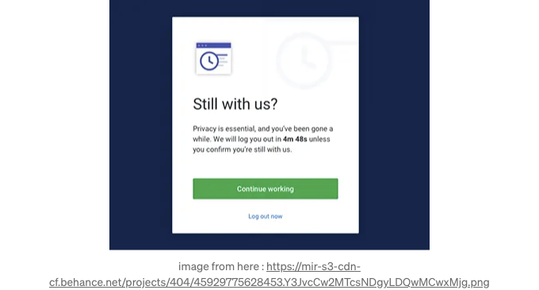
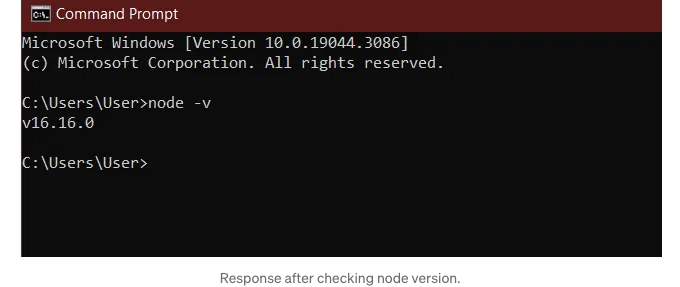
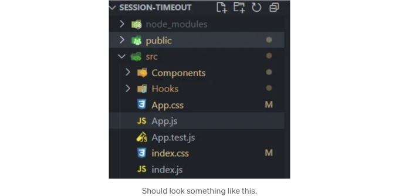
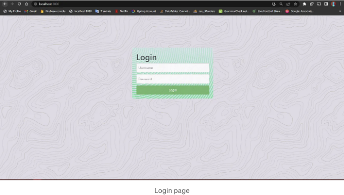
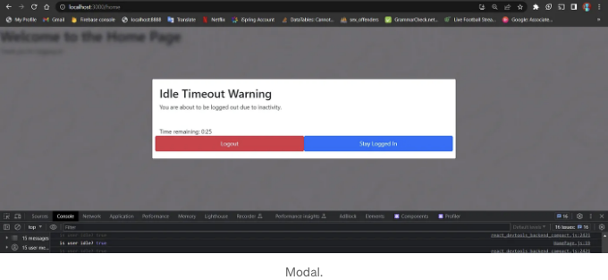

제가 시작하기 전에 졸업했다고 말씀드리고 싶어요!

좋아, 세션 타임아웃 구현이에요. 세션 타임아웃은 웹페이지에서 어느 정도 시간이 지난 후에 활동이 없음을 감지할 때 발생해요. 이렇게 되면 세션이 타임아웃되어 로그아웃되는데, 지속성을 유지하지 않았다면요. 대부분의 사람들이 이런 경험을 한 적이 있을 거에요:



이 기능은 민감한 사용자 정보를 다루는 많은 웹페이지에서 구현된 기능이에요. 이 글은 React 프로젝트에서 이를 어떻게 구현하는지에 대해 안내해줄 거에요.

<!-- ui-log 수평형 -->
<ins class="adsbygoogle"
  style="display:block"
  data-ad-client="ca-pub-4877378276818686"
  data-ad-slot="9743150776"
  data-ad-format="auto"
  data-full-width-responsive="true"></ins>
<component is="script">
(adsbygoogle = window.adsbygoogle || []).push({});
</component>

전제 조건:
- HTML, CSS, JS 및 React에 대한 이해가 필요합니다.
우리는 처음부터 끝까지 단계별로 진행할 것이기 때문에, 이것이 처음이라면 걱정하지 마세요. [알아야 할 몇 가지가 있을 거에요]
- 당신의 컴퓨터에 Node.js가 있어야 합니다.
명령 프롬프트를 열고 "node --v"를 입력하여 확인할 수 있습니다. 이를 통해 컴퓨터에 설치된 node의 버전을 확인할 수 있습니다. 만약 이미 설치되어 있다면, 버전 번호가 표시될 것입니다. 그렇지 않다면, 이 부분을 확인해보세요.



## 1. React 앱 설정하기.

원하는 프로젝트 위치에서 터미널을 열고 다음을 입력하세요:

<!-- ui-log 수평형 -->
<ins class="adsbygoogle"
  style="display:block"
  data-ad-client="ca-pub-4877378276818686"
  data-ad-slot="9743150776"
  data-ad-format="auto"
  data-full-width-responsive="true"></ins>
<component is="script">
(adsbygoogle = window.adsbygoogle || []).push({});
</component>

```js
"npx create-react-app session-timeout"

이 명령은 session-timeout이라는 이름의 React 앱을 생성합니다.

모든 것이 설치되고 터미널에 'happy coding' 문구가 나타나면 다음을 입력하세요:

1. "cd session-timeout" [디렉터리로 이동하는 명령입니다]
2. "npm start" [React 프로젝트를 시작하는 명령입니다]

앱이 실행되고 웹페이지에서 "http://localhost:3000" 링크가 열립니다. 그리고 이로써 React 애플리케이션이 실행됩니다!

## 2. 컴포넌트 생성, 라이브러리 및 패키지 설정

두 개의 페이지, 로그인과 홈페이지를 갖는 간단한 어플리케이션에 세션 타임아웃을 구현할 것입니다. 이전에 몇 가지 패키지를 설치해야 합니다:
- react-router-dom: 이 패키지는 웹 애플리케이션의 동적 라우팅을 담당합니다.
- react-idle-timer: 이 패키지는 어플리케이션에서 비활동 상태를 확인하는 기능을 제공합니다.
```

<!-- ui-log 수평형 -->
<ins class="adsbygoogle"
  style="display:block"
  data-ad-client="ca-pub-4877378276818686"
  data-ad-slot="9743150776"
  data-ad-format="auto"
  data-full-width-responsive="true"></ins>
<component is="script">
(adsbygoogle = window.adsbygoogle || []).push({});
</component>

부트스트랩을 설정해서 어플리케이션을 멋지게 만들 수 있어요. 그래도요. src(원본) 폴더에서 아래의 폴더를 생성해주세요 : components, hooks.



Components 폴더 안에는 홈페이지와 로그인 페이지가 들어가요.
Hooks 폴더 안에는 우리가 직접 만든 훅이 들어가요. 타이머 같은 거 말이에요. 지금 제가 훅에 대해 많이 몰랐다는 걸 깨달았어요.

## 훅(Hooks) — — 크래시 코스.

<!-- ui-log 수평형 -->
<ins class="adsbygoogle"
  style="display:block"
  data-ad-client="ca-pub-4877378276818686"
  data-ad-slot="9743150776"
  data-ad-format="auto"
  data-full-width-responsive="true"></ins>
<component is="script">
(adsbygoogle = window.adsbygoogle || []).push({});
</component>

Hooks는 재사용 가능한 함수들입니다. React에 익숙해졌다면 useState, useEffect 같은 것을 봤을 것이라고 확신합니다. 이러한 것들이 Hooks입니다. 우리는 사용자 정의 훅도 만들 수 있습니다. 사용자 정의 훅으로 간주되려면 파일 이름 앞에 "use"라는 단어를 붙여야 합니다.

예시:
우리는 일상 생활에서 가장 기본적인 활동, 걷기를 사용할 것입니다. 우리는 이를 이용해 지점 A에서 B로 이동합니다. 만약 나가 함수를 여기저기 반복적으로 쓰는건 지루하고 시간 낭비이며 공간 낭비일 것입니다. 함수를 한 번 만들어 어딘가에 넣어두고 필요할 때마다 호출하기만 하면 됩니다. 
아래는 사용자 정의 훅을 만드는 방법을 설명한 부분입니다:

우리의 사용자 정의 훅 useWalking 구현:

내용 이해했다고 가정하고, "hihi"라는 파일을 만들어보겠습니다. 폴더 "Hooks"에 useIdleTimer.js 파일을 생성합니다. 여기에 애플리케이션에서 비활성 상태를 확인하는 사용자 정의 훅을 만들 것입니다.
새로 생성한 파일에 다음을 추가하세요:

<!-- ui-log 수평형 -->
<ins class="adsbygoogle"
  style="display:block"
  data-ad-client="ca-pub-4877378276818686"
  data-ad-slot="9743150776"
  data-ad-format="auto"
  data-full-width-responsive="true"></ins>
<component is="script">
(adsbygoogle = window.adsbygoogle || []).push({});
</component>

자 그것을 살펴보겠습니다:
- 2번째 줄에서는 설치한 패키지로부터 useIdleTimer를 가져왔습니다.
- 4번째 줄에서는 우리의 커스텀 훅 useIdle을 정의하고, onIdle, idleTime과 같은 새로운 속성을 가져왔습니다.
- 5번째 줄에서는 사용자의 유휴 상태를 확인하고 저장하는 상태를 생성했습니다. 이 값은 참/거짓이 될 수 있습니다.
- 8번째 줄부터 28번째 줄까지는 사용자가 유휴 상태인 걸 발견했을 때 실행될 함수(handleOnIdle)를 정의했습니다.

```js
const handleOnIdle = (event) => {
  setIsIdle(true); // 사용자가 유휴 상태임을 나타내는 상태를 참으로 설정합니다.

  const currentTime = new Date();// 현재 날짜 및 시간을 가져옵니다.
  const formattedCurrentTime = currentTime.toLocaleString("en-US", {
    weekday: "short",
    year: "numeric",
    month: "short",
    day: "numeric",
    hour: "numeric",
    minute: "numeric",
    second: "numeric",
    timeZoneName: "short",
  }); // 그런 다음 날짜 및 시간을 읽기 쉬운 형식으로 포맷합니다.

  console.log("user is idle", event); // "user is idle" 메시지와 이벤트 객체를 기록합니다.
  console.log("Last Active time", getLastActiveTime()); // getLastActiveTime() 함수를 호출하여 마지막 사용자 활동의 타임스탬프를 기록합니다.
  console.log("Current time", formattedCurrentTime); // 참고용으로 형식화된 현재 시간을 기록합니다.

  onIdle(); // onIdle 함수를 호출합니다. 이 함수는 Homepage.js에서 호출될 것입니다.
};

// 나는 마지막 활동 시간과 현재 시간을 기록했습니다. 나중을 위해 남겨두었어요.
```

- 30번째에서 34번째 줄: 이 부분에서 커스텀 훅은 useIdleTimer 훅의 반환 값을 구조 분해하고 있습니다. useIdleTimer 훅은 다음 속성들을 인자로 받는 객체를 허용합니다:

  - timeout: 사용자가 유휴 상태로 간주되는 시간(밀리초 단위)을 지정합니다. idleTime에 따라 계산된 값으로 설정됩니다. 여기서 idleTime은 분 단위로 원하는 유휴 시간을 결정하는 변수입니다.
  - onIdle: 사용자가 유휴 상태가 되었을 때 실행될 콜백 함수입니다. 코드에서 handleOnIdle은 사용자가 유휴 상태가 되었을 때 호출될 함수를 나타냅니다.
  - debounce: 이것은 사용자의 활동이 감지되기 전에 대기하는 '음'과 같은 것입니다. 누군가가 질문을 하면 답변을 하기 전에 "기다려요..."라고 대답하는 것처럼 동작합니다. 이는 사용자가 비활성 상태가 되자마자 바로 유휴 상태가 트리거되는 것이 아니라 지정된 디바운스 시간이 경과한 후에만 발생한다는 것을 의미합니다. 코드에서 500밀리초(0.5초)로 설정되어 있습니다.

<!-- ui-log 수평형 -->
<ins class="adsbygoogle"
  style="display:block"
  data-ad-client="ca-pub-4877378276818686"
  data-ad-slot="9743150776"
  data-ad-format="auto"
  data-full-width-responsive="true"></ins>
<component is="script">
(adsbygoogle = window.adsbygoogle || []).push({});
</component>

35–41번 라인. 이런 모든 속성들을 반환하고, 우리 훅을 내보내 줍니다. 사용할 준비가 되었습니다.

## React Router Dom

말했듯이, 이것은 우리 애플리케이션의 라우팅을 담당하는 것입니다. 로그인 페이지와 홈페이지 두 개가 있습니다. 우리는 로그인 후 홈페이지로 이동하도록 설정하고 싶습니다. App.js 파일에 다음을 넣어주세요:

```js
import React from "react";

// 이곳에서 react router dom의 사용 가능한 속성을 import 하였습니다.
import { BrowserRouter as Router, Routes, Route } from "react-router-dom";

// components 폴더에서 페이지들을 import 합니다.
import Login from "./Components/Login";
import HomePage from "./Components/HomePage";

function App() {
  return (
    <Router>
      <Routes>
        <Route exact path="/" element={<Login/>} />
        <Route path="/home" element={<HomePage/>} />
      </Routes>
    </Router>
  );
}

export default App;

// 리액트 앱 안에는 일반적으로 Router(부모의 역할)가 있습니다.
// 이것은 다른 Routes들을 포함하고 있습니다.
// 이러한 라우트들은 각각의 경로로 구성되어 있습니다.
// 위에서 보이는 것은 이와 같습니다:
// "http://localhost:3000/" - 앱이 실행되면 로그인 페이지로 이동합니다.
// "http://localhost:3000/home" - 홈페이지로 이동합니다.
// 이 페이지들이 설정되지 않아 오류가 발생할 수 있습니다. 그것을 해결해보겠습니다.
```

<!-- ui-log 수평형 -->
<ins class="adsbygoogle"
  style="display:block"
  data-ad-client="ca-pub-4877378276818686"
  data-ad-slot="9743150776"
  data-ad-format="auto"
  data-full-width-responsive="true"></ins>
<component is="script">
(adsbygoogle = window.adsbygoogle || []).push({});
</component>

## 로그인 페이지

“Login.js” 파일에 붙여넣기 하세요.

```js
import React, { useState } from "react";
import { useNavigate } from "react-router-dom";
import "./component.css";

function Login() {
  const navigate = useNavigate();
  const [username, setUsername] = useState("");
  const [password, setPassword] = useState("");

  // 홈 페이지로 이동하는 함수 (엔드포인트 "/home")
  const handleLogin = (e) => {
    e.preventDefault();
    alert("홈 페이지로 이동 중");
    navigate("/home");
  };

  return (
    <div className="login-container">
      <h1>로그인</h1>
      <form onSubmit={handleLogin}>
        <input
          type="text"
          placeholder="사용자명"
          value={username}
          onChange={(e) => setUsername(e.target.value)}
          className="login-input"
        />
        <br />
        <input
          type="password"
          placeholder="비밀번호"
          value={password}
          onChange={(e) => setPassword(e.target.value)}
          className="login-input"
        />
        <br />
        <button type="submit" className="login-button">로그인</button>
      </form>
    </div>
  );
}

export default Login;
// 로그인 페이지에는 사용자명과 비밀번호를 입력하는 폼이 있습니다.
// 또한, 클릭하면 navigate를 사용하여 홈페이지로 이동하는 버튼이 있습니다.
// 라우트 "/home"으로 이동합니다 --- navigate("/home");
// 이것은 우리가 app.js에 설정한 경로와 동일합니다.
// 원하는대로 이름을 정할 수 있으나 일치해야 하며, 그렇지 않으면 선언된 링크가 없는 화이트 스크린이 표시됩니다
```

저의 화면에서는 다음과 같이 로그인 페이지가 스타일이 적용되어 있습니다.
저의 엔드포인트(localhost:3000)은 선언된 경로와 동일합니다 "/".

<!-- ui-log 수평형 -->
<ins class="adsbygoogle"
  style="display:block"
  data-ad-client="ca-pub-4877378276818686"
  data-ad-slot="9743150776"
  data-ad-format="auto"
  data-full-width-responsive="true"></ins>
<component is="script">
(adsbygoogle = window.adsbygoogle || []).push({});
</component>

```markdown


버튼을 클릭하면 홈페이지로 이동합니다. 하지만 아직 홈페이지가 없습니다. 만들어보도록 하죠.

## 홈페이지

HomePage.js 파일을 생성하고 다음을 추가하세요:
```

<!-- ui-log 수평형 -->
<ins class="adsbygoogle"
  style="display:block"
  data-ad-client="ca-pub-4877378276818686"
  data-ad-slot="9743150776"
  data-ad-format="auto"
  data-full-width-responsive="true"></ins>
<component is="script">
(adsbygoogle = window.adsbygoogle || []).push({});
</component>

```js
import React, { useState, useEffect } from "react";
import { useNavigate } from "react-router-dom";
import useIdle from "../Hooks/useIdleTimer.js";
import "./component.css"

function HomePage() {


  const navigate = useNavigate();
  const [showModal, setShowModal] = useState(false);
  const [remainingTime, setRemainingTime] = useState(0);

  const handleIdle = () => {
    setShowModal(true); // 모달 표시
    setRemainingTime(30); // 남은 시간을 30으로 설정합니다.
  };

  const { isIdle } = useIdle({ onIdle: handleIdle, idleTime: 0.3});

  useEffect(() => {
    let interval;

    if (isIdle && showModal) {
      interval = setInterval(() => {
        setRemainingTime(
          (prevRemainingTime) =>
            prevRemainingTime > 0 ? prevRemainingTime - 1 : 0 // 1초씩 감소
        );
      }, 1000);
    }

    return () => {
      clearInterval(interval);
    };
  }, [isIdle, showModal]);

  useEffect(() => {
    if (remainingTime === 0 && showModal) {
      // alert("시간 초과!");
      setShowModal(false);
      navigate("/");
    }
  }, [remainingTime, showModal, navigate]); // 타이머가 0이 되면 사용자를 로그아웃시키고 "/"로 이동합니다.

  const handleLogOut = () => {
    setShowModal(false);
    navigate("/");
  };

  const handleStayLoggedIn = () => {
    setShowModal(false);

  };

  function millisToMinutesAndSeconds(millis) {
    var minutes = Math.floor(millis / 60000);
    var seconds = ((millis % 60000) / 1000).toFixed(0);
    return minutes + ":" + (seconds < 10 ? "0" : "") + seconds;
  }

  return (
    <>
      {/* isIdle을 위한 모달 핸들링 */}
      {isIdle && showModal && (
        <div className="modal">
          <div className="modal-content">
            <h2>Idle Timeout Warning</h2>
            <p>활동이 없어 로그아웃될 예정입니다.</p>
            <br />
            남은 시간: {millisToMinutesAndSeconds(remainingTime * 1000)}
            <br />
            <div className="row">
            <button className="btn btn-danger" onClick={handleLogOut}>
              로그아웃
            </button>
            <button className="btn btn-primary " onClick={handleStayLoggedIn}>
              로그인 상태 유지
            </button>
            </div>

          </div>
        </div>
      )}

      <div>
        <h1>홈 페이지에 오신 것을 환영합니다</h1>
        <p>로그인 해주셔서 감사합니다!</p>
      </div>
    </>
  );
}

export default HomePage;
```

<!-- ui-log 수평형 -->
<ins class="adsbygoogle"
  style="display:block"
  data-ad-client="ca-pub-4877378276818686"
  data-ad-slot="9743150776"
  data-ad-format="auto"
  data-full-width-responsive="true"></ins>
<component is="script">
(adsbygoogle = window.adsbygoogle || []).push({});
</component>

아래는 코드 조각에 대한 설명입니다:

1. Import 구문

```js
import React, { useState, useEffect } from "react";
import { useNavigate } from "react-router-dom";
import useIdle from "../Hooks/useIdleTimer.js";
import "./component.css"

// 우리는 react에서 속성을 import 합니다
// react router dom에서 useNavigate를 import 합니다
// 우리의 파일로부터 custom hook useIdle을 import 합니다
// css 파일을 import 합니다
```

<!-- ui-log 수평형 -->
<ins class="adsbygoogle"
  style="display:block"
  data-ad-client="ca-pub-4877378276818686"
  data-ad-slot="9743150776"
  data-ad-format="auto"
  data-full-width-responsive="true"></ins>
<component is="script">
(adsbygoogle = window.adsbygoogle || []).push({});
</component>

```js
  const navigate = useNavigate();// 이것을 사용하여 탐색합니다. 명백하게
  const [showModal, setShowModal] = useState(false);
  const [remainingTime, setRemainingTime] = useState(0);

// showModal 및 Remaining time을위한 상태를 가지고 있습니다.
// showModal은 true/false 인 경우 모달을 표시하는 데 책임이 있습니다.
//remaining time은 자동으로 로그 아웃되기 전에 남은 시간을 표시합니다.


//이 함수는 밀리초를 분과 초로 변환합니다.
  function millisToMinutesAndSeconds(millis) {
    var minutes = Math.floor(millis / 60000);
    var seconds = ((millis % 60000) / 1000).toFixed(0);
    return minutes + ":" + (seconds < 10 ? "0" : "") + seconds;
  }
```

- useIdle
우리의 사용자 지정 후크 useIdle을 기억하십니까? 지금 사용 중입니다. 먼저 사용자가 유휴 상태인 경우 실행되는 함수 handleIdle을 만들어야합니다.
따라서 useIdle을 사용하기 전에 먼저 정의해야합니다.
따라서 handleIdle 함수는 우리가 유휴 상태 인 경우 모달 상태를 true로 설정하고 모달이 닫히기 전에 남은 시간을 30초 추가합니다.

```js
const handleIdle = () => {
    setShowModal(true); //모달 표시
    setRemainingTime(30); //남은 시간으로 30초 설정
  };
```

이후 이 함수를 이렇게 구현합니다 :```

<!-- ui-log 수평형 -->
<ins class="adsbygoogle"
  style="display:block"
  data-ad-client="ca-pub-4877378276818686"
  data-ad-slot="9743150776"
  data-ad-format="auto"
  data-full-width-responsive="true"></ins>
<component is="script">
(adsbygoogle = window.adsbygoogle || []).push({});
</component>

```js
  const { isIdle } = useIdle({ onIdle: handleIdle, idleTime: 0.3});

  console.log("사용자가 휴면 상태인가요?", isIdle);// null, true, false
```

useIdle 훅은 두 개의 속성을 포함하는 객체를 전달하여 호출됩니다: 

- onIdle: 사용자가 휴면 상태가되었을 때 실행 될 콜백 함수(handleIdle)입니다. [위에있는 함수]
- idleTime: 사용자가 휴면 상태로 간주되는 지속 시간(분)을 지정합니다. 이 경우 0.3 분(또는 18 초)으로 설정되어 있습니다.
- useIdle 훅은 isIdle 값을 얻기 위해 비구조화 된 객체를 반환합니다. isIdle은 사용자의 현재 휴면 상태를 나타냅니다.
- console.log 문은 "사용자가 휴면 상태인가요?" 메시지와 isIdle 값과 함께 기록하는 데 사용됩니다. 이것은 사용자의 현재 휴면 상태를 콘솔에 출력합니다. true, false, null이 될 수 있습니다.
우리가 다루고 있는 것은 이것이 true일 때의 일입니다.

useEffects
1. 타이머 useEffect
```

<!-- ui-log 수평형 -->
<ins class="adsbygoogle"
  style="display:block"
  data-ad-client="ca-pub-4877378276818686"
  data-ad-slot="9743150776"
  data-ad-format="auto"
  data-full-width-responsive="true"></ins>
<component is="script">
(adsbygoogle = window.adsbygoogle || []).push({});
</component>

```js
useEffect(() => {
    let interval;

    if (isIdle && showModal) {
      interval = setInterval(() => {
        setRemainingTime(
          (prevRemainingTime) =>
            prevRemainingTime > 0 ? prevRemainingTime - 1 : 0 // 1초씩 줄이기
        );
      }, 1000);
    }

    return () => {
      clearInterval(interval);
    };
  }, [isIdle, showModal]);
```

이 코드는 isIdle과 showModal이 true일 때 매 초마다 remainingTime 상태를 업데이트하는 간격(interval)을 설정합니다.
이제 이 setInterval은 현재/이전 시간(setRemainingTime) 값을 가져와서 시간이 0보다 크면 1초를 뺍니다. 그렇지 않으면 0으로 설정합니다.
interval은 setInterval의 두 번째 인수가 1000이므로 매 1000밀리초(1초)마다 트리거됩니다.
컴포넌트가 언마운트되었거나 isIdle 또는 showModal이 변경되면 추가 업데이트를 방지하기 위해 interval이 해제됩니다.

2. 로그아웃 useEffect

```js
useEffect(() => {
    if (remainingTime === 0 && showModal) {
      //alert("시간 초과!");
      setShowModal(false);//모달 닫기
      navigate("/");//로그인 페이지로 이동
    }
  }, [remainingTime, showModal, navigate]); //이 함수는
// 남은 시간, showModal 및 navigate를 고려하여 실행되며,
// 필요한지 여부는 알 수 없습니다.
```

<!-- ui-log 수평형 -->
<ins class="adsbygoogle"
  style="display:block"
  data-ad-client="ca-pub-4877378276818686"
  data-ad-slot="9743150776"
  data-ad-format="auto"
  data-full-width-responsive="true"></ins>
<component is="script">
(adsbygoogle = window.adsbygoogle || []).push({});
</component>

이 useEffect는 만약 남은 시간이 완전히 0이 되고 모달이 여전히 열려 있다면, 모달을 닫고 로그인 페이지로 이동합니다. 즉, 로그아웃됩니다.

- 핸들 함수

```js
const handleLogOut = () => {
    setShowModal(false);
    navigate("/");// 로그인 페이지로 이동
};

const handleStayLoggedIn = () => {
    setShowModal(false);// 모달 닫기
};
```

handleLogout — 모달을 닫고 로그인 페이지로 이동합니다.
handleStayLoggedIn — 이 함수는 모달을 닫고 계속 진행할 수 있습니다. 만약 무작위 활동을 감지하면, 사용자 정의 후크가 다시 작동하여 프로세스를 다시 시작합니다.

<!-- ui-log 수평형 -->
<ins class="adsbygoogle"
  style="display:block"
  data-ad-client="ca-pub-4877378276818686"
  data-ad-slot="9743150776"
  data-ad-format="auto"
  data-full-width-responsive="true"></ins>
<component is="script">
(adsbygoogle = window.adsbygoogle || []).push({});
</component>

- 되돌아가기

```js
<>
      {/* 모달에 대한 isIdle 처리 */}
      {isIdle && showModal && (
        <div className="modal">
          <div className="modal-content">
            <h2>유휴 시간 초과 경고</h2>
            <p>비활동으로 인해 로그아웃될 예정입니다.</p>
            <br />
            남은 시간: {millisToMinutesAndSeconds(remainingTime * 1000)}
            <br />
            <div className="row">
            <button className="btn btn-danger" onClick={handleLogOut}>
              로그아웃
            </button>
            <button className="btn btn-primary " onClick={handleStayLoggedIn}>
              로그인 유지
            </button>
            </div>

          </div>
        </div>
      )}

      <div>
        <h1>홈페이지에 오신 것을 환영합니다</h1>
        <p>로그인해 주셔서 감사합니다!</p>
      </div>
    </>
```

조건부 렌더링. showModal 및 isIdle이 모두 true일 때에만 팝업이 표시되도록 응용 프로그램에 알려줍니다. 둘 다가 아니라, 둘 다가야 합니다.



<!-- ui-log 수평형 -->
<ins class="adsbygoogle"
  style="display:block"
  data-ad-client="ca-pub-4877378276818686"
  data-ad-slot="9743150776"
  data-ad-format="auto"
  data-full-width-responsive="true"></ins>
<component is="script">
(adsbygoogle = window.adsbygoogle || []).push({});
</component>

볼래! 방금 무슨 일을 했는지 확인해 보세요! 로그인한 후 18초 동안(0.3)[유휴시간] 아무것도 안 하면 0.5초(500)의 '우희'(Debounce)가 있었어요. 그래서 앱은 정말이지 당신이 아무것도 안 하고 있었다는 걸 확실히 알아차렸어요. 그럼 팝업창이 나타나요. 그리고 30초간의 카운트다운을 시작해서, 로그인 유지할지 로그아웃할지 결정할 시간을 줘요. 카운트다운이 끝나면 결정을 내리지 않으면 시스템이 자동으로 대신 선택해서 로그아웃해 버릴 거예요. 남은 시간과 유휴 시간은 자유롭게 조절할 수 있어요. 이 GitHub 프로젝트로 가서 확인해 보세요.

이게 다야! 세션 타임아웃을 구현하셨어요.