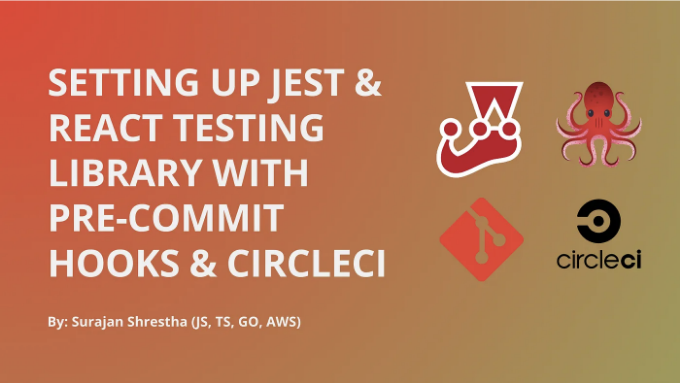

Jest 및 React Testing Library를 Pre-Commits (Husky) 및 CI (CircleCI)와 함께 설정해 보겠습니다. 이는 적절한 테스트 주도 개발 (TDD)을 위한 것입니다.

TDD는 테스트를 작성하고 응용 프로그램이 예상대로 실행되는지 확인하는 것뿐만 아니라, CI/CD 파이프라인을 통해 제품을 출시하고 Pre-commit 훅을 사용하여 높은 개발자 경험을 제공하는 것도 포함됩니다.

# 우리가 하는 일

<!-- ui-log 수평형 -->
<ins class="adsbygoogle"
  style="display:block"
  data-ad-client="ca-pub-4877378276818686"
  data-ad-slot="9743150776"
  data-ad-format="auto"
  data-full-width-responsive="true"></ins>
<component is="script">
(adsbygoogle = window.adsbygoogle || []).push({});
</component>

이 기사는 두 부분으로 나뉩니다:

- 첫 번째 부분: Pre-Commits로 TDD 설정하기 (Husky)
- 두 번째 부분: CI/CD 플랫폼 (CircleCI)를 활용하여 TDD 설정하기

## 기술 스택

- 설정 도구: Vite ⚡️ 및 React Typescript 템플릿으로 React를 사용합니다.
- 주요 패키지: Jest 🃏 및 React Testing Library 🐙
- Pre-Commit 도구: Husky 🐶
- CI (지속적 통합) 플랫폼: CircleCI 🚢

<!-- ui-log 수평형 -->
<ins class="adsbygoogle"
  style="display:block"
  data-ad-client="ca-pub-4877378276818686"
  data-ad-slot="9743150776"
  data-ad-format="auto"
  data-full-width-responsive="true"></ins>
<component is="script">
(adsbygoogle = window.adsbygoogle || []).push({});
</component>

# 폴더 구조

이것이 우리가 가고 있는 폴더 구조입니다:

```js
-.circleci <= CircleCI를 이용한 CI 설정
-.husky <= Husky를 이용한 Pre-Commit 설정
-src
  -components
    -Counter
      -index.tsx
      -Counter.test.tsx <= Counter 컴포넌트에 대한 테스트
    -Link
      -index.tsx
      -Link.test.tsx <= Link 컴포넌트에 대한 테스트
      -__snapshots__ <= 스냅샷 테스트에 의해 생성된 스냅샷
  -other stuff...
-package.json
-node_modules 및 기타...
```

# 1. 첫 번째 부분: Pre-Commit을 이용한 TDD 설정 (Husky)

<!-- ui-log 수평형 -->
<ins class="adsbygoogle"
  style="display:block"
  data-ad-client="ca-pub-4877378276818686"
  data-ad-slot="9743150776"
  data-ad-format="auto"
  data-full-width-responsive="true"></ins>
<component is="script">
(adsbygoogle = window.adsbygoogle || []).push({});
</component>

프리 커밋 훅은 커밋을 하기 전에 실행되는 특별한 스크립트입니다. 우리는 이러한 훅을 사용하여 특정 조건이 충족될 때에만 커밋이 발생하도록 합니다. 이는 더 나은 코드 품질을 유지하고 불필요한 커밋을 줄여줍니다.

Husky 🐶은 프리 커밋 훅을 처리하고 설정하는 데 사용되는 필수 도구입니다. 작동 방식은 다음과 같습니다:

- 커밋을 시도하면 Husky가 프리 커밋 스크립트를 트리거합니다.
- 프리 커밋 스크립트는 Jest를 실행하여 모든 테스트를 실행합니다.
- 모든 테스트가 통과하면 ✅ 커밋이 정상적으로 진행됩니다.
- 테스트 중 하나라도 실패하면 ❌, Husky가 커밋을 막고 실패 사항을 상세히 나타내는 오류 메시지를 볼 수 있습니다.

이는 변경 사항을 푸시하기 전에 오류를 잡아 코드 품질을 보장하는 데 도움이 됩니다.

<!-- ui-log 수평형 -->
<ins class="adsbygoogle"
  style="display:block"
  data-ad-client="ca-pub-4877378276818686"
  data-ad-slot="9743150776"
  data-ad-format="auto"
  data-full-width-responsive="true"></ins>
<component is="script">
(adsbygoogle = window.adsbygoogle || []).push({});
</component>

## a. Husky 설치하기

원하는 패키지 관리자를 사용하여 Husky를 설치하세요. 저는 npm을 사용하고 있어요. Husky를 개발 의존성으로 설치하고 있습니다.

```js
npm install --save-dev husky
```

## b. Husky 초기화하기

<!-- ui-log 수평형 -->
<ins class="adsbygoogle"
  style="display:block"
  data-ad-client="ca-pub-4877378276818686"
  data-ad-slot="9743150776"
  data-ad-format="auto"
  data-full-width-responsive="true"></ins>
<component is="script">
(adsbygoogle = window.adsbygoogle || []).push({});
</component>

우리의 루트 디렉터리에서 'husky init' 명령을 실행해주세요.

```js
npx husky init
```

이 명령어는 두 가지를 수행합니다:

- .husky/pre-commit와 같은 .husky 폴더 내의 pre-commit 스크립트를 생성합니다.
- package.json 파일에서 prepare 스크립트를 업데이트하거나 추가합니다. package.json 파일의 scripts 섹션 안에 "prepare": "husky" 라는 항목을 찾을 수 있습니다.

<!-- ui-log 수평형 -->
<ins class="adsbygoogle"
  style="display:block"
  data-ad-client="ca-pub-4877378276818686"
  data-ad-slot="9743150776"
  data-ad-format="auto"
  data-full-width-responsive="true"></ins>
<component is="script">
(adsbygoogle = window.adsbygoogle || []).push({});
</component>

## c. 패키지.json에서 테스트 스크립트 설정하기

우리의 package.json 파일에서 "scripts" 섹션에 테스트 스크립트를 추가해봅시다:

- "test": "react-scripts test" : 이것은 테스트를 실행하는 기본 방법입니다. 이는 감시 모드에서 우리의 테스트를 실행할 것입니다 👀 즉, 코드를 변경하고 저장하면 모든 테스트가 다시 실행될 것입니다.
- "test:staged": "CI=true react-scripts test --o" : 이것은 CI 모드에서 테스트를 실행합니다. 이 모드는 pre-commit 훅과 통합하기에 더 적합합니다 ✅.
-- o 플래그는 마지막 커밋 이후 변경된 파일들과 관련된 테스트만 실행하는 데 사용됩니다 😎.

```json
// package.json
"name": "jest-react",
// ... 기존 stuff
"scripts": {
  // ... 기존 stuff
  "test": "react-scripts test",
  "test:staged": "CI=true react-scripts test --o",
  "prepare": "husky"
},
```

<!-- ui-log 수평형 -->
<ins class="adsbygoogle"
  style="display:block"
  data-ad-client="ca-pub-4877378276818686"
  data-ad-slot="9743150776"
  data-ad-format="auto"
  data-full-width-responsive="true"></ins>
<component is="script">
(adsbygoogle = window.adsbygoogle || []).push({});
</component>

## d. 커밋하기 전에 실행할 테스트 설정

우리의 ./husky/pre-commit 파일에서, npm run test:staged 명령어를 작성하세요. 이 명령어는 package.json에서 정의된 "test:staged" 스크립트를 실행합니다.

```js
npm run test:staged
```

만약 테스트가 통과하면 ✅, 커밋이 진행됩니다. 그렇지 않으면, 테스트가 실패하면 ❌, 커밋이 중지되고 실패한 이유를 설명하는 오류 메시지가 출력됩니다.

<!-- ui-log 수평형 -->
<ins class="adsbygoogle"
  style="display:block"
  data-ad-client="ca-pub-4877378276818686"
  data-ad-slot="9743150776"
  data-ad-format="auto"
  data-full-width-responsive="true"></ins>
<component is="script">
(adsbygoogle = window.adsbygoogle || []).push({});
</component>

## d. 우리가 pre-commit에서 "test:staged"를 사용한 이유는 무엇인가요? 🤔

만약 우리가 ./husky/pre-commit 파일 내에 "test": "react-scripts test"를 사용한다면, 우리가 새로운 커밋을 추가할 때마다 테스트가 성공했는지 실패했는지와는 무관하게 Jest가 watch 모드에 갇히게 됩니다 ⚠️.
그래서, 이 방법은 pre-commits에 적합하지 않습니다 ❌.

하지만, 우리가 "test:staged": "CI=true react-scripts test --o"를 사용한다면, Jest는 CI=true 명령 때문에 테스트를 watch 모드로 실행하지 않는다는 점을 이해합니다. 또한 --o flag는 마지막 커밋 이후 변경된 파일들만을 테스트하도록 보장하여, 특히 대규모 프로젝트에서 개발 속도를 높일 수 있습니다.
그래서, 이 방법은 pre-commits에 적합합니다 ✅.

## e. 데모

<!-- ui-log 수평형 -->
<ins class="adsbygoogle"
  style="display:block"
  data-ad-client="ca-pub-4877378276818686"
  data-ad-slot="9743150776"
  data-ad-format="auto"
  data-full-width-responsive="true"></ins>
<component is="script">
(adsbygoogle = window.adsbygoogle || []).push({});
</component>

의도적으로 코드를 깨뜨려서 몇 가지 테스트가 실패하도록 해 봅시다 ❌.

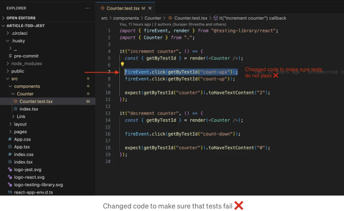

그런 다음 새로운 git 커밋을 추가해 봅시다. git commit -m “testing husky”. 우리는 테스트가 실패했음을 확인할 수 있습니다 ❌. 따라서 우리의 커밋이 기록되지 않고 Husky에 의해 폐기되는 것을 확인할 수 있습니다.

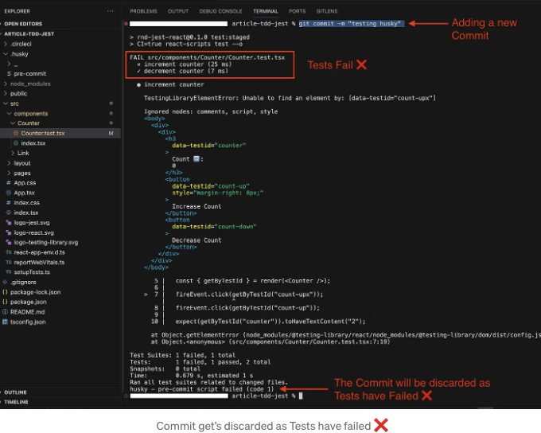

<!-- ui-log 수평형 -->
<ins class="adsbygoogle"
  style="display:block"
  data-ad-client="ca-pub-4877378276818686"
  data-ad-slot="9743150776"
  data-ad-format="auto"
  data-full-width-responsive="true"></ins>
<component is="script">
(adsbygoogle = window.adsbygoogle || []).push({});
</component>

실패는 이제 그만! 이제 테스트를 통과해보세요 ✅. 여기서 코드를 수정하여 테스트가 통과하도록 변경했어요 ✅.

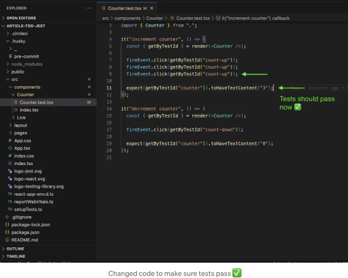

자, 이제 새로운 커밋을 추가해봅시다. `git commit -m "testing husky, tests should pass"`. 모든 테스트가 통과하는 것을 확인할 수 있어요✅. 따라서 우리의 커밋이 성공적으로 등록되었습니다 ✅.

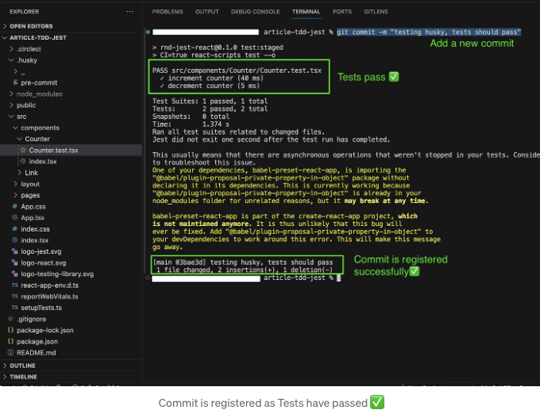

<!-- ui-log 수평형 -->
<ins class="adsbygoogle"
  style="display:block"
  data-ad-client="ca-pub-4877378276818686"
  data-ad-slot="9743150776"
  data-ad-format="auto"
  data-full-width-responsive="true"></ins>
<component is="script">
(adsbygoogle = window.adsbygoogle || []).push({});
</component>

# 2. 두 번째 부분: CI/CD 플랫폼(CircleCI)에서 TDD 설정하기

우리는 Pre-Commit과 Jest를 성공적으로 설정했습니다. 이제 CI/CD 플랫폼에서 설정합니다. 이를 위해 CircleCI를 선택했습니다.

Pre-Commit으로 테스트를 실행할 때, 마지막 커밋 이후에 변경된 파일에 대해서만 테스트를 실행하는 것이 좋습니다.

CI/CD 환경에서 🚢, 언제나 모든 테스트를 실행하여 애플리케이션이 오류가 발생하기 어려운 상태를 유지하는 것이 최선의 실천 방법입니다. ✅

<!-- ui-log 수평형 -->
<ins class="adsbygoogle"
  style="display:block"
  data-ad-client="ca-pub-4877378276818686"
  data-ad-slot="9743150776"
  data-ad-format="auto"
  data-full-width-responsive="true"></ins>
<component is="script">
(adsbygoogle = window.adsbygoogle || []).push({});
</component>

## a. CI 모드에서 모든 테스트를 실행하는 스크립트 작성하기

우리의 package.json에 CircleCI에서 실행될 다른 스크립트를 작성해보겠습니다. 이 스크립트는 “test:staged_all”: “CI=true react-scripts test” 입니다.

이 "test:staged_all" 스크립트는 CI 모드에서 테스트를 실행할 것이며(우리가 Husky 설정에서 test:staged에서 했던 것과 같은 방식), 마지막 커밋 이후 변경된 파일들에 대해 테스트를 실행하는 것이 아니라 모든 테스트 ⏳를 실행할 것입니다.

```js
// package.json
"name": "jest-react",
// ... 일반적인 내용
"scripts": {
  // ... 일반적인 내용
  "test": "react-scripts test",
  "test:staged": "CI=true react-scripts test --o",
  "test:staged_all": "CI=true react-scripts test",
  "prepare": "husky"
},
```

<!-- ui-log 수평형 -->
<ins class="adsbygoogle"
  style="display:block"
  data-ad-client="ca-pub-4877378276818686"
  data-ad-slot="9743150776"
  data-ad-format="auto"
  data-full-width-responsive="true"></ins>
<component is="script">
(adsbygoogle = window.adsbygoogle || []).push({});
</component>

## b. 로컬에서 CircleCI 설정하기

우리의 루트 디렉토리에서 .circleci 폴더를 만들고 그 안에 config.yml 파일을 생성하세요.

일반적으로 CircleCI는 새로운 git 브랜치로 프로젝트를 생성할 때 자동으로 .circleci/config.yml 파일을 생성하지만, 이 기사를 위해서는 수동으로 생성할 것입니다.

아래 내용을 .circleci/config.yml 파일에 넣어주세요:

<!-- ui-log 수평형 -->
<ins class="adsbygoogle"
  style="display:block"
  data-ad-client="ca-pub-4877378276818686"
  data-ad-slot="9743150776"
  data-ad-format="auto"
  data-full-width-responsive="true"></ins>
<component is="script">
(adsbygoogle = window.adsbygoogle || []).push({});
</component>

```yaml
# 소스 코드로부터 설정 파일을 자동으로 생성할 수 없었습니다.
# 사용자 지정 설정을 위한 기본 템플릿으로 사용할 일반 템플릿

# CircleCI 파이프라인 프로세스 엔진의 최신 2.1 버전을 사용합니다.
# 자세한 내용은 아래 링크를 확인하세요: https://circleci.com/docs/configuration-reference
version: 2.1

# Node.js Orb
orbs:
  node: circleci/node@5.0.2

# 나중에 워크플로에서 호출될 작업을 정의합니다.
# 자세한 내용은 아래 링크를 확인하세요: https://circleci.com/docs/jobs-steps/#jobs-overview & https://circleci.com/docs/configuration-reference/#jobs
jobs:
  test:
    docker:
      - image: cimg/base:current
    steps:
      - checkout
      - node/install:
          node-version: "16.13"
      - run: node --version
      - run:
          name: 의존성 설치
          command: npm install
      - run:
          name: 테스트 실행
          command: npm run test:staged_all
  build:
    docker:
      - image: cimg/base:current
    steps:
      - checkout
      - run:
          name: 아티팩트 빌드
          command: touch example.txt
      - store_artifacts:
          path: example.txt
  deploy:
    docker:
      - image: cimg/base:current
    steps:
      - run:
          name: 배포
          command: "#예: ./deploy.sh"

# workflows를 사용하여 작업을 조율합니다.
# 자세한 내용은 아래 링크를 확인하세요: https://circleci.com/docs/workflows/ & https://circleci.com/docs/configuration-reference/#workflows
workflows:
  example:
    jobs:
      - test
      - build:
          requires:
            - test
      - deploy:
          requires:
            - test
```

config.yml 파일의 25번째 줄인 jobs:`test:`steps:에는 다음 단계들이 있습니다:

- node/install: : node-version 16.13으로 node.js를 설치합니다.
- run: : node --version 명령을 실행하여 node.js가 설치되었는지 확인합니다.
- run: : npm install 명령을 사용하여 프로젝트와 관련된 모든 종속성을 설치합니다.
- run: : npm run test:staged_all 명령을 실행하여 테스트를 수행합니다.

나머지 내용은 무시해도 상관없어요 🙇‍♂️.```

<!-- ui-log 수평형 -->
<ins class="adsbygoogle"
  style="display:block"
  data-ad-client="ca-pub-4877378276818686"
  data-ad-slot="9743150776"
  data-ad-format="auto"
  data-full-width-responsive="true"></ins>
<component is="script">
(adsbygoogle = window.adsbygoogle || []).push({});
</component>

## c. Github으로 변경 사항 푸시하기

로컬에 CircleCI가 설정되었습니다. 이제 코드를 커밋하고 Github에 푸시해 보세요 🌐.

## d. CircleCI에 가입하기

CircleCI 웹사이트로 이동하여 계정을 만드세요. 이미 계정이 있다면 로그인하세요.

<!-- ui-log 수평형 -->
<ins class="adsbygoogle"
  style="display:block"
  data-ad-client="ca-pub-4877378276818686"
  data-ad-slot="9743150776"
  data-ad-format="auto"
  data-full-width-responsive="true"></ins>
<component is="script">
(adsbygoogle = window.adsbygoogle || []).push({});
</component>

## e. 새 프로젝트 만들기

CircleCI 대시보드에서 Projects로 이동하여 "프로젝트 만들기"를 클릭하세요.

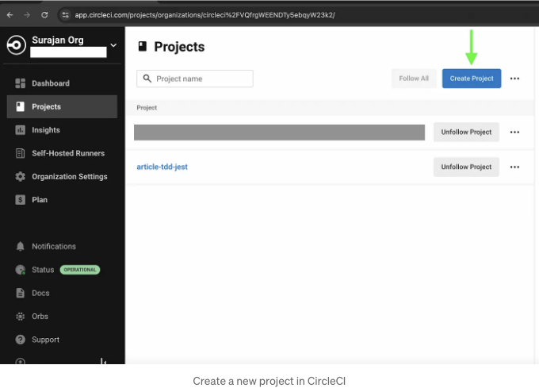

이제 원격 저장소 서비스를 선택하세요. 제 프로젝트 저장소는 Github에 있으므로 Github를 선택했습니다. Github, Gitlab 및 Bitbucket 중 하나를 선택할 수 있습니다.

<!-- ui-log 수평형 -->
<ins class="adsbygoogle"
  style="display:block"
  data-ad-client="ca-pub-4877378276818686"
  data-ad-slot="9743150776"
  data-ad-format="auto"
  data-full-width-responsive="true"></ins>
<component is="script">
(adsbygoogle = window.adsbygoogle || []).push({});
</component>

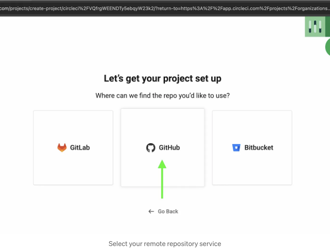

프로젝트에 대한 일부 세부 정보를 확인하세요. 프로젝트 이름을 지정하고, 제 프로젝트는 article-tdd-jest입니다. 개인 SSH 키를 생성하는 지침을 따르고, 공개 SSH 키를 Github 프로젝트 저장소의 배포 키로 사용하고, 아래에 제공된 필드에 개인 키를 복사하세요(이미지 1 🌁).

알림 ⚠️: 지금까지 CircleCI에 프로젝트 권한을 부여하지 않았다면, 아래의 저장소 드롭다운 목록에서 귀하의 저장소 이름을 볼 수 없습니다.

해결 방법 ✅: 이를 해결하려면, GitHub 앱 저장소 권한 업데이트 링크를 클릭하여 CircleCI 앱으로 리디렉션됩니다. Github의 Repository Access 섹션으로 이동하십시오. "Only select repositories" 선택한 다음, CircleCI가 액세스 권한을 부여해야 하는 리포지토리를 선택하세요. 제 프로젝트의 경우 article-tdd-jest입니다(이미지 2 🌁).

<!-- ui-log 수평형 -->
<ins class="adsbygoogle"
  style="display:block"
  data-ad-client="ca-pub-4877378276818686"
  data-ad-slot="9743150776"
  data-ad-format="auto"
  data-full-width-responsive="true"></ins>
<component is="script">
(adsbygoogle = window.adsbygoogle || []).push({});
</component>

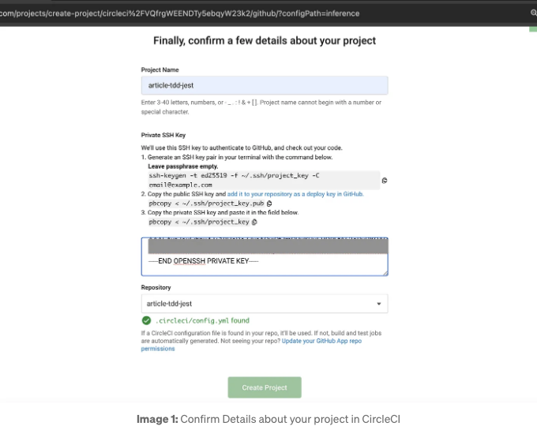

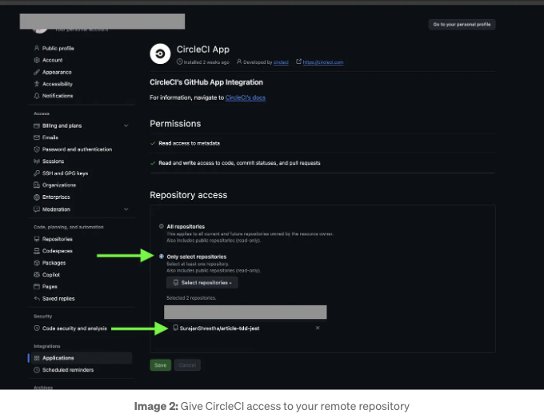

그리고 "프로젝트 생성"을 클릭하세요. CircleCI가 프로젝트를 생성할 것입니다 ✅.

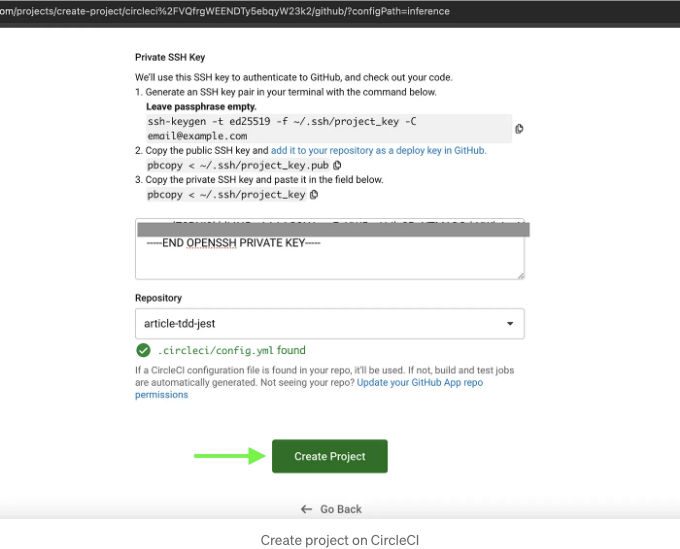

<!-- ui-log 수평형 -->
<ins class="adsbygoogle"
  style="display:block"
  data-ad-client="ca-pub-4877378276818686"
  data-ad-slot="9743150776"
  data-ad-format="auto"
  data-full-width-responsive="true"></ins>
<component is="script">
(adsbygoogle = window.adsbygoogle || []).push({});
</component>

## f. CircleCI를 실제로 보기

이제 깃허브에 몇 가지 변경 사항을 푸시하여 CircleCI가 자동으로 연속 통합 (CI) 파이프라인을 실행하고 테스트를 실행하는 것을 확인해 봅시다.

Counter.test.tsx를 업데이트하여 테스트를 통해 통과되도록 해 보세요 ✅.

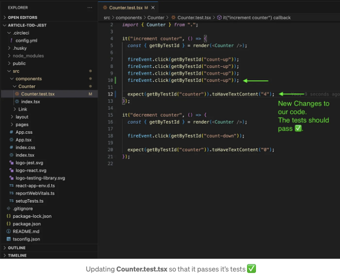

<!-- ui-log 수평형 -->
<ins class="adsbygoogle"
  style="display:block"
  data-ad-client="ca-pub-4877378276818686"
  data-ad-slot="9743150776"
  data-ad-format="auto"
  data-full-width-responsive="true"></ins>
<component is="script">
(adsbygoogle = window.adsbygoogle || []).push({});
</component>

그럼, 우리 Github의 main 브랜치에 커밋하고 푸시해주세요.

Markdown 형식으로 테이블 태그를 변경합니다.

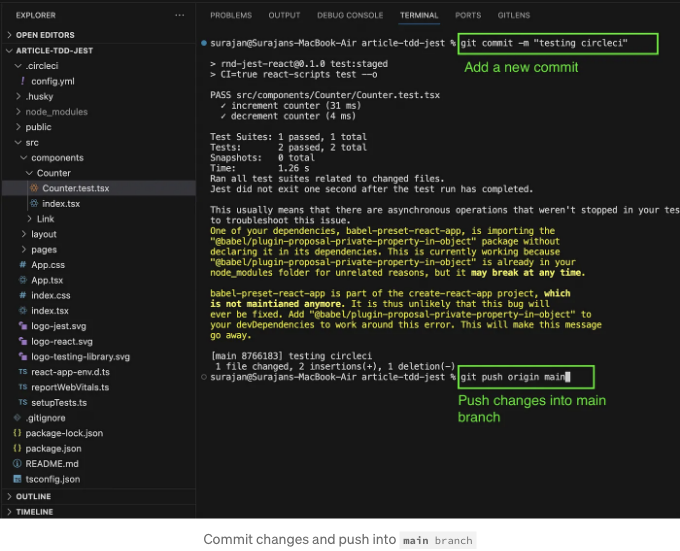

우리 Github에서 변경 사항을 확인해보세요. "3 pending checks"라고 표시되어 있어야 합니다.

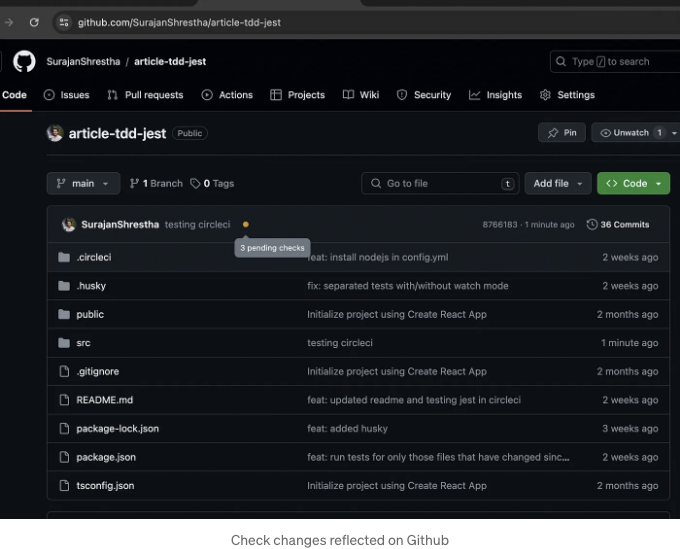

<!-- ui-log 수평형 -->
<ins class="adsbygoogle"
  style="display:block"
  data-ad-client="ca-pub-4877378276818686"
  data-ad-slot="9743150776"
  data-ad-format="auto"
  data-full-width-responsive="true"></ins>
<component is="script">
(adsbygoogle = window.adsbygoogle || []).push({});
</component>

CI 파이프라인이 CircleCI에서 작동 중임을 확인할 수 있어요. 자세히 보려면 "test" 작업을 클릭하세요.

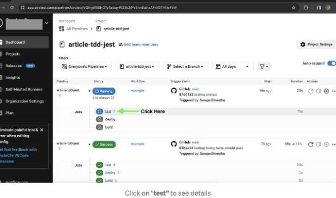

우리가 `.circleci/config.yml` 파일에서 정의한대로 "Node.js 16.13 설치", "node 버전 확인", "의존성 설치", "테스트 실행"과 같은 모든 작업이 실행되는 것을 볼 수 있어요.

자세한 테스트 내용을 보려면 "Run Tests"를 클릭하세요.

<!-- ui-log 수평형 -->
<ins class="adsbygoogle"
  style="display:block"
  data-ad-client="ca-pub-4877378276818686"
  data-ad-slot="9743150776"
  data-ad-format="auto"
  data-full-width-responsive="true"></ins>
<component is="script">
(adsbygoogle = window.adsbygoogle || []).push({});
</component>

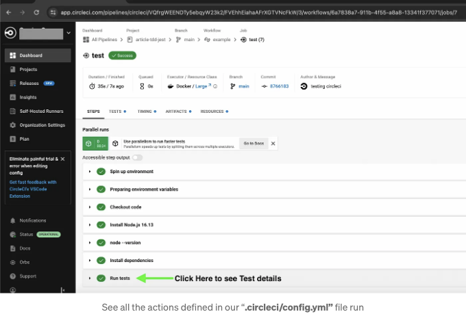

우리 모든 테스트(Link.test.tsx 및 Counter.test.tsx 총 2개의 테스트)가 실행되었고 통과했음을 볼 수 있어요 ✅.

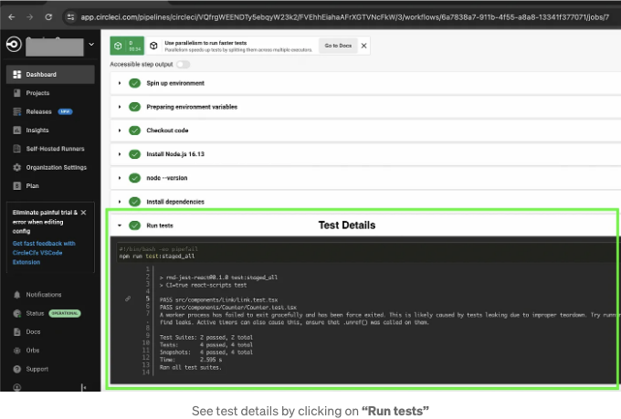

여기까지 읽어주셔서 감사합니다 🙇‍♂️. 제 글에 귀중한 시간과 에너지를 투자해주셔서 영원히 감사할 거예요. 궁금한 점이 있으시면 👏 반응과 댓글을 남겨주세요.

<!-- ui-log 수평형 -->
<ins class="adsbygoogle"
  style="display:block"
  data-ad-client="ca-pub-4877378276818686"
  data-ad-slot="9743150776"
  data-ad-format="auto"
  data-full-width-responsive="true"></ins>
<component is="script">
(adsbygoogle = window.adsbygoogle || []).push({});
</component>

행복한 코딩하세요!