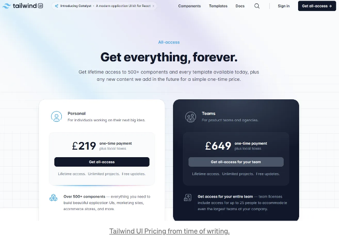

# 샤드씬-UI 블록이 뭐야?

샤드씬-UI 블록은 샤드씬-UI 기본 구성 요소 위에 구축된 미리 만들어진 UI 구성 요소들이야. 예를 들어 Card나 Drawer 같은 것들이 있어.

런칭 이후 가장 요청이 많았던 기능 중 하나이며, 결과적으로 웹 개발 생태계에서 큰 관심을 받고 있어.

Tailwind나 NextUI와 같은 다른 UI 라이브러리들은 이미 UI "블록"이라는 이 아이디어를 지원하지만, 이러한 라이브러리들을 사용하려면 일반적으로 비용을 지불해야 할 것이야.

<!-- ui-log 수평형 -->
<ins class="adsbygoogle"
  style="display:block"
  data-ad-client="ca-pub-4877378276818686"
  data-ad-slot="9743150776"
  data-ad-format="auto"
  data-full-width-responsive="true"></ins>
<component is="script">
(adsbygoogle = window.adsbygoogle || []).push({});
</component>

샤흐스디앟이 다시 성취했다는 것에 놀라울바가 없어요.

샤흐스디앟-UI 블록이 공개소스 기여의 엄청난 노력 덕분에 비싼 대안을 은폐할 것으로 보입니다.

# 샤흐스디앟-UI 블록 더 알아보기

<!-- ui-log 수평형 -->
<ins class="adsbygoogle"
  style="display:block"
  data-ad-client="ca-pub-4877378276818686"
  data-ad-slot="9743150776"
  data-ad-format="auto"
  data-full-width-responsive="true"></ins>
<component is="script">
(adsbygoogle = window.adsbygoogle || []).push({});
</component>

이전에 말했듯이 Shadcn-UI Blocks는 기존의 Shadcn-UI 기본 요소 (예: Card, Drawer) 위에 구축되었습니다.

그리고 이러한 기본 요소들로부터 거의 어떠한 추상화도 얻지 못하기 때문에, 이 UI 블록들 또한 거의 어떠한 추상화도 갖지 않습니다.

이 원칙은 개별적인 사용자 정의 및 독특하고 감동적인 사용자 경험을 위해 그랜슐러한 유연성을 장려하는 강력한 원칙입니다.

# 우리가 필요한 곳

<!-- ui-log 수평형 -->
<ins class="adsbygoogle"
  style="display:block"
  data-ad-client="ca-pub-4877378276818686"
  data-ad-slot="9743150776"
  data-ad-format="auto"
  data-full-width-responsive="true"></ins>
<component is="script">
(adsbygoogle = window.adsbygoogle || []).push({});
</component>

우리는 커뮤니티에게 블록 생성 요청을 할 수 있는 능력이 있습니다.

가장 인기 있는 블록은 손수 선별되어 Shadcn-UI 공식 웹사이트에 무료로 공유되며 누구나 사용하고 수정할 수 있습니다.

그리고 블록이 오픈 소스이기 때문에 여러분은 여러 프로젝트에서 블록을 사용하고 확장한 후 Shadcn-UI GitHub에 공헌할 수 있습니다.

# 결론

<!-- ui-log 수평형 -->
<ins class="adsbygoogle"
  style="display:block"
  data-ad-client="ca-pub-4877378276818686"
  data-ad-slot="9743150776"
  data-ad-format="auto"
  data-full-width-responsive="true"></ins>
<component is="script">
(adsbygoogle = window.adsbygoogle || []).push({});
</component>

샤드시엔이 또 다시 성공했어요.

블록들은 우리가 다들 알고 사랑하는 UI 라이브러리에 멋진 추가입니다.

이 UI 라이브러리의 미래에 많은 희망을 품고 있어요. 우리 모두는 기존의 UI 블록 컬렉션을 기여하고 사용하는 것을 기대하고 있어요.

# 추천 기사

<!-- ui-log 수평형 -->
<ins class="adsbygoogle"
  style="display:block"
  data-ad-client="ca-pub-4877378276818686"
  data-ad-slot="9743150776"
  data-ad-format="auto"
  data-full-width-responsive="true"></ins>
<component is="script">
(adsbygoogle = window.adsbygoogle || []).push({});
</component>

# 제휴사

- Figma Home: 내 프로젝트에서 사용하는 UI 디자인 도구입니다.
- Figma Professional: 당신이 필요로 할 유일한 UI 디자인 도구.
- FigJam: 직관적인 다이어그램 및 아이디어 회의를 위해 마음을 빠르게 전할 수 있습니다.

- Notion: 내 일상을 조직하는 데 사용하는 도구입니다.
- Notion AI: ChatGPT를 앞선 AI 도구로, 당신의 Notion 워크플로우를 빠르게 만들어줍니다.

# 참고문헌

<!-- ui-log 수평형 -->
<ins class="adsbygoogle"
  style="display:block"
  data-ad-client="ca-pub-4877378276818686"
  data-ad-slot="9743150776"
  data-ad-format="auto"
  data-full-width-responsive="true"></ins>
<component is="script">
(adsbygoogle = window.adsbygoogle || []).push({});
</component>

- [https://www.youtube.com/watch?v=kgHzwb37LLE](https://www.youtube.com/watch?v=kgHzwb37LLE)
- [https://ui.shadcn.com/blocks](https://ui.shadcn.com/blocks)
- [https://github.com/shadcn-ui/ui/pulls](https://github.com/shadcn-ui/ui/pulls)