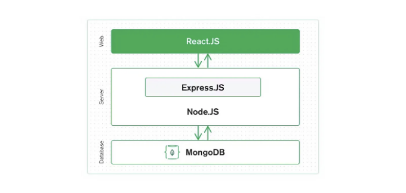

안녕하세요! MongoDB와 React.js 애플리케이션을 연결하는 과정을 한 단계씩 안내해 드릴게요. 이 예제에서는 React.js와 MongoDB에 대해 기본적으로 이해하고 있다고 가정하겠습니다. 그렇지 않다면, 먼저 해당 기술들에 대해 알아보시는 것이 좋아요.

## Step 1: MongoDB 데이터베이스 설정하기

- MongoDB 설치: MongoDB 공식 웹사이트(https://www.mongodb.com/try/download/community)에서 MongoDB를 다운로드하고 설치해 주세요. 운영 체제에 맞는 설치 지침을 따르세요.
- MongoDB 시작: MongoDB 서버를 시작해 주세요. 일반적으로 터미널에서 mongod와 같은 명령을 실행하면 됩니다.
- 데이터베이스 생성: MongoDB Compass나 명령행과 같은 MongoDB 관리 도구를 사용하여 새 데이터베이스를 생성하세요. 예를 들어, 명령행을 사용하는 방법:

<!-- ui-log 수평형 -->
<ins class="adsbygoogle"
  style="display:block"
  data-ad-client="ca-pub-4877378276818686"
  data-ad-slot="9743150776"
  data-ad-format="auto"
  data-full-width-responsive="true"></ins>
<component is="script">
(adsbygoogle = window.adsbygoogle || []).push({});
</component>

```js
mongo
> use your_database_name
```

4. 컬렉션 생성하기: 데이터를 저장할 컬렉션을 데이터베이스 내에 생성합니다. 예를 들어 다음과 같이:

```js
> db.createCollection("items")
```

## 단계 2: React.js 애플리케이션 설정하기

<!-- ui-log 수평형 -->
<ins class="adsbygoogle"
  style="display:block"
  data-ad-client="ca-pub-4877378276818686"
  data-ad-slot="9743150776"
  data-ad-format="auto"
  data-full-width-responsive="true"></ins>
<component is="script">
(adsbygoogle = window.adsbygoogle || []).push({});
</component>

- React App 만들기: 아직 만들지 않았다면, create-react-app이나 원하는 방법을 사용하여 새로운 React.js 애플리케이션을 만듭니다.
- 종속성 설치: React.js 프로젝트 폴더 안에서 터미널을 열고 필요한 패키지를 설치합니다:

```js
npm install axios mongoose
```

- axios는 HTTP 요청을 만들기 위한 인기 있는 라이브러리입니다.
- mongoose는 MongoDB와 Node.js를 위한 Object Data Modeling (ODM) 라이브러리입니다.

## 단계 3: MongoDB에 연결 생성

<!-- ui-log 수평형 -->
<ins class="adsbygoogle"
  style="display:block"
  data-ad-client="ca-pub-4877378276818686"
  data-ad-slot="9743150776"
  data-ad-format="auto"
  data-full-width-responsive="true"></ins>
<component is="script">
(adsbygoogle = window.adsbygoogle || []).push({});
</component>

- 서버 사이드 컴포넌트 생성하기: React 프로젝트에서 MongoDB와의 통신을 처리할 서버 사이드 컴포넌트를 설정하세요. 프로젝트 루트에 server.js 파일을 만드시면 됩니다.
- Express 설치하기: server.js 내에서 Express를 설치하고 설정하세요. Express는 웹 애플리케이션을 빌드하기 위한 Node.js 프레임워크입니다:

```js
const express = require("express");
const app = express();
const PORT = process.env.PORT || 5000;

app.listen(PORT, () => console.log(`서버가 포트 ${PORT}에서 실행 중입니다`));
```

3. MongoDB에 연결하기: 다음 코드를 추가하여 Mongoose를 사용하여 MongoDB 데이터베이스에 연결하세요. 실제 데이터베이스 이름으로 your_database_name을 교체해주세요:

```js
const mongoose = require("mongoose");
mongoose.connect("mongodb://localhost/your_database_name", {
  useNewUrlParser: true,
  useUnifiedTopology: true,
});
```

<!-- ui-log 수평형 -->
<ins class="adsbygoogle"
  style="display:block"
  data-ad-client="ca-pub-4877378276818686"
  data-ad-slot="9743150776"
  data-ad-format="auto"
  data-full-width-responsive="true"></ins>
<component is="script">
(adsbygoogle = window.adsbygoogle || []).push({});
</component>

## 단계 4: API 라우트 생성

- API 라우트 생성: server.js 파일에서 MongoDB와 상호 작용하기 위한 API 라우트를 생성하세요. 예를 들어, 컬렉션에서 모든 항목을 가져오는 라우트를 만들 수 있습니다:

```js
const Item = require("./models/Item"); // Item 모델 생성

app.get("/api/items", async (req, res) => {
  try {
    const items = await Item.find();
    res.json(items);
  } catch (error) {
    console.error(error);
    res.status(500).send("서버 오류");
  }
});
```

2. Item 모델 생성: 프로젝트 내에 models라는 새 폴더를 만들고, 그 안에 MongoDB 컬렉션에 대한 스키마를 정의하기 위해 Item.js라는 파일을 생성하세요.

<!-- ui-log 수평형 -->
<ins class="adsbygoogle"
  style="display:block"
  data-ad-client="ca-pub-4877378276818686"
  data-ad-slot="9743150776"
  data-ad-format="auto"
  data-full-width-responsive="true"></ins>
<component is="script">
(adsbygoogle = window.adsbygoogle || []).push({});
</component>

```js
const mongoose = require("mongoose");

const itemSchema = new mongoose.Schema({
  name: String,
  description: String,
});

module.exports = mongoose.model("Item", itemSchema);
```

## 단계 5: React에서 데이터 가져오기

- React 컴포넌트에서 데이터 가져오기: React 컴포넌트에서 이전 단계에서 설정한 API에서 데이터를 가져 오도록 Axios를 사용하십시오. useEffect 훅에서 데이터를 가져올 수 있습니다.

```js
import React, { useState, useEffect } from "react";
import axios from "axios";

function App() {
  const [items, setItems] = useState([]);

  useEffect(() => {
    axios.get("/api/items")
      .then(response => setItems(response.data))
      .catch(error => console.error(error));
  }, []);

  return (
    <div>
      <h1>Items</h1>
      <ul>
        {items.map(item => (
          <li key={item._id}>
            <h3>{item.name}</h3>
            <p>{item.description}</p>
          </li>
        ))}
      </ul>
    </div>
  );
}

export default App;
```

<!-- ui-log 수평형 -->
<ins class="adsbygoogle"
  style="display:block"
  data-ad-client="ca-pub-4877378276818686"
  data-ad-slot="9743150776"
  data-ad-format="auto"
  data-full-width-responsive="true"></ins>
<component is="script">
(adsbygoogle = window.adsbygoogle || []).push({});
</component>

그거야! 모든 것이 성공적으로 마무리되었어요! 이제 MongoDB 데이터베이스를 React.js 애플리케이션에 연결했습니다. 이 예시에서는 연결 설정, API 라우트 생성, 데이터 가져오기의 기본 내용을 다뤘어요. 실제 애플리케이션에서는 보통 추가적인 오류 처리, 인증, 그리고 더 고급 기능들을 구현하고 싶을 거예요.