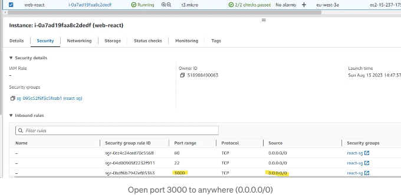

안녕하세요! 이 게시물에서는 AWS 인프라를 생성하고 React 앱을 Amazon EC2에 배포하는 방법을 살펴볼 것입니다. 아래 아키텍처 다이어그램을 확인해보세요.


# 사전 요구 사항:

- AWS 계정
- GitHub 계정
- 로컬 컴퓨터에 Node와 React가 설치되어 있어야 합니다.

<!-- ui-log 수평형 -->
<ins class="adsbygoogle"
  style="display:block"
  data-ad-client="ca-pub-4877378276818686"
  data-ad-slot="9743150776"
  data-ad-format="auto"
  data-full-width-responsive="true"></ins>
<component is="script">
(adsbygoogle = window.adsbygoogle || []).push({});
</component>

# 1. GIT 저장소 만들고 React 앱 설정하기

우리의 React 앱에 사용할 새로운 저장소를 만들어 시작해봐요. 선호하는 저장소 이름을 선택해주세요. 그리고 저장소 가시성 옵션으로 "비공개"를 선택할 수 있어요.


작성을 마치면 "저장소 생성" 버튼을 클릭해주세요.

<!-- ui-log 수평형 -->
<ins class="adsbygoogle"
  style="display:block"
  data-ad-client="ca-pub-4877378276818686"
  data-ad-slot="9743150776"
  data-ad-format="auto"
  data-full-width-responsive="true"></ins>
<component is="script">
(adsbygoogle = window.adsbygoogle || []).push({});
</component>

저장소가 만들어지면, HTTPS 탭에서 저장소 URL을 복사해주세요.


다음 명령어를 사용하여 해당 URL을 복사해주세요:

```js
git clone <당신의-저장소-URL>
```

<!-- ui-log 수평형 -->
<ins class="adsbygoogle"
  style="display:block"
  data-ad-client="ca-pub-4877378276818686"
  data-ad-slot="9743150776"
  data-ad-format="auto"
  data-full-width-responsive="true"></ins>
<component is="script">
(adsbygoogle = window.adsbygoogle || []).push({});
</component>

```markdown


Git 저장소를 성공적으로 복제한 후에는 Visual Studio Code를 열고 복제된 저장소 폴더로 이동하세요. 그런 다음 다음 명령을 사용하여 React 앱을 생성하세요:

```js
npx create-react-app .
```

다음으로 App.js 파일을 편집하여 "Hello, world."라는 기본 페이지를 표시하세요.
```

<!-- ui-log 수평형 -->
<ins class="adsbygoogle"
  style="display:block"
  data-ad-client="ca-pub-4877378276818686"
  data-ad-slot="9743150776"
  data-ad-format="auto"
  data-full-width-responsive="true"></ins>
<component is="script">
(adsbygoogle = window.adsbygoogle || []).push({});
</component>

```js
function App() {
  return (
    <div>
      <p>안녕, 세상아</p>
    </div>
  );
}

export default App;
```


프로세스가 완료되면 먼저 로컬에서 실행해 보겠습니다.

```js
npm start
```

<!-- ui-log 수평형 -->
<ins class="adsbygoogle"
  style="display:block"
  data-ad-client="ca-pub-4877378276818686"
  data-ad-slot="9743150776"
  data-ad-format="auto"
  data-full-width-responsive="true"></ins>
<component is="script">
(adsbygoogle = window.adsbygoogle || []).push({});
</component>


React 앱이 준비되었다면, 코드를 GitHub 저장소에 푸시하세요.

```js
git add .
git commit -am “create react app”
git push
```

# 2. EC2 생성

<!-- ui-log 수평형 -->
<ins class="adsbygoogle"
  style="display:block"
  data-ad-client="ca-pub-4877378276818686"
  data-ad-slot="9743150776"
  data-ad-format="auto"
  data-full-width-responsive="true"></ins>
<component is="script">
(adsbygoogle = window.adsbygoogle || []).push({});
</component>

AWS 계정에 로그인한 후 EC2를 검색해보세요.


EC2 콘솔 대시보드에서 "인스턴스 시작" 상자에서 "인스턴스 시작"을 선택하세요.


<!-- ui-log 수평형 -->
<ins class="adsbygoogle"
  style="display:block"
  data-ad-client="ca-pub-4877378276818686"
  data-ad-slot="9743150776"
  data-ad-format="auto"
  data-full-width-responsive="true"></ins>
<component is="script">
(adsbygoogle = window.adsbygoogle || []).push({});
</component>

EC2 인스턴스의 선호 이름을 입력하고 OS 섹션에서 Ubuntu 20.04를 선택하세요.


t3.micro 인스턴스 유형을 선택하고 "새 키페어 생성"을 클릭하세요. 이 키페어를 사용하여 생성 중인 EC2 인스턴스에 SSH할 것입니다.


<!-- ui-log 수평형 -->
<ins class="adsbygoogle"
  style="display:block"
  data-ad-client="ca-pub-4877378276818686"
  data-ad-slot="9743150776"
  data-ad-format="auto"
  data-full-width-responsive="true"></ins>
<component is="script">
(adsbygoogle = window.adsbygoogle || []).push({});
</component>

```markdown


가상 사설망(VPC)과 서브넷은 기본 설정으로 둡니다. 공용 IP 자동 할당을 위해 "활성화"를 선택하세요. "보안 그룹 생성"을 클릭하고 이름을 지정해주세요.


```

<!-- ui-log 수평형 -->
<ins class="adsbygoogle"
  style="display:block"
  data-ad-client="ca-pub-4877378276818686"
  data-ad-slot="9743150776"
  data-ad-format="auto"
  data-full-width-responsive="true"></ins>
<component is="script">
(adsbygoogle = window.adsbygoogle || []).push({});
</component>

나머지 설정은 기본값으로 두고 "인스턴스 시작"을 클릭하세요.


인스턴스 상태가 "실행 중"이 될 때까지 기다린 후 웹 애플리케이션을 위한 리액트 종속성을 설치하기 위해 EC2 인스턴스에 SSH로 접속할 수 있습니다.


<!-- ui-log 수평형 -->
<ins class="adsbygoogle"
  style="display:block"
  data-ad-client="ca-pub-4877378276818686"
  data-ad-slot="9743150776"
  data-ad-format="auto"
  data-full-width-responsive="true"></ins>
<component is="script">
(adsbygoogle = window.adsbygoogle || []).push({});
</component>

# 3. 리액트 앱을 위한 종속성 설치

- EC2 서버에 액세스하려면 https://mobaxterm.mobatek.net/에서 다운로드할 수 있는 무료 소프트웨어인 MobaXterm을 사용할 수 있습니다.
- .ppk 형식의 키페어를 선택한 경우 https://www.putty.org/에서 다운로드할 수 있는 PuTTY를 사용해야 합니다.
- MobaXterm을 열고 "Session"을 선택합니다.


- EC2의 공개 IP 주소를 입력하고 사용자 이름으로 "ubuntu"를 사용합니다. "개인 키 사용" 옵션을 선택하고 AWS에서 생성한 키페어를 선택합니다.

<!-- ui-log 수평형 -->
<ins class="adsbygoogle"
  style="display:block"
  data-ad-client="ca-pub-4877378276818686"
  data-ad-slot="9743150776"
  data-ad-format="auto"
  data-full-width-responsive="true"></ins>
<component is="script">
(adsbygoogle = window.adsbygoogle || []).push({});
</component>


- 패키지 업데이트하기

```js
sudo apt-get update -y
```

- npm 설치하기

<!-- ui-log 수평형 -->
<ins class="adsbygoogle"
  style="display:block"
  data-ad-client="ca-pub-4877378276818686"
  data-ad-slot="9743150776"
  data-ad-format="auto"
  data-full-width-responsive="true"></ins>
<component is="script">
(adsbygoogle = window.adsbygoogle || []).push({});
</component>

```js
sudo apt install npm -y
```


- 노드 버전 20을 설치하세요.

```js
curl -fsSL https://deb.nodesource.com/setup_20.x | sudo -E bash -
```

<!-- ui-log 수평형 -->
<ins class="adsbygoogle"
  style="display:block"
  data-ad-client="ca-pub-4877378276818686"
  data-ad-slot="9743150776"
  data-ad-format="auto"
  data-full-width-responsive="true"></ins>
<component is="script">
(adsbygoogle = window.adsbygoogle || []).push({});
</component>

```js
sudo apt install -y nodejs
```

- 리액트를 실행하기 위해 Nginx 웹 서버 설치

```js
sudo apt install nginx -y
```

- 리액트를 위한 디렉토리 생성
```

<!-- ui-log 수평형 -->
<ins class="adsbygoogle"
  style="display:block"
  data-ad-client="ca-pub-4877378276818686"
  data-ad-slot="9743150776"
  data-ad-format="auto"
  data-full-width-responsive="true"></ins>
<component is="script">
(adsbygoogle = window.adsbygoogle || []).push({});
</component>

```js
sudo mkdir /var/www/html/my-react-app
```

- Nginx 설정하기

```js
sudo vi /etc/nginx/conf.d/react.conf
```

- 서버 블록 업데이트하기

<!-- ui-log 수평형 -->
<ins class="adsbygoogle"
  style="display:block"
  data-ad-client="ca-pub-4877378276818686"
  data-ad-slot="9743150776"
  data-ad-format="auto"
  data-full-width-responsive="true"></ins>
<component is="script">
(adsbygoogle = window.adsbygoogle || []).push({});
</component>

```js
server {
  listen 80;
  listen [::]:80;
  root /var/www/html/my-react-app/build;
  
  #react app
  location / {
    try_files $uri /index.html;  
  }
}
```


- 리액트 앱 프로젝트를 넣을 “my-app”이라는 이름의 폴더를 만듭니다.

```js
cd /home/ubuntu
mkdir my-app
cd my-app
```

<!-- ui-log 수평형 -->
<ins class="adsbygoogle"
  style="display:block"
  data-ad-client="ca-pub-4877378276818686"
  data-ad-slot="9743150776"
  data-ad-format="auto"
  data-full-width-responsive="true"></ins>
<component is="script">
(adsbygoogle = window.adsbygoogle || []).push({});
</component>

- 리액트 앱 복제

```js
git clone <리포지토리-URL>
```


비밀번호를 요청받았다면, 이 링크를 따라 가셔서 개인 액세스 토큰(PAT)을 생성해주세요.

<!-- ui-log 수평형 -->
<ins class="adsbygoogle"
  style="display:block"
  data-ad-client="ca-pub-4877378276818686"
  data-ad-slot="9743150776"
  data-ad-format="auto"
  data-full-width-responsive="true"></ins>
<component is="script">
(adsbygoogle = window.adsbygoogle || []).push({});
</component>

- React 프로젝트 의존성 설치하기

```js
cd <프로젝트-폴더>
npm install
```

- React 앱을 먼저 테스트하여 정상 작동하는지 확인하세요.

```js
npm start
```

<!-- ui-log 수평형 -->
<ins class="adsbygoogle"
  style="display:block"
  data-ad-client="ca-pub-4877378276818686"
  data-ad-slot="9743150776"
  data-ad-format="auto"
  data-full-width-responsive="true"></ins>
<component is="script">
(adsbygoogle = window.adsbygoogle || []).push({});
</component>

- 브라우저에서 공용 IP를 입력하여 `ip-public`:3000에 붙여넣기
- React 앱 빌드




<!-- ui-log 수평형 -->
<ins class="adsbygoogle"
  style="display:block"
  data-ad-client="ca-pub-4877378276818686"
  data-ad-slot="9743150776"
  data-ad-format="auto"
  data-full-width-responsive="true"></ins>
<component is="script">
(adsbygoogle = window.adsbygoogle || []).push({});
</component>

```js
npm run build
```

- "build" 폴더를 "/var/www/html" 디렉토리로 복사하여 Nginx가 이 폴더에서 읽을 수 있도록 합니다.

```js
sudo cp -R build/ /var/www/html/my-react-app/
```

- Nginx 기본 설정을 비활성화합니다.

<!-- ui-log 수평형 -->
<ins class="adsbygoogle"
  style="display:block"
  data-ad-client="ca-pub-4877378276818686"
  data-ad-slot="9743150776"
  data-ad-format="auto"
  data-full-width-responsive="true"></ins>
<component is="script">
(adsbygoogle = window.adsbygoogle || []).push({});
</component>

```js
sudo vi /etc/nginx/nginx.conf
```

아래 줄을 "#"을 사용하여 주석 처리하세요:

```js
#include /etc/nginx/sites-enabled/*;
```


<!-- ui-log 수평형 -->
<ins class="adsbygoogle"
  style="display:block"
  data-ad-client="ca-pub-4877378276818686"
  data-ad-slot="9743150776"
  data-ad-format="auto"
  data-full-width-responsive="true"></ins>
<component is="script">
(adsbygoogle = window.adsbygoogle || []).push({});
</component>

- nginx 구성을 확인하고 nginx를 다시 로드하십시오.

```js
sudo nginx -t && sudo systemctl reload nginx
```


- EC2 인스턴스의 공용 IP를 복사하여 브라우저에 붙여넣으세요. 우리는 Nginx 웹 서버를 사용하고 있으므로 이제 포트 80에서 React 앱에 액세스할 수 있어야 합니다.

<!-- ui-log 수평형 -->
<ins class="adsbygoogle"
  style="display:block"
  data-ad-client="ca-pub-4877378276818686"
  data-ad-slot="9743150776"
  data-ad-format="auto"
  data-full-width-responsive="true"></ins>
<component is="script">
(adsbygoogle = window.adsbygoogle || []).push({});
</component>

 

축하합니다! React 앱을 EC2에 성공적으로 배포했고 모든 사용자가 액세스할 수 있도록 만들었습니다.

그러나 구축한 인프라는 보안과 고가용성 측면에서 몇 가지 이유로 부족합니다:

- 웹 서버를 공용 서브넷에 배치하면 인터넷에 직접 노출되어 잠재적인 보안 취약점이 발생할 수 있습니다.
- 웹 서버에 대한 단일 인스턴스에 의존하는 것은 원하는 수준의 고가용성을 제공하지 않습니다.

<!-- ui-log 수평형 -->
<ins class="adsbygoogle"
  style="display:block"
  data-ad-client="ca-pub-4877378276818686"
  data-ad-slot="9743150776"
  data-ad-format="auto"
  data-full-width-responsive="true"></ins>
<component is="script">
(adsbygoogle = window.adsbygoogle || []).push({});
</component>

# 다음 단계는 무엇인가요?

- Terraform 튜토리얼: Terraform을 사용하여 AWS에서 기본 EC2 인스턴스 시작하기