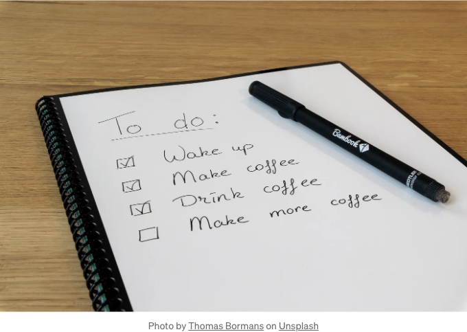
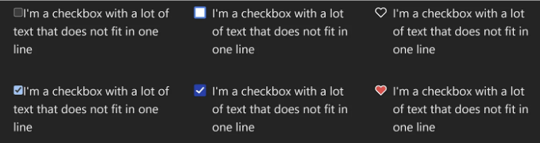
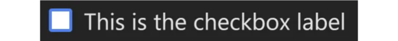
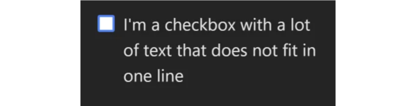
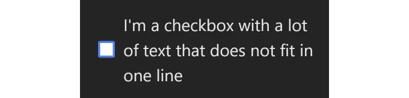
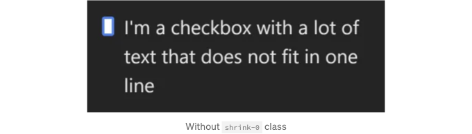

## React Checkbox 컴포넌트 스타일링



이번에는 순수한 프론트엔드 작업인 체크박스 스타일링에 대해 알아보겠습니다. 체크박스 요소에서는 일부 스타일링(예: 테두리)을 변경할 수 없고 전체 체크박스를 처음부터 다시 스타일링해야 합니다. 기본 스타일링을 지워야 하며, 한 단계씩 만들어나가야 합니다.


<!-- ui-log 수평형 -->
<ins class="adsbygoogle"
  style="display:block"
  data-ad-client="ca-pub-4877378276818686"
  data-ad-slot="9743150776"
  data-ad-format="auto"
  data-full-width-responsive="true"></ins>
<component is="script">
(adsbygoogle = window.adsbygoogle || []).push({});
</component>

여기 Tailwind로 스타일이 적용된 React 컴포넌트가 있습니다:

## 단계별로 스타일을 만드는 방법.

여기 있네요? 그러면 더 많은 것을 알고 싶은 것 같군요 — 멋지네요. 스타일링 프로세스 중에 마주칠 수 있는 모든 문제점을 다루려고 노력할게요.

HTML 체크박스(보다 정확히는 input 태그)의 모양은 브라우저와 운영 체제에 따라 다릅니다. 이것은 (제 시스템과 브라우저에서) 기본 체크박스와 몇 가지 스타일이 적용된 체크박스의 비교입니다:

<!-- ui-log 수평형 -->
<ins class="adsbygoogle"
  style="display:block"
  data-ad-client="ca-pub-4877378276818686"
  data-ad-slot="9743150776"
  data-ad-format="auto"
  data-full-width-responsive="true"></ins>
<component is="script">
(adsbygoogle = window.adsbygoogle || []).push({});
</component>



웹페이지의 체크박스를 일관되게 만들기 위해서는 기본 스타일을 제거하고 새로운 스타일로 대체해야 합니다.

기본 체크박스 코드는 다음과 같습니다:

```js
<div>
  <input type="checkbox" id="some_id" />
  <label htmlFor="some_id">This is the checkbox label</label>
</div>
```

<!-- ui-log 수평형 -->
<ins class="adsbygoogle"
  style="display:block"
  data-ad-client="ca-pub-4877378276818686"
  data-ad-slot="9743150776"
  data-ad-format="auto"
  data-full-width-responsive="true"></ins>
<component is="script">
(adsbygoogle = window.adsbygoogle || []).push({});
</component>

## 기본 스타일 제거

기본 스타일을 제거하려면 appearance-none 클래스를 사용하십시오.

```js
<input type="checkbox" className="appearance-none" />
```

해당 클래스를 사용한 후에는 체크박스가 사라집니다. 이제 디자인할 차례입니다.

<!-- ui-log 수평형 -->
<ins class="adsbygoogle"
  style="display:block"
  data-ad-client="ca-pub-4877378276818686"
  data-ad-slot="9743150776"
  data-ad-format="auto"
  data-full-width-responsive="true"></ins>
<component is="script">
(adsbygoogle = window.adsbygoogle || []).push({});
</component>

## 기본 입력 스타일(상자) 구성

상자의 기본 너비와 높이, 테두리, 배경 및 일부 테두리 반경을 추가하세요.

```js
<input type="checkbox" id="some_id" className="
  appearance-none w-4 h-4 border-2 border-blue-500 rounded-sm bg-white"
/>
```


<!-- ui-log 수평형 -->
<ins class="adsbygoogle"
  style="display:block"
  data-ad-client="ca-pub-4877378276818686"
  data-ad-slot="9743150776"
  data-ad-format="auto"
  data-full-width-responsive="true"></ins>
<component is="script">
(adsbygoogle = window.adsbygoogle || []).push({});
</component>

## 레이아웃 수정

라벨이 상자에 너무 가깝고 상자가 너무 높게 배치되어있어요. 몇 가지 flex 설정으로 해결할 수 있어요. 여기 상자와 라벨 사이에 8px 간격을 가진 flex 행이 있어요.

```js
<div className="flex gap-2">
  <input type="checkbox" id="some_id" className="
    appearance-none w-4 h-4 border-2 border-blue-500 rounded-sm bg-white
    mt-1"
  />
  <label htmlFor="some_id">이것은 체크박스 라벨 입니다</label>
</div>
```

상자에는 4px의 상단 여백도 있어요. 이 정렬은 사용된 글꼴 및 그 크기 (또한 줄 높이)에 따라 달라져요. 원하는 결과를 얻으려면 이러한 요소들을 조정해야 해요.

<!-- ui-log 수평형 -->
<ins class="adsbygoogle"
  style="display:block"
  data-ad-client="ca-pub-4877378276818686"
  data-ad-slot="9743150776"
  data-ad-format="auto"
  data-full-width-responsive="true"></ins>
<component is="script">
(adsbygoogle = window.adsbygoogle || []).push({});
</component>





참고: 한 줄 레이블의 경우에는 flex 항목 정렬을 사용할 수 있지만, 레이블이 두 줄 이상인 경우(또는 일부 화면 크기에서 줄바꿈이 가능한 경우) 다음 문제가 발생합니다:



<!-- ui-log 수평형 -->
<ins class="adsbygoogle"
  style="display:block"
  data-ad-client="ca-pub-4877378276818686"
  data-ad-slot="9743150776"
  data-ad-format="auto"
  data-full-width-responsive="true"></ins>
<component is="script">
(adsbygoogle = window.adsbygoogle || []).push({});
</component>

요소를 많은 텍스트와 줄 바꿈을 고려하여 테스트하는 것을 기억하세요 ;)

## 레이아웃 다시 고치기

flex 요소는 기본적으로 shrink 값을 설정합니다. 경우에 따라 상자가 충분한 공간이 없으면 축소될 수 있습니다. 이를 방지하려면 shrink-0 클래스를 추가해야 합니다.



<!-- ui-log 수평형 -->
<ins class="adsbygoogle"
  style="display:block"
  data-ad-client="ca-pub-4877378276818686"
  data-ad-slot="9743150776"
  data-ad-format="auto"
  data-full-width-responsive="true"></ins>
<component is="script">
(adsbygoogle = window.adsbygoogle || []).push({});
</component>

## 체크 상태 추가하기

체크박스가 선택되면 상자의 배경이 파란색이 되고 SVG 아이콘이 렌더링됩니다. 선택된 상태를 나타내기 위해 클래스의 접두어로 checked 수정자를 사용해야 합니다:

```js
<div className="flex gap-2">
  <input type="checkbox" id="some_id" className="
    appearance-none w-4 h-4 border-2 border-blue-500 rounded-sm bg-white
    mt-1 shrink-0
    checked:bg-blue-800 checked:border-0"
  />
  <label htmlFor="some_id">이것은 체크박스 라벨입니다</label>
</div>
```

SVG 아이콘은 상자에 렌더링되어야 하므로 상대 및 절대 클래스를 사용해야 합니다. SVG의 크기는 입력 상자와 동일하게 설정되며(상단 여백 포함)입니다.

<!-- ui-log 수평형 -->
<ins class="adsbygoogle"
  style="display:block"
  data-ad-client="ca-pub-4877378276818686"
  data-ad-slot="9743150776"
  data-ad-format="auto"
  data-full-width-responsive="true"></ins>
<component is="script">
(adsbygoogle = window.adsbygoogle || []).push({});
</component>

아이콘이 표시되어야 하는 경우에만 체크박스가 선택되어야 합니다. 스타일을 연결하려면 input 요소에 동료 Tailwind 클래스를 사용할 수 있습니다.

그런 다음 SVG에서는 체크박스가 선택된 경우에만 적합한 클래스가 적용됩니다. SVG는 기본적으로 숨겨져 있으며 input 태그가 선택된 경우에만 표시됩니다 — hidden peer-checked:block 클래스.

```js
<div className="flex gap-2">
  <input type="checkbox" id="some_id" className="
    relative peer shrink-0
    appearance-none w-4 h-4 border-2 border-blue-500 rounded-sm bg-white
    mt-1
    checked:bg-blue-800 checked:border-0"
  />
  <label htmlFor="some_id">이것은 체크박스 레이블입니다</label>
  <svg
    className="
      absolute 
      w-4 h-4 mt-1
      hidden peer-checked:block"
    xmlns="http://www.w3.org/2000/svg"
    viewBox="0 0 24 24"
    fill="none"
    stroke="currentColor"
    stroke-width="4"
    stroke-linecap="round"
    stroke-linejoin="round"
  >
    <polyline points="20 6 9 17 4 12"></polyline>
  </svg>
</div>
```


<!-- ui-log 수평형 -->
<ins class="adsbygoogle"
  style="display:block"
  data-ad-client="ca-pub-4877378276818686"
  data-ad-slot="9743150776"
  data-ad-format="auto"
  data-full-width-responsive="true"></ins>
<component is="script">
(adsbygoogle = window.adsbygoogle || []).push({});
</component>

## 클릭 이벤트 수정하기

현재 구현은 라벨을 클릭했을 때 상자의 선택 상태를 변경하지만, 상자를 클릭했을 때는 아무 변화가 없습니다.

여기서 문제는 SVG가 입력 상자 위에 렌더링되어 클릭 이벤트가 막혀서 발생합니다. 이벤트가 입력 요소로 전달되지 않습니다.

해결하려면 SVG 클래스 목록에 pointer-events-none 클래스를 추가해야 합니다.

<!-- ui-log 수평형 -->
<ins class="adsbygoogle"
  style="display:block"
  data-ad-client="ca-pub-4877378276818686"
  data-ad-slot="9743150776"
  data-ad-format="auto"
  data-full-width-responsive="true"></ins>
<component is="script">
(adsbygoogle = window.adsbygoogle || []).push({});
</component>

```js
<svg
  className="
    absolute 
    w-4 h-4 mt-1
    hidden peer-checked:block
    pointer-events-none"
  xmlns="http://www.w3.org/2000/svg"
  viewBox="0 0 24 24"
  fill="none"
  stroke="currentColor"
  stroke-width="4"
  stroke-linecap="round"
  stroke-linejoin="round"
>
  <polyline points="20 6 9 17 4 12"></polyline>
</svg>
```

## 초점 및 비활성 상태 추가하기

테일윈드에는 특정 상태를 스타일링하는 데 사용할 수 있는 다른 가상 클래스가 있습니다. 여기에 초점 및 비활성 상태를 스타일링하는 예제가 있습니다. 기억해야 할 중요한 점 중 하나는 outline-none 클래스입니다. 일부 브라우저에서는 해당 외곽선을 쉽게 놓치기 때문에 이 설정이 해제되지 않으면 때때로 컴포넌트가 이상해 보일 수 있습니다.

```js
<input type="checkbox" id="some_id" className="
  relative peer shrink-0
  appearance-none w-4 h-4 border-2 border-blue-500 rounded-sm bg-white
  mt-1
  checked:bg-blue-800 checked:border-0
  focus:outline-none focus:ring-offset-0 focus:ring-2 focus:ring-blue-100
  disabled:border-steel-400 disabled:bg-steel-400
"
/>
```

<!-- ui-log 수평형 -->
<ins class="adsbygoogle"
  style="display:block"
  data-ad-client="ca-pub-4877378276818686"
  data-ad-slot="9743150776"
  data-ad-format="auto"
  data-full-width-responsive="true"></ins>
<component is="script">
(adsbygoogle = window.adsbygoogle || []).push({});
</component>

## 보너스: 하트 모양 체크박스

지금까지 오셨나요? 그렇다면 체크박스를 스타일링한 것이 있어야 합니다. 여기 하트 모양 체크박스의 또 다른 예가 있습니다. 이 경우 추가적인 상자를 생성하지 않고, 체크박스 상태에 따라 채워지거나 비워지는 SVG 아이콘만 사용됩니다.

이상입니다 - 이제 탤윈드 클래스로 체크박스를 스타일링하는 방법을 알게 되었습니다.


<!-- ui-log 수평형 -->
<ins class="adsbygoogle"
  style="display:block"
  data-ad-client="ca-pub-4877378276818686"
  data-ad-slot="9743150776"
  data-ad-format="auto"
  data-full-width-responsive="true"></ins>
<component is="script">
(adsbygoogle = window.adsbygoogle || []).push({});
</component>

다른 이야기도 확인해보세요:

- Tailwind로 라디오 버튼 스타일링하기