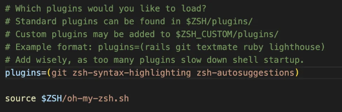

하루 중 상당 부분을 터미널에서 작업하는 개발자들에게는 작은 효율 향상도 장기적으로 많은 시간을 절약할 수 있는 점이 있습니다. 대부분의 시스템에서 기본 터미널 환경은 기능적이지만 종종 작업 흐름을 실제로 최적화해주는 세련되고 편리한 기능이 부족합니다. 여기에서 Zsh 플러그인이 등장합니다. Z 셸(Zsh)의 기능을 확장하는 가벼운 스크립트로, 기본 Bash 셸의 강력하고 매우 사용자 정의 가능한 대안입니다.

본 글에서는 터미널 생산성을 크게 향상시킬 수 있는 인기 있는 Zsh 플러그인 몇 가지를 살펴보겠습니다. 이로써 여러분은 더 효율적이고 효과적인 개발자가 될 수 있습니다.

# 준비 사항

시작하기 전 다음 사항을 설치해 두세요:

<!-- ui-log 수평형 -->
<ins class="adsbygoogle"
  style="display:block"
  data-ad-client="ca-pub-4877378276818686"
  data-ad-slot="9743150776"
  data-ad-format="auto"
  data-full-width-responsive="true"></ins>
<component is="script">
(adsbygoogle = window.adsbygoogle || []).push({});
</component>

- Homebrew (맥용 패키지 관리자)
- Git (버전 관리 시스템)
- Oh-My-Zsh

만약 이전에 설치하지 않았다면, 아래 기사의 첫 단계를 확인할 수 있습니다.

## 1- fast-syntax-highlighting 또는 zsh-syntax-highlighting

오타나 구문 오류로 고생하지 마세요. 이 플러그인은 명령줄에 실시간 구문 강조 기능을 제공하여 눈으로 한 눈에 오류와 잘못된 명령을 쉽게 알 수 있게 해줍니다. 이 플러그인은 zsh-syntax-highlighting의 최적화된 버전입니다. fast-syntax-highlighting을 사용하면 터미널에서 시각적 코딩 경험을 즐길 수 있습니다.

<!-- ui-log 수평형 -->
<ins class="adsbygoogle"
  style="display:block"
  data-ad-client="ca-pub-4877378276818686"
  data-ad-slot="9743150776"
  data-ad-format="auto"
  data-full-width-responsive="true"></ins>
<component is="script">
(adsbygoogle = window.adsbygoogle || []).push({});
</component>

아래 명령어를 사용하여 빠른 구문 강조 기능을 복제할 수 있어요.

```bash
git clone https://github.com/zdharma-continuum/fast-syntax-highlighting.git \
  ${ZSH_CUSTOM:-$HOME/.oh-my-zsh/custom}/plugins/fast-syntax-highlighting
```

만약 zsh-syntax-highlighting을 사용하고 싶다면 아래 단계를 따라해보세요.

```bash
git clone https://github.com/zsh-users/zsh-syntax-highlighting 
${ZSH_CUSTOM:-~/.oh-my-zsh/custom}/plugins/zsh-syntax-highlighting
```

<!-- ui-log 수평형 -->
<ins class="adsbygoogle"
  style="display:block"
  data-ad-client="ca-pub-4877378276818686"
  data-ad-slot="9743150776"
  data-ad-format="auto"
  data-full-width-responsive="true"></ins>
<component is="script">
(adsbygoogle = window.adsbygoogle || []).push({});
</component>

위의 명령어 실행이 완료되면 아래 명령어로 플러그인 폴더를 확인할 수 있어요.

```js
ls $ZSH_CUSTOM/plugins
```

만약 폴더가 존재하지 않으면 git clone 명령어를 다시 실행해 주세요.

$ZSH_CUSTOM/plugins 경로에 repo를 복제한 후, .zshrc 파일의 플러그인 목록에 플러그인 이름을 추가하세요. 이 단계는 모든 설치에 적용됩니다. .zshrc 파일의 플러그인 목록을 업데이트하는 것을 잊지 마세요.

<!-- ui-log 수평형 -->
<ins class="adsbygoogle"
  style="display:block"
  data-ad-client="ca-pub-4877378276818686"
  data-ad-slot="9743150776"
  data-ad-format="auto"
  data-full-width-responsive="true"></ins>
<component is="script">
(adsbygoogle = window.adsbygoogle || []).push({});
</component>


이 플러그인을 다른 zsh 플러그인 관리자와 함께 다음 명령어를 사용하여 설치할 수 있습니다.

<!-- ui-log 수평형 -->
<ins class="adsbygoogle"
  style="display:block"
  data-ad-client="ca-pub-4877378276818686"
  data-ad-slot="9743150776"
  data-ad-format="auto"
  data-full-width-responsive="true"></ins>
<component is="script">
(adsbygoogle = window.adsbygoogle || []).push({});
</component>

```js
# Using zinit
zinit light zsh-users/zsh-syntax-highlighting

# Using zplug
zplug "zsh-users/zsh-syntax-highlighting"

# Using Antigen
antigen bundle zsh-users/zsh-syntax-highlighting
```

## 2- zsh-autosuggestions

반복해서 동일한 명령을 입력하는 것에 지쳤나요? zsh-autosuggestions는 명령 기록과 현재 컨텍스트를 기반으로 지능적으로 명령을 제안합니다. 제안을 수락하려면 오른쪽 화살표 키를 누르고, 무시하려면 계속 입력하면 됩니다. 이 플러그인은 수많은 키 입력을 줄여주고 반복적 스트레인 손상을 방지할 수 있습니다.

이 플러그인의 설치 과정도 동일합니다. 해당 레포를 플러그인 경로에 복사하세요. 그리고 .zshrc 파일의 플러그인 목록에 플러그인 이름을 추가하세요.

<!-- ui-log 수평형 -->
<ins class="adsbygoogle"
  style="display:block"
  data-ad-client="ca-pub-4877378276818686"
  data-ad-slot="9743150776"
  data-ad-format="auto"
  data-full-width-responsive="true"></ins>
<component is="script">
(adsbygoogle = window.adsbygoogle || []).push({});
</component>

```js
git clone https://github.com/zsh-users/zsh-autosuggestions
${ZSH_CUSTOM:-~/.oh-my-zsh/custom}/plugins/zsh-autosuggestions
```

.zshrc 파일에 `zsh-autosuggestions`를 추가한 후에는 다음과 같이 보일 것입니다.




<!-- ui-log 수평형 -->
<ins class="adsbygoogle"
  style="display:block"
  data-ad-client="ca-pub-4877378276818686"
  data-ad-slot="9743150776"
  data-ad-format="auto"
  data-full-width-responsive="true"></ins>
<component is="script">
(adsbygoogle = window.adsbygoogle || []).push({});
</component>


```js
# zinit을 사용하는 경우
zinit light zsh-users/zsh-autosuggestions

# zplug을 사용하는 경우
zplug "zsh-users/zsh-autosuggestions"

# Antigen을 사용하는 경우
antigen bundle zsh-users/zsh-autosuggestions
```

## 3- 컬러풀 파일

이 플러그인들은 파일 유형을 색으로 구분할 수 있도록 도와줍니다. 따라서 동일한 유형의 파일을 쉽게 인식할 수 있게 만들어줍니다.

<!-- ui-log 수평형 -->
<ins class="adsbygoogle"
  style="display:block"
  data-ad-client="ca-pub-4877378276818686"
  data-ad-slot="9743150776"
  data-ad-format="auto"
  data-full-width-responsive="true"></ins>
<component is="script">
(adsbygoogle = window.adsbygoogle || []).push({});
</component>

Zsh Syntax Highlighting Filetypes

순수 zsh 플러그인을 사용하고 싶다면 아래 방법을 선택할 수 있어요.

```js
git clone https://github.com/trapd00r/zsh-syntax-highlighting-filetypes
${ZSH_CUSTOM}/plugins/zsh-syntax-highlighting-filetypes
```


<!-- ui-log 수평형 -->
<ins class="adsbygoogle"
  style="display:block"
  data-ad-client="ca-pub-4877378276818686"
  data-ad-slot="9743150776"
  data-ad-format="auto"
  data-full-width-responsive="true"></ins>
<component is="script">
(adsbygoogle = window.adsbygoogle || []).push({});
</component>

.zshrc 파일에 플러그인을 추가하는 것을 잊지 마세요.

자동으로 색상을 입히는 ls

이 플러그인은 뒷단에서 Colorls를 사용합니다. 따라서 먼저 색상을 설치해야 합니다. 아래 명령어를 하나씩 실행해보세요.

이미 설치되어 있지 않다면 먼저 colorls를 설치해주세요.

<!-- ui-log 수평형 -->
<ins class="adsbygoogle"
  style="display:block"
  data-ad-client="ca-pub-4877378276818686"
  data-ad-slot="9743150776"
  data-ad-format="auto"
  data-full-width-responsive="true"></ins>
<component is="script">
(adsbygoogle = window.adsbygoogle || []).push({});
</component>

```js
gem install colorls
```

그런 다음 플러그인 저장소를 사용자 정의 플러그인 폴더로 복제하세요.

```js
git clone https://github.com/gretzky/auto-color-ls ${ZSH_CUSTOM}/plugins/auto-color-ls
```

복제한 후 .zshrc 파일을 업데이트하고 플러그인을 플러그인 목록에 추가하세요. cd 명령어로 디렉토리를 변경하면 아이콘이 표시됩니다. 또한 auto-color-ls는 파일과 폴더를 다른 색상으로 나열합니다. 여기에 예가 있습니다.

<!-- ui-log 수평형 -->
<ins class="adsbygoogle"
  style="display:block"
  data-ad-client="ca-pub-4877378276818686"
  data-ad-slot="9743150776"
  data-ad-format="auto"
  data-full-width-responsive="true"></ins>
<component is="script">
(adsbygoogle = window.adsbygoogle || []).push({});
</component>


## 4- zsh-completions

탭 완성은 명령줄을 효율적으로 사용하는 데 큰 도움이 됩니다. 그러나 기본 완성 옵션은 제한적입니다. zsh-completions는 여러 도구, 프로그래밍 언어 및 프레임워크에 대한 탭 완성을 확장하여 복잡한 도구를 쉽게 탐색하고 사용할 수 있게 해줍니다.

```js
git clone https://github.com/zsh-users/zsh-completions
${ZSH_CUSTOM:-~/.oh-my-zsh/custom}/plugins/zsh-completions
```

<!-- ui-log 수평형 -->
<ins class="adsbygoogle"
  style="display:block"
  data-ad-client="ca-pub-4877378276818686"
  data-ad-slot="9743150776"
  data-ad-format="auto"
  data-full-width-responsive="true"></ins>
<component is="script">
(adsbygoogle = window.adsbygoogle || []).push({});
</component>

다시 이 플러그인 이름을 플러그인 목록에 추가하고 source 명령을 실행하세요.

```js
plugins=(... zsh-completions)
```

```js
source ~/.zshrc
```

이 플러그인을 플러그인 목록에 추가하고 새 터미널을 열면 탭 버튼을 눌렀을 때 완성 기능이 보입니다. 가능한 완성이 너무 많으면 다음과 같은 프롬프트가 표시됩니다:

<!-- ui-log 수평형 -->
<ins class="adsbygoogle"
  style="display:block"
  data-ad-client="ca-pub-4877378276818686"
  data-ad-slot="9743150776"
  data-ad-format="auto"
  data-full-width-responsive="true"></ins>
<component is="script">
(adsbygoogle = window.adsbygoogle || []).push({});
</component>


## 5- zsh-history-substring-search

이전 명령어를 빨리 찾고 재사용하려면 찾고자 하는 명령의 일부만 입력하면 됩니다. zsh-history-substring-search를 사용하면 명확한 구문을 기억하지 못해도 히스토리에서 명령을 손쉽게 가져올 수 있습니다.

```js
 git clone https://github.com/zsh-users/zsh-history-substring-search ${ZSH_CUSTOM:-~/.oh-my-zsh/custom}/plugins/zsh-history-substring-search
```

<!-- ui-log 수평형 -->
<ins class="adsbygoogle"
  style="display:block"
  data-ad-client="ca-pub-4877378276818686"
  data-ad-slot="9743150776"
  data-ad-format="auto"
  data-full-width-responsive="true"></ins>
<component is="script">
(adsbygoogle = window.adsbygoogle || []).push({});
</component>

클론한 후, .zshrc 파일의 플러그인 목록에 플러그인 이름을 추가하고 .zshrc 파일을 소스합니다.

```js
plugins=(... zsh-history-substring-search)
```

이제 검색 기능을 키에 바인딩하는 시간이에요. UP 키와 DOWN 키를 검색에 바인딩하는 것이 가장 적합합니다. 왜냐하면 이미 이전 명령을 가져오는 데 사용되기 때문이죠.

- 즐겨 사용하는 터미널 에뮬레이터에서 cat -v를 실행하여 키 코드를 관찰하세요. (참고: 일부 경우에는 cat -v가 잘못된 키 코드를 표시할 수 있습니다. 만약 cat -v가 효과가 없다면 'C-v'`UP` 및 'C-v'`DOWN`을 ZSH 명령줄 프롬프트에서 눌러 올바른 키 코드를 확인하세요.)
- UP 화살표 키를 누르고 터미널에 인쇄된 내용을 확인하세요.
- DOWN 화살표 키를 누르고 터미널에 인쇄된 내용을 확인하세요.
- cat -v를 종료하려면 동시에 Control 및 C 키를 누르세요.
- 그런 다음 관찰된 키를 바인딩하세요. 화면에 ^[[A 및 ^[[B가 표시된다면 아래 명령을 실행하세요. 다른 것이 나타나면 해당 값을 바꾸세요.

<!-- ui-log 수평형 -->
<ins class="adsbygoogle"
  style="display:block"
  data-ad-client="ca-pub-4877378276818686"
  data-ad-slot="9743150776"
  data-ad-format="auto"
  data-full-width-responsive="true"></ins>
<component is="script">
(adsbygoogle = window.adsbygoogle || []).push({});
</component>

```js
bindkey '^[[A' history-substring-search-up
bindkey '^[[B' history-substring-search-down
```

키 바인딩을 한 후에는 히스토리를 쉽게 검색할 수 있습니다. 이미 실행한 명령어의 일부를 입력한 후 UP 또는 DOWN 키를 눌러 검증할 수 있습니다.

예를 들어, 이전에 git 명령어를 실행했다면 git을 입력한 후 UP 또는 DOWN 화살표를 누르면 이전 git 명령어를 볼 수 있습니다.

키 바인딩 후에도 작동하지 않는 경우, terminfo를 사용해볼 수 있습니다. 다음 명령어를 실행해보세요:```

<!-- ui-log 수평형 -->
<ins class="adsbygoogle"
  style="display:block"
  data-ad-client="ca-pub-4877378276818686"
  data-ad-slot="9743150776"
  data-ad-format="auto"
  data-full-width-responsive="true"></ins>
<component is="script">
(adsbygoogle = window.adsbygoogle || []).push({});
</component>

``` js
bindkey "$terminfo[kcuu1]" history-substring-search-up
bindkey "$terminfo[kcud1]" history-substring-search-down
```

어떤 경우에는 [OA 및 [OB가 올바른 값일 수도 있습니다. 실제 값과 일치하지 않더라도 이 값들을 시도해보세요. 

## 6- 더 이상 alias를 잊지 마세요

많은 alias 명령어를 가지고 있지만 가끔 까먹으신다구요? 아니면 git 같은 유용한 alias를 제공하는 zsh 플러그인을 사용하지만 까먹는다구요? 그럼 반드시 이 플러그인들이 필요합니다(적어도 하나는).

<!-- ui-log 수평형 -->
<ins class="adsbygoogle"
  style="display:block"
  data-ad-client="ca-pub-4877378276818686"
  data-ad-slot="9743150776"
  data-ad-format="auto"
  data-full-width-responsive="true"></ins>
<component is="script">
(adsbygoogle = window.adsbygoogle || []).push({});
</component>

- 별명 팁
- 반드시 사용하세요

이 두 플러그인은 이미 가지고 있는 별명을 기억하는 데 도움을 줍니다. 명령을 실행할 때, 해당 명령 대신 사용할 수 있는 기존의 별명을 찾아줍니다. 그러므로 여러분은 손쉽게 별명을 기억하고 계속해서 사용할 수 있습니다.

두 플러그인의 출력 결과는 이 스크린샷에서 확인할 수 있습니다. 별명 팁은 간략하고 목표를 향한 프롬프트를 제공합니다. 반드시 사용하세요는 존재하는 별명을 나타내기 위해 상세하고 색상이 있는 프롬프트를 제공합니다.


<!-- ui-log 수평형 -->
<ins class="adsbygoogle"
  style="display:block"
  data-ad-client="ca-pub-4877378276818686"
  data-ad-slot="9743150776"
  data-ad-format="auto"
  data-full-width-responsive="true"></ins>
<component is="script">
(adsbygoogle = window.adsbygoogle || []).push({});
</component>

별칭 팁을 사용하려면 아래 명령어를 실행하고 플러그인을 플러그인 폴더에 복제하세요.

```js
git clone https://github.com/djui/alias-tips.git ${ZSH_CUSTOM:-~/.oh-my-zsh/custom}/plugins/alias-tips
```

그런 다음 .zshrc 파일에서 플러그인을 플러그인 목록에 추가하세요.

```js
plugins=(... alias-tips)
```

<!-- ui-log 수평형 -->
<ins class="adsbygoogle"
  style="display:block"
  data-ad-client="ca-pub-4877378276818686"
  data-ad-slot="9743150776"
  data-ad-format="auto"
  data-full-width-responsive="true"></ins>
<component is="script">
(adsbygoogle = window.adsbygoogle || []).push({});
</component>

다른 플러그인 매니저를 사용할 수도 있어요.

```js
# zgen 사용
zgen load djui/alias-tips
zgen save

# zplug 사용
zplug "djui/alias-tips"

# Antigen 사용
antigen bundle djui/alias-tips
```

"You Should Use"를 사용하려면 아래 명령어로 저장소를 클론하세요.

```js
git clone https://github.com/MichaelAquilina/zsh-you-should-use.git $ZSH_CUSTOM/plugins/you-should-use
```

<!-- ui-log 수평형 -->
<ins class="adsbygoogle"
  style="display:block"
  data-ad-client="ca-pub-4877378276818686"
  data-ad-slot="9743150776"
  data-ad-format="auto"
  data-full-width-responsive="true"></ins>
<component is="script">
(adsbygoogle = window.adsbygoogle || []).push({});
</component>

그런 다음 .zshrc 파일에 플러그인을 추가하세요.

```js
plugins=(...    you-should-use  ...)
```

또한 zplug, antigen 및 zgen을 사용하여 You Should Use 플러그인을 설치할 수 있습니다.

```js
# zgen 사용
zgen load "MichaelAquilina/zsh-you-should-use"

# zplug 사용
zplug "MichaelAquilina/zsh-you-should-use"

# Antigen 사용
antigen bundle "MichaelAquilina/zsh-you-should-use"
```  

<!-- ui-log 수평형 -->
<ins class="adsbygoogle"
  style="display:block"
  data-ad-client="ca-pub-4877378276818686"
  data-ad-slot="9743150776"
  data-ad-format="auto"
  data-full-width-responsive="true"></ins>
<component is="script">
(adsbygoogle = window.adsbygoogle || []).push({});
</component>

프롬프트 메시지를 두 플러그인 모두 사용자 정의할 수 있어요. 최신 구성을 확인하려면 GitHub 저장소를 확인하세요.

이것은 다양한 생산성을 높이는 Zsh 플러그인 중 몇 가지 예시에 불과해요. 최적의 워크플로에 가장 적합한 플러그인을 신중하게 고르고 설치함으로써, 터미널을 효율성의 요새로 변신시킬 수 있어요. 이렇게 하면 불편한 명령 줄 인터페이스에 시달리는 대신 코드 작성 및 문제 해결에 집중할 수 있어요.

플러그인은 매우 유용할 수 있지만, 너무 많이 설치하지 않고 균형을 유지하는 것이 중요해요. 가장 긴급한 고통 관련 문제를 해결하는 플러그인부터 시작하고 필요에 따라 점차 더 추가해 보세요.

소프트웨어 개발의 급변하는 세계에서는 매 순간이 소중해요. 이러한 생산성 향상 Zsh 플러그인을 사용하여 터미널을 슈퍼충전하면 시간뿐만 아니라 더 즐겁고 효율적인 개발 경험을 만들어 낼 수 있어요.

<!-- ui-log 수평형 -->
<ins class="adsbygoogle"
  style="display:block"
  data-ad-client="ca-pub-4877378276818686"
  data-ad-slot="9743150776"
  data-ad-format="auto"
  data-full-width-responsive="true"></ins>
<component is="script">
(adsbygoogle = window.adsbygoogle || []).push({});
</component>

👏 읽어주셔서 감사합니다!

👨‍💼 귀중한 시간을 내어 주셔서 감사합니다. 이 이야기를 유익하게 찾으셨기를 바라며, 만약 즐거우셨다면 열심히 작업한 저에게 박수를 👏 보내 주시기를 잊지 마세요!

📰 기사 공유로 지식을 공유해 주세요!

✍ 이야기에 대한 피드백이나 의견을 공유해 주세요. 여러분의 입력은 제가 향상되고 더 가치 있는 콘텐츠를 만드는 데 도움이 됩니다.

<!-- ui-log 수평형 -->
<ins class="adsbygoogle"
  style="display:block"
  data-ad-client="ca-pub-4877378276818686"
  data-ad-slot="9743150776"
  data-ad-format="auto"
  data-full-width-responsive="true"></ins>
<component is="script">
(adsbygoogle = window.adsbygoogle || []).push({});
</component>

✌ 접속 유지! 🚀 더 매력적인 기사를 보려면 소셜 미디어에서 제를 팔로우하세요:

- Twitter
- Instagram

🔍 더 많은 것을 탐색하세요! 📖 Codimis의 지식 보물 창고에 빠져 보세요. 계속 학습할 것이 많고, 발견의 여정을 도와드릴 준비가 되어 있습니다.