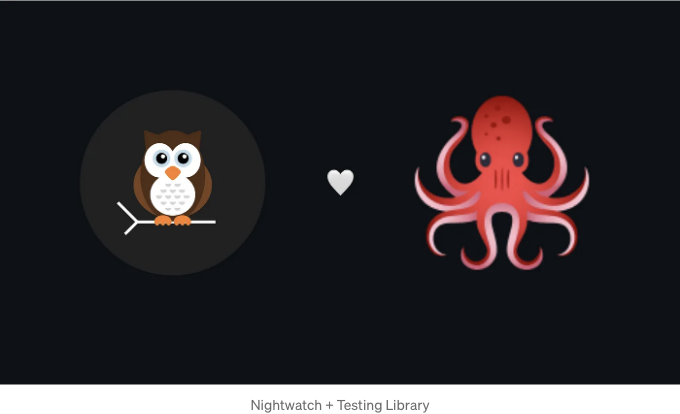
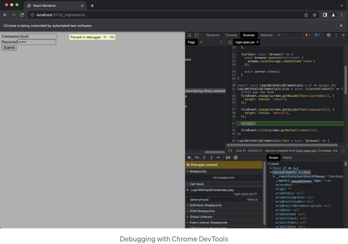

## 인기 있는 Testing Library와 Nightwatch를 살펴보기 - 그리고 더 많이



우리는 Vite를 사용하여 React 프로젝트의 자세한 예제를 만들고 Nightwatch와 Testing Library를 사용하여 컴포넌트를 테스트할 것입니다. 우리는 Jest로 작성된 React Testing Library 문서에 있는 복잡한 예제를 사용할 것입니다.

이 튜토리얼에서는 다음을 다룰 예정입니다:

<!-- ui-log 수평형 -->
<ins class="adsbygoogle"
  style="display:block"
  data-ad-client="ca-pub-4877378276818686"
  data-ad-slot="9743150776"
  data-ad-format="auto"
  data-full-width-responsive="true"></ins>
<component is="script">
(adsbygoogle = window.adsbygoogle || []).push({});
</component>

- 안녕하세요! Vite를 사용하여 새로운 React 프로젝트를 설정해보겠습니다. Nightwatch가 컴포넌트 테스트에 내부적으로 사용하는 것이기도 합니다.
- Nightwatch와 Testing Library를 설치하고 구성해주세요.
- @nightwatch/api-testing 플러그인을 사용하여 API 요청을 가상화해보세요.
- Nightwatch와 Testing Library를 이용하여 복잡한 React 컴포넌트 테스트를 작성해보세요.

# 단계 0. 새로운 프로젝트 만들기

시작하기 위해 Vite로 새 프로젝트를 만들어보겠습니다:

```js
npm init vite@latest
```

<!-- ui-log 수평형 -->
<ins class="adsbygoogle"
  style="display:block"
  data-ad-client="ca-pub-4877378276818686"
  data-ad-slot="9743150776"
  data-ad-format="auto"
  data-full-width-responsive="true"></ins>
<component is="script">
(adsbygoogle = window.adsbygoogle || []).push({});
</component>

React 및 JavaScript를 선택해 주세요. 이렇게 하면 React와 JavaScript로 구성된 새 프로젝트가 생성됩니다.

# 단계 1. Nightwatch 및 Testing Library 설치하기

React용 Testing Library는 @testing-library/react 패키지를 사용하여 설치할 수 있습니다:

```js
npm i @testing-library/react --save-dev
```

<!-- ui-log 수평형 -->
<ins class="adsbygoogle"
  style="display:block"
  data-ad-client="ca-pub-4877378276818686"
  data-ad-slot="9743150776"
  data-ad-format="auto"
  data-full-width-responsive="true"></ins>
<component is="script">
(adsbygoogle = window.adsbygoogle || []).push({});
</component>

Nightwatch를 설치하려면 init 명령어를 실행하세요:

```js
npm init nightwatch@latest
```

메시지에서 컴포넌트 테스팅과 React를 선택하세요. 이렇게 하면 Nightwatch와 @nightwatch/react 플러그인이 설치됩니다. 드라이버를 위해 브라우저를 선택하세요. 이 예시에서는 Chrome을 사용할 것입니다.

## 1.1. @nightwatch/testing-library 플러그인 설치

<!-- ui-log 수평형 -->
<ins class="adsbygoogle"
  style="display:block"
  data-ad-client="ca-pub-4877378276818686"
  data-ad-slot="9743150776"
  data-ad-format="auto"
  data-full-width-responsive="true"></ins>
<component is="script">
(adsbygoogle = window.adsbygoogle || []).push({});
</component>

Nightwatch는 v2.6부터 Testing Library 쿼리를 직접 명령어로 사용할 수 있는 플러그인을 제공하고 있어요. 나중에 테스트를 작성할 때 필요하니, 지금 바로 설치해봐요:

```js
npm i @nightwatch/testing-library --save-dev
```

## 1.2 @nightwatch/apitesting 플러그인 설치

예제에는 컴포넌트를 테스트하기 위해 필요한 모의 서버가 포함되어 있어요. @nightwatch/apitesting 플러그인과 함께 제공되는 통합된 모의 서버를 사용할 거예요. 아래 명령어로 설치해주세요:

<!-- ui-log 수평형 -->
<ins class="adsbygoogle"
  style="display:block"
  data-ad-client="ca-pub-4877378276818686"
  data-ad-slot="9743150776"
  data-ad-format="auto"
  data-full-width-responsive="true"></ins>
<component is="script">
(adsbygoogle = window.adsbygoogle || []).push({});
</component>

```js
npm i @nightwatch/apitesting --save-dev
```

# 단계 2. 로그인 컴포넌트 생성하기

React Testing Library 문서에서 사용한 것과 동일한 컴포넌트를 사용할 것입니다. src/Login.jsx 파일을 생성하고 다음 코드를 추가하세요:

```js
// login.jsx
import * as React from 'react'

function Login() {
  const [state, setState] = React.useReducer((s, a) => ({...s, ...a}), {
    resolved: false,
    loading: false,
    error: null,
  })

  function handleSubmit(event) {
    event.preventDefault()
    const {usernameInput, passwordInput} = event.target.elements

    setState({loading: true, resolved: false, error: null})

    window
      .fetch('/api/login', {
        method: 'POST',
        headers: {'Content-Type': 'application/json'},
        body: JSON.stringify({
          username: usernameInput.value,
          password: passwordInput.value,
        }),
      })
      .then(r => r.json().then(data => (r.ok ? data : Promise.reject(data))))
      .then(
        user => {
          setState({loading: false, resolved: true, error: null})
          window.localStorage.setItem('token', user.token)
        },
        error => {
          setState({loading: false, resolved: false, error: error.message})
        },
      )
  }

  return (
    <div>
      <form onSubmit={handleSubmit}>
        <div>
          <label htmlFor="usernameInput">아이디</label>
          <input id="usernameInput" />
        </div>
        <div>
          <label htmlFor="passwordInput">비밀번호</label>
          <input id="passwordInput" type="password" />
        </div>
        <button type="submit">제출하기{state.loading ? '...' : null}</button>
      </form>
      {state.error ? <div role="alert">{state.error}</div> : null}
      {state.resolved ? (
        <div role="alert">축하합니다! 로그인되었습니다!</div>
      ) : null}
    </div>
  )
}

export default Login
```

<!-- ui-log 수평형 -->
<ins class="adsbygoogle"
  style="display:block"
  data-ad-client="ca-pub-4877378276818686"
  data-ad-slot="9743150776"
  data-ad-format="auto"
  data-full-width-responsive="true"></ins>
<component is="script">
(adsbygoogle = window.adsbygoogle || []).push({});
</component>

# 단계 3. 컴포넌트 테스트 작성하기

Testing Library의 창시 원칙 중 하나는 테스트가 가능한 한 사용자가 애플리케이션과 상호작용하는 방식과 유사해야 한다는 것입니다. Nightwatch를 사용하여 JSX로 컴포넌트 테스트를 작성할 때, Storybook에서 소개된 선언적 형식인 컴포넌트 스토리 형식을 사용하여 테스트를 컴포넌트 스토리로 작성해야 합니다.

이를 통해 컴포넌트가 구현되는 방식이 아닌 사용 방식에 초점을 맞춘 테스트를 작성할 수 있으며, 이는 Testing Library 철학과 일치합니다. Nightwatch 문서에서 더 많은 정보를 확인할 수 있습니다.

이 형식을 사용하여 테스트를 작성하는 데 큰 장점은 이 코드를 사용하여 컴포넌트에 대한 스토리를 작성할 수 있어, Storybook에서 문서화하고 쇼케이스하는 데 사용할 수 있다는 것입니다.

<!-- ui-log 수평형 -->
<ins class="adsbygoogle"
  style="display:block"
  data-ad-client="ca-pub-4877378276818686"
  data-ad-slot="9743150776"
  data-ad-format="auto"
  data-full-width-responsive="true"></ins>
<component is="script">
(adsbygoogle = window.adsbygoogle || []).push({});
</component>

# 3.1 유효한 자격 증명으로 로그인하기 테스트

새 파일 src/Login.spec.jsx를 만들고 Jest로 작성된 복잡한 예제와 동일한 작업을 수행하는 다음 코드를 추가하십시오:

Nightwatch에서 JSX를 사용하여 구성 요소를 렌더링하려면 렌더링된 구성 요소를 내보내는 옵션과 함께 새로운 export를 만듭니다. play 및 test 함수는 구성 요소와 상호 작용하고 결과를 확인하는 데 사용됩니다.

- play 함수는 구성 요소와 상호 작용하는 데 사용됩니다. 브라우저 환경에서 실행되므로 Testing Library의 screen 객체를 사용하여 DOM을 쿼리하고 이벤트를 발생시킬 수 있습니다.
- test 함수는 결과를 확인하는 데 사용됩니다. Node.js 컨텍스트에서 실행되므로 Nightwatch 브라우저 객체를 사용하여 DOM을 쿼리하고 결과를 확인할 수 있습니다.

<!-- ui-log 수평형 -->
<ins class="adsbygoogle"
  style="display:block"
  data-ad-client="ca-pub-4877378276818686"
  data-ad-slot="9743150776"
  data-ad-format="auto"
  data-full-width-responsive="true"></ins>
<component is="script">
(adsbygoogle = window.adsbygoogle || []).push({});
</component>

```js
// login.spec.jsx
import {render, fireEvent, screen} from '@testing-library/react'
import Login from '../src/login'

export default {
  title: 'Login',
  component: Login
}

export const LoginWithValidCredentials = () => <Login />;
LoginWithValidCredentials.play = async ({canvasElement}) => {
  //fill out the form
};

LoginWithValidCredentials.test = async (browser) => {
  // verify the results
};
```

## 목 서버 추가

예제에서는 로그인 요청을 시뮬레이션하기 위해 목 서버를 사용합니다. @nightwatch/apitesting 플러그인에 함께 제공되는 통합 목 서버를 사용할 것입니다.

이를 위해 테스트 파일에 직접 작성할 수 있는 설정 및 해제 훅을 사용할 것입니다. 이 두 훅은 Node.js 컨텍스트에서 실행됩니다.```

<!-- ui-log 수평형 -->
<ins class="adsbygoogle"
  style="display:block"
  data-ad-client="ca-pub-4877378276818686"
  data-ad-slot="9743150776"
  data-ad-format="auto"
  data-full-width-responsive="true"></ins>
<component is="script">
(adsbygoogle = window.adsbygoogle || []).push({});
</component>

테이블 태그를 마크다운 형식으로 변경해주시면 됩니다.

<!-- ui-log 수평형 -->
<ins class="adsbygoogle"
  style="display:block"
  data-ad-client="ca-pub-4877378276818686"
  data-ad-slot="9743150776"
  data-ad-format="auto"
  data-full-width-responsive="true"></ins>
<component is="script">
(adsbygoogle = window.adsbygoogle || []).push({});
</component>

## 디버깅

Nightwatch를 컴포넌트 테스트에 사용하는 주요 이점 중 하나는 엔드 투 엔드 테스트에 사용 가능한 동일한 API가 제공되는 것 외에도 JSDOM과 같은 가상 DOM 환경이 아닌 실제 브라우저에서 테스트를 실행할 수 있다는 것입니다.

이를 통해 Chrome 개발자 도구를 사용하여 테스트를 디버깅할 수 있습니다.

예를 들어, LoginWithValidCredentials.play 함수에 디버거 문을 추가해 봅시다:

<!-- ui-log 수평형 -->
<ins class="adsbygoogle"
  style="display:block"
  data-ad-client="ca-pub-4877378276818686"
  data-ad-slot="9743150776"
  data-ad-format="auto"
  data-full-width-responsive="true"></ins>
<component is="script">
(adsbygoogle = window.adsbygoogle || []).push({});
</component>

```js
LoginWithValidCredentials.play = async ({canvasElement}) => {
  // 폼 작성
  fireEvent.change(screen.getByLabelText(/username/i), {
    target: {value: 'chuck'},
  });

  fireEvent.change(screen.getByLabelText(/password/i), {
    target: {value: 'norris'},
  });
  
  debugger;
  
  fireEvent.click(screen.getByText(/submit/i))
};
```

이제 --debug 및 --devtools 플래그를 사용하여 테스트를 실행합시다:

```js
npx nightwatch test/login.spec.jsx --debug --devtools
```

이것은 Dev Tools가 열린 새로운 Chrome 창을 엽니다. 이제 Dev Tools에서 중단점을 설정하고 코드를 단계별로 실행할 수 있습니다.```

<!-- ui-log 수평형 -->
<ins class="adsbygoogle"
  style="display:block"
  data-ad-client="ca-pub-4877378276818686"
  data-ad-slot="9743150776"
  data-ad-format="auto"
  data-full-width-responsive="true"></ins>
<component is="script">
(adsbygoogle = window.adsbygoogle || []).push({});
</component>



# 3.2 서버 예외로 로그인 테스트

Testing Library 문서의 원본 예제에는 서버에서 예외가 발생하는 경우를 테스트하는 부분도 포함되어 있습니다.

Nightwatch에서 같은 테스트를 작성해 봅시다. 이번에는 컴포넌트와 상호작용할 수 있기 때문에 테스트 함수만 사용할 것입니다. 이전에 언급했듯이, 테스트 함수는 Node.js 컨텍스트에서 실행되며 Nightwatch 브라우저 객체를 인수로 받습니다.

<!-- ui-log 수평형 -->
<ins class="adsbygoogle"
  style="display:block"
  data-ad-client="ca-pub-4877378276818686"
  data-ad-slot="9743150776"
  data-ad-format="auto"
  data-full-width-responsive="true"></ins>
<component is="script">
(adsbygoogle = window.adsbygoogle || []).push({});
</component>

우리는 또한 목 서버 응답을 업데이트하여 500 상태 코드와 오류 메시지를 반환해야 합니다. 이 작업은 LoginWithServerException 컴포넌트 스토리에서 preRender 테스트 훅을 작성하여 쉽게 수행할 수 있습니다.

```js
export const LoginWithServerException = () => <Login />;
LoginWithServerException.preRender = async (browser) => {
  serverResponse = {
    status: 500,
    body: {message: 'Internal server error'}
  };
};

LoginWithServerException.test = async (browser) => {
  const username = await browser.getByLabelText(/username/i);
  await username.sendKeys('chuck');

  const password = await browser.getByLabelText(/password/i);
  await password.sendKeys('norris');

  const submit = await browser.getByText(/submit/i);
  await submit.click();

  const alert = await browser.getByRole('alert');
  await expect(alert).text.to.match(/internal server error/i);

  const localStorage = await browser.execute(function() {
    return window.localStorage.getItem('token');
  });

  await expect(localStorage).to.equal(token)
};
```

# 4. 테스트 실행

마지막으로, 테스트를 실행해 봅시다. 이렇게 하면 Chrome에서 LoginWithValidCredentials 및 LoginWithServerException 컴포넌트 스토리가 실행됩니다.

<!-- ui-log 수평형 -->
<ins class="adsbygoogle"
  style="display:block"
  data-ad-client="ca-pub-4877378276818686"
  data-ad-slot="9743150776"
  data-ad-format="auto"
  data-full-width-responsive="true"></ins>
<component is="script">
(adsbygoogle = window.adsbygoogle || []).push({});
</component>

```js
npx nightwatch test/login.spec.jsx
```

브라우저를 열지 않고 테스트를 실행하려면 --headless 플래그를 전달할 수 있어요. 모두 잘 진행되면 다음 출력이 표시될 거에요:

```js
[Login] Test Suite
────────────────────────────────────
ℹ ChromeDriver에 9515 포트(1134ms)로 연결되었습니다.
  사용중인 환경: MAC OS X에서 chrome (108.0.5359.124).

3000 포트에서 대기하는 Mock 서버

  <LoginWithValidCredentials> 컴포넌트 실행 중:
──────────────────────────────────────────────────────────────────────────────────────────────────────────────────────────────────────
[브라우저] [vite] 연결 중...
[브라우저] [vite] 연결됨.
  ✔ 예상 요소 <LoginWithValidCredentials> 가 표시되기를 기대함 (15ms)
  ✔ 예상 'DIV[id='app'] > DIV > DIV' 요소의 텍스트가 "/congrats/i"와 일치하기를 기대함 (14ms)
  ✔ 'fake_user_token' 가 'fake_user_token'과 같기를 기대함: 

  ✨ 통과했습니다. 3개의 어설션. (1.495초)

  <LoginWithServerException> 컴포넌트 실행 중:
──────────────────────────────────────────────────────────────────────────────────────────────────────────────────────────────────────
[브라우저] [vite] 연결 중...
[브라우저] [vite] 연결됨.
  ✔ 예상 요소 <LoginWithServerException> 가 표시되기를 기대함 (8ms)
  ✔ 예상 'DIV[id='app'] > DIV > DIV' 요소의 텍스트가 "/internal server error/i"와 일치하기를 기대함 (8ms)
  ✔ 'fake_user_token' 가 'fake_user_token'과 같기를 기대함: 

  ✨ 통과했습니다. 3개의 어설션. (1.267초)

  ✨ 총 6개의 어설션 중 6개가 통과되었습니다. (4.673초)
```

# 결론

<!-- ui-log 수평형 -->
<ins class="adsbygoogle"
  style="display:block"
  data-ad-client="ca-pub-4877378276818686"
  data-ad-slot="9743150776"
  data-ad-format="auto"
  data-full-width-responsive="true"></ins>
<component is="script">
(adsbygoogle = window.adsbygoogle || []).push({});
</component>

여기까지입니다! 이 예제의 완전한 코드는 GitHub 저장소에서 찾으실 수 있어요. PRs는 환영합니다.

궁금한 점이나 피드백이 있으시면 언제든 Nightwatch Discord로 들러주세요.