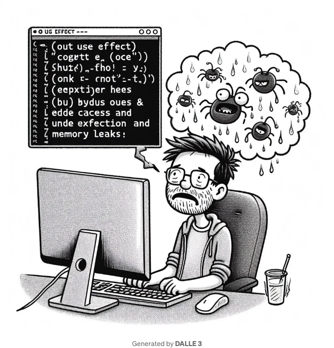

이 보이는 무해한 React 컴포넌트에 주목을 요청하고 싶습니다. 중요한 오류를 발견할 수 있나요?

```js
import React, { useEffect, useState } from 'react';

function DarkSideOfUseEffect() {
  const [count, setCount] = useState(0);
  const [pressed, setPressed] = useState(false);

  useEffect(() => {
    console.log('Count is', count);
    setPressed(!pressed);
  });

  // ...다른 컴포넌트 로직...

  return (
    <div>
      <p>Count: {count}</p>
      <button onClick={() => setCount(count + 1)}>Increment</button>
    </div>
  );
}

export default DarkSideOfUseEffect;
```

거의 모든 React 개발자들이 적어도 한 번 이 오류를 저질렀을 것이고, 이 실수는 원치 않는 무한 루프와 메모리 누수를 일으켜 여러분의 애플리케이션을 붕괴시킬 수 있습니다.

<!-- ui-log 수평형 -->
<ins class="adsbygoogle"
  style="display:block"
  data-ad-client="ca-pub-4877378276818686"
  data-ad-slot="9743150776"
  data-ad-format="auto"
  data-full-width-responsive="true"></ins>
<component is="script">
(adsbygoogle = window.adsbygoogle || []).push({});
</component>

교묘하게 숨어있는 오류는 useEffect 블록에 있습니다. 우리는 의존성 배열을 포함하여 이를 수정합니다. 이 의존성 배열은 React에게 다음과 같이 말합니다:

```js
useEffect(() => {
    console.log('Count is', count);
    setPressed(!pressed)
    // 아래의 빈 배열은 React에게 useEffect() 훅 안의 코드를 한 번만 실행하도록 지시합니다.
  }, []);
```

오늘은 useEffect 훅이 올바르게 사용되지 않았을 때 얼마나 해로운지 몇 가지 시나리오를 예로 들어 설명하겠습니다.

이 글이 여러분이 useEffect 훅을 다시 잘못 사용하지 않도록 충분한 두려움을 주기를 희망합니다.

<!-- ui-log 수평형 -->
<ins class="adsbygoogle"
  style="display:block"
  data-ad-client="ca-pub-4877378276818686"
  data-ad-slot="9743150776"
  data-ad-format="auto"
  data-full-width-responsive="true"></ins>
<component is="script">
(adsbygoogle = window.adsbygoogle || []).push({});
</component>

그럼 이제 더 이상 말이 필요 없죠! 

## 1. API에 대한 DDOS 공격

무한한 GET 요청으로 API를 공격한다고 상상해보세요; 이것이 바로 DDOS 공격입니다.

API를 다운시킴과 동시에, React 앱이 AWS와 같은 곳에 호스팅되어 있고 제한이 없다면 상당한 비용이 들 수 있습니다.

<!-- ui-log 수평형 -->
<ins class="adsbygoogle"
  style="display:block"
  data-ad-client="ca-pub-4877378276818686"
  data-ad-slot="9743150776"
  data-ad-format="auto"
  data-full-width-responsive="true"></ins>
<component is="script">
(adsbygoogle = window.adsbygoogle || []).push({});
</component>

이 코드는 잘못되었고 API를 무한히 호출하게 됩니다: (❌이렇게 하지 마세요❌)

```js
const [data, setData] = useState()
useEffect(() => {
    async function getData() {
      const fetchedData = await fetch("https://example.com/api")
      setData(fetchedData)
      console.log(data)
    }
    getData()
});
```

✅대신 이렇게 하세요:✅

```js
const [data, setData] = useState()
useEffect(() => {
    // 이 컴포넌트가 마운트될 때 안전하게 데이터를 가져옵니다
    async function getData() {
      const fetchedData = await fetch("https://example.com/api")
      setData(fetchedData)
      console.log(data)
    }
    getData()
}, []);
```

<!-- ui-log 수평형 -->
<ins class="adsbygoogle"
  style="display:block"
  data-ad-client="ca-pub-4877378276818686"
  data-ad-slot="9743150776"
  data-ad-format="auto"
  data-full-width-responsive="true"></ins>
<component is="script">
(adsbygoogle = window.adsbygoogle || []).push({});
</component>

## 2. 무한 UI 깜빡임

useEffect 훅의 일반적인 사용 사례는 상태 변수 변경 시 UI를 수정하는 것입니다.

그러나 아래 코드는 `p` 요소의 무한 깜빡임을 생성할 것입니다. 왜냐하면 useEffect는 모든 렌더링 후에 실행되기 때문에(버튼이 눌릴 때 상태 업데이트가 발생하는 것도 포함됨) 렌더링마다 상태가 변경되기 때문입니다.

```js
import React, { useState, useEffect } from 'react';

function FlickeringComponent() {
  const [isVisible, setIsVisible] = useState(true);

  // 잘못된 사용 ❌: useEffect 블록 내에서 상태 변경
  useEffect(() => {
    setIsVisible(!isVisible);
  }, [isVisible]);

  return (
    <div>
      {isVisible ? <p>보이는 내용</p> : null}
      <button onClick={() => setIsVisible(!isVisible)}>
        가시성 전환
      </button>
    </div>
  );
}

export default FlickeringComponent;
```

<!-- ui-log 수평형 -->
<ins class="adsbygoogle"
  style="display:block"
  data-ad-client="ca-pub-4877378276818686"
  data-ad-slot="9743150776"
  data-ad-format="auto"
  data-full-width-responsive="true"></ins>
<component is="script">
(adsbygoogle = window.adsbygoogle || []).push({});
</component>

위 문제를 해결하기 위해 의존성 배열을 빈 배열 []로 교체할 수 있습니다.

또는 더 나아가, 더 깨끗한 코드를 위해 useEffect 훅을 제거하고 isVisible을 false로 초기화할 수도 있습니다.

```js
import React, { useState } from 'react';

function StableComponent() {
  // 초기 상태를 false로 설정하여, 즉 가시성이 없는 콘텐츠
  const [isVisible, setIsVisible] = useState(false);

  return (
    <div>
      {isVisible ? <p>Stable Content</p> : null}
      <button onClick={() => setIsVisible(!isVisible)}>
        가시성 전환
      </button>
    </div>
  );
}

export default StableComponent;
```

이 새로운 코드는 이제 무한 루프를 방지하고 예상대로 작동할 것입니다.

<!-- ui-log 수평형 -->
<ins class="adsbygoogle"
  style="display:block"
  data-ad-client="ca-pub-4877378276818686"
  data-ad-slot="9743150776"
  data-ad-format="auto"
  data-full-width-responsive="true"></ins>
<component is="script">
(adsbygoogle = window.adsbygoogle || []).push({});
</component>

## 3. 채팅 애플리케이션에서의 경합 조건

웹 소켓을 통해 동기화된 상태의 메시지 목록이 있다고 가정해 봅시다.

여기서 useEffect 훅을 사용하여 메시지 상태를 가져와 업데이트하는 방법으로 잘못된 예제가 있는데, 다음은 간단화된 예시입니다:

```js
import React, { useState, useEffect } from 'react';

function ChatComponent({ roomId }) {
  const [messages, setMessages] = useState([]);

  useEffect(() => {
    // roomId를 기반으로 메시지를 가져옵니다.
    fetchMessages(roomId)
      .then((newMessages) => {
        // 잘못된 방법 ❌: 기존 메시지를 덮어씁니다.
        setMessages(newMessages);
      })
      .catch((error) => {
        console.error('메시지 가져오기 오류:', error);
      });
  }, [roomId]);

  return (
    <div>
      <h2>채팅방 {roomId}</h2>
      <ul>
        {messages.map((message) => (
          <li key={message.id}>{message.content}</li>
        ))}
      </ul>
    </div>
  );
}

export default ChatComponent;
```

<!-- ui-log 수평형 -->
<ins class="adsbygoogle"
  style="display:block"
  data-ad-client="ca-pub-4877378276818686"
  data-ad-slot="9743150776"
  data-ad-format="auto"
  data-full-width-responsive="true"></ins>
<component is="script">
(adsbygoogle = window.adsbygoogle || []).push({});
</component>

이 컴포넌트는 처음 봤을 때는 정확해 보이지만, useEffect 내부에 논리적 오류가 있어서 메시지 배열이 완전히 덮어씌워질 수 있습니다.

다시 말해, 실시간으로 다른 사용자가 작성한 메시지가 가장 최근 렌더링에 의해 덮어씌워지기 때문에 다른 사용자가 작성한 메시지에 대한 우려가 없습니다.

이 문제를 해결하려면 새로운 메시지를 기존 메시지와 병합하는 대신에 전체 메시지 상태를 덮어씌우는 것이 아니라 새로운 메시지를 병합해야 합니다:

```js
import React, { useState, useEffect } from 'react';

function ChatComponent({ roomId }) {
  const [messages, setMessages] = useState([]);

  useEffect(() => {
    // roomId를 기반으로 메시지 가져오기
    fetchMessages(roomId)
      .then((newMessages) => {
        // 올바른 ✅: 새로운 메시지를 기존 메시지에 병합
        setMessages((prevMessages) => [...prevMessages, ...newMessages]);
      })
      .catch((error) => {
        console.error('메시지를 가져오는 중 오류 발생:', error);
      });
  }, [roomId]);

  return (
    <div>
      <h2>채팅방 {roomId}</h2>
      <ul>
        {messages.map((message) => (
          <li key={message.id}>{message.content}</li>
        ))}
      </ul>
    </div>
  );
}

export default ChatComponent;
```

<!-- ui-log 수평형 -->
<ins class="adsbygoogle"
  style="display:block"
  data-ad-client="ca-pub-4877378276818686"
  data-ad-slot="9743150776"
  data-ad-format="auto"
  data-full-width-responsive="true"></ins>
<component is="script">
(adsbygoogle = window.adsbygoogle || []).push({});
</component>

## 결론

useEffect 훅을 잘못 사용한 세 가지 맥락적 예제에 대해 논의했습니다.

그런 다음 이러한 예제를 해결하는 방법과 React 애플리케이션에서 useEffect를 처리할 때 고려해야 할 모범 사례에 대해 더 깊이 다뤘습니다.

# 주요 기사

<!-- ui-log 수평형 -->
<ins class="adsbygoogle"
  style="display:block"
  data-ad-client="ca-pub-4877378276818686"
  data-ad-slot="9743150776"
  data-ad-format="auto"
  data-full-width-responsive="true"></ins>
<component is="script">
(adsbygoogle = window.adsbygoogle || []).push({});
</component>

# 제휴 업체

- Figma 홈: 내 모든 프로젝트에서 사용하는 UI 디자인 도구.
- Figma 프로페셔널: 당신이 필요로 할 유일한 UI 디자인 도구.
- FigJam: 직관적인 다이어그램 및 아이디어 발전으로 창의적으로 생각해보세요.

- Notion: 내 전체 삶을 조직하는 데 사용하는 도구.
- Notion AI: ChatGPT를 능가하는 AI 도구로 Notion 작업을 업그레이드합니다.

# 참조

<!-- ui-log 수평형 -->
<ins class="adsbygoogle"
  style="display:block"
  data-ad-client="ca-pub-4877378276818686"
  data-ad-slot="9743150776"
  data-ad-format="auto"
  data-full-width-responsive="true"></ins>
<component is="script">
(adsbygoogle = window.adsbygoogle || []).push({});
</component>

- [https://www.w3schools.com/react/react_useeffect.asp](https://www.w3schools.com/react/react_useeffect.asp)
- [https://react.dev/reference/react/useEffect](https://react.dev/reference/react/useEffect)