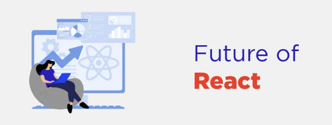

리액트.js의 "아버지"라는 용어는 페이스북의 소프트웨어 엔지니어인 조던 월케에게 자주 연관되며, 그는 리액트를 만든 사람으로 알려져 있습니다. 피트 헌트나 톰 오키노와 같은 엔지니어들도 리액트의 개발에 기여했지만, 조던 월케는 리액트의 초기 작성과 디자인에 큰 역할을 했습니다. 그는 2013년 5월 JSConf US 컨퍼런스에서 리액트를 소개하고 초기 개발과 보급에 큰 역할을 했습니다. 따라서 그는 종종 "리액트.js의 아버지" 또는 그냥 주요 창조자 중 한 명으로 언급됩니다.

리액트.js, 일반적으로 리액트로 알려진 이것은 페이스북이 개발한 오픈 소스 자바스크립트 라이브러리로, 특히 싱글 페이지 어플리케이션과 복잡한 웹 인터페이스를 구축하는 데 사용됩니다. 이는 페이스북의 소프트웨어 엔지니어인 조던 월케가 2013년 5월 JSConf US 컨퍼런스에서 소개했습니다.

<!-- ui-log 수평형 -->
<ins class="adsbygoogle"
  style="display:block"
  data-ad-client="ca-pub-4877378276818686"
  data-ad-slot="9743150776"
  data-ad-format="auto"
  data-full-width-responsive="true"></ins>
<component is="script">
(adsbygoogle = window.adsbygoogle || []).push({});
</component>

- 웹의 성능이 향상됩니다: React.js는 항상 성능에 집중해왔으며, 이러한 추세는 계속될 것으로 예상됩니다. 브라우저 기능이 향상되고 동시 렌더링과 같은 새로운 기술이 보편화되면서, React는 이러한 진보를 활용하여 응용 프로그램을 더 빠르고 반응성 있는 것으로 개선할 것으로 예상됩니다.
- 선언적 UI: React의 선언적 사용자 인터페이스 빌드 접근 방식은 그 인기의 주된 요인이었습니다. 우리는 React가 이 패러다임을 계속해서 개선하고 확장할 것으로 기대할 수 있으며, 이를 통해 개발자가 복잡한 UI를 간단하고 직관적인 방식으로 표현하기가 더욱 수월해질 것으로 예상합니다.
- 서버 측 렌더링 및 정적 사이트 생성: Next.js와 같은 프레임워크의 등장으로 서버 측 렌더링 및 정적 사이트 생성이 가능해졌습니다. React는 이러한 패턴을 계속 받아들이고 개선할 것으로 예상됩니다. 이는 개발자가 고성능이며 SEO 친화적인 웹 응용 프로그램을 보다 쉽게 구축할 수 있게 할 것입니다.
- React와 함께 더 쉬운 상태 관리: React 자체는 컴포넌트 상태 및 컨텍스트 API를 통해 간단한 상태 관리 솔루션을 제공하지만, Redux 및 MobX와 같은 전문 라이브러리가 더 복잡한 어플리케이션 상태를 관리하기 위해 등장했습니다. React의 미래는 내장된 상태 관리 능력의 향상 또는 인기있는 상태 관리 솔루션과의 더 밀접한 통합이 포함될 수 있습니다.
- 타입에 대한 안전성 강조: React 커뮤니티에서 TypeScript의 인기가 높아지면서 React는 정적 타입에 대한 더 나은 지원으로 발전해 나갈 것으로 예상됩니다. 이는 TypeScript와의 밀접한 통합 또는 더 나은 타입 추론 능력을 제공할 수 있습니다.
- 성분 구성을 위한: React의 구성 요소 기반 아키텍처는 그 성공의 주요 요인 중 하나였으며, 이러한 추세가 계속될 것으로 예상됩니다. 응용 프로그램이 더 복잡해지면 React는 확장 가능하고 유지 관리 가능한 방식으로 구성 요소를 조합하기 위한 도구와 패턴을 계속 제공할 것으로 예상됩니다.
- 더 나은 개발자 경험을 위한: React는 개발 서버부터 테스트 프레임워크, devtools까지 개발자 경험을 향상시키는 다양한 도구와 라이브러리가 풍부한 생태계를 가지고 있습니다. React는 이러한 생태계를 지속적으로 개선하기 위해 투자할 것으로 예상되며, React 애플리케이션을 구축하는 것을 보다 쉽고 즐겁게 만들어 줄 것입니다.
- 접근성과 포용성: 웹 개발 커뮤니티에서 접근성 문제에 대한 인식이 계속해서 증가함에 따라 React는 접근성과 포용성에 더 많은 중점을 둘 것으로 예상됩니다. 이는 핵심 React API의 접근성 개선뿐만 아니라 접근성 있는 애플리케이션을 구축하기 위한 더 나은 가이드 및 도구 제공에 포함될 수 있습니다.

결론: 미래를 정확히 예측하는 것은 불가능하지만, React.js의 미래 진화에서 기대할 수 있는 추세와 초점 영역 중 일부를 소개했습니다.