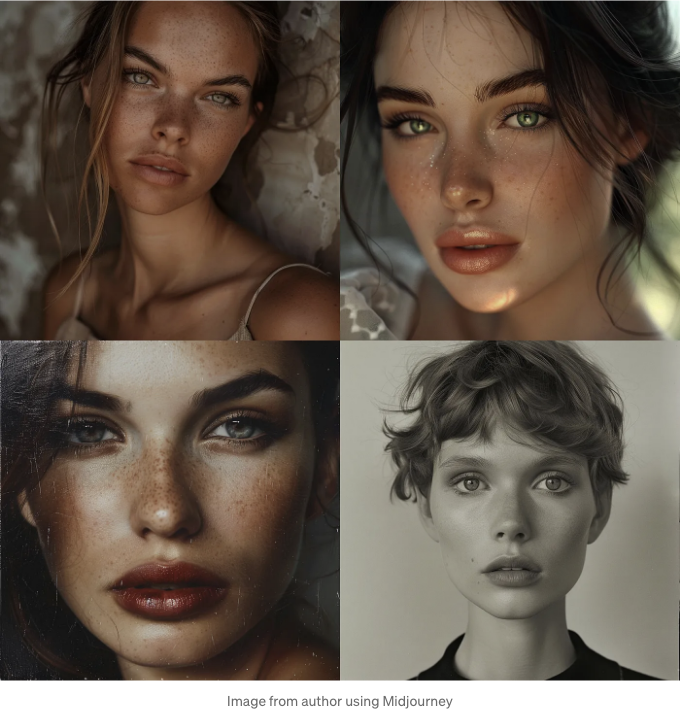
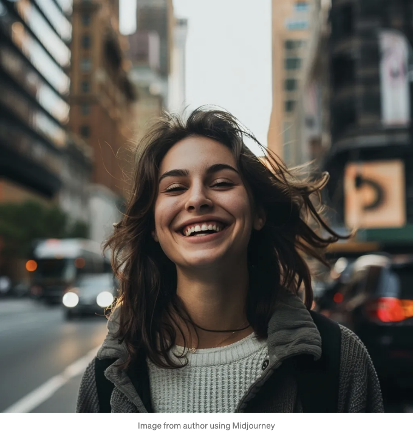
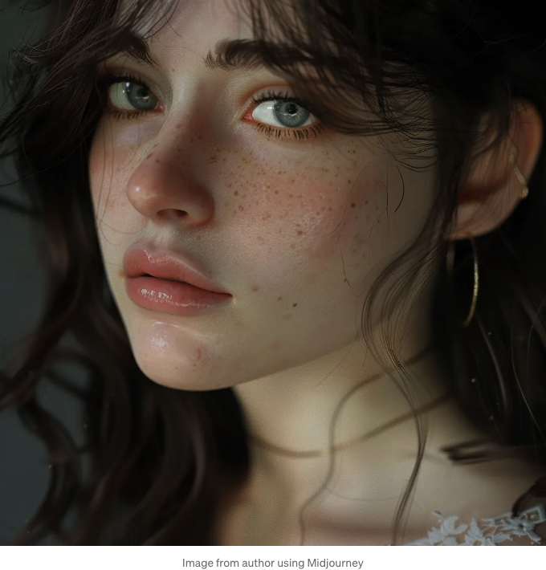
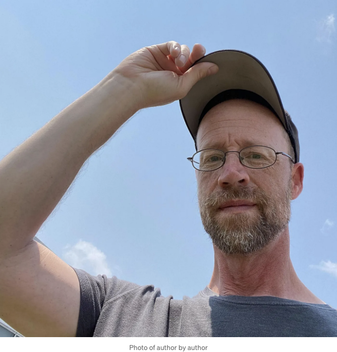
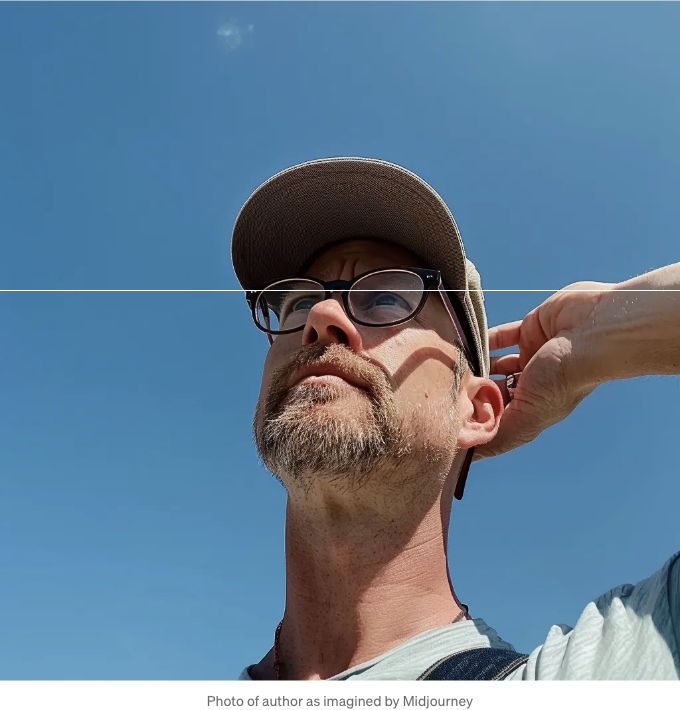
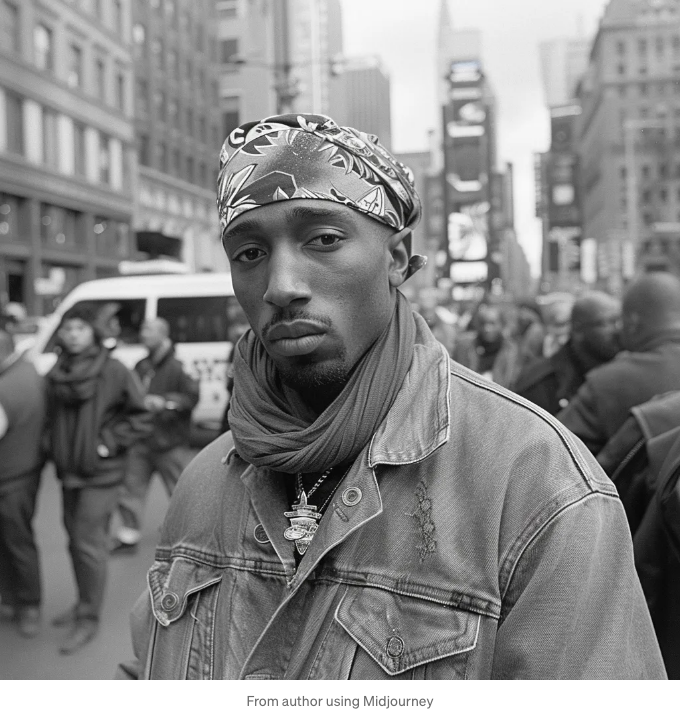
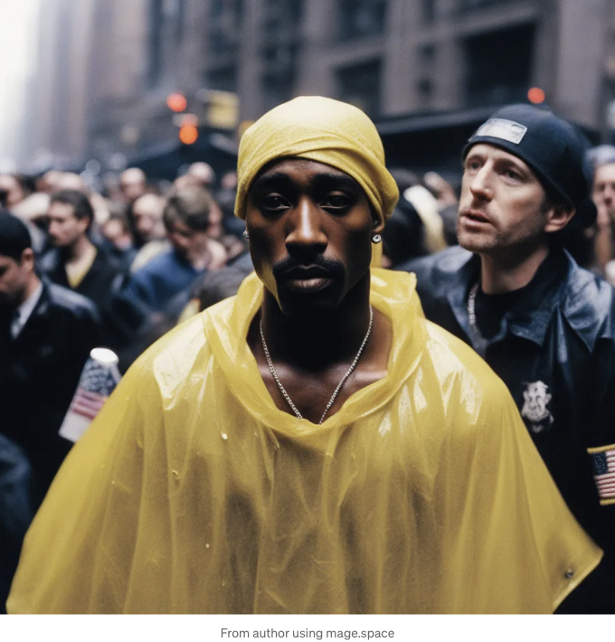

인공지능은 지속적으로 출력물을 향상시켜 왔는데, 내 주변 대부분의 사람들은 진짜와 가짜를 구별할 수 없을 정도입니다.

이것은 문제인데요, 인공 생성 이미지와 텍스트에 속아 넘어가는 사람이 많아질 것이라는 것은 분명합니다. 그러나 인공지능이 발전함에 따라, 이러한 차이점으로 감지하는 것은 작은 실수가 아니라 그 실수의 부재일 것입니다.

최근 이미지 생성기들에는 명백한 문제가 있었습니다. 예를 들어 손에 엄지손가락이 더 생겨나는 등의 문제가 있었죠. 그런데 Midjourney가 V6 알파를 발표한 이후(텍스트 추가 기능이 추가된)로는 이러한 손의 오류가 훨씬 덜 발생합니다. 그리고 현실과 구분하기 어려운 얼굴 이미지도 생성해냅니다.

<!-- ui-log 수평형 -->
<ins class="adsbygoogle"
  style="display:block"
  data-ad-client="ca-pub-4877378276818686"
  data-ad-slot="9743150776"
  data-ad-format="auto"
  data-full-width-responsive="true"></ins>
<component is="script">
(adsbygoogle = window.adsbygoogle || []).push({});
</component>

이 이미지를 위해 "거리에서 미소 짓는 여자"라는 간단한 프롬프트를 사용했습니다. 카메라로 거리에서 원시적인 감정을 잡는 것을 사랑하기 때문에 이를 선택했습니다.

이것은 훌륭한 거리 초상화의 모든 요소가 있습니다:

사람들이 자신의 사진을 찍힌다는 것을 알 때 몇몇 사람들이 주는 즐거움과 기쁜 표정입니다.

<!-- ui-log 수평형 -->
<ins class="adsbygoogle"
  style="display:block"
  data-ad-client="ca-pub-4877378276818686"
  data-ad-slot="9743150776"
  data-ad-format="auto"
  data-full-width-responsive="true"></ins>
<component is="script">
(adsbygoogle = window.adsbygoogle || []).push({});
</component>

좋은 조명이네요 (머리칼이 빛나는 것을 보면 황금 시간쯤일 것 같아요.)

얼굴이 선명하게 나왔네요.

흐릿한 배경이 있어요. 초점을 f2.8 또는 보다 얕은 깊이로 맞춘 초상화 사진가의 스타일처럼 보여요. 그 결과로 배경이 흐릿해져서 대상물이 더 잘 돋보이게 되었네요.

이 사진을 거리의 모르는 사람을 찍었다면 아주 흡족했을 거예요. 하지만 사실은 아니죠. Midjourney 6와 간단한 명령으로 몇 초만에 만들었어요.

<!-- ui-log 수평형 -->
<ins class="adsbygoogle"
  style="display:block"
  data-ad-client="ca-pub-4877378276818686"
  data-ad-slot="9743150776"
  data-ad-format="auto"
  data-full-width-responsive="true"></ins>
<component is="script">
(adsbygoogle = window.adsbygoogle || []).push({});
</component>

그러나 많은 사람들이 이것을 "좋아요"하고 넘겨 갈 것이지만, 나는 재능 있는 초상화 작가라고 생각하면서 "결함"을 인식하지 못할 수도 있어요. 이 경우, 진짜인 것 같지 않은 완벽한 것들이 그것이죠.

나는 거의 완벽한 피부를 가진 사람들이 없다고 말하고 싶지 않아요. 하지만 이 AI 여자는 분명 고가의 스킨케어/화장 루틴을 가지고 있어요. 아마도 어느 순간의 교정치아치료를 받았고, 백색치아를 위한 치약을 사용했을 것으로 보입니다. 아마도 어느 순간 코성형술도 받았을지도 몰라요.

물론 그녀는 그런 것 중 하나도 가지고 있지 않았어요, 완전히 공기에서 구현된 것이기 때문이에요.

하지만 저는 Midjourney에게 커버 모델을 요청한 적은 없어요. 그저 웃고 있는 여자를 요청했을 뿐이에요. 그것은 기본적으로 젊고 아름다운 여자를 제공했지요.

<!-- ui-log 수평형 -->
<ins class="adsbygoogle"
  style="display:block"
  data-ad-client="ca-pub-4877378276818686"
  data-ad-slot="9743150776"
  data-ad-format="auto"
  data-full-width-responsive="true"></ins>
<component is="script">
(adsbygoogle = window.adsbygoogle || []).push({});
</component>

대부분의 사람들은 어떤 "독특한" 특징을 갖고 있을 것이에요.

예를 들어, 피부에 여드름이나 여드름 자국이 있을 수 있어요. 이빨이 완벽하게 일직선으로 놓여있지 않거나 약간 변색되어 있을 수도 있어요. 머리카락이 고급 미용실에서 나온 것처럼 보이지 않을 수도 있어요. 옷도 매우 깨끗하고 비싸보이지 않을 수도 있어요.

그리고 사진 찍은 적이 없는 사람처럼 웃고 있지 않을 수도 있어요.

다시 말해, 우리가 종종 "결점"으로 여기는 특징이 없어진다면, 우리가 공기로 뿌린 모델이 아니라 인간으로 보이게 되는 거에요.

<!-- ui-log 수평형 -->
<ins class="adsbygoogle"
  style="display:block"
  data-ad-client="ca-pub-4877378276818686"
  data-ad-slot="9743150776"
  data-ad-format="auto"
  data-full-width-responsive="true"></ins>
<component is="script">
(adsbygoogle = window.adsbygoogle || []).push({});
</component>

이번에도 "실감나는 사람"을 요청하여 실행한 결과, 이번에는 또 다른 예쁜 젊은 여성이 나왔어요. 그러나 주목할 점은 이번에는 주근깨가 있습니다. 아마도 Midjourney가 출력물을 더 현실적으로 만들기 위한 방법 중 하나인 것 같아요.

주근깨는 결여 사항이 아닙니다. 사실 최고 패션 모델들 사이에서 매우 흔하죠. 그래서 이 피부 특징이 있더라도 그녀는 여전히 할리우드 레드 카펫에 있는 사람 같아요.

공정하게 말하자면, 그녀의 턱에 작은 흠이 있어요. (혹시 면도하다가 자르셨을지도요?) 그렇지만 윤광나는 피부와 여성분들이 종종 최대 $1,000를 지불하는 풍부한 입술 덕분에 잘 보이지 않아요.

<!-- ui-log 수평형 -->
<ins class="adsbygoogle"
  style="display:block"
  data-ad-client="ca-pub-4877378276818686"
  data-ad-slot="9743150776"
  data-ad-format="auto"
  data-full-width-responsive="true"></ins>
<component is="script">
(adsbygoogle = window.adsbygoogle || []).push({});
</component>

당신의 보석조차도 이제는 Ai 이미지의 지표로서 유명한 요소 중 하나인데, 실제와 정확한 위치에 있는 것처럼 보입니다.

다음은 Ai가 나를 어떻게 볼지에 대한 샘플이에요.

다음은 가공되지 않은 나의 사진이에요:

<!-- ui-log 수평형 -->
<ins class="adsbygoogle"
  style="display:block"
  data-ad-client="ca-pub-4877378276818686"
  data-ad-slot="9743150776"
  data-ad-format="auto"
  data-full-width-responsive="true"></ins>
<component is="script">
(adsbygoogle = window.adsbygoogle || []).push({});
</component>

Midjourney이 나를 보는 방법입니다. Midjourney는 출력물의 기본으로 동일한 참조 사진을 사용할 때 나를 어떻게 보는지입니다:

Midjourney은 내 비대칭적인 얼굴을 보완해 주는 동시에 주름도 매끈하게 처리해 줍니다. AI에 따르면 나는 35살 미만으로 보인다고 해요.

이제 텍스트 생성으로 넘어갑니다.

<!-- ui-log 수평형 -->
<ins class="adsbygoogle"
  style="display:block"
  data-ad-client="ca-pub-4877378276818686"
  data-ad-slot="9743150776"
  data-ad-format="auto"
  data-full-width-responsive="true"></ins>
<component is="script">
(adsbygoogle = window.adsbygoogle || []).push({});
</component>

ChatGPT이 한동안 화제였고 많은 사람들을 속인 적도 있어요. 언론의 출처를 의심하지 않는 독자들을 상정하고 ChatGPT가 꽤 그럴싸한 가짜 뉴스를 생산하는 방법에 대해 썼어요.

Ai 이미지 생성기와 마찬가지로 누구나 ChatGPT를 사용하여 "스캔" 검사를 통과하는 글을 만들 수 있어요. 독자들은 주요 포인트와 흥미로운 정보를 찾고, 모든 단어에 집착하지는 않아요.

이는 우리가 읽는 속도를 늦추고 우리가 읽는 것을 신중히 고려해야 하는 좋은 이유입니다.

하지만 문법/서식 결함의 부재는 당신이 Ai를 읽고 있다는 신호가 될 수도 있어요.

<!-- ui-log 수평형 -->
<ins class="adsbygoogle"
  style="display:block"
  data-ad-client="ca-pub-4877378276818686"
  data-ad-slot="9743150776"
  data-ad-format="auto"
  data-full-width-responsive="true"></ins>
<component is="script">
(adsbygoogle = window.adsbygoogle || []).push({});
</component>

여기 ChatGPT에서 제공한 단편 기사입니다. 많은 팬들이 아직 우리 가운데 살아있다고 믿는 늦은 래퍼 투팍 샤크르에 관한 내용이에요:

Pages에 내장된 철자 검사기는 문법 오류를 발견하지 못했습니다. 심지어 그는 죽었지만 인공 지능 얼굴 인식 기술이 그를 찾는 데 사용되었다는 설득력 있는 주장을 했습니다. 이는 그렇게 먼 이야기는 아니에요.

빠르게 훑어보면 투팍 팬이라면 아마도 소셜 미디어에 이를 공유하고 싶어할 것입니다. 특히 “최근 감시 사진”이라는 부제가 담긴 투팍의 이미지가 함께 되어있다면요:

<!-- ui-log 수평형 -->
<ins class="adsbygoogle"
  style="display:block"
  data-ad-client="ca-pub-4877378276818686"
  data-ad-slot="9743150776"
  data-ad-format="auto"
  data-full-width-responsive="true"></ins>
<component is="script">
(adsbygoogle = window.adsbygoogle || []).push({});
</component>

그분은 50대 중반에 이 정도면 꽤 좋아 보여요. 솔직히 말해요. 아마 조금 과하지 않을까 싶기도 해요.

Tupac이 마지막으로 목격된 장소에 대해 언급이 없다는 점을 주목해보세요. 다른 출처들을 통해 확인이 필요하다고 합니다. 만약 TMZ 같은 다른 유명 인들 뉴스 매체에서 해당 이야기를 볼 수 없다면, 그것은 가짜 뉴스일 가능성이 높습니다. (이 사진과 이야기는 모든 곳에 퍼져 있을 텐데 말이에요.)

ChatGPT의 무료 모델은 2021년까지의 교육 데이터에 제한이 있었지만, 현재 정보에 대한 접근이 가능해졌어요. 구글 젬미니도 Google 검색 엔진과 연결돼 있어 이점이 있답니다.

그럼 젬미니가 이 같은 가짜 뉴스 기사를 어떻게 다루는지 확인해 볼까요:

<!-- ui-log 수평형 -->
<ins class="adsbygoogle"
  style="display:block"
  data-ad-client="ca-pub-4877378276818686"
  data-ad-slot="9743150776"
  data-ad-format="auto"
  data-full-width-responsive="true"></ins>
<component is="script">
(adsbygoogle = window.adsbygoogle || []).push({});
</component>

응. 흥미로운 시각이네, 2011년으로 돌아가는 것. 나는 아마도 이 이야기에 속아들 것 같아. 짧아서 약간 귀찮은 데에 유혹되기 쉬운걸.

내 글쓰기 프로그램에서 "rumors"와 "fueled"를 캐나다식이 아닌 철자로 표기했다고 까지 빼면, 결과물 텍스트는 괜찮다.

"뉴스 사진"에 대해, 이 기사에서 언급된 이미지를 생성하기 위해 mage.space (stable Diffusion 모델 v1.5를 기반으로 한)에 요청했어:

<!-- ui-log 수평형 -->
<ins class="adsbygoogle"
  style="display:block"
  data-ad-client="ca-pub-4877378276818686"
  data-ad-slot="9743150776"
  data-ad-format="auto"
  data-full-width-responsive="true"></ins>
<component is="script">
(adsbygoogle = window.adsbygoogle || []).push({});
</component>

응, 나도 이것에 속을 사람들이 많을 것 같아. 특히 신문에 작은 사진으로 실린다면 더 그렇겠지.

## Ai 완벽함은 새로운 결함으로

그래서 보다시피, Ai는 꽤 설득력이 있을 수 있어 — 그리고 이제 시작 단계야.

하지만 여전히 "진짜처럼 좋은" 느낌이 들어. Ai 이미지 플랫폼은 많은 세부 사항을 올바르게 표현하고 있지만, 어떤 경우에는 현실보다 더 나아 보인다. 심지어 이른바 "결함이 있는" 얼굴들조차 거의 완벽한 모델들이야.

<!-- ui-log 수평형 -->
<ins class="adsbygoogle"
  style="display:block"
  data-ad-client="ca-pub-4877378276818686"
  data-ad-slot="9743150776"
  data-ad-format="auto"
  data-full-width-responsive="true"></ins>
<component is="script">
(adsbygoogle = window.adsbygoogle || []).push({});
</component>

아마도 제가 Ai를 오랫동안 사용해서 여전히 그 차이를 분간할 수 있는 것 같아요. 그러나 많은 사람들이 Ai의 발전에 무지하고, 컴퓨터가 이런 결과물을 생산할 수 있다고 믿지 않을 것입니다.

그러니 무작위 출처에서 "뉴스"를 보거나, 어떤 유명인이 곤경에 처한 상황에 놓여 있다거나 (아헴), 혹은 뜻밖에 어디론가 나타난 친구를 보게 된다면, 겉으로 보는 것만 그대로 받아들이지 말아주세요.

더 많은 사람들이 기술의 용이함과 강력함을 발견함에 따라, 인터넷을 채우는 가짜들이 더 많아질 것입니다.

하지만 처음 시작할 때 우리가 실수를 드러내 주는 단서를 찾던 때와는 달리, 인공지능 알고리즘들은 더 이상 같은 실수를 하지 않습니다. 이제 중요한 것은 너무 좋아 보이거나 읽히는 것들을 의심하는 것이죠.

<!-- ui-log 수평형 -->
<ins class="adsbygoogle"
  style="display:block"
  data-ad-client="ca-pub-4877378276818686"
  data-ad-slot="9743150776"
  data-ad-format="auto"
  data-full-width-responsive="true"></ins>
<component is="script">
(adsbygoogle = window.adsbygoogle || []).push({});
</component>

저희들이 디지털 필터를 사용해 피부 결함을 없애는 데 집착하는 동안, 우리의 독특한 인간적인 얼굴이 더욱 신뢰할 수 있는 이미지로 드러날 것입니다.

다시 말해, 예전에는 "결함"으로 여겨졌던 것이 이제는 진정한 인간의 아름다운 특징으로 간주될 것이며, 항상 그렇게 될 고도가 되어야 했습니다.