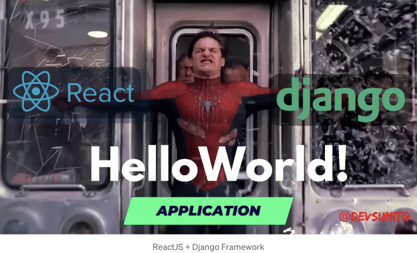
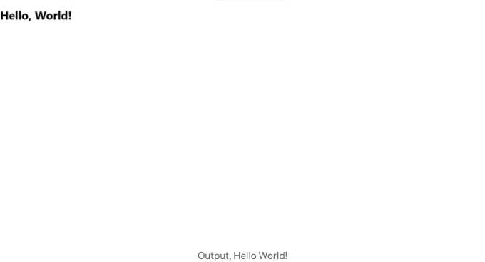

ReactJS는 사용자 인터페이스를 구축하는 데 사용되는 인기있는 JavaScript 라이브러리이며, Django는 웹 애플리케이션을 구축하는 데 널리 사용되는 고수준 Python 웹 프레임워크입니다. 이 두 강력한 도구를 연결하면 견고한 웹 애플리케이션이 생성될 수 있습니다.

이 자습서에서는 간단한 Hello World! 애플리케이션을 사용하여 ReactJS와 Django 프레임워크를 연결하는 단계를 안내합니다.

# 준비물

<!-- ui-log 수평형 -->
<ins class="adsbygoogle"
  style="display:block"
  data-ad-client="ca-pub-4877378276818686"
  data-ad-slot="9743150776"
  data-ad-format="auto"
  data-full-width-responsive="true"></ins>
<component is="script">
(adsbygoogle = window.adsbygoogle || []).push({});
</component>

시작하기 전에 ReactJS와 Django Framework의 기본 지식이 있어야 해요. 또한 노드.js와 파이썬이 컴퓨터에 설치되어 있어야 해요.

[참고: 좋은 가상 환경 사용하기.]

# 단계

## 단계 1: 새로운 Django 프로젝트와 새로운 React 애플리케이션 만들기

<!-- ui-log 수평형 -->
<ins class="adsbygoogle"
  style="display:block"
  data-ad-client="ca-pub-4877378276818686"
  data-ad-slot="9743150776"
  data-ad-format="auto"
  data-full-width-responsive="true"></ins>
<component is="script">
(adsbygoogle = window.adsbygoogle || []).push({});
</component>

첫 번째 단계는 새로운 Django 프로젝트와 새 React 애플리케이션을 생성하는 것입니다.

다음 명령어를 사용하여 Django 프로젝트를 생성할 수 있습니다:

```js
django-admin startproject myproject
```

이렇게 하면 myproject라는 새 디렉토리가 생성되며 Django 프로젝트의 기본 구조가 만들어집니다.

<!-- ui-log 수평형 -->
<ins class="adsbygoogle"
  style="display:block"
  data-ad-client="ca-pub-4877378276818686"
  data-ad-slot="9743150776"
  data-ad-format="auto"
  data-full-width-responsive="true"></ins>
<component is="script">
(adsbygoogle = window.adsbygoogle || []).push({});
</component>

다음으로, 다음 명령어를 사용하여 새로운 React 애플리케이션을 만들 수 있어요:

```js
npx create-react-app myapp
```

## 단계 2: 필요한 패키지 설치하기

프로젝트와 애플리케이션이 생성되면, 몇 가지 패키지를 설치해야 해요. Django를 사용할 경우, Django Rest Framework와 Django Cors Headers를 설치해야 해요. React를 사용할 경우, HTTP 요청을 만들기 위해 Axios를 설치해야 해요.

<!-- ui-log 수평형 -->
<ins class="adsbygoogle"
  style="display:block"
  data-ad-client="ca-pub-4877378276818686"
  data-ad-slot="9743150776"
  data-ad-format="auto"
  data-full-width-responsive="true"></ins>
<component is="script">
(adsbygoogle = window.adsbygoogle || []).push({});
</component>

다음 명령어를 실행하여 Django Rest Framework와 Django Cors Headers를 설치해주세요:

```js
pip install djangorestframework django-cors-headers
```

Axios를 설치하려면, myapp 디렉토리 안에서 다음 명령어를 실행해주세요:

```js
npm install axios
```

<!-- ui-log 수평형 -->
<ins class="adsbygoogle"
  style="display:block"
  data-ad-client="ca-pub-4877378276818686"
  data-ad-slot="9743150776"
  data-ad-format="auto"
  data-full-width-responsive="true"></ins>
<component is="script">
(adsbygoogle = window.adsbygoogle || []).push({});
</component>

## 단계 3: Django에서 API 엔드포인트 구축하기

필요한 패키지를 설치한 후에 Django에서 API 엔드포인트를 구축할 수 있습니다. API 요청을 처리할 새로운 Django 앱을 만들 것입니다. API 엔드포인트는 HTTP 요청이 발생할 때 JSON 데이터를 반환할 것입니다. Django Rest Framework를 사용하여 API 엔드포인트를 구축할 수 있습니다.

새로운 Django 앱을 생성하려면 myproject 디렉토리에서 다음 명령을 실행하세요:

```js
python manage.py startapp myapi
```

<!-- ui-log 수평형 -->
<ins class="adsbygoogle"
  style="display:block"
  data-ad-client="ca-pub-4877378276818686"
  data-ad-slot="9743150776"
  data-ad-format="auto"
  data-full-width-responsive="true"></ins>
<component is="script">
(adsbygoogle = window.adsbygoogle || []).push({});
</component>

다음은 Django 앱의 기본 구조를 갖춘 myapi라는 새 디렉토리를 생성합니다.

그다음, myproject 디렉토리 내의 settings.py 파일을 열고 다음 코드를 추가하세요:

```js
INSTALLED_APPS = [
    # ...
    # 👇 여기에 설치된 앱 추가
    'rest_framework',
    'corsheaders',
    'myapi',
]

MIDDLEWARE = [
    # ...
    # 👇 이 줄 추가
    'corsheaders.middleware.CorsMiddleware',
    # 아래 줄 바로 위에 👇
    'django.middleware.common.CommonMiddleware',
]

# 👇 이 줄 추가
CORS_ORIGIN_ALLOW_ALL = True
```

위 코드는 rest_framework, corsheaders 및 myapi 앱을 INSTALLED_APPS 목록에 추가하고, CorsMiddleware를 MIDDLEWARE 목록에 추가하여 모든 출처에서 교차 출처 요청을 허용합니다.

<!-- ui-log 수평형 -->
<ins class="adsbygoogle"
  style="display:block"
  data-ad-client="ca-pub-4877378276818686"
  data-ad-slot="9743150776"
  data-ad-format="auto"
  data-full-width-responsive="true"></ins>
<component is="script">
(adsbygoogle = window.adsbygoogle || []).push({});
</component>

이제 myapi 디렉토리 내의 views.py 파일을 열어 다음 코드 라인을 추가해주세요:

```python
from django.shortcuts import render
from rest_framework.decorators import api_view
from rest_framework.response import Response

@api_view(['GET'])
def hello_world(request):
    return Response({'message': 'Hello, world!'})
```

이 코드는 "Hello, world!" 메시지를 포함하는 JSON 응답을 반환하는 새 API 엔드포인트를 정의합니다.

URL을 추가하세요:

<!-- ui-log 수평형 -->
<ins class="adsbygoogle"
  style="display:block"
  data-ad-client="ca-pub-4877378276818686"
  data-ad-slot="9743150776"
  data-ad-format="auto"
  data-full-width-responsive="true"></ins>
<component is="script">
(adsbygoogle = window.adsbygoogle || []).push({});
</component>

"myproject" 디렉토리 안의 urls.py 파일을 열어 아래의 코드를 추가해주세요:

```js
from django.contrib import admin
from django.urls import path, include # 👈 이 부분에 include 추가

urlpatterns = [
    path('admin/', admin.site.urls),
    # 👇 여기에 myapi 앱의 urls 경로를 추가해주세요
    path('api/', include('myapi.urls'))
]
```

마지막으로, myapi 디렉토리 안에 urls.py 파일을 생성하고 아래의 코드를 추가해주세요:

```js
from django.urls import path
from . import views

urlpatterns = [
    path('hello-world/', views.hello_world, name='hello_world'),
]
```

<!-- ui-log 수평형 -->
<ins class="adsbygoogle"
  style="display:block"
  data-ad-client="ca-pub-4877378276818686"
  data-ad-slot="9743150776"
  data-ad-format="auto"
  data-full-width-responsive="true"></ins>
<component is="script">
(adsbygoogle = window.adsbygoogle || []).push({});
</component>

이 코드는 views.py 파일의 hello_world 함수에 매핑되는 새 URL 패턴을 정의합니다.

## 단계 4: HTTP 요청을 만드는 React 컴포넌트 생성

다음으로, API 엔드포인트로 HTTP 요청을 만드는 React 컴포넌트를 생성해야 합니다. HTTP 요청을 만들기 위해 Axios를 사용할 것입니다. JSON 데이터를 받은 후 React 컴포넌트를 사용하여 웹 페이지에 데이터를 표시할 수 있습니다.

myapp 디렉토리의 src 디렉토리 안에 HelloWorld.js 파일을 생성하고 다음 코드를 추가하세요:

<!-- ui-log 수평형 -->
<ins class="adsbygoogle"
  style="display:block"
  data-ad-client="ca-pub-4877378276818686"
  data-ad-slot="9743150776"
  data-ad-format="auto"
  data-full-width-responsive="true"></ins>
<component is="script">
(adsbygoogle = window.adsbygoogle || []).push({});
</component>

```js
import React, { useState, useEffect } from 'react';
import axios from 'axios';

function HelloWorld() {
  const [message, setMessage] = useState('');

  useEffect(() => {
    axios.get('http://localhost:8000/api/hello-world/')
      .then(response => {
        setMessage(response.data.message);
      })
      .catch(error => {
        console.log(error);
      });
  }, []);

  return (
    <div>
      <h1>Hello, World!</h1>
      <p>{message}</p>
    </div>
  );
}

export default HelloWorld;
```

이 코드는 HelloWorld라는 새로운 React 컴포넌트를 정의합니다. 이 컴포넌트는 이전에 정의한 hello-world API 엔드포인트로 HTTP GET 요청을 보냅니다. 응답 데이터는 메시지 상태에 저장되어 웹 페이지에 표시됩니다.

## 단계 5: React 컴포넌트 렌더링

마지막으로, myapp 디렉토리의 src 디렉토리 내 App.js 파일 내에서 HelloWorld 컴포넌트를 렌더링해야 합니다. App.js 파일의 내용을 다음 코드로 교체하세요.```

<!-- ui-log 수평형 -->
<ins class="adsbygoogle"
  style="display:block"
  data-ad-client="ca-pub-4877378276818686"
  data-ad-slot="9743150776"
  data-ad-format="auto"
  data-full-width-responsive="true"></ins>
<component is="script">
(adsbygoogle = window.adsbygoogle || []).push({});
</component>

```js
import React from 'react';
import HelloWorld from './HelloWorld';

function App() {
  return (
    <div>
      <HelloWorld />
    </div>
  );
}

export default App;
```

이 코드는 HelloWorld 컴포넌트를 루트 ID를 가진 div 요소 내에서 렌더링합니다.

## 단계 6: 프로젝트 실행하기

프로젝트를 실행하려면 두 개의 터미널 창을 엽니다.

<!-- ui-log 수평형 -->
<ins class="adsbygoogle"
  style="display:block"
  data-ad-client="ca-pub-4877378276818686"
  data-ad-slot="9743150776"
  data-ad-format="auto"
  data-full-width-responsive="true"></ins>
<component is="script">
(adsbygoogle = window.adsbygoogle || []).push({});
</component>

첫 번째 창에서 myproject 디렉토리로 이동하여 다음 명령어를 실행해 주세요:

```js
python manage.py runserver
```

그러면 Django 개발 서버가 시작됩니다.

두 번째 창에서 myapp 디렉토리로 이동하여 다음 명령어를 실행해 주세요:

<!-- ui-log 수평형 -->
<ins class="adsbygoogle"
  style="display:block"
  data-ad-client="ca-pub-4877378276818686"
  data-ad-slot="9743150776"
  data-ad-format="auto"
  data-full-width-responsive="true"></ins>
<component is="script">
(adsbygoogle = window.adsbygoogle || []).push({});
</component>

```js
npm start
```

React 개발 서버가 시작됩니다.

웹 브라우저를 열고 http://localhost:3000/ 으로 이동하세요. 웹 페이지에 "Hello, world!" 메시지가 표시될 것입니다.

결과,

<!-- ui-log 수평형 -->
<ins class="adsbygoogle"
  style="display:block"
  data-ad-client="ca-pub-4877378276818686"
  data-ad-slot="9743150776"
  data-ad-format="auto"
  data-full-width-responsive="true"></ins>
<component is="script">
(adsbygoogle = window.adsbygoogle || []).push({});
</component>



# 결론

ReactJS와 Django 프레임워크를 연결하는 것은 멋진 웹 애플리케이션을 구축하는 강력한 조합일 수 있습니다. 이 튜토리얼에서 안내된 단계를 따라가면 이 두 도구를 연결하고 견고한 웹 애플리케이션을 구축할 수 있습니다. React 앱과 Django API 간의 원활한 통신을 보장하기 위해 필요한 패키지를 설치하고 CORS 오류를 처리해야 합니다.

ReactJS와 Django 프레임워크를 연결하여 시작하는 데 도움이 되는 다양한 튜토리얼과 온라인 자료가 많이 있습니다. 모든 필수 패키지를 설치하는 것을 주의하고 필요한 단계를 주의 깊게 따르는 것이 중요합니다. 또한 교차 출처 요청과 관련된 문제를 피하기 위해 CORS 오류를 처리해야 합니다. 이러한 사항을 염두에 두고 이 두 강력한 도구를 자신있게 연결하여 견고한 웹 애플리케이션을 구축할 수 있습니다.

<!-- ui-log 수평형 -->
<ins class="adsbygoogle"
  style="display:block"
  data-ad-client="ca-pub-4877378276818686"
  data-ad-slot="9743150776"
  data-ad-format="auto"
  data-full-width-responsive="true"></ins>
<component is="script">
(adsbygoogle = window.adsbygoogle || []).push({});
</component>

여기서부터는 Markdown 포맷으로 작성된 표입니다.

| 프론트엔드 | 백엔드 |
| --------- | ------ |
| ReactJS   | Django |

행복한 코딩되세요!

이 블로그에서 제공된 정보에 대한 질문이나 의견이 있으시면 언제든지 연락해 주세요. 읽어 주셔서 다시 한 번 감사드립니다!

Buy Me a Coffee로 후원하시면 개발 지식을 나누는 제 열정을 지원하게 됩니다. 귀하의 기부는 가치 있는 콘텐츠 및 리소스를 만드는 데 도움이 됩니다. 지원해 주셔서 감사합니다!

<!-- ui-log 수평형 -->
<ins class="adsbygoogle"
  style="display:block"
  data-ad-client="ca-pub-4877378276818686"
  data-ad-slot="9743150776"
  data-ad-format="auto"
  data-full-width-responsive="true"></ins>
<component is="script">
(adsbygoogle = window.adsbygoogle || []).push({});
</component>

## 자원

- Django 문서
- React 문서
- Django Rest Framework 문서
- Axios 문서
- Django에서 CORS 처리
- React에서 CORS 처리