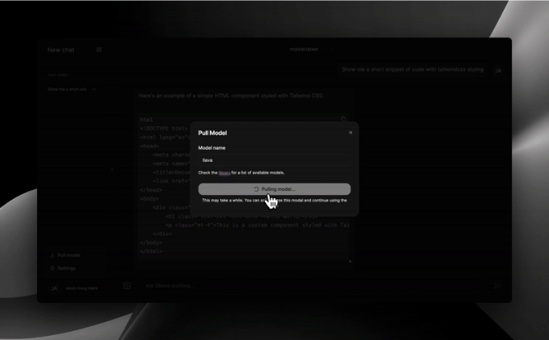

만약 Ollama에 익숙하지 않다면 아마 지역에서 호스팅되는 대형 언어 모델에 대해 들어보지 못했을 것입니다.

Ollama는 정확히 그것을 할 수 있게 해줍니다. 이것은 인기 있는 Mistral과 Llama 2를 포함한 오픈 소스 LLMs를 로컬에서 실행하는 도구입니다. 다양한 모델을 지원하며, AI 애플리케이션을 빌드하는 데 사용할 HTTP 엔드포인트를 제공합니다. OpenAI와 같은 방식으로 사용할 수 있지만, 기본적으로 무료로 제공됩니다.

이 안내서는 귀하의 LLM 모델과 함께 사용할 수 있는 자체 호스팅된 ChatGPT 스타일 프론트엔드 애플리케이션을 설정하는 가장 쉽고 편리한 방법을 제공합니다.

<!-- ui-log 수평형 -->
<ins class="adsbygoogle"
  style="display:block"
  data-ad-client="ca-pub-4877378276818686"
  data-ad-slot="9743150776"
  data-ad-format="auto"
  data-full-width-responsive="true"></ins>
<component is="script">
(adsbygoogle = window.adsbygoogle || []).push({});
</component>

Ollama를 설치하고 로컬 머신에 실행하거나 호스팅해야 합니다.

그런 다음, 해당 Next.js 저장소를 Vercel에서 설정하기만 하면 됩니다. 여기를 클릭하면 약 2분 정도 소요됩니다!
작업을 완료한 후에는 사이트가 본인의 Ollama 인스턴스에 액세스할 수 있도록 환경 변수를 설정해야 합니다:

```js
OLLAMA_ORIGINS="https://your-app.vercel.app/"
```

이렇게하면 LLM 모델을 사용할 수 있는 자체 웹 UI를 호스팅할 수 있습니다!