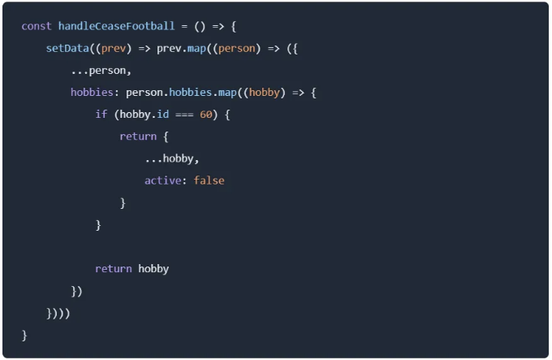

또는 상태 관리에서 왜 중요한지 😊


안녕하세요 여러분, 이번 글에서는 기본적인 내용 같지만 가끔은 베테랑 개발자도 때로는 이에 대해 어려움을 겪을 수 있어요 (예: 아이들 때문에 수면 부족이거나 Baldur's Gate III나 Helldivers II를 하느라).

일반적으로 불변성이란 무엇인지, 상태 관리에서 어떻게 나타나며 어떻게 활용할 수 있는지 살펴볼 거에요.

<!-- ui-log 수평형 -->
<ins class="adsbygoogle"
  style="display:block"
  data-ad-client="ca-pub-4877378276818686"
  data-ad-slot="9743150776"
  data-ad-format="auto"
  data-full-width-responsive="true"></ins>
<component is="script">
(adsbygoogle = window.adsbygoogle || []).push({});
</component>

기사를 마치면, 이 주제의 진정한 전문가가 되셨으면 좋겠습니다.

## 불변성이란 무엇인가요?

불변성(Immutability)은 특정 데이터나 객체가 생성된 후에는 변경되지 않는 소프트웨어 개발 개념을 가리킵니다. 다시 말해, 불변성은 데이터나 객체가 한 번 생성되고 나면 변경되지 않는 속성입니다.

## 자바스크립트에서 불변성은 어떻게 나타나며, 어디에서 마주치게 되나요?

<!-- ui-log 수평형 -->
<ins class="adsbygoogle"
  style="display:block"
  data-ad-client="ca-pub-4877378276818686"
  data-ad-slot="9743150776"
  data-ad-format="auto"
  data-full-width-responsive="true"></ins>
<component is="script">
(adsbygoogle = window.adsbygoogle || []).push({});
</component>

JavaScript에서는 변경할 수 없는 타입(원시 타입)이 있습니다. JavaScript에는 심지어 타입이 없다고 할 수 있지만, 이는 완전히 틀린 말입니다!

동적으로 타입이 지정되는 언어임에도 불구하고 JavaScript에는 타입이 있으며 변수는 담을 내용을 명시할 필요가 없습니다 (dy-na-mic).

typeof 연산자는 각 값의 타입을 알려줍니다. JavaScript 원시 데이터 타입의 경우, 속성에 액세스하려고 할 때 auto-boxing이 발생하여 해당 래퍼 클래스로 래핑되어 해당 특성 속성을 활용할 수 있게 됩니다.

# 함께 살펴보죠!

<!-- ui-log 수평형 -->
<ins class="adsbygoogle"
  style="display:block"
  data-ad-client="ca-pub-4877378276818686"
  data-ad-slot="9743150776"
  data-ad-format="auto"
  data-full-width-responsive="true"></ins>
<component is="script">
(adsbygoogle = window.adsbygoogle || []).push({});
</component>

```markdown


실패해요; 원래의 문자열이 그대로 남아 있어요.

# 그렇다면 데이터 변이는 어떻게 발생할까요?

아래에 객체로 표현된 내 작은 것부터 시작해봅시다.
```

<!-- ui-log 수평형 -->
<ins class="adsbygoogle"
  style="display:block"
  data-ad-client="ca-pub-4877378276818686"
  data-ad-slot="9743150776"
  data-ad-format="auto"
  data-full-width-responsive="true"></ins>
<component is="script">
(adsbygoogle = window.adsbygoogle || []).push({});
</component>

```markdown


하지만 할머니는 아기를 "Haultsy"라고 불러요 (완전 오해, 말할 가치가 없어요). 코드에서는:


아내가 집에 오자 아이의 이름이 바뀐 것을 발견해요.
```

<!-- ui-log 수평형 -->
<ins class="adsbygoogle"
  style="display:block"
  data-ad-client="ca-pub-4877378276818686"
  data-ad-slot="9743150776"
  data-ad-format="auto"
  data-full-width-responsive="true"></ins>
<component is="script">
(adsbygoogle = window.adsbygoogle || []).push({});
</component>


그리고 그녀의 당황이 시작되었습니다 (비록 그녀는 매우 똑똑하고 아름답고 모든 면에서 훌륭하지만 ^^). 그럼에도 불구하고 모든 것이 발생한 것은, JS에서 비원시형의 경우 값이 참조로 전달되고 의도치 않게 우리가 아기의 이름을 변경해 버렸다는 것입니다. 더는 그를 알아볼 수 없게 되었어요 😊.

이를 바탕으로 React 상태를 변이할 때 무엇이 일어나는지에 대해 논의하며, 이어서 우리의 기사의 다음 단계로 진행할 수 있습니다.

# 어떻게 변이를 방지할 수 있을까요?

<!-- ui-log 수평형 -->
<ins class="adsbygoogle"
  style="display:block"
  data-ad-client="ca-pub-4877378276818686"
  data-ad-slot="9743150776"
  data-ad-format="auto"
  data-full-width-responsive="true"></ins>
<component is="script">
(adsbygoogle = window.adsbygoogle || []).push({});
</component>

- JSON parse 및 stringify 메서드를 사용하면 됩니다

위에서 언급했듯이, JavaScript 기본 데이터 유형은 변경할 수 없습니다. 따라서 먼저 JSON.stringify를 사용하여 객체를 문자열로 변환한 다음, 다시 구문 분석하여 결과를 변수에 저장하는 것이 논리적인 선택일 것입니다.

우리의 경우에는 다음과 같이 보일 것입니다:


<!-- ui-log 수평형 -->
<ins class="adsbygoogle"
  style="display:block"
  data-ad-client="ca-pub-4877378276818686"
  data-ad-slot="9743150776"
  data-ad-format="auto"
  data-full-width-responsive="true"></ins>
<component is="script">
(adsbygoogle = window.adsbygoogle || []).push({});
</component>

당신은 "Alex"라는 결과를 얻습니다.

2. Object.assign 메소드 사용

2와 3의 경우 object를 참조로 다루는 것을 피하기 위해, 새로운 object를 만들어 변수에 저장한 다음 수정합니다.


<!-- ui-log 수평형 -->
<ins class="adsbygoogle"
  style="display:block"
  data-ad-client="ca-pub-4877378276818686"
  data-ad-slot="9743150776"
  data-ad-format="auto"
  data-full-width-responsive="true"></ins>
<component is="script">
(adsbygoogle = window.adsbygoogle || []).push({});
</component>

우리는 "Alex"를 얻게 됩니다.

Object.assign은 첫 번째 매개변수로 생성된 빈 객체에 두 번째 매개변수를 복사하여 원하는 효과를 얻습니다: 새 객체를 만들고 해당 "name" 속성만 수정하는 것입니다.

3. 전개 연산자 사용

2번 항목에서 설명한 효과는 전개 연산자를 사용하여 동일하게 달성할 수 있습니다.

<!-- ui-log 수평형 -->
<ins class="adsbygoogle"
  style="display:block"
  data-ad-client="ca-pub-4877378276818686"
  data-ad-slot="9743150776"
  data-ad-format="auto"
  data-full-width-responsive="true"></ins>
<component is="script">
(adsbygoogle = window.adsbygoogle || []).push({});
</component>

다시 결과는 "Alex"입니다.

새 객체를 생성하고 그 안에 baby 객체의 내용을 복사합니다.

주의:

<!-- ui-log 수평형 -->
<ins class="adsbygoogle"
  style="display:block"
  data-ad-client="ca-pub-4877378276818686"
  data-ad-slot="9743150776"
  data-ad-format="auto"
  data-full-width-responsive="true"></ins>
<component is="script">
(adsbygoogle = window.adsbygoogle || []).push({});
</component>

2. **구조 복제 사용**

아직 상대적으로 새로운 글로벌 함수인 structuredClone()을 사용하면 주어진 객체의 깊은 복제를 생성하여 이 문제를 해결하는 것이 쉽습니다.

<!-- ui-log 수평형 -->
<ins class="adsbygoogle"
  style="display:block"
  data-ad-client="ca-pub-4877378276818686"
  data-ad-slot="9743150776"
  data-ad-format="auto"
  data-full-width-responsive="true"></ins>
<component is="script">
(adsbygoogle = window.adsbygoogle || []).push({});
</component>

이제 확인해 봅시다:


다시 "Alex"가 출력됩니다.

이제 데이터가 여러 계층에 중첩되어 있을 때 모든 것이 괜찮습니다. 이제 그들 사이에 참조가 없습니다; 새로운 객체 인스턴스가 생성되었습니다.

<!-- ui-log 수평형 -->
<ins class="adsbygoogle"
  style="display:block"
  data-ad-client="ca-pub-4877378276818686"
  data-ad-slot="9743150776"
  data-ad-format="auto"
  data-full-width-responsive="true"></ins>
<component is="script">
(adsbygoogle = window.adsbygoogle || []).push({});
</component>

5. 불변성 라이브러리 사용

만약 우리의 JavaScript 패키지 크기를 약간 늘릴 수 있고 팀원들이 사용 방법을 배우는 것에 동의한다면, 불변성 라이브러리 사용이 유용한 해결책이 될 수 있습니다.

불변성 라이브러리를 사용하면 이러한 종류의 문제를 해결할 수 있습니다.

# React 상태 관리에서의 불변성 문제: 실제 예제

<!-- ui-log 수평형 -->
<ins class="adsbygoogle"
  style="display:block"
  data-ad-client="ca-pub-4877378276818686"
  data-ad-slot="9743150776"
  data-ad-format="auto"
  data-full-width-responsive="true"></ins>
<component is="script">
(adsbygoogle = window.adsbygoogle || []).push({});
</component>

실용적인 예제가 소설 형식으로 설명하는 것보다 더 도움이 될 것이라고 믿습니다. 다음 코드로 문제를 설명해 보겠습니다.

```markdown

```

# 코드 검토

코드를 검토하면 컴포넌트의 상태를 initialState 변수 (객체 배열)의 내용으로 초기화하는 것을 볼 수 있습니다.

<!-- ui-log 수평형 -->
<ins class="adsbygoogle"
  style="display:block"
  data-ad-client="ca-pub-4877378276818686"
  data-ad-slot="9743150776"
  data-ad-format="auto"
  data-full-width-responsive="true"></ins>
<component is="script">
(adsbygoogle = window.adsbygoogle || []).push({});
</component>

"표시"하는 데이터와 함께 세 개의 버튼이 있는 pre 태그가 있습니다.

- 첫 번째 버튼은 하드코딩된 사람을 저장된 상태에 추가합니다.
- 두 번째 버튼은 모든 사람의 축구 활동을 false로 설정합니다.
- 세 번째 버튼을 사용하여 상태를 initialState 변수의 내용으로 재설정하여 초기 상태로 되돌릴 수 있습니다.

# 사용 및 결론 도출

먼저 "표시"에서 두 명의 사람이 있는 것을 볼 수 있습니다. 첫 번째 버튼을 누른 후 상태에 세 명이 있는 것을 확인할 수 있습니다. 주의 깊게 검토하면, Andrew와 John 두 명이 축구를 취미로 삼고 있음을 알 수 있습니다.

<!-- ui-log 수평형 -->
<ins class="adsbygoogle"
  style="display:block"
  data-ad-client="ca-pub-4877378276818686"
  data-ad-slot="9743150776"
  data-ad-format="auto"
  data-full-width-responsive="true"></ins>
<component is="script">
(adsbygoogle = window.adsbygoogle || []).push({});
</component>

그럼 두 번째 ("축구 중단") 버튼을 클릭합니다. 기대대로 "표시"에서 취미가 축구인 사람들의 활동이 false로 변경되었다는 것을 볼 수 있어요.

마지막으로 "상태 재설정" 버튼을 눌러 기본 상태로 돌아가려고 하지만, 기대했던대로 일어나지 않았어요. 초기 상태가 복원되지 않았죠.

# 수정 방법

문제가 발생한 handleCeaseFootball 함수에서 정확히 축구 취미 활동을 false로 설정할 때 (hobby.active = false) 발생한 것은 비밀이 아니에요. 이 작업으로 우리는 hobbies 배열을 직접 변이시켰습니다.

<!-- ui-log 수평형 -->
<ins class="adsbygoogle"
  style="display:block"
  data-ad-client="ca-pub-4877378276818686"
  data-ad-slot="9743150776"
  data-ad-format="auto"
  data-full-width-responsive="true"></ins>
<component is="script">
(adsbygoogle = window.adsbygoogle || []).push({});
</component>

이전에 언급했던 대로, 여러 해결책이 있습니다. 여기에서는 전개 연산자를 사용한 해결책 하나를 제시합니다.



우리는 사람들과 그들의 취미를 얕은 복사합니다. 이를 통해 데이터 변이 없이 코드가 올바르게 작동되도록 했습니다.

# 결론

<!-- ui-log 수평형 -->
<ins class="adsbygoogle"
  style="display:block"
  data-ad-client="ca-pub-4877378276818686"
  data-ad-slot="9743150776"
  data-ad-format="auto"
  data-full-width-responsive="true"></ins>
<component is="script">
(adsbygoogle = window.adsbygoogle || []).push({});
</component>

요약하자면, 이 기사는 JavaScript와 React 개발에서 불변성 개념과 그 중요성을 철저히 논의했습니다. 실제 예시를 통해 잠재적인 문제점과 그 가능한 해결책을 설명했습니다. React 상태 관리에서 함정을 피하는 방법과 올바르게 처리하는 방법을 자세히 살펴보았습니다. 

우리는 기사에서 제공된 정보가 불변성의 중요성과 실용적인 적용에 대해 이해하는 데 도움이 되기를 바라며, 여기 제시된 예시와 팁이 React 상태를 효과적으로 관리하는 데 도움이 되어 코드의 안정성과 가독성을 향상시키기를 기대합니다.