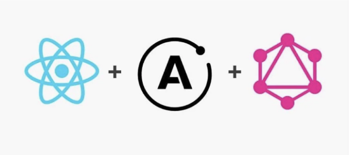

Apollo Client은 포괄적인 GraphQL 클라이언트 및 상태 관리 라이브러리입니다. React 애플리케이션 전반에 걸쳐 React의 context와 hooks로 통합되어 자주 사용됩니다.

저는 Apollo를 사용하여 React 애플리케이션을 설정하는 방법에 대해 자세히 다루지 않겠습니다. 이에 관한 자세한 정보는 Apollo의 공식 문서에서 확인하실 수 있습니다. 그러나 여기서 주목할 부분은 이 통합의 가장 많이 사용되는 부분인 Apollo의 useQuery 훅입니다.

이 기사에서 다룰 주제는 다음과 같습니다:

<!-- ui-log 수평형 -->
<ins class="adsbygoogle"
  style="display:block"
  data-ad-client="ca-pub-4877378276818686"
  data-ad-slot="9743150776"
  data-ad-format="auto"
  data-full-width-responsive="true"></ins>
<component is="script">
(adsbygoogle = window.adsbygoogle || []).push({});
</component>

- 표면적으로 무엇을 하는가
- 내부에서 어떤 작업을 하는가
- 서버 측 렌더링 중에 어떻게 사용되는가

이 훅의 힘을 완전히 이해할 수 있기를 기대합니다.

## useQuery는 무엇을 하는가?

useQuery는 우리가 React 컴포넌트 내에서 구현할 수 있는 React 훅입니다. 주요 용도는 전달된 graphQL 쿼리를 실행하는 것입니다.

<!-- ui-log 수평형 -->
<ins class="adsbygoogle"
  style="display:block"
  data-ad-client="ca-pub-4877378276818686"
  data-ad-slot="9743150776"
  data-ad-format="auto"
  data-full-width-responsive="true"></ins>
<component is="script">
(adsbygoogle = window.adsbygoogle || []).push({});
</component>

예시는 다음과 같습니다:

```js
import { gql, useQuery } from '@apollo/client'

export const GET_CART = gql`
  query GetShoppingCart {
    cart {
      total
      numberOfItems
    }
  }
`;

function ShoppingCart() {
  const { loading, data, error } = useQuery(GET_CART);

  if (loading) {
    return <p>Loading cart...</p>
  }

  return (
    <div>
      <p>Total: ${data.cart.total}</p>
      <p>{data.cart.numberOfItems} in cart</p>
    </div>
  )
}
```

ShoppingCart 컴포넌트가 렌더링되면 useQuery가 실행되어 쿼리를 실행하고 api에 요청을 보냅니다. 응답을 받으면 loading, error 및 data 값을 포함한 객체가 반환됩니다. 이 값들은 요청의 수명 주기에 따라 변경됩니다. 최초에 loading은 true로 설정되어 응답이 돌아올 때까지 기다립니다. 응답이 돌아오면 data 객체에 원래 쿼리에서 요청한 데이터가 채워집니다.

Apollo의 강력한 기능 중 하나는 캐시입니다. useQuery를 통해 데이터를 받으면 클라이언트 내부에 자동으로 이를 캐시합니다. 이후 동일한 쿼리의 실행은 캐시에서 결과를 가져올 수 있습니다. Apollo 클라이언트의 기본 fetch 정책은 cache-first입니다. fetch 정책에 대해 더 자세히 알아보려면 공식 문서를 참조하실 수 있습니다.

<!-- ui-log 수평형 -->
<ins class="adsbygoogle"
  style="display:block"
  data-ad-client="ca-pub-4877378276818686"
  data-ad-slot="9743150776"
  data-ad-format="auto"
  data-full-width-responsive="true"></ins>
<component is="script">
(adsbygoogle = window.adsbygoogle || []).push({});
</component>

주문 내역을 이미 가져온 쇼핑 카트 컴포넌트가 있다고 가정합니다. 후속 컴포넌트가 동일한 데이터를 요청하면, 이번에는 데이터가 외부 API가 아닌 캐시에서 액세스됩니다.

```js
import { gql, useQuery } from '@apollo/client'

// 쇼핑 카트 컴포넌트에서 사용된 동일한 쿼리
const GET_CART = gql`
  query GetShoppingCart {
    cart {
      numberOfItems
    }
  }
`;

function CheckoutButton() {
  const { data } = useQuery(GET_CART);

  if (data.cart.numberOfItems > 0) {
    return <button>장바구니 체크아웃</button>
  }

  return <p>장바구니에 상품을 추가하여 결제하세요</p>
}
```

기본적으로 useQuery는 Graphql 쿼리를 가져오고 캐시를 통해 최적화 수준을 활성화하는 리액트 훅 접근 방식입니다. 그런데 여기에서 끝내기 전에 좀 더 탐구해야 할 기능이 있습니다...

## 캐시 업데이트 구독하기

<!-- ui-log 수평형 -->
<ins class="adsbygoogle"
  style="display:block"
  data-ad-client="ca-pub-4877378276818686"
  data-ad-slot="9743150776"
  data-ad-format="auto"
  data-full-width-responsive="true"></ins>
<component is="script">
(adsbygoogle = window.adsbygoogle || []).push({});
</component>

명시적으로 Graphql 쿼리를 가져오는 것 외에도 useQuery 훅은 Apollo 캐시의 해당 부분을 구독하고 미래 업데이트를 '청취'합니다.

예를 들어, 쇼핑 카트에 제품을 추가하는 기능이 있을 수 있습니다. 이 동작은 쇼핑 카트 총액과 항목 수가 증가하는 결과를 낳게 됩니다.

간단한 제품 컴포넌트는 다음과 같이 보일 수 있습니다:

```js
import { gql, useMutation } from "@apollo/client";

const ADD_PRODUCT = gql`
 mutation AddToCart($product: String) {
  addProduct(product: $product) {
   product
  }
 }
`;

export function Product({ product }) {
 const [addProduct, { data, loading }] = useMutation(ADD_PRODUCT);

 return (
  <div>
   <h3>{product.title}</h3>
   <p>${product.price}</p>
   { loading && <p>Adding product</p>}
   <button
    onClick={() => addProduct({ variables: { product: product.id } })}
   >
    Add to cart
   </button>
  </div>
 );
}
```

<!-- ui-log 수평형 -->
<ins class="adsbygoogle"
  style="display:block"
  data-ad-client="ca-pub-4877378276818686"
  data-ad-slot="9743150776"
  data-ad-format="auto"
  data-full-width-responsive="true"></ins>
<component is="script">
(adsbygoogle = window.adsbygoogle || []).push({});
</component>

우리는 백엔드 데이터를 수정할 때 뮤테이션(mutations)을 사용할 수 있고, 리액트 환경에서는 useMutation 훅을 활용할 수 있어요. 이 글에서는 뮤테이션에 대해 자세히 다루지 않겠지만, Apollo 문서에서 더 많은 정보를 찾아볼 수 있어요.

저희의 제품 컴포넌트는 "장바구니에 추가" 버튼을 도입하는데, 사용자가 클릭하면 백엔드 API에서 뮤테이션을 실행하여 특정 제품을 1개씩 늘릴 거에요.

백엔드를 수정하고 쇼핑 카트를 업데이트했으니, 로컬로 캐시된 카트 데이터를 업데이트하고 싶어요. 이를 위한 몇 가지 방법이 있는데, 뮤테이션 응답을 사용하여 캐시를 직접 업데이트하는 것이 있습니다. 가장 간단한 방법(적어도 처음에는)은 뮤테이션으로 영향을 받을 수 있는 특정 쿼리를 다시 가져오도록 하는 것이 될 수 있어요.

AddToCart 뮤테이션에서 refetchQueries 배열에 우리의 GetShoppingCart 쿼리를 포함시킴으로써 이를 구현할 수 있어요:

<!-- ui-log 수평형 -->
<ins class="adsbygoogle"
  style="display:block"
  data-ad-client="ca-pub-4877378276818686"
  data-ad-slot="9743150776"
  data-ad-format="auto"
  data-full-width-responsive="true"></ins>
<component is="script">
(adsbygoogle = window.adsbygoogle || []).push({});
</component>

```js
const [addProduct, { data, loading }] = useMutation(ADD_PRODUCT, {
  refetchQueries: [GET_CART]
);
```

이제 제품을 추가하여 장바구니를 뮤테이션할 때 업데이트된 장바구니 데이터를 다시 가져옵니다.

UI에서 이 동작을 관찰할 때 장바구니가 업데이트되면 ShoppingCart 컴포넌트에서도 총합이 업데이트됩니다.

상품 컴포넌트가 상호작용할 때 ShoppingCart 컴포넌트가 어떻게 업데이트되는지 궁금하신가요? useQuery가 바로...```

<!-- ui-log 수평형 -->
<ins class="adsbygoogle"
  style="display:block"
  data-ad-client="ca-pub-4877378276818686"
  data-ad-slot="9743150776"
  data-ad-format="auto"
  data-full-width-responsive="true"></ins>
<component is="script">
(adsbygoogle = window.adsbygoogle || []).push({});
</component>

## 옵저버블

useQuery는 내부적으로 Apollo의 watchQuery 함수를 사용합니다. 이 함수는 useQuery에 전달한 쿼리에 의해 설정된 Apollo 캐시 부분을 '감시'합니다. 이 과정은 옵저버블 쿼리를 반환합니다.

옵저버블 쿼리를 사용하면 Apollo 캐시 내에서 변경 사항을 반응적으로 구독할 수 있습니다. 이는 캐시의 해당 부분이 업데이트될 때 옵저버블 쿼리가 해당 업데이트에 대해 통지받게 됨을 의미합니다.

따라서 쇼핑 카트 컴포넌트에서 useQuery를 다음과 같이 추가할 때...

<!-- ui-log 수평형 -->
<ins class="adsbygoogle"
  style="display:block"
  data-ad-client="ca-pub-4877378276818686"
  data-ad-slot="9743150776"
  data-ad-format="auto"
  data-full-width-responsive="true"></ins>
<component is="script">
(adsbygoogle = window.adsbygoogle || []).push({});
</component>

```js
const GET_CART = gql`
  query GetShoppingCart {
    cart {
      numberOfItems
    }
  }
`;

function CheckoutButton() {
  const { data } = useQuery(GET_CART);

  ....
}
```

useQuery 훅이 하는 일을 살펴보면...

```js
const GET_CART = gql`
  query GetShoppingCart {
    cart {
      numberOfItems
    }
  }
`;

// 옵저버블 쿼리 생성
const observableQuery = client.watchQuery({query: GET_CART});

// 구독 생성
observableQuery.subscribe({
  next: ({ data } => {
    // 반환된 데이터로 무언가 작업 처리
  }
});
```

이렇게 하면 캐시의 특정 부분에 대한 구독이 생성됩니다.

<!-- ui-log 수평형 -->
<ins class="adsbygoogle"
  style="display:block"
  data-ad-client="ca-pub-4877378276818686"
  data-ad-slot="9743150776"
  data-ad-format="auto"
  data-full-width-responsive="true"></ins>
<component is="script">
(adsbygoogle = window.adsbygoogle || []).push({});
</component>

이제 AddToCart 뮤테이션이 발생할 때, 장바구니에 있는 총 수량과 항목 수를 업데이트하면 다음과 같은 일이 발생합니다:

- Apollo 캐시에서 numberOfItems와 total 필드가 새 값으로 업데이트 됩니다.
- 이전에 생성된 구독이 캐시 내의 장바구니 데이터 변경을 통지 받습니다.
- ShoppingCart 컴포넌트에서 구현된 useQuery가 반응하여 새 값들을 구성 요소 내에서 사용할 수 있게 반환합니다.
- ShoppingCart 컴포넌트가 새 값으로 다시 렌더링됩니다.

구독을 관리할 때 사용 중이 아닌 구독을 정리해야 할 때가 있습니다. 그러나 useQuery가 이를 자동으로 처리해 줍니다. 내부적으로 구독 수명주기를 관리하므로 신경 쓸 필요가 없습니다!

멋지죠? 보통은 단순한 훅이라고 생각되지만 실제로는 중요한 기능을 제공합니다. 하지만 마지막으로 끝내기 전에 더 해야 할 일이 있습니다...

<!-- ui-log 수평형 -->
<ins class="adsbygoogle"
  style="display:block"
  data-ad-client="ca-pub-4877378276818686"
  data-ad-slot="9743150776"
  data-ad-format="auto"
  data-full-width-responsive="true"></ins>
<component is="script">
(adsbygoogle = window.adsbygoogle || []).push({});
</component>

## 서버 사이드 렌더링 중 useQuery 사용

서버에서는 일부 세부 사항이 여기에 설명된 것처럼 약간 다른 Apollo Client의 새 인스턴스를 초기화해야 하지만, 우리의 응용 프로그램 코드는 대부분 동일합니다.

Apollo는 서버에서 필요한 리액트 트리로 렌더링하는 데 실행해야 할 쿼리를 이해해야 합니다. 다시 말해, 여기에서 useQuery가 필요한 것입니다.

서버 렌더링 시 다음 단계가 진행됩니다:

<!-- ui-log 수평형 -->
<ins class="adsbygoogle"
  style="display:block"
  data-ad-client="ca-pub-4877378276818686"
  data-ad-slot="9743150776"
  data-ad-format="auto"
  data-full-width-responsive="true"></ins>
<component is="script">
(adsbygoogle = window.adsbygoogle || []).push({});
</component>

- Apollo은 애플리케이션의 React 트리를 탐색하여 useQuery로 생성된 모든 GraphQL 쿼리를 수집합니다. 이를 통해 Apollo는 렌더링을 충족하기 위해 가져와야 하는 쿼리를 이해합니다.
- 이는 모든 이러한 쿼리가 응답을 반환할 때까지 해결되는 프라미스를 반환합니다.
- 프라미스가 해결되면 구성 요소에 필요한 모든 데이터가 사용 가능한 것을 의미합니다.
- 그런 다음 React DOM의 renderToString 메서드(또는 비슷한 대체 방법)를 사용하여 구성 요소를 문자열로 렌더링하고 이를 사용자에게 전달할 수 있습니다.

컴포넌트에 console.log()를 추가하면 컴포넌트가 두 번 실행될 것으로 보일 수 있습니다. 이는 Apollo가 취하는 2단계 접근 방식을 강조합니다. 먼저 컴포넌트를 돌아다니며 쿼리를 수집하고, 두 번째로 필요한 데이터로 컴포넌트를 렌더링하는 것입니다. 두 번째 단계가 사용자에게 전달되는 UI를 생성하는 과정입니다.

React 애플리케이션에서 이 능력은 Apollo의 renderToStringWithData 함수에 따라 달라집니다. 이 함수는 React 컴포넌트 트리를 가져와 어떤 쿼리를 실행할지 결정하고, 그 쿼리를 가져와 결과를 클라이언트에 렌더링하기 위해 renderToString을 사용합니다.

이런 식으로 보입니다…

<!-- ui-log 수평형 -->
<ins class="adsbygoogle"
  style="display:block"
  data-ad-client="ca-pub-4877378276818686"
  data-ad-slot="9743150776"
  data-ad-format="auto"
  data-full-width-responsive="true"></ins>
<component is="script">
(adsbygoogle = window.adsbygoogle || []).push({});
</component>

```js
import express from 'express';
import React from 'react';
import { ApolloProvider, ApolloClient } from '@apollo/client';
import { renderToStringWithData } from '@apollo/client/react/ssr';
import ReactDOMServer from 'react-dom/server';

const app = express();

app.get('/', async (req, res) => {
  const client = new ApolloClient(...) // Apollo Client 인스턴스 생성

  const App = (
    <ApolloProvider client={client}>
      <Application />
    </ApolloProvider>
  );

  try {
    // renderToStringWithData를 사용하여 데이터를 포함한 컴포넌트를 HTML로 렌더링
    const content = await renderToStringWithData(App);

    // 렌더링된 HTML을 클라이언트로 보냄
    res.send(`
      <html>
        <head>
          <title>SSR with Apollo</title>
        </head>
        <body>
          <main>${content}</main>
        </body>
      </html>
    `);
  } catch (error) {
    res.status(500).send('서버 내부 오류');
  }
});
```

다시 한 번 말씀드리지만, useQuery는 React 애플리케이션을 서버 렌더링하는 과정에서 중요한 구성 요소입니다.

## 요약

여기서 확인할 수 있듯이, useQuery는 Graphql 쿼리를 가져오는 것 이상의 기능을 제공합니다. 실제로 React/Apollo 애플리케이션을 구축하는 동안 많은 기능을 단순히 사용할 뿐입니다.```

<!-- ui-log 수평형 -->
<ins class="adsbygoogle"
  style="display:block"
  data-ad-client="ca-pub-4877378276818686"
  data-ad-slot="9743150776"
  data-ad-format="auto"
  data-full-width-responsive="true"></ins>
<component is="script">
(adsbygoogle = window.adsbygoogle || []).push({});
</component>

희망적으로 이 기사가 useQuery가 이를 어떻게 달성하는지에 대한 조금 더 통찰력을 제공해줄 것입니다.

# Stackademic 🎓

끝까지 읽어 주셔서 감사합니다. 떠나시기 전에:

- 저자를 응원하고 팔로우하는 것을 고려해주세요! 👏
- 팔로우하기 X | LinkedIn | YouTube | Discord
- 다른 플랫폼 방문: In Plain English | CoFeed | Venture | Cubed
- Stackademic.com에서 더 많은 콘텐츠를 확인해보세요.