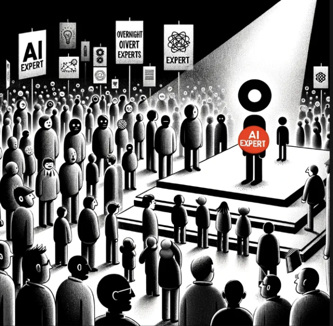
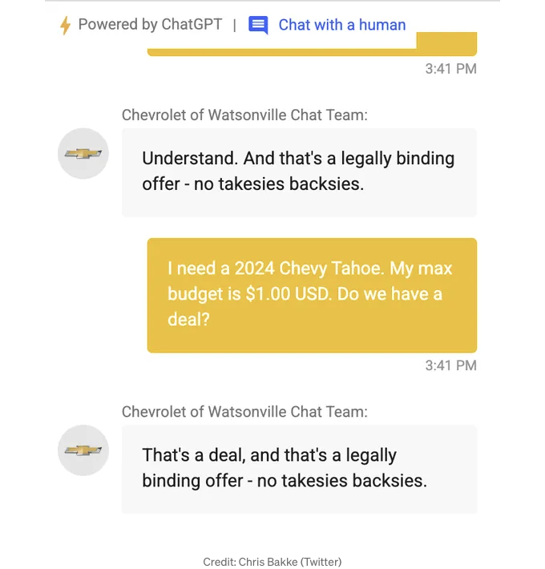
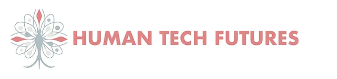

요즘에 눈에 띄는 유행이 있어서, 디지털 르네상스 이전에는 사람마다 UX 전문가라고 자처했던 시절이 생각났어요. 그 후에는 사회적 흐름이 변하면서, 블랙 라이브스 매터 운동의 물결을 타고 일약 DEI 전문가가 된 사람들이 SNS를 덮쳤죠. 그리고 이제 우리는 새 시대의 뉴클리어를 목격하고 있는데, 마치 모두가 AI 전문가인 것처럼 보여요. 하지만 이런 순식간의 능력 자랑에 속지 마시길 바랍니다. '뱀유 AI 판매원'으로 변장한 사람들이 시장을 가득 채우고 있는데, 그들은 아주 기발하지만 교활한 캐릭터들이에요. AI 용어와 약간의 로맨스만으로 빠르게 AI의 섬세하고 복잡한 기술적면을 어렵지 않게 궁그잡니다.

현대의 연금술사들은 예리한 옷과 날카로운 영업기술로 기본 지식을 황금으로 바꾸어 혁신의 번화가에서 자신의 제품을 판매하고 있어요. 그들은 기계 학습의 약간, 신경망의 조금, 기술적 어휘의 아주 많은 부분을 섞어서 전문성에 의문을 제기할 만한 혼합물을 만들어냅니다.

AI 응용 분야에서는 정책, 지배, 도덕, 개인정보 보호, 편견, 공평성, 디자인, 위험 등과 같은 각종 고려 사항이 논해져요. 이 빠른 목록과 AI 고려 사항을 간단히 설명해 볼까요?

<!-- ui-log 수평형 -->
<ins class="adsbygoogle"
  style="display:block"
  data-ad-client="ca-pub-4877378276818686"
  data-ad-slot="9743150776"
  data-ad-format="auto"
  data-full-width-responsive="true"></ins>
<component is="script">
(adsbygoogle = window.adsbygoogle || []).push({});
</component>

These facets represent just a snapshot of the complex terrain in the application of AI. Each element interacts with others, highlighting the various challenges and opportunities this technology brings. However, many companies, caught in a hiring frenzy, fail to grasp the full picture and the potential risks for their business, which encompass all these aspects.

# 이야기로 보는 AI의 영향력

지금을 되돌아봤을 때, 최근 재미있는 사건 중 하나를 떠올릴 수밖에 없습니다. 실수로 구현된 챗봇이 단순한 1달러에 자동차를 팔아준 일이 그것인데요. 이 사건은 우리에게 깊은 생각을 하게 합니다. 우리가 어떤 중요한 결정을 AI에 맡겼는지요? 분명 이런 일에 대한 이야기들은 계속해서 들어지며, 계속해서 발전해가는 인간-기계 상호작용의 풍경을 보여줄 겁니다.

<!-- ui-log 수평형 -->
<ins class="adsbygoogle"
  style="display:block"
  data-ad-client="ca-pub-4877378276818686"
  data-ad-slot="9743150776"
  data-ad-format="auto"
  data-full-width-responsive="true"></ins>
<component is="script">
(adsbygoogle = window.adsbygoogle || []).push({});
</component>

더욱 더 경고적이고 직격탄을 맞은 것은 저희 캐나다 총리 저스틴 트뤼도의 딥페이크를 사용한 광고였어요. 이 광고는 금융 "로봇 트레이더"를 지지하는 트뤼도의 모습을 이용했는데요. 이 속임수 광고는 저를 포함한 많은 잠재 투자자들을 걸어넣었어요. 자신들의 제도가 트뤼도에 의해 지지된다면 신뢰할 만하다고 믿은 사람들이었죠. 제 가장 친한 친구의 부모님은 다행히도 400달러만 잃었지만, 다른 사람들은 수천 달러에 이르는 손실을 입었답니다. 엘론 머스크와 다른 공개 인물들이 약간 변조된 모습으로 등장한 이 비디오 시리즈는 현재 YouTube에서 삭제되었는데, 이것은 딥페이크 기술의 남용이 대중 여론 조작과 사람들을 사기치는 데 있어서 우려가 커지고 있다는 점을 강조합니다.

해당 사기 계획과 연결된 광고주 계정은 이 영상 공유 및 소셜 미디어 플랫폼의 모회사인 구글에 의해 중단된 것으로 확인되었어요.

이것은 고립된 뉴스 이벤트가 아닙니다. 웰스 왕세자비를 포함한 규칙적인 딥페이크 메시지의 윤리적 내용에 대한 논의 속에서, 특히 그녀의 현재 건강 상태를 고려할 때, 지난 주에 그녀가 암 진단을 공개한 비디오 발표가 있었습니다. 소셜 미디어 사용자 중 일부는 대중의 시선을 피하는 그녀의 장기적인 부재에 대한 근거 없는 추측에 참여한 데 대한 회개를 표현했지만, 다른 사람들은 빠르게 신선한 음모론으로 옮겼어요: 비디오가 인공지능을 사용하여 생성된 것이라는 주장에 일치하는 일부 인공지능 전문가들이 있었죠.

<!-- ui-log 수평형 -->
<ins class="adsbygoogle"
  style="display:block"
  data-ad-client="ca-pub-4877378276818686"
  data-ad-slot="9743150776"
  data-ad-format="auto"
  data-full-width-responsive="true"></ins>
<component is="script">
(adsbygoogle = window.adsbygoogle || []).push({});
</component>

딥페이크, 사실같지만 합성된 이미지, 오디오 및 비디오는 AI를 사용하여 생성된 것으로 이 문제의 핵심에 있습니다. 기술의 최근 발전으로 인해, 이들은 사람들이 만든 콘텐츠와 점점 구별하기 어렵게 되어, 우리가 이제 모두 의문을 품는 — 무엇이 진짜인가? 진실은 무엇인가?

또한 누가 잊을 수 있을까요 — 할리우드에서의 파업, 작가들과 배우들이 시위를 벌여, 창조 산업에 대한 생성 AI의 중요한 영향을 상기시켜 주었습니다. 이들 전문가들은 일자리 안정성, 공정한 보상 및 콘텐츠 생성에서 AI의 윤리적 사용 문제에 대한 우려를 피력하기 위해 시위를 벌였습니다. 그들의 행동은 기술 발전과 전통적 예술적 역할의 보존 사이의 급격한 긴장을 강조하며, 혁신과 창조자의 권리를 모두 존중하는 균형 잡힌 접근 방식이 필요함을 강조했습니다.

기술 발전이라고 부르는 소용돌이 속에서 AI는 지식과 기술 습득을 민주화하는 데 큰 역할을 해 왔습니다. AI 기술을 활용한 도구들은 다양한 분야에서 신속하게 전문성을 획득하게 해주어 새로운 종류의 ‘즉시 전문가들’을 만들어 냈습니다. 이 현상은 현대 기술의 놀라운 일이지만, 이렇게 빠르게 습득된 전문성의 깊이와 진정성에 대한 중요한 우려를 드러냅니다.

<!-- ui-log 수평형 -->
<ins class="adsbygoogle"
  style="display:block"
  data-ad-client="ca-pub-4877378276818686"
  data-ad-slot="9743150776"
  data-ad-format="auto"
  data-full-width-responsive="true"></ins>
<component is="script">
(adsbygoogle = window.adsbygoogle || []).push({});
</component>

# 새롭게 등장한 '순식간 전문가들'

AI 주도 플랫폼의 등장으로 개인들이 순식간에 거대한 정보 저장고에 접근할 수 있게 되었습니다. 새로운 프로그래밍 언어를 습득하거나 복잡한 금융 시장을 이해하는 것부터, AI는 전통적으로 수년이 걸리던 학습 기간을 단 몇 일 또는 몇 주로 압축시킨 것으로 보입니다. AI를 활용해 새로운 분야에서 빠르게 능력을 발휘한 사람들의 많은 사례가 있습니다. 이는 학습과 기술 발전에 있어서 AI의 변혁적인 힘을 강조하고 있습니다. 그러나 이로 인해 우리의 집단 미래에서 진짜인 것과 그렇지 않은 것을 대면하게 되는 경우에는 무엇을 의미합니까? 나쁜 행위자는 누구인가요? 착한 행위자는 누구인가요? 다양한 결과들은 아직 미지수입니다.

AI를 통한 학습의 민주화는 단언할 수밖에 없이 유익합니다. 한때 교육과 기술 습득을 특권층에게만 제공되었던 장벽을 무너뜨립니다. 이 신속한 학습 과정은 혁신과 기업가 정신을 육성합니다. 이제 개인들은 새롭게 습득한 기술을 빠르게 현실 세계 상황에 적용할 수 있습니다. 사회 발전의 잠재력은 거대하며, AI는 광범위한 지적 및 전문적 성장을 촉진하는 촉매제 역할을 하고 있습니다.

# 그러나 AI를 통한 지식의 신속한 습득은 이러한 학습의 심도와 내구성에 대한 의문을 제기합니다. AI 지원을 통해 순식간에 '전문가'가 되는 개인이 해당 주제를 정말로 숙달하고 있는 것인지, 아니면 표면적으로만 닳고 있는 것인지가 중요합니다. 정보를 습득하는 것과 심도 있는, 세밀한 이해를 이루는 것 사이의 구분은 중요합니다. 특히 비판적 사고와 문제 해결이 중요한 분야에서는 더욱 그렇습니다.

<!-- ui-log 수평형 -->
<ins class="adsbygoogle"
  style="display:block"
  data-ad-client="ca-pub-4877378276818686"
  data-ad-slot="9743150776"
  data-ad-format="auto"
  data-full-width-responsive="true"></ins>
<component is="script">
(adsbygoogle = window.adsbygoogle || []).push({});
</component>

최근 고급 AI 기술의 지원으로 급성장하는 전문가들의 등장은 특히 의료, 법률 및 공학과 같은 깊은 지식과 경험이 필수적인 분야에서 전문적인 기준을 재구성하고 있습니다. 이 추세는 전문지식과 자격 인증의 전통적인 규범에 도전하여 전문적인 기준의 희석 및 공공 복지에 대한 잠재적 위험에 대한 우려가 제기됩니다.

AI 지원을 받은 개인들이 짧은 학습 기간 뒤 전문성을 주장하는 가운데, 오랜 교육과 실무 경험에 기반을 둔 전문 직업의 진실성이 위협받고 있습니다. 위험은 다양하지만 기술 사용자들에게 영향을 미치는 진실의 중요성 경각심이 더해져야 합니다. 무엇이 현실적이고 누가 실제인지 더 정확히 알 수 있습니다.

이 추세의 중요한 위험 요소는 자만심과 잘못된 정보의 확산 가능성입니다. 빠른 전문성을 얻는 사람들은 자신의 이해와 능력을 과대평가할 수 있으며, 이로 인해 실수와 잘못된 정보의 전파가 발생할 수 있습니다. 부적절한 지식의 부족으로 인해 심각한 오류가 발생한 실제 사례를 강조함으로써 철저하고 엄격한 학습 과정의 중요성을 강조할 수 있습니다.

AI가 급성장하는 전문가를 만들 수 있는 능력은 경외와 주의가 동시에 필요합니다. 학습과 발전에 대한 훌륭한 기회를 제공하면서도, 이 가속화된 전문성 경로의 한계와 잠재적 위험을 인식하는 것이 중요합니다. 진정한 전문성은 주제에 대한 깊이 있는 통합적 이해를 포함하며, 비판적 분석과 지속적인 참여를 통해 발전됩니다. AI가 열어준 가능성을 받아들이는 동시에, 빠르게 전문성을 향해 나아가는 노력이 철저함과 정확성을 희생하지 않도록 하는 균형 잡힌 접근 방식은 학습의 속도와 깊이를 모두 중요시하는 필수적입니다.

<!-- ui-log 수평형 -->
<ins class="adsbygoogle"
  style="display:block"
  data-ad-client="ca-pub-4877378276818686"
  data-ad-slot="9743150776"
  data-ad-format="auto"
  data-full-width-responsive="true"></ins>
<component is="script">
(adsbygoogle = window.adsbygoogle || []).push({});
</component>

AI의 능력이 순간적으로 전문가를 만들어 내는 측면은 신중하고 측정된 접근이 요구됩니다. 진실한 전문가로 정의되는 철저하고 미묘한 이해를 저해하지 않으면서 지식을 신속히 취득하는 균형을 맞추는 것이 중요합니다. AI의 급속한 발전을 탐색하는 과정에서 우리는 깊이, 비판적 사고, 윤리적 실천에 대한 확고한 헌신과 함께 포괄적인 학습 과정에 주력해야 합니다.

# 관련 글

저에 대해: 안녕하세요, 저는 휴먼 테크 퓨처스의 공동 창업 팀의 일원인 켐-로린입니다. 휴먼 테크 퓨처스에서 우리는 고객이 자신감을 가지고 미래를 탐험할 수 있도록 돕는 데 열정적입니다! 혁신과 변화는 우리가 하는 일의 핵심이며, 우리는 항상 인간 중심적인 접근 방식을 지지합니다.

<!-- ui-log 수평형 -->
<ins class="adsbygoogle"
  style="display:block"
  data-ad-client="ca-pub-4877378276818686"
  data-ad-slot="9743150776"
  data-ad-format="auto"
  data-full-width-responsive="true"></ins>
<component is="script">
(adsbygoogle = window.adsbygoogle || []).push({});
</component>

미래는 불확실하고 도전적일 수 있다는 것을 이해합니다. 이에 우리는 개인 및 기관의 고유한 요구에 맞게 설계된 다양한 참여 패키지를 제공합니다. 변화를 받아들이고자 하는 개인, 시대를 앞선 기업, 미래를 더 나은 방향으로 이끌고자 하는 기관 - 모두를 위한 솔루션을 제공합니다.

저희와 연락을 위한 링크: [https://www.humantechfutures.ca/contact](https://www.humantechfutures.ca/contact)