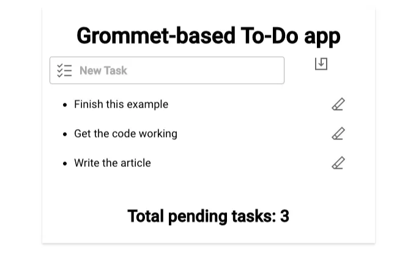
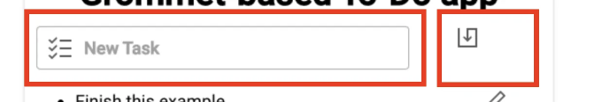
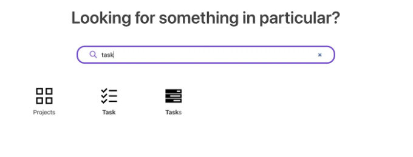
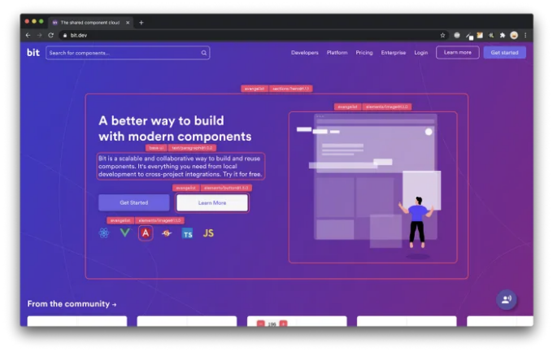

## Grommet 살펴보기: 개발 시간을 정말로 단축할까요? 함께 알아봅시다!


개발 시간을 줄인다는 건 강력한 주장이죠. 지나칠 정도로 많은 도구들이 이전에 주장했지만, 실제로 이를 이룩한 것은 많지 않습니다.

Grommet은 웹 앱을 훨씬 빨리 개발할 수 있다고 주장하는 또 다른 컴포넌트 라이브러리/프레임워크입니다 (스스로를 프레임워크라고 부르지만, 우리는 그것을 확인할 겁니다).

<!-- ui-log 수평형 -->
<ins class="adsbygoogle"
  style="display:block"
  data-ad-client="ca-pub-4877378276818686"
  data-ad-slot="9743150776"
  data-ad-format="auto"
  data-full-width-responsive="true"></ins>
<component is="script">
(adsbygoogle = window.adsbygoogle || []).push({});
</component>

그걸 테스트해볼까요?

# Grommet이란?

잠시 테스트해보고 문서를 살펴본 결과, Grommet은 리액트를 중심으로 한 컴포넌트 라이브러리라는 걸 알려드릴게요.

그게 전부에요, 그게 다에요.

<!-- ui-log 수평형 -->
<ins class="adsbygoogle"
  style="display:block"
  data-ad-client="ca-pub-4877378276818686"
  data-ad-slot="9743150776"
  data-ad-format="auto"
  data-full-width-responsive="true"></ins>
<component is="script">
(adsbygoogle = window.adsbygoogle || []).push({});
</component>

그들이 "프레임워크"라고 주장하기는 하지만, 솔직히 아직은 그것을 보지 못했어요.

아마도 미래에는 몇 가지 문제를 해결한 후에 "프레임워크"로 선정될 수도 있겠지만, 현재로서는 사용 가능한 구성 요소 목록을 사용하는 것이 안전합니다.

왜냐하면 그렇게 말하는 걸까요? 어떤 문제들을 해결해야 할까요? 그러니까, Grommet 뒤에 있는 팀은 실제로 세 가지를 제공합니다:

- 멋진 React 애플리케이션을 만들기 위해 사용할 수 있는 구성 요소 라이브러리.
- UI를 조금 더 풍부하게 만들기 위한 아이콘 라이브러리. 아주 좋은 컬렉션이 있으며, 그것들을 검색할 수 있는 꽤 좋은 온라인 검색도 있습니다.
- 이론적으로 여러분이 자신만의 앱(또는 적어도 프리젠테이션)를 시각적으로 만들 수 있게 해주는 응용 프로그램 디자이너 앱.

<!-- ui-log 수평형 -->
<ins class="adsbygoogle"
  style="display:block"
  data-ad-client="ca-pub-4877378276818686"
  data-ad-slot="9743150776"
  data-ad-format="auto"
  data-full-width-responsive="true"></ins>
<component is="script">
(adsbygoogle = window.adsbygoogle || []).push({});
</component>

만약 그 목록을 살펴보셨다면, 이론적으로, 나는 이것을 컴포넌트 라이브러리보다 더 큰 것으로 부를 수 있을 것 같아요. 문제는 뭐냐면요? 앱 디자이너가 제대로 작동하지 않아요. 클릭으로 JS 오류가 발생할 때마다 흰 화면이 여러 번 나타났어요. 제가 무언가를 만들어낼 수 없었고, 주변에서 도움을 받을 수 있는 게 거의 없었어요. 심지어 제 작품을 내보내는 방법도 찾을 수 없었어요.

그래서 이 기사의 목적을 위해, 나는 앱 디자이너를 무시할 거에요. 그들이 안정적이고 사용 가능하게 만들 때까지, 우리는 그걸로 돌아올 거에요.

그 대신, Grommet이 제공하는 구성 요소 목록으로 UI를 구현하는 것이 어떤지 살펴볼까요?

내 글이 마음에 드셨나요? 저의 IT 산업에서의 2십년간의 지혜를 모두에게 나누는 내 무료 뉴스레터를 구독해보시겠어요? "늙은 개발자의 수다"에 가입하세요!

<!-- ui-log 수평형 -->
<ins class="adsbygoogle"
  style="display:block"
  data-ad-client="ca-pub-4877378276818686"
  data-ad-slot="9743150776"
  data-ad-format="auto"
  data-full-width-responsive="true"></ins>
<component is="script">
(adsbygoogle = window.adsbygoogle || []).push({});
</component>

# 할 일 앱 만들기

믿든지 말든지, 나는 할 일 앱이 새로운 컴포넌트 라이브러리를 현장 시험하는 가장 좋은 방법이라고 생각해요. 레이아웃 컴포넌트와 입력 컴포넌트를 함께 사용해보고 목록 옵션, 버튼/아이콘을 살펴볼 수 있어요.

모든 게 다 있어요! 그래서 우리의 Grommet 파워로 하는 할 일 앱을 만들어 봅시다. 최종 결과물은 이렇게 보일 거에요:



<!-- ui-log 수평형 -->
<ins class="adsbygoogle"
  style="display:block"
  data-ad-client="ca-pub-4877378276818686"
  data-ad-slot="9743150776"
  data-ad-format="auto"
  data-full-width-responsive="true"></ins>
<component is="script">
(adsbygoogle = window.adsbygoogle || []).push({});
</component>

그러면 기본적인 단계부터 시작해보죠. 기존의 리액트 앱에 Grommet을 설치해 봅시다. 그러려면 다음 한 줄이면 충분해요:

```js
npm install grommet grommet-icons styled-components --save
```

이후에는 바깥쪽 컨테이너인 Box부터 시작할 거에요.

우리는 앱 전체를 담을 Box를 만들고, 그것이 가운데 정렬되도록 할 거에요. 그를 위해 "large" 폭과 "small" 여백을 설정하고, "center" 정렬 값을 주어 컨테이너가 중앙에 위치하도록 만들 거에요.

<!-- ui-log 수평형 -->
<ins class="adsbygoogle"
  style="display:block"
  data-ad-client="ca-pub-4877378276818686"
  data-ad-slot="9743150776"
  data-ad-format="auto"
  data-full-width-responsive="true"></ins>
<component is="script">
(adsbygoogle = window.adsbygoogle || []).push({});
</component>

보시다시피, 우리는 매우 "직관적인" 미리 설정된 크기 관련 값들을 가지고 있어요. 개인적으로 저는 이것을 좋아하지 않아요. 왜냐하면 "작은"이나 "큰"이 이 문맥에서 어떤 의미를 하는지 정확히 알기 위해 문서를 참조해야만 하는데 그렇기 때문이에요. 의도는 좋지만 결과는 아니에요. 저는 현재 옵션들보다는 "50%"나 "너비-300"과 같은 것을 사용하는 편이 더 이해하기 쉽다고 생각해요.

또한, 앱에 작은 그림자를 줘야 할 것 같아서 "작은" 드롭 쉐도우를 가진 안쪽 상자를 추가할 거에요.

그런 다음 입력 상자와 옆에 있는 버튼을 설정할 거에요, 이 부분: 



<!-- ui-log 수평형 -->
<ins class="adsbygoogle"
  style="display:block"
  data-ad-client="ca-pub-4877378276818686"
  data-ad-slot="9743150776"
  data-ad-format="auto"
  data-full-width-responsive="true"></ins>
<component is="script">
(adsbygoogle = window.adsbygoogle || []).push({});
</component>

이를 위해 다음 레이아웃 관련 구성 요소를 사용할 거에요: 그리드

제가 지금까지 다른 컴포넌트 라이브러리에서 그리드를 사용해 봤는데, Grommet의 접근 방식처럼 보지 못했어요.

모든 열과 행의 크기를 정의하고, 그리드 내에서 여러 셀을 통과하는 지정된 영역을 정의할 수 있어요.

다음 예시를 확인해 보세요:

<!-- ui-log 수평형 -->
<ins class="adsbygoogle"
  style="display:block"
  data-ad-client="ca-pub-4877378276818686"
  data-ad-slot="9743150776"
  data-ad-format="auto"
  data-full-width-responsive="true"></ins>
<component is="script">
(adsbygoogle = window.adsbygoogle || []).push({});
</component>

제 경우에는 두 셀만 필요하기 때문에 "input"셀과 "button"셀을 정의할 거에요. 첫 번째 셀이 마지막 셀보다 가로로 더 크게 만들거든요, 두 개를 옆으로 나란히 배치할 거에요.

그러고 나면 Grid의 내부 요소를 각각의 그리드 영역에 gridArea 속성을 사용하여 지정할 수 있어요.

이런식으로 Grid와 내부 요소를 구성하는 것은 분명히 다른 방법이지만, 진행하는 과정에서 정말 즐거웠어요. 이런 식으로 그리드를 배치하는 것은 Grommet의 사람들에게 정말 칭찬을 보내고 싶어요. 아주 직관적이고 직관적이거든요.

할 일 항목 목록에 대해서는 이 문제를 해결하는 과정이 너무 복잡해 보였기 때문에 흥미로운 DataTable 컴포넌트 대신 일반적인 ul/li 콤보를 사용하기로 결정했어요.

<!-- ui-log 수평형 -->
<ins class="adsbygoogle"
  style="display:block"
  data-ad-client="ca-pub-4877378276818686"
  data-ad-slot="9743150776"
  data-ad-format="auto"
  data-full-width-responsive="true"></ins>
<component is="script">
(adsbygoogle = window.adsbygoogle || []).push({});
</component>

## 입력 처리

텍스트와 버튼을 위한 입력 필드는 매우 표준적이며 사용할 때 문제가 없었습니다.

하지만, 그들이 우리가 다루는 방식을 혁신하는 것은 아니었습니다. 입력 필드에 대해 많은 일반 속성을 지정할 수 있고, 꽤 잘 렌더링됩니다. 다른 입력 필드처럼 React refs를 사용할 수 없었기 때문에, 새로운 작업을 저장할 때 ref의 값 대신 inputText 상태 변수를 업데이트하는 onChange 이벤트 핸들러를 추가했습니다.

## 아이콘 사용

<!-- ui-log 수평형 -->
<ins class="adsbygoogle"
  style="display:block"
  data-ad-client="ca-pub-4877378276818686"
  data-ad-slot="9743150776"
  data-ad-format="auto"
  data-full-width-responsive="true"></ins>
<component is="script">
(adsbygoogle = window.adsbygoogle || []).push({});
</component>

마침내 전체적으로 더 멋있게 보이도록 몇 군데 아이콘을 사용했어요. 그것도 매우 쉽고 좋았죠.

그들의 사이트에는 아주 편리한 아이콘 검색 기능이 있어서 아주 잘 작동해요:



그런 다음 그냥 아이콘의 이름을 가져와서 grommet-icons 패키지에서 불러오면 됩니다. 간단하죠!

<!-- ui-log 수평형 -->
<ins class="adsbygoogle"
  style="display:block"
  data-ad-client="ca-pub-4877378276818686"
  data-ad-slot="9743150776"
  data-ad-format="auto"
  data-full-width-responsive="true"></ins>
<component is="script">
(adsbygoogle = window.adsbygoogle || []).push({});
</component>

# 요약

내 경험을 요약해보겠습니다.

To-Do 앱을 완벽히 만들고 기본 구성 요소를 통해 충분히 멋지게 만들었습니다.

## 장점

<!-- ui-log 수평형 -->
<ins class="adsbygoogle"
  style="display:block"
  data-ad-client="ca-pub-4877378276818686"
  data-ad-slot="9743150776"
  data-ad-format="auto"
  data-full-width-responsive="true"></ins>
<component is="script">
(adsbygoogle = window.adsbygoogle || []).push({});
</component>

Grommet를 몇 일간 사용해본 후 몇 가지를 정말 좋아했습니다:

- 그들의 Grid 레이아웃 시스템은 꽤 좋았어요. 절대 추천하고, DataTable 구성 요소도 비슷한 패턴을 따라가는 것 같아요.
- 문서가 좋아요. 각 구성 요소가 사용하는 모든 잠재적인 속성을 보여주는 자세한 사양과 같은 문서가 있어요.
- 아이콘 검색기가 사용하기 쉬우며 전체 아이콘 시스템은 간단하고 강력해요.
- 구성 요소 목록이 상당히 포괄적하고 사용할만하고 흥미로운 고급 구성 요소가 있어요.
- 전체적으로 테마를 쉽게 적용할 수 있어요. 이번 리뷰에서는 이점을 활용하지 않았지만, 앱을 테마화하기 매우 간단하게 만들어놨어요.

물론 모든 것이 완벽하진 않죠, 그러니 Grommet에 대해 좋지 않은 점도 살펴봅시다.

<!-- ui-log 수평형 -->
<ins class="adsbygoogle"
  style="display:block"
  data-ad-client="ca-pub-4877378276818686"
  data-ad-slot="9743150776"
  data-ad-format="auto"
  data-full-width-responsive="true"></ins>
<component is="script">
(adsbygoogle = window.adsbygoogle || []).push({});
</component>

이 라이브러리에는 “나쁜” 부분이 많지 않은 것 같아요. 하지만 몇 가지 문제점을 발견했어요:

- 이들의 앱 디자이너는 이론적으로 매우 흥미로우나 안정성이 부족해 활용하기 어려웠어요.
- 문서에 예제가 부족해요. 좋은 명세는 있지만 컴포넌트의 전체 기능을 효과적으로 소개할 예제가 부족했어요. Material UI와 같은 다른 라이브러리들은 컴포넌트를 어떻게 활용할 수 있는지 아이디어를 제공하는 멋진 예제가 있는데요.
- 솔직히 말해서, 내 개발 시간이 손해나 개선된 느낌은 전혀 없었어요. 광고한 것처럼 작동했다면 다른 결과가 있었을지도 몰라요.

전반적으로 Grommet을 사용하는 것을 정말 즐겼지만, Material UI와 같은 다른 컴포넌트 라이브러리를 사용할 때와 비슷하게 더 좋았어요.

앱 디자이너가 제대로 작동하고 문서에 빠진 예제를 추가한다면, 이 라이브러리는 React 개발자에게 매우 권장해야 할 것 같아요.

<!-- ui-log 수평형 -->
<ins class="adsbygoogle"
  style="display:block"
  data-ad-client="ca-pub-4877378276818686"
  data-ad-slot="9743150776"
  data-ad-format="auto"
  data-full-width-responsive="true"></ins>
<component is="script">
(adsbygoogle = window.adsbygoogle || []).push({});
</component>

Grommet을 사용해 보신 적이 있나요? 어떤 경험을 하셨나요?

# 레고처럼 재사용 가능한 구성 요소로 앱을 만들어보세요



Bit의 오픈소스 도구는 25만 명 이상의 개발자가 컴포넌트로 앱을 만들 수 있도록 도와줍니다.

<!-- ui-log 수평형 -->
<ins class="adsbygoogle"
  style="display:block"
  data-ad-client="ca-pub-4877378276818686"
  data-ad-slot="9743150776"
  data-ad-format="auto"
  data-full-width-responsive="true"></ins>
<component is="script">
(adsbygoogle = window.adsbygoogle || []).push({});
</component>

어떤 UI, 기능 또는 페이지라도 재사용 가능한 구성 요소로 변환하여 여러 애플리케이션 간에 공유하세요. 협업하는 것이 더 쉽고 빠르게 빌드할 수 있습니다.

→ 더 알아보기

앱을 구성 요소로 분할하여 앱 개발을 더 쉽게 만들고 원하는 작업 흐름에 대해 최상의 경험을 누리세요:

## → 마이크로 프론트엔드

<!-- ui-log 수평형 -->
<ins class="adsbygoogle"
  style="display:block"
  data-ad-client="ca-pub-4877378276818686"
  data-ad-slot="9743150776"
  data-ad-format="auto"
  data-full-width-responsive="true"></ins>
<component is="script">
(adsbygoogle = window.adsbygoogle || []).push({});
</component>

## → 디자인 시스템

## → 코드 공유 및 재사용

## → 모노 레포

# 더 알아보기