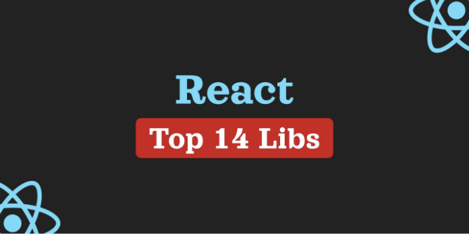

## 최고의 리액트 무기고

여기에는 수많은 리액트 라이브러리가 있으며, 올바른 하나를 선택하는 것은 어려울 수 있습니다. 이 글에서는 내가 가장 좋아하고 신뢰하는 라이브러리 목록을 소개하여 여러분이 프로젝트에 최상의 선택을 할 수 있도록 도와 드리겠습니다.

제 주관적인 견해를 바탕으로 한 상위 목록이니 참고해 주시기 바랍니다. 제가 놓칠 수도 있고 그 외에도 훌륭한 라이브러리가 존재할 수 있습니다. 그러니 자유롭게 의견을 남기고 생각을 공유해 주세요.

<!-- ui-log 수평형 -->
<ins class="adsbygoogle"
  style="display:block"
  data-ad-client="ca-pub-4877378276818686"
  data-ad-slot="9743150776"
  data-ad-format="auto"
  data-full-width-responsive="true"></ins>
<component is="script">
(adsbygoogle = window.adsbygoogle || []).push({});
</component>

목차

- API 상호 작용
- 상태 관리
- UI 킷
- 스타일링
- 양식 및 유효성 검사

## API 상호 작용

오늘날의 세상에서는 백엔드와의 연결 없이는 프론트엔드 애플리케이션이 완전하지 않습니다. 이로 인해 API 상호 작용을 위한 올바른 라이브러리 선택이 매우 중요합니다.

<!-- ui-log 수평형 -->
<ins class="adsbygoogle"
  style="display:block"
  data-ad-client="ca-pub-4877378276818686"
  data-ad-slot="9743150776"
  data-ad-format="auto"
  data-full-width-responsive="true"></ins>
<component is="script">
(adsbygoogle = window.adsbygoogle || []).push({});
</component>

일반적으로, 만나게 될 API 유형은 주로 두 가지입니다: 전형적인 RESTful API와 GraphQL입니다. 아마도 도구들이 다르다는 것을 짐작하기 어렵지 않을 겁니다.

## RESTful API의 경우

REST의 경우, React-Query가 강력한 캐싱 기능과 자동 백그라운드 업데이트로 선두를 달리고 있습니다. 지금 당장 찾을 수 있는 가장 유연하고 완전한 솔루션 중 하나입니다. 주요 기능 목록을 살펴보겠습니다:

- 캐시 관리는 기본 제공되며 매우 쉽고 쾌적합니다.
- 백그라운드에서 자동 데이터 재유효화.
- 동일한 데이터에 대한 여러 요청을 단일 요청으로 결합.
- 페이지네이션 및 레이지 로딩과 같은 다양한 최적화.
- 낙관적 UI 업데이트.

<!-- ui-log 수평형 -->
<ins class="adsbygoogle"
  style="display:block"
  data-ad-client="ca-pub-4877378276818686"
  data-ad-slot="9743150776"
  data-ad-format="auto"
  data-full-width-responsive="true"></ins>
<component is="script">
(adsbygoogle = window.adsbygoogle || []).push({});
</component>

## GraphQL API에 대하여

Apollo Client는 GraphQL과의 상호작용을 간편하고 효율적으로 만들어 주는 상태 관리 라이브러리입니다. 복잡한 데이터 주도형 애플리케이션을 구축하는 것을 크게 단순화합니다.

React Query와 거의 동일한 기능을 제공하지만 GraphQL을 위한 것입니다. 또한 GraphQL 구독과 같은 고유 기능을 갖추고 있습니다:

- GraphQL 구독을 통한 실시간 데이터 지원.
- 클라이언트 상태 관리.
- 다양한 GraphQL 특화 최적화 기능.

<!-- ui-log 수평형 -->
<ins class="adsbygoogle"
  style="display:block"
  data-ad-client="ca-pub-4877378276818686"
  data-ad-slot="9743150776"
  data-ad-format="auto"
  data-full-width-responsive="true"></ins>
<component is="script">
(adsbygoogle = window.adsbygoogle || []).push({});
</component>

리액트 애플리케이션에서는 상태를 사용하여 작업을 지속적으로 수행합니다. 대부분의 버그는 상태 관리가 잘못되었기 때문에 발생하기 때문에 즉시 올바른 전략을 선택하는 것이 중요합니다.

대략적으로 말하자면, 전역 상태와 지역 상태 두 가지 유형이 있습니다. 전역 상태는 앱의 모든 부분에서 접근할 수 있으며, 지역 상태는 특정 구성 요소, 위젯 또는 페이지 내에서만 접근할 수 있습니다.

## 전역 상태의 경우

프런트엔드 개발에서는 많은 다른 상태 관리자가 있습니다. 눈 깜짝할 새에 새로운 상태 관리자가 오픈소스로 공개됩니다. 하지만 저에게 잘 작동하는 것은 MobX입니다.

<!-- ui-log 수평형 -->
<ins class="adsbygoogle"
  style="display:block"
  data-ad-client="ca-pub-4877378276818686"
  data-ad-slot="9743150776"
  data-ad-format="auto"
  data-full-width-responsive="true"></ins>
<component is="script">
(adsbygoogle = window.adsbygoogle || []).push({});
</component>

일부 사람들은 많은 "마법"이 당신의 통제 범위를 벗어나서 뒷면에서 일어나기 때문에 그것을 좋아하지 않을 수 있습니다. 그러나 제게 있어서는 그것이 기능이고 버그가 아닙니다. 제게 있어 제품 자체에 집중하고 기술적인 세부 사항에 너무 많은 시간을 쏟지 않는 것이 좋습니다. 내 생각에, 그 주요 장점들은 다음과 같습니다:

- MobX는 아름답고 직관적인 API를 가지고 있어 간단합니다.
- Redux와 같은 솔루션들과 비교했을 때 boilerplate가 최소화되어 더 적은 코드를 작성할 수 있습니다.
- 고급 반응성 시스템은 상태의 변경을 자동으로 추적하고 영향을 받는 컴포넌트만 업데이트합니다.

## 로컬 상태용

로컬 상태를 관리하는 것은 큰 도전이 아닙니다. 대부분의 경우, useState, useContext 및 useReducer와 같은 내장 React 훅을 사용할 수 있습니다.

<!-- ui-log 수평형 -->
<ins class="adsbygoogle"
  style="display:block"
  data-ad-client="ca-pub-4877378276818686"
  data-ad-slot="9743150776"
  data-ad-format="auto"
  data-full-width-responsive="true"></ins>
<component is="script">
(adsbygoogle = window.adsbygoogle || []).push({});
</component>

그러나 경우에 따라 React Context와 useContext 훅이 필요할 수 있습니다. 이를 다룰 때는 과도한 다시 랜더링과 확장성 문제를 염두에 두어야 합니다.

만약 이러한 문제들을 해결하고 비즈니스 로직에 더 집중하고 싶다면 use-context-selector를 선택하십시오. 이를 통해 성능 최적화와 React Context에 대한 세밀한 접근이 가능합니다.

# UI-kit

UI-kit은 모든 프론트엔드 애플리케이션의 기반입니다. 견고하고 재사용 가능하며 프로젝트 요구에 완벽히 맞추어 사용자 정의된 모습을 가져야 합니다. 프로젝트 전체에 영향을 미칠 것이므로 신중히 생각하고 좋은 기술적 솔루션을 구현하는 것이 매우 중요합니다.

<!-- ui-log 수평형 -->
<ins class="adsbygoogle"
  style="display:block"
  data-ad-client="ca-pub-4877378276818686"
  data-ad-slot="9743150776"
  data-ad-format="auto"
  data-full-width-responsive="true"></ins>
<component is="script">
(adsbygoogle = window.adsbygoogle || []).push({});
</component>

저는 오랫동안 사용자 정의 UI 키트를 만들어 왔고 항상 두 가지 유형의 상황이 있습니다: 모든 것을 완벽하게 만들 시간이 있을 때와 그렇지 않을 때.

## 시간이 있는 경우

이 경우에는 완전히 맞춤화된 솔루션, 정확한 디자인 일치 및 고품질 구성 요소를 원합니다. 그러나 모든 것을 최상의 방법에 따라 처음부터 만드는 것은 꽤 어려울 수 있습니다.

시작하고 확장할 수 있는 "헤들리스 UI" 패키지를 선택하는 것을 권장합니다. 이러한 유형의 패키지는 어떠한 스타일도 포함하지 않고 궁극적으로 유연하고 맞춤화할 수 있습니다. 게다가, 크로스 브라우저 호환성 및 접근성에 필요한 모든 것이 포함되어 있습니다.

<!-- ui-log 수평형 -->
<ins class="adsbygoogle"
  style="display:block"
  data-ad-client="ca-pub-4877378276818686"
  data-ad-slot="9743150776"
  data-ad-format="auto"
  data-full-width-responsive="true"></ins>
<component is="script">
(adsbygoogle = window.adsbygoogle || []).push({});
</component>

내가 가장 좋아하는 것들은:

- React-Aria, 특히 후크 API
- Headless UI
- Radix UI

## 시간이 부족할 때

솔직히 말하자면, 대부분의 시간에 우리는 시간이 없어요. 속도를 위해 완벽한 디자인 매칭을 희생해야 할 준비가 되어 있어야 해요.

<!-- ui-log 수평형 -->
<ins class="adsbygoogle"
  style="display:block"
  data-ad-client="ca-pub-4877378276818686"
  data-ad-slot="9743150776"
  data-ad-format="auto"
  data-full-width-responsive="true"></ins>
<component is="script">
(adsbygoogle = window.adsbygoogle || []).push({});
</component>

이 문제에 대해 우리는 다양한 포괄적인 디자인 시스템을 제공합니다. 이 시스템들은 완전한 자유를 제공하지 않고 구성하는 데 시간을 투자해야 합니다. 하지만 그 결과로 많은 시간을 절약할 수 있습니다.

그래서 제가 선호하는 것은:

- Ant Design
- Chakra UI
- Material UI

# 스타일링

<!-- ui-log 수평형 -->
<ins class="adsbygoogle"
  style="display:block"
  data-ad-client="ca-pub-4877378276818686"
  data-ad-slot="9743150776"
  data-ad-format="auto"
  data-full-width-responsive="true"></ins>
<component is="script">
(adsbygoogle = window.adsbygoogle || []).push({});
</component>

스타일링에 관해 이야기할 때, 선택은 종종 개인 취향에 따라 결정됩니다. 저는 주로 Styled Components나 표준 SCSS 모듈을 선호해요.

Styled Components는 스타일이 JavaScript와 밀접하게 연관된 상황에서 좋아요. 이 라이브러리를 사용하면 JavaScript 내에서 CSS를 작성할 수 있어 기술 간의 격차를 줄이고 동적 스타일링을 단순화할 수 있어요. 하지만 뉴 개발자들에게는 이 기술에 익숙하지 않아 혼란스러울 수도 있어요.

SCSS 모듈은 전통적인 방식을 제공하며 스타일을 JavaScript 로직과 분리할 수 있어요. 이 기술은 변수, 믹싱, 중첩 및 전반적으로 더 나은 구문과 같은 많은 기능을 제공해 편안하게 사용할 수 있어요. 그러나 Styled Components와 비교하면 SCSS는 특히 동적 스타일에 관해서는 일부 고급 기능이 부족할 수도 있어요.

# Forms and Validation

<!-- ui-log 수평형 -->
<ins class="adsbygoogle"
  style="display:block"
  data-ad-client="ca-pub-4877378276818686"
  data-ad-slot="9743150776"
  data-ad-format="auto"
  data-full-width-responsive="true"></ins>
<component is="script">
(adsbygoogle = window.adsbygoogle || []).push({});
</component>

많은 사람들이 올바른 형식 처리의 중요성을 과소평가하는 경우가 많은데, 이는 실수입니다. 사용자 입력을 캡처하는 것뿐만이 아니라, 원활하고 사용자 친화적인 경험을 제공하는 데 중요합니다.

수많은 라이브러리가 있지만, 제 의견으로는 Formik과 React Hook Form 두 가지 주요 경쟁자가 있습니다.

두 라이브러리 모두 기능과 개발자 경험 측면에서 매우 유사하지만, 성능 측면에서 상당히 차이가 있을 수 있습니다. 이에 대해 설명해 드리겠습니다.

React Hook Form은 비제어 컴포넌트를 사용하며 입력 상태를 제어하지 않습니다. HTML 폼 요소의 기본 동작에 의존하며, 이는 다시 렌더링하는 횟수를 최소화합니다. 이 요인은 크고 복잡한 양식에서 중요한 역할을 할 수 있습니다.

<!-- ui-log 수평형 -->
<ins class="adsbygoogle"
  style="display:block"
  data-ad-client="ca-pub-4877378276818686"
  data-ad-slot="9743150776"
  data-ad-format="auto"
  data-full-width-responsive="true"></ins>
<component is="script">
(adsbygoogle = window.adsbygoogle || []).push({});
</component>

Formik은 제어 컴포넌트를 사용하며 폼 상태를 완전히 관리합니다. 모든 입력 변경마다 상태를 업데이트하여 더 자주 다시 렌더링됩니다. 폼이 크거나 복잡한 유효성 검사가 있는 경우 주의하세요.

이 글이 유익했기를 바랍니다. 문의 사항이나 제안 사항이 있으면 댓글을 남겨주세요. 여러분의 피드백은 제 성장에 도움이 됩니다.

구독하지 않으시면⭐ 않으세요.