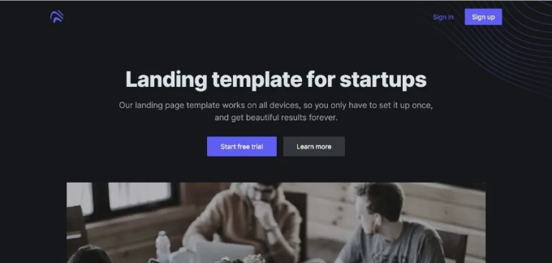
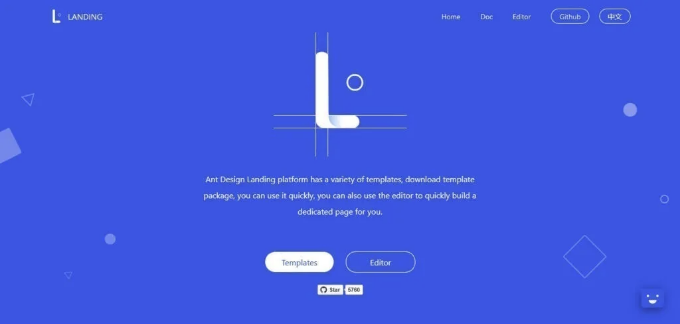
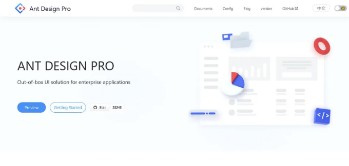
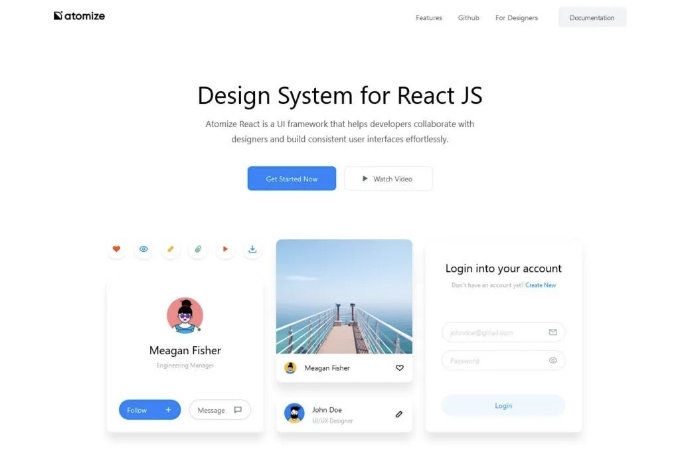

안녕하세요! 멋진 무료 React 웹사이트 템플릿의 선별된 컬렉션에 오신 것을 환영합니다. 랜딩 페이지, 온라인 포트폴리오, 블로그 등을 만드는 중이든, 여러분의 프로젝트를 높여줄 이 템플릿들을 세심하게 선택했습니다.

React 템플릿의 다양성은 여러분이 희망하는 요소의 다양성과 양에 기반하여 다양한 코드 팩을 제시함으로써 빛을 발합니다. 제한된 예산으로 운영하는 스타트업에 이상적인 이 무료 React 템플릿은 여러분의 디지털 노력을 위한 견고한 기반을 제공합니다.

그러나 추가 기능, 확장 가능한 사용자 정의 옵션, 그리고 전용 지원을 바라는 분들을 위해 프리미엄 React 웹사이트 템플릿을 탐험하도록 권장합니다.

<!-- ui-log 수평형 -->
<ins class="adsbygoogle"
  style="display:block"
  data-ad-client="ca-pub-4877378276818686"
  data-ad-slot="9743150776"
  data-ad-format="auto"
  data-full-width-responsive="true"></ins>
<component is="script">
(adsbygoogle = window.adsbygoogle || []).push({});
</component>

이 기사는 귀하의 웹 개발 여정을 더 강력하게 만들어줄 필수 기능을 갖춘 일부 우수한 무료 리액트 템플릿을 소개하는 것을 목표로 합니다.

# 최고의 무료 리액트 웹사이트 템플릿

## Ant Design Landing

<!-- ui-log 수평형 -->
<ins class="adsbygoogle"
  style="display:block"
  data-ad-client="ca-pub-4877378276818686"
  data-ad-slot="9743150776"
  data-ad-format="auto"
  data-full-width-responsive="true"></ins>
<component is="script">
(adsbygoogle = window.adsbygoogle || []).push({});
</component>

랜딩은 Ant Design System으로 제작된 다목적 템플릿입니다. 이 포괄적인 패키지에는 프론트 및 내부 페이지용 다양한 모듈이 포함되어 있어 프로젝트의 빠른 구성 및 배포가 가능합니다.

이 템플릿은 유연하고 견고한 온라인 편집기를 제공하여 전체 웹사이트 디자인과 시들어 맞는 무제한의 전용 페이지를 쉽게 생성할 수 있도록 도와줍니다.

Sketch 파일과 포괄적인 스타일 가이드의 포함으로 템플릿의 적응성과 사용 편의성이 향상됩니다.

데모 더 알아보기 | 다운로드

<!-- ui-log 수평형 -->
<ins class="adsbygoogle"
  style="display:block"
  data-ad-client="ca-pub-4877378276818686"
  data-ad-slot="9743150776"
  data-ad-format="auto"
  data-full-width-responsive="true"></ins>
<component is="script">
(adsbygoogle = window.adsbygoogle || []).push({});
</component>

## Ant Design Pro

Ant Design Pro는 기업 애플리케이션을 위해 설계된 즉시 사용 가능한 UI 솔루션으로, React 보일러플레이트로 제공됩니다.

React Native 테마인 이 무료 Ant Design Pro는 포괄적인 대시보드 페이지, 인증 기능, 미리 만들어진 폼 및 UI 목록을 제공합니다. 개발자와 스타트업은 사용자 정의 가능한 성격을 활용하여 쉽게 특정 요구에 맞게 구성할 수 있습니다.

<!-- ui-log 수평형 -->
<ins class="adsbygoogle"
  style="display:block"
  data-ad-client="ca-pub-4877378276818686"
  data-ad-slot="9743150776"
  data-ad-format="auto"
  data-full-width-responsive="true"></ins>
<component is="script">
(adsbygoogle = window.adsbygoogle || []).push({});
</component>

이 테마는 현대적이고 세련된 디자인으로 제작되었으며 최신 개발 스택을 사용하여 빠른 애플리케이션 레이아웃 배포를 가능케 합니다. 시각적으로 매력적이면서도 높은 기능성을 갖춘 레이아웃이 가능합니다.

더 많은 정보 | 데모 다운로드

## Atomize — React UI 프레임워크

<!-- ui-log 수평형 -->
<ins class="adsbygoogle"
  style="display:block"
  data-ad-client="ca-pub-4877378276818686"
  data-ad-slot="9743150776"
  data-ad-format="auto"
  data-full-width-responsive="true"></ins>
<component is="script">
(adsbygoogle = window.adsbygoogle || []).push({});
</component>

Atomize는 개발자와 디자이너 간의 협업을 원할하게 하기 위해 만들어진 React UI 프레임워크로, 일관된 조화로운 사용자 인터페이스를 쉽게 만들 수 있습니다.

스타일 가이드와 유연한 그리드 등의 리소스를 완벽하게 결합하여, Atomize는 반응형 웹사이트와 앱을 개발하는 데 적합하며 다양한 요구 사항에 맞는 디자인 시스템을 제공합니다.

더 많은 정보 데모 | 다운로드

전체 목록 및 다른 옵션을 확인하려면 클릭하세요.

<!-- ui-log 수평형 -->
<ins class="adsbygoogle"
  style="display:block"
  data-ad-client="ca-pub-4877378276818686"
  data-ad-slot="9743150776"
  data-ad-format="auto"
  data-full-width-responsive="true"></ins>
<component is="script">
(adsbygoogle = window.adsbygoogle || []).push({});
</component>

***공개 공시: 이 콘텐츠에는 어필리에이트 링크가 포함되어 있습니다.***

안녕하세요, 저는 Don Peno입니다. 웹 사이트 템플릿, 웹 디자인 팁, 웹 개발자, 프리랜서, 기업가 및 소기업 소유자를 위한 필수 도구에 대한 통찰을 나누는 데 열정적입니다. 피드에서 내 콘텐츠를 놓치지 않으려면 Don Peno를 팔로우하실 것을 초대합니다. 보다 직접적인 연결을 원하신다면 뉴스레터를 구독해 최신 게시물을 직접 이메일로 받아보세요. 👇