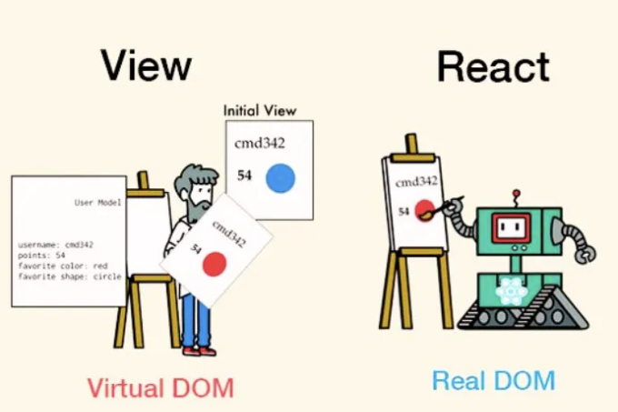
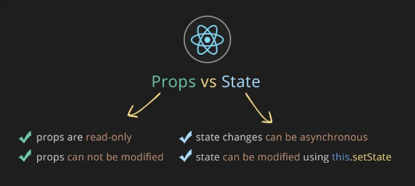
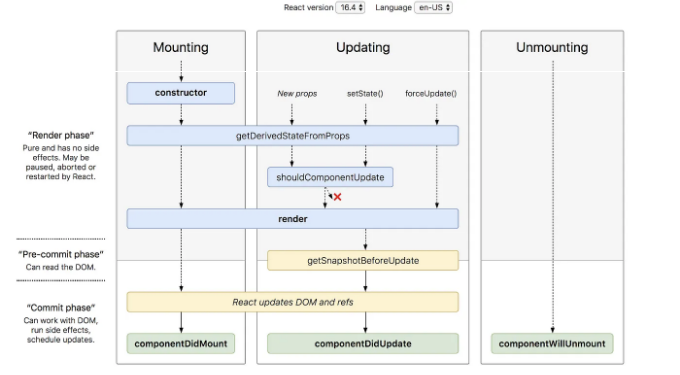
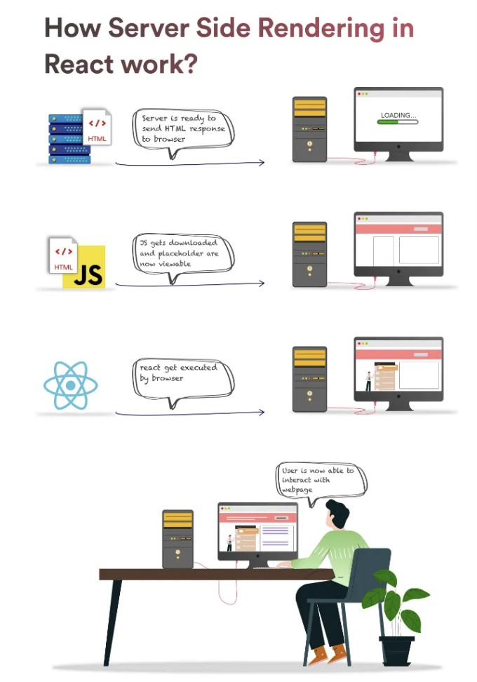
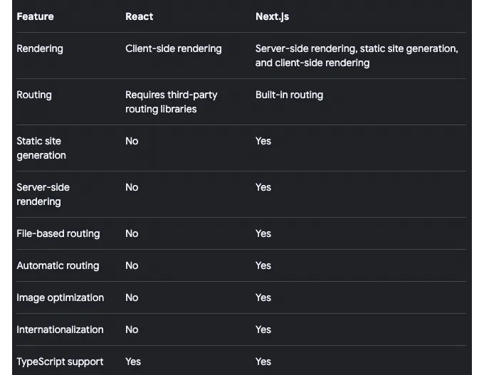

ReactJS는 컴포넌트 기반 아키텍처와 효율적인 렌더링을 통해 현대 웹 개발의 기반 요소가 되었습니다. 동적 사용자 인터페이스를 구축하는 데 처음으로 선택할만한 도구로 자리를 잡았죠.

단순히 기술을 쌓으려는 경험 많은 개발자든, ReactJS 인터뷰를 준비하는 구직자든, 이 안내서는 ReactJS 개발의 주요 개념과 모범 사례에 대한 소중한 통찰을 제공해줄 것입니다.

자, 함께 시작해 봅시다. 2024년 ReactJS 인터뷰에서 성공적으로 활약할 수 있는 필수 주제를 살펴보겠습니다.

<!-- ui-log 수평형 -->
<ins class="adsbygoogle"
  style="display:block"
  data-ad-client="ca-pub-4877378276818686"
  data-ad-slot="9743150776"
  data-ad-format="auto"
  data-full-width-responsive="true"></ins>
<component is="script">
(adsbygoogle = window.adsbygoogle || []).push({});
</component>

# Level -1: 기본

1. ReactJS란 무엇이며 어떻게 작동합니까?

2. Shadow DOM과 Virtual DOM의 차이는 무엇입니까? 조화 과정을 설명하세요.

3. Element와 Component의 차이는 무엇입니까?

<!-- ui-log 수평형 -->
<ins class="adsbygoogle"
  style="display:block"
  data-ad-client="ca-pub-4877378276818686"
  data-ad-slot="9743150776"
  data-ad-format="auto"
  data-full-width-responsive="true"></ins>
<component is="script">
(adsbygoogle = window.adsbygoogle || []).push({});
</component>

4. 리액트에서 state와 props가 무엇인가요?

5. Pure Components와 React.memo()는 무엇인가요?

6. 리액트에서의 합성 이벤트란 무엇인가요?

7. 컴포넌트 라이프사이클의 다양한 단계는 무엇인가요?

<!-- ui-log 수평형 -->
<ins class="adsbygoogle"
  style="display:block"
  data-ad-client="ca-pub-4877378276818686"
  data-ad-slot="9743150776"
  data-ad-format="auto"
  data-full-width-responsive="true"></ins>
<component is="script">
(adsbygoogle = window.adsbygoogle || []).push({});
</component>

Higher-Order Components는 무엇인가요?

context와 useContext Hook은 무엇인가요?

상태가 없는 컴포넌트와 상태가 있는 컴포넌트는 무엇인가요?

# Level-2: 중급

<!-- ui-log 수평형 -->
<ins class="adsbygoogle"
  style="display:block"
  data-ad-client="ca-pub-4877378276818686"
  data-ad-slot="9743150776"
  data-ad-format="auto"
  data-full-width-responsive="true"></ins>
<component is="script">
(adsbygoogle = window.adsbygoogle || []).push({});
</component>

**11. 왜 상태를 직접 업데이트해서는 안 되는가?**

12. setState()의 콜백 함수의 목적은 무엇인가요?

13. HTML과 React 이벤트 처리의 차이점은 무엇인가요?

14. JSX 콜백에서 메서드나 이벤트 핸들러를 어떻게 바인딩하나요?

<!-- ui-log 수평형 -->
<ins class="adsbygoogle"
  style="display:block"
  data-ad-client="ca-pub-4877378276818686"
  data-ad-slot="9743150776"
  data-ad-format="auto"
  data-full-width-responsive="true"></ins>
<component is="script">
(adsbygoogle = window.adsbygoogle || []).push({});
</component>

15. ref의 용도는 무엇이며, React.createRef와 useRef 훅은 무엇인가요?

16. forward refs는 무엇인가요?

17. React Fiber는 무엇인가요?

18. controlled와 uncontrolled 컴포넌트는 무엇인가요?

<!-- ui-log 수평형 -->
<ins class="adsbygoogle"
  style="display:block"
  data-ad-client="ca-pub-4877378276818686"
  data-ad-slot="9743150776"
  data-ad-format="auto"
  data-full-width-responsive="true"></ins>
<component is="script">
(adsbygoogle = window.adsbygoogle || []).push({});
</component>

19. 동적 키 이름으로 상태를 설정하는 방법은 무엇인가요?

20. React에서 프롭에 유효성을 적용하는 방법은 무엇인가요?

21. children 프롭은 무엇인가요?

22. 렌더 프롭(render props)이란 무엇인가요?

<!-- ui-log 수평형 -->
<ins class="adsbygoogle"
  style="display:block"
  data-ad-client="ca-pub-4877378276818686"
  data-ad-slot="9743150776"
  data-ad-format="auto"
  data-full-width-responsive="true"></ins>
<component is="script">
(adsbygoogle = window.adsbygoogle || []).push({});
</component>

23. AJAX 호출을하는 방법 및 어떤 구성 요소 라이프사이클 메서드에서 AJAX 호출을 해야합니까?

24. React 훅은 무엇인가요? 중요한 훅은 무엇인가요?

25. React에서 에러 바운더리는 무엇인가요?

26. 패키지 react-dom의 용도는 무엇인가요?

<!-- ui-log 수평형 -->
<ins class="adsbygoogle"
  style="display:block"
  data-ad-client="ca-pub-4877378276818686"
  data-ad-slot="9743150776"
  data-ad-format="auto"
  data-full-width-responsive="true"></ins>
<component is="script">
(adsbygoogle = window.adsbygoogle || []).push({});
</component>

27. 리액트에서 데코레이터를 어떻게 사용하나요?

28. setState를 호출하지 않고 컴포넌트를 강제로 다시 렌더링하게 할 수 있나요?

29. 리액트 포털이 무엇인가요?

30. 페이지 로드 시 입력 요소에 포커스를 맞추는 방법은 무엇인가요?

<!-- ui-log 수평형 -->
<ins class="adsbygoogle"
  style="display:block"
  data-ad-client="ca-pub-4877378276818686"
  data-ad-slot="9743150776"
  data-ad-format="auto"
  data-full-width-responsive="true"></ins>
<component is="script">
(adsbygoogle = window.adsbygoogle || []).push({});
</component>

# 레벨-3: 전문가

31. 리액트에서 서버 측 렌더링은 어떻게 작동하나요?

32. 리액트 앱을 최적화하는 다양한 방법은 무엇인가요?

33. 리액트 앱을 안전하게 만드는 방법과 리액트에서의 보호된 경로는 무엇인가요?

<!-- ui-log 수평형 -->
<ins class="adsbygoogle"
  style="display:block"
  data-ad-client="ca-pub-4877378276818686"
  data-ad-slot="9743150776"
  data-ad-format="auto"
  data-full-width-responsive="true"></ins>
<component is="script">
(adsbygoogle = window.adsbygoogle || []).push({});
</component>

34. 리액트 코딩의 최선의 모범 사례는 무엇인가요?

35. 리액트에서 컴포넌트 유닛 테스트와 엔드 투 엔드 테스트를 어떻게 할까요?

36. 리액트와 함께 사용되는 다양한 npm 모듈은 무엇인가요?

37. 리액트의 새로운 기능은 무엇인가요?

<!-- ui-log 수평형 -->
<ins class="adsbygoogle"
  style="display:block"
  data-ad-client="ca-pub-4877378276818686"
  data-ad-slot="9743150776"
  data-ad-format="auto"
  data-full-width-responsive="true"></ins>
<component is="script">
(adsbygoogle = window.adsbygoogle || []).push({});
</component>

38. 리액트 디자인 패턴은 무엇인가요?

39. 넥스트지는 무엇이며, 넥스트지 앱을 만드는 방법 및 리액트지와 어떻게 다른가요?

40. 리액트 앱을 설계하는 방법은 무엇인가요?

# =============================================

<!-- ui-log 수평형 -->
<ins class="adsbygoogle"
  style="display:block"
  data-ad-client="ca-pub-4877378276818686"
  data-ad-slot="9743150776"
  data-ad-format="auto"
  data-full-width-responsive="true"></ins>
<component is="script">
(adsbygoogle = window.adsbygoogle || []).push({});
</component>

## 1. ReactJS란 무엇이며 어떻게 작동합니까?

ReactJS는 상호작용하는 사용자 인터페이스를 만들기 위한 강력한 JavaScript 라이브러리입니다.

ReactJS는 선언적이고 컴포넌트 기반 접근 방식을 바탕으로 작동합니다. 이러한 컴포넌트들은 작고 독립적인 단위로, 복잡한 사용자 인터페이스를 구축하기 위해 결합될 수 있습니다.



<!-- ui-log 수평형 -->
<ins class="adsbygoogle"
  style="display:block"
  data-ad-client="ca-pub-4877378276818686"
  data-ad-slot="9743150776"
  data-ad-format="auto"
  data-full-width-responsive="true"></ins>
<component is="script">
(adsbygoogle = window.adsbygoogle || []).push({});
</component>

리액트 애플리케이션이 실행되면 메모리에 사용자 인터페이스의 가상 표현을 만들어냅니다. 이를 가상 DOM이라고 합니다. 가상 DOM은 실제 DOM 요소의 모든 속성과 속성을 포함하는 가벼운 JavaScript 객체입니다. UI의 이상적인 표현을 메모리에 유지하고 실제 DOM과 동기화하는 프로그래밍 개념입니다.

리액트 컴포넌트의 상태나 속성이 변경되면 새로운 VDOM 트리가 생성됩니다. VDOM은 리액트의 조정 알고리즘을 통해 새로운 VDOM 표현과 이전 VDOM 표현 간의 차이를 계산합니다. 그런 다음 변경된 부분만 업데이트하여 전체 페이지 새로고침을 최소화하고 성능을 향상시킵니다.

## 2. 쉐도우 DOM과 가상 DOM의 차이는 무엇인가요? 조정 프로세스를 설명하세요.

가상 DOM: 실제 DOM(문서 객체 모델)의 가벼운 복사본이며 라이브러리에서 메모리에 유지합니다. 가상 DOM에 변경이 발생하면 라이브러리가 실제 DOM을 업데이트하는 가장 효율적인 방법을 계산하고 전체 DOM을 다시 렌더링하는 대신 해당 특정 변경만 수행합니다.

<!-- ui-log 수평형 -->
<ins class="adsbygoogle"
  style="display:block"
  data-ad-client="ca-pub-4877378276818686"
  data-ad-slot="9743150776"
  data-ad-format="auto"
  data-full-width-responsive="true"></ins>
<component is="script">
(adsbygoogle = window.adsbygoogle || []).push({});
</component>

그림자 DOM: 그림자 DOM은 웹 구성 요소의 스타일링과 구조를 캡슐화하는 데 중점을 둡니다. 이것은 주로 웹 구성 요소의 변수와 CSS를 범위 지정하기 위해 설계된 브라우저 기술입니다. 그 결과 내부 구현이 페이지의 나머지 부분으로 숨겨집니다. 이를 통해 스타일이나 동작이 페이지의 나머지 부분에 영향을 미치지 않는 자체 포함 구성 요소를 만들 수 있습니다.

조정(Reconciliation): 이것은 React가 브라우저 DOM을 업데이트하고 React를 더 빠르게 작동하게 하는 과정입니다. React는 구성 요소 업데이트를 예측 가능하고 빠르게 만들기 위해 차별화 알고리즘을 사용합니다. 변경 사항이나 데이터를 추가하면 React는 새로운 Virtual DOM을 만들고 이전 것과 비교합니다. 이 비교는 차별화 알고리즘에 의해 수행됩니다. 이제 React는 Virtual DOM을 실제 DOM과 비교합니다. 변경된 노드를 찾아 실제 DOM에서 변경된 노드만 업데이트하고 나머지 노드는 그대로 유지합니다.

## 3. Element와 Component의 차이점은 무엇인가요?

React에서 Element는 구성 요소 인스턴스나 DOM 노드 및 해당 속성(즉, props로도 알려짐)에 대한 설명이 담긴 일반 객체입니다. Element는 React 애플리케이션의 가장 작은 구성 요소이며 일반적으로 JavaScript의 구문 확장인 JSX를 사용하여 생성됩니다.

<!-- ui-log 수평형 -->
<ins class="adsbygoogle"
  style="display:block"
  data-ad-client="ca-pub-4877378276818686"
  data-ad-slot="9743150776"
  data-ad-format="auto"
  data-full-width-responsive="true"></ins>
<component is="script">
(adsbygoogle = window.adsbygoogle || []).push({});
</component>

```js
const element = React.createElement("h1");
// 다음과 유사한 객체를 반환합니다:
{
  type: 'h1',
  props: {}
}
```

한편 컴포넌트는 하나 이상의 엘리먼트로 구성될 수 있는 재사용 가능한 UI 조각입니다. React에서 컴포넌트는 함수 컴포넌트 또는 클래스 컴포넌트일 수 있습니다. 컴포넌트는 렌더링 및 동작을 위한 로직을 캡슐화하며, 입력 데이터(props)를 받아들이고 내부 상태를 유지할 수 있습니다.

```js
const App(){
  return <div>Hello World !</div>;
}
export default App;
```

## 4. 리액트에서 state와 props란 무엇인가요?

<!-- ui-log 수평형 -->
<ins class="adsbygoogle"
  style="display:block"
  data-ad-client="ca-pub-4877378276818686"
  data-ad-slot="9743150776"
  data-ad-format="auto"
  data-full-width-responsive="true"></ins>
<component is="script">
(adsbygoogle = window.adsbygoogle || []).push({});
</component>

컴포넌트의 내부 데이터 및 시간에 따른 변경을 관리하는 데 State가 사용됩니다. State는 변경 가능하며 setState 메서드를 사용하여 업데이트할 수 있습니다. State 변경은 비동기적 일 수 있습니다. 상태 변경은 컴포넌트의 다시 렌더링을 일으켜 사용자 인터페이스가 업데이트된 상태를 반영할 수 있도록 합니다.

```js
class Button extends React.Component {
  constructor() {
    super();
    this.state = {
      count: 0,
    };
  }

  updateCount() {
    this.setState((prevState, props) => {
      return { count: prevState.count + 1 }
    });
  }

  render() {
    return (<button
              onClick={() => this.updateCount()}
            >
              Clicked {this.state.count} times
            </button>);
  }
}
```

Props(속성의 줄임말)는 부모 컴포넌트에서 자식 컴포넌트로 데이터를 전달하는 메커니즘입니다. Props는 읽기 전용(불변)이며, 컴포넌트를 재사용하고 사용자 정의하는 데 도움이 됩니다.



<!-- ui-log 수평형 -->
<ins class="adsbygoogle"
  style="display:block"
  data-ad-client="ca-pub-4877378276818686"
  data-ad-slot="9743150776"
  data-ad-format="auto"
  data-full-width-responsive="true"></ins>
<component is="script">
(adsbygoogle = window.adsbygoogle || []).push({});
</component>

프롭스는 컴포넌트에 속성(attribute)으로 전달되며, 클래스 컴포넌트에서는 this.props를 사용하여 컴포넌트 내에서 액세스할 수 있고, 함수형 컴포넌트에서는 인수(argument)로 액세스할 수 있습니다.

## 5. 퓨어 컴포넌트 및 React.memo()란 무엇인가요?

퓨어 컴포넌트는 React에서의 한 유형의 컴포넌트로, 얕은(prop과 state의) 비교를 사용하여 shouldComponentUpdate() 메서드를 자동으로 구현합니다.

이는 퓨어 컴포넌트가 프롭스나 상태가 변경되었을 때에만 다시 렌더링됨을 의미합니다. 클래스 컴포넌트와 관련이 있는 경우 특히 유용하며, 불필요한 다시 렌더링을 피하여 성능을 향상시킬 수 있습니다.

<!-- ui-log 수평형 -->
<ins class="adsbygoogle"
  style="display:block"
  data-ad-client="ca-pub-4877378276818686"
  data-ad-slot="9743150776"
  data-ad-format="auto"
  data-full-width-responsive="true"></ins>
<component is="script">
(adsbygoogle = window.adsbygoogle || []).push({});
</component>

```js
import React, {PureComponent} from "react";
class BlogPostExcerpt extends PureComponent {
  constructor(props) {
    super(props)
    this.state = { clicked: false }
  }
  
  render() {
    return (
      <div>
        <h1>Title</h1>
        <p>Description</p>
      </div>
    )
  }
}
```

React.memo()은 함수 컴포넌트와 함께 사용되는 하이어오더 컴포넌트로, 불필요한 재렌더링을 방지합니다. 이는 컴포넌트 렌더링 결과를 메모이제이션하고, 프롭스가 변경된 경우에만 다시 렌더링됩니다.

특히 동일한 프롭스를 받지만 모든 변경에 재렌더링이 필요하지 않은 함수 컴포넌트와 함께 사용할 때 특히 유용합니다.

또한 컴포넌트가 가볍고 여러 프롭스로 렌더링되는 경우에는 React Memo를 사용하지 않는 것이 좋습니다.
```

<!-- ui-log 수평형 -->
<ins class="adsbygoogle"
  style="display:block"
  data-ad-client="ca-pub-4877378276818686"
  data-ad-slot="9743150776"
  data-ad-format="auto"
  data-full-width-responsive="true"></ins>
<component is="script">
(adsbygoogle = window.adsbygoogle || []).push({});
</component>

```js
import React from 'react';
import TodoItem from './TodoItem';

const Todo = React.memo(({ list }) => {
    // console.log('Todo component rendered');
    return (
        <ul>
            {list.map((item) => (
                <TodoItem key={item.id} item={item} />
            ))}
        </ul>
    );
});
export default Todo;
```

## 6. React에서 합성 이벤트란 무엇인가요?

합성 이벤트는 브라우저의 기본 이벤트 시스템을 감싼 크로스 브라우저 래퍼입니다. 서로 다른 브라우저와 기기에서 일관된 동작과 성능을 보장하기 위해 설계되었습니다.

합성 이벤트는 브라우저와 기기에 관계없이 React에서 이벤트를 처리하는 통일된 API를 제공합니다.
```

<!-- ui-log 수평형 -->
<ins class="adsbygoogle"
  style="display:block"
  data-ad-client="ca-pub-4877378276818686"
  data-ad-slot="9743150776"
  data-ad-format="auto"
  data-full-width-responsive="true"></ins>
<component is="script">
(adsbygoogle = window.adsbygoogle || []).push({});
</component>

React에서 합성 이벤트를 사용하려면 간단히 컴포넌트에 이벤트 핸들러를 추가하면 됩니다. 이벤트 핸들러는 SyntheticEvent 객체의 인스턴스가 전달됩니다. 그런 다음 SyntheticEvent 객체의 속성과 메서드를 사용하여 이벤트를 처리할 수 있습니다.

```js
function handleClick(event) {
  // 이벤트 처리하기
}

<button onClick={handleClick}>Click me!</button>
```

이 예시에서 버튼을 클릭할 때 handleClick() 함수에 SyntheticEvent 객체의 인스턴스가 전달됩니다. handleClick() 함수는 SyntheticEvent 객체의 속성과 메서드를 사용하여 이벤트를 처리할 수 있습니다.

## 7. 컴포넌트 라이프사이클의 서로 다른 단계는 무엇인가요?

<!-- ui-log 수평형 -->
<ins class="adsbygoogle"
  style="display:block"
  data-ad-client="ca-pub-4877378276818686"
  data-ad-slot="9743150776"
  data-ad-format="auto"
  data-full-width-responsive="true"></ins>
<component is="script">
(adsbygoogle = window.adsbygoogle || []).push({});
</component>

React에서 컴포넌트 라이프사이클은 세 가지 주요 단계로 구성됩니다: 마운팅, 업데이팅 및 언마운팅. 각 단계에는 컴포넌트의 생명 주기에서 다른 시점에서 작업을 수행할 수 있게 해주는 특정 라이프사이클 메서드가 포함되어 있습니다.

마운팅:

- constructor: 컴포넌트가 생성될 때 호출되는 첫 번째 메서드입니다. 상태를 초기화하고 이벤트 핸들러를 바인딩하는 데 사용됩니다.
- getDerivedStateFromProps: 이 메서드는 새로운 props 또는 state가 수신되기 직전에 호출됩니다. props의 변화에 따라 내부 상태를 업데이트할 수 있게 합니다.
- render: 현재 상태와 props를 기반으로 컴포넌트의 UI를 렌더링하는 데 책임이 있습니다.
- componentDidMount: 이 메서드는 컴포넌트가 처음으로 렌더링된 후에 호출됩니다. 데이터를 가져오거나 구독을 설정하는 등 컴포넌트가 완전히 마운트되어야 하는 작업을 수행하는 데 사용됩니다.



<!-- ui-log 수평형 -->
<ins class="adsbygoogle"
  style="display:block"
  data-ad-client="ca-pub-4877378276818686"
  data-ad-slot="9743150776"
  data-ad-format="auto"
  data-full-width-responsive="true"></ins>
<component is="script">
(adsbygoogle = window.adsbygoogle || []).push({});
</component>

업데이트:

- getDerivedStateFromProps: 새로운 속성 또는 상태가 수신되기 전에 호출되는 메서드입니다. 컴포넌트가 속성의 변경에 따라 내부 상태를 업데이트할 수 있도록 합니다.
- shouldComponentUpdate: 컴포넌트가 다시 렌더링되기 전에 호출되는 메서드입니다. 상태 또는 속성의 변경에 따라 컴포넌트가 업데이트되어야 하는지를 제어할 수 있습니다.
- render: 다시 말해, 렌더 메서드는 상태 또는 속성의 변경에 따라 컴포넌트의 UI를 업데이트하는 데 호출됩니다.
- getSnapshotBeforeUpdate: 가장 최근에 렌더링된 출력이 DOM에 적용되기 전에 호출되는 메서드입니다. 컴포넌트가 DOM에서 정보를 캡처하여 변경되기 전에 저장할 수 있게 합니다.
- componentDidUpdate: 컴포넌트가 상태 또는 속성의 변경으로 다시 렌더링된 후에 호출되는 메서드입니다. 이 메서드는 업데이트 후에 DOM을 상태 변경에 따라 업데이트하는 것과 같은 작업을 수행하기 위해 사용됩니다.

언마운팅:

- componentWillUnmount: 컴포넌트가 DOM에서 제거되기 직전에 호출되는 메서드입니다. 네트워크 요청 취소 또는 구독 정리와 같은 정리 작업을 수행하는 데 사용됩니다.

<!-- ui-log 수평형 -->
<ins class="adsbygoogle"
  style="display:block"
  data-ad-client="ca-pub-4877378276818686"
  data-ad-slot="9743150776"
  data-ad-format="auto"
  data-full-width-responsive="true"></ins>
<component is="script">
(adsbygoogle = window.adsbygoogle || []).push({});
</component>

에러 처리:

- static getDerivedStateFromError(error): 이 메서드는 하위 컴포넌트에서 오류가 발생할 때 "렌더" 단계 중에 호출됩니다. 이를 통해 컴포넌트가 오류에 대응하여 상태를 업데이트할 수 있습니다.
- componentDidCatch(error, info): 이 메서드는 하위 컴포넌트에서 오류가 발생할 때 "커밋" 단계 중에 호출됩니다. 컴포넌트 트리 내에서 발생하는 오류를 캡처하고 로깅과 같은 부작용을 수행하기 위해 사용됩니다.

## 8. 고차 컴포넌트란 무엇인가요?

고차 컴포넌트(Higher-Order Components, HOCs)는 React에서 컴포넌트 논리를 재사용하기 위한 강력하고 유연한 패턴입니다.

<!-- ui-log 수평형 -->
<ins class="adsbygoogle"
  style="display:block"
  data-ad-client="ca-pub-4877378276818686"
  data-ad-slot="9743150776"
  data-ad-format="auto"
  data-full-width-responsive="true"></ins>
<component is="script">
(adsbygoogle = window.adsbygoogle || []).push({});
</component>

고차 컴포넌트는 컴포넌트를 인수로 사용하고 기능을 향상시킨 새로운 컴포넌트를 반환하는 함수입니다. 이를 통해 여러 컴포넌트 사이에서 동작을 추상화하고 공유할 수 있습니다.

HOCs를 사용하면 컴포넌트의 코드를 수정하지 않고 컴포넌트에 추가 기능을 추가할 수 있습니다.

```js
import React from 'react';

const withLoadingIndicator = (WrappedComponent) => {
  return class WithLoadingIndicator extends React.Component {
    state = {
      isLoading: true
    };

    componentDidMount() {
      // 로딩 지연 시뮬레이션
      setTimeout(() => {
        this.setState({ isLoading: false });
      }, 2000);
    }

    render() {
      if (this.state.isLoading) {
        return <div>Loading...</div>;
      }

      return <WrappedComponent {...this.props} />;
    }
  };
};

// 사용 방법
class MyComponent extends React.Component {
  render() {
    return <div>컨텐츠 로드됨!</div>;
}

const MyComponentWithLoadingIndicator = withLoadingIndicator(MyComponent);
```

이 예제에서 withLoadingIndicator 고차 컴포넌트는 컴포넌트를 인수로 사용하고 로딩 인디케이터 기능을 추가하는 새로운 컴포넌트를 반환합니다. 로딩 상태가 false로 설정되면 래핑된 컴포넌트가 한 번만 렌더링됩니다.

<!-- ui-log 수평형 -->
<ins class="adsbygoogle"
  style="display:block"
  data-ad-client="ca-pub-4877378276818686"
  data-ad-slot="9743150776"
  data-ad-format="auto"
  data-full-width-responsive="true"></ins>
<component is="script">
(adsbygoogle = window.adsbygoogle || []).push({});
</component>

여기 HOCs의 일반적인 사용 사례 목록이 있어요:

- 조건부 렌더링
- 인증
- 데이터 가져오기
- 스타일링
- 상태 관리
- 캐싱 및 메모이제이션
- 국제화(i18n)

## 9. context와 useContext Hook은 무엇인가요?

React에서 Context는 컴포넌트 트리를 통해 데이터를 전달하는 방법을 제공하며 수동으로 매번 props를 각 레벨에서 내려보내지 않아도 됩니다.

<!-- ui-log 수평형 -->
<ins class="adsbygoogle"
  style="display:block"
  data-ad-client="ca-pub-4877378276818686"
  data-ad-slot="9743150776"
  data-ad-format="auto"
  data-full-width-responsive="true"></ins>
<component is="script">
(adsbygoogle = window.adsbygoogle || []).push({});
</component>

글로벌 데이터로 간주할 수있는 데이터를 공유하기위한 것으로 설계되었습니다. React 구성 요소 트리에 현재 인증 된 사용자 또는 테마와 같은 데이터를 공유할 수 있습니다.

Context는 React.createContext 함수를 사용하여 생성됩니다. 이 함수는 Provider와 Consumer로 구성된 context 객체를 만듭니다. Provider 컴포넌트는 컨텍스트 데이터를 사용할 수있는 컴포넌트 트리의 일부를 래핑하는 데 사용되며, Consumer 컴포넌트는 컨텍스트 데이터를 소모하는 데 사용됩니다.

useContext() 훅은 함수형 컴포넌트 내에서 컨텍스트 데이터를 사용하는 데 사용됩니다. 컨텍스트 객체를 인수로 사용하고 현재 컨텍스트 값을 반환합니다.

```js
import React, { createContext, useContext } from 'react';

// 컨텍스트 생성
const ThemeContext = createContext('light');

// useContext 훅을 사용하여 컨텍스트를 사용하는 컴포넌트
const ThemedComponent = () => {
  const theme = useContext(ThemeContext);

  return <div>현재 테마: {theme}</div>;
};

// Provider를 사용하여 컨텍스트 값을 제공하는 컴포넌트
const App = () => {
  return (
    <ThemeContext.Provider value="dark">
      <ThemedComponent />
    </ThemeContext.Provider>
  );
};
```

<!-- ui-log 수평형 -->
<ins class="adsbygoogle"
  style="display:block"
  data-ad-client="ca-pub-4877378276818686"
  data-ad-slot="9743150776"
  data-ad-format="auto"
  data-full-width-responsive="true"></ins>
<component is="script">
(adsbygoogle = window.adsbygoogle || []).push({});
</component>

이 예시에서는 createContext를 사용하여 ThemeContext를 생성하고 'light'라는 기본값을 제공합니다. 그런 다음 ThemedComponent 내에서 useContext 훅을 사용하여 컨텍스트에서 현재 테마 값을 소비합니다. App 구성 요소에서는 ThemedComponent를 ThemeContext.Provider로 감싸고 'dark'라는 값을 제공하여 기본값을 재정의합니다.

## 10. stateless와 stateful 컴포넌트란 무엇인가요?

Stateless 컴포넌트는 일반적인 JavaScript 함수로 정의되며 내부 상태 관리 없이 UI 요소를 나타내는 React 컴포넌트 유형입니다.

이러한 컴포넌트는 자체 상태를 관리하지 않으며 라이프사이클 메서드에 액세스할 수 없습니다. 그들은 단순히 'props'를받아서 그것들을 UI에 렌더링합니다. Stateless 컴포넌트는 종종 데이터가 업데이트되지 않아도 되는 정적 컴포넌트에 사용됩니다.

<!-- ui-log 수평형 -->
<ins class="adsbygoogle"
  style="display:block"
  data-ad-client="ca-pub-4877378276818686"
  data-ad-slot="9743150776"
  data-ad-format="auto"
  data-full-width-responsive="true"></ins>
<component is="script">
(adsbygoogle = window.adsbygoogle || []).push({});
</component>

```js
import React from 'react';

const Greeting = (props) => {
  return <h1>Hello, {props.name}!</h1>;
};

export default Greeting;
```

상태를 관리하고 사용자 상호작용을 처리하며 복잡한 UI 논리를 구현하는 데 상태 컴포넌트를 사용합니다.

데이터가 시간이 지남에 따라 변경되고 해당 업데이트에 대해 알고 렌더링해야 할 때 상태 컴포넌트가 필요합니다. setState 메서드를 사용하여 자체 상태를 보유하고 관리할 수 있는 능력이 있습니다. 또한 라이프사이클 메서드에 액세스할 수도 있습니다.

React 훅이 도입되면서 함수형 컴포넌트를 사용하여 상태 컴포넌트를 작성할 수도 있습니다.
```

<!-- ui-log 수평형 -->
<ins class="adsbygoogle"
  style="display:block"
  data-ad-client="ca-pub-4877378276818686"
  data-ad-slot="9743150776"
  data-ad-format="auto"
  data-full-width-responsive="true"></ins>
<component is="script">
(adsbygoogle = window.adsbygoogle || []).push({});
</component>

```js
import React, { useState } from 'react';

const Counter = () => {
  const [count, setCount] = useState(0);

  const incrementCount = () => {
    setCount(count + 1);
  };

  return (
    <div>
      <p>Count: {count}</p>
      <button onClick={incrementCount}>Increment</button>
    </div>
  );
};

export default Counter;
```

## 11. 왜 상태(state)를 직접 업데이트해서는 안 되는가?

setState()는 비동기 작업이므로 상태를 직접 업데이트할 때 React는 변경 사항을 감지하지 못합니다. 따라서 다시 렌더링되지 않습니다. 이로 인해 UI가 업데이트된 상태를 반영하지 않아 일관성이 없어지고 디버그하기 어려운 버그가 발생할 수 있습니다.

## 12. setState()의 콜백 함수의 목적은 무엇인가요?
```

<!-- ui-log 수평형 -->
<ins class="adsbygoogle"
  style="display:block"
  data-ad-client="ca-pub-4877378276818686"
  data-ad-slot="9743150776"
  data-ad-format="auto"
  data-full-width-responsive="true"></ins>
<component is="script">
(adsbygoogle = window.adsbygoogle || []).push({});
</component>

setState()은 `this.state()`을 즉시 변경하지 않고 보류중인 상태 전이를 생성합니다. 이 메서드를 호출한 후에 this.state()에 액세스하면 기존 값을 반환할 수도 있습니다. (setState() 호출 시 현재 상태에 의존해서는 안 된다는 의미입니다)

해결책은 setState()에 이전 상태를 인수로 전달하는 함수를 전달하는 것입니다. 이렇게 함으로써 setState()의 비동기적 특성으로 인해 사용자가 액세스 시 이전 상태 값을 가져오는 문제를 피할 수 있습니다.

```js
// 문제 : 각 클릭마다 count가 +3으로 업데이트되지 않습니다.

const hanldeCountIncrement = () => {
  setCount(count + 1);
  setCount(count + 1);
  setCount(count + 1);
} 
// count 값은 1이 되고 3이 되지 않습니다.

// 해결책: 항상 이전 상태를 사용하여 상태를 업데이트합니다.

const hanldeCountIncrement = () => {
  setCount((prev) => prev + 1);
  setCount((prev) => prev + 1);
  setCount((prev) => prev + 1);
}

// 각 클릭마다 count 값이 +3으로 업데이트됩니다.
```

## 13. HTML과 React 이벤트 처리의 차이점은 무엇인가요?

<!-- ui-log 수평형 -->
<ins class="adsbygoogle"
  style="display:block"
  data-ad-client="ca-pub-4877378276818686"
  data-ad-slot="9743150776"
  data-ad-format="auto"
  data-full-width-responsive="true"></ins>
<component is="script">
(adsbygoogle = window.adsbygoogle || []).push({});
</component>

HTML 및 React 이벤트 처리는 많은 면에서 유사하지만 몇 가지 주요 차이점이 있습니다:

구문:

- HTML에서 이벤트 핸들러는 일반적으로 `button onclick="handleClick()"`Click me`/button`와 같이 HTML 태그에 직접 속성으로 작성됩니다.
- React에서 이벤트 핸들러는 `button onClick={handleClick}`Click me`/button`와 같이 JSX 요소의 camelCase 속성으로 지정됩니다.

이벤트 처리:

<!-- ui-log 수평형 -->
<ins class="adsbygoogle"
  style="display:block"
  data-ad-client="ca-pub-4877378276818686"
  data-ad-slot="9743150776"
  data-ad-format="auto"
  data-full-width-responsive="true"></ins>
<component is="script">
(adsbygoogle = window.adsbygoogle || []).push({});
</component>

- HTML에서 이벤트 핸들러는 일반적으로 인라인 또는 글로벌 함수로 작성됩니다.
- React에서 이벤트 핸들러는 주로 컴포넌트 클래스의 메서드로 정의됩니다.

이벤트 바인딩:

- HTML에서 이벤트를 트리거한 요소(this 컨텍스트)에 액세스하기 위해 보통 this 또는 event.target을 사용해야 합니다.
- React에서는 명시적으로 this 컨텍스트를 바인딩하기 위해 화살표 함수나 생성자에서 .bind(this)를 사용할 수 있으며, 클래스 속성(예: 화살표 함수 구문)을 사용하여 자동으로 this를 바인딩할 수 있습니다.

이벤트 객체:

<!-- ui-log 수평형 -->
<ins class="adsbygoogle"
  style="display:block"
  data-ad-client="ca-pub-4877378276818686"
  data-ad-slot="9743150776"
  data-ad-format="auto"
  data-full-width-responsive="true"></ins>
<component is="script">
(adsbygoogle = window.adsbygoogle || []).push({});
</component>

- HTML에서는 이벤트 개체가 이벤트 핸들러 함수에 자동으로 전달됩니다.
- React에서도 이벤트 개체가 이벤트 핸들러 함수에 자동으로 전달되지만, React는 이벤트 개체를 표준화하여 다른 브라우저에서 일관된 동작을 보장합니다.

기본 동작 방지:

- HTML에서는 이벤트의 기본 동작을 방지하려면(예: 폼 제출 방지) event.preventDefault()와 같은 메소드를 사용합니다.
- React에서도 이벤트 핸들러 함수 내에서 event.preventDefault()를 사용하지만, 이를 함수에 전달된 이벤트 개체에 대해 호출합니다.

이벤트 버블링과 캡처링:

<!-- ui-log 수평형 -->
<ins class="adsbygoogle"
  style="display:block"
  data-ad-client="ca-pub-4877378276818686"
  data-ad-slot="9743150776"
  data-ad-format="auto"
  data-full-width-responsive="true"></ins>
<component is="script">
(adsbygoogle = window.adsbygoogle || []).push({});
</component>

- HTML과 React 모두 이벤트 버블링과 캡처를 지원합니다. 여기서 이벤트는 가장 안쪽 요소에서 가장 바깥쪽으로 전파됩니다(버블링) 또는 그 반대로 전파됩니다(캡처).
- React의 이벤트 처리 방식은 이벤트 전파 측면에서 HTML의 이벤트 처리와 유사합니다.

## 14. JSX 콜백에서 메소드나 이벤트 핸들러를 바인딩하는 방법은 무엇인가요?

React에서 JSX 콜백에서 메소드나 이벤트 핸들러를 바인딩하는 여러 가지 방법이 있습니다. 가장 일반적인 방법은 다음과 같습니다:

JSX에서 Arrow Functions 사용하기 (인라인 바인딩):

<!-- ui-log 수평형 -->
<ins class="adsbygoogle"
  style="display:block"
  data-ad-client="ca-pub-4877378276818686"
  data-ad-slot="9743150776"
  data-ad-format="auto"
  data-full-width-responsive="true"></ins>
<component is="script">
(adsbygoogle = window.adsbygoogle || []).push({});
</component>

```jsx
클래스 내에서 핸들러 로직을 정의한 후, 화살표 함수를 사용해 클릭 이벤트를 처리할 수 있습니다.

```jsx
import React from 'react';

class MyComponent extends React.Component {
  constructor(props) {
    super(props);
    this.handleClick = this.handleClick.bind(this);
  }

  handleClick() {
    // Handler logic
  }

  render() {
    return <button onClick={this.handleClick}>클릭해주세요</button>;
  }
}

export default MyComponent;
```

<!-- ui-log 수평형 -->
<ins class="adsbygoogle"
  style="display:block"
  data-ad-client="ca-pub-4877378276818686"
  data-ad-slot="9743150776"
  data-ad-format="auto"
  data-full-width-responsive="true"></ins>
<component is="script">
(adsbygoogle = window.adsbygoogle || []).push({});
</component>

```js
class MyComponent extends React.Component {
  constructor(props) {
    super(props);
    this.handleClick = this.handleClick.bind(this);
  }

  handleClick() {
    // Handler logic
  }

  render() {
    return <button onClick={this.handleClick}>Click me</button>;
  }
}
```

## 15. refs는 무엇이며, React.createRef와 useRef 훅은 무엇인가요?

React에서 "ref"는 특정 DOM 노드나 React 요소를 참조하거나 액세스하는 방법을 제공하는 객체입니다. Ref는 주로 입력에 초점을 맞추거나 크기를 얻거나 메소드에 액세스하는 등 DOM과 상호 작용하기 위해 사용됩니다.

Refs는 클래스 컴포넌트에서 React.createRef() 메소드를 사용하거나 함수형 컴포넌트에서 useRef() 훅을 사용하여 생성됩니다. 한번 생성된 ref는 ref 속성을 사용하여 React 엘리먼트에 부착할 수 있습니다. 이를 통해 ref 객체의 current 속성을 사용하여 기본 DOM 노드나 React 엘리먼트에 액세스할 수 있습니다.
```

<!-- ui-log 수평형 -->
<ins class="adsbygoogle"
  style="display:block"
  data-ad-client="ca-pub-4877378276818686"
  data-ad-slot="9743150776"
  data-ad-format="auto"
  data-full-width-responsive="true"></ins>
<component is="script">
(adsbygoogle = window.adsbygoogle || []).push({});
</component>

```js
import React from 'react';

class MyComponent extends React.Component {
  constructor(props) {
    super(props);
    this.myRef = React.createRef();
  }

  componentDidMount() {
    // ref를 사용하여 DOM 노드에 접근합니다
    this.myRef.current.focus();
  }

  render() {
    return <input ref={this.myRef} />;
  }
}
```

```js
import React, { useRef, useEffect } from 'react';

const MyComponent = () => {
  const myRef = useRef(null);

  useEffect(() => {
    // ref를 사용하여 DOM 노드에 접근합니다
    myRef.current.focus();
  }, []);

  return <input ref={myRef} />;
};
```

<!-- ui-log 수평형 -->
<ins class="adsbygoogle"
  style="display:block"
  data-ad-client="ca-pub-4877378276818686"
  data-ad-slot="9743150776"
  data-ad-format="auto"
  data-full-width-responsive="true"></ins>
<component is="script">
(adsbygoogle = window.adsbygoogle || []).push({});
</component>

## 16. Forward Refs가 뭔가요?

Forward Refs는 부모 컴포넌트가 자식 컴포넌트로 ref를 전달할 수 있는 기술입니다. 이는 부모 컴포넌트로부터 자식 컴포넌트의 DOM 노드나 React 인스턴스에 접근해야 할 때 유용합니다.

Forward Refs는 보통 고차 컴포넌트(HOCs)나 기타 래퍼 컴포넌트에서 많이 사용됩니다.

```js
// ParentComponent.js
import React, { useRef } from 'react';
import ChildComponent from './ChildComponent';

const ParentComponent = () => {
  const inputRef = useRef(null);

  // 입력란에 포커스를 맞추는 함수
  const focusInput = () => {
    inputRef.current.focus();
  };

  return (
    <div>
      {/* ChildComponent를 사용하고 ref를 전달합니다 */}
      <ChildComponent ref={inputRef} />
      <button onClick={focusInput}>입력란에 포커스하기</button>
    </div>
  );
};

export default ParentComponent;
```

<!-- ui-log 수평형 -->
<ins class="adsbygoogle"
  style="display:block"
  data-ad-client="ca-pub-4877378276818686"
  data-ad-slot="9743150776"
  data-ad-format="auto"
  data-full-width-responsive="true"></ins>
<component is="script">
(adsbygoogle = window.adsbygoogle || []).push({});
</component>

```js
// ChildComponent.js
import React from 'react';

const ChildComponent = React.forwardRef((props, ref) => {
  return <input ref={ref} />;
});

export default ChildComponent;
```

이 예제에서 ChildComponent는 React.forwardRef로 래핑된 함수형 컴포넌트입니다. 이 래핑을 통해 ParentComponent로부터 전달된 ref를 ChildComponent가 받을 수 있습니다. ParentComponent 내에서 useRef 훅을 사용하여 ref(inputRef)가 생성됩니다. 그런 다음 ref 프롭을 사용하여 해당 ref를 ChildComponent로 내려보낼 수 있습니다. 결과적으로 ParentComponent에서 inputRef는 ChildComponent에 의해 렌더링된 input 요소를 가리키게 되며, 버튼이 클릭될 때부터 부모 컴포넌트가 input에 명령적으로 포커스를 맞출 수 있습니다.

## 17. React Fiber는 무엇인가요?

React Fiber는 React 16에서 소개된 새로운 조정 알고리즘입니다. React 애플리케이션을 더 빠르고 더 부드럽게 만들도록 설계되었습니다. 특히 많은 업데이트가 있는 복잡한 애플리케이션에 대해 적합합니다.
``` 

<!-- ui-log 수평형 -->
<ins class="adsbygoogle"
  style="display:block"
  data-ad-client="ca-pub-4877378276818686"
  data-ad-slot="9743150776"
  data-ad-format="auto"
  data-full-width-responsive="true"></ins>
<component is="script">
(adsbygoogle = window.adsbygoogle || []).push({});
</component>

React Fiber는 조정 과정을 fiber라는 작은 작업 단위로 분해하여 작동합니다. Fiber는 어떤 순서로든 예약되고 실행될 수 있어 React가 작업을 우선 순위로 지정하고 주 스레드를 차단하지 않고 작동할 수 있게 합니다. 이를 통해 React 애플리케이션이 큰 목록을 렌더링하거나 복잡한 씬을 애니메이션하는 등 긴 작업이 진행 중일 때에도 반응성을 유지할 수 있습니다.

## 18. 제어 및 비제어 컴포넌트란 무엇인가요?

React에서는 양식을 다루는 두 가지 주요 방법이 있습니다. 이 방법들은 근본적인 수준에서 다르며 데이터 관리 방식이 다릅니다.

비제어 컴포넌트: 비제어 컴포넌트에서는 양식 데이터가 DOM에서 처리되며 React는 상태를 통해 입력 값을 제어하지 않습니다.

<!-- ui-log 수평형 -->
<ins class="adsbygoogle"
  style="display:block"
  data-ad-client="ca-pub-4877378276818686"
  data-ad-slot="9743150776"
  data-ad-format="auto"
  data-full-width-responsive="true"></ins>
<component is="script">
(adsbygoogle = window.adsbygoogle || []).push({});
</component>

DOM에서 관리되는 입력 값들은 일반적으로 필요할 때 입력 값에 액세스하기 위해 ref를 사용합니다.

Uncontrolled 컴포넌트는 React를 비-React 코드나 라이브러리와 통합하고자 할 때 또는 대규모 양식에서 성능을 최적화해야 할 때 유용합니다.

```js
import React, { useRef } from 'react';

const UncontrolledComponent = () => {
  const inputRef = useRef(null);

  const handleSubmit = (event) => {
    event.preventDefault();
    console.log('입력 값:', inputRef.current.value);
  };

  return (
    <form onSubmit={handleSubmit}>
      <input type="text" ref={inputRef} />
      <button type="submit">제출</button>
    </form>
  );
}; 이것은 Uncontrolled 컴포넌트의 방식입니다. 상태는 컴포넌트 상태가 아닌 DOM에 저장되며 (파일을 업로드할 때 this.curriculum을 사용했음을 알아보세요) 상태에는 손 대지 않았습니다.
```

Controlled 컴포넌트: 폼 데이터는 입력 값들을 상태에 저장하고 입력 값이 변경될 때마다 상태를 업데이트하여 DOM이 아닌 React 컴포넌트에 의해 처리됩니다.

<!-- ui-log 수평형 -->
<ins class="adsbygoogle"
  style="display:block"
  data-ad-client="ca-pub-4877378276818686"
  data-ad-slot="9743150776"
  data-ad-format="auto"
  data-full-width-responsive="true"></ins>
<component is="script">
(adsbygoogle = window.adsbygoogle || []).push({});
</component>

React setState를 사용하여 동적 키 이름으로 상태를 설정하는 방법에 대해 설명합니다. 

React 상태는 setState를 사용하여 업데이트되며, 동적 키 이름을 가진 상태를 설정할 때는 중괄호 내에서 키를 계산할 수 있습니다.

예시:

```js
const [state, setState] = useState({});
const dynamicKey = 'myKey';

setState(prevState => {
  return {
    ...prevState,
    [dynamicKey]: 'new value'
  };
});
```

위의 코드는 상태 객체에서 동적으로 키를 생성하여 업데이트하는 방법을 보여줍니다. 기존 상태를 복제한 후에 중괄호 내에서 동적 키 이름을 사용하여 새 값으로 업데이트합니다.

<!-- ui-log 수평형 -->
<ins class="adsbygoogle"
  style="display:block"
  data-ad-client="ca-pub-4877378276818686"
  data-ad-slot="9743150776"
  data-ad-format="auto"
  data-full-width-responsive="true"></ins>
<component is="script">
(adsbygoogle = window.adsbygoogle || []).push({});
</component>

React에서 동적 키 이름을 설정하려면 ES6의 계산된 속성 이름을 사용할 수 있습니다. 계산된 속성 이름을 사용하면 객체 리터럴 내에서 속성 이름을 지정하는 데 표현식을 사용할 수 있습니다. 아래에서 이를 어떻게 구현할 수 있는지 확인해보세요:

```js
import React, { useState } from 'react';

const UserRegistrationForm = () => {
  const [formData, setFormData] = useState({
    firstName: '',
    lastName: '',
    email: '',
    password: '',
  });
  
  const handleChange = async (event) => {
    const { name, value } = event.target;
    setFormData(prevData => ({ ...prevData, [name]: value }));
    // 계산된 속성 이름을 사용한 동적 키 이름
  };
  
  return (
    <div>
      <h2>사용자 등록</h2>
      <form onSubmit={handleSubmit}>
        <div>
          <input type="text" name="firstName" value={formData.firstName} onChange={handleChange} />
        </div>
        <div>
          <input type="text" name="lastName" value={formData.lastName} onChange={handleChange} />
        </div>
        <div>
          <input type="email" name="email" value={formData.email} onChange={handleChange} />
        </div>
        <div>
          <input type="password" name="password" value={formData.password} onChange={handleChange} />
        </div>
        <button type="submit">제출</button>
      </form>
    </div>
  );
};

export default UserRegistrationForm;
```

## 20. React에서 프롭에 검증을 적용하는 방법은?

React에서는 PropTypes나 TypeScript를 사용하여 프롭에 검증을 적용할 수 있습니다. PropTypes는 React에서 제공하는 런타임 타입 확인 메커니즘으로, 컴포넌트로 전달된 프롭이 특정 기준을 충족하는지 확인합니다. 아래에서 PropTypes를 사용하여 프롭에 검증을 적용하는 방법을 확인해보세요:

<!-- ui-log 수평형 -->
<ins class="adsbygoogle"
  style="display:block"
  data-ad-client="ca-pub-4877378276818686"
  data-ad-slot="9743150776"
  data-ad-format="auto"
  data-full-width-responsive="true"></ins>
<component is="script">
(adsbygoogle = window.adsbygoogle || []).push({});
</component>

PropTypes를 사용하는 경우:

```js
import React from 'react';
import PropTypes from 'prop-types';

const MyComponent = ({ name, age }) => {
  return (
    <div>
      <p>Name: {name}</p>
      <p>Age: {age}</p>
    </div>
  );
};

MyComponent.propTypes = {
  name: PropTypes.string.isRequired, // 문자열 prop이 필요합니다
  age: PropTypes.number.isRequired, // 숫자 prop이 필요합니다
};

export default MyComponent;
```

TypeScript를 사용하는 경우: TypeScript를 사용하면 프롭을 위한 인터페이스를 정의하여 타입을 직접 지정할 수 있습니다. TypeScript는 컴파일 시간에 타입을 확인하여 정적 타입 확인을 제공합니다.

```js
import React from 'react';

interface MyComponentProps {
  name?: string;
  age?: number;
}

const MyComponent: React.FC<MyComponentProps> = ({ name = '', age = 18 }) => {
  return (
    <div>
      <p>Name: {name}</p>
      <p>Age: {age}</p>
    </div>
  );
};

export default MyComponent;
```

<!-- ui-log 수평형 -->
<ins class="adsbygoogle"
  style="display:block"
  data-ad-client="ca-pub-4877378276818686"
  data-ad-slot="9743150776"
  data-ad-format="auto"
  data-full-width-responsive="true"></ins>
<component is="script">
(adsbygoogle = window.adsbygoogle || []).push({});
</component>

## 21. children prop은 무엇인가요?

React에서 children prop은 부모 컴포넌트에 자식 컴포넌트나 요소를 전달할 수 있게 해주는 특별한 prop입니다. 이를 통해 유연하고 재사용 가능한 컴포넌트를 만들 수 있습니다.

예를 들어, children prop을 허용하는 Button 컴포넌트를 만들 수 있습니다. 이를 통해 Button 컴포넌트에 텍스트나 다른 컴포넌트를 전달할 수 있고, 버튼 내에 렌더링됩니다. 다음은 children prop을 허용하는 Button 컴포넌트의 예시입니다:

```js
const Button = (props) => {
  return (
    <button onClick={props.onClick}>
      {props.children}
    </button>
  );
};
```

<!-- ui-log 수평형 -->
<ins class="adsbygoogle"
  style="display:block"
  data-ad-client="ca-pub-4877378276818686"
  data-ad-slot="9743150776"
  data-ad-format="auto"
  data-full-width-responsive="true"></ins>
<component is="script">
(adsbygoogle = window.adsbygoogle || []).push({});
</component>

버튼 구성요소를 사용할 때, 버튼 열기 및 닫기 태그 사이에 배치된 모든 콘텐츠는 children 속성으로 전달됩니다.

```js
<Button onClick={() => alert('Hello world!')}>
  Click me!
</Button>
```

위 코드는 버튼 안에 "Click me!" 텍스트를 포함한 버튼을 렌더링합니다. 버튼을 클릭하면 onClick 함수가 호출되어 "Hello world!" 메시지가 알림창으로 나타납니다.

## 22. 렌더 프롭(render props)이란 무엇인가요?

<!-- ui-log 수평형 -->
<ins class="adsbygoogle"
  style="display:block"
  data-ad-client="ca-pub-4877378276818686"
  data-ad-slot="9743150776"
  data-ad-format="auto"
  data-full-width-responsive="true"></ins>
<component is="script">
(adsbygoogle = window.adsbygoogle || []).push({});
</component>

Render props는 React에서의 패턴으로, 컴포넌트의 render 메서드가 함수를 반환하고, 해당 함수가 자식 컴포넌트로 속성(prop)으로 전달됩니다. 이 함수, 일반적으로 "render prop"이라고 불리며, 컴포넌트의 내용을 렌더링하는 역할을 합니다.

```js
import React from 'react';

// 데이터를 자식에게 렌더링 속성을 사용하여 제공하는 부모 컴포넌트
class DataProvider extends React.Component {
  state = {
    data: ['apple', 'banana', 'cherry'],
  };

  render() {
    return this.props.children(this.state.data);
  }
}

// 렌더링 속성을 사용하여 부모로부터 데이터를 사용하는 자식 컴포넌트
const DataConsumer = ({ data }) => (
  <ul>
    {data.map((item, index) => (
      <li key={index}>{item}</li>
    ))}
  </ul>
);

// DataProvider 및 DataConsumer 컴포넌트 사용 예시
const App = () => (
  <div>
    <h1>과일 목록:</h1>
    <DataProvider>
      {(data) => <DataConsumer data={data} />}
    </DataProvider>
  </div>
);

export default App;
```

Render props는 React 컴포넌트 간의 코드 및 동작을 유연하고 재사용 가능하게 공유하는 방법을 제공합니다. 렌더링 속성은 함수를 인자로 사용하며, 해당 함수가 컴포넌트의 UI를 렌더링하는 역할을 합니다. 이 함수를 사용하여 다른 종류의 UI뿐만 아니라 다른 React 컴포넌트를 렌더링할 수도 있습니다.

```js
const MyComponent = ({ render }) => {
  return render();
};

const MyOtherComponent = () => {
  const display = () => (
       <div>
         <h1>이것이 내 컴포넌트입니다!</h1>
       </div>
  )
  return (
    <MyComponent render={display} />
  );
};

// 이 코드는 다음과 같은 HTML을 렌더링합니다:
// <h1>이것이 내 컴포넌트입니다!</h1>
```

<!-- ui-log 수평형 -->
<ins class="adsbygoogle"
  style="display:block"
  data-ad-client="ca-pub-4877378276818686"
  data-ad-slot="9743150776"
  data-ad-format="auto"
  data-full-width-responsive="true"></ins>
<component is="script">
(adsbygoogle = window.adsbygoogle || []).push({});
</component>

이 예시에서 MyComponent 컴포넌트는 렌더 프롭(render prop)을 인자로 받습니다. 그런 다음 MyOtherComponent 컴포넌트는 컴포넌트 UI를 렌더링하는 책임을 지는 렌더 프롭에 함수를 전달합니다.

## 23. AJAX 호출하는 방법 및 어떤 컴포넌트 라이프사이클 메서드에서 AJAX 호출을 해야 할까요?

React에서는 fetch, Axios 또는 기본 XMLHttpRequest와 같은 다양한 메서드 및 라이브러리를 사용하여 AJAX 호출(데이터 가져오기)을 수행할 수 있습니다.

컴포넌트 마운트: 컴포넌트가 처음으로 마운트될 때 AJAX 호출을 할 수 있습니다. 일반적으로 클래스 컴포넌트의 componentDidMount 라이프사이클 메서드나 함수형 컴포넌트의 useEffect 훅과 빈 의존성 배열([])을 사용해 AJAX 호출을 수행합니다. 이렇게 함으로써 컴포넌트가 처음으로 렌더링될 때 한 번만 AJAX 호출이 이루어집니다.

<!-- ui-log 수평형 -->
<ins class="adsbygoogle"
  style="display:block"
  data-ad-client="ca-pub-4877378276818686"
  data-ad-slot="9743150776"
  data-ad-format="auto"
  data-full-width-responsive="true"></ins>
<component is="script">
(adsbygoogle = window.adsbygoogle || []).push({});
</component>

```md
```js
import React, { useEffect } from 'react';
import axios from 'axios';

const MyComponent = () => {
  useEffect(() => {
    axios.get('https://api.example.com/data')
      .then(response => {
        // Handle successful response
      })
      .catch(error => {
        // Handle error
      });
  }, []);

  return <div>My Component</div>;
};

export default MyComponent;
```

컴포넌트 언마운팅: 컴포넌트가 언마운트될 때 AJAX 요청을 취소하거나 정리를 수행해야 하는 경우, 클래스 컴포넌트의 componentWillUnmount 라이프사이클 메서드나 함수형 컴포넌트의 useEffect 훅이 반환하는 정리 함수에서 수행할 수 있습니다.

```js
useEffect(() => {
  // AJAX 호출 수행

  return () => {
    // AJAX 요청 취소 또는 정리 수행
  };
}, []);
```

## 24. React Hooks란 무엇인가요? 주요 훅은 무엇인가요?
```

<!-- ui-log 수평형 -->
<ins class="adsbygoogle"
  style="display:block"
  data-ad-client="ca-pub-4877378276818686"
  data-ad-slot="9743150776"
  data-ad-format="auto"
  data-full-width-responsive="true"></ins>
<component is="script">
(adsbygoogle = window.adsbygoogle || []).push({});
</component>

React Hooks는 함수로, 함수형 컴포넌트에서 React의 상태(state) 및 라이프사이클 기능을 사용할 수 있게 해주는 기능입니다. React 16.8에서 도입되었으며, 함수형 컴포넌트에서 상태 관리 및 부작용(side effect) 관련 문제를 해결하기 위해 도입되었습니다. 이를 통해 개발자들은 클래스를 작성하지 않고도 상태 및 다른 React 기능을 활용할 수 있습니다.

다음은 몇 가지 중요한 React Hooks입니다:

- useState
- useEffect
- useMemo
- useCallback
- useRef
- useReducer
- useContext
- useLayoutEffect
- 커스텀 훅: https://shorturl.at/eo346 (다음 Next.js-React 프로젝트에 사용할 커스텀 훅 모음)

## 25. React에서 에러 경계(Error Boundaries)란 무엇인가요?

<!-- ui-log 수평형 -->
<ins class="adsbygoogle"
  style="display:block"
  data-ad-client="ca-pub-4877378276818686"
  data-ad-slot="9743150776"
  data-ad-format="auto"
  data-full-width-responsive="true"></ins>
<component is="script">
(adsbygoogle = window.adsbygoogle || []).push({});
</component>

에러 바운더리는 자바스크립트 catch {} 블록과 비슷하게 작동하지만 컴포넌트에 대한 것입니다. 에러 바운더리는 클래스 컴포넌트만이 될 수 있습니다.

에러 바운더리는 React 컴포넌트로, 자식 컴포넌트 트리 어디서든 JavaScript 에러를 잡아내어 에러를 기록하고, 해당 에러로 인해 충돌한 컴포넌트 트리 대신 대체 UI를 표시합니다. 에러 바운더리는 렌더링 중, 라이프사이클 메서드에서, 그리고 그 아래 전체 트리의 생성자에서 에러를 잡아냅니다.

에러 바운더리는 자체적으로 발생한 에러를 잡을 수 없습니다.

클래스 컴포넌트는 lifecycle 메서드 static getDerivedStateFromError()나 componentDidCatch() 중 하나 이상을 정의하면 에러 바운더리가 됩니다. static getDerivedStateFromError()를 사용하여 에러가 발생한 후 대체 UI를 렌더링하고, componentDidCatch()를 사용하여 에러 정보를 기록하세요.

<!-- ui-log 수평형 -->
<ins class="adsbygoogle"
  style="display:block"
  data-ad-client="ca-pub-4877378276818686"
  data-ad-slot="9743150776"
  data-ad-format="auto"
  data-full-width-responsive="true"></ins>
<component is="script">
(adsbygoogle = window.adsbygoogle || []).push({});
</component>

```js
import React, { Component } from 'react';

class ErrorBoundary extends Component {
  constructor(props) {
    super(props);
    this.state = {
      hasError: false,
      error: null,
      errorInfo: null
    };
  }

  static getDerivedStateFromError(error) {
    return { hasError: true };
  }

  componentDidCatch(error, errorInfo) {
    this.setState({
      error: error,
      errorInfo: errorInfo
    });
    // 에러를 에러 보고 서비스에 기록할 수도 있습니다
    console.error('에러:', error);
    console.error('에러 정보:', errorInfo);
  }

  render() {
    if (this.state.hasError) {
      // 에러가 발생할 때의 대체 UI
      return <h1>문제가 발생했습니다.</h1>;
    }
    return this.props.children; // 일반적으로 자식 요소 렌더링
  }
}

export default ErrorBoundary;
```

에러 바운더리 컴포넌트를 사용하려면, 에러 바운더리로 감쌀 컴포넌트를 래핑할 수 있습니다:

```js
import React from 'react';
import ErrorBoundary from './ErrorBoundary';
import MyComponent from './MyComponent';

const App = () => (
    <ErrorBoundary>
      <MyComponent />
    </ErrorBoundary>
);

export default App;
```

## 26. react-dom 패키지의 사용 목적은 무엇인가요?

<!-- ui-log 수평형 -->
<ins class="adsbygoogle"
  style="display:block"
  data-ad-client="ca-pub-4877378276818686"
  data-ad-slot="9743150776"
  data-ad-format="auto"
  data-full-width-responsive="true"></ins>
<component is="script">
(adsbygoogle = window.adsbygoogle || []).push({});
</component>

React DOM은 웹 브라우저의 문서 객체 모델(DOM)에 React 컴포넌트를 렌더링하기 위한 JavaScript 라이브러리입니다. 이는 요소를 생성하고 속성을 업데이트하며 요소를 제거하는 방법 등 DOM과 상호작용하기 위한 다양한 메소드를 제공합니다.

React DOM은 사용자 인터페이스를 구축하기 위해 React와 함께 사용됩니다. React는 가상 DOM을 사용하여 UI의 상태를 추적하고, React DOM은 실제 DOM을 가상 DOM과 일치하도록 업데이트하는 역할을 담당합니다.

React DOM은 사용하기 쉬운 가벼운 라이브러리입니다. 복잡한 UI를 쉽게 만들고 유지할 수 있는 여러 기능을 제공합니다.

## 27. React에서 데코레이터를 사용하는 방법은 무엇인가요?

<!-- ui-log 수평형 -->
<ins class="adsbygoogle"
  style="display:block"
  data-ad-client="ca-pub-4877378276818686"
  data-ad-slot="9743150776"
  data-ad-format="auto"
  data-full-width-responsive="true"></ins>
<component is="script">
(adsbygoogle = window.adsbygoogle || []).push({});
</component>

리액트에서 데코레이터는 구성요소를 감싸고 추가 기능을 제공하는 하이어오더 함수입니다. 데코레이터는 JavaScript에서 기본적으로 지원되지 않지만, Babel과 같은 라이브러리를 사용하여 리액트 구성요소를 향상시킬 수 있습니다.

데코레이터는 코드를 수정하지 않고 구성요소에 기능을 추가할 수 있는 강력한 기능입니다. 여러 구성요소에 적용하려는 로깅, 성능 추적 또는 기타 기능을 추가하는 데 유용할 수 있습니다.

리액트에서 데코레이터를 사용하려면 먼저 babel-plugin-transform-decorators-legacy 패키지를 설치해야 합니다. 패키지를 설치한 후 프로젝트 루트 디렉토리에 .babelrc 파일을 추가해야 합니다. .babelrc 파일에는 다음 코드가 포함되어야 합니다:

```js
{
  "plugins": ["babel-plugin-transform-decorators-legacy"]
}
```

<!-- ui-log 수평형 -->
<ins class="adsbygoogle"
  style="display:block"
  data-ad-client="ca-pub-4877378276818686"
  data-ad-slot="9743150776"
  data-ad-format="auto"
  data-full-width-responsive="true"></ins>
<component is="script">
(adsbygoogle = window.adsbygoogle || []).push({});
</component>

.babelrc 파일을 추가한 후에는 실험적 데코레이터를 활성화하도록 tsconfig.json 파일을 업데이트해야 합니다. 이를 위해 아래의 줄을 tsconfig.json 파일에 추가해주세요:

```js
"experimentalDecorators": true
```

실험적 데코레이터를 활성화한 후에는 React 컴포넌트에서 그것을 사용할 수 있습니다. 데코레이터를 사용하려면 단순히 컴포넌트 클래스 정의 앞에 놓으면 됩니다. 예를 들어, 아래 코드는 React 컴포넌트가 렌더링될 때마다 해당 컴포넌트의 이름을 기록하는 데코레이터를 사용하는 방법을 보여줍니다:

```js
import React from "react";

function logComponent(Component) {
  return class extends React.Component {
    render() {
      console.log(Component.name);
      return <Component {...this.props} />;
    }
  };
}

@logComponent
class MyComponent extends React.Component {
  render() {
    return <div>Hello, world!</div>;
  }
}

export default MyComponent;
```

<!-- ui-log 수평형 -->
<ins class="adsbygoogle"
  style="display:block"
  data-ad-client="ca-pub-4877378276818686"
  data-ad-slot="9743150776"
  data-ad-format="auto"
  data-full-width-responsive="true"></ins>
<component is="script">
(adsbygoogle = window.adsbygoogle || []).push({});
</component>

MyComponent 컴포넌트를 렌더링할 때 logComponent 데코레이터는 콘솔에 컴포넌트의 이름을 기록합니다. 이는 컴포넌트의 디버깅이나 성능 추적에 유용할 수 있습니다.

## 28. setState를 호출하지 않고 컴포넌트를 강제로 다시 렌더링할 수 있습니까?

네, React에서 제공하는 forceUpdate 메서드를 사용하여 setState를 호출하지 않고 컴포넌트를 강제로 다시 렌더링할 수 있습니다. forceUpdate 메서드는 컴포넌트를 다시 렌더링하도록 만들어주며, 상태나 속성이 실제로 변경되지 않았더라도 변경된 것으로 처리합니다.

```js
import React from 'react';

class MyComponent extends React.Component {
  render() {
    return (
      <div>
        <p>현재 시간: {new Date().toLocaleTimeString()}</p>
        <button onClick={this.forceUpdateHandler}>강제 업데이트</button>
      </div>
    );
  }

  forceUpdateHandler = () => {
    // 컴포넌트 강제 재렌더링을 위해 forceUpdate를 호출합니다.
    this.forceUpdate();
  };
}

export default MyComponent;
```

<!-- ui-log 수평형 -->
<ins class="adsbygoogle"
  style="display:block"
  data-ad-client="ca-pub-4877378276818686"
  data-ad-slot="9743150776"
  data-ad-format="auto"
  data-full-width-responsive="true"></ins>
<component is="script">
(adsbygoogle = window.adsbygoogle || []).push({});
</component>

forceUpdate 메서드는 React의 클래스 컴포넌트에 특정한 기능이며 함수형 컴포넌트에서는 사용할 수 없습니다. 함수형 컴포넌트에는 인스턴스가 없기 때문에 forceUpdate와 같은 인스턴스 메서드를 사용할 수 없습니다.

## 29. 리액트 포털이란 무엇인가요?

리액트 포털은 리액트 JavaScript 라이브러리의 기능으로, 일반적인 컴포넌트 계층 구조 외부에 컴포넌트를 렌더링할 수 있게 해줍니다.

이 기능을 사용하면 컴포넌트의 콘텐츠를 일반적으로 부모 컴포넌트 외부에 있는 DOM(Document Object Model) 트리의 다른 부분에 렌더링할 수 있습니다.

<!-- ui-log 수평형 -->
<ins class="adsbygoogle"
  style="display:block"
  data-ad-client="ca-pub-4877378276818686"
  data-ad-slot="9743150776"
  data-ad-format="auto"
  data-full-width-responsive="true"></ins>
<component is="script">
(adsbygoogle = window.adsbygoogle || []).push({});
</component>

React Portal은 포털 컴포넌트 내의 이벤트 및 상태 업데이트가 예상대로 작동하도록 보장하며, 컴포넌트가 해당 부모 DOM 계층구조 외부에서 렌더링되더라도 작동합니다.

모달 대화상자, 툴팁 또는 팝오버를 만들 때와 같이 DOM의 다른 위치에 컴포넌트 콘텐츠를 렌더링해야 할 때 유용합니다.

React Portal을 사용하려면 ReactDOM.createPortal() 메서드를 사용하여 포털 컨테이너를 만들어야 합니다. 이 메서드는 렌더링하려는 내용과 렌더링하고자 하는 DOM 요소 두 가지 인수를 사용합니다.

```js
import React, { useEffect, useState } from 'react';
import ReactDOM from 'react-dom';

const Modal = ({ children }) => {
  const [modalContainer, setModalContainer] = useState(null);

  useEffect(() => {
    const container = document.createElement('div');
    document.body.appendChild(container);
    setModalContainer(container);

    return () => {
      document.body.removeChild(container);
    };
  }, []);

  if (!modalContainer) {
    return null;
  }

  return ReactDOM.createPortal(
    <div className="modal">
      <div className="modal-content">
        {children}
      </div>
    </div>,
    modalContainer
  );
};

const App = () => {
  const [showModal, setShowModal] = useState(false);

  const toggleModal = () => {
    setShowModal(!showModal);
  };

  return (
    <div>
      <h1>React Portal Example</h1>
      <button onClick={toggleModal}>Toggle Modal</button>
      {showModal && (
        <Modal>
          <p>This is a modal dialog rendered using React Portal.</p>
        </Modal>
      )}
    </div>
  );
};

export default App;
```

<!-- ui-log 수평형 -->
<ins class="adsbygoogle"
  style="display:block"
  data-ad-client="ca-pub-4877378276818686"
  data-ad-slot="9743150776"
  data-ad-format="auto"
  data-full-width-responsive="true"></ins>
<component is="script">
(adsbygoogle = window.adsbygoogle || []).push({});
</component>

## 30. 페이지 로드시 입력 요소에 포커스하는 방법

JSX에서 autoFocus 속성을 사용하거나 함수형 컴포넌트에서 useEffect 후크를 사용하여 입력 요소에 포커스를 주거나, 클래스 컴포넌트에서 componentDidMount 라이프사이클 메서드를 사용하여 프로그래밍적으로 입력 요소에 포커스를 줄 수 있습니다.

autoFocus 속성 사용:

```js
import React from 'react';

const MyComponent = () => {
  return <input type="text" autoFocus />;
};

export default MyComponent;
```

<!-- ui-log 수평형 -->
<ins class="adsbygoogle"
  style="display:block"
  data-ad-client="ca-pub-4877378276818686"
  data-ad-slot="9743150776"
  data-ad-format="auto"
  data-full-width-responsive="true"></ins>
<component is="script">
(adsbygoogle = window.adsbygoogle || []).push({});
</component>

다음과 같이 table 태그를 Markdown 형식으로 변경해주세요.

```markdown
Using ref object:

```js
import React, { useEffect, useRef } from 'react';

const MyComponent = () => {
  const inputRef = useRef(null);

  useEffect(() => {
    inputRef.current.focus();
  }, []);

  return <input type="text" ref={inputRef} />;
};

export default MyComponent;
```

## 31. React에서 서버 측 렌더링이 작동하는 방식은?

서버 측 렌더링(SSR)은 React 애플리케이션을 서버에서 렌더링한 후 클라이언트에 보내는 기술입니다.
```

<!-- ui-log 수평형 -->
<ins class="adsbygoogle"
  style="display:block"
  data-ad-client="ca-pub-4877378276818686"
  data-ad-slot="9743150776"
  data-ad-format="auto"
  data-full-width-responsive="true"></ins>
<component is="script">
(adsbygoogle = window.adsbygoogle || []).push({});
</component>

SSR은 클라이언트가 다운로드하고 실행해야 할 JavaScript 양을 줄이면서 성능을 향상시킬 수 있습니다. SSR은 또한 검색 엔진이 React 애플리케이션을 색인화하는 것을 쉽게 만들어 SEO를 개선할 수 있습니다.



다음은 React에서 서버 측 렌더링이 작동하는 고수준 개요입니다:

- 초기 요청: 사용자가 페이지를 요청하면 서버는 해당 요청을 받아 처리를 시작합니다.
- 컴포넌트 렌더링: 서버는 요청된 페이지를 렌더링해야 하는 React 컴포넌트를 식별합니다. 그런 다음 이러한 컴포넌트를 서버 측 렌더링 엔진인 ReactDOMServer를 사용하여 HTML로 렌더링합니다.
- 데이터 가져오기: 컴포넌트가 API 또는 데이터베이스에서 데이터를 요청하는 경우, 서버는이 데이터를 가져와 렌더링 프로세스 중에 컴포넌트로 전달합니다.
- HTML 생성: 컴포넌트가 렌더링되고 필요한 데이터가 모두 가져와지면 서버는 페이지의 완전한 HTML 표현을 생성합니다. 응용 프로그램의 초기 상태를 포함합니다.
- HTML을 클라이언트로 보내기: 서버는 초기 요청에 대한 응답으로 생성된 HTML을 클라이언트에게 보냅니다.
- 클라이언트 수화: 클라이언트가 HTML을받으면 React 코드가 포함 된 JavaScript 번들을 다운로드합니다. 클라이언트 측 JavaScript는 그런 다음 HTML을 수화하여 이벤트 리스너를 부착하고 클라이언트 측 상태를 재설정하여 페이지를 상호 작용할 수 있게합니다.

<!-- ui-log 수평형 -->
<ins class="adsbygoogle"
  style="display:block"
  data-ad-client="ca-pub-4877378276818686"
  data-ad-slot="9743150776"
  data-ad-format="auto"
  data-full-width-responsive="true"></ins>
<component is="script">
(adsbygoogle = window.adsbygoogle || []).push({});
</component>

## 32. React 앱을 최적화하는 다양한 방법은 무엇인가요?

ReactJS 애플리케이션을 확장하는 것은 성능, 유지 관리성 및 확장성을 최적화하는 것을 의미합니다. 애플리케이션이 복잡해지고 사용자 기반이 확대될수록 최적화 및 확장을 위한 몇 가지 기술을 살펴볼 수 있습니다:

a) 코드 분할/지연 로딩/동적 임포트:

코드 분할은 JavaScript 번들을 더 작고 관리하기 쉬운 조각으로 나누는 것을 포함합니다. 모든 애플리케이션 코드를 한 번에 클라이언트에 보내는 대신 서로 다른 경로, 컴포넌트 또는 다른 논리적 분할을 기준으로 별도의 파일로 분리할 수 있습니다. 이를 통해 현재 보기에 필요한 코드만로드하여 초기로드 시간을 줄이고 성능을 향상시킬 수 있습니다.

<!-- ui-log 수평형 -->
<ins class="adsbygoogle"
  style="display:block"
  data-ad-client="ca-pub-4877378276818686"
  data-ad-slot="9743150776"
  data-ad-format="auto"
  data-full-width-responsive="true"></ins>
<component is="script">
(adsbygoogle = window.adsbygoogle || []).push({});
</component>

무거운 자원을 초기 페이지 로딩 시에 미루는 전략인 '게으름 로딩'은 컴포넌트, 이미지 또는 다른 자원이 실제로 필요할 때에만 서버에서 가져오도록 합니다. React.lazy와 Suspense가 완벽한 방법을 제공하여 의존성을 게으르게 로딩하고 필요할 때만 로딩합니다. Suspense는 어떤 게으르게 로딩된 컴포넌트를 감싸도록 사용할 수 있는 컴포넌트입니다. fallback 속성을 사용하여 일부 JSX 또는 컴포넌트 출력 결과를 출력할 수 있습니다.

```js
import React from 'react'
import { BrowserRouter, Routes, Route } from 'react-router-dom'

const TodoList = React.lazy(() => import('./routes/TodoList'))
const NewTodo = React.lazy(() => import('./routes/NewTodo'))

const App = () => (
  <BrowserRouter>
    <React.Suspense fallback={<p>잠시만 기다려주세요</p>}>
      <Routes>
        <Route exact path="/" element={<TodoList/>} />
        <Route path="/new" element={<NewTodo/>} />
      </Routes>
    </React.Suspense>
  </BrowserRouter>
)
```

자바스크립트의 동적 임포트 기능은 실행 시에 모듈을 비동기적으로 가져오게 해줍니다. 이는 애플리케이션의 초기 로드 시간이 아닌 필요할 때 모듈을 로드할 수 있음을 의미합니다. 동적 임포트는 코드 분할과 게으름 로딩과 함께 사용되어 특정 모듈이나 컴포넌트가 필요한 경우에만 로드되도록 합니다.

```js
import React, { useState, useEffect } from 'react';

const LazyLoadedComponent = () => {
  const [module, setModule] = useState(null);

  useEffect(() => {
    const loadModule = async () => {
      const dynamicModule = await import('./DynamicModule');
      setModule(dynamicModule);
    };

    loadModule();
  }, []);

  if (!module) {
    return <div>로딩 중...</div>;
  }

  const DynamicModule = module.default;

  return <DynamicModule />;
};

export default LazyLoadedComponent;
```

<!-- ui-log 수평형 -->
<ins class="adsbygoogle"
  style="display:block"
  data-ad-client="ca-pub-4877378276818686"
  data-ad-slot="9743150776"
  data-ad-format="auto"
  data-full-width-responsive="true"></ins>
<component is="script">
(adsbygoogle = window.adsbygoogle || []).push({});
</component>

ReactJS 애플리케이션에서는 Webpack과 같은 도구를 사용하여 코드 분할, 지연 로딩 및 동적 가져오기를 구현할 수 있습니다. Webpack은 이러한 기능을 지원하기 위한 내장 지원을 제공합니다. 예를 들어, 동적 import() 문을 사용하여 모듈을 비동기적으로 로드할 수 있으며, Webpack은 자동으로 코드를 분할하고 동적으로 가져온 모듈을 위한 개별 번들을 생성할 것입니다.

b) 서버 측 렌더링 (SSR): 앞에서 언급했듯이 SSR을 사용하면 초기 로드 시간 및 SEO를 개선할 수 있습니다. 대규모 애플리케이션에 특히 유용합니다.

c) 최적화된 번들 크기: 번들 크기를 주시하고 사용하지 않는 종속성을 제거하거나 tree shaking을 사용하며 대규모 라이브러리의 사용을 최소화하여 최적화할 수 있습니다.

d) React.memo() 또는 PureComponent: React.memo()와 PureComponent는 둘 다 React에서 성능 최적화 기술로, 컴포넌트의 불필요한 다시 렌더링을 방지하는 데 도움이 됩니다. (질문 번호 6 확인)

<!-- ui-log 수평형 -->
<ins class="adsbygoogle"
  style="display:block"
  data-ad-client="ca-pub-4877378276818686"
  data-ad-slot="9743150776"
  data-ad-format="auto"
  data-full-width-responsive="true"></ins>
<component is="script">
(adsbygoogle = window.adsbygoogle || []).push({});
</component>

e) React.Fragments 또는 `<></>`를 사용하세요. 이를 통해 추가 노드를 추가하지 않고 자식 요소 목록을 그룹화할 수 있습니다. HTML 요소 래퍼를 피할 수 있습니다.

```js
class Comments extends React.PureComponent{
    render() {
        return (
            <>
                <h1>댓글 제목</h1>
                <p>댓글 내용</p>
                <p>댓글 시간</p>
            </>
        );
    } 
}
```

f) 이벤트 액션의 스로틀링과 디바운싱: 두 기술 모두 함수가 호출되는 속도를 제어하는 데 사용됩니다. 사용자 이벤트로 인한 API 호출 수를 줄이고 응용 프로그램 성능을 향상시키면서 사용자 경험에 부담을 주지 않을 수 있습니다.

디바운싱은 특정 시간 동안 사용자가 특정 작업을 멈출 때까지 코드 실행을 지연시킵니다. 이는 함수가 다시 실행되기 전에 일정 시간을 기다리도록 만듭니다. 이는 함수가 호출되는 속도를 제한합니다.

<!-- ui-log 수평형 -->
<ins class="adsbygoogle"
  style="display:block"
  data-ad-client="ca-pub-4877378276818686"
  data-ad-slot="9743150776"
  data-ad-format="auto"
  data-full-width-responsive="true"></ins>
<component is="script">
(adsbygoogle = window.adsbygoogle || []).push({});
</component>

Throttling은 특정 간격에서 함수가 실행되도록 보장하고 해당 간격 내의 추가 호출은 무시됩니다. Throttling을 사용하면 함수 호출의 빈도를 제한할 수 있습니다. 예를 들어 특정 함수를 최대 1500밀리초마다 한 번씩 실행하도록 결정할 수 있습니다.

g) useMemo()과 useCallback(): 두 훅 모두 React 컴포넌트를 최적화하는 데 도움을 줄 수 있습니다. 컴포넌트가 다시 렌더링되어야 하는 횟수를 줄이거나 컴포넌트를 메모이즈하거나 비싼 작업의 결과를 메모이즈할 수 있습니다.

h) CPU 집약적 작업에 웹 워커 사용하기: 웹 워커를 사용하면 웹 애플리케이션의 백그라운드 스레드에서 스크립트 작업을 실행할 수 있습니다. 이 작업은 주 실행 스레드에서 분리되며, 주로 UI인 주 스레드가 차단되거나 느려지지 않고 실행할 수 있습니다.

i ) 긴 목록 가상화: 목록 가상화 또는 윈도잉은 데이터의 긴 목록을 렌더링할 때 성능을 개선하는 기술입니다. 이 기술은 한 번에 매우 작은 데이터 세트만 렌더링하며, 컴포넌트를 다시 렌더링하는 데 걸리는 시간과 생성되는 DOM 노드의 수를 크게 줄일 수 있습니다. 이를 구현하는 React 라이브러리로는 react-window와 react-virtualized가 있습니다. 

<!-- ui-log 수평형 -->
<ins class="adsbygoogle"
  style="display:block"
  data-ad-client="ca-pub-4877378276818686"
  data-ad-slot="9743150776"
  data-ad-format="auto"
  data-full-width-responsive="true"></ins>
<component is="script">
(adsbygoogle = window.adsbygoogle || []).push({});
</component>

j) 웹팩 번들 부풀림 분석 및 최적화: 제품 배포 전에 애플리케이션 번들을 분석하여 필요하지 않은 플러그인이나 모듈을 제거해야 합니다.

Webpack Bundle Analyzer를 사용하여 웹팩 출력 파일의 크기를 시각화하고 상호 작용 가능한 확대/축소 가능한 트리맵으로 확인할 수 있습니다.

## 33. 리액트 앱을 안전하게 만드는 방법 및 리액트에서 보호된 루트란 무엇인가요?

리액트 앱을 안전하게 만드는 것은 일반적인 보안 위협과 취약점으로부터 보호하기 위해 다양한 조치를 시행하는 것을 의미합니다. 리액트 앱을 안전하게 만드는 몇 가지 모범 사례는 다음과 같습니다:

<!-- ui-log 수평형 -->
<ins class="adsbygoogle"
  style="display:block"
  data-ad-client="ca-pub-4877378276818686"
  data-ad-slot="9743150776"
  data-ad-format="auto"
  data-full-width-responsive="true"></ins>
<component is="script">
(adsbygoogle = window.adsbygoogle || []).push({});
</component>

인증: OAuth 2.0이나 OpenID Connect와 같은 산업 표준 프로토콜을 사용하여 사용자 인증을 구현하세요. jsonwebtoken과 같은 라이브러리나 Firebase Authentication과 같은 인증 서비스를 사용하여 인증을 안전하게 처리하세요.

권한: 사용자가 인증되면 액세스 제어 및 권한 규칙을 강제하여 사용자 역할과 권한에 따라 응용 프로그램의 특정 부분에 대한 액세스를 제한하세요. 필요에 따라 역할 기반 액세스 제어 (RBAC) 또는 속성 기반 액세스 제어 (ABAC)를 구현하세요.

HTTPS: 애플리케이션이 HTTPS를 통해 제공되도록하여 클라이언트와 서버 간에 전송되는 데이터를 암호화하세요. 이렇게 하면 중간자 공격과 같은 다양한 공격으로부터 보호받을 뿐만 아니라 데이터 개인 정보와 무결성을 보호합니다.

입력 유효성 검사: 사용자 입력을 소독하고 유효성을 검사하여 크로스 사이트 스크립팅 (XSS) 및 SQL 인젝션과 같은 보안 취약점을 방지하세요. 입력 유효성 검사를 위해 validator와 같은 라이브러리를 사용하고 UI에서 렌더링하기 전이나 서버에서 처리하기 전에 사용자 입력을 소독하세요.

<!-- ui-log 수평형 -->
<ins class="adsbygoogle"
  style="display:block"
  data-ad-client="ca-pub-4877378276818686"
  data-ad-slot="9743150776"
  data-ad-format="auto"
  data-full-width-responsive="true"></ins>
<component is="script">
(adsbygoogle = window.adsbygoogle || []).push({});
</component>

안전한 통신: 클라이언트와 서버 간에 민감한 데이터를 전송할 때 TLS/SSL과 같은 안전한 통신 프로토콜을 사용하세요. 안전하지 않은 채널을 통해 평문으로 민감한 정보를 전송하는 것을 피해주세요.

민감한 데이터 보호: 패스워드나 API 키와 같은 민감한 데이터를 클라이언트 측 코드나 로컬 저장소에 저장하는 것을 피해주세요. 대신에 민감한 데이터를 안전하게 서버에 저장하고 안전한 인증 메커니즘을 사용하여 액세스하세요.

콘텐츠 보안 정책 (CSP): 신뢰할 수 있는 소스를 지정하여 스크립트, 스타일시트 및 기타 리소스를 로드하는 것으로 XSS 공격의 위험을 완화하기 위해 콘텐츠 보안 정책을 구현하세요. 앱에 대한 CSP를 구성하기 위해 Content-Security-Policy 헤더를 사용하세요.

교차 사이트 요청 위조 (CSRF) 방지: 권한이 있는 사용자 대신 실행되는 미승인된 요청을 방지하기 위해 CSRF 보호 메커니즘을 구현하세요. CSRF 토큰이나 같은 출처 정책과 같은 기술을 사용하여 CSRF 공격을 완화하세요.

<!-- ui-log 수평형 -->
<ins class="adsbygoogle"
  style="display:block"
  data-ad-client="ca-pub-4877378276818686"
  data-ad-slot="9743150776"
  data-ad-format="auto"
  data-full-width-responsive="true"></ins>
<component is="script">
(adsbygoogle = window.adsbygoogle || []).push({});
</component>

에러 처리 및 로깅: 보안 사고와 이상 현상을 감지하고 대응하기 위해 적절한 에러 처리 및 로깅 메커니즘을 구현하세요. 응용 프로그램 로그와 사용자 활동을 모니터링하여 잠재적인 보안 위협과 취약점을 식별하세요.

React에서의 보호된 경로는 응용 프로그램 내의 특정 페이지나 컴포넌트에 액세스하기 전 인증 또는 권한 부여가 필요한 경로를 말합니다. 사용자의 인증 상태나 권한을 확인하고 필요한 경우 해당 컴포넌트를 조건부로 렌더링하거나 인증이 필요할 경우 사용자를 로그인 페이지로 리디렉션하는 방식으로 보호된 경로를 구현할 수 있습니다. 이를 위해 하이어오더 컴포넌트(HOCs), 렌더 프롭스(render props), 또는 컨텍스트 제공자(context providers)를 활용할 수 있습니다.

React에서 보호된 경로를 구현하는 몇 가지 다른 방법이 있습니다. 한 가지 일반적인 방법은 React Router 라이브러리를 사용하는 것입니다. React Router를 사용하면 경로를 정의하고 각 경로에 액세스 권한이 있는 사용자를 지정할 수 있습니다.

<!-- ui-log 수평형 -->
<ins class="adsbygoogle"
  style="display:block"
  data-ad-client="ca-pub-4877378276818686"
  data-ad-slot="9743150776"
  data-ad-format="auto"
  data-full-width-responsive="true"></ins>
<component is="script">
(adsbygoogle = window.adsbygoogle || []).push({});
</component>

이 예에서 ProtectedRoute 구성 요소는 사용자가 인증되었는지(authenticated)를 확인합니다. 사용자가 인증되었으면 지정된 구성 요소(prop으로 전달)를 렌더링하고, 그렇지 않으면 사용자를 로그인 페이지로 리디렉션합니다. React 앱에서 인증이 필요한 모든 경로를 감싸는 데이 ProtectedRoute 구성 요소를 사용할 수 있습니다.

## 34. 리액트 코딩 최상의 관행은 무엇인가요?

리액트 코딩 최상의 관행을 따르면 코드가 가독성이 좋고 유지보수가 용이하며 효율적일 수 있도록 도와줍니다. React 코드를 작성할 때 따라야 할 몇 가지 주요 관행은 다음과 같습니다:

컴포넌트 구성: UI를 작은 재사용 가능한 구성 요소로 나누어 각각이 단일 책임을 처리하도록 합니다. 이렇게 하면 코드 재사용성, 유지보수 및 관심사의 분리가 증진됩니다.

<!-- ui-log 수평형 -->
<ins class="adsbygoogle"
  style="display:block"
  data-ad-client="ca-pub-4877378276818686"
  data-ad-slot="9743150776"
  data-ad-format="auto"
  data-full-width-responsive="true"></ins>
<component is="script">
(adsbygoogle = window.adsbygoogle || []).push({});
</component>

```js
// 컴포넌트 구성 예시
import React from 'react';

const Header = () => <header>헤더</header>;
const Sidebar = () => <aside>사이드바</aside>;
const Content = () => <main>콘텐츠</main>;

const App = () => (
  <div>
    <Header />
    <Sidebar />
    <Content />
  </div>
);

export default App;
```

Single Responsibility Principle (SRP): 각 컴포넌트는 UI 렌더링, 상태 관리 또는 사용자 상호작용 처리와 같은 단일 책임을 가져야 합니다. 너무 많은 기능을 담은 컴포넌트를 생성하는 것을 피하십시오. 이로 인해 코드가 복잡해지고 유지보수가 어려워질 수 있습니다.

```js
// 단일 책임을 갖는 컴포넌트 예시
import React from 'react';

const UserList = ({ users }) => (
  <ul>
    {users.map(user => (
      <li key={user.id}>{user.name}</li>
    ))}
  </ul>
);

export default UserList;
```

함수형 컴포넌트 사용: 가능하면 클래스 컴포넌트 대신 함수형 컴포넌트를 사용하십시오. 함수형 컴포넌트는 더 간단하고 간결하며 이해하기 쉽습니다. 함수형 컴포넌트에서 상태 관리 및 부작용 처리에 useState와 useEffect 같은 훅을 사용하십시오.
```

<!-- ui-log 수평형 -->
<ins class="adsbygoogle"
  style="display:block"
  data-ad-client="ca-pub-4877378276818686"
  data-ad-slot="9743150776"
  data-ad-format="auto"
  data-full-width-responsive="true"></ins>
<component is="script">
(adsbygoogle = window.adsbygoogle || []).push({});
</component>

```js
// 함수형 컴포넌트의 예시
import React, { useState } from 'react';

const Counter = () => {
  const [count, setCount] = useState(0);

  const increment = () => setCount(count + 1);

  return (
    <div>
      <p>Count: {count}</p>
      <button onClick={increment}>증가</button>
    </div>
  );
};

export default Counter;
```

렌더링 메소드에서 복잡한 JSX 피하기: 복잡한 JSX 구조를 더 작고 관리하기 쉬운 컴포넌트나 도우미 함수로 분할하세요. 이렇게 하면 코드의 가독성이 향상되고 유지보수가 더 쉬워집니다.

```js
// 복잡한 JSX를 작은 컴포넌트로 분해하는 예시
import React from 'react';

const UserProfile = ({ user }) => (
  <div>
    <Avatar avatarUrl={user.avatarUrl} />
    <UserInfo name={user.name} email={user.email} />
  </div>
);

const Avatar = ({ avatarUrl }) => ;

const UserInfo = ({ name, email }) => (
  <div>
    <h2>{name}</h2>
    <p>이메일: {email}</p>
  </div>
);

export default UserProfile;
```

기술적이고 설명적인 변수명 사용: 변수나 컴포넌트의 목적을 정확하게 설명하는 기술적이고 설명적인 변수명을 사용하세요. 이렇게 하면 다른 개발자들이 코드를 더 쉽게 이해하고 읽을 수 있습니다.
```

<!-- ui-log 수평형 -->
<ins class="adsbygoogle"
  style="display:block"
  data-ad-client="ca-pub-4877378276818686"
  data-ad-slot="9743150776"
  data-ad-format="auto"
  data-full-width-responsive="true"></ins>
<component is="script">
(adsbygoogle = window.adsbygoogle || []).push({});
</component>

일관된 서식 및 명명 규칙 준수하기: 코드베이스 전체에서 일관된 서식과 명명 규칙을 따릅니다. 이는 들여쓰기, 공백, 변수 및 구성 요소의 명명, 그리고 파일 명명 규칙을 포함합니다. 일관성은 코드 가독성을 향상시키고 탐색 및 이해를 더 쉽게 만듭니다.

직접 상태 변경 피하기: 상태를 업데이트할 때 항상 React에서 제공하는 함수(예: 클래스 구성 요소의 setState, 함수 구성 요소의 useState 훅)를 사용하여 상태를 직접 변경하지 않도록 합니다. 직접 상태 변경은 예측할 수없는 동작과 버그를 유발할 수 있습니다.

```js
// 상태를 직접 변경하지 않고 업데이트하는 예시
import React, { useState } from 'react';

const Counter = () => {
  const [count, setCount] = useState(0);

  const increment = () => {
    setCount(prevCount => prevCount + 1);
  };

  return (
    <div>
      <p>Count: {count}</p>
      <button onClick={increment}>증가</button>
    </div>
  );
};

export default Counter;
```

성능 최적화: 불필요한 다시 렌더링을 최소화하고, 메모이제이션 기술(예: React.memo, useMemo)을 사용하며, 대규모 목록이나 테이블에 가상화를 구현하여 성능을 최적화합니다. React DevTools와 같은 도구를 사용하여 응용 프로그램을 프로파일링하고 필요한 경우 성능 병목현상을 해결하세요.

<!-- ui-log 수평형 -->
<ins class="adsbygoogle"
  style="display:block"
  data-ad-client="ca-pub-4877378276818686"
  data-ad-slot="9743150776"
  data-ad-format="auto"
  data-full-width-responsive="true"></ins>
<component is="script">
(adsbygoogle = window.adsbygoogle || []).push({});
</component>

에러를 공손하게 처리하세요: 에러 바운더리를 구현하여 컴포넌트에서 발생한 에러를 잡고 처리하세요. 사용자에게 정보를 제공하는 에러 메시지를 표시하고 디버깅 목적으로 콘솔이나 로깅 서비스에 에러를 기록하세요.

```js
// 에러 바운더리 예시
import React, { Component } from 'react';

class ErrorBoundary extends Component {
  state = { hasError: false };

  static getDerivedStateFromError(error) {
    return { hasError: true };
  }

  componentDidCatch(error, errorInfo) {
    console.error('에러:', error);
    console.error('에러 정보:', errorInfo);
  }

  render() {
    if (this.state.hasError) {
      return <div>문제가 발생했습니다!</div>;
    }

    return this.props.children;
  }
}

export default ErrorBoundary;
```

PropTypes 또는 TypeScript로 타입 체크 사용하세요: 컴포넌트와 프롭에 타입 체킹을 추가하기 위해 PropTypes 또는 TypeScript를 사용하세요. 타입 체킹은 버그를 조기에 잡아내고 더 나은 코드 문서화 및 도구 지원을 제공합니다.

```js
// 타입 체킹을 위해 PropTypes 사용 예시
import React from 'react';
import PropTypes from 'prop-types';

const User = ({ name, age }) => (
  <div>
    <p>이름: {name}</p>
    <p>나이: {age}</p>
  </div>
);

User.propTypes = {
  name: PropTypes.string.isRequired,
  age: PropTypes.number.isRequired
};

export default User;
```

<!-- ui-log 수평형 -->
<ins class="adsbygoogle"
  style="display:block"
  data-ad-client="ca-pub-4877378276818686"
  data-ad-slot="9743150776"
  data-ad-format="auto"
  data-full-width-responsive="true"></ins>
<component is="script">
(adsbygoogle = window.adsbygoogle || []).push({});
</component>

테스트 구성 요소: 컴포넌트에 대한 테스트 작성은 Jest 및 React Testing Library와 같은 테스트 라이브러리를 사용하여 컴포넌트가 예상대로 작동하는지 확인하는 과정을 포함합니다. 각 테스트 케이스는 컴포넌트 기능에 따라 다를 것이므로 여기에는 특정 예시 코드가 제공되지 않습니다.

## 35. React 앱의 컴포넌트 수준 및 엔드 투 엔드 테스트를 수행하는 방법

React 애플리케이션을 테스트하려면 다양한 테스트 도구와 기술을 사용할 수 있습니다. 다음은 React 애플리케이션을 테스트하는 일반적인 방법입니다:

단위 테스트: Jest와 Enzyme 또는 React Testing Library와 같은 도구를 사용하여 개별 컴포넌트에 대한 단위 테스트를 작성합니다. 이러한 테스트는 각 컴포넌트의 렌더링, 동작 및 상태를 독립적으로 확인할 수 있습니다.

<!-- ui-log 수평형 -->
<ins class="adsbygoogle"
  style="display:block"
  data-ad-client="ca-pub-4877378276818686"
  data-ad-slot="9743150776"
  data-ad-format="auto"
  data-full-width-responsive="true"></ins>
<component is="script">
(adsbygoogle = window.adsbygoogle || []).push({});
</component>

위의 Button 컴포넌트에 대한 유닛 테스트 케이스를 Jest와 React Testing Library를 사용하여 작성해 봅시다.

```js
// Button.js
import React from 'react';

const Button = ({ label, onClick }) => {
  return (
    <button onClick={onClick}>{label}</button>
  );
}

export default Button;

// button.test.js
import React from 'react';
import { render, fireEvent } from '@testing-library/react';
import Button from './Button';

test('renders button with correct label', () => {
  const { getByText } = render(<Button label="Click me" />);
  const buttonElement = getByText('Click me');
  expect(buttonElement).toBeInTheDocument();
});

test('triggers onClick function when button is clicked', () => {
  const onClickMock = jest.fn();
  const { getByText } = render(<Button label="Click me" onClick={onClickMock} />);
  const buttonElement = getByText('Click me');
  fireEvent.click(buttonElement);
  expect(onClickMock).toHaveBeenCalledTimes(1);
});
```

통합 테스팅: 다른 컴포넌트들이 함께 작동하는 방식을 테스트하기 위해 통합 테스트를 작성해 보세요. 사용자 상호작용을 시뮬레이션하고 응용 프로그램의 전반적인 동작을 테스트하기 위해 Jest와 React Testing Library와 같은 도구를 사용할 수 있습니다.

```js
// Counter.js
import React from 'react';

const Counter = ({ count }) => {
  return <p>Count: {count}</p>;
}

export default Counter;

// Button.js
import React from 'react';

const Button = ({ onClick }) => {
  return <button onClick={onClick}>Increment</button>;
}

export default Button;

// testIntegration.test.js
import React from 'react';
import { render, fireEvent } from '@testing-library/react';
import Counter from './Counter';
import Button from './Button';

test('increments count when button is clicked', () => {
  const { getByText } = render(
    <div>
      <Counter count={0} />
      <Button />
    </div>
  );

  const countElement = getByText('Count: 0');
  const buttonElement = getByText('Increment');

  fireEvent.click(buttonElement);

  expect(countElement).toHaveTextContent('Count: 1');
});
```

<!-- ui-log 수평형 -->
<ins class="adsbygoogle"
  style="display:block"
  data-ad-client="ca-pub-4877378276818686"
  data-ad-slot="9743150776"
  data-ad-format="auto"
  data-full-width-responsive="true"></ins>
<component is="script">
(adsbygoogle = window.adsbygoogle || []).push({});
</component>

이 테스트 케이스에서는 Counter와 Button 컴포넌트를 부모 컴포넌트에서 함께 렌더링합니다. React Testing Library의 getByText 함수를 사용하여 상호 작용하고자 하는 요소를 가져옵니다. 그 후에 fireEvent.click을 사용해 버튼에 클릭 이벤트를 모방하고, Counter 컴포넌트에 표시된 카운트가 증가되었음을 확인합니다.

이 통합 테스트 케이스는 Counter와 Button 컴포넌트가 예상대로 함께 작동하고, React 앱 내에서 컴포넌트 간 더 복잡한 상호 작용을 테스트하기 위한 시작점으로 사용될 수 있습니다.

끝-끝 테스트: Cypress 또는 Selenium과 같은 도구를 사용하여 브라우저 환경에서 사용자 상호작용을 시뮬레이션하는 끝-끝 테스트를 작성하세요. 이러한 테스트는 서로 다른 컴포넌트 및 서비스 간 상호작용에서 발생할 수 있는 문제를 발견하는 데 도움이 될 수 있습니다.

```js
// Form.js
import React, { useState } from 'react';

const Form = ({ onSubmit }) => {
  const [name, setName] = useState('');
  const [email, setEmail] = useState('');
  const [message, setMessage] = useState('');

  const handleSubmit = (e) => {
    e.preventDefault();
    onSubmit({ name, email, message });
  };

  return (
    <form onSubmit={handleSubmit}>
      <input
        type="text"
        value={name}
        onChange={(e) => setName(e.target.value)}
        placeholder="이름"
      />
      <input
        type="email"
        value={email}
        onChange={(e) => setEmail(e.target.value)}
        placeholder="이메일"
      />
      <textarea
        value={message}
        onChange={(e) => setMessage(e.target.value)}
        placeholder="메시지"
      />
      <button type="submit">제출</button>
    </form>
  );
};

export default Form;

// SubmitButton.js
import React from 'react';

const SubmitButton = ({ onSubmit }) => {
  return <button onClick={onSubmit}>제출</button>;
};

export default SubmitButton;
```

<!-- ui-log 수평형 -->
<ins class="adsbygoogle"
  style="display:block"
  data-ad-client="ca-pub-4877378276818686"
  data-ad-slot="9743150776"
  data-ad-format="auto"
  data-full-width-responsive="true"></ins>
<component is="script">
(adsbygoogle = window.adsbygoogle || []).push({});
</component>

이제 Jest와 React Testing Library를 사용하여 이러한 컴포넌트에 대한 통합 테스트 케이스를 작성해보겠습니다.

```js
import React from 'react';
import { render, fireEvent } from '@testing-library/react';
import Form from './Form';
import SubmitButton from './SubmitButton';

test('제출 버튼을 클릭하면 양식 데이터를 제출합니다', () => {
  const handleSubmit = jest.fn();
  const { getByPlaceholderText, getByText } = render(
    <div>
      <Form onSubmit={handleSubmit} />
      <SubmitButton onSubmit={handleSubmit} />
    </div>
  );

  const nameInput = getByPlaceholderText('이름');
  const emailInput = getByPlaceholderText('이메일');
  const messageInput = getByPlaceholderText('메시지');
  const submitButton = getByText('제출');

  fireEvent.change(nameInput, { target: { value: '홍길동' } });
  fireEvent.change(emailInput, { target: { value: 'hong@example.com' } });
  fireEvent.change(messageInput, { target: { value: '안녕하세요, 테스트 메시지입니다' } });
  fireEvent.click(submitButton);

  expect(handleSubmit).toHaveBeenCalledWith({
    name: '홍길동',
    email: 'hong@example.com',
    message: '안녕하세요, 테스트 메시지입니다'
  });
});
```

이 테스트 케이스에서는 Form 및 SubmitButton 컴포넌트를 부모 컴포넌트 내에서 함께 렌더링합니다. 그런 다음 React Testing Library의 getByPlaceholderText 및 getByText 함수를 사용하여 입력 요소와 제출 버튼을 가져옵니다. 그 후 fireEvent.change를 사용하여 입력 필드에서 변경을 모의하고 fireEvent.click을 사용하여 제출 버튼에 대한 클릭 이벤트를 모의합니다. 마지막으로 handleSubmit 함수가 올바른 양식 데이터와 함께 호출되었는지 단언합니다.

스냅샷 테스트: 스냅샷 테스트는 컴포넌트 출력의 "스냅샷"을 캡처하고 이전에 저장된 스냅샷과 비교하는 방법입니다. Jest를 사용하여 컴포넌트 출력의 스냅샷을 생성 및 유지관리할 수 있습니다. 이를 통해 UI에 대한 의도하지 않은 변경을 시간이 지남에 따라 쉽게 감지할 수 있습니다.

<!-- ui-log 수평형 -->
<ins class="adsbygoogle"
  style="display:block"
  data-ad-client="ca-pub-4877378276818686"
  data-ad-slot="9743150776"
  data-ad-format="auto"
  data-full-width-responsive="true"></ins>
<component is="script">
(adsbygoogle = window.adsbygoogle || []).push({});
</component>

```js
// Button.js
import React from 'react';

const Button = ({ label, onClick }) => {
  return <button onClick={onClick}>{label}</button>;
};

export default Button;

// Button.test.js
import React from 'react';
import { render } from '@testing-library/react';
import Button from './Button';

test('matches snapshot', () => {
  const { asFragment } = render(<Button label="Click me" />);
  expect(asFragment()).toMatchSnapshot();
});
```

이 테스트에서는 React Testing Library에서 render 함수를 사용하여 라벨이 "Click me"인 Button 컴포넌트를 렌더링합니다. 그런 다음, asFragment 메서드를 사용하여 컴포넌트의 렌더링된 출력을 스냅샷으로 가져와 toMatchSnapshot를 사용하여 저장된 스냅샷과 비교합니다.

이 테스트를 처음 실행하면 Button 컴포넌트의 렌더링 출력을 포함하는 스냅샷 파일(예: Button.test.js.snap)이 생성됩니다. 이후의 테스트 실행에서는 현재 출력을 저장된 스냅샷과 비교하고, 차이가 있으면 테스트를 실패시킵니다.

모킹: Jest와 같은 도구를 사용하여 API 호출과 같은 외부 종속성을 모킹하여 테스트하는 코드를 격리시키고 테스트를 더 예측 가능하게 만듭니다.
```

<!-- ui-log 수평형 -->
<ins class="adsbygoogle"
  style="display:block"
  data-ad-client="ca-pub-4877378276818686"
  data-ad-slot="9743150776"
  data-ad-format="auto"
  data-full-width-responsive="true"></ins>
<component is="script">
(adsbygoogle = window.adsbygoogle || []).push({});
</component>

```js
// UserList.js
import React, { useState, useEffect } from 'react';
import axios from 'axios';

const UserList = () => {
  const [users, setUsers] = useState([]);

  useEffect(() => {
    const fetchUsers = async () => {
      try {
        const response = await axios.get('https://api.example.com/users');
        setUsers(response.data);
      } catch (error) {
        console.error('사용자를 불러오는 중 오류가 발생했습니다', error);
      }
    };

    fetchUsers();
  }, []);

  return (
    <div>
      <h1>사용자 목록</h1>
      <ul>
        {users.map((user) => (
          <li key={user.id}>{user.name}</li>
        ))}
      </ul>
    </div>
  );
};

export default UserList;

// UserList.test.js
import React from 'react';
import { render, screen } from '@testing-library/react';
import UserList from './UserList';
import axios from 'axios';

jest.mock('axios');

test('사용자 목록을 렌더링합니다', async () => {
  const mockUsers = [
    { id: 1, name: 'Alice' },
    { id: 2, name: 'Bob' },
  ];

  axios.get.mockResolvedValue({ data: mockUsers });

  render(<UserList />);

  // screen.getByText, screen.getByRole 등을 사용하여 사용자 목록이 렌더링된 컴포넌트에서 사용자가 존재하는지 확인할 수 있습니다
  expect(await screen.findByText('Alice')).toBeInTheDocument();
  expect(await screen.findByText('Bob')).toBeInTheDocument();
});
```

이 테스트에서 jest.mock을 사용하여 axios.get 함수를 목업하고 목업 API 호출에 대한 해결된 값으로 제공합니다. 그런 다음 UserList 컴포넌트를 렌더링하고 목업 API 응답을 기반으로 사용자 목록이 올바르게 렌더링되었는지를 확인하기 위해 단언을 사용합니다.```

<!-- ui-log 수평형 -->
<ins class="adsbygoogle"
  style="display:block"
  data-ad-client="ca-pub-4877378276818686"
  data-ad-slot="9743150776"
  data-ad-format="auto"
  data-full-width-responsive="true"></ins>
<component is="script">
(adsbygoogle = window.adsbygoogle || []).push({});
</component>

- react-router-dom
- redux
- redux-thunk
- formik
- yup
- framer-motion
- react-bootstrap
- styled-component
- ESLint
- react-i18next
- redux-from
- axios
- react-testing-library
- jest

## 37. 리액트의 새로운 기능은 무엇인가요?

React 18에서 몇 가지 주요 업데이트와 새로운 기능이 출시되었습니다. React 18은 React 애플리케이션의 성능을 개선하고 동시 렌더링 기능에 초점을 맞추었습니다.

자동 배치:

<!-- ui-log 수평형 -->
<ins class="adsbygoogle"
  style="display:block"
  data-ad-client="ca-pub-4877378276818686"
  data-ad-slot="9743150776"
  data-ad-format="auto"
  data-full-width-responsive="true"></ins>
<component is="script">
(adsbygoogle = window.adsbygoogle || []).push({});
</component>

- React 18은 상태 업데이트를 그룹화하고 한 번에 모두 렌더링하는 새로운 자동 배칭 기능을 도입했어요. 이는 DOM이 업데이트되는 횟수를 줄여 성능을 향상시킬 수 있습니다. 이를 통해 불필요한 재렌더링을 피할 수 있어요.

```js
function App() {
  const [count, setCount] = useState(0);
  const [alert, setAlert] = useState(false);

  const handleClick =()=>{
    setCount(count => count + 1); 
    setAlert(alert => !alert); 
    // React는 한 번에 한 번 재렌더링해요. 이것이 배칭이죠!
  }

  return (
    <div>
      <button onClick={handleClick}>증가</button>
      <h1 classname={`${alert ? "bg-blue " : "bg-black"}`}>{count}</h1>
    </div>
  );
}
```

- 그러나 이에는 몇 가지 예외사항이 있어요. 예를 들어, 이벤트 처리 후 상태를 업데이트해야 하는 경우입니다. 위 handleClick 이벤트 핸들러에서 데이터를 가져오고 상태를 업데이트해야하는 경우, React는 업데이트를 배칭하지 않고 독립적으로 수행할 거에요.

```js
function App() {
  const [count, setCount] = useState(0);
  const [alert, setAlert] = useState(false);

  const handleClick =()=>{
    fetch().then(() => {
    setCount(count => count + 1); // React가 이것을 다시 렌더링해요!
    setAlert(alert => !alert); // React가 이것을 다시 렌더링해요!
    });
  }

  return (
    <div>
      <button onClick={handleClick}>증가</button>
      <h1 classname={`${alert ? "bg-blue " : "bg-black"}`}>{count}</h1>
    </div>
  );
}
```  

<!-- ui-log 수평형 -->
<ins class="adsbygoogle"
  style="display:block"
  data-ad-client="ca-pub-4877378276818686"
  data-ad-slot="9743150776"
  data-ad-format="auto"
  data-full-width-responsive="true"></ins>
<component is="script">
(adsbygoogle = window.adsbygoogle || []).push({});
</component>

동시성 React:

- React 18은 또한 React가 동시에 여러 작업을 수행할 수 있는 새로운 동시성 모드를 소개합니다. 이는 React가 사용자 입력에 더 빨리 반응하도록하여 성능을 향상시킬 수 있습니다.
- 이 모드는 React가 다른 작업의 중요성과 긴급성에 따라 업데이트와 렌더링을 우선 순위를 정하여, 높은 우선 순위의 업데이트를 더 빠르게 처리하는 데 도움이 됩니다.
- 이전 버전의 React에서는 렌더링이 시작되면 완료될 때까지 중단되지 않았습니다.
- React 18에서는 React가 렌더링을 중단하거나 일시 중지하거나 다시 시작할 수 있습니다. 때로는 사용자 상호작용에 빠르게 응답하기 위해 렌더링을 포기할 수도 있습니다. 현재 처리 중인 작업의 규모에 상관없이, 더 긴급한 작업이 있으면 React가 그것을 우선순위로 취급할 것입니다.

서스펜스:

- React 18은 또한 데이터가 준비될 때까지 컴포넌트의 렌더링을 지연시킬 수 있는 새로운 서스펜스 기능을 소개합니다. 이는 React가 데이터를 기다리는 동안 화면을 공백으로 렌더링하는 것을 방지하여 사용자 경험을 향상시킬 수 있습니다.

<!-- ui-log 수평형 -->
<ins class="adsbygoogle"
  style="display:block"
  data-ad-client="ca-pub-4877378276818686"
  data-ad-slot="9743150776"
  data-ad-format="auto"
  data-full-width-responsive="true"></ins>
<component is="script">
(adsbygoogle = window.adsbygoogle || []).push({});
</component>

서버 구성 요소:

- React 18은 새로운 서버 구성 요소 기능을 소개하며 React가 서버에서 컴포넌트를 렌더링하고 이를 클라이언트로 스트리밍할 수 있게 합니다. 이를 통해 클라이언트가 다운로드해야 하는 JavaScript 양을 줄여 성능을 개선할 수 있습니다.

새로운 클라이언트 및 서버 렌더링 API:

- React 18은 클라이언트와 서버에서 React 컴포넌트를 렌더링하기 쉽게 해주는 새로운 클라이언트 및 서버 렌더링 API를 소개합니다.
- 서버 렌더링 또는 서버 측 렌더링(SSR)은 웹 개발 기술로, 웹 서버가 웹 페이지 요청을 처리하고 초기 HTML 콘텐츠를 생성하는 방법을 말합니다. 이 HTML은 사용자의 브라우저로 전송되어 이미 일부 콘텐츠가 표시될 수 있기 때문에 페이지를 빠르게 렌더링할 수 있습니다.

<!-- ui-log 수평형 -->
<ins class="adsbygoogle"
  style="display:block"
  data-ad-client="ca-pub-4877378276818686"
  data-ad-slot="9743150776"
  data-ad-format="auto"
  data-full-width-responsive="true"></ins>
<component is="script">
(adsbygoogle = window.adsbygoogle || []).push({});
</component>

전환:

- React 18에서 새로운 전환 기능이 도입되어 React가 UI의 변경 사항을 애니메이션화할 수 있게 되었습니다. 이를 통해 UI의 변경 사항이 더 부드럽게 보일 수 있어 사용자 경험을 향상시킬 수 있습니다.

새로운 Strict 모드 동작:

- React 18에서 strict 모드는 컴포넌트가 반복적으로 삽입 및 제거되어 영향을 받지 않도록합니다. 이것이 무슨 의미인가요? 예를 들어 사용자가 화면에서 탭하고 다시 돌아올 때 이전 화면이 즉시 표시되어야 합니다.
- 일반적인 흐름은 다음과 같습니다:
- 사용자가 처음으로 화면에 도착하면 React는 컴포넌트를 삽입합니다.
- 사용자가 화면에서 탭되면 React는 컴포넌트를 제거합니다.
- 사용자가 화면으로 돌아가면 React는 다시 컴포넌트를 삽입합니다.

<!-- ui-log 수평형 -->
<ins class="adsbygoogle"
  style="display:block"
  data-ad-client="ca-pub-4877378276818686"
  data-ad-slot="9743150776"
  data-ad-format="auto"
  data-full-width-responsive="true"></ins>
<component is="script">
(adsbygoogle = window.adsbygoogle || []).push({});
</component>

새로운 Hooks:

- React 18에서는 다음과 같은 새로운 Hooks가 소개됩니다.
  - useId()
  - useTransition()
  - useDeferredValue()
  - useSyncExternalStore()
  - useInsertionEffect()

## 38. ReactJS 디자인 패턴은 무엇인가요?

ReactJS 디자인 패턴은 React 개발 중 자주 발생하는 문제에 대한 재사용 가능한 솔루션입니다. React 애플리케이션을 구축할 때 개발자가 따라야 할 프레임워크를 제공하여 코드 품질, 가독성 및 유지 관리성을 개선하는 데 도움을 줍니다.

<!-- ui-log 수평형 -->
<ins class="adsbygoogle"
  style="display:block"
  data-ad-client="ca-pub-4877378276818686"
  data-ad-slot="9743150776"
  data-ad-format="auto"
  data-full-width-responsive="true"></ins>
<component is="script">
(adsbygoogle = window.adsbygoogle || []).push({});
</component>

가장 인기 있는 ReactJS 디자인 패턴 중 일부를 소개해드릴게요:

Container-Component Pattern: 스마트-덤 컴포넌트 패턴으로도 알려진 이 패턴은 컨테이너 컴포넌트(상태 및 로직을 관리하는 스마트 컴포넌트)와 프리젠테이션 컴포넌트(UI 렌더링에 중점을 둔 덤 컴포넌트)를 분리합니다. 이 분리는 관심사를 분리하여 재사용성과 유지보수성을 높입니다.

Higher-Order Components (HOC): HOC는 컴포넌트를 인수로 받아 기능을 향상시킨 새로운 컴포넌트를 반환하는 함수입니다. HOC를 이용하면 컴포넌트를 추가 기능으로 래핑하여 코드 재사용, 교차 관심사 및 행위 조합을 가능하게 합니다. 예시로는 인증 HOC, 데이터 가져오는 HOC, 메모이제이션 HOC 등이 있습니다.

Render Props: 렌더 프롭스는 컴포넌트의 렌더 메서드가 자식 컴포넌트에 데이터나 동작을 제공하는 함수(렌더 프롭)를 반환하는 패턴입니다. 이를 통해 컴포넌트 구성과 코드 공유가 가능해지며 데이터와 함수를 프롭을 통해 전달합니다. 예시로는 데이터 가져오는 컴포넌트, 재사용 가능한 로직 컴포넌트, 컨텍스트 제공자 등이 있습니다.

<!-- ui-log 수평형 -->
<ins class="adsbygoogle"
  style="display:block"
  data-ad-client="ca-pub-4877378276818686"
  data-ad-slot="9743150776"
  data-ad-format="auto"
  data-full-width-responsive="true"></ins>
<component is="script">
(adsbygoogle = window.adsbygoogle || []).push({});
</component>

Context API: Context API는 컴포넌트가 전역 상태를 직접 구성요소 트리를 통해 props를 수동으로 전달하지 않고 공유할 수 있는 기능을 제공합니다. 이를 통해 매번 수준마다 props를 명시적으로 내려 전달할 필요 없이 컴포넌트 트리를 통해 데이터를 전달할 수 있는 방법을 제공합니다. Context는 응용프로그램 전체 상태, 테마 구성 및 사용자 설정을 관리하는 데 유용합니다.

복합 구성요소: 복합 구성요소는 여러 컴포넌트가 함께 작동하여 상위 수준 컴포넌트를 형성하는 패턴입니다. 그룹 내 각 컴포넌트는 자체 상태와 동작을 유지하지만 공통 목표를 달성하기 위해 함께 작동합니다. 탭 인터페이스, 아코디언 메뉴 및 양식 컨트롤 등이 그 예시입니다.

상태 관리 패턴: React 애플리케이션은 Redux, MobX 또는 Context API와 같은 다양한 상태 관리 패턴을 사용하여 복잡한 상태와 데이터 흐름을 관리합니다. 이러한 패턴은 중앙 집중식 상태 관리, 예측 가능한 데이터 흐름 및 관심의 분리를 제공하여 대규모 애플리케이션에서 응용프로그램 상태를 관리하기 쉽게 합니다.

불변 데이터 패턴: 불변 데이터 패턴은 React 애플리케이션에서 상태 업데이트를 관리하기 위해 불변 데이터 구조와 함수형 프로그래밍 원칙을 장려합니다. Immutable.js 및 Immer와 같은 라이브러리는 불변 데이터 구조를 생성하고 업데이트하는 데 유틸리티를 제공하여 상태 관리에서 성능을 개선하고 버그를 줄입니다.

<!-- ui-log 수평형 -->
<ins class="adsbygoogle"
  style="display:block"
  data-ad-client="ca-pub-4877378276818686"
  data-ad-slot="9743150776"
  data-ad-format="auto"
  data-full-width-responsive="true"></ins>
<component is="script">
(adsbygoogle = window.adsbygoogle || []).push({});
</component>

에러 경계 패턴: 에러 경계는 자식 컴포넌트 트리 어디에서든 JavaScript 오류를 잡아내고 전체 애플리케이션을 크래시하지 않고 대체 UI를 표시하는 컴포넌트입니다. 이는 에러를 정중하게 처리하고 컴포넌트 트리 상으로 전파되는 것을 막아 React 애플리케이션의 안정성과 신뢰성을 향상시키는 방법을 제공합니다.

상태 리듀서: 상태 리듀서 패턴은 React 애플리케이션에서 상태를 관리하는 방법입니다. 이는 액션에 기반하여 상태를 업데이트하는 리듀서 함수를 사용합니다. 이 패턴은 주로 React의 상태 관리 라이브러리인 Redux와 함께 사용됩니다.

속성 드릴링: 속성 드릴링은 컴포넌트 트리를 통해 데이터를 전달하는 기술입니다. 두 개체 간에 직접적으로 관려이 없는 컴포넌트 간에 데이터를 공유해야 할 때 필요할 수 있습니다. 그러나 속성 드릴링은 코드를 읽고 유지하기 어렵게 만들 수 있기 때문에 삼가 사용하는 것이 좋습니다.

React 디자인 패턴은 이러한 패턴에만 국한되지 않으며 구현할 수 있는 여러 가지 다른 디자인 패턴이 있음을 알아야 합니다.

<!-- ui-log 수평형 -->
<ins class="adsbygoogle"
  style="display:block"
  data-ad-client="ca-pub-4877378276818686"
  data-ad-slot="9743150776"
  data-ad-format="auto"
  data-full-width-responsive="true"></ins>
<component is="script">
(adsbygoogle = window.adsbygoogle || []).push({});
</component>

## 39. Next.js란 무엇이고, 어떻게 Next.js 앱을 생성하며 React.js와는 어떻게 다른가요?

React는 사용자 인터페이스를 구축하기 위한 라이브러리입니다. 선언적이고 효율적이며 유연합니다. Next.js는 React 위에 구축된 프레임워크로, 서버 사이드 렌더링, 정적 사이트 생성, 자동 경로 지정과 같은 추가 기능을 제공합니다.



아래 명령어를 실행하여 Next.js 앱을 생성하세요:

<!-- ui-log 수평형 -->
<ins class="adsbygoogle"
  style="display:block"
  data-ad-client="ca-pub-4877378276818686"
  data-ad-slot="9743150776"
  data-ad-format="auto"
  data-full-width-responsive="true"></ins>
<component is="script">
(adsbygoogle = window.adsbygoogle || []).push({});
</component>

npx create-next-app@latest testNextApp

## 40. ReactJS 앱을 설계하는 방법은?

ReactJS 앱을 설계하는 것은 구조를 설계하고 컴포넌트, 상태 관리, 라우팅, 데이터 가져오기 등 애플리케이션의 다양한 측면을 구성하여 유지 관리성, 확장 가능성 및 성능을 달성하는 것을 의미합니다. 여기에 ReactJS 앱을 설계하는 방법에 대한 고수준 개요가 있습니다:

프로젝트 구조:

<!-- ui-log 수평형 -->
<ins class="adsbygoogle"
  style="display:block"
  data-ad-client="ca-pub-4877378276818686"
  data-ad-slot="9743150776"
  data-ad-format="auto"
  data-full-width-responsive="true"></ins>
<component is="script">
(adsbygoogle = window.adsbygoogle || []).push({});
</component>

- 프로젝트 구조를 논리적으로 구성하여 관련된 파일과 폴더를 함께 그룹화하세요.
- 각 기능이나 모듈이 컴포넌트, 스타일, 테스트 및 기타 관련 파일을 포함하는 전용 폴더를 가지는 기능별 폴더 구조화를 고려해보세요.
- 관련성을 유지하고 표현 컴포넌트(UI)와 컨테이너 컴포넌트(비즈니스 로직) 간에 명확한 분리를 유지하세요.

컴포넌트 디자인:

- UI를 더 작고 재사용 가능한 컴포넌트로 분해하세요. 각 컴포넌트는 개별 책임을 처리합니다.
- 더 큰 컴포넌트가 더 작은 컴포넌트로 구성된 컴포넌트 구성 원칙을 따르며, 코드 재사용성과 유지 관리성을 증진합니다.
- 가능한 경우 상태와 부작용을 관리하기 위해 훅과 함께 함수형 컴포넌트를 사용하세요. 그렇게 하면 더 간단하고 간결해집니다.

상태 관리:

<!-- ui-log 수평형 -->
<ins class="adsbygoogle"
  style="display:block"
  data-ad-client="ca-pub-4877378276818686"
  data-ad-slot="9743150776"
  data-ad-format="auto"
  data-full-width-responsive="true"></ins>
<component is="script">
(adsbygoogle = window.adsbygoogle || []).push({});
</component>

- 애플리케이션의 복잡성과 요구사항에 따라 적절한 상태 관리 솔루션을 선택하세요.
- 간단한 애플리케이션의 경우, useState와 useEffect 훅을 사용하여 로컬 컴포넌트 상태를 관리하세요.
- 공유 상태나 전역 상태가 있는 복잡한 애플리케이션의 경우, Redux, MobX 또는 Context API와 같은 라이브러리를 사용해야 합니다.
- 상태 관리를 위한 최선의 방법을 따라서 상태의 불변성, 단일 소스의 진실성 및 관심사의 분리를 유지하세요.

라우팅:

- React Router나 Reach Router와 같은 라이브러리를 사용하여 클라이언트 측 라우팅을 구현하세요. 이를 통해 애플리케이션 내에서의 네비게이션과 라우팅을 처리할 수 있습니다.
- URL을 컴포넌트에 매핑하고 서로 다른 뷰 간의 이동을 관리하기 위해 라우트와 라우트 매개변수를 정의하세요.
- 라우트 가드와 중첩 라우트를 사용하여 인증 및 권한 기반의 접근 제어를 관리하고 보호하세요.

데이터 가져오기:

<!-- ui-log 수평형 -->
<ins class="adsbygoogle"
  style="display:block"
  data-ad-client="ca-pub-4877378276818686"
  data-ad-slot="9743150776"
  data-ad-format="auto"
  data-full-width-responsive="true"></ins>
<component is="script">
(adsbygoogle = window.adsbygoogle || []).push({});
</component>

- 외부 API 또는 소스에서 데이터를 가져오려면 Axios, fetch 또는 GraphQL 클라이언트와 같은 라이브러리를 사용하세요.
- useEffect 훅을 사용하여 컴포넌트 렌더링 후 데이터 가져오기와 사이드 이펙트를 수행하세요.
- 비동기 데이터 가져오기를 처리하고 사용자 경험을 개선하기 위해 로딩, 에러 처리 및 캐싱 전략을 구현하세요.

스타일링:

- CSS, Sass, CSS 모듈, styled-components 또는 Tailwind CSS와 같이 프로젝트 요구에 가장 적합한 스타일링 방식을 선택하세요.
- 컴포넌트 기반 스타일링 기술을 사용하여 스타일을 모듈식으로 구성하고 범위 지정하고 유지 관리 가능하게 유지하세요.
- CSS 프레임워크나 디자인 시스템을 사용하여 일관성을 유지하고 컴포넌트 및 뷰 간의 스타일링을 간소화하세요.

<!-- ui-log 수평형 -->
<ins class="adsbygoogle"
  style="display:block"
  data-ad-client="ca-pub-4877378276818686"
  data-ad-slot="9743150776"
  data-ad-format="auto"
  data-full-width-responsive="true"></ins>
<component is="script">
(adsbygoogle = window.adsbygoogle || []).push({});
</component>

- 리액트 컴포넌트와 애플리케이션의 신뢰성과 기능을 보장하기 위해 단위 테스트, 통합 테스트 및 엔드 투 엔드 테스트를 작성하세요.
- Jest, React Testing Library, Enzyme 또는 Cypress와 같은 테스트 라이브러리를 사용하여 테스트를 작성하고 실행하세요.
- 사용자 상호 작용에 중점을 두고 가장 선호되는 방법을 따라 의존성을 모의화하여 리액트 컴포넌트를 테스트하세요.

최적화:

- 번들 크기를 최소화하고 렌더링 시간을 줄이며 전반적인 응용프로그램 성능을 향상시켜 성능을 최적화하세요.
- 초기로드 시간을 줄이고 페이지로드 성능을 향상시키기 위해 코드 분할, 지연로드 및 트리 쉐이킹을 구현하세요.
- Chrome DevTools, Lighthouse, 또는 WebPageTest와 같은 성능 모니터링 도구를 사용하여 응용프로그램을 프로파일하고 분석하여 성능 병목 현상을 최적화하세요.

접근성:

<!-- ui-log 수평형 -->
<ins class="adsbygoogle"
  style="display:block"
  data-ad-client="ca-pub-4877378276818686"
  data-ad-slot="9743150776"
  data-ad-format="auto"
  data-full-width-responsive="true"></ins>
<component is="script">
(adsbygoogle = window.adsbygoogle || []).push({});
</component>

- 웹 접근성 표준(WCAG)과 가이드라인을 준수하여 애플리케이션이 장애를 가진 사람들에게도 사용할 수 있도록 합니다.
- 의미론적 HTML 요소를 사용하고, 이미지에 대체 텍스트를 제공하며, 키보드 탐색 및 스크린 리더 호환성을 보장합니다.
- Axe, Lighthouse 또는 스크린 리더와 같은 도구를 사용하여 애플리케이션의 접근성을 테스트하고 식별하여 수정합니다.

배포:

- Netlify, Vercel, AWS 또는 Heroku와 같은 호스팅 제공업체를 사용하여 React 애플리케이션을 배포할 배포 전략과 플랫폼을 선택합니다.
- 지속적 통합 및 지속적 배포 (CI/CD) 파이프라인을 설정하여 배포 프로세스를 자동화하고 원활하고 신뢰할 수 있는 배포를 보장합니다.
- 제품 배포를 위한 환경 변수, 보안 설정 및 성능 최적화를 구성합니다.

이러한 구조적 원칙과 모범 사례를 따르면 프로젝트와 사용자의 요구를 충족하는 잘 구조화되고 확장 가능하며 유지보수가 쉬운 ReactJS 애플리케이션을 설계하고 개발할 수 있습니다.

<!-- ui-log 수평형 -->
<ins class="adsbygoogle"
  style="display:block"
  data-ad-client="ca-pub-4877378276818686"
  data-ad-slot="9743150776"
  data-ad-format="auto"
  data-full-width-responsive="true"></ins>
<component is="script">
(adsbygoogle = window.adsbygoogle || []).push({});
</component>

글이 마음에 들었으면 좋겠어요. 읽어 주셔서 정말 감사합니다.

더 많은 유익한 글을 보시려면 저를 Medium에서 팔로우해주세요.

LinkedIn에서도 팔로우해주세요: https://www.linkedin.com/in/ravics09/

# Stackademic 🎓

<!-- ui-log 수평형 -->
<ins class="adsbygoogle"
  style="display:block"
  data-ad-client="ca-pub-4877378276818686"
  data-ad-slot="9743150776"
  data-ad-format="auto"
  data-full-width-responsive="true"></ins>
<component is="script">
(adsbygoogle = window.adsbygoogle || []).push({});
</component>

텍스트를 마크다운 형식으로 변경해야 함

```markdown
| Read Until The End | 
| --------------------| 
| Please! Consider clapping and following the author! 👏 | 
| Follow us X | LinkedIn | YouTube | Discord | 
| Check out our other platforms: In Plain English | CoFeed | Venture | Cubed | 
| More great content at Stackademic.com |
```