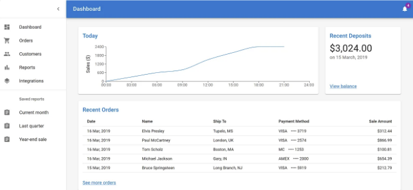
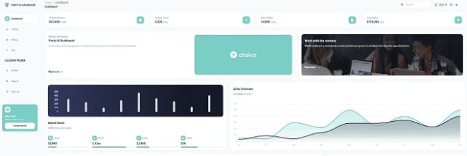
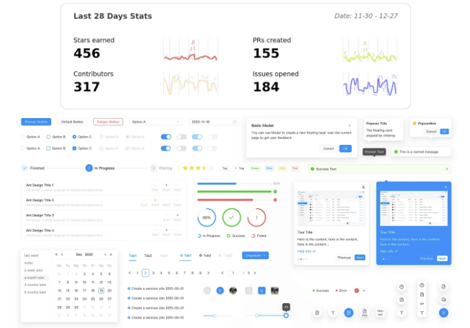
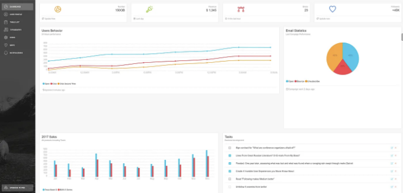
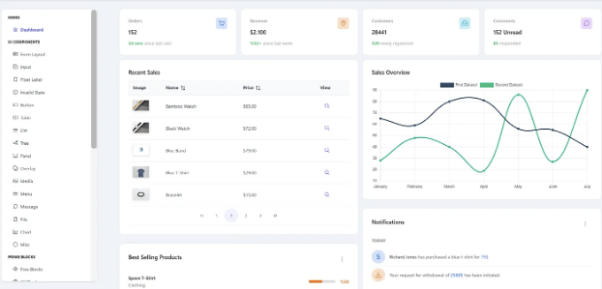

6개의 최고 React UI 컴포넌트 라이브러리 목록은 다음과 같습니다: Material UI, React-Bootstrap, Chakra UI, Ant Design, Blueprint UI 및 PrimeReact입니다. 더 많은 세부 정보를 여기에서 확인하세요!


React JS는 프론트엔드 프레임워크에서 우세하며, 개발자들이 매력적이고 동적인 사용자 경험을 쉽게 구축할 수 있게 합니다. React가 인기 있는 JavaScript 프레임워크이므로 다양한 UI 컴포넌트 라이브러리가 사용됩니다. 미리 만들어진 및 사용자 정의 가능한 UI 라이브러리는 개발 속도를 높이고 코드 재사용을 향상시키며, 정교한 사용자 경험을 제공합니다. 이 기사는 모든 개발자가 알아야 할 10가지 React 컴포넌트 라이브러리를 다룹니다.

# React 컴포넌트 라이브러리란?

<!-- ui-log 수평형 -->
<ins class="adsbygoogle"
  style="display:block"
  data-ad-client="ca-pub-4877378276818686"
  data-ad-slot="9743150776"
  data-ad-format="auto"
  data-full-width-responsive="true"></ins>
<component is="script">
(adsbygoogle = window.adsbygoogle || []).push({});
</component>

React UI 구성 요소 라이브러리는 리액트 애플리케이션에서 사용할 준비가 된 구성 요소 또는 디자인 요소가 포함된 소프트웨어 시스템 또는 도구 모음입니다.

React UI 구성 요소 라이브러리는 디자인 및 접근성 준수 요소와 블록을 제공하여 사용자 인터페이스 개발을 간단화합니다. 표, 차트, 모달, 내비게이션 바, 카드, 버튼, 지도 등이 모두 React UI 라이브러리에서 찾을 수 있는 구성 요소 또는 디자인 요소의 예시입니다. 이러한 즉시 사용 가능한 구성 요소는 우아하고 독특하게 디자인되어 있습니다.

또한 여러 도구를 사용하여 구성 요소를 개인화하고 앱에 포함시킬 수 있습니다. 예를 들어 코드를 작성하지 않고 그리드와 같은 구성 요소를 추가할 수 있습니다. 그 대신, 구성 요소 라이브러리를 활용하여 필요한 그리드를 찾고 조정하여 직접 추가할 수 있습니다.

# React UI 구성 요소 라이브러리 사용의 혜택과 도전과제

<!-- ui-log 수평형 -->
<ins class="adsbygoogle"
  style="display:block"
  data-ad-client="ca-pub-4877378276818686"
  data-ad-slot="9743150776"
  data-ad-format="auto"
  data-full-width-responsive="true"></ins>
<component is="script">
(adsbygoogle = window.adsbygoogle || []).push({});
</component>

# 혜택

- **속도**: React 컴포넌트 라이브러리는 각각의 코드를 작성하는 것보다 디자인 기능과 기능을 빠르고 쉽게 구현할 수 있게 해줍니다. 이는 개발 프로세스를 현저히 촉진시킵니다.
- **아름다운 UI**: 빠른 개발은 앱의 미적인 면을 희생시키지 않습니다. 따라서 UI 라이브러리에는 멋지게 디자인된 사용자 인터페이스 요소들이 포함되어 있어 응용 프로그램 구축 요소로서 준비되어 있습니다.
- **사용하기 쉬움**: CSS는 이해하기 어렵고 복잡한 사용자 인터페이스를 개발하는 데 문제가 있습니다. React UI 라이브러리는 심지어 초보자라도 CSS 걱정 없이 요소를 가져와 사용할 수 있게 해줍니다.
- **일관성**: React UI 컴포넌트 라이브러리는 일관된 모습과 느낌을 응용프로그램 전체에 제공하도록 도와줍니다.
- **성능**: 처음부터 컴포넌트를 디자인할 필요가 없어져 개발 속도가 빨라지며, 개발자들은 더 복잡한 기능에 집중할 수 있습니다.
- **맞춤화**: 이러한 라이브러리는 사용할 수 있는 요소를 제공하지만 프로젝트의 요구에 맞게 매우 맞춤화할 수 있습니다.
- **커뮤니티 지원**: 대규모 커뮤니티는 인기 있는 라이브러리의 지속적인 개발, 버그 수정, 문서화를 제공합니다. 대규모 커뮤니티 및 유지보수자가 React 컴포넌트 라이브러리를 지원합니다.
- **지원 및 접근성**: 사용자의 접근성 요구 사항을 충족하고 다양한 장치에 올바른 스타일을 가진 컴포넌트를 처음부터 구축하는 것은 어렵습니다. React UI 라이브러리는 이를 처리하고 이전 브라우저 지원을 제공합니다.
- **크로스 브라우저 호환성**: 모든 브라우저와 호환되는 CSS를 개발하는 것은 어려울 수 있습니다, 특히 새로운 CSS 속성이나 브라우저 도구를 사용하는 경우. 이로 인해 사용자 경험에 부정적인 영향을 줄 수 있습니다. React UI 라이브러리의 크로스 브라우저 호환성으로 모든 최신 브라우저에서 응용프로그램이 제대로 작동합니다.

# **도전**

**오해된 철학**

<!-- ui-log 수평형 -->
<ins class="adsbygoogle"
  style="display:block"
  data-ad-client="ca-pub-4877378276818686"
  data-ad-slot="9743150776"
  data-ad-format="auto"
  data-full-width-responsive="true"></ins>
<component is="script">
(adsbygoogle = window.adsbygoogle || []).push({});
</component>

각 UI 컴포넌트에는 각자의 이념이 있습니다. 제대로 구현하려면 이를 이해해야 합니다. 예를 들어 일부는 테마를 사용자 정의할 수 있는데, 다른 것들은 디자인을 따르고 기능을 구현하도록 요구할 수도 있습니다. 사용 사례에 맞는 올바른 방법을 선택해야 합니다.

일관성이 없는 사용

개발자들은 React UI 컴포넌트 라이브러리를 일관되게 활용하여 그 기능과 사용 방법을 알아야 합니다. 컴포넌트 라이브러리를 바꾸는 데 시간이 걸리기 때문에 한 가지에 충실하는 것이 좋습니다. 이는 이러한 라이브러리를 사용해본 적이 없는 새로운 개발자들에게 필요한 시간을 주기 위해서도 중요합니다.

결정된 선택

<!-- ui-log 수평형 -->
<ins class="adsbygoogle"
  style="display:block"
  data-ad-client="ca-pub-4877378276818686"
  data-ad-slot="9743150776"
  data-ad-format="auto"
  data-full-width-responsive="true"></ins>
<component is="script">
(adsbygoogle = window.adsbygoogle || []).push({});
</component>

프로젝트에 적합한 React UI 라이브러리를 선택하는 것은 유연해야 합니다. 사용 사례가 프로젝트에 가장 적합한 라이브러리를 결정합니다. 모든 라이브러리가 모든 프로젝트에 적합하지는 않을 수 있습니다. 어떤 라이브러리는 대시보드에 중점을 두고 있을 수 있고, 다른 라이브러리는 정적 페이지를 생성할 수도 있습니다. UI 구성 요소 선택은 유연해야 합니다.

# React 컴포넌트 라이브러리를 사용해야 하는 경우?

프로젝트에 적합한 React 컴포넌트 라이브러리를 선택해야 합니다. 외관보다 기능이 더 중요할 때 UI 컴포넌트를 사용하세요. 아래는 일반적인 UI 컴포넌트 라이브러리 사용 사례 몇 가지입니다.

- 컨셉 검증: 구현이 빠르기 때문에 UI 컴포넌트 라이브러리를 사용하면 프로토타이핑이 빨라집니다. 이를 통해 사용자 인터페이스를 구축하고 기능을 최소한의 자원으로 테스트할 수 있습니다.
- 디자이너 없는 프로젝트: 직관적인 디자인 아이디어가 있지만 디자인 지식이 부족한 경우가 있습니다. 컴포넌트 라이브러리를 활용하여 멋진 레이아웃과 풍부한 사용자 경험을 만들 수 있습니다.
- 관리 패널: 컴포넌트 라이브러리는 기능적이고 이해하기 쉬운 사용자 인터페이스를 만드는 데 도움이 됩니다. 이러한 라이브러리로 표준 업무용 애플리케이션을 구현할 수 있습니다.
- 이해관계 프로젝트: 모든 프로젝트 참여자가 동일한 페이지에 있음을 보장해야 합니다. 디자이너와 클라이언트가 라이브러리에 동의한 후, 계속하기 전에 이에 대한 장단점을 논의하세요. 먼저 라이브러리 기능을 설명하여 클라이언트 기대에 부응하는 방법을 이해시킵니다.

<!-- ui-log 수평형 -->
<ins class="adsbygoogle"
  style="display:block"
  data-ad-client="ca-pub-4877378276818686"
  data-ad-slot="9743150776"
  data-ad-format="auto"
  data-full-width-responsive="true"></ins>
<component is="script">
(adsbygoogle = window.adsbygoogle || []).push({});
</component>

# 당신의 프로젝트에 적합한 상위 6개의 React UI 컴포넌트 라이브러리

## Material UI (MUI)



Material UI는 구글의 Material Design 시각 언어를 사용하는 인기 있는 React UI 라이브러리입니다. 이를 통해 개발자들은 현대적인 디자인 표준을 준수하는 전문적으로 보이는 웹 애플리케이션을 만들 수 있습니다.

<!-- ui-log 수평형 -->
<ins class="adsbygoogle"
  style="display:block"
  data-ad-client="ca-pub-4877378276818686"
  data-ad-slot="9743150776"
  data-ad-format="auto"
  data-full-width-responsive="true"></ins>
<component is="script">
(adsbygoogle = window.adsbygoogle || []).push({});
</component>

이 React 컴포넌트 라이브러리를 직접 활용하거나 제작용 컴포넌트로 디자인 시스템을 가져올 수 있어요. 이 플랫폼은 제어력이나 유연성을 잃지 않고 더 빠르게 빌드할 수 있도록 도와줄 거예요. 고객을 만족시키는 멋진 디자인을 만들 수 있게 도와줄 거에요.

MUI React 컴포넌트 라이브러리는 몇 가지 중요한 요소를 가지고 있어요:

- NPM에서 주당 3백만 회 이상의 다운로드;
- GitHub에서 8만 개 이상의 스타;
- Twitter에서 1만 7천 명 이상의 팔로워;
- 2만 4천 명 이상의 오픈소스 기여자.

주요 기능:

<!-- ui-log 수평형 -->
<ins class="adsbygoogle"
  style="display:block"
  data-ad-client="ca-pub-4877378276818686"
  data-ad-slot="9743150776"
  data-ad-format="auto"
  data-full-width-responsive="true"></ins>
<component is="script">
(adsbygoogle = window.adsbygoogle || []).push({});
</component>

- 타이포그래피: MUI는 모든 텍스트 요소를 일관되게 스타일링하는 타이포그래피 원칙을 활용합니다.
- 아이콘: MUI는 애플리케이션의 시각적 요구에 맞는 아이콘 선택을 제공합니다. @mui/icons-material 패키지에서 아이콘을 가져올 수 있습니다.
- 폼 컨트롤: MUI는 텍스트 필드, 체크박스, 라디오 버튼, 선택 메뉴 등 다양한 폼 컴포넌트로 사용자 친화적인 폼을 쉽게 디자인할 수 있습니다.
- 테마: MUI를 통해 사용자는 다크 및 브라이트 모드를 지원하는 테마 토글링을 사용자 정의할 수 있습니다. ThemeProvider를 사용하면 테마를 개인화할 수 있습니다.

혜택:
- 미적 감각: MUI는 트렌디하고 우아한 디자인을 제공합니다. 직관적인 디자인 규칙을 활용하여 최고 수준의 미적 요소를 보장합니다.
- 맞춤화: MUI를 사용하면 빠르게 컴포넌트와 테마를 맞춤 설정할 수 있습니다.
- 접근성: MUI는 접근성을 우선시합니다. 기본 라이브러리 액세스를 통해 모든 사람을 위한 기능적인 앱을 구축하기 쉽습니다.
- 반응형 디자인: MUI 컴포넌트는 다양한 화면 크기와 디바이스에서 앱이 실행될 수 있도록 반응형으로 디자인되었습니다.
- 제품 준비된 멋진 컴포넌트: 버튼, 타이포그래피, 메뉴, 알림, 표 등과 같은 강력하고 아름다운 MUI 컴포넌트를 사용하여 최고의 디자인을 만들 수 있습니다. 필요에 따라 수정도 가능합니다.
- 비급한 문서: MUI는 2000명 이상의 기여자들이 개발 및 관리하는 포괄적인 문서를 보유하고 있습니다. 따라서 이 도구를 사용하는 방법을 배우는 것이 간단합니다. 궁금한 점이 있다면 이 문서가 도움이 될 것입니다.

설치:

<!-- ui-log 수평형 -->
<ins class="adsbygoogle"
  style="display:block"
  data-ad-client="ca-pub-4877378276818686"
  data-ad-slot="9743150776"
  data-ad-format="auto"
  data-full-width-responsive="true"></ins>
<component is="script">
(adsbygoogle = window.adsbygoogle || []).push({});
</component>

```js
// npm을 사용하여 설치
npm install @material-ui/core

// yarn을 사용하여 설치
yarn add @material-ui/core
```

사용법:

```js
import React from "react";
import ReactDOM from "react-dom";
import Button from "@material-ui/core/Button";

function App() {
  return (
    <Button variant="contained" color="primary">
      Hello World
    </Button>
  );
}

ReactDOM.render(<App />, document.querySelector("#app"));
```

# Chakra UI

<!-- ui-log 수평형 -->
<ins class="adsbygoogle"
  style="display:block"
  data-ad-client="ca-pub-4877378276818686"
  data-ad-slot="9743150776"
  data-ad-format="auto"
  data-full-width-responsive="true"></ins>
<component is="script">
(adsbygoogle = window.adsbygoogle || []).push({});
</component>



2019년 Segun Adebayo에 의해 만들어진 Chakra UI는 간결함, 모듈성, 접근성을 강조합니다.

React 컴포넌트 라이브러리 Chakra UI는 개발자에게 접근 가능하고 반응 형 웹 앱을 구축하기 위한 넓은 범위의 훅과 컴포넌트를 제공합니다. 애니메이션, 디스클로저 등과 같은 일반적인 UI 로직을 추상화하는 많은 사용자 정의 훅이 Chakra UI를 강력하게 만듭니다. 이러한 훅들은 복잡한 인터페이스를 간소화합니다.

우수한 기능과 성능으로 Chakra UI는 다음과 같은 사용자들 사이에서 인기를 얻고 있습니다:

<!-- ui-log 수평형 -->
<ins class="adsbygoogle"
  style="display:block"
  data-ad-client="ca-pub-4877378276818686"
  data-ad-slot="9743150776"
  data-ad-format="auto"
  data-full-width-responsive="true"></ins>
<component is="script">
(adsbygoogle = window.adsbygoogle || []).push({});
</component>

- 매월 130만 회 다운로드
- 19,700개의 GitHub 스타
- 7,400명의 디스코드 회원
- 10,000명의 핵심 기여자

주요 기능:

- 스타일 프롭: Chakra UI는 스타일 프롭으로 구성 요소를 스타일링합니다.
- 아이콘: Chakra UI에서 @chakra-ui/iconspackage의 아이콘을 사용할 수 있습니다.
- 양식 컨트롤: Chakra UI는 Textarea, Input, Checkbox와 같은 구성 요소를 제공하며 내장된 유효성 검사와 isDisabled, isInvalid 등의 양식 컨트롤을 포함합니다.
- 알림: Chakra UI의 Toast 및 Alert를 사용하여 상태 변경을 사용자에게 알립니다.
- 기본 테마: Chakra UI는 다크 모드를 지원합니다. 테마 색상을 원하는대로 조정할 수 있습니다.

혜택:

<!-- ui-log 수평형 -->
<ins class="adsbygoogle"
  style="display:block"
  data-ad-client="ca-pub-4877378276818686"
  data-ad-slot="9743150776"
  data-ad-format="auto"
  data-full-width-responsive="true"></ins>
<component is="script">
(adsbygoogle = window.adsbygoogle || []).push({});
</component>

- 간편함: Chakra UI는 사용하기 쉽고 이해하기 쉬워 개발자가 학습 곡선을 줄이고 개발에 집중할 수 있도록 돕습니다.
- 접근성: Chakra UI 컴포넌트는 WAI-ARIA 표준을 준수하여 앱을 쉽게 접근할 수 있도록 합니다.
- 사용자 정의: 스타일 속성은 모든 컴포넌트 스타일을 수정할 수 있습니다. 컴포넌트의 색상 및 간격은 자유롭게 사용자 정의할 수 있습니다.
- 중요한 UI 컴포넌트: Chakra UI는 버튼, 메뉴, 모달 및 폼을 포함한 웹 프로젝트용 맞춤형 React 컴포넌트를 제공합니다. 다양한 변형이 다른 목적을 위해 제공됩니다.
- 원활한 폼 통합: Chakra UI의 폼 컴포넌트는 React Hook Form, Formik 및 Final Form과 잘 작동합니다. 이를 통해 폼을 쉽게 적응 가능하고 접근 가능하게 만듭니다.
- 코딩 협업 도구: Chakra UI Figma 디자인 키트는 디자이너와 개발자 간의 디자인과 코드의 일관성을 보장합니다.
- 가벼우며 재사용 가능한 로직: 자동 코드 분할과 같은 내장 성능 측정을 통해 번들 크기를 줄입니다. 조합 가능한 컴포넌트 아키텍처는 응용 프로그램 전반에 걸쳐 로직을 최대한 재사용할 수 있도록 합니다.
- 문서: 사용 권고사항과 예시가 포함된 포괄적이고 잘 쓰여진 문서가 제공됩니다.
- 개발자 커뮤니티: 활발하고 성장하는 개발자 커뮤니티가 있습니다. 핵심 팀 외에도 약 100명의 개발자가 이 프로젝트에 기여하고 있어, 이 React 컴포넌트 라이브러리는 방대한 리소스와 업그레이드를 갖추게 될 것입니다.

설치:

```js
// npm 사용 시
npm i @chakra-ui/react @emotion/react@^11 @emotion/styled@^11 framer-motion@^4

// yarn 사용 시
yarn add @chakra-ui/react @emotion/react@^11 @emotion/styled@^11 framer-motion@^4
```

사용법:

<!-- ui-log 수평형 -->
<ins class="adsbygoogle"
  style="display:block"
  data-ad-client="ca-pub-4877378276818686"
  data-ad-slot="9743150776"
  data-ad-format="auto"
  data-full-width-responsive="true"></ins>
<component is="script">
(adsbygoogle = window.adsbygoogle || []).push({});
</component>

```js
import * as React from "react";

// ChakraProvider 컴포넌트 추가
import { ChakraProvider } from "@chakra-ui/react";

function App({ Component }) {
  // 2. 앱의 루트에서 사용
  return (
    <ChakraProvider>
      <Component />
    </ChakraProvider>
  );
}
```

# Ant Design (AntD)



Ant Design은 기업급 웹 애플리케이션 인터페이스를 구축하기 위한 React UI 컴포넌트 라이브러리입니다. 독점적인 디자인 언어는 Ant Financial의 제품 라인에서 광범위하게 활용됩니다.

<!-- ui-log 수평형 -->
<ins class="adsbygoogle"
  style="display:block"
  data-ad-client="ca-pub-4877378276818686"
  data-ad-slot="9743150776"
  data-ad-format="auto"
  data-full-width-responsive="true"></ins>
<component is="script">
(adsbygoogle = window.adsbygoogle || []).push({});
</component>

Ant Design은 대부분의 UI 요구를 충족시키기 위해 카테고리별로 50가지 이상의 일반 및 독특한 구성 요소를 갖추고 있습니다. TypeScript로 작성된 이러한 구성 요소들은 매주 추가되는 새로운 기능과 개선사항으로 자주 업데이트됩니다. Ant Design은 확장 가능한 기업 앱을 위한 사용자 정의 및 간단한 리액트 구성 요소를 제공합니다.

복잡한 비즈니스 도구 및 데이터 중심 경험을 디자인하는 팀은 다양한 구성 요소 선택, 강력한 테마 지원 및 능동적인 유지 보수를 좋아할 것입니다. Alibaba, Baidu, Tencent 등이 이 도구를 사용하고 있습니다.

기업 솔루션으로서 Ant Design은 풍부한 문서, 모베스트 프랙티스 및 전문적인 지원을 제공합니다. 2023년 1월 기준으로 다음과 같은 통계를 자랑합니다:

- GitHub에서 83,000개의 star;
- NPM에서 매주 1백만 회 이상의 다운로드.

<!-- ui-log 수평형 -->
<ins class="adsbygoogle"
  style="display:block"
  data-ad-client="ca-pub-4877378276818686"
  data-ad-slot="9743150776"
  data-ad-format="auto"
  data-full-width-responsive="true"></ins>
<component is="script">
(adsbygoogle = window.adsbygoogle || []).push({});
</component>

주요 기능:

- 국제화 지원: Ant Design은 전 세계 사용자를 위한 내장형 국제화를 제공하며 수십 개국의 언어를 지원합니다.
- 테마 사용자 정의: Ant Design을 사용하여 밝은 테마와 어두운 테마를 통합하고 테마 모드를 선택할 수 있습니다.
- 아이콘: Ant Design의 @ant-design/icons 패키지에는 다양한 종류의 아이콘이 포함되어 있습니다.
- 네비게이션 메뉴: 메뉴, 사이드바 등이 라이브러리에 포함되어 있습니다.
- 데이터 시각화: Ant Design은 차트 및 그래프와 같은 데이터 시각화 구성 요소를 제공합니다. 이러한 구성 요소는 @ant-design/charts 패키지에 포함되어 있습니다.
- 날짜 선택기 및 캘린더: 사용자 정의 가능한 날짜, 시간 및 캘린더 선택기도 제공됩니다.
- 팝오버 및 툴팁: 맥락에 맞는 정보를 표시합니다.

혜택:

- 사용자 정의: 테마를 적용하고 글꼴, 스타일 및 색상 구성을 변경하는 사용자 정의 컨트롤을 활용하여 원하는 디자인에 맞게 개인화할 수 있습니다.
- 접근성: 접근성 모범 사례를 준수하여 어떤 종류의 사용자에게도 만들 수 있습니다.
- 폼 컨트롤: 강력한 폼 유효성 검사 기능을 통해 폼 유효성 검사 로직을 간편하게 최적화할 수 있습니다.
- 미학적 한산함: 구성 요소는 깔끔하고 가벼우며 간단한 비주얼 디자인을 제공하여 복잡하지 않은 인터페이스에 적합합니다.
- 커뮤니티 지원: 다수의 열정적인 개발자 커뮤니티가 라이브러리를 지원하며 원활한 운영을 유지하고 새로운 개선사항을 이어갑니다. 건설을 돕기 위한 기사도 제공됩니다.
- 기업용 등급: 기업 앱을 위해 설계되었으며 전문적이고 잘 디자인된 외관을 제공합니다.
- 완전한 문서 및 액세스: 포괄적인 문서, 최선의 실천 지침, API 참조자료 및 기업 지원을 제공합니다. 모든 사용자가 사용할 수 있는 인터페이스용 포괄적인 디자인과 접근성 표준을 활용합니다.

<!-- ui-log 수평형 -->
<ins class="adsbygoogle"
  style="display:block"
  data-ad-client="ca-pub-4877378276818686"
  data-ad-slot="9743150776"
  data-ad-format="auto"
  data-full-width-responsive="true"></ins>
<component is="script">
(adsbygoogle = window.adsbygoogle || []).push({});
</component>

설치:

```js
// npm을 사용하여 설치
npm install antd

// yarn을 사용하여 설치
yarn add antd
```

사용:

```js
// 아래 import 문을 사용하여 스타일 시트를 수동으로 가져옵니다.
import 'antd/dist/antd.css'; // 또는 'antd/dist/antd.less'

import { DatePicker } from 'antd';

ReactDOM.render(<DatePicker />, mountNode);
```  

<!-- ui-log 수평형 -->
<ins class="adsbygoogle"
  style="display:block"
  data-ad-client="ca-pub-4877378276818686"
  data-ad-slot="9743150776"
  data-ad-format="auto"
  data-full-width-responsive="true"></ins>
<component is="script">
(adsbygoogle = window.adsbygoogle || []).push({});
</component>

# 리액트-부트스트랩



트위터에서 Mark Otto와 Jacob Thornton이 만든 부트스트랩은 원래 트위터 블루프린트라 불렸습니다. 부트스트랩은 리액트보다 2년 더 오래되었습니다. 반응형이고 모바일을 우선으로 하는 프론트엔드 웹사이트 및 앱을 구축하기 위한 오픈 소스 CSS 프레임워크인 부트스트랩은 인기를 얻고 있습니다.

리액트-부트스트랩은 부트스트랩과 약간 다르지만 유사합니다. 리액트-부트스트랩은 부트스트랩 자바스크립트를 대체하고 각 컴포넌트를 불필요한 jQuery와 같은 의존성 없이 리액트 컴포넌트로 처음부터 구축합니다.

<!-- ui-log 수평형 -->
<ins class="adsbygoogle"
  style="display:block"
  data-ad-client="ca-pub-4877378276818686"
  data-ad-slot="9743150776"
  data-ad-format="auto"
  data-full-width-responsive="true"></ins>
<component is="script">
(adsbygoogle = window.adsbygoogle || []).push({});
</component>

React-Bootstrap은 간단하게 생성할 수 있는 27가지 일관된 핵심 부트스트랩 호환 구성 요소가 있습니다.

- GitHub에서 약 21, Github 스타를 받았습니다.
- NPM에서 매주 130만 회 이상 다운로드되었습니다.

주요 기능:

- 부트스트랩 구성 요소: React-Bootstrap에는 버튼, 폼, 내비게이션, 모달 등 다양한 부트스트랩 구성 요소가 포함되어 있습니다.
- 테마: 부트스트랩 SASS 변수는 테마 지원을 제공합니다.
- 접근성: 모든 구성 요소는 접근 가능하며 접근성 가이드라인을 준수합니다.
- 폼: React-Bootstrap 폼을 사용하여 폼 유효성을 검사할 수 있습니다.
- React Hooks 지원: React-Bootstrap 구성 요소는 React 훅을 지원합니다. 상태를 React-Bootstrap 구성 요소 내에서 프롭으로 전달하여 상태 및 효과 관리를 간소화할 수 있습니다.

<!-- ui-log 수평형 -->
<ins class="adsbygoogle"
  style="display:block"
  data-ad-client="ca-pub-4877378276818686"
  data-ad-slot="9743150776"
  data-ad-format="auto"
  data-full-width-responsive="true"></ins>
<component is="script">
(adsbygoogle = window.adsbygoogle || []).push({});
</component>

혜택:

- 반응형 디자인: React-Bootstrap 그리드 프레임워크를 사용하는 웹 앱은 다양한 화면 크기와 기기에서 잘 작동하는 반응형 앱입니다. Flexbox를 기반으로 제작되어 반응형이며 유연합니다.
- 가벼움: 전체 라이브러리를 가져오는 대신 필요한 구성 요소만 가져오면 응용 프로그램 코드 양이 줄어듭니다. 또한 시간을 절약할 수 있습니다.
- 사용자 정의: React-Bootstrap을 사용하면 개발자가 구성 요소를 수정하고 확장하여 앱 디자인에 맞게 조정할 수 있습니다.
- 커뮤니티 지원: React-Bootstrap은 도서관 문서를 상세히 제공합니다. 방대한 활성 커뮤니티로 인해 온라인 튜토리얼과 리소스를 활용하여 라이브러리를 사용하는 데 도움을 받을 수 있습니다.

설치:

```js
// npm으로 설치
npm install react-bootstrap bootstrap

// yarn으로 설치
yarn add react-bootstrap bootstrap
```

<!-- ui-log 수평형 -->
<ins class="adsbygoogle"
  style="display:block"
  data-ad-client="ca-pub-4877378276818686"
  data-ad-slot="9743150776"
  data-ad-format="auto"
  data-full-width-responsive="true"></ins>
<component is="script">
(adsbygoogle = window.adsbygoogle || []).push({});
</component>

사용 방법:

```js
import React, { useState } from "react";

import Jumbotron from "react-bootstrap/Jumbotron";
import Toast from "react-bootstrap/Toast";
import Container from "react-bootstrap/Container";
import Button from "react-bootstrap/Button";

import "./App.css";

const ExampleToast = ({ children }) => {
  const [show, toggleShow] = useState(true);

  return (
    <>
      {!show && <Button onclick={() => toggleShow(true)}>Show Toast</Button>}
      <Toast show={show} onclose={() => toggleShow(false)}>
        <Toast.Header>
          <strong className="mr-auto">React-Bootstrap</strong>
        </Toast.Header>
        <Toast.Body>{children}</Toast.Body>
      </Toast>
    </>
  );
};

const App = () => (
  <Container className="p-3">
    <Jumbotron>
      <h1 className="header">React-Bootstrap에 오신 것을 환영합니다!</h1>
      <ExampleToast>
        우리는 이제 토스트 메시지를 가지고 있어요
        <span role="img" aria-label="tada"></span>
      </ExampleToast>
    </Jumbotron>
  </Container>
);

export default App;
```

# Blueprint UI

Palantir Technologies가 개발한 오픈 소스 프로젝트인 Blueprint UI는 고품질 UI 구성 요소를 제공합니다. Blueprint은 복잡한 데이터 밀도 높은 데스크톱 인터페이스를 디자인하기 위한 React 기반 UI 툴킷입니다. 데스크톱 앱을 개발하고 싶다면 이 React 컴포넌트 라이브러리가 이상적입니다.

<!-- ui-log 수평형 -->
<ins class="adsbygoogle"
  style="display:block"
  data-ad-client="ca-pub-4877378276818686"
  data-ad-slot="9743150776"
  data-ad-format="auto"
  data-full-width-responsive="true"></ins>
<component is="script">
(adsbygoogle = window.adsbygoogle || []).push({});
</component>

핵심 Blueprint NPM 패키지에는 버튼, 카드, 메뉴, 폼 그룹, 파일 입력 등 30개 이상의 친숙하고 독특한 리액트 컴포넌트가 포함되어 있어요.

날짜용 Datetime 및 Datetime2, 300개 이상의 벡터 UI 아이콘을 갖춘 아이콘, 목록에서 항목 선택을 위한 셀렉트 및 테이블, 상호작용 스프레드시트 인터페이스 작성을 위한 다른 Blueprint NPM 패키지도 있어요.

Blueprint UI는 다음과 같이 매우 인기가 있어요:

- GitHub에서 20,000개 이상의 스타;
- NPM에서 주간 다운로드 190,000회 이상.

<!-- ui-log 수평형 -->
<ins class="adsbygoogle"
  style="display:block"
  data-ad-client="ca-pub-4877378276818686"
  data-ad-slot="9743150776"
  data-ad-format="auto"
  data-full-width-responsive="true"></ins>
<component is="script">
(adsbygoogle = window.adsbygoogle || []).push({});
</component>

주요 특징:

- 아이콘: Blueprint UI의 @blueprintjs/icons패키지는 2가지 크기(16px 및 20px)와 2가지 형식(SVG 및 폰트)으로 500개 이상의 벡터 아이콘을 제공합니다. 이러한 아이콘은 React 앱에서 쉽게 활용할 수 있습니다.
- 접근성: Blueprint에는 접근 가능한 구성 요소와 ARIA 속성 및 역할이 포함되어 있습니다.
- 양식 컨트롤: 양식 항목은 제어되고 유효성이 검사됩니다.
- 오버레이: Blueprint 오버레이인 토스트, 툴팁, 알림, 팝오버 등을 통해 개발자는 문맥에 맞는 정보 및 오류 메시지를 표시할 수 있습니다.
- 날짜 및 시간: Blueprint은 개발자가 날짜 선택기, 범위 선택기 및 시간 선택기로 시간 및 날짜 상호 작용을 설계할 수 있도록 합니다.
- 국제화: Blueprint UI는 국제화를 간단하게 하여 다른 언어 및 지역을 위해 앱을 설계합니다. 히브리어와 아랍어는 .bp5-rtl을 사용하여 오른쪽에서 왼쪽으로 작성됩니다.

픽셀 스트리밍, 혼합 현실 캡처, 매직 립 생성, 다중 사용자 편집, 파노라마 캡처, 혼돈 파괴 등이 기타 가치 있는 기능들입니다.

혜택:

<!-- ui-log 수평형 -->
<ins class="adsbygoogle"
  style="display:block"
  data-ad-client="ca-pub-4877378276818686"
  data-ad-slot="9743150776"
  data-ad-format="auto"
  data-full-width-responsive="true"></ins>
<component is="script">
(adsbygoogle = window.adsbygoogle || []).push({});
</component>

- 개발자 친화적: Blueprint의 정교한 UI를 통해 개발자들은 다양한 구성 요소와 모듈을 활용한 복잡한 기능이 풍부한 웹 인터페이스를 디자인할 수 있습니다. 매뉴얼 문서는 직관적입니다. 예시를 통한 개념 설명과 튜토리얼이 제공됩니다.
- 성능: Blueprint은 성능에 중점을 둔 라이브러리입니다.
- 사용자 정의: CSS를 사용하여 개발자들은 각 구성 요소를 쉽게 프로젝트에 맞게 사용자 정의할 수 있습니다. 라이브러리의 타이포그래피, 색 구성표, 스타일을 변경할 수 있습니다.
- 접근성: Blueprint은 가장 접근성이 높은 라이브러리 중 하나입니다. npm을 이용한 설치는 간단합니다. Blueprint은 접근성 표준과 원칙을 준수하여 접근성을 우선시합니다.
- 테마: 다양한 테마가 부족하지만, 다크 모드와 라이트 모드와 같은 두 가지 구분된 테마를 제공합니다. 또한 색 구성표, 클래스, 타이포그래피 등 다른 디자인 구성 요소를 포함합니다.
- 실시간 합성: Composer 도구를 사용하여 실시간 합성을 수행하고 앱의 사용자 인터페이스를 개선할 수 있습니다.

설치:

```js
// npm을 사용한 설치
npm install @blueprintjs/core

// yarn을 사용한 설치
yarn add @blueprintjs/core
```

사용 방법:

<!-- ui-log 수평형 -->
<ins class="adsbygoogle"
  style="display:block"
  data-ad-client="ca-pub-4877378276818686"
  data-ad-slot="9743150776"
  data-ad-format="auto"
  data-full-width-responsive="true"></ins>
<component is="script">
(adsbygoogle = window.adsbygoogle || []).push({});
</component>

```js
import { Button } from "@blueprintjs/core";

<Button intent="success" text="버튼 내용" onClick={incrementCounter} />
```

# PrimeReact



PrimeReact는 메르세데스, 이베이, 엔비디아, 인텔, 아메리칸 익스프레스, 루프트한자 등의 글로벌 기업들이 사용하는 광범위한 React 컴포넌트 라이브러리입니다. 이 앱은 2022년부터 2023년 사이에 인기를 얻었습니다(주간 다운로드 수가 39.5k에서 78.7k로 증가).```

<!-- ui-log 수평형 -->
<ins class="adsbygoogle"
  style="display:block"
  data-ad-client="ca-pub-4877378276818686"
  data-ad-slot="9743150776"
  data-ad-format="auto"
  data-full-width-responsive="true"></ins>
<component is="script">
(adsbygoogle = window.adsbygoogle || []).push({});
</component>

90개 이상의 React 컴포넌트가 앱에서 사용할 수 있습니다. TreeSelect, 조직도, 터미널, 그리고 Captcha는 제공하는 특별한 컴포넌트 중 일부입니다. PrimeReact는 커스터마이즈 가능한 템플릿과 280여가지의 복사해서 붙여 넣을 수 있는 UI 요소를 제공하여 어떤 인터페이스든 신속하게 구축할 수 있습니다.

디자인에 구약적인 인프라는 Material이나 Bootstrap과 같은 인기있는 라이브러리의 룩 앤 필을 사용하거나 자체 룩 앤 필을 구성할 수 있습니다. GUI 기반의 테마 디자이너에는 500여 가지 변수가 포함되어 있어 사용자 정의 가능합니다.

기능 또는 향상 요청에 대한 도움과 답변은 업무일 내에 제공됩니다.

주요 기능:

<!-- ui-log 수평형 -->
<ins class="adsbygoogle"
  style="display:block"
  data-ad-client="ca-pub-4877378276818686"
  data-ad-slot="9743150776"
  data-ad-format="auto"
  data-full-width-responsive="true"></ins>
<component is="script">
(adsbygoogle = window.adsbygoogle || []).push({});
</component>

- 데이터 테이블: PrimeReact 데이터 테이블에서는 정렬, 필터링 및 페이지네이션이 가능합니다.
- 양식 입력: 사전 유효성 검사된 체크박스, 라디오 버튼 및 날짜 선택기를 PrimeReact 양식 입력으로 제공합니다.
- 차트: 사용자 정의 가능한 막대, 선 및 원 차트를 PrimeReact에서 이용할 수 있습니다.
- 내비게이션 메뉴: PrimeReact는 브레드크럼과 탭 메뉴를 지원합니다.
- 풍부한 텍스트 편집기: PrimeReact의 풍부한 텍스트 편집기는 내용 및 텍스트 포맷팅 앱에 통합됩니다.
- 지연 로딩: PrimeReact 컴포넌트는 성능 향상을 위해 지연 로딩될 수 있습니다.
- 위젯: PrimeReact 라이브러리에는 슬라이더, 진행 막대 및 배지가 있습니다.
- 아이콘: PrimeReact는 자체 아이콘을 PrimeIcons에 포장합니다.
- 훅: 훅은 PrimeReact 지원의 primereact/hooks 패키지에서 가져와 사용할 수 있습니다.
- 오버레이: PrimeReact는 오버레이 툴팁과 팝업 컴포넌트를 제공하여 상황에 맞는 정보와 모달 메시지를 표시할 수 있습니다.

장점:

- 컴포넌트: PrimeReact는 입력 필드, 버튼, 차트 및 미디어 케로셀과 같은 기본부터 복잡한 컴포넌트를 제공합니다.
- 템플릿: PrimeReact는 사용자 정의 가능한 프로젝트 템플릿을 제공합니다. 앱에서도 그들의 직관적인 아이콘을 수십 개 사용할 수 있습니다.
- 테마: Primreact의 테마를 사용하여 컴포넌트의 외모와 동작을 사용자 정의할 수 있습니다. 선택할 수 있는 다양한 테마가 제공됩니다.
- 반응형: PrimeReact는 기본적으로 반응형으로 제공되어, 모든 화면 크기에서 앱이 잘 보이도록 도와줍니다.
- 접근성: PrimeReact는 접근성 표준을 준수하여 누구나 사용할 수 있는 앱을 만들 수 있는 컴포넌트를 제공합니다.

설치:

<!-- ui-log 수평형 -->
<ins class="adsbygoogle"
  style="display:block"
  data-ad-client="ca-pub-4877378276818686"
  data-ad-slot="9743150776"
  data-ad-format="auto"
  data-full-width-responsive="true"></ins>
<component is="script">
(adsbygoogle = window.adsbygoogle || []).push({});
</component>

```js
// npm을 통해 설치
npm install primereact

// yarn을 통해 설치
yarn add primereact
```

사용법:

```js
// 아래 import 문을 사용하여 스타일 시트를 수동으로 가져옵니다.
import "primereact/resources/themes/lara-light-cyan/theme.css";

import { Button } from "primereact/button";

function MyButton() {
  return (
    <>
      <Button icon="pi pi-check" />

      <Button label="제출" icon="pi pi-check" />

      <Button label="제출" icon="pi pi-check" iconPos="right" />
    </>
  );
}
```

# React 컴포넌트 라이브러리를 선택할 때 고려해야 할 요소

<!-- ui-log 수평형 -->
<ins class="adsbygoogle"
  style="display:block"
  data-ad-client="ca-pub-4877378276818686"
  data-ad-slot="9743150776"
  data-ad-format="auto"
  data-full-width-responsive="true"></ins>
<component is="script">
(adsbygoogle = window.adsbygoogle || []).push({});
</component>

리액트 컴포넌트 라이브러리를 선택할 때 여러 가지 기준을 고려해보세요:

- 프로젝트 요구사항: 라이브러리가 프로젝트에서 필요로 하는 컴포넌트와 기능을 제공할 수 있는가요? 프로젝트의 규모, 유형 및 요구 사항을 고려해보세요. 예를 들어, 대규모 기업 앱은 고복잡도를 지원하는 라이브러리가 필요할 수 있습니다.
- 장기적 안정성: 라이브러리가 자주 업데이트되는가요? 나중에도 지원이 계속될까요? 잘 유지보수되는 라이브러리를 선택하면 라이브러리 이전을 피할 수 있습니다.
- 사용자 정의 가능성: 브랜드 디자인과 일치하도록 라이브러리를 사용자 정의할 수 있나요? 일부 라이브러리는 더 많은 사용자 정의 기능을 제공합니다. 디자인 요구 사항이 있는 경우 사용자 정의 가능한 라이브러리를 선택하세요.
- 접근성: 라이브러리는 WAI-ARIA와 같은 접근성 관련 가이드라인을 따르는가요? 이는 화면 낭독기와 잘 작동하는 컴포넌트를 보장합니다.
- 커뮤니티: 라이브러리에 크고 활발한 커뮤니티가 있는가요? 다양한 커뮤니티는 여러분이 문제를 해결하는 데 도움을 줄 수 있습니다.
- 문서화: 라이브러리는 좋은 문서화를 가지고 있나요? 좋은 문서로 배우고 라이브러리를 활용하며 어려움을 해결하기가 더 쉬워집니다.
- 성능: 라이브러리는 얼마나 잘 작동하는가요? 다른 라이브러리와 비교했을 때 일부 라이브러리가 더 우수한 성능을 보여줍니다. 빠르고 반응성이 뛰어난 리액트 컴포넌트 라이브러리를 찾고 있다면 명성 있는 라이브러리를 선택하세요.

# 결론

리액트 컴포넌트 라이브러리를 최종 선택하기 전에 프로젝트의 요구사항, 디자인 목표 및 기술적 제한과 얼마나 잘 일치하는지 곰곰히 생각해보세요. 선택하는 라이브러리는 개발 시간, 유지보수 용이성 및 전체 사용자 경험에 모두 영향을 미칩니다.

<!-- ui-log 수평형 -->
<ins class="adsbygoogle"
  style="display:block"
  data-ad-client="ca-pub-4877378276818686"
  data-ad-slot="9743150776"
  data-ad-format="auto"
  data-full-width-responsive="true"></ins>
<component is="script">
(adsbygoogle = window.adsbygoogle || []).push({});
</component>

위에서 여러 유명한 React UI 디자인 키트를 살펴보고 주요 기능과 장점을 개요로 정리했습니다. 이 새로운 이해를 바탕으로, 다음 React 프로젝트에 적합한 React 구성 요소 라이브러리를 자신 있게 선택할 수 있을 것입니다! 결정을 내릴 때는 프로젝트의 특정 요구 사항을 항상 고려해야 합니다.

`Relia Software`의 정보를 얻을 수 있는 곳이에요! 😉✨