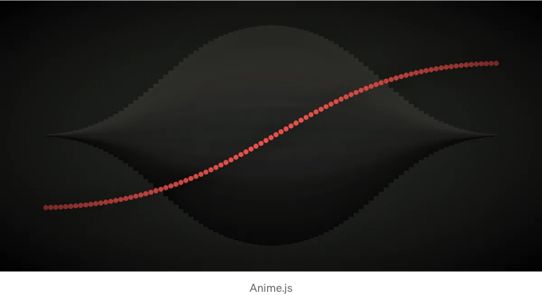

홈 JavaScript 2023년 프런트엔드 및 백엔드 개발자를 위한 가장 인기 있는 JavaScript 라이브러리 상위 9개

프런트엔드 또는 백엔드 개발자로서, 여러분이 가장 중요하게 여길 도구 중 하나는 JavaScript 라이브러리일 것입니다. 그러나 다양한 옵션이 많은 만큼, 당신에게 알맞은 JavaScript 라이브러리를 선택하는 것은 어려울 수 있습니다.

최근 몇 년간 JavaScript 라이브러리는 프런트엔드 및 백엔드 개발자들 사이에서 점점 더 인기를 얻고 있습니다. 이 인기에는 여러 이유가 있지만, 그 중에서도 가장 중요한 이유 중 하나는 JavaScript 라이브러리를 사용하면 개발이 더 효율적이고 빠르게 처리된다는 것입니다.

<!-- ui-log 수평형 -->
<ins class="adsbygoogle"
  style="display:block"
  data-ad-client="ca-pub-4877378276818686"
  data-ad-slot="9743150776"
  data-ad-format="auto"
  data-full-width-responsive="true"></ins>
<component is="script">
(adsbygoogle = window.adsbygoogle || []).push({});
</component>

Javascript 라이브러리는 지속적으로 업데이트되므로 개발자들은 최신 버전을 따라가야 합니다. 라이브러리를 사용하면 코드가 최신 브라우저 표준과 호환되는지 확인할 수 있습니다.

본 문서에서는 2023년을 위한 프런트엔드와 백엔드 개발자를 위한 가장 인기 있는 자바스크립트 라이브러리 몇 가지를 살펴보겠습니다. 다양한 옵션이 제공되므로 귀하의 요구에 맞는 완벽한 라이브러리가 있을 것입니다.

# 학습 목표

- 자바스크립트 라이브러리란 무엇인가
- 자바스크립트 라이브러리의 중요성
- 2023년을 위한 최고 인기 자바스크립트 라이브러리 목록
- 결론

<!-- ui-log 수평형 -->
<ins class="adsbygoogle"
  style="display:block"
  data-ad-client="ca-pub-4877378276818686"
  data-ad-slot="9743150776"
  data-ad-format="auto"
  data-full-width-responsive="true"></ins>
<component is="script">
(adsbygoogle = window.adsbygoogle || []).push({});
</component>

# 자바스크립트 라이브러리란 무엇인가요

자바스크립트 라이브러리는 특정 작업을 쉽게 수행할 수 있게 해주는 코드 모음입니다. 일반적으로 라이브러리 코드는 자바스크립트를 잘 이해하는 사람이 작성하고, 다른 사람들이 처음부터 시작할 필요가 없도록 지식을 공유하고자 하는 경우에 사용됩니다.

다양한 라이브러리가 있으며, 각각의 라이브러리는 고유한 초점을 갖고 있습니다. jQuery, React 및 Angular와 같은 인기 있는 라이브러리도 있습니다. 대부분의 라이브러리는 무료로 사용할 수 있지만, 일부는 상업적으로 사용하기 위해 라이선스가 필요할 수 있습니다.

# 자바스크립트 라이브러리가 중요한 이유

<!-- ui-log 수평형 -->
<ins class="adsbygoogle"
  style="display:block"
  data-ad-client="ca-pub-4877378276818686"
  data-ad-slot="9743150776"
  data-ad-format="auto"
  data-full-width-responsive="true"></ins>
<component is="script">
(adsbygoogle = window.adsbygoogle || []).push({});
</component>

자바스크립트 라이브러리는 코드가 조직되지 않을 경우에 구조를 제공하기 때문에 중요합니다. 또한 작업을 완료하는 데 사용할 수 있는 미리 작성된 코드를 제공하여 시간과 에너지를 절약할 수 있습니다.

게다가, 자바스크립트 라이브러리는 웹사이트나 앱에 구현되기 전에 코드를 테스트하는 데 사용할 수 있습니다. 이를 통해 코드가 의도한대로 작동하고 오류를 조기에 발견할 수 있도록 도와줍니다.

자바스크립트 라이브러리는 무엇에 사용되나요?

# 2023년에 가장 인기 있는 자바스크립트 라이브러리 목록

<!-- ui-log 수평형 -->
<ins class="adsbygoogle"
  style="display:block"
  data-ad-client="ca-pub-4877378276818686"
  data-ad-slot="9743150776"
  data-ad-format="auto"
  data-full-width-responsive="true"></ins>
<component is="script">
(adsbygoogle = window.adsbygoogle || []).push({});
</component>

# 1. React.js

React.js는 사용자 인터페이스와 웹 애플리케이션을 만드는 데 사용되는 자바스크립트 라이브러리입니다. 코드를 더 읽기 쉽게 만들어주고 재사용 가능한 구성 요소를 만드는 데 도움이 되어 개발자들 사이에서 인기가 높습니다.

React는 사용자 인터페이스를 구축하기 위한 자바스크립트 라이브러리입니다. 오늘날 개발자들이 많이 사용하는 가장 인기 있는 자바스크립트 라이브러리 중 하나입니다.

<!-- ui-log 수평형 -->
<ins class="adsbygoogle"
  style="display:block"
  data-ad-client="ca-pub-4877378276818686"
  data-ad-slot="9743150776"
  data-ad-format="auto"
  data-full-width-responsive="true"></ins>
<component is="script">
(adsbygoogle = window.adsbygoogle || []).push({});
</component>

React는 성능이 우수하고 재사용 가능한 컴포넌트를 생성할 수 있는 기능, 선언적 문법 및 서버 측 렌더링을 지원하는 등 많은 기능을 가지고 있어 개발자들에게 매력적으로 다가갑니다.

게다가 React.js는 배우기 쉽고 API가 간단합니다. 이러한 이유로 많은 개발자들이 React.js를 사용하여 웹 애플리케이션을 만듭니다.

## 혜택과 기능

# 2. jQuery

<!-- ui-log 수평형 -->
<ins class="adsbygoogle"
  style="display:block"
  data-ad-client="ca-pub-4877378276818686"
  data-ad-slot="9743150776"
  data-ad-format="auto"
  data-full-width-responsive="true"></ins>
<component is="script">
(adsbygoogle = window.adsbygoogle || []).push({});
</component>

## 혜택 및 특징

- HTML/DOM 조작
- CSS 조작
- HTML 이벤트 메서드
- JSON 파싱
- 확장성
- 효과 및 애니메이션
- AJAX
- 유틸리티
- 애니메이션 및 효과
- JavaScript 플러그인
- DOM 탐색 및 수정

# 3. moment.js

<!-- ui-log 수평형 -->
<ins class="adsbygoogle"
  style="display:block"
  data-ad-client="ca-pub-4877378276818686"
  data-ad-slot="9743150776"
  data-ad-format="auto"
  data-full-width-responsive="true"></ins>
<component is="script">
(adsbygoogle = window.adsbygoogle || []).push({});
</component>

## 혜택과 기능

- 날짜 구문 분석
- 가져오기/설정
- 날짜 쿼리
- 유효하지 않은 날짜 감지
- 형식화된 날짜 표시
- 지속 기간
- 국제화
- 사용자 정의
- 날짜 유효성 검사
- 조작
- 유틸리티
- 날짜 추가 및 뺄셈

# 4. Popper.js

<!-- ui-log 수평형 -->
<ins class="adsbygoogle"
  style="display:block"
  data-ad-client="ca-pub-4877378276818686"
  data-ad-slot="9743150776"
  data-ad-format="auto"
  data-full-width-responsive="true"></ins>
<component is="script">
(adsbygoogle = window.adsbygoogle || []).push({});
</component>

## 혜택과 기능들

- 가벼운 라이브러리
- 고급 구성 가능성
- 처음부터 툴팁
- 요소의 위치 지정
- 작은 크기
- 통합 생성
- UI 작성
- 오버플로우 감지
- 실제 DOM 대신 가상 요소 사용

# 5. D3.js

<!-- ui-log 수평형 -->
<ins class="adsbygoogle"
  style="display:block"
  data-ad-client="ca-pub-4877378276818686"
  data-ad-slot="9743150776"
  data-ad-format="auto"
  data-full-width-responsive="true"></ins>
<component is="script">
(adsbygoogle = window.adsbygoogle || []).push({});
</component>

Data-Driven Documents (D3.js)은 브라우저에서 인터랙티브한 데이터 시각화를 만들 수 있는 자바스크립트 라이브러리입니다. 많은 코드를 작성하지 않아도 복잡한 시각화를 만들 수 있는 소수의 라이브러리 중 하나이기 때문에 중요합니다.

또한 사용하기 쉽고 사용자 및 개발자들로 이루어진 커뮤니티가 크기 때문에 질문에 답변해주고 지원을 제공해줄 수 있습니다.

이 라이브러리는 인터랙티브한 시각화를 제공하고 개발자가 매력적이고 유익한 웹사이트를 만드는 데 도움이 되기 때문에 중요합니다.

D3.js는 차트, 그래프 및 데이터의 다른 시각적 표현물을 만드는 데 사용됩니다. 이 라이브러리는 또한 지도 및 기타 인터랙티브 애플리케이션을 만드는 데 사용됩니다.

<!-- ui-log 수평형 -->
<ins class="adsbygoogle"
  style="display:block"
  data-ad-client="ca-pub-4877378276818686"
  data-ad-slot="9743150776"
  data-ad-format="auto"
  data-full-width-responsive="true"></ins>
<component is="script">
(adsbygoogle = window.adsbygoogle || []).push({});
</component>

D3는 HTML, SVG 및 CSS를 사용하여 데이터를 활발하게 만드는 데 도움이 됩니다. D3의 웹 표준에 대한 강조는 전용 프레임워크에 구속되지 않고 현대 브라우저의 모든 기능을 제공합니다.

D3를 사용하면 임의의 데이터를 문서 객체 모델(DOM)에 바인딩하고, 그런 다음 데이터 기반 변환을 문서에 적용할 수 있습니다.

## 혜택 및 기능

- 오픈 소스
- 데이터 시각화를 위한 전문적이고 최고의 도구
- 데이터 기반 접근
- DOM 조작
- 애니메이션 및 상호 작용을 위한 데이터 집합
- Angular.js, React.js 또는 Ember.js와 같은 프레임워크와 함께 사용 가능
- D3는 가벼움
- HTML, CSS 및 SVG와 같은 웹 표준과 함께 작동하므로 디버깅 도구가 필요 없음
- 대규모 데이터 세트와 잘 작동함

<!-- ui-log 수평형 -->
<ins class="adsbygoogle"
  style="display:block"
  data-ad-client="ca-pub-4877378276818686"
  data-ad-slot="9743150776"
  data-ad-format="auto"
  data-full-width-responsive="true"></ins>
<component is="script">
(adsbygoogle = window.adsbygoogle || []).push({});
</component>

# 6. anime.js

만약 웹 프로젝트에 애니메이션을 넣고 싶다면, anime.js를 활용해보세요. 이 강력하고 쉽게 사용할 수 있는 JavaScript 라이브러리는 몇 줄의 코드로 복잡한 애니메이션을 만들 수 있게 해줍니다.

jQuery 기반으로 만들어진 이 인기 있는 라이브러리는 이벤트 처리 및 AJAX 지원과 같은 jQuery의 모든 기능을 활용할 수 있습니다.

<!-- ui-log 수평형 -->
<ins class="adsbygoogle"
  style="display:block"
  data-ad-client="ca-pub-4877378276818686"
  data-ad-slot="9743150776"
  data-ad-format="auto"
  data-full-width-responsive="true"></ins>
<component is="script">
(adsbygoogle = window.adsbygoogle || []).push({});
</component>

## 혜택 및 기능

- Chrome, Safari, Firefox, Opera 등과 호환됩니다.
- 다양한 애니메이션에 사용할 수 있습니다.
- 가벼움
- 사용하기 쉬움
- CSS, DOM, 자바스크립트를 활용함
- 복잡한 애니메이션에 사용 가능
- 43,000개의 GitHub 스타와 4,000개의 GitHub 포크를 가진 오픈 소스입니다.

# 7. chart.js

Chart.js는 강력하고 유연한 오픈 소스 차트 라이브러리입니다. JavaScript를 사용하여 선, 막대, 파이 등과 같은 다양한 종류의 차트를 쉽게 생성할 수 있습니다.

<!-- ui-log 수평형 -->
<ins class="adsbygoogle"
  style="display:block"
  data-ad-client="ca-pub-4877378276818686"
  data-ad-slot="9743150776"
  data-ad-format="auto"
  data-full-width-responsive="true"></ins>
<component is="script">
(adsbygoogle = window.adsbygoogle || []).push({});
</component>

라이브러리는 경량화되어 있어서 모바일 개발에 이상적입니다. Chart.js는 jQuery와 호환되기도 해서 이미 라이브러리를 알고 있는 개발자들 사이에서 많이 선택되고 있어요.

Chart.js를 선택할 때 고려해볼 몇 가지 이유가 있어요. 먼저, 다른 옵션들과 비교했을 때 Chart.js는 매우 가볍습니다.

jQuery가 필요하지 않아서 코드를 가볍게 유지하려는 경우 플러스 요소가 될 수 있어요. 개발자들이 선(line), 막대(bar), 파이(pie) 및 기타 다양한 종류의 차트를 쉽게 만들 수 있습니다.

라이브러리는 경량화되어 있어서 모바일 개발에 이상적입니다. Chart.js는 이미 라이브러리를 알고 있는 개발자들 사이에서 많이 선택되고 있어요.

<!-- ui-log 수평형 -->
<ins class="adsbygoogle"
  style="display:block"
  data-ad-client="ca-pub-4877378276818686"
  data-ad-slot="9743150776"
  data-ad-format="auto"
  data-full-width-responsive="true"></ins>
<component is="script">
(adsbygoogle = window.adsbygoogle || []).push({});
</component>

또한 chart.js에는 차트 및 시각화를 만드는 데 도움이 되는 다양한 기능이 있습니다.

## 혜택 및 기능

- 유연성과 구성 가능성
- 캔버스 렌더링
- 데이터 구문 분석
- 정규화
- 감소
- 애니메이션
- Github 지원
- 잘 유지되고 있음
- 노드 패키지로 제공됨
- 다양한 옵션
- 가장 인기 있는 차트 라이브러리
- 혼합 및 외부를 포함한 차트 유형

# 8. lodash

<!-- ui-log 수평형 -->
<ins class="adsbygoogle"
  style="display:block"
  data-ad-client="ca-pub-4877378276818686"
  data-ad-slot="9743150776"
  data-ad-format="auto"
  data-full-width-responsive="true"></ins>
<component is="script">
(adsbygoogle = window.adsbygoogle || []).push({});
</component>

로다쉬는 자주 사용되는 프로그래밍 작업에 유용한 기능을 제공하는 JavaScript 라이브러리입니다. 제이쿼리와 비슷한 점은 데이터 조작을 위한 연결 가능한 API를 제공한다는 것입니다.

로다쉬는 제이쿼리보다 가벼우면서 더 많은 기능을 제공합니다. 로다쉬는 사용자 정의 반복자 생성, 배열, 객체, 문자열 작업 및 데이터 조작과 같은 작업에 사용할 수 있습니다.

로다쉬를 사용하면 배열 및 객체 생성, 조작, 탐색과 같은 작업을 수행할 수 있으며, 데이터 조작을 위한 연결 가능한 API를 제공한다는 점에서 제이쿼리와 유사합니다.

<!-- ui-log 수평형 -->
<ins class="adsbygoogle"
  style="display:block"
  data-ad-client="ca-pub-4877378276818686"
  data-ad-slot="9743150776"
  data-ad-format="auto"
  data-full-width-responsive="true"></ins>
<component is="script">
(adsbygoogle = window.adsbygoogle || []).push({});
</component>

lodash는 더 기능적이며 jQuery보다 더 많은 기능을 제공합니다.

## 이점 및 기능

- 컬렉션, 배열을 위한 다양한 lodash 함수
- 오픈 소스
- 객체 조작
- 유틸리티 메서드
- 코딩이 쉽고 빠릅니다.
- 신뢰할 수 있음
- 네이티브보다 빠름
- React와 같은 다양한 라이브러리와 Angular 및 Vue 등의 프레임워크와 함께 사용 가능

# 9. Bideo.js

<!-- ui-log 수평형 -->
<ins class="adsbygoogle"
  style="display:block"
  data-ad-client="ca-pub-4877378276818686"
  data-ad-slot="9743150776"
  data-ad-format="auto"
  data-full-width-responsive="true"></ins>
<component is="script">
(adsbygoogle = window.adsbygoogle || []).push({});
</component>

Bideo.js는 모든 비디오 콘텐츠에 통일된 모양과 느낌을 제공하는 무료 오픈 소스 HTML5 비디오 플레이어 라이브러리입니다. 웹 사이트에 비디오를 임베드하고 여러 기기에서 재생 경험을 관리하기가 매우 간편해집니다.

jQuery 플러그인은 MP4, WebM, Ogg 등 다양한 비디오 형식을 지원합니다. 또한 Bideo.js를 사용하여 사용자 정의 컨트롤 및 플러그인을 생성할 수도 있습니다.

이 라이브러리는 Brightcove, Netflix, Microsoft와 같은 기업에서 사용되고 있습니다. Video.js는 오픈 소스이며 무료로 사용할 수 있습니다.

<!-- ui-log 수평형 -->
<ins class="adsbygoogle"
  style="display:block"
  data-ad-client="ca-pub-4877378276818686"
  data-ad-slot="9743150776"
  data-ad-format="auto"
  data-full-width-responsive="true"></ins>
<component is="script">
(adsbygoogle = window.adsbygoogle || []).push({});
</component>

비디오.js는 비디오에 사용자 정의 컨트롤을 만들거나 재생 속도 제어 및 전체 화면 모드와 같은 기능을 추가하는 데 사용할 수 있어요.

## 혜택 및 특징

- 비디오 배경 기능
- 다양한 화면 크기로 제공
- 무료로 사용 가능
- CSS/HTML과 쉽게 사용할 수 있어요.
- 매끄럽게 작동해요.
- 반응형 및 전체 화면 비디오 배경

# 결론

<!-- ui-log 수평형 -->
<ins class="adsbygoogle"
  style="display:block"
  data-ad-client="ca-pub-4877378276818686"
  data-ad-slot="9743150776"
  data-ad-format="auto"
  data-full-width-responsive="true"></ins>
<component is="script">
(adsbygoogle = window.adsbygoogle || []).push({});
</component>

결론적으로, 2023년에 프론트엔드 및 백엔드 개발자를 위한 가장 인기있는 상위 9개의 자바스크립트 라이브러리 및 기술은 다음과 같습니다: Reactjs, jQuery, moment.js, popper.js, D3.js, anime.js, chart.js, lodash 및 Bideo.js.

이러한 라이브러리들은 인기가 많은 이유가 있으며 개발자들에게 다양한 기능과 혜택을 제공합니다. 이러한 라이브러리들은 상호작용적인 웹 애플리케이션을 만드는 데 사용할 수 있는 다양한 기능과 혜택을 제공합니다.

따라서 웹 개발에 관심이 있다면, 꼭 이러한 라이브러리들을 확인해보시기 바랍니다.

2023년에 알아야 할 프론트엔드 개발자의 10가지 필수 기술입니다.

<!-- ui-log 수평형 -->
<ins class="adsbygoogle"
  style="display:block"
  data-ad-client="ca-pub-4877378276818686"
  data-ad-slot="9743150776"
  data-ad-format="auto"
  data-full-width-responsive="true"></ins>
<component is="script">
(adsbygoogle = window.adsbygoogle || []).push({});
</component>

2023년에 학습 및 비즈니스에 앵귤러를 고려할 수 있을까요?

모든 개발자가 알아야 할 상위 7가지 잘 알려지지 않은 앵귤러 기능.

반드시 시도해야 할 예제와 함께 사용되는 상위 5가지 자바스크립트 함수.

원문 게시물: https://www.akashminds.com.