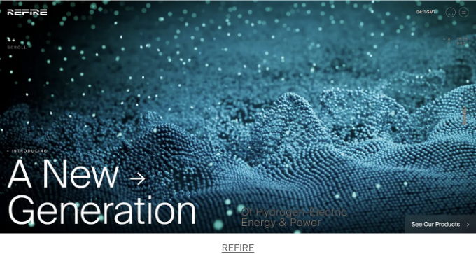

우리는 세계적으로 우수한 웹 디자인 프로젝트를 발굴하고 발견하여 의미 있는 현대적인 디자인에 대한 인식을 높이고 웹 디자인 혁신을 위한 새로운 방향을 개척하고 커뮤니티를 영감시킨 웹 디자이너를 찬미합니다.

저희는 지난 달의 최고 사이트를 발표함으로써 여러분을 확실히 영감을 주게 될 것입니다.

# 이번 달의 사이트 수상작

<!-- ui-log 수평형 -->
<ins class="adsbygoogle"
  style="display:block"
  data-ad-client="ca-pub-4877378276818686"
  data-ad-slot="9743150776"
  data-ad-format="auto"
  data-full-width-responsive="true"></ins>
<component is="script">
(adsbygoogle = window.adsbygoogle || []).push({});
</component>

월별 사이트 상을 수상한 웹사이트 참조

# 1- Sébastien Lempens Portfolio


Sebastien Lempens from Belgium.

<!-- ui-log 수평형 -->
<ins class="adsbygoogle"
  style="display:block"
  data-ad-client="ca-pub-4877378276818686"
  data-ad-slot="9743150776"
  data-ad-format="auto"
  data-full-width-responsive="true"></ins>
<component is="script">
(adsbygoogle = window.adsbygoogle || []).push({});
</component>

## 소개:

저는 15년 이상의 경력을 가진 자학으로 배운 웹 디자이너/개발자입니다. 높은 품질의 사용자 친화적인 웹 사이트 및 웹 애플리케이션을 만드는 데 열정적입니다.

## 태그:

게임 및 엔터테인먼트 솔로 포트폴리오 3D 애니메이션 스크롤링 CGI 다채로운 쿠키 메시지 창조적인 메뉴 전체 화면 그래픽 디자인 헤더 디자인 무한 스크롤 상호 작용 애니메이션 상호 작용 디자인 대화식 헤더 소개 애니메이션 랜딩 페이지 사운드-오디오 스토리텔링 전환 Adobe Photoshop Blender Google Font API Hammer.JS React Three.js Vercel

<!-- ui-log 수평형 -->
<ins class="adsbygoogle"
  style="display:block"
  data-ad-client="ca-pub-4877378276818686"
  data-ad-slot="9743150776"
  data-ad-format="auto"
  data-full-width-responsive="true"></ins>
<component is="script">
(adsbygoogle = window.adsbygoogle || []).push({});
</component>

# 2- 루트 푸드


이탈리아의 ET 스튜디오가 만들었습니다.

## 소개:

<!-- ui-log 수평형 -->
<ins class="adsbygoogle"
  style="display:block"
  data-ad-client="ca-pub-4877378276818686"
  data-ad-slot="9743150776"
  data-ad-format="auto"
  data-full-width-responsive="true"></ins>
<component is="script">
(adsbygoogle = window.adsbygoogle || []).push({});
</component>

**Giulio Urbani**님이 **rootfood**를 소개합니다. 이는 맞춤 영양 조언가 및 전용 요리사 서비스입니다.

## 크레딧:

Elettra Zuanazzi, Tomas Baruffaldi, Francesco Prisco

## 태그:

<!-- ui-log 수평형 -->
<ins class="adsbygoogle"
  style="display:block"
  data-ad-client="ca-pub-4877378276818686"
  data-ad-slot="9743150776"
  data-ad-format="auto"
  data-full-width-responsive="true"></ins>
<component is="script">
(adsbygoogle = window.adsbygoogle || []).push({});
</component>

음식 & 음료
호텔 / 레스토랑
깨끗한
다채로운
쿠키 메시지
창의적인 메뉴
사용자 정의 커서
갤러리
수평 레이아웃
인터랙티브 디자인
입력 애니메이션
최소한의 타이포그래피
특별한 네비게이션
Angular
Core.js
GSAP 애니메이션
Node.js
Nuxt.js
Open Graph
Prismic
PWA
Typescript
Vue.js
Webpack

# 3- 더 코타버스


영국의 코타(KOTA)가 제공합니다.

<!-- ui-log 수평형 -->
<ins class="adsbygoogle"
  style="display:block"
  data-ad-client="ca-pub-4877378276818686"
  data-ad-slot="9743150776"
  data-ad-format="auto"
  data-full-width-responsive="true"></ins>
<component is="script">
(adsbygoogle = window.adsbygoogle || []).push({});
</component>

## 소개:

KOTA 10주년을 기념하여 우리는 KOTAverse를 만들었습니다. 이는 우리의 역사와 우리가 오늘날 어떤 사람들인지를 만나볼 수 있는 대화형 여정입니다.

## 제작자:

Cyd Stumpel

<!-- ui-log 수평형 -->
<ins class="adsbygoogle"
  style="display:block"
  data-ad-client="ca-pub-4877378276818686"
  data-ad-slot="9743150776"
  data-ad-format="auto"
  data-full-width-responsive="true"></ins>
<component is="script">
(adsbygoogle = window.adsbygoogle || []).push({});
</component>

## 태그:

디자인 에이전시 에이전시 포트폴리오 404 페이지 스크롤 애니메이션 버튼 CGI 갤러리 헤더 디자인 대화형 애니메이션 대화형 디자인 대화형 헤더 소개 애니메이션 마이크로 상호작용 프로젝트 페이지 Angular Core.js GSAP 애니메이션 Nginx Open Graph PHP Three.js Typescript 워드프레스

# 오늘의 사이트 수상작

지난 한 달 동안 매일 Site Of The Day 상을 수상한 웹사이트들을 살펴보세요.

<!-- ui-log 수평형 -->
<ins class="adsbygoogle"
  style="display:block"
  data-ad-client="ca-pub-4877378276818686"
  data-ad-slot="9743150776"
  data-ad-format="auto"
  data-full-width-responsive="true"></ins>
<component is="script">
(adsbygoogle = window.adsbygoogle || []).push({});
</component>

# 1- ARTDUNK


Duall Studio에서 제작된 작품입니다.

## 소개:

<!-- ui-log 수평형 -->
<ins class="adsbygoogle"
  style="display:block"
  data-ad-client="ca-pub-4877378276818686"
  data-ad-slot="9743150776"
  data-ad-format="auto"
  data-full-width-responsive="true"></ins>
<component is="script">
(adsbygoogle = window.adsbygoogle || []).push({});
</component>

프로젝트 Liga Betclic은 Underdogs의 큐레이션 및 예술 선정으로 이루어졌어요.

## 크레딧:

Duarte Pires

## 태그:

<!-- ui-log 수평형 -->
<ins class="adsbygoogle"
  style="display:block"
  data-ad-client="ca-pub-4877378276818686"
  data-ad-slot="9743150776"
  data-ad-format="auto"
  data-full-width-responsive="true"></ins>
<component is="script">
(adsbygoogle = window.adsbygoogle || []).push({});
</component>

E-커머스 프로모션 서비스 360 3D 404 페이지 스크롤 애니메이션 창의적인 메뉴 다크 갤러리 그래픽 디자인 인트로 애니메이션 트랜지션 타이포그래피 Angular Core.js GSAP 애니메이션 jQuery Lottie Open Graph TypeScript Webflow

## 2- CLOUD CASTLES


Hello Monday에서 미국을향한 메시지입니다.

<!-- ui-log 수평형 -->
<ins class="adsbygoogle"
  style="display:block"
  data-ad-client="ca-pub-4877378276818686"
  data-ad-slot="9743150776"
  data-ad-format="auto"
  data-full-width-responsive="true"></ins>
<component is="script">
(adsbygoogle = window.adsbygoogle || []).push({});
</component>

## 소개:

Cloud Castles는 플레이어가 모아서 짧고 신속한 전투에서 이기기 위해 팀에서 마법으로 명령하는 환상적인 생물을 수집하고 진화시키는 차세대 액션 전략 게임입니다.

## 제작진:

Dept_Agency, dogstudio

<!-- ui-log 수평형 -->
<ins class="adsbygoogle"
  style="display:block"
  data-ad-client="ca-pub-4877378276818686"
  data-ad-slot="9743150776"
  data-ad-format="auto"
  data-full-width-responsive="true"></ins>
<component is="script">
(adsbygoogle = window.adsbygoogle || []).push({});
</component>

## 태그:

게임 및 엔터테인먼트 3D 애니메이션 스크롤 버튼 깔끔한 창의적인 메뉴 갤러리 무한 스크롤 대화식 애니메이션 상호 작용 디자인 소개 애니메이션 최소한의 사운드-오디오 전환 특별한 네비게이션 Angular GSAP 애니메이션 Node.js Open Graph PWA Svelte Typescript

# 3- FRAMEBRIDGE


<!-- ui-log 수평형 -->
<ins class="adsbygoogle"
  style="display:block"
  data-ad-client="ca-pub-4877378276818686"
  data-ad-slot="9743150776"
  data-ad-format="auto"
  data-full-width-responsive="true"></ins>
<component is="script">
(adsbygoogle = window.adsbygoogle || []).push({});
</component>

By Pattern from The USA.

## 소개:

Framebridge는 온라인 맞춤형 액자 만들기를 정말 쉽고 빠르고 저렴하게 해줍니다. 저희 맞춤형 액자 옵션은 $50부터 시작하며 무료 배송이 제공됩니다!

## 태그:

<!-- ui-log 수평형 -->
<ins class="adsbygoogle"
  style="display:block"
  data-ad-client="ca-pub-4877378276818686"
  data-ad-slot="9743150776"
  data-ad-format="auto"
  data-full-width-responsive="true"></ins>
<component is="script">
(adsbygoogle = window.adsbygoogle || []).push({});
</component>

비즈니스 전자 상거래 서비스를 제공하는 웹 사이트입니다. 쿠키팝업 창을 깔끔하게 처리한 창작물 갤러리 헤더 디자인에 미니멀한 타이포그래피를 사용했습니다. Angular Core.js, GSAP Animation, Lo-dash, Open Graph, PWA, Shopify, Typescript, Vue.js, Webpack 등을 활용하여 구성했습니다.

### 4- 시코리에 르루


프랑스 출신 Wokine 작품입니다.

<!-- ui-log 수평형 -->
<ins class="adsbygoogle"
  style="display:block"
  data-ad-client="ca-pub-4877378276818686"
  data-ad-slot="9743150776"
  data-ad-format="auto"
  data-full-width-responsive="true"></ins>
<component is="script">
(adsbygoogle = window.adsbygoogle || []).push({});
</component>

---

## 소개:

Leroux Chicory는 자연적이고 역사적이며 건강에 좋은 제품입니다. 식이섬유뿐만 아니라 카페인이 없는 카스토르콩에서 만든 음료입니다.

## 태그:

전자 상거래 음식 & 음료 3D 404 페이지 스크롤 애니메이션 쿠키 메시지 창조적인 메뉴 푸터 디자인 제품 페이지 타이포그래피 Angular GSAP 애니메이션 jQuery Nginx 오픈 그래프 PHP Swiper.js TypeScript WooCommerce 워드프레스

<!-- ui-log 수평형 -->
<ins class="adsbygoogle"
  style="display:block"
  data-ad-client="ca-pub-4877378276818686"
  data-ad-slot="9743150776"
  data-ad-format="auto"
  data-full-width-responsive="true"></ins>
<component is="script">
(adsbygoogle = window.adsbygoogle || []).push({});
</component>

# 5- HP23 — 접근이 용이한 보청기 이미지


Tubik Studio에서 우크라이나를 발신.

## 소개:

<!-- ui-log 수평형 -->
<ins class="adsbygoogle"
  style="display:block"
  data-ad-client="ca-pub-4877378276818686"
  data-ad-slot="9743150776"
  data-ad-format="auto"
  data-full-width-responsive="true"></ins>
<component is="script">
(adsbygoogle = window.adsbygoogle || []).push({});
</component>

회사가 바이오닉 보철기를 생산하고 이용자들을 위한 치료 및 훈련을 제공하는 웹사이트 디자인 및 개발, 보철기 분야의 혁신과 진화를 추진합니다.

## 크레딧:

Anton Morozov, Vlad Taran

## 태그:

<!-- ui-log 수평형 -->
<ins class="adsbygoogle"
  style="display:block"
  data-ad-client="ca-pub-4877378276818686"
  data-ad-slot="9743150776"
  data-ad-format="auto"
  data-full-width-responsive="true"></ins>
<component is="script">
(adsbygoogle = window.adsbygoogle || []).push({});
</component>

디자인 에이전시 의료 사회적 책임 기술 3D 애니메이션 스크롤 버튼 깨끗한 폼 및 입력 상호작용식 애니메이션 상호작용 디자인 시작 애니메이션 미니멀한 패럴랙스 타이포그래피 Angular Core.js GSAP 애니메이션 jQuery Lottie Open Graph TypeScript Webflow

# 6- 페르세폴리스 리매지닛


네덜란드의 미디아몽크스(MediaMonks)에서 제작된 것입니다.

<!-- ui-log 수평형 -->
<ins class="adsbygoogle"
  style="display:block"
  data-ad-client="ca-pub-4877378276818686"
  data-ad-slot="9743150776"
  data-ad-format="auto"
  data-full-width-responsive="true"></ins>
<component is="script">
(adsbygoogle = window.adsbygoogle || []).push({});
</component>

# 소개:

킹 제르제스 통치 시기의 고대 페르시아 수도를 탐험해 보세요. Getty의 새로운 몰입형 웹 경험.

# 태그:

문화 및 교육 360 3D Animation 스크롤 애니메이션 창의적 메뉴 그래픽 디자인 대화형 애니메이션 대화형 디자인 입체 애니메이션 스토리텔링 전환 타이포그래피 독특한 네비게이션 Angular Core.js GSAP Animation 오픈 그래프 PWA TypeScript 웹팩

<!-- ui-log 수평형 -->
<ins class="adsbygoogle"
  style="display:block"
  data-ad-client="ca-pub-4877378276818686"
  data-ad-slot="9743150776"
  data-ad-format="auto"
  data-full-width-responsive="true"></ins>
<component is="script">
(adsbygoogle = window.adsbygoogle || []).push({});
</component>

# 7- BLOB MIXER


By 14islands from Sweden.

## 소개:

<!-- ui-log 수평형 -->
<ins class="adsbygoogle"
  style="display:block"
  data-ad-client="ca-pub-4877378276818686"
  data-ad-slot="9743150776"
  data-ad-format="auto"
  data-full-width-responsive="true"></ins>
<component is="script">
(adsbygoogle = window.adsbygoogle || []).push({});
</component>

친구들과 함께 공유하고 다운로드하여 VR에서 볼 수 있는 자체 3D 아트를 만드는 장난감.

## 태그:

미술 및 삽화 게임 및 엔터테인먼트 360 3D 404 페이지 스크롤 애니메이션 다채로운 풀스크린 가로 레이아웃 대화형 애니메이션 대화형 디자인 상호작용 헤더 소개 애니메이션 마이크로 상호작용 Angular Netlify Open Graph PWA Three.js TypeScript

# 8- ZKPASS

<!-- ui-log 수평형 -->
<ins class="adsbygoogle"
  style="display:block"
  data-ad-client="ca-pub-4877378276818686"
  data-ad-slot="9743150776"
  data-ad-format="auto"
  data-full-width-responsive="true"></ins>
<component is="script">
(adsbygoogle = window.adsbygoogle || []).push({});
</component>


By Studio Freight from The USA.

## 소개:

zkPass는 web2와 web3 생태계의 개인 데이터 간에 원활한 게이트웨이 역할을 합니다.

<!-- ui-log 수평형 -->
<ins class="adsbygoogle"
  style="display:block"
  data-ad-client="ca-pub-4877378276818686"
  data-ad-slot="9743150776"
  data-ad-format="auto"
  data-full-width-responsive="true"></ins>
<component is="script">
(adsbygoogle = window.adsbygoogle || []).push({});
</component>

## 제작자:

zkPass

## 태그:

기술 Web3 스크롤 애니메이션 다크 일러스트 인터랙티브 애니메이션 인터랙티브 디자인 랜딩 페이지 타이포그래피 Angular GSAP 애니메이션 Next.js Node.js 오픈 그래프 PWA React TypeScript Webpack

<!-- ui-log 수평형 -->
<ins class="adsbygoogle"
  style="display:block"
  data-ad-client="ca-pub-4877378276818686"
  data-ad-slot="9743150776"
  data-ad-format="auto"
  data-full-width-responsive="true"></ins>
<component is="script">
(adsbygoogle = window.adsbygoogle || []).push({});
</component>

# 9- 모션.이드


바이 Za jno 님. 미국에서 온 것으로 보입니다.

## 소개:

<!-- ui-log 수평형 -->
<ins class="adsbygoogle"
  style="display:block"
  data-ad-client="ca-pub-4877378276818686"
  data-ad-slot="9743150776"
  data-ad-format="auto"
  data-full-width-responsive="true"></ins>
<component is="script">
(adsbygoogle = window.adsbygoogle || []).push({});
</component>


Motion은 브랜드의 분위기와 캐릭터를 전달하는데 UI/UX 애니메이션의 힘을 보여주는 웹사이트입니다.

## 태그:

디자인 에이전시 404 페이지 스크롤 애니메이션 창의적인 메뉴 상호작용 애니메이션 상호작용 디자인 소개 애니메이션 랜딩 페이지 사운드-오디오 타이포그래피 Angular Core.js GSAP 애니메이션 jQuery Lottie Open Graph TypeScript Webflow

# 10- MEEBITS 1.2

<!-- ui-log 수평형 -->
<ins class="adsbygoogle"
  style="display:block"
  data-ad-client="ca-pub-4877378276818686"
  data-ad-slot="9743150776"
  data-ad-format="auto"
  data-full-width-responsive="true"></ins>
<component is="script">
(adsbygoogle = window.adsbygoogle || []).push({});
</component>


미국의 dogstudio에서 제공합니다.

## 소개:

Meebits을 만나보세요. 20,000개의 메타버스용 복셀 존재들이 움직입니다. 그들의 다음 움직임: MB1, 모든 Meebit을 위한 독특한 인쇄물로 시작하는 킥오프. MB1.2를 해제하고, 당신의 Meebit을 위한 '컬렉터블 프린트'를 선택하고, Living PFPs를 통해 시장에서 실현된 모습을 확인하고, 사진을 찍고 공유하세요.

<!-- ui-log 수평형 -->
<ins class="adsbygoogle"
  style="display:block"
  data-ad-client="ca-pub-4877378276818686"
  data-ad-slot="9743150776"
  data-ad-format="auto"
  data-full-width-responsive="true"></ins>
<component is="script">
(adsbygoogle = window.adsbygoogle || []).push({});
</component>

## 태그:

게임 및 엔터테인먼트 부동산 360 3D 404 페이지 버튼 CGI 컬러풀 그래픽 디자인 헤더 디자인 수평 레이아웃 대화 형 애니메이션 대화 형 디자인 대화 형 헤더 소개 애니메이션 랜딩 페이지 사운드-오디오 Angular GSAP 애니메이션 Next.js Node.js Open Graph React Tailwind CSS TypeScript 웹팩

# 11- 사이버콘보이


<!-- ui-log 수평형 -->
<ins class="adsbygoogle"
  style="display:block"
  data-ad-client="ca-pub-4877378276818686"
  data-ad-slot="9743150776"
  data-ad-format="auto"
  data-full-width-responsive="true"></ins>
<component is="script">
(adsbygoogle = window.adsbygoogle || []).push({});
</component>

스페인 출신 무비엔입니다.

## 소개:

사이버 편대(CyberConvoy)의 XDR로 우수한 통제를 경험해보세요. 위험을 정의하고 자동화를 활용하며 원활한 통합을 실현하세요. 당신의 조건으로 사이버 보안을 재정의할 준비가 되셨나요?

## 크레딧:

<!-- ui-log 수평형 -->
<ins class="adsbygoogle"
  style="display:block"
  data-ad-client="ca-pub-4877378276818686"
  data-ad-slot="9743150776"
  data-ad-format="auto"
  data-full-width-responsive="true"></ins>
<component is="script">
(adsbygoogle = window.adsbygoogle || []).push({});
</component>

CSS_killer

## 태그:

기술 Web3 404 페이지 스크롤 애니메이션 버튼 깔끔한 어두운 인트로 애니메이션 미니멀한 전환 타이포그래피 Angular Core.js GSAP 애니메이션 Nginx 오픈 그래프 PHP PWA TypeScript 워드프레스

# 12- 아장스 카르티에

<!-- ui-log 수평형 -->
<ins class="adsbygoogle"
  style="display:block"
  data-ad-client="ca-pub-4877378276818686"
  data-ad-slot="9743150776"
  data-ad-format="auto"
  data-full-width-responsive="true"></ins>
<component is="script">
(adsbygoogle = window.adsbygoogle || []).push({});
</component>


By MILL3 from Canada.

## About:

Cartier는 창작, 전략, 미디어, 디자인, 소셜 네트워크 및 제작 서비스를 제공하는 광고 대행사입니다.

<!-- ui-log 수평형 -->
<ins class="adsbygoogle"
  style="display:block"
  data-ad-client="ca-pub-4877378276818686"
  data-ad-slot="9743150776"
  data-ad-format="auto"
  data-full-width-responsive="true"></ins>
<component is="script">
(adsbygoogle = window.adsbygoogle || []).push({});
</component>

## 태그:

서비스 404 페이지 쿠키 메시지 크리에이티브 메뉴 갤러리 헤더 디자인 인터랙티브 디자인 인터랙티브 헤더 소개 애니메이션 사진 및 비디오 전환 jQuery PHP Sanity Webpack Wordpress

# 13- FLOW PARTY


<!-- ui-log 수평형 -->
<ins class="adsbygoogle"
  style="display:block"
  data-ad-client="ca-pub-4877378276818686"
  data-ad-slot="9743150776"
  data-ad-format="auto"
  data-full-width-responsive="true"></ins>
<component is="script">
(adsbygoogle = window.adsbygoogle || []).push({});
</component>

By Joseph Berry from The UK.

## 소개:

플로우 파티는 웹사이트 개발자와 디자이너를 위한 안전하고 포용적이며 재미있는 공간입니다.

## 제작자:

<!-- ui-log 수평형 -->
<ins class="adsbygoogle"
  style="display:block"
  data-ad-client="ca-pub-4877378276818686"
  data-ad-slot="9743150776"
  data-ad-format="auto"
  data-full-width-responsive="true"></ins>
<component is="script">
(adsbygoogle = window.adsbygoogle || []).push({});
</component>

에릭 W 오돔, 라훌 이슬람, 마리아 마르틴스, 멜리사 메네즈, 디에고 토다 데 올리베이라

## 태그:

디자인 에이전시 기술 404 페이지 스크롤 애니메이션 다채로운 창의적인 메뉴 헤더 디자인 상호작용하는 애니메이션 상호작용 디자인 상호작용 헤더 인트로 애니메이션 랜딩 페이지 타이포그래피 Angular Core.js jQuery Lottie 오픈 그래프 TypeScript 웹플로우

# 14- 펠릭스 페올 — 포트폴리오

<!-- ui-log 수평형 -->
<ins class="adsbygoogle"
  style="display:block"
  data-ad-client="ca-pub-4877378276818686"
  data-ad-slot="9743150776"
  data-ad-format="auto"
  data-full-width-responsive="true"></ins>
<component is="script">
(adsbygoogle = window.adsbygoogle || []).push({});
</component>


프랑스의 Félix Péault이(가) 작성함.

## 소개:

프랑스 남부에 거주하고 전 세계에서 활동 중인 프리랜서 시니어 디지털 디자이너이자 아트 디렉터인 Félix Péault의 작품입니다.

<!-- ui-log 수평형 -->
<ins class="adsbygoogle"
  style="display:block"
  data-ad-client="ca-pub-4877378276818686"
  data-ad-slot="9743150776"
  data-ad-format="auto"
  data-full-width-responsive="true"></ins>
<component is="script">
(adsbygoogle = window.adsbygoogle || []).push({});
</component>

## 태그:

솔로 포트폴리오 404 페이지 버튼 전체화면 랜딩 페이지 타이포그래피 앵귤러 오픈 그래프 PWA 센이티 TypeScript

# 15- DON’T BOARD ME


<!-- ui-log 수평형 -->
<ins class="adsbygoogle"
  style="display:block"
  data-ad-client="ca-pub-4877378276818686"
  data-ad-slot="9743150776"
  data-ad-format="auto"
  data-full-width-responsive="true"></ins>
<component is="script">
(adsbygoogle = window.adsbygoogle || []).push({});
</component>

By The First The Last from Ukraine.

## 소개:

저희는 안정적이고 관대하며 맞춤형 가정 내 애완동물 돌봄 서비스를 제공하는 것을 전문으로 합니다. 이 서비스는 귀여운 친구들의 독특한 요구를 충족시키기 위해 설계되었습니다.

## 태그:

<!-- ui-log 수평형 -->
<ins class="adsbygoogle"
  style="display:block"
  data-ad-client="ca-pub-4877378276818686"
  data-ad-slot="9743150776"
  data-ad-format="auto"
  data-full-width-responsive="true"></ins>
<component is="script">
(adsbygoogle = window.adsbygoogle || []).push({});
</component>

# 서비스 404 페이지
- 스크롤시 애니메이션
- 헤더 디자인
- 인터랙티브 디자인
- 소개 애니메이션
- 전환 효과
- 타이포그래피
- Angular
- GSAP 애니메이션
- Lottie
- Nginx
- Node.js
- Nuxt.js
- 오픈 그래프
- Swiper.js
- TypeScript
- Vue.js

# 16- NEWPEACE INC. 웹사이트


일본의 STUDIO DETAILS INC.에서 제작되었습니다.

<!-- ui-log 수평형 -->
<ins class="adsbygoogle"
  style="display:block"
  data-ad-client="ca-pub-4877378276818686"
  data-ad-slot="9743150776"
  data-ad-format="auto"
  data-full-width-responsive="true"></ins>
<component is="script">
(adsbygoogle = window.adsbygoogle || []).push({});
</component>

## 회사 소개:

뉴 피스 주식회사는 기업의 핵심인 WHY부터 시작하여 지속 가능한 성장을 지원하는 전문 회사입니다. 브랜드 개발부터 지원 커뮤니티 형성까지 다양한 영역에서 지원합니다.

## 태그:

디자인 에이전시, 아트 및 일러스트레이션 서비스, 404 페이지, 스크롤 애니메이션, 버튼, 다채로운 일러스트레이션, 소개 애니메이션, 전환 효과, 타이포그래피, Angular, GSAP 애니메이션, Lottie, 오픈 그래프, Typekit, TypeScript

<!-- ui-log 수평형 -->
<ins class="adsbygoogle"
  style="display:block"
  data-ad-client="ca-pub-4877378276818686"
  data-ad-slot="9743150776"
  data-ad-format="auto"
  data-full-width-responsive="true"></ins>
<component is="script">
(adsbygoogle = window.adsbygoogle || []).push({});
</component>

# 17- 일레븐 일레븐


영국의 1minus1님으로부터.

## 소개:  

<!-- ui-log 수평형 -->
<ins class="adsbygoogle"
  style="display:block"
  data-ad-client="ca-pub-4877378276818686"
  data-ad-slot="9743150776"
  data-ad-format="auto"
  data-full-width-responsive="true"></ins>
<component is="script">
(adsbygoogle = window.adsbygoogle || []).push({});
</component>

글로벌 테크 및 게임 분야의 인재 파트너쉽.

## 태그:

게임 및 엔터테인먼트 404 페이지 정보 페이지 스크롤 애니메이션 다채로운 쿠키 메시지 창조적 메뉴 상호작용 디자인 소개 애니메이션 전환 타이포그래피 Angular Apache GSAP 애니메이션 Node.js Nuxt.js 오픈 그래프 Tailwind CSS TypeScript Vue.js

# 18- REFIRE

<!-- ui-log 수평형 -->
<ins class="adsbygoogle"
  style="display:block"
  data-ad-client="ca-pub-4877378276818686"
  data-ad-slot="9743150776"
  data-ad-format="auto"
  data-full-width-responsive="true"></ins>
<component is="script">
(adsbygoogle = window.adsbygoogle || []).push({});
</component>

```


By CUSP from Canada.

## About:

REFIRE electrolyser and fuel cell technologies are helping to drive the revolution in clean hydrogen energy and power.
```

<!-- ui-log 수평형 -->
<ins class="adsbygoogle"
  style="display:block"
  data-ad-client="ca-pub-4877378276818686"
  data-ad-slot="9743150776"
  data-ad-format="auto"
  data-full-width-responsive="true"></ins>
<component is="script">
(adsbygoogle = window.adsbygoogle || []).push({});
</component>

## 크레딧:

소금과 후추

## 태그:

기술 360 3D 애니메이션 스크롤 쿠키 메시지 창의적인 메뉴 사용자 지정 커서 헤더 디자인 인터랙티브 애니메이션 인터랙티브 디자인 시작 애니메이션 사진 및 비디오 사운드-오디오 전환 타이포그래피 앵귤러 GSAP 애니메이션 Next.js 노드.js 오픈 그래프 Prismic 리액트 Three.js 타입스크립트 웹팩

<!-- ui-log 수평형 -->
<ins class="adsbygoogle"
  style="display:block"
  data-ad-client="ca-pub-4877378276818686"
  data-ad-slot="9743150776"
  data-ad-format="auto"
  data-full-width-responsive="true"></ins>
<component is="script">
(adsbygoogle = window.adsbygoogle || []).push({});
</component>

# 웹 디자인 영감을 더 찾고 계신가요?

매일 웹 디자인 영감을 받아보고, 웹 디자인의 최신 소식을 계속해서 만나보세요.

Website — LinkedIn — Facebook — Twitter — Instagram — Youtube — Pinterest