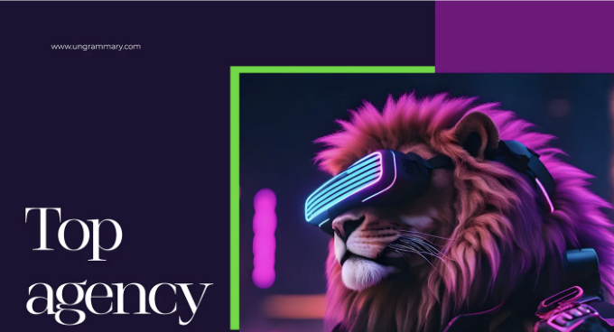

목차:

UX 디자인이란 무엇인가요?

사용자 연구

<!-- ui-log 수평형 -->
<ins class="adsbygoogle"
  style="display:block"
  data-ad-client="ca-pub-4877378276818686"
  data-ad-slot="9743150776"
  data-ad-format="auto"
  data-full-width-responsive="true"></ins>
<component is="script">
(adsbygoogle = window.adsbygoogle || []).push({});
</component>

상호 작용 디자인

2024년 주목할만한 최고 UX 서비스

UX 감사란 무엇인가요

사용성 테스팅이란 무엇인가요

<!-- ui-log 수평형 -->
<ins class="adsbygoogle"
  style="display:block"
  data-ad-client="ca-pub-4877378276818686"
  data-ad-slot="9743150776"
  data-ad-format="auto"
  data-full-width-responsive="true"></ins>
<component is="script">
(adsbygoogle = window.adsbygoogle || []).push({});
</component>

사용성 테스트하는 방법

마이크로 상호 작용이란 무엇인가요?

왜 UX 디자인 에이전시가 필요한가요?

2024년 최고의 UX 디자인 에이전시들

<!-- ui-log 수평형 -->
<ins class="adsbygoogle"
  style="display:block"
  data-ad-client="ca-pub-4877378276818686"
  data-ad-slot="9743150776"
  data-ad-format="auto"
  data-full-width-responsive="true"></ins>
<component is="script">
(adsbygoogle = window.adsbygoogle || []).push({});
</component>

디지털 환경이 계속 변화함에 따라 사용자 경험(UX)은 디지털 제품의 성공에 중요한 요소가 되었습니다. 2024년에는 UX 디자인의 중요성이 계속해서 증가할 것으로 예상되며, 사용자 만족도 향상, 전황률 증가, 제품의 경쟁 우위 확보에 기여할 것입니다.

제품의 최상의 사용자 경험 디자인을 보장하려면, 최신 트렌드와 기술을 이해하는 최고 수준의 UX 디자인 에이전시와 협력하는 것이 중요합니다.

이 포괄적인 가이드에서는 UX 디자인의 심층을 이해하는 데 도움을 드릴 것이며, 왜 UX 디자인 에이전시가 필요한지, 그리고 2024년을 위해 고려해야 할 최고의 에이전시에 대해 알아볼 것입니다.

# UX 디자인 이해하기

<!-- ui-log 수평형 -->
<ins class="adsbygoogle"
  style="display:block"
  data-ad-client="ca-pub-4877378276818686"
  data-ad-slot="9743150776"
  data-ad-format="auto"
  data-full-width-responsive="true"></ins>
<component is="script">
(adsbygoogle = window.adsbygoogle || []).push({});
</component>

## UX 디자인이란 무엇인가요?

UX 디자인은 웹사이트나 애플리케이션과 상호 작용할 때 사용자들이 느끼는 경험을 더욱 원활하고 즐겁게 만드는 것을 중심으로 합니다. 이는 끊임없는 전략적인 계획, 창의적인 디자인 사고, 최적의 실행을 통해 최종 사용자의 기대치를 충족하는 것을 다룹니다.

디지털 세계에서 UX 디자인은 제품에 대한 그 인상을 형성하는 데 중요한 역할을 합니다. 제품의 디자인 요소, 사용성, 전체 기능성은 사용자 참여에 영향을 미치며 좋은 UX 디자인은 이러한 측면을 다루어 성공적인 제품을 만들어냅니다.

2024년의 UX 디자인의 주요 측면은 다음과 같습니다:

<!-- ui-log 수평형 -->
<ins class="adsbygoogle"
  style="display:block"
  data-ad-client="ca-pub-4877378276818686"
  data-ad-slot="9743150776"
  data-ad-format="auto"
  data-full-width-responsive="true"></ins>
<component is="script">
(adsbygoogle = window.adsbygoogle || []).push({});
</component>

- 사용자 연구 UX 디자인 분야에서 사용자 연구는 중요한 역할을 합니다. 사용자로부터 데이터를 체계적으로 수집하여 그들의 요구사항, 선호도 및 행동에 대한 소중한 통찰을 얻는 것을 포함합니다. 사용자 연구에서 사용자의 의견을 조사하기 위해 사용성 테스트, A/B 테스트 및 설문 조사와 같은 방법을 통해 UX 디자이너는 사용자 피드백을 기반으로 실제로 디자인을 계속 발전시키고 사용성 문제를 파악하고 가정을 확인할 수 있습니다. 또한 사용자 연구는 정보 구조를 최적화하고 콘텐츠 구성을 향상시키며 양적 및 질적 지표를 통해 디자인 솔루션의 성공을 측정하는 데 도움이 됩니다. 대체로 사용자 연구는 UX 디자인의 핵심 요소로 타깃 대상 청중의 요구 사항과 기대를 충족시키는 제품을 만드는 데 이끄는 역할을 합니다. 사용자 요구 이해: 사용자 연구는 사용자의 요구 사항, 선호도 및 고통점을 발견하는 데 도움을 줍니다. 데이터 주도 의사 결정: 디자인 선택 사항을 안내하는 데이터 및 통찰을 제공합니다. 사용성 향상: 사용성 테스트 및 A/B 테스팅과 같은 기술을 통해 사용성 문제를 식별하는 데 도움이 됩니다. 사용자 중심 디자인: 사용자를 디자인 프로세스의 중심에 두어 직관적이고 사용자 친화적 제품을 만듭니다. 질적 및 양적 통찰: 인터뷰 및 현지 연구와 같은 질적 방법과 설문 및 분석에서 얻은 양적 데이터를 결합합니다. 반복적 디자인: 사용자 피드백을 기반으로 디자인을 개선하는 반복적인 디자인 프로세스를 지원합니다. 사용자 경험 향상: 틈 없고 즐거운 사용자 경험을 만들고자 합니다. 가정 확인: 디자인 결정이 가정이 아닌 실제 사용자 요구에 기반함을 보장합니다.

- 사용성 UX 디자인에서 사용성은 사용자가 제품 및 시스템을 직관적이고 효율적이며 즐거운 방식으로 사용할 수 있도록 하는 중추입니다. 사용성을 평가하기 위해 UX 디자이너는 사용성 테스트 및 사용자 피드백 분석과 같은 방법을 활용합니다. 사용성의 주요 원칙은 다음과 같습니다: 사용 편의성: 사용하기 쉬운 제품은 사용자가 사용법을 배우는 데 필요한 시간을 최소화하도록 설명이 쉬워야합니다. 효율성: 사용자는 적은 단계와 노력으로 작업을 빠르게 완료할 수 있어야 합니다. 학습성: 새로운 사용자는 교육이나 안내 없이 제품의 기본 기능과 기능을 이해할 수 있어야합니다. 기억성: 반복 사용자는 제품 사용 방법을 쉽게 기억할 수 있어야하며 계속해서 재학습할 필요가 없어야합니다. 오류 허용성: 사용성 높은 제품은 사용자 오류를 방지하고 우아하게 회복시킬 수 있어야 합니다. 만족도: 사용성은 사용자 경험의 감정적 측면도 고려하여 긍정적이고 만족스러운 상호작용을 만들어냅니다. 접근성: 사용성 있는 디자인은 모든 사용자, 장애를 가진 사용자를 포함해 제품에 접근하고 사용할 수 있도록 보장해야 합니다.

- 상호작용 디자인 상호작용 디자인(IxD)은 사용자 경험(UX) 디자인 생태계 내에서 중요한 학문이며 사용자를 위한 상호작용 경험의 창조를 중심으로 합니다. 이는 사용자 흐름을 매핑하여 원활하고 논리적인 탐색 과정을 보장하고, 인터페이스의 레이아웃과 기능을 시각화하기 위해 와이어프레임 및 상호작용 프로토 타입을 만들고 시스템이 사용자 조작에 대해 어떻게 응답하고 피드백 메커니즘을 통해 시스템이 응답하는 방식을 정의하는 것을 포함합니다. 상호작용 디자인은 모바일 및 반응형 디자인의 독특한 도전에 대처함으로써 전반적인 사용자 경험을 형성하는 데 중요합니다. IxD의 주요 측면: 사용자 흐름: 디자이너는 제품이나 응용 프로그램을 통해 사용자가 따르는 경로를 매핑하여 논리적이고 직관적인 여정을 보장합니다. 와이어프레임 및 프로토타입: 인터페이스의 레이아웃 및 기능을 시각화하기 위해 와이어프레임과 상호작용 프로토타입을 만듭니다. 피드백 및 응답: 상호작용 디자인은 시스템이 사용자 조작에 어떻게 응답할지 정의하고 애니메이션, 알림 및 전환을 통해 피드백을 제공합니다.
 정보 아키텍처: 콘텐츠와 기능을 구성하고 구조화하여 사용자가 쉽게 접근할 수 있도록 하는 것이 상호작용 디자인의 중요한 부분입니다. 일관성: 혼란을 방지하고 사용자 경험을 향상시키기 위해 일관되고 일관된 사용자 인터페이스를 유지하는 것입니다. 모바일 및 반응형 디자인: 모바일 장치에 대한 설계의 고유 한 도전과 다양한 화면 크기와 장치에 반응하는 기능을 보장하는 것입니다.

- 시각적 계층 구조 시각적 계층 구조는 사용자 인터페이스 내에서 요소를 조직화하고 우선순위를 정하려는 예술입니다. 이는 디자인 요소인 크기, 색상 및 위치를 사용하여 특정 요소를 강조하고 다른 요소를 강조하지 않도록 하는 것을 포함합니다. 명확한 시각적 계층 구조는 디자이너가 사용자의 주의를 가장 중요한 콘텐

<!-- ui-log 수평형 -->
<ins class="adsbygoogle"
  style="display:block"
  data-ad-client="ca-pub-4877378276818686"
  data-ad-slot="9743150776"
  data-ad-format="auto"
  data-full-width-responsive="true"></ins>
<component is="script">
(adsbygoogle = window.adsbygoogle || []).push({});
</component>

## 사용성 테스트

- 사용성 테스트란 무엇인가요? 사용성 테스트는 실제 사용자가 디지턈 제품과 상호작용하는 것을 관찰하여 귀하의 디지턈 제품을 평가하는 방법입니다. 주요 목표는 문제를 식별하고 피드백을 수집하며 전반적인 사용자 경험을 평가하는 것입니다. 이를 통해 제품이 사용자의 기대와 요구에 얼마나 잘 부응하는지 이해할 수 있습니다.
- 왜 사용성 테스트를 실시해야 하나요? 1. 사용자 통증 포인트 발견: 사용성 테스트를 통해 혼란스러운 내비게이션, 느린 로드 시간 또는 명확하지 않은 콘텐츠와 같은 사용자가 마주치는 구체적인 문제점을 파악할 수 있습니다. 2. 사용자 경험 개선: 문제를 식별하여 특정 개선을 할 수 있으며, 이는 보다 직관적이고 즐거운 사용자 경험으로 이어집니다.
- 언제 사용성 테스트를 실시해야 하나요? 사용성 테스트는 제품 개발의 다양한 단계에서 가치가 있습니다: 설계 및 개발 중: 초기 테스트로 문제가 뿌리깊게 박히는 것을 방지하여 시간과 자원을 절약할 수 있습니다. 출시 전: 최종 출시 전 테스트를 통해 제품이 대중에게 가장 좋은 형태로 준비되도록 도와줍니다. 출시 후: 지속적으로 사용성 테스트를 실시하여 피드백을 수집하고 지속적인 개선을 진행하세요.
- 어떻게 사용성 테스트를 실시해야 하나요? 1. 테스트 목표 정의: 사용성 테스트로 얻고 싶은 결과를 결정하세요. 특정 기능 개선, 전반적인 사용성 평가 또는 통증 포인트 식별 등이 될 수 있습니다. 2. 참가자 모집: 대상 사용자와 일치하는 대표적인 사용자를 찾으세요. 다양한 관점을 포착하기 위해 다양한 그룹을 대상으로 하세요. 3. 테스트 시나리오 작성: 제품과 일반적인 사용자 상호작용을 반영하는 참가자가 수행할 시나리오 또는 작업을 개발하세요. 4. 테스트 실시: 참가자들이 작업을 완료하는 것을 관찰하고, 말하면서 생각할 것을 장려하세요. 참가자의 활동을 기록하고 세션을 녹화하세요. 5. 결과 분석 및 해석: 테스트 세션에서 패턴, 문제점 및 사용자 피드백을 식별하세요. 6. 변경 사항 적용: 조사 결과에 따라 제품의 디자인, 기능 및 콘텐츠를 개선하세요. 7. 반복 및 재실시: 사용성 테스트는 지속적인 과정입니다. 업데이트 및 제품 향상을 위해 계속 테스트하고 개선하세요.

개발 및 향상 프로세스에 사용성 테스트를 통합하여 디지털 제품이 사용자의 기대를 충족시키는 것뿐만 아니라 초과할 수 있도록 보장할 수 있습니다. 저희 다음 기사에서 사용성 테스트의 세계에 대한 깊은 통찰력을 더 알아보세요!

## 마이크로 상호작용

<!-- ui-log 수평형 -->
<ins class="adsbygoogle"
  style="display:block"
  data-ad-client="ca-pub-4877378276818686"
  data-ad-slot="9743150776"
  data-ad-format="auto"
  data-full-width-responsive="true"></ins>
<component is="script">
(adsbygoogle = window.adsbygoogle || []).push({});
</component>

사용자 경험(UX) 디자인 세계에서 아주 작은 세부사항이 큰 차이를 만들어냅니다. 마이크로 상호작용은 디지턈 제품에 마법 같은 감성을 불어넣어줍니다. 그 의의를 살펴보면서 어떻게 UX를 향상시킬 수 있는지 알아봐요.

- 마이크로 상호작용은 무엇인가요? 마이크로 상호작용은 사용자가 디지턈 인터페이스와 상호작용할 때 발생하는 섬세하고 종종 무시되는 애니메이션 또는 반응을 의미합니다. 버튼을 클릭하면 색상이 변경되거나, 알림이 표시되거나, 소셜 미디어 게시물에서 '좋아요' 애니메이션이 나타날 수 있습니다. 잘 만들어진 이런 작은 세부사항들이 최종 사용자 인식에 큰 영향을 줍니다.
- UX에서 마이크로 상호작용의 힘 1. 피드백과 안내: 마이크로 상호작용은 즉각적인 피드백을 제공하여 사용자가 자신의 조치가 인식됐음을 알려줍니다. 이 안내는 혼란과 좌절을 방지할 수 있습니다. 2. 사용자 참여 확대: 이는 상호작용을 더 즐겁고 매력적으로 만들어 전체적으로 긍정적인 사용자 경험에 기여합니다.
- 마이크로 상호작용의 종류 시각적 피드백: 애니메이션된 버튼, 로딩 스피너, 또는 색상 변경은 사용자의 조치가 등록되었음을 나타냅니다. 시스템 상태: 알림 및 통지는 사용자에게 시스템 상태 변경(새 메시지 또는 업데이트)에 대해 알려줍니다. 사용자 컨트롤: 마이크로 상호작용을 통해 볼륨 조절기나 토글과 같은 설정을 조정할 수 있습니다.
- 마이크로 상호작용 구현을 위한 권장사항 일관성: 제품 전반에 걸쳐 마이크로 상호작용을 위한 일관된 디자인 언어를 유지합니다. 관련성: 각 마이크로 상호작용이 목적을 제공하고 사용자의 조치와 일치함을 보장합니다. 성능: 반응 지연 또는 지연을 방지하기 위해 성능을 최적화합니다.

마이크로 상호작용은 작을지라도 사용자 경험에 미치는 영향은 거대합니다. 신중히 실행되면 쓸모없는 상호작용을 기억에 남을만한 즐거운 경험으로 변화시킬 수 있습니다.

# 왜 UX 디자인 에이전시가 필요할까요?

<!-- ui-log 수평형 -->
<ins class="adsbygoogle"
  style="display:block"
  data-ad-client="ca-pub-4877378276818686"
  data-ad-slot="9743150776"
  data-ad-format="auto"
  data-full-width-responsive="true"></ins>
<component is="script">
(adsbygoogle = window.adsbygoogle || []).push({});
</component>

확인된 전문 UX 디자인 에이전시와 협업하는 장점은 여러 가지입니다. 분야 전문가와 협업을 고려해야 하는 몇 가지 이유를 소개합니다:

- 전문성과 경험 능력 있는 경험 많은 UX 디자인 에이전시는 최신 UX 트렌드와 기술에 밝은 전문가들을 고용합니다. 다양한 프로젝트에서 경험을 쌓았으며 디지털 존재에 신선한 시각을 제공할 수 있습니다. 업계 표준 및 최고의 실천 방법에 대한 지식을 바탕으로 제품이 최고의 UX 표준을 준수하도록 보장합니다.
- 경쟁 우위 디지털 경쟁이 더욱 치열해지는 상황에서 경쟁 우위 확보는 매우 중요합니다. UX 디자인을 우선시하는 비즈니스는 더 나은 사용자 경험을 제공하여 경쟁사를 앞서갈 수 있습니다. 잘 디자인된 UX는 고객 충성도 향상, 높은 전환율, 그리고 탁월한 브랜드 평판으로 이어질 수 있습니다.
- ROI 향상 UX 디자인에 투자를 해야 하는 초기 금전적 투자가 필요할 수 있지만, 그 결과 장기적으로 상당한 투자수익을 가져올 수 있습니다. 사용자 경험을 최적화함으로써 높은 사용자 참여와 더 높은 전환율을 기대할 수 있으며, 결과적으로 수익과 수익성을 향상시킬 수 있습니다.

# 최고의 UX 디자인 에이전시 선택 기준

적절한 UX 디자인 에이전시를 선택하는 것은 매우 중요한 결정입니다. 정보를 기반으로 풀어나가기 위해 다음 기준을 고려해보세요:

<!-- ui-log 수평형 -->
<ins class="adsbygoogle"
  style="display:block"
  data-ad-client="ca-pub-4877378276818686"
  data-ad-slot="9743150776"
  data-ad-format="auto"
  data-full-width-responsive="true"></ins>
<component is="script">
(adsbygoogle = window.adsbygoogle || []).push({});
</component>

- 포트폴리오: 에이전시의 포트폴리오를 확인하여 작업의 품질과 다양성을 평가해보세요. 귀사의 산업 또는 프로젝트 요구 사항과 일치하는 프로젝트에서 전문성을 찾아보세요.
- 고객 리뷰: 고객 리뷰와 추천 편지를 읽어 만족도와 에이전시가 고객 기대를 충족시키는 능력을 파악해보세요.
- 전문성: 에이전시 팀이 최신 UX 디자인 도구, 기술 및 방법론에 전문 지식을 가지고 있는지 확인해보세요.
- 산업 지식: 귀사의 산업에 대한 경험을 가진 에이전시를 선택하거나 귀사의 특정 비즈니스 요구 사항을 신속히 적응하고 이해하는 능력을 보여주는 에이전시를 선택하세요.

# 2024년 최고의 UX 디자인 에이전시

2024년 고려할 최고의 에이전시 목록을 모았습니다:

1. Ungrammary: Ungrammary는 인도에서 최고의 5개 UX 디자인 에이전시 중 하나로 평가 받고 있는 캐릭터 일러스트와 크리티컬리 애클레임드 제품 디자인 에이전시입니다. BFSI, FinTech 및 B2C 산업의 소비자 앱, 기업 및 SaaS 애플리케이션 분야에서 지속적으로 우수한 결과를 제공해왔습니다. 그들은 최종 사용자를 위한 유용성, 규모 및 기쁨을 고려한 UX 구축에 헌신하고 있습니다.

<!-- ui-log 수평형 -->
<ins class="adsbygoogle"
  style="display:block"
  data-ad-client="ca-pub-4877378276818686"
  data-ad-slot="9743150776"
  data-ad-format="auto"
  data-full-width-responsive="true"></ins>
<component is="script">
(adsbygoogle = window.adsbygoogle || []).push({});
</component>

최근 세 해 동안 Ungrammary는 우수한 제품 디자인 솔루션으로 인정 받아 다양하고 훌륭한 상패를 수상했습니다. 특히, Muse Creative Award, International Design Awards, DNA Paris Design Award와 같은 높은 명예를 안겨받았습니다. 이러한 영예는 회사의 탁월한 디자인 업적을 입증하는 증거로 남습니다.

Onething Design은 UI/UX 전문지로 유명하며, 우수한 사용자 경험을 전달하기 위한 헌신을 보여주는 프로젝트들의 인상적인 포트폴리오를 자랑합니다. 세심한 주의와 일관적으로 고객 기대치를 늘 초월하는 기록으로 충실한 고객들의 충성도를 얻었습니다.

Thence는 UI/UX와 제품 디자인 분야를 이끄는 기업으로, 사용자 경험을 향상시키기 위한 첨단 솔루션을 찾는 비즈니스들에게 불려나가는 선택입니다. 효율성과 최상의 작업물 전달에 대한 강인한 헌신으로 명성을 쌓았으며, 제품을 높이기 위한 고객들의 신뢰할 만한 파트너가 되었습니다.

F1 Studio는 UI/UX 및 웹 개발 솔루션 분야에서 선도적인 위치를 차지합니다. 디자인에서의 접근성과 포용성을 보장하기 위한 헌신은 모든 사용자가 제품과 무리없이 매끈하고 흥미로운 경험을 즐길 수 있도록 합니다. 모든 디지털 플랫폼이 모든 사용자에게 친숙하고 사용하기 쉽도록 노력합니다.

<!-- ui-log 수평형 -->
<ins class="adsbygoogle"
  style="display:block"
  data-ad-client="ca-pub-4877378276818686"
  data-ad-slot="9743150776"
  data-ad-format="auto"
  data-full-width-responsive="true"></ins>
<component is="script">
(adsbygoogle = window.adsbygoogle || []).push({});
</component>

5. Zeux: 제옥스 에이전시는 디지털 변혁 솔루션에서 선구자로 자리매김하며 UX/UI 디자인의 예술에 헌신하고 있습니다. 그들의 산업 선도 경험은 클라이언트로부터 찬사를 받을 뿐만 아니라 분야 전문가들로부터도 인정받고 있습니다. 제옥스는 디자인 우수성에서 새로운 기준을 설정하는 데 알려져 있습니다.

2024년의 디지털 환경을 탐험하면서 UX 디자인은 성공의 중요 요소로 남아 있습니다. 제품의 가용성, 규모 및 사용자 만족에 초점을 맞추면 비즈니스는 성장을 이끌어낼 수 있습니다. UX 디자인의 모든 잠재력을 실현하려면 최고 수준의 에이전시와 협업하는 것이 필수적입니다. 적절한 에이전시는 탁월한 사용자 경험의 혜택과 디지털 세계에서의 경쟁 우위를 얻는 데 필수적인 열쇠가 될 것입니다.

앞으로도 UX 디자인은 계속 발전하며, 비즈니스가 사용자 중심 세계에서 번영할 수 있도록 할 것입니다. UX 디자인의 힘을 받아들이면 2024년 이상의 디지털 목표를 달성하는 길로 우리 모두가 잘 가고 있을 것입니다.