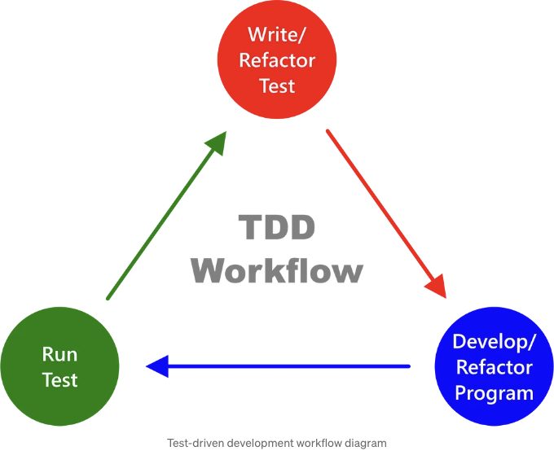
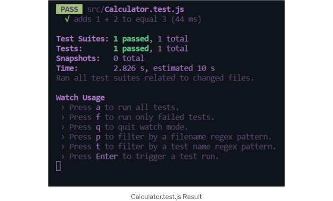

```markdown


## Prerequisites

- JavaScript 기본 이해
- React 개념에 익숙함

## Tools Used
```  

<!-- ui-log 수평형 -->
<ins class="adsbygoogle"
  style="display:block"
  data-ad-client="ca-pub-4877378276818686"
  data-ad-slot="9743150776"
  data-ad-format="auto"
  data-full-width-responsive="true"></ins>
<component is="script">
(adsbygoogle = window.adsbygoogle || []).push({});
</component>

- React
- Jest (테스트용)
- React Testing Library

# 단계 1: React 프로젝트 설정하기

```js
npx create-react-app my-tdd-app
cd my-tdd-app
```

```js
npm install --save-dev @testing-library/react @testing-library/jest-dom jest
```

<!-- ui-log 수평형 -->
<ins class="adsbygoogle"
  style="display:block"
  data-ad-client="ca-pub-4877378276818686"
  data-ad-slot="9743150776"
  data-ad-format="auto"
  data-full-width-responsive="true"></ins>
<component is="script">
(adsbygoogle = window.adsbygoogle || []).push({});
</component>

# 단계 2: 첫 번째 테스트 작성

```js
touch src/Calculator.test.js
```

```js
// src/Calculator.test.js

import React from 'react';
import { render, screen, fireEvent } from '@testing-library/react';
import Calculator from './Calculator';

test('1 + 2를 더한 결과가 3이 되어야 합니다', () => {
  render(<Calculator />);
  const number1Input = screen.getByLabelText('Number 1:');
  const number2Input = screen.getByLabelText('Number 2:');
  const addButton = screen.getByText('Add');

  fireEvent.change(number1Input, { target: { value: '1' } });
  fireEvent.change(number2Input, { target: { value: '2' } });
  fireEvent.click(addButton);

  const result = screen.getByTestId('result');
  expect(result).toHaveTextContent('3');
});
```

# 단계 3: 계산기 컴포넌트 생성

<!-- ui-log 수평형 -->
<ins class="adsbygoogle"
  style="display:block"
  data-ad-client="ca-pub-4877378276818686"
  data-ad-slot="9743150776"
  data-ad-format="auto"
  data-full-width-responsive="true"></ins>
<component is="script">
(adsbygoogle = window.adsbygoogle || []).push({});
</component>

```js
// src/Calculator.js

import React, { useState } from 'react';

const Calculator = () => {
  const [number1, setNumber1] = useState('');
  const [number2, setNumber2] = useState('');
  const [result, setResult] = useState('');

  const handleAdd = () => {
    const sum = parseFloat(number1) + parseFloat(number2);
    setResult(sum);
  };

  return (
    <div>
      <input
        type="text"
        value={number1}
        onChange={(e) => setNumber1(e.target.value)}
        aria-label="Number 1:"
      />
      <input
        type="text"
        value={number2}
        onChange={(e) => setNumber2(e.target.value)}
        aria-label="Number 2:"
      />
      <button onClick={handleAdd}>더하기</button>
      <p data-testid="result">결과: {result}</p>
    </div>
  );
};

export default Calculator;
```

# 단계 4: 테스트 실행

```js
npm test
```

<!-- ui-log 수평형 -->
<ins class="adsbygoogle"
  style="display:block"
  data-ad-client="ca-pub-4877378276818686"
  data-ad-slot="9743150776"
  data-ad-format="auto"
  data-full-width-responsive="true"></ins>
<component is="script">
(adsbygoogle = window.adsbygoogle || []).push({});
</component>



# 단계 5: 리팩터링 및 반복

- 필요에 따라 코드를 리팩터링합니다.
- 추가 기능이나 경계 케이스에 대한 더 많은 테스트를 작성합니다.
- 계산기 앱이 완성될 때까지 테스트 작성, 코드 구현, 리팩터링 프로세스를 반복합니다.

# 결론

<!-- ui-log 수평형 -->
<ins class="adsbygoogle"
  style="display:block"
  data-ad-client="ca-pub-4877378276818686"
  data-ad-slot="9743150776"
  data-ad-format="auto"
  data-full-width-responsive="true"></ins>
<component is="script">
(adsbygoogle = window.adsbygoogle || []).push({});
</component>

이 튜토리얼에서는 React JavaScript에서 간단한 계산기 애플리케이션을 구축함으로써 Test Driven Development (TDD)를 적용하는 방법을 배웠어요. 테스트를 먼저 작성함으로써 코드가 원하는 요구사항을 충족하고 철저히 테스트되었음을 보장할 수 있어요. 지속적으로 테스트를 작성하고 코드를 구현하며 리팩토링하여 견고하고 신뢰할 수 있는 React 애플리케이션을 만들어 나가세요.