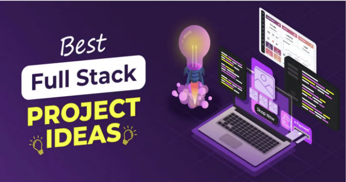
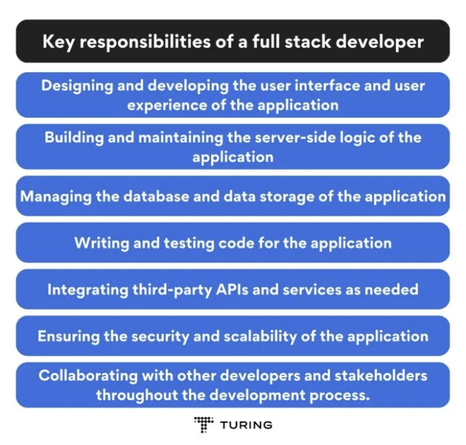
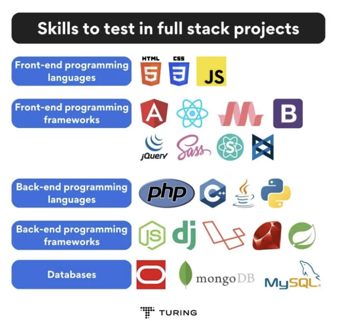
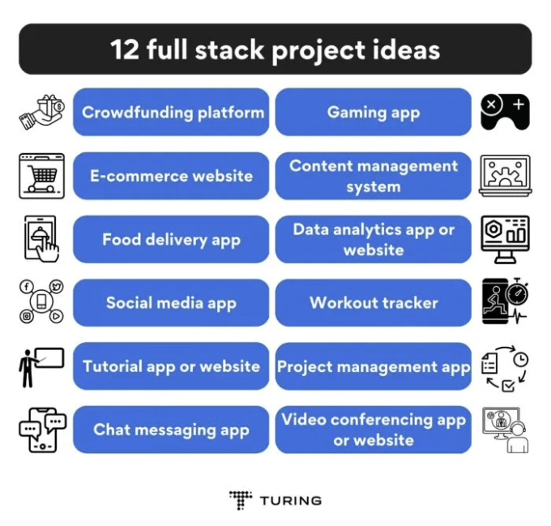

풀 스택 프로젝트 아이디어를 찾고 계신가요? 당신이 옳은 곳에 오신 것을 환영합니다. 아시다시피, 풀 스택 개발자는 코드, 데이터베이스, 서버 및 플랫폼을 독립적으로 처리하여 엔드 투 엔드 프로그램을 설계하고 구축합니다. 그래서 풀 스택 개발자는 어떤 회사의 프로젝트 성공에 중요한 역할을 합니다. 당연히, 풀 스택 개발자 직업은 매우 높은 수요가 있습니다.

풀 스택을 효과적으로 배우고 실력을 과시하고 싶다면, 포트폴리오에 멋진 풀 스택 프로젝트를 추가해야 합니다. 이 글에서는 개발자들을 위한 흥미로운 풀 스택 프로젝트 개발 아이디어 열두 가지를 찾아보실 수 있습니다. 하지만 그 전에, 풀 스택 개발의 기본을 알아보겠습니다.

# 풀 스택 프로젝트 개발이란?

<!-- ui-log 수평형 -->
<ins class="adsbygoogle"
  style="display:block"
  data-ad-client="ca-pub-4877378276818686"
  data-ad-slot="9743150776"
  data-ad-format="auto"
  data-full-width-responsive="true"></ins>
<component is="script">
(adsbygoogle = window.adsbygoogle || []).push({});
</component>

풀 스택 프로젝트 개발은 웹 응용 프로그램의 프론트 엔드(클라이언트 측)와 백 엔드(서버 측)를 생성하는 과정입니다. 풀 스택 프로젝트는 솔루션 스택에 따라 웹, 모바일 또는 네이티브 애플리케이션 프로젝트가 될 수 있습니다.

풀 스택 프로젝트 개발 프로세스에는 일반적으로 프로젝트 계획, 디자인, 구현, 테스트 및 배포와 같은 여러 단계가 포함됩니다. 풀 스택 개발자는 다양한 기술 스킬과 기술에 대한 전문 지식뿐만 아니라 개발 프로세스 전반에 걸쳐 다른 개발자 및 이해 관계자와 협업할 수 있는 능력도 갖추어야 합니다.

풀 스택 프로젝트 개발에서 풀 스택 개발자의 주요 책임 중 일부는 다음과 같습니다:

<!-- ui-log 수평형 -->
<ins class="adsbygoogle"
  style="display:block"
  data-ad-client="ca-pub-4877378276818686"
  data-ad-slot="9743150776"
  data-ad-format="auto"
  data-full-width-responsive="true"></ins>
<component is="script">
(adsbygoogle = window.adsbygoogle || []).push({});
</component>

풀 스택 개발자의 주요 업무 책임

- 애플리케이션의 사용자 인터페이스 및 사용자 경험을 설계하고 개발하기
- 애플리케이션의 서버 측 로직을 구축하고 유지하기
- 애플리케이션의 데이터베이스 및 데이터 저장소 관리하기
- 애플리케이션을 위한 코드 작성 및 테스트하기
- 필요에 따라 타사 API 및 서비스를 통합하기
- 애플리케이션의 보안 및 확장성 보장하기
- 개발 프로세스 전반에 걸쳐 다른 개발자 및 이해관계자들과 협업하기

풀 스택 프로젝트에서 시험해야 할 기술: 

<!-- ui-log 수평형 -->
<ins class="adsbygoogle"
  style="display:block"
  data-ad-client="ca-pub-4877378276818686"
  data-ad-slot="9743150776"
  data-ad-format="auto"
  data-full-width-responsive="true"></ins>
<component is="script">
(adsbygoogle = window.adsbygoogle || []).push({});
</component>

프론트엔드 프로그래밍 언어: HTML, CSS, JavaScript 등

- 프론트엔드 프로그래밍 프레임워크: AngularJS, ReactJS, Materialize, Bootstrap, jQuery, SASS, Semantic-UI, ExpressJS, BackboneJS 등
- 백엔드 프로그래밍 언어: PHP, C++, Java, Python 등
- 백엔드 프로그래밍 프레임워크: NodeJS, Django, Express, Laravel, Ruby on Rails, Spring 등
- 데이터베이스: Oracle, MongoDB, MySQL 등

# 2024년을 위한 풀 스택 프로젝트 아이디어

<!-- ui-log 수평형 -->
<ins class="adsbygoogle"
  style="display:block"
  data-ad-client="ca-pub-4877378276818686"
  data-ad-slot="9743150776"
  data-ad-format="auto"
  data-full-width-responsive="true"></ins>
<component is="script">
(adsbygoogle = window.adsbygoogle || []).push({});
</component>

풀스택 프로젝트는 초급부터 고급 수준까지 다양합니다. 초급 수준의 풀스택 프로젝트로는 할 일 목록 애플리케이션, 블로깅 플랫폼, 날씨 앱 등이 있습니다. 고급 풀스택 프로젝트로는 전자 상거래 플랫폼, 실시간 협업 편집 도구, AR 애플리케이션이 있습니다.

2024년에 만들 수 있는 최고의 풀스택 프로젝트 아이디어를 살펴봅시다.

- 보상 기반 온라인 크라우드펀딩 플랫폼

- 풀스택 프로젝트 아이디어를 찾고 있다면, 기술, 창의적 작품, 커뮤니티 주도 프로젝트에 투자할 수 있는 크라우드펀딩 플랫폼이 좋은 옵션이 될 수 있습니다. 사람들은 혜택이나 보상(할인, 쿠폰 등)을 받기 위해 프로젝트를 지원하기 위해 시스템에 돈을 투입합니다.
- 예를 들어, 보석 디자이너가 100달러를 기부한 모든 사람들에게 오리지널 수제 팔찌를 제공할 수 있습니다.
- 간단하게 말하면, 크라우드펀딩 플랫폼은 사업가가 자신의 프로젝트나 비즈니스 아이디어와 자금 조달 목표를 기술하는 데 도움이 됩니다.
- 프론트엔드 개발로 개발자는 크라우드펀딩 플랫폼이 매력적인 대시보드, 사용자 친화적 인터페이스, 반응형 채팅 상자를 갖추도록 보장합니다. 이와 유사하게, 백엔드 개발로 사용자 정보와 웹사이트 데이터를 관리합니다. 이것은 훌륭한 고급 풀스택 개발 프로젝트 중 하나일 수 있습니다.
- 인기있는 크라우드펀딩 플랫폼: Compassion, Canada Helps, Indiegogo, FundRazr 등.

<!-- ui-log 수평형 -->
<ins class="adsbygoogle"
  style="display:block"
  data-ad-client="ca-pub-4877378276818686"
  data-ad-slot="9743150776"
  data-ad-format="auto"
  data-full-width-responsive="true"></ins>
<component is="script">
(adsbygoogle = window.adsbygoogle || []).push({});
</component>

- 전자 상거래 웹 사이트

- 전자 상거래 웹 사이트의 풀 스택 개발 프로젝트는 상당한 백엔드 프로그래밍을 필요로 합니다. 이로 인해 그들은 가장 인기 있는 고급 풀 스택 프로젝트 중 하나가 됩니다.
- 예를 들어, 쇼핑 카트를 관리하기 위해서는 방문자의 방문 동안 데이터 조작이 많이 필요합니다. API는 전자 상거래 사이트를 PayPal이나 RazorPay와 같은 은행 시스템에 연결하여 소비자가 결제 정보를 연동하고 안전하게 거래할 수 있도록 합니다.
- 반면에, 개발자들은 프런트엔드 개발을 사용하여 제품과 서비스를 소비자에게 제공하고 사이트가 쉽게 탐색 가능하도록 합니다.
- 인기 있는 전자 상거래 플랫폼: 아마존, 이베이, 월마트, 에츠이, 크레이그리스트 등

- 음식 배달 앱

- 풀 스택 개발을 위한 프로젝트 아이디어 목록에서 음식 배달 앱이 다음으로 나옵니다. 최근 몇 년간 음식 배달 애플리케이션이 인기를 얻고 있습니다. 이러한 앱은 식료품 쇼핑, 식사 계획, 레시피 및 음식 배송과 같은 다양한 기능을 제공합니다.
- 프런트엔드 개발의 도움으로 음식 배달 앱은 레스토랑과 음식 주문이 매력적으로 보이도록 세밀한 비주얼로 제시합니다. 유사하게, 백엔드 개발로 음식 배달 앱은 사용자 데이터와 앱 반응성을 유지합니다.
- 인기 있는 음식 배달 앱: 그럽허브, 두어대시, 포스트메이츠, 우버 이츠 등

<!-- ui-log 수평형 -->
<ins class="adsbygoogle"
  style="display:block"
  data-ad-client="ca-pub-4877378276818686"
  data-ad-slot="9743150776"
  data-ad-format="auto"
  data-full-width-responsive="true"></ins>
<component is="script">
(adsbygoogle = window.adsbygoogle || []).push({});
</component>

- 소셜 미디어 앱

- 또 다른 훌륭한 풀 스택 프로젝트 예시로는 소셜 미디어 앱이 있습니다. 이러한 앱은 온라인으로 소통할 수 있게 해주며 풀 스택 개발에 대한 최고의 프로젝트 아이디어 중 하나일 수 있습니다. 프론트엔드와 백엔드를 모두 활용하여, 개발자들은 콘텐츠를 업로드하고 보고 공유할 수 있는 앱을 개발할 수 있습니다.
- 사용자가 다른 미디어와 텍스트 블록을 스크롤하도록 허용하려면 상당한 프론트엔드 코딩이 필요합니다. 마찬가지로, 백엔드 코딩을 통해 수백만 개의 상호작용 데이터를 저장해야합니다. 소셜 미디어 앱 아이디어는 개발자가 2024년에 작업할 수 있는 고급 풀 스택 프로젝트 중 하나입니다.
- 인기 있는 소셜 미디어 앱: Facebook, Instagram, Tik Tok, LinkedIn 등.

- 튜토리얼 앱 또는 웹사이트

- 풀 스택 개발자를 위한 프로젝트에 대해 이야기할 때 튜토리얼 앱을 빼놓을 수 없습니다. 지난 몇 년간 녹화 자원 형태의 온라인 수업과 다른 온라인 세션이 증가했습니다.
- 풀 스택 개발을 사용하여 튜토리얼 앱을 만들 수 있습니다. 이를 위해 React, Redux, HTML/CSS와 같은 프론트엔드 기술 및 Node.js, Express 또는 MongoDB와 같은 백엔드 기술이 필요합니다. JWT를 사용하여 튜토리얼 앱에 인증 모듈을 만들 수 있습니다.
- 토론 포럼을 만들기 위해 Socket.io를 사용할 수 있습니다. 학교 수준부터 전문적인 전문 분야까지의 콘텐츠를 포함할 수 있는 튜토리얼 앱을 만들 수 있습니다. 콘텐츠를 유료 또는 무료로 유지할 수 있습니다.
- 전반적으로, 튜토리얼 앱을 만드는 것은 풀 스택 개발 프로젝트의 잠재력을 탐색하고 사람들의 삶에 가치를 더할 수 있는 것을 만드는 좋은 방법입니다.
- 일부 인기 있는 튜토리얼 앱은 Udemy, Codeacademy, Coursera, Pluralsight 등이 있습니다.

<!-- ui-log 수평형 -->
<ins class="adsbygoogle"
  style="display:block"
  data-ad-client="ca-pub-4877378276818686"
  data-ad-slot="9743150776"
  data-ad-format="auto"
  data-full-width-responsive="true"></ins>
<component is="script">
(adsbygoogle = window.adsbygoogle || []).push({});
</component>

- 채팅 메시징 어플

- 인기 있는 풀 스택 개발자 프로젝트로서, 채팅 메시징 소프트웨어는 개인 또는 그룹 간의 메시지 교환을 가능하게 합니다. 채팅 메시징 앱은 복잡하지 않습니다. 그러나 메시지를 보내고 받고 미래 참조를 위해 저장하는 것은 프론트엔드 및 백엔드 개발 작업이 모두 필요합니다. 다음 기능을 채팅 메시징 어플에 추가해야 합니다:

- 사용자 등록 및 로그인
- 어플 사용자간의 개인 메시징 옵션
- 여러 사용자가 실시간으로 함께 채팅할 수 있는 그룹 생성 허용
- 사진, 동영상 또는 문서와 같은 미디어를 보내고 받을 수 있는 기능
- 메시징이 안전하게 보장되도록 종단 간 암호화
- 메시지 상태를 알 수 있도록 읽은 표시 및 받은 표시와 같은 인디케이터
- 메시지를 위한 푸시 알림 알림
- 인기 있는 채팅 메시징 어플: Whatsapp, Snapchat, Viber, Telegram, Line, WeChat, 등.

게임 어플

<!-- ui-log 수평형 -->
<ins class="adsbygoogle"
  style="display:block"
  data-ad-client="ca-pub-4877378276818686"
  data-ad-slot="9743150776"
  data-ad-format="auto"
  data-full-width-responsive="true"></ins>
<component is="script">
(adsbygoogle = window.adsbygoogle || []).push({});
</component>

- **고급 풀스택 프로젝트를 찾고 있다면, 언제든 게임 앱을 만들어보세요. 게임 앱에는 등록 및 로그인 프로세스 사용, 실시간으로 다른 사용자와 게임을 할 수 있는 멀티플레이어 기능, 게임 중에 플레이어가 서로 소통할 수 있는 채팅 기능, 리더보드, 가상 통화 등과 같은 일반적인 기능들을 구현해야 합니다. 요구되는 스택은 다음과 같습니다:

- Front end: React, Redux, HTML/CSS
Back end: Node.js, Express, MongoDB
Authentication: JWT
Virtual currency: Payment gateway integration
- 게임의 흐름을 계획하고 위에서 언급된 백엔드 기술을 사용하여 개발을 시작해야 합니다. 게임 앱은 사용자들과 소통하고 커뮤니티를 형성하는 재미있는 방법입니다. 또한 풀스택 개발자로서 기술을 연마하는 좋은 방법이 될 것입니다.
- 인기 있는 게임 앱: Fortnite, Minecraft, League of Legends, World of Warcraft, Among Us 등등.

# 콘텐츠 관리 시스템

- 다음으로 고려해볼 풀스택 프로젝트 아이디어는 CMS입니다. 콘텐츠 관리 시스템(CMS)은 기업 고객들을 위해 정보를 관리하고 전략을 세우는 편리한 도구입니다. 콘텐츠 생성 및 수정, 콘텐츠 성능 보고 및 분석, 보안 표준 유지, 역할 기반 관리가 CMS의 핵심 기능입니다.
- 이 소프트웨어는 일반적인 메시징 앱보다 개발이 더 어렵습니다. 그래서 초보자라면 이런 고급 풀스택 프로젝트부터 시작하는 것을 피하세요. 이 테스트에는 시니어 개발자가 더 적합할 것입니다. CMS의 사용자 인터페이스가 접근 가능하고 잘 구성되어 있는지, 콘텐츠 관리에 사용되는 데이터가 안전하고 신뢰할 수 있다는 점을 보장할 수 있는 개발자를 찾아보세요.
- 인기 있는 콘텐츠 관리 시스템: WordPress, Wix, Squarespace, Weebly 등등.

- 데이터 분석 앱 또는 웹사이트**

<!-- ui-log 수평형 -->
<ins class="adsbygoogle"
  style="display:block"
  data-ad-client="ca-pub-4877378276818686"
  data-ad-slot="9743150776"
  data-ad-format="auto"
  data-full-width-responsive="true"></ins>
<component is="script">
(adsbygoogle = window.adsbygoogle || []).push({});
</component>

- 데이터 분석 직업은 오늘날 높은 수요를 누리고 있어요. 데이터 중심 세계에서 데이터 분석 앱은 시작하기에 좋은 고급 풀 스택 프로젝트 중 하나일 수 있어요. 수많은 데이터를 추적하는 것이 정말 어려워지는데, 여러분은 데이터를 저장하고 추적할 수 있는 응용 프로그램을 만들 수 있어요.
- 뒷단을 구축하기 위해 Node.js, MongoDB 또는 PostgreSQL 같은 기술을 사용할 수 있어요. 프런트 엔드에는 React, Redux 또는 HTML/CSS를 사용할 수 있어요. 데이터 시각화를 위해서는 D3.js 또는 Chart.js를 사용해야 해요.
- 여러분의 앱은 유용하게 사용하기 위해 다음과 같은 기능과 능력을 가져야 해요:

  - 차트, 그래프, 테이블과 같은 다양한 형식으로 데이터 시각화 가능
  - 보고서와 대시보드를 저장하거나 다른 앱 사용자와 공유 가능
  - Google Analytics 또는 Facebook 광고와 같은 타사 서비스와 통합
  - CSV 파일이나 데이터베이스와 같은 여러 데이터 소스와 연결 가능
  - 인기 있는 데이터 분석 앱: Tableau, Power BI, Mixpanel 등

운동 추적기

- 또 다른 훌륭한 풀 스택 개발자 프로젝트는 운동 추적기에요. 요즘, 운동 모니터는 걸음 수 측정 장치 이상입니다. 이러한 모니터는 심박수, 수면 주기 및 기타 여러 활동을 저장합니다. 시간이 흐름에 따라 이러한 활동의 성능 분석을 제공합니다.
- 이 풀 스택 프로젝트에서는 뒷단 개발이 기능과 데이터 관리를 담당하고, 프런트 엔드 개발은 앱 UI와 데이터 표현을 담당합니다. 사용자들을 위해 보다 사용하기 편리하게 만들기 위해 진행 추적, 운동 훈련, 운동 라이브러리, 운동 계획, 소셜 기능, 알림 등과 같은 기능을 운동 추적기 앱에 포함시켜야 해요.
- 인기 있는 운동 추적기 앱: Strava, FitBit track, Freeletics, Seven, JEFIT, Openfit 등.

<!-- ui-log 수평형 -->
<ins class="adsbygoogle"
  style="display:block"
  data-ad-client="ca-pub-4877378276818686"
  data-ad-slot="9743150776"
  data-ad-format="auto"
  data-full-width-responsive="true"></ins>
<component is="script">
(adsbygoogle = window.adsbygoogle || []).push({});
</component>

- 프로젝트 관리 앱

- 가장 인기 있는 풀 스택 프로젝트 예시 중 하나는 프로젝트 관리 앱입니다. 이름에서 알 수 있듯이, 이를 통해 팀은 다양한 규모의 프로젝트를 효과적으로 관리할 수 있습니다. 프로젝트 관리 앱을 사용하면 반복적인 작업에 시간을 낭비하지 않고 전략적인 프로젝트 요구사항에 집중할 수 있습니다.
- 프로젝트 관리 도구는 프론트엔드와 백엔드 프로그래밍을 널리 활용합니다. 프론트엔드는 매력적인 대시보드, 반응형 페이지 및 사용자 친화적인 보고서를 생성하고, 반면에 백엔드는 API 통합, 데이터 관리, 연결성, 지도 태깅 등을 처리합니다.
- 인기 있는 프로젝트 관리 앱: Trello, Jira, Asana, ClickUp, Wrike, Airtable, GoodDay 등

- 비디오 회의 앱 또는 웹사이트

- 대규모로 채택된 하이브리드 또는 원격 근무로 인해 Zoom, Google Meet, Microsoft Teams 등과 같은 비디오 회의 앱 및 웹사이트가 우리 삶의 중요한 부분이 되었습니다.
- 2024년에 시작할 고급 풀 스택 개발 프로젝트를 찾고 있다면, 비디오 회의 앱은 좋은 프로젝트가 될 수 있습니다. 다양한 기술과 기능이 필요하여 포괄적이고 사용자 친화적인 플랫폼을 만들기 위한 도전적인 프로젝트입니다.
- 프론트엔드로 HTML, CSS, JavaScript, React, Bootstrap 또는 Material UI를 사용할 수 있습니다. 백엔드로는 Node.js 또는 Express를 사용할 수 있습니다. 데이터베이스로는 MongoDB 또는 PostgreSQL를 사용할 수 있고, 배포에는 AWS를 사용할 수 있습니다. 귀하의 앱 또는 웹사이트는 다음 기능을 지원해야 합니다:

<!-- ui-log 수평형 -->
<ins class="adsbygoogle"
  style="display:block"
  data-ad-client="ca-pub-4877378276818686"
  data-ad-slot="9743150776"
  data-ad-format="auto"
  data-full-width-responsive="true"></ins>
<component is="script">
(adsbygoogle = window.adsbygoogle || []).push({});
</component>

- 다수 참가자와 함께 하는 비디오 및 오디오 회의
- 화면 및 파일 공유 기능
- 안전한 사용자 인증 및 데이터 암호화
- 녹화 및 재생 기능
- 인기 있는 비디오 회의 앱 또는 웹사이트: Skype, Zoom, Google Meet, 등

# 2024년에 왜 풀 스택 개발이 중요한가요?

2024년에는 전 세계적으로 풀 스택 개발자에 대한 수요가 증가하고 있기 때문에 반드시 풀 스택 개발을 배워야 합니다. 2024년에 풀 스택 개발이 중요한 이유는 다음과 같습니다:

- 효율성 증대: 풀 스택 개발은 개발 프로세스의 효율성을 높입니다. 개발자들이 프로젝트의 프론트엔드와 백엔드 모두에 작업할 수 있게 합니다. 개발자들은 프로젝트의 다른 부분으로 쉽게 전환하여 문제를 해결하고 업데이트를 수월하게 할 수 있습니다.
- 원활한 커뮤니케이션: 풀 스택 개발은 프론트엔드와 백엔드 개발자 간의 원활한 커뮤니케이션과 협업을 촉진합니다. 풀 스택 개발자들은 둘 다에 대한 이해를 가지고 있어 더 나은 협업과 더 조화로운 개발 팀을 이끌 수 있습니다.
- 높은 유연성과 적응성: 풀 스택 개발자는 다양하며 변화하는 요구사항과 기술에 적응할 수 있는 다재다능한 개발자입니다. 다양한 프로그래밍 언어와 프레임워크 간에 쉽게 전환할 수 있어 기술 산업의 빠르게 변화하는 환경에서 더 유연하고 적응성 있는 역할을 할 수 있습니다.
- 비용 효율성 증대: 전체 개발 프로세스를 처리할 수 있는 소프트웨어 개발자를 고용하는 것은 여러 영역에 대한 복수의 개발자를 고용하는 것보다 기업에게 더 비용 효율적일 수 있습니다. 특히 작은 프로젝트의 경우 기업들에게 시간과 비용을 절약할 수 있습니다.

<!-- ui-log 수평형 -->
<ins class="adsbygoogle"
  style="display:block"
  data-ad-client="ca-pub-4877378276818686"
  data-ad-slot="9743150776"
  data-ad-format="auto"
  data-full-width-responsive="true"></ins>
<component is="script">
(adsbygoogle = window.adsbygoogle || []).push({});
</component>

# 결론

풀 스택 프로젝트 개발은 현재 끊임없이 변화하는 경쟁적인 환경에서 훌륭한 선택입니다. 기억해야 할 점은 위에서 언급된 풀 스택 프로젝트 아이디어가 모두는 아니라는 것입니다. 이러한 프로젝트들은 소스 코드가 공개되어 있어 인기가 많습니다. 더 많은 풀 스택 프로젝트를 진행할 수 있습니다. 계속해서 새로운 아이디어를 시도하여 풀 스택 개발 능력을 향상시키세요.