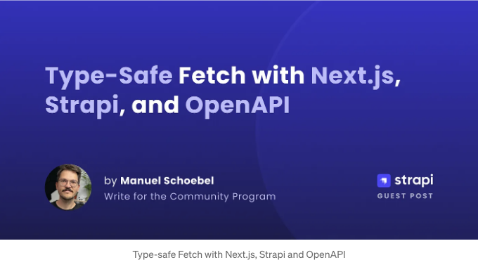

이 블로그 포스트에서는 Strapi 백엔드에 사용되는 프론트엔드 애플리케이션에서 타입 안전성을 어떻게 달성할 수 있는지에 대해 알려드릴 거에요. REST API와 fetch 함수를 사용하여 몇 줄의 코드로 이를 실현할 수 있어요.

비디오 형식의 내용을 선호하신다면, 유튜브에서 원본 버전을 확인해보세요: Type-Safe Fetch with Next.js, Strapi, and OpenAPI.

# TypeScript를 왜 사용해야 하나요?

<!-- ui-log 수평형 -->
<ins class="adsbygoogle"
  style="display:block"
  data-ad-client="ca-pub-4877378276818686"
  data-ad-slot="9743150776"
  data-ad-format="auto"
  data-full-width-responsive="true"></ins>
<component is="script">
(adsbygoogle = window.adsbygoogle || []).push({});
</component>

TypeScript는 JavaScript 앱에서 여러 가지 방법으로 도움을 줍니다. 어떤 유형의 인터페이스를 사용하는 것이 쉽도록 만듭니다.

예를 들어, 컴포넌트의 속성이 타입 지정되어 있으면 해당 컴포넌트를 사용하는 것이 훨씬 더 간단해집니다. 그러나 타입이 지정된 속성으로 리액트 컴포넌트를 개발할 때는 컴포넌트를 구현하는 데 사용할 데이터를 알 수 있습니다.

또한 TypeScript는 외부 서비스와 상호 작용할 때도 크게 도움이 될 수 있습니다. 

GraphQL과 같은 기술을 사용할 때 TypeScript 유형을 추출하는 것은 아주 쉽습니다. GraphQL API는 스키마를 구현하여 생성됩니다. 이 스키마에서 TypeScript 유형 정의를 생성하는 것은 간단하며, GraphQL API만 만들면 더 이상의 작업을 할 필요가 없습니다. 이것이 GraphQL을 매우 좋아하는 이유 중 하나입니다.

<!-- ui-log 수평형 -->
<ins class="adsbygoogle"
  style="display:block"
  data-ad-client="ca-pub-4877378276818686"
  data-ad-slot="9743150776"
  data-ad-format="auto"
  data-full-width-responsive="true"></ins>
<component is="script">
(adsbygoogle = window.adsbygoogle || []).push({});
</component>

다른 방법들은 이미 TypeScript를 이름에 포함한 tRPC (TypeScript Remote Procedure Calls)와 같은 것들이 있습니다. API를 개발할 때는 자연스럽게 타입을 생성하게 됩니다.

그러나 가장 일반적으로 사용되는 API는 여전히 간단한 JSON API(일반적으로 REST API로 불림)입니다. 이 API는 본질적으로 URL을 제공하고 그에 대한 "무엇인가" JSON 객체를 반환합니다.

REST API를 사용하는 것은 완전히 타입이 지정된 API에 익숙한 경우 더 즐거울 수 있습니다. 응답을 기록하기 시작하거나 이 API에 대한 문서를 찾아봐야 할 수 있습니다. 문서와 API가 기술적으로 통합되지 않았음을 알기 때문에 문서와 API가 서로 "동기화되어 있지 않은" 경우가 더 많습니다.

그러나 REST API는 여전히 사실상의 표준이며 가장 많이 사용되는 유형의 API이므로 주변에는 다양한 도구들이 많이 있습니다.

<!-- ui-log 수평형 -->
<ins class="adsbygoogle"
  style="display:block"
  data-ad-client="ca-pub-4877378276818686"
  data-ad-slot="9743150776"
  data-ad-format="auto"
  data-full-width-responsive="true"></ins>
<component is="script">
(adsbygoogle = window.adsbygoogle || []).push({});
</component>

# OpenAPI

그 중 하나는 OpenAPI 명세서입니다. GraphQL과 대조적으로, API로 사용할 스키마를 만들지 않습니다. 먼저 API를 독립적으로 만든 다음 OpenAPI 형식의 기술 명세서를 작성하여 설명합니다.

이 OpenAPI 명세서를 통해 시각적 설명을 도와주는 UI를 생성하거나 API에 대한 샌드박스 환경으로 사용할 수 있습니다. 본질적으로, GraphQL API와 그것의 Playgrounds와 크게 다르지 않습니다.

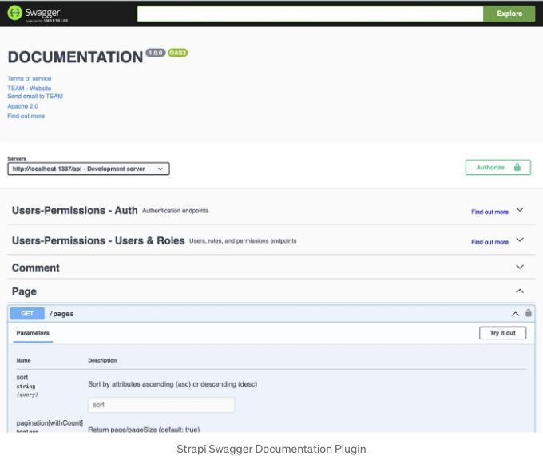

<!-- ui-log 수평형 -->
<ins class="adsbygoogle"
  style="display:block"
  data-ad-client="ca-pub-4877378276818686"
  data-ad-slot="9743150776"
  data-ad-format="auto"
  data-full-width-responsive="true"></ins>
<component is="script">
(adsbygoogle = window.adsbygoogle || []).push({});
</component>

# 그래도 REST는 여전히 유용한가요?

REST API의 보편성은 동시에 가장 큰 장점이기도 합니다. 웹 개발자라면 REST API에 익숙하지 않을 확률이 거의 없습니다. 특히 더 오래된 IT 시스템이나 복잡한 IT 거버넌스 프로세스가 있는 환경에서는 특히 그렇습니다.

간단한 REST API의 또 다른 큰 장점은 오랜 시간을 견디기 쉽다는 것입니다. 기술과 그에 따른 최상의 방법론은 여전히 빠르게 변화하고 있습니다. 기본적인 빌딩 블록이 보다 보편적이고 복잡하지 않을수록, 그것들이 몇 년 후에도 여전히 사용될 가능성이 높아집니다.

예를 들어 GraphQL이 있습니다. 웹 프로젝트에서는 일반적으로 GraphQL을 Apollo와 같은 매우 복잡한 클라이언트 라이브러리와 함께 사용합니다. 이러한 라이브러리는 데이터 정규화, 상태 유지 및 캐싱과 같은 많은 작업을 수행합니다. 이는 더 많은 자바스크립트 페이로드를 필요로 합니다. 그러나 상황이 변할 때 모든 기능을 계속 사용하고 싶지 않을 수 있으며, 새로운 접근 방식과 통합하여 사용하기가 더 어려워질 수 있습니다.

<!-- ui-log 수평형 -->
<ins class="adsbygoogle"
  style="display:block"
  data-ad-client="ca-pub-4877378276818686"
  data-ad-slot="9743150776"
  data-ad-format="auto"
  data-full-width-responsive="true"></ins>
<component is="script">
(adsbygoogle = window.adsbygoogle || []).push({});
</component>

우리는 현시점에서, 클라이언트 중심의 JavaScript 개발자로 다시 서버 방향으로 이동하고 있어요. Next.js 서버 컴포넌트와 프레임워크 자체에 많은 캐싱 메커니즘이 내장되어 있어 클라이언트 측의 일부 복잡성이 다시 사라지고 있어요. 또한 next.js는 네이티브 fetch API를 확장하고 있으므로, 자체 데이터 가져오기를 구현하는 도구에 의존하는 경우 더 복잡해질 수 있어요.

# 계획

이것이 나의 접근 방법이에요. 간단한데도 TypeScript 지원이 훌륭하고 즐겨 사용하는 헤드리스 CMS인 Strapi와 잘 작동해요.

개념적으로는 REST API의 OpenAPI 스키마, 이를 통해 TypeScript 유형 정의를 생성하는 방법, 그리고 실제로 이러한 유형 정의를 사용하는 방법이 필요해요. 다행히도 이러한 전체 과정을 더욱 간편하게 만들어주는 패키지들이 있어요.

<!-- ui-log 수평형 -->
<ins class="adsbygoogle"
  style="display:block"
  data-ad-client="ca-pub-4877378276818686"
  data-ad-slot="9743150776"
  data-ad-format="auto"
  data-full-width-responsive="true"></ins>
<component is="script">
(adsbygoogle = window.adsbygoogle || []).push({});
</component>

# Strapi에서 OpenAPI 스키마 만들기

Strapi는 @strapi/plugin-documentation라는 공식 플러그인을 제공합니다 (여기). 기존 Strapi 프로젝트에 다음을 사용하여 설치하세요:

```js
npm run strapi install documentation
```

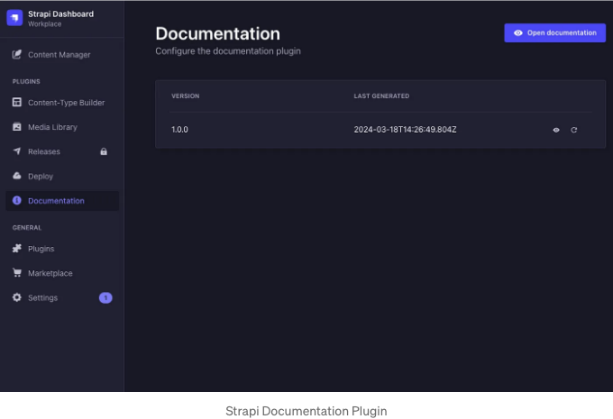

<!-- ui-log 수평형 -->
<ins class="adsbygoogle"
  style="display:block"
  data-ad-client="ca-pub-4877378276818686"
  data-ad-slot="9743150776"
  data-ad-format="auto"
  data-full-width-responsive="true"></ins>
<component is="script">
(adsbygoogle = window.adsbygoogle || []).push({});
</component>

이 플러그인은 두 가지 중요한 기능을 제공합니다.

- Strapi 서비스의 OpenAPI 사양을 JSON 파일로 자동으로 생성합니다.
- REST API를 탐색하고 시도할 수 있는 시각적 문서인 Swagger UI를 제공합니다.

Swagger UI에서는 Strapi 내에서 생성된 Page 컬렉션 유형의 엔드포인트를 볼 수 있습니다. Strapi에서 컬렉션 유형을 만들 때 페이지를 자동으로 만들거나 읽거나 업데이트하거나 삭제할 수 있는 엔드포인트가 있습니다.

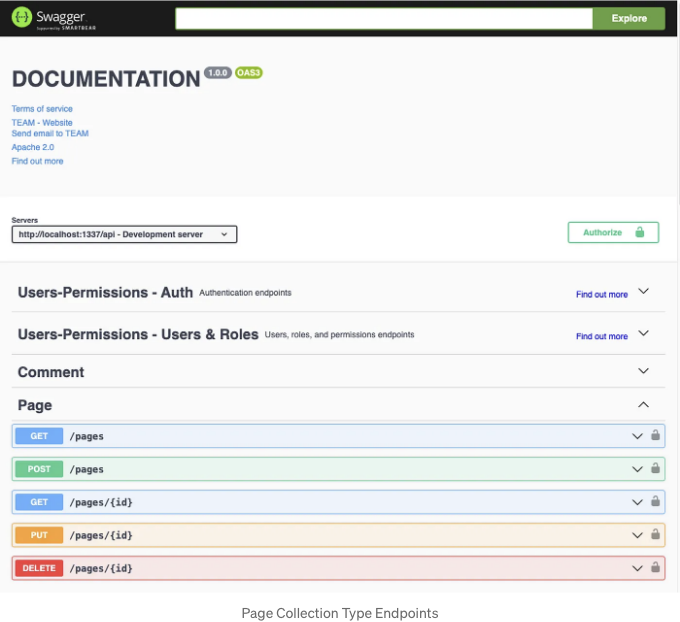

<!-- ui-log 수평형 -->
<ins class="adsbygoogle"
  style="display:block"
  data-ad-client="ca-pub-4877378276818686"
  data-ad-slot="9743150776"
  data-ad-format="auto"
  data-full-width-responsive="true"></ins>
<component is="script">
(adsbygoogle = window.adsbygoogle || []).push({});
</component>

이 UI는 프로젝트 내에서 찾을 수 있는 OpenAPI 스키마 파일에서 생성됩니다.

```js
src/extensions/documentation/documentation/1.0.0/full_documentation.json
```

OpenAPI 명세에서는 API의 모든 기존 경로를 찾을 수 있습니다.

<!-- ui-log 수평형 -->
<ins class="adsbygoogle"
  style="display:block"
  data-ad-client="ca-pub-4877378276818686"
  data-ad-slot="9743150776"
  data-ad-format="auto"
  data-full-width-responsive="true"></ins>
<component is="script">
(adsbygoogle = window.adsbygoogle || []).push({});
</component>

경로 안에서 응답 스키마에 대한 참조도 찾을 수 있습니다. 나중에 매우 중요해질 것입니다:

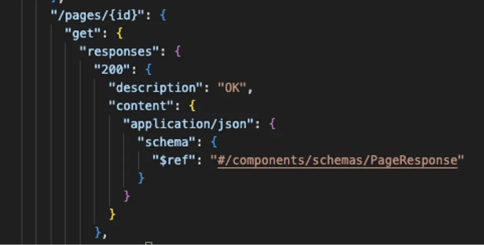

PageResponse 스키마를 자세히 살펴보면 Page 컬렉션 유형의 실제 스키마에 도달하게 됩니다:

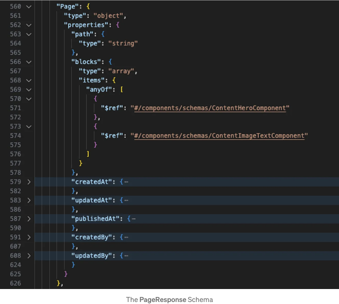

<!-- ui-log 수평형 -->
<ins class="adsbygoogle"
  style="display:block"
  data-ad-client="ca-pub-4877378276818686"
  data-ad-slot="9743150776"
  data-ad-format="auto"
  data-full-width-responsive="true"></ins>
<component is="script">
(adsbygoogle = window.adsbygoogle || []).push({});
</component>

위에서 페이지 컬렉션 유형에 대한 매우 관련된 정보가 표시됩니다. 이 유형은 object 유형입니다. 음... 놀랍지 않게도 그렇습니다. 이 유형은 string 유형의 속성 경로와 다른 유형의 항목을 가진 속성 블록을 가지고 있습니다. ContentHeroComponent 또는 ContentImageTextComponent와 같은 항목입니다. 그리고 여러분이 추측할 수 있듯이, 이것들은 Strapi 구성 요소이며, 이는 여러분의 블록 속성이 OpenAPI 사양 안에 설명된 동적 영역이 되도록 만듭니다.

Strapi에서 페이지는 이렇게 보입니다:

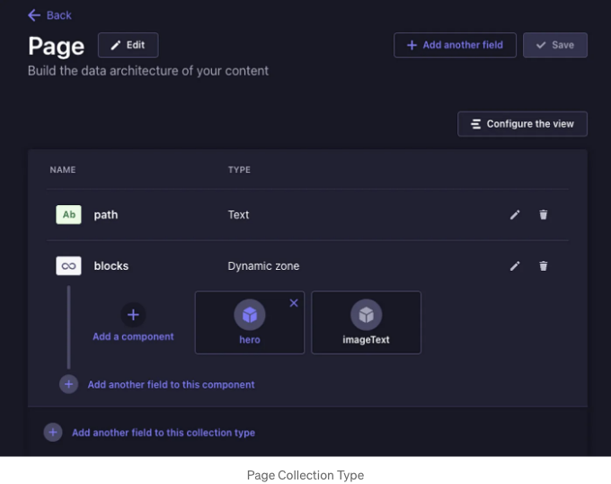

따라서 생성된 OpenAPI 사양이 실제 Strapi에서 정의한 것과 일치함을 알 수 있습니다.

<!-- ui-log 수평형 -->
<ins class="adsbygoogle"
  style="display:block"
  data-ad-client="ca-pub-4877378276818686"
  data-ad-slot="9743150776"
  data-ad-format="auto"
  data-full-width-responsive="true"></ins>
<component is="script">
(adsbygoogle = window.adsbygoogle || []).push({});
</component>

이제 TypeScript 유형 정의를 생성할 수 있어야 합니다.

# TypeScript 유형 정의 생성

이 작업을 수행하려면 openapi-typescript라는 라이브러리가 필요합니다. 이 라이브러리는 OpenAPI 사양이 포함 된 파일이나 해당 URL을 가져 와 TypeScript 유형 정의를 출력합니다.

이 TypeScript 유형 정의를 사용할 것이므로이를 frontend 애플리케이션에 설치해야합니다.

<!-- ui-log 수평형 -->
<ins class="adsbygoogle"
  style="display:block"
  data-ad-client="ca-pub-4877378276818686"
  data-ad-slot="9743150776"
  data-ad-format="auto"
  data-full-width-responsive="true"></ins>
<component is="script">
(adsbygoogle = window.adsbygoogle || []).push({});
</component>

```js
npm install openapi-typescript
```

설치가 완료되면 package.json에 스크립트를 추가하여 생성된 OpenAPI 스펙(또는 URL 엔드포인트)의 경로와 타입 정의를 출력할 위치를 제공할 수 있습니다.

이 예시에서는 Next.js 프론트엔드와 Strapi 백엔드가 루트 레벨의 동일한 폴더에 있습니다:

```js
project-root
        /frontend
        /backend
```

<!-- ui-log 수평형 -->
<ins class="adsbygoogle"
  style="display:block"
  data-ad-client="ca-pub-4877378276818686"
  data-ad-slot="9743150776"
  data-ad-format="auto"
  data-full-width-responsive="true"></ins>
<component is="script">
(adsbygoogle = window.adsbygoogle || []).push({});
</component>

따라서 package.json에 포함된 스크립트는 다음과 같습니다:

```js
"scripts": {
    "dev": "next dev",
    "build": "next build",
    "start": "next start",
    "types:generate": "openapi-typescript ../backend/src/extensions/documentation/documentation/1.0.0/full_documentation.json -o src/api/strapi.d.ts",
    "test:ts": "tsc --noEmit",
    "lint": "next lint"
}
```

스크립트를 실행하는 방법은 매우 간단합니다:

```js
// /frontend 폴더 안에서
npm run types:generate
```

<!-- ui-log 수평형 -->
<ins class="adsbygoogle"
  style="display:block"
  data-ad-client="ca-pub-4877378276818686"
  data-ad-slot="9743150776"
  data-ad-format="auto"
  data-full-width-responsive="true"></ins>
<component is="script">
(adsbygoogle = window.adsbygoogle || []).push({});
</component>

이 명령어는 OpenAPI 사양 파일에서 TypeScript 유형 정의를 포함한 strapi.d.ts 파일을 생성합니다.

생성된 파일을 보면 익숙한 것들을 발견할 수 있어요:

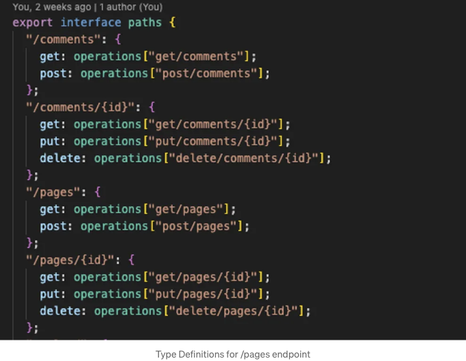

모든 사용 가능한 경로에 대한 인터페이스는 중요합니다. API 루트가 존재하여 /pages 경로를 만들거나 읽거나 업데이트하거나 삭제할 수 있음을 확인할 수 있어요.

<!-- ui-log 수평형 -->
<ins class="adsbygoogle"
  style="display:block"
  data-ad-client="ca-pub-4877378276818686"
  data-ad-slot="9743150776"
  data-ad-format="auto"
  data-full-width-responsive="true"></ins>
<component is="script">
(adsbygoogle = window.adsbygoogle || []).push({});
</component>

동일한 파일의 인터페이스 구성 요소에서 페이지 컬렉션 유형을 찾을 수 있습니다.

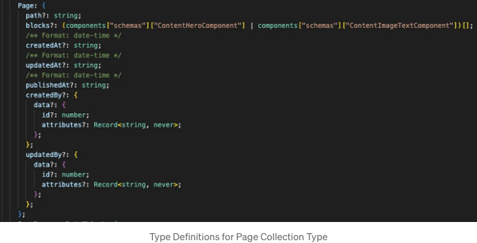

이렇게 하면 이미 Strapi 백엔드에서 만든 페이지 콘텐츠 유형에 TypeScript 유형을 사용할 수 있습니다. 이것이 정말 멋집니다. Strapi의 동적 영역에 있는 블록들도 유형이 지정되고 생성된 구성 요소의 유형도 지정되어 있습니다.

구성 요소의 스키마는 Strapi 백엔드에서 사용할 수 있는 구성을 보여줍니다.

<!-- ui-log 수평형 -->
<ins class="adsbygoogle"
  style="display:block"
  data-ad-client="ca-pub-4877378276818686"
  data-ad-slot="9743150776"
  data-ad-format="auto"
  data-full-width-responsive="true"></ins>
<component is="script">
(adsbygoogle = window.adsbygoogle || []).push({});
</component>

위에서 언급한 ContentImageTextComponent는 이렇게 생겼습니다:

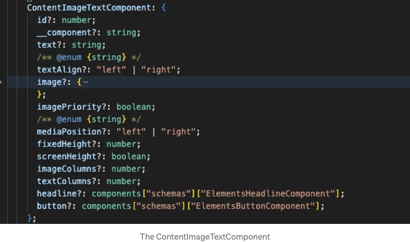

위 이미지에서 볼 수 있듯이, 해당 컴포넌트에는 텍스트와 textAlign과 같은 속성이 있으며, 이들은 왼쪽 또는 오른쪽과 같은 enum 값으로 설정됩니다. 이러한 유형들은 백엔드 Strapi-Component의 그래픽 표현을 개발할 때 프론트엔드에서 React 컴포넌트로 사용할 때 귀중한 유형입니다.

# React 컴포넌트에서 유형 사용하기

<!-- ui-log 수평형 -->
<ins class="adsbygoogle"
  style="display:block"
  data-ad-client="ca-pub-4877378276818686"
  data-ad-slot="9743150776"
  data-ad-format="auto"
  data-full-width-responsive="true"></ins>
<component is="script">
(adsbygoogle = window.adsbygoogle || []).push({});
</component>

지금 생성된 타입을 사용하여 React 컴포넌트를 직접 만들 수 있습니다.

생성된 타입 정의에서 {component}를 가져와서 사용할 수 있습니다. 그리고 필요한 [“스키마”]를 사용하세요. 여기서 ImageText 컴포넌트를 입력하고 프롭에 대한 자동완성을 받을 수 있습니다.

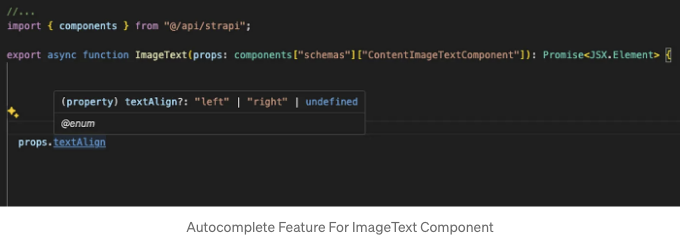

먼저 프롭을 받으려면 데이터를 가져와야 합니다. 물론 데이터 가져오기에도 타입을 활용하고 싶을 것입니다.

<!-- ui-log 수평형 -->
<ins class="adsbygoogle"
  style="display:block"
  data-ad-client="ca-pub-4877378276818686"
  data-ad-slot="9743150776"
  data-ad-format="auto"
  data-full-width-responsive="true"></ins>
<component is="script">
(adsbygoogle = window.adsbygoogle || []).push({});
</component>

# Typed Fetch 사용하기

fetch를 생성된 유형 정의와 함께 사용하려면 openapi-fetch라는 라이브러리를 사용할 수 있습니다. 이 라이브러리는 네이티브 fetch를 감싸주는 작은 래퍼이며 openapi-typescript 라이브러리의 출력을 사용합니다.

```js
npm i openapi-fetch
```

해야 할 일은 클라이언트를 생성하고 경로에 대한 생성된 유형을 참조하는 것뿐입니다 :

<!-- ui-log 수평형 -->
<ins class="adsbygoogle"
  style="display:block"
  data-ad-client="ca-pub-4877378276818686"
  data-ad-slot="9743150776"
  data-ad-format="auto"
  data-full-width-responsive="true"></ins>
<component is="script">
(adsbygoogle = window.adsbygoogle || []).push({});
</component>

```js
// src/api/index.ts
import createClient from "openapi-fetch";
import type { paths } from "./strapi";
const client = createClient<paths>({
  baseUrl: "http://127.0.0.1:1337/api",
  headers: {
    Accept: "application/json",
  },
});
export { client }; // src/api/index.ts
```

이제 클라이언트를 사용하여 첫 번째 데이터를 가져올 수 있습니다. 예를 들어, Next.js 페이지에서 특정 페이지의 데이터를 가져오려면 다음과 같이합니다. 예를 들어, id = 1인 페이지의 데이터를 가져오려면:

```js
import { client } from "@/api";
```

```js
export default async function Page() {
  const pageResponse = await client.GET("/pages/{id}", {
    params: {
      path: {
        id: 1,
      },
    },
  });
}
```

<!-- ui-log 수평형 -->
<ins class="adsbygoogle"
  style="display:block"
  data-ad-client="ca-pub-4877378276818686"
  data-ad-slot="9743150776"
  data-ad-format="auto"
  data-full-width-responsive="true"></ins>
<component is="script">
(adsbygoogle = window.adsbygoogle || []).push({});
</component>

```js
const pageData = pageResponse.data?.data?.attributes;
  return <pre>{JSON.stringify(pageData, null, 2)}</pre>;
}
```

타이핑된 페치 클라이언트를 사용할 때 client.GET(PATH...)를 통해 모든 사용 가능한 경로를 볼 수 있습니다:

그리고 응답도 자동으로 타입이 지정됩니다:

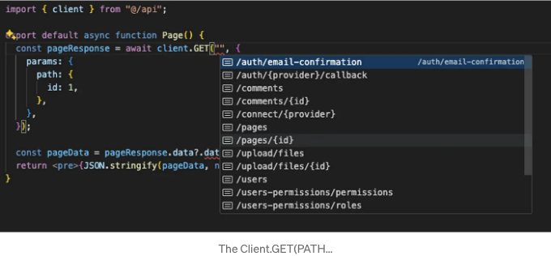

<!-- ui-log 수평형 -->
<ins class="adsbygoogle"
  style="display:block"
  data-ad-client="ca-pub-4877378276818686"
  data-ad-slot="9743150776"
  data-ad-format="auto"
  data-full-width-responsive="true"></ins>
<component is="script">
(adsbygoogle = window.adsbygoogle || []).push({});
</component>

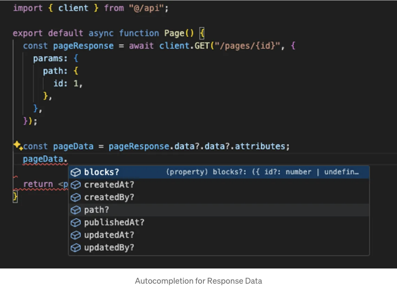

여기서 당신의 페이지의 실제 데이터의 자동 완성을 볼 수 있습니다. 이 데이터에는 경로 속성이 포함됩니다.

# 쿼리 문자열 제공을 위해 qs 사용하기

위의 데이터 가져오기는 할당된 블록의 데이터를 반환하지 않음을 알 수 있습니다. 이는 Strapi REST API가 응답에 해당 관계를 포함하도록 지시하기 위해 특정 쿼리 매개변수를 지정해야하기 때문입니다.

<!-- ui-log 수평형 -->
<ins class="adsbygoogle"
  style="display:block"
  data-ad-client="ca-pub-4877378276818686"
  data-ad-slot="9743150776"
  data-ad-format="auto"
  data-full-width-responsive="true"></ins>
<component is="script">
(adsbygoogle = window.adsbygoogle || []).push({});
</component>

라이브러리를 사용하면 쿼리 매개변수를 더 쉽고 유지보수하기 쉽게 사용할 수 있습니다. 예를 들어, 필드를 포함하고 팝업을 사용하는 GET 요청은 다음과 같이 보일 수 있습니다.

```js
GET /api/articles?fields[0]=title&fields[1]=slug&populate[headerImage][fields][0]=name&populate[headerImage][fields][1]=url
```

그렇게 하면 약간의 문자열 연결이 필요합니다. 다행히 Strapi는 이것을 조금 더 간단하게 만들기 위해 'qs' 라이브러리를 제안합니다:

```js
const qs = require("qs");
const query = qs.stringify(
  {
    fields: ["title", "slug"],
    populate: {
      headerImage: {
        fields: ["name", "url"],
      },
    },
  },
  {
    encodeValuesOnly: true, // URL을 보기 좋게 변환
  },
);
```

<!-- ui-log 수평형 -->
<ins class="adsbygoogle"
  style="display:block"
  data-ad-client="ca-pub-4877378276818686"
  data-ad-slot="9743150776"
  data-ad-format="auto"
  data-full-width-responsive="true"></ins>
<component is="script">
(adsbygoogle = window.adsbygoogle || []).push({});
</component>

```js
await request(`/api/articles?${query}`);
```

만약 당신이 직접적이지 않고 openapi-fetch를 사용하는 경우, fetch에 간단한 문자열을 전달하는 경로를 전달하지 않습니다. 쿼리 매개변수의 구문은 다음과 같습니다:

```js
const pages = await client.GET("/pages", {
  params: {
    query: {
      //..
    },
  },
});
```

기본적으로 Strapi 예제에서 qs를 사용하여 개체를 추가할 수 없습니다. 예를 들어, 경로 /에 대해 qs 스타일 쿼리를 추가하고 동적 존 필드 블록에서 사용되는 모든 구성 요소를 채우려면 다음 쿼리를 수행할 수 있습니다:```

<!-- ui-log 수평형 -->
<ins class="adsbygoogle"
  style="display:block"
  data-ad-client="ca-pub-4877378276818686"
  data-ad-slot="9743150776"
  data-ad-format="auto"
  data-full-width-responsive="true"></ins>
<component is="script">
(adsbygoogle = window.adsbygoogle || []).push({});
</component>

```js
const pages = await client.GET("/pages", {
  params: {
    query: {
      filters: {
        // @ts-ignore - openapi generated from strapi results in Record<string, never>
        // https://github.com/strapi/strapi/issues/19644
        path: {
          $eq: path,
        },
      },
      // @ts-ignore
      populate: {
        blocks: { populate: "*" },
      },
    },
  },
});
```

만약 이렇게 한다면 다음과 같은 오류가 발생할 것입니다:

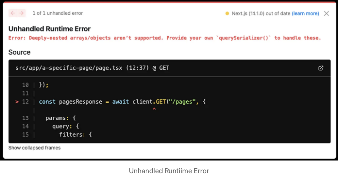

기본적으로 openapi-fetch에 복잡한 객체를 쿼리로 전달할 수 없기 때문에 이런 오류가 발생합니다. 그래서 클라이언트에 전달되는 쿼리 객체를 변환하는 역할을 오버라이딩할 수 있습니다. 그래서 openapi-fetch의 querySerializer가 qs를 사용하도록 하는 것이 필요하며, 클라이언트가 생성될 때 이것을 수행할 수 있습니다:```

<!-- ui-log 수평형 -->
<ins class="adsbygoogle"
  style="display:block"
  data-ad-client="ca-pub-4877378276818686"
  data-ad-slot="9743150776"
  data-ad-format="auto"
  data-full-width-responsive="true"></ins>
<component is="script">
(adsbygoogle = window.adsbygoogle || []).push({});
</component>

```js
import createClient from "openapi-fetch";
import type { paths } from "./strapi";
import qs from "qs";
const client = createClient<paths>({
  baseUrl: "http://127.0.0.1:1337/api",
  headers: {
    Accept: "application/json",
  },
  querySerializer(params) {
    console.log("querySerializer", params, qs.stringify(params));
    return qs.stringify(params, {
      encodeValuesOnly: true, // prettify URL
    });
  },
});
export { client };
```

그래서 쿼리 스트링은 쿼리 객체를 qs에 전달하여 생성됩니다. 따라서 Strapi 문서에 나와 있는 것과 정확히 동일하게 쿼리를 생성할 수 있습니다.

# 클라이언트 측 데이터 가져오기

지금까지 본 내용은 React Server Components와 함께 Next.js를 사용하는 서버에서 데이터를 가져올 때 특히 잘 작동합니다. 그러나 클라이언트 측에서 데이터를 가져오는 것은 종종 조금 더 복잡합니다. 최소한 원하는 것은 데이터 로딩 표시와 실제로 클라이언트에서 데이터를 사용할 수 있는 시기를 알기를 원할 것입니다.```

<!-- ui-log 수평형 -->
<ins class="adsbygoogle"
  style="display:block"
  data-ad-client="ca-pub-4877378276818686"
  data-ad-slot="9743150776"
  data-ad-format="auto"
  data-full-width-responsive="true"></ins>
<component is="script">
(adsbygoogle = window.adsbygoogle || []).push({});
</component>

이 필요를 충족하면서도 번들 크기가 작은 라이브러리는 tanstack의 react-query입니다.

Comments를 로드할 예정이며, 이는 Strapi 백엔드에서 정의된 데이터 유형입니다.

간단한 접근 방식은 데이터를 가져오기 위해 react-query를 사용하는 클라이언트 측 리액트 컴포넌트를 생성하는 것입니다.

```js
"use client";
import { getComments } from "@/api/getComments";
import { Headline } from "@/components/elements/Headline";
import { useQuery } from "@tanstack/react-query";
import React from "react";

export interface IComments {}
function Comments({}: IComments) {
  const { isPending, data } = useQuery({
    queryKey: ["getComments"],
    queryFn: () => getComments(),
  });
  return (
    <div>
      <Headline variant="h2">Comments</Headline>
      {isPending && <p>Loading comments...</p>}
      {data &&
        data.map((comment) => (
          <div key={comment.id} className="my-6">
            <Headline variant="h3">{comment.attributes?.username}</Headline>
            <p>{comment.attributes?.comment}</p>
          </div>
        ))}
    </div>
  );
}
export { Comments };
```

<!-- ui-log 수평형 -->
<ins class="adsbygoogle"
  style="display:block"
  data-ad-client="ca-pub-4877378276818686"
  data-ad-slot="9743150776"
  data-ad-format="auto"
  data-full-width-responsive="true"></ins>
<component is="script">
(adsbygoogle = window.adsbygoogle || []).push({});
</component>

react-query에서 queryFn에 promise를 반환하는 함수를 전달해야 합니다. 여기서는 openapi-fetch를 아무데서도 사용하지 않았지만, 여전히 데이터는 Strapi 백엔드에서 직접 생성된 타입 정의를 통해 모두 유형화되어 있습니다.

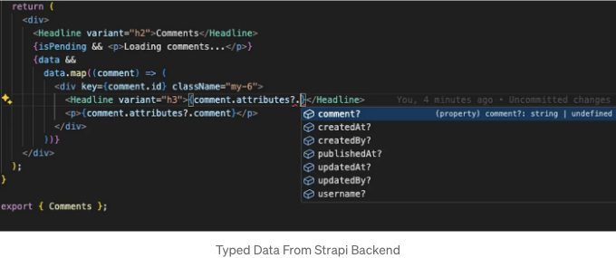

그리고 이는 간단히 말해서 react-query에 전달한 queryFn에서 다시 한번 유형화된 fetch 접근 방식을 활용하고 있기 때문입니다.

```js
import { client } from ".";
export async function getComments() {
  const comments = await client.GET("/comments", {
    cache: "no-cache",
  });
  return comments?.data?.data || [];
}
```

<!-- ui-log 수평형 -->
<ins class="adsbygoogle"
  style="display:block"
  data-ad-client="ca-pub-4877378276818686"
  data-ad-slot="9743150776"
  data-ad-format="auto"
  data-full-width-responsive="true"></ins>
<component is="script">
(adsbygoogle = window.adsbygoogle || []).push({});
</component>

위에서 확인하실 수 있듯이 typescript-fetch 클라이언트를 다시 사용하여 형식화된 데이터를 반환하고 있습니다. 그리고 그로 인해 모든 것이 클라이언트 측에서도 형식이 지정되어 있습니다.

# 결론

의미 있는 수준의 타입 안전성 또는 Next.js에서의 타입 안전한 fetch를 어렵지 않게 실현할 수 있는 방법이 있다는 것을 확인할 수 있습니다. 특히 복잡한 기술과 번들 크기를 크게 증가시키지 않고 Next.js에서의 타입 안전성을 달성할 수 있습니다.

Strapi 내에서 생성된 OpenAPI 명세에 기반한 자동 생성된 유형 정의를 활용하는 간단한 fetch를 사용하면 노력이 별로 들지 않지만 많은 가치를 제공합니다.

<!-- ui-log 수평형 -->
<ins class="adsbygoogle"
  style="display:block"
  data-ad-client="ca-pub-4877378276818686"
  data-ad-slot="9743150776"
  data-ad-format="auto"
  data-full-width-responsive="true"></ins>
<component is="script">
(adsbygoogle = window.adsbygoogle || []).push({});
</component>

데이터를 가져오는 부분뿐만 아니라 헤드리스 CMS에서 나오는 빌딩 블록을 반영하는 리액트 컴포넌트를 개발하는 데도 유용합니다.

가장 좋은 점은 JavaScript 영역에서 제공되는 최신 도구를 사용할 수 없는 환경에서도 이 모든 것을 구현할 수 있다는 것입니다.

# 자료

- 소스 코드는 GitHub에서 확인할 수 있습니다.
- Next.js, Strapi, OpenAPI로 타입 안전한 Fetch 사용하기
- https://openai.com/
- https://trpc.io/
- https://docs.strapi.io/dev-docs/api/rest/interactive-query-builder

<!-- ui-log 수평형 -->
<ins class="adsbygoogle"
  style="display:block"
  data-ad-client="ca-pub-4877378276818686"
  data-ad-slot="9743150776"
  data-ad-format="auto"
  data-full-width-responsive="true"></ins>
<component is="script">
(adsbygoogle = window.adsbygoogle || []).push({});
</component>

# 매뉴엘과 연결하세요!

내 웹사이트에서 제 최신 튜토리얼을 확인하고 트위터와 유튜브에서 연락할 수 있는 자유를 누려보세요.