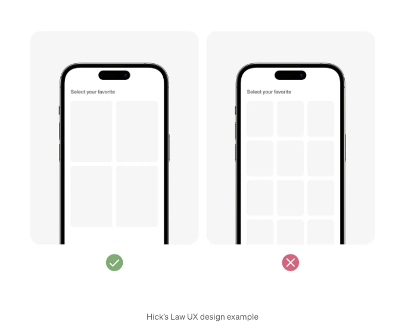
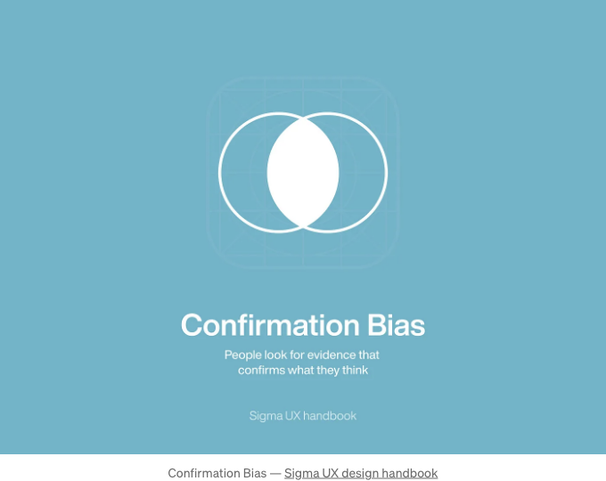
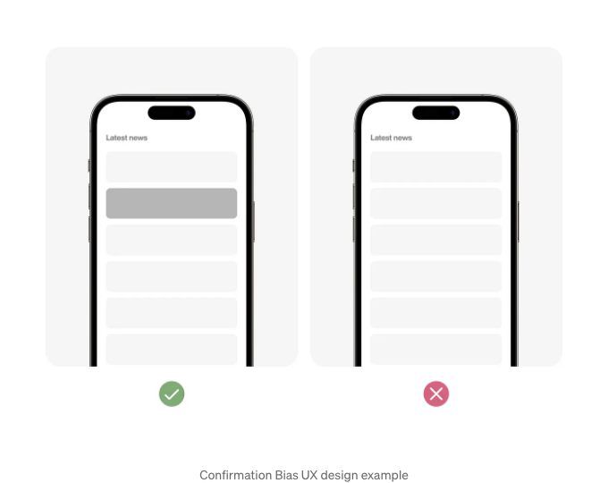
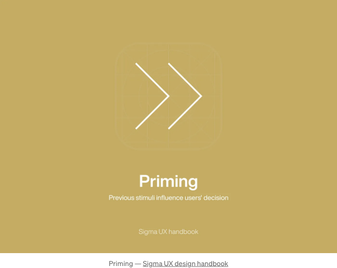
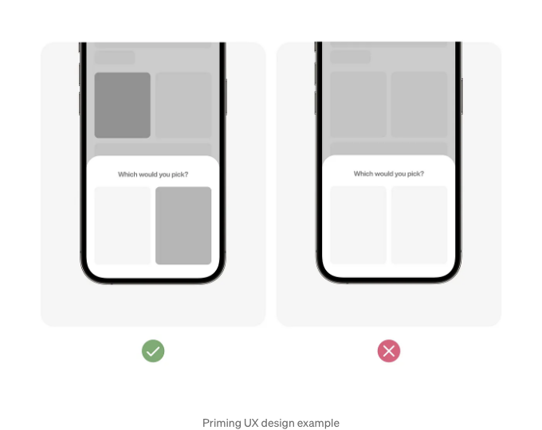
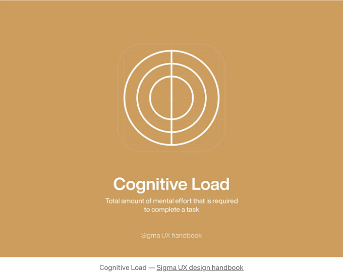
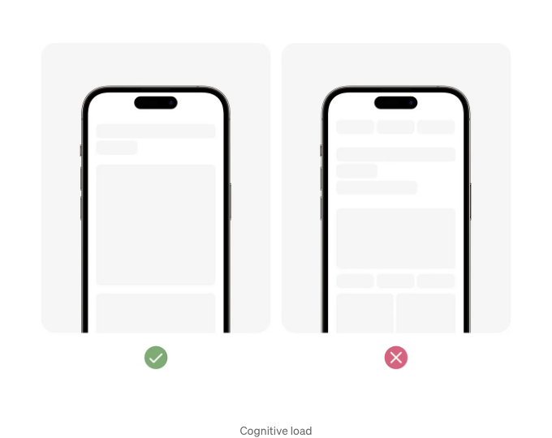

안녕하세요! 제 이름은 아미르입니다. 제품 디자이너로서 전 세계의 훌륭한 디자이너들인 Dieter Rams, Don Norman, Johny Ive, 스티브 잡스와 같은 분들로부터 가치 있는 교훈을 많이 얻었습니다. 트렌드, 현대적인 방법 및 데이터 분석에 대해 알고 있지만 디자인의 핵심 요소는 종종 잊혀지곤 합니다. 그것은 인간 경험에 대해 전부입니다.

## 원점으로 되돌아가기

획기적인 혁신과 아이디어는 어떤 주제의 원점에 대한 이해가 얼마나 깊은가와 연결되어 있다는 사실이 있습니다. 아이콘이 어디서 왔는지, 왜 그 시작이 있었는지, 어째서 단순한 눈길 하나로 복잡한 개념을 이해하는 데 도움이 되는지 등, 이러한 간단한 것들도 중요하죠. 요점은, 우리는 인간을 위해 디자인하기 때문에, 우리가 좋다고 느끼고 사랑하는 것들이 인간이 어떻게 인식하고 경험하는가와 관련이 있다는 것입니다. 인간을 이해하는 것이 제품의 주요 목적이 되는 곳입니다.

UX라는 용어는 종종 오해를 받지만, 고안한 Don Norman이 설명한 것처럼, 사람들이 실제로 물건을 경험하는 방법을 이해하는 것에 관한 것입니다. 여기서 심리학이 가장 유용합니다. 요약하면, 보다 인간적인 제품일수록 사용하기 즐겁습니다.

<!-- ui-log 수평형 -->
<ins class="adsbygoogle"
  style="display:block"
  data-ad-client="ca-pub-4877378276818686"
  data-ad-slot="9743150776"
  data-ad-format="auto"
  data-full-width-responsive="true"></ins>
<component is="script">
(adsbygoogle = window.adsbygoogle || []).push({});
</component>

더 명확하게 하기 위해 우리는 디자인할 때 알아야 하는 몇 가지 핵심 심리학 용어를 살펴보겠습니다.

## 힉의 법칙

<!-- ui-log 수평형 -->
<ins class="adsbygoogle"
  style="display:block"
  data-ad-client="ca-pub-4877378276818686"
  data-ad-slot="9743150776"
  data-ad-format="auto"
  data-full-width-responsive="true"></ins>
<component is="script">
(adsbygoogle = window.adsbygoogle || []).push({});
</component>

힉의 법칙은 심리학과 디자인에서의 원칙으로, 개인이 결정을 하는 데 걸리는 시간이 선택지 또는 자극의 수와 함께 증가한다는 것을 시사합니다. 이 법칙은 결정을 내리는 효율성을 높이기 위해 선택을 단순화하고 디자인의 복잡성을 줄이는 중요성을 강조합니다.

## 예시

# 확인 편향

<!-- ui-log 수평형 -->
<ins class="adsbygoogle"
  style="display:block"
  data-ad-client="ca-pub-4877378276818686"
  data-ad-slot="9743150776"
  data-ad-format="auto"
  data-full-width-responsive="true"></ins>
<component is="script">
(adsbygoogle = window.adsbygoogle || []).push({});
</component>

## 의미

확인 편향(Confirmation bias)은 개인들이 기존의 신념이나 가설을 확인하는 정보를 찾아내고 해석하며 기억하는 인지적 편향으로, 상반되는 증거를 무시하거나 감안하지 않는다. 이러한 편향은 선택적 인식과 기존 신념의 강화로 이어지며 객관적인 평가와 의사결정에 방해가 될 수 있다.

## 예시

<!-- ui-log 수평형 -->
<ins class="adsbygoogle"
  style="display:block"
  data-ad-client="ca-pub-4877378276818686"
  data-ad-slot="9743150776"
  data-ad-format="auto"
  data-full-width-responsive="true"></ins>
<component is="script">
(adsbygoogle = window.adsbygoogle || []).push({});
</component>

# 프라이밍

## 의미

<!-- ui-log 수평형 -->
<ins class="adsbygoogle"
  style="display:block"
  data-ad-client="ca-pub-4877378276818686"
  data-ad-slot="9743150776"
  data-ad-format="auto"
  data-full-width-responsive="true"></ins>
<component is="script">
(adsbygoogle = window.adsbygoogle || []).push({});
</component>

프라이밍은 심리학적 현상으로, 한 자극에 노출되는 것이 후속 자극에 대한 사람의 응답에 영향을 미치는 것을 말합니다. 이 효과는 종종 의식하지 않은 채로 발생하는데, 인식, 판단 및 행동에 영향을 미치며, 이전 경험과 자극이 우리의 생각과 행동을 형성하는 미묘한 방식을 보여줍니다.

## 예시

# 인지 부하

<!-- ui-log 수평형 -->
<ins class="adsbygoogle"
  style="display:block"
  data-ad-client="ca-pub-4877378276818686"
  data-ad-slot="9743150776"
  data-ad-format="auto"
  data-full-width-responsive="true"></ins>
<component is="script">
(adsbygoogle = window.adsbygoogle || []).push({});
</component>

## 의미

인지 부하는 정보를 처리하거나 작업을 수행하는 데 필요한 정신적 노력의 양을 나타냅니다. 작업 자체의 본질적 복잡성과 산만하거나 멀티태스킹과 같은 외부 요인에 의해 가해지는 추가적인 인지적 요구 사항을 포괄합니다. 인지 부하를 관리하는 것은 학습 및 작업 성과를 최적화하기 위해 디자인과 교육에서 중요합니다.

## 예제

<!-- ui-log 수평형 -->
<ins class="adsbygoogle"
  style="display:block"
  data-ad-client="ca-pub-4877378276818686"
  data-ad-slot="9743150776"
  data-ad-format="auto"
  data-full-width-responsive="true"></ins>
<component is="script">
(adsbygoogle = window.adsbygoogle || []).push({});
</component>

# 멋진 인간 경험을 만들기

가끔 디자이너들은 모든 트렌드에 빠져 그것에 너무 집중해서 인간에 대해 깜빡할 때가 있습니다. 모든 것은 인간에 관한 것입니다. 어떻게 우리가 느끼고 행동하는지에 대한 감정과 공감이 중요합니다. 현재 비즈니스 데이터가 말하거나 인상을 주는 것이 무엇인지에 대한 이유를 거부하고 올바르게 느껴지는 것을 디자인하기 위해 노력하십시오. 정말로 멋진 경험이자 인간다운 아이디어를 도출하려면 그 느낌이 중요합니다.

## 100가지 이상의 UX 심리학 원리에 대해:

<!-- ui-log 수평형 -->
<ins class="adsbygoogle"
  style="display:block"
  data-ad-client="ca-pub-4877378276818686"
  data-ad-slot="9743150776"
  data-ad-format="auto"
  data-full-width-responsive="true"></ins>
<component is="script">
(adsbygoogle = window.adsbygoogle || []).push({});
</component>

시그마 UX 핸드북