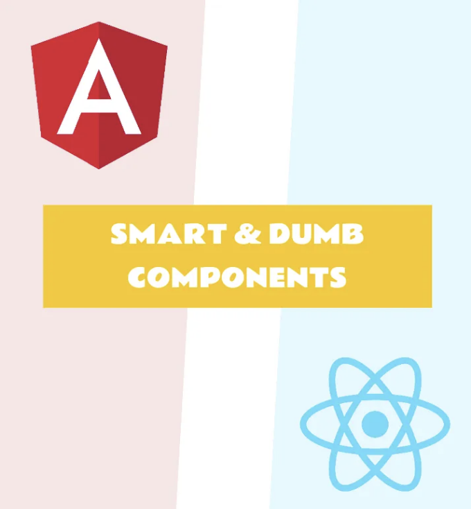
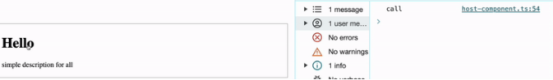
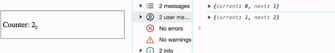

# 소개

React와 Angular은 현재 주요 웹 개발 기술입니다. 당신은 그들을 사랑하거나 싫어하거나 그들의 다른 접근 방식을 비난할 수 있지만, 대부분의 JS 애플리케이션이 그 위에 작성된다는 것을 부인할 수 없습니다.

<!-- ui-log 수평형 -->
<ins class="adsbygoogle"
  style="display:block"
  data-ad-client="ca-pub-4877378276818686"
  data-ad-slot="9743150776"
  data-ad-format="auto"
  data-full-width-responsive="true"></ins>
<component is="script">
(adsbygoogle = window.adsbygoogle || []).push({});
</component>

저는 다른 기술로 이주하는 이유에 관한 많은 기사들을 읽어봤어요. 그러나 그중에는 어떻게 이주하는지, 원래 로직을 보존하면서 코드 일부를 다른 기술로 옮기는 방법에 대해 본 적이 없어요.

이 시리즈의 기사에서 Angular와 React의 기본 entity가 서로 어떻게 관련이 있는지 알아보겠어요. 공통 패턴을 식별하는 방법과 이 두 기술 간의 코드를 쉽게 이해하고 배우는 방법을 살펴볼 거에요.

Angular에서 React로의 이주를 기반으로 해서 설명하겠지만, React에서 Angular로 이주할 때도 이 예시를 활용할 수 있어요. 저는 컴포넌트들(스마트 & 덤, 라이프사이클 훅, 재사용성)부터 시작해서 Angular 디렉티브, 서비스, 파이프 등을 분석할 거에요. 대부분의 개발자들이 두 기술이 어떻게 작동하고 무엇을 할 수 있는지 이해할 수 있게 하여 학습 시간을 단축시키고 싶어요.

# 환경

<!-- ui-log 수평형 -->
<ins class="adsbygoogle"
  style="display:block"
  data-ad-client="ca-pub-4877378276818686"
  data-ad-slot="9743150776"
  data-ad-format="auto"
  data-full-width-responsive="true"></ins>
<component is="script">
(adsbygoogle = window.adsbygoogle || []).push({});
</component>

- 모든 예제는 2가지 응용 프로그램인 React와 Angular을 위한 NX-monorepository 내에서 실행됩니다.
- UI 및 컴포넌트를 구성하기 위해 서드 파티 라이브러리를 사용하지 않고, 기본 메서드와 함수만 사용합니다.
- 모든 Angular 컴포넌트는 단독으로 작동하며, 기본값으로 OnPush 전략이 활성화되고 SCSS를 통해 스타일이 지정됩니다.
- 모든 React 컴포넌트는 Typescript에서 함수 형태로 구현되며, PropTypes를 사용하지 않고 기본값으로 Css-modules를 통해 SCSS에서 스타일이 지정됩니다.

# 덤 컴포넌트

## 초기 작업

부모 컴포넌트로부터 제목과 설명을 표시하는 책임을 지는 "덤" 컴포넌트가 필요하다고 가정해 봅시다. 또한, 제목에 클릭 이벤트 리스너가 있어 이벤트를 부모에게 전달합니다.

<!-- ui-log 수평형 -->
<ins class="adsbygoogle"
  style="display:block"
  data-ad-client="ca-pub-4877378276818686"
  data-ad-slot="9743150776"
  data-ad-format="auto"
  data-full-width-responsive="true"></ins>
<component is="script">
(adsbygoogle = window.adsbygoogle || []).push({});
</component>



## Angular 구현

```js
@Component({
 selector: 'ng-dumb',
 standalone: true,
 changeDetection: ChangeDetectionStrategy.OnPush,
 template: `
   <h1 (click)="titleClick.emit($event)">
     {title}
   </h1>
   <p>{description}</p>
 `
})
export class DumbComponent {
 @Input()
 public title: string = ''

 @Input()
 public description: string = ''

 @Output()
 public titleClick = new EventEmitter<MouseEvent>()
}
```

한 가지씩 살펴봅시다.

<!-- ui-log 수평형 -->
<ins class="adsbygoogle"
  style="display:block"
  data-ad-client="ca-pub-4877378276818686"
  data-ad-slot="9743150776"
  data-ad-format="auto"
  data-full-width-responsive="true"></ins>
<component is="script">
(adsbygoogle = window.adsbygoogle || []).push({});
</component>

- @Input() 데코레이터는 이 클래스 속성이 부모 컴포넌트 템플릿에서 액세스할 수 있고 데이터를 전달할 수 있음을 Angular에 알리는 역할을 합니다. 클래스 속성은 가변적이어야 하며(readonly가 아니어야 함), 기본 값이 있어야 합니다 (TypeScript의 필드 유효성이 지정되지 않은 경우)

```js
@Input()
title: string = ''

@Input()
description: string = ''
```

- @Output() 데코레이터는 컴포넌트에서 이벤트를 전달하기 위해 클래스 속성에 적용되어야 합니다.

```js
@Output()
public titleClick = new EventEmitter<MouseEvent>()
```

<!-- ui-log 수평형 -->
<ins class="adsbygoogle"
  style="display:block"
  data-ad-client="ca-pub-4877378276818686"
  data-ad-slot="9743150776"
  data-ad-format="auto"
  data-full-width-responsive="true"></ins>
<component is="script">
(adsbygoogle = window.adsbygoogle || []).push({});
</component>

구성 요소와 상호 작용

'Angular에서 바인딩하는 방법'에 대해 자세히 다루지는 않겠습니다. 필요한 모든 정보는 여기에서 찾을 수 있습니다

```js
<ng-dumb
   title="Hello"
   description="simple description for all"
   (titleClick)="onTitleClick()"
></ng-dumb>
```

## React 구현

<!-- ui-log 수평형 -->
<ins class="adsbygoogle"
  style="display:block"
  data-ad-client="ca-pub-4877378276818686"
  data-ad-slot="9743150776"
  data-ad-format="auto"
  data-full-width-responsive="true"></ins>
<component is="script">
(adsbygoogle = window.adsbygoogle || []).push({});
</component>

Angular과 다르게 React 컴포넌트는 렌더링을 위한 JSX 템플릿을 반환해야 하는 함수입니다. 이 컴포넌트 함수의 모든 설정은 Props 입력 매개변수를 사용하여 정의됩니다.

```js
interface DumbProps {
    title?: string
    description?: string
    titleClick?: ($event: React.MouseEvent) => void
}

const Dumb: React.FC<DumbProps> = ({title = '', description = '', titleClick = () => {}}) => {
    return (
        <>
            <h1 onClick={($event) => titleClick($event)}>
                {title}
            </h1>
            <p>{description}</p>
        </>
    )
}

export default Dumb
```

한 가지씩 살펴보겠습니다:

- 편의상 모든 프롭스 선언을 별도의 인터페이스에 넣었습니다. Angular 컴포넌트의 @Input 및 @Output에서 속성 이름과 유형이 동일하게 이해되도록 보존되었습니다.

<!-- ui-log 수평형 -->
<ins class="adsbygoogle"
  style="display:block"
  data-ad-client="ca-pub-4877378276818686"
  data-ad-slot="9743150776"
  data-ad-format="auto"
  data-full-width-responsive="true"></ins>
<component is="script">
(adsbygoogle = window.adsbygoogle || []).push({});
</component>

```js
인터페이스 DumbProps {
    title: string
    description: string
    titleClick: ($event: React.MouseEvent) => void
}
```

- DumbProps 객체에서 속성을 검색합니다. 제목과 설명은 Angular 컴포넌트에서와 같이 기본값으로 설정됩니다.

```js
const Dumb: React.FC<DumbProps> = ({title = '', description = '', titleClick = () => {}}) => {}
```

- 렌더링을 위한 템플릿 반환. 값 보간이 간단하면 이벤트 리스너 바인딩과 관련된 미묘한 차이점이 있습니다. Angular 컴포넌트에서는 모든 핸들러 함수가 호출될 때 화살표 함수를 사용함에 유의해야 합니다. 람다 인자와 화살표만 없는 화살표 함수를 호출할 때.```

<!-- ui-log 수평형 -->
<ins class="adsbygoogle"
  style="display:block"
  data-ad-client="ca-pub-4877378276818686"
  data-ad-slot="9743150776"
  data-ad-format="auto"
  data-full-width-responsive="true"></ins>
<component is="script">
(adsbygoogle = window.adsbygoogle || []).push({});
</component>

```js
titleClick.emit($event)
```

하지만 React 컴포넌트에 이러한 코드를 삽입하면 다음 2가지 이유로 작동하지 않습니다:

- 이 함수에는 $event 인수가 없으므로 Angular의 예약어입니다.
- React는 이러한 바인딩을 즉시 함수 호출로 간주합니다.

따라서 올바른 바인딩은 명시적인 화살표 함수를 사용하여 인수를 전달하는 것입니다.

<!-- ui-log 수평형 -->
<ins class="adsbygoogle"
  style="display:block"
  data-ad-client="ca-pub-4877378276818686"
  data-ad-slot="9743150776"
  data-ad-format="auto"
  data-full-width-responsive="true"></ins>
<component is="script">
(adsbygoogle = window.adsbygoogle || []).push({});
</component>

```js
<h1 onClick={($event) => titleClick($event)}>
```

컴포넌트와 상호 작용

Angular에서는 템플릿에 컴포넌트를 넣으면 오류가 0개 나오지만, DumbProps 인터페이스를 기반으로한 React는 컴포넌트의 모든 속성을 지정해야 합니다.

TS2739: Type {} is missing the following properties from type DumbProps : title, description, titleClick

<!-- ui-log 수평형 -->
<ins class="adsbygoogle"
  style="display:block"
  data-ad-client="ca-pub-4877378276818686"
  data-ad-slot="9743150776"
  data-ad-format="auto"
  data-full-width-responsive="true"></ins>
<component is="script">
(adsbygoogle = window.adsbygoogle || []).push({});
</component>

왜 그럴까요? -  Angular 컴포넌트의 매개변수 인터페이스는 모든 필드가 선택 사항이라는 것을 의미할 수 있습니다.

```js
인터페이스 DumbPropsAngular {
    title?: string
    description?: string
    titleClick?: EventEmitter<MouseEvent>
}
```

올바른 컴포넌트 props의 인터페이스는 다음과 같습니다.

```js
인터페이스 DumbProps {
    title?: string
    description?: string
    titleClick?: ($event: React.MouseEvent) => void
}
```

<!-- ui-log 수평형 -->
<ins class="adsbygoogle"
  style="display:block"
  data-ad-client="ca-pub-4877378276818686"
  data-ad-slot="9743150776"
  data-ad-format="auto"
  data-full-width-responsive="true"></ins>
<component is="script">
(adsbygoogle = window.adsbygoogle || []).push({});
</component>

그리고 오류를 피하기 위해 titleClick에 기본 값을 지정하는 것이 필요합니다. 그러면 매개 변수 없이 `Dumb/` 컴포넌트를 선언해도 Angular 컴포넌트와 같이 오류가 발생하지 않습니다.

마지막으로, `Dumb/`을 상위 컴포넌트에 통합합니다.

```js
<Dumb
 title="Hello"
 description="모두를 위한 간단한 설명"
 titleClick={() => onTitleClick()}
></Dumb>
```

# 스마트 컴포넌트

<!-- ui-log 수평형 -->
<ins class="adsbygoogle"
  style="display:block"
  data-ad-client="ca-pub-4877378276818686"
  data-ad-slot="9743150776"
  data-ad-format="auto"
  data-full-width-responsive="true"></ins>
<component is="script">
(adsbygoogle = window.adsbygoogle || []).push({});
</component>

## 초기 작업

컴포넌트의 변형을 고려해 봅시다. 컴포넌트는 요소를 클릭할 때마다 카운터 상태를 +1씩 업데이트하는 것 뿐입니다.



## Angular 구현

<!-- ui-log 수평형 -->
<ins class="adsbygoogle"
  style="display:block"
  data-ad-client="ca-pub-4877378276818686"
  data-ad-slot="9743150776"
  data-ad-format="auto"
  data-full-width-responsive="true"></ins>
<component is="script">
(adsbygoogle = window.adsbygoogle || []).push({});
</component>

세 가지 기본 예제를 살펴봅시다:

- Angular 업데이트의 "마법"

모든 초보자가 시작하는 가장 인기 있는 예제입니다.

```js
@Component({
    selector: 'ng-smart',
    standalone: true,
    changeDetection: ChangeDetectionStrategy.OnPush,
    template: `
        <p (click)="handleClick()" class="pointer">Counter: {counter}</p>
    `
})
export class SmartComponent {
    counter = 0;

    handleClick(): void {
       this.counter = this.counter + 1;
    }
}
```

<!-- ui-log 수평형 -->
<ins class="adsbygoogle"
  style="display:block"
  data-ad-client="ca-pub-4877378276818686"
  data-ad-slot="9743150776"
  data-ad-format="auto"
  data-full-width-responsive="true"></ins>
<component is="script">
(adsbygoogle = window.adsbygoogle || []).push({});
</component>

앵귤러 컴포넌트는 매번 변경된 카운터 값을 가진 새로운 템플릿을 렌더링합니다. Zone.js 라이브러리는 앵귤러 컴포넌트를 업데이트하고 이벤트에 대응하는 방법을 담당합니다. 여러분이 알아야 할 것은 없습니다. 왜냐하면 Zone.js가 대신 실행해주기 때문이죠. 이 예제는 간단하지만 성능 측면에서 가장 신뢰할 만한 방법은 아닙니다.

- Observable

앵귤러의 동기식 접근 방식 외에도 Observable을 기반으로 한 반응형 접근 방식이 있습니다. 현재 이 방법이 템플릿에서 변경된 값을 표시하는 가장 일반적인 방법입니다.

```js
@Component({
  selector: 'ng-smart',
  standalone: true,
  changeDetection: ChangeDetectionStrategy.OnPush,
  imports: [AsyncPipe],
  template: `
    <p (click)="handleClick()" class="pointer">
      Counter: { counter$ | async }
    </p>
  `,
})
export class SmartComponent {
  counter$ = new BehaviorSubject(0);

  handleClick(): void {
    this.counter$.next(this.counter$.value + 1);
  }
}
```

<!-- ui-log 수평형 -->
<ins class="adsbygoogle"
  style="display:block"
  data-ad-client="ca-pub-4877378276818686"
  data-ad-slot="9743150776"
  data-ad-format="auto"
  data-full-width-responsive="true"></ins>
<component is="script">
(adsbygoogle = window.adsbygoogle || []).push({});
</component>

기본적으로 2가지 요소 묶음을 항상 사용합니다:

- `observableName`$ — 발행자. 새로운 값이 도착하면 구독자들에게 알림을 보내는 반응형 스트림입니다.
- AsyncPipe — 구독자. 우리를 위해 스트림의 구독과 구독 해제를 관리하며 `observableName`$ | async의 위치에 값을 출력하는 Angular 특수 파이프입니다.

BehaviourSubject 클래스는 발행자 역할을 하며, 구독을 위해 초기 값이 0입니다. handleClick 이벤트가 트리거될 때마다 `behaviourSubjectName`$.value에서 이전 값을 고려하여 next()에 새 값을 전달합니다.

- 신호들

<!-- ui-log 수평형 -->
<ins class="adsbygoogle"
  style="display:block"
  data-ad-client="ca-pub-4877378276818686"
  data-ad-slot="9743150776"
  data-ad-format="auto"
  data-full-width-responsive="true"></ins>
<component is="script">
(adsbygoogle = window.adsbygoogle || []).push({});
</component>

시그널은 반응형 변수들입니다. 존 없는 애플리케이션으로 이동하는 방법으로, 최근 Angular의 혁신입니다.

```js
@Component({
    selector: 'ng-smart',
    standalone: true,
    changeDetection: ChangeDetectionStrategy.OnPush,
    template: `
        <p (click)="handleClick()">Counter: {counter()}</p>
    `
})
export class SmartComponent {
    counter = signal(0);
    
    handleClick(): void {
        this.counter.update(s => s + 1);
    }
}
```

시그널을 상호작용하는 것은 간단합니다. 우리는 다음과 같이 할 수 있습니다:

- `signalName`()를 호출하여 값을 읽기
- `signalName`.set(value)를 사용하여 새 값을 설정하기
- `signalName`.update(updateFn)을 통해 현재 값을 업데이트하기

<!-- ui-log 수평형 -->
<ins class="adsbygoogle"
  style="display:block"
  data-ad-client="ca-pub-4877378276818686"
  data-ad-slot="9743150776"
  data-ad-format="auto"
  data-full-width-responsive="true"></ins>
<component is="script">
(adsbygoogle = window.adsbygoogle || []).push({});
</component>

이 예시에서는 update 함수를 통해 값이 업데이트됩니다. 이는 this.counter.set(this.counter() + 1)와 동일합니다.

## React 구현

Angular 컴포넌트의 첫 번째 예시를 따라 React 컴포넌트에서 비슷한 작업을 원할 것입니다.

```js
const Smart = () => {
  let counter = 0;

  const onClick = () => {
    counter++;
  }

  return <p onClick={onClick}>Counter: {counter}</p>
}

export default Smart
```

<!-- ui-log 수평형 -->
<ins class="adsbygoogle"
  style="display:block"
  data-ad-client="ca-pub-4877378276818686"
  data-ad-slot="9743150776"
  data-ad-format="auto"
  data-full-width-responsive="true"></ins>
<component is="script">
(adsbygoogle = window.adsbygoogle || []).push({});
</component>

`p` 요소를 클릭하려고 할 때 카운터가 정확히 업데이트되지만 React가 새 상태를 렌더링하지 않는다는 것을 알 수 있습니다. 이러한 이유는 간단합니다 — React는 Zone.js를 보유하고 있지 않고 컴포넌트를 업데이트해야 할 때를 판별하는 다른 방법에 의존합니다.

이를 위해 항상 React 훅 useState를 사용해야 합니다. useState 훅에서 제공하는 변수는 원칙적으로 시그널과 유사하지만 한 가지 차이가 있습니다: 값(`stateName`)과 업데이트(set`stateName`) 함수가 결합되어 있지 않고 분리되어 있습니다.

따라서 우리가 필요로 하는 React 컴포넌트의 올바른 구현은 다음과 같아야 합니다.

```js
const Smart = () => {
  const [counter, setCounter] = useState(0);

  const onClick = () => {
    setCounter((s) => s + 1);
  };

  return <p onClick={onClick}>Counter: {counter}</p>;
};

export default Smart;
```

<!-- ui-log 수평형 -->
<ins class="adsbygoogle"
  style="display:block"
  data-ad-client="ca-pub-4877378276818686"
  data-ad-slot="9743150776"
  data-ad-format="auto"
  data-full-width-responsive="true"></ins>
<component is="script">
(adsbygoogle = window.adsbygoogle || []).push({});
</component>

# 결론

간단한 예제를 통해 보면, 동일한 엔티티를 만드는 방법은 매우 다르며 여러 기능을 갖고 있음을 알 수 있습니다. 비교에서 React가 분명히 더 나아 보이고 선언적입니다:

- 템플릿용 업데이트 가능한 변수를 만드는 방법은 Angular처럼 여러 개가 아닌 반응형 변수를 만드는 단일 메서드만 있습니다.
- 항상 컴포넌트를 사용할 때 인터페이스 `ComponentName`Props에 따라 사용될 것임을 확신할 수 있습니다.

Angular의 새로운 구문인 Signlas와 @Input({required: true})를 사용하면 이 두 기술을 이해하는 과정을 조금 더 쉽게 할 수 있지만, 추가적인 분석을 통해 React와 Angular에서 동일한 목표를 달성하는 다양한 방법을 알 수 있습니다.

<!-- ui-log 수평형 -->
<ins class="adsbygoogle"
  style="display:block"
  data-ad-client="ca-pub-4877378276818686"
  data-ad-slot="9743150776"
  data-ad-format="auto"
  data-full-width-responsive="true"></ins>
<component is="script">
(adsbygoogle = window.adsbygoogle || []).push({});
</component>

# 챕터

## 다음

Angular와 React 사이의 이해. Part 2: 라이프사이클 훅

## 저장할 독서 목록