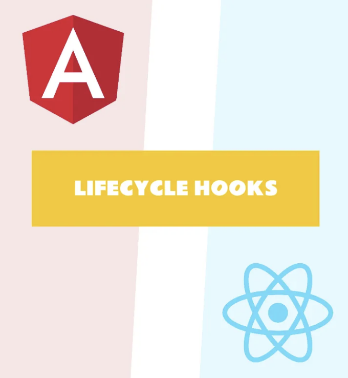
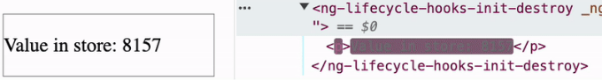
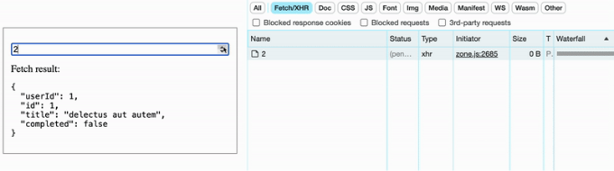
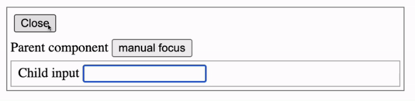

## 앵귤러 & 리액트 이해 / 파트 2: 라이프사이클 훅

# 소개

라이프사이클 훅은 컴포넌트를 생성부터 소멸까지의 전 과정에서 작업할 수 있도록 해줍니다.

<!-- ui-log 수평형 -->
<ins class="adsbygoogle"
  style="display:block"
  data-ad-client="ca-pub-4877378276818686"
  data-ad-slot="9743150776"
  data-ad-format="auto"
  data-full-width-responsive="true"></ins>
<component is="script">
(adsbygoogle = window.adsbygoogle || []).push({});
</component>

일부 로직을 수행하는 데 도움을 주는 것입니다. 컴포넌트의 특정 단계에서 로직을 수행하거나 업데이트, 로깅, 정리 등을 처리할 수 있습니다. 이들을 이용하면 코드가 더 간결하고 명확해지며 읽기 쉬워집니다. 훅은 보통 컴포넌트 코드의 시작 부분에 선언되기 때문에 컴포넌트가 어떤 로직을 수행하는지 즉시 확인할 수 있습니다.

# ngOnInit 및 ngOnDestroy 훅의 구현

## 초기 작업

시간이 지남에 따라 업데이트되는 "스마트 컴포넌트"의 예제를 살펴봅시다. 이러한 업데이트는 매 초 외부 스토어에서 발생합니다.

<!-- ui-log 수평형 -->
<ins class="adsbygoogle"
  style="display:block"
  data-ad-client="ca-pub-4877378276818686"
  data-ad-slot="9743150776"
  data-ad-format="auto"
  data-full-width-responsive="true"></ins>
<component is="script">
(adsbygoogle = window.adsbygoogle || []).push({});
</component>



컴포넌트가 존재하는 한, 새 값으로 업데이트를 받기 위해 스토어에 연결되며, 컴포넌트가 소멸될 때는 스토어와의 연결이 끊깁니다.

RxJs Observable은 외부 스토어(store$)로 사용됩니다.

```js
function store$(): Observable<{ value: number }> {
  return timer(0, 1000).pipe(
    map((v) => Math.round(Math.random() * v * 100)),
    map(value => ({value})),
  );
}
```

<!-- ui-log 수평형 -->
<ins class="adsbygoogle"
  style="display:block"
  data-ad-client="ca-pub-4877378276818686"
  data-ad-slot="9743150776"
  data-ad-format="auto"
  data-full-width-responsive="true"></ins>
<component is="script">
(adsbygoogle = window.adsbygoogle || []).push({});
</component>

## Angular 구현

```js
@Component({
  selector: 'ng-lifecycle-hooks-init-destroy',
  standalone: true,
  template: `<p>Store의 값: { value() || '값 없음' }</p>`,
  changeDetection: ChangeDetectionStrategy.OnPush,
})
export class InitDestroyComponent implements OnInit, OnDestroy {
  public value = signal<number | null>(null);
  public sub: Subscription = new Subscription();

  public ngOnInit(): void {
    const sub = store$().subscribe(({value}) => {
      this.value.set(value);
    });

    this.sub.add(sub);
  }

  public ngOnDestroy(): void {
    this.sub.unsubscribe();
  }
}
```

하나씩 살펴보겠습니다:

- value — 스토어 이벤트에서 값을 템플릿으로 출력할 반응형 변수 (Signal)

<!-- ui-log 수평형 -->
<ins class="adsbygoogle"
  style="display:block"
  data-ad-client="ca-pub-4877378276818686"
  data-ad-slot="9743150776"
  data-ad-format="auto"
  data-full-width-responsive="true"></ins>
<component is="script">
(adsbygoogle = window.adsbygoogle || []).push({});
</component>

```js
공개 값 = signal<number | null>(null);
```

- ngOnInit는 Angular 훅으로, 컴포넌트가 준비되고 입력 및 출력의 속성 바인딩이 완료된 후 호출됩니다. 이 훅에서는 저장소에 구독을 수행하고 값에 새로운 값을 설정합니다.

구독 자체는 클래스 속성 sub에 저장되며, 이 구독을 추적하고 관리하기 위해 Subscription 인스턴스에 전달됩니다.

```js
public sub: Subscription = new Subscription();

public ngOnInit(): void {
   const sub = store$().subscribe(({value}) => {
     this.value.set(value);
   });
  
   this.sub.add(sub);
}
```

<!-- ui-log 수평형 -->
<ins class="adsbygoogle"
  style="display:block"
  data-ad-client="ca-pub-4877378276818686"
  data-ad-slot="9743150776"
  data-ad-format="auto"
  data-full-width-responsive="true"></ins>
<component is="script">
(adsbygoogle = window.adsbygoogle || []).push({});
</component>

- ngOnDestroy은 컴포넌트가 파괴될 때 호출되는 Angular 후크입니다.

store$는 컴포넌트 바깥에 있고 항상 값들을 생성하기 때문에, 컴포넌트가 파괴될 때 store$에서 구독을 취소해야 합니다. 이를 하지 않으면 구독이 파괴된 후에도 여전히 존재하여 메모리 누수가 발생할 수 있습니다.

```js
public ngOnDestroy(): void {
   this.sub.unsubscribe();
}
```

## React 구현

<!-- ui-log 수평형 -->
<ins class="adsbygoogle"
  style="display:block"
  data-ad-client="ca-pub-4877378276818686"
  data-ad-slot="9743150776"
  data-ad-format="auto"
  data-full-width-responsive="true"></ins>
<component is="script">
(adsbygoogle = window.adsbygoogle || []).push({});
</component>

```js
export const InitDestroyHooks = () => {
 const [value, setValue] = useState(0);

 useLayoutEffect(() => {
     const sub = store$().subscribe(({ value }) => {
       setValue(value)
     })

   return () => sub.unsubscribe();
 }, [])

 return <p> 스토어 값: {value || '값 없음'}</p>
}
```

하나씩 살펴보겠습니다:

- Angular 컴포넌트와 비슷하게 템플릿에서 사용되는 value 변수가 있으며 자체 업데이트 함수가 있습니다. useState 훅을 사용합니다.

```js
const [value, setValue] = useState(0);
```

<!-- ui-log 수평형 -->
<ins class="adsbygoogle"
  style="display:block"
  data-ad-client="ca-pub-4877378276818686"
  data-ad-slot="9743150776"
  data-ad-format="auto"
  data-full-width-responsive="true"></ins>
<component is="script">
(adsbygoogle = window.adsbygoogle || []).push({});
</component>

- Angular 후크인 ngOnInit을 대체하려면(컴포넌트가 생성될 때 호출되는 후크로 렌더링 전에 호출됨) React 후크 useLayoutEffect를 빈 의존성 배열과 함께 사용하는 것이 좋은 선택입니다.

빈 의존성 배열을 사용하면 후크가 컴포넌트가 마운트될 때 한 번만 호출된다고 React에 알릴 수 있습니다.

```js
useLayoutEffect(() => {
   store$().subscribe(({ value }) => setValue(value))
}, [])
```

- Angular 후크인 ngOnDestroy(컴포넌트를 파괴할 때 호출되는 후크)를 대체하려면 React 후크 useLayoutEffect에서 unsubscribe를 호출할 소멸자 함수를 반환하면 됩니다.

<!-- ui-log 수평형 -->
<ins class="adsbygoogle"
  style="display:block"
  data-ad-client="ca-pub-4877378276818686"
  data-ad-slot="9743150776"
  data-ad-format="auto"
  data-full-width-responsive="true"></ins>
<component is="script">
(adsbygoogle = window.adsbygoogle || []).push({});
</component>

이 기능은 종속성이 변경될 때마다 호출될 것입니다. 그러나 종속성이 없기 때문에 이 기능은 컴포넌트가 마운트 해제될 때 한 번만 호출될 것입니다.

```js
useLayoutEffect(() => {
  const sub = store$().subscribe( //logic );

  return () => sub.unsubscribe();
}, [])
```

# ngOnChanges 훅의 구현

## 초기 작업

<!-- ui-log 수평형 -->
<ins class="adsbygoogle"
  style="display:block"
  data-ad-client="ca-pub-4877378276818686"
  data-ad-slot="9743150776"
  data-ad-format="auto"
  data-full-width-responsive="true"></ins>
<component is="script">
(adsbygoogle = window.adsbygoogle || []).push({});
</component>

저희가 서버에 입력 매개변수를 통해 요청을 보내고 결과를 표시하는 컴포넌트가 필요하다고 가정해 봅시다. 또한 매개변수가 변경될 수 있고 현재 요청을 취소해야 한다는 점도 고려해야 합니다.



## Angular 구현

```js
@Component({
  selector: 'ng-lifecycle-hooks-change',
  template: `<div>Fetch result: <pre>{ fetchResult() | json }</pre></div>`,
  changeDetection: ChangeDetectionStrategy.OnPush,
  standalone: true,
  imports: [JsonPipe],
})
export class ChangeComponent implements OnChanges {
  @Input({ required: true }) id!: number;

  private idSubject$ = new Subject<number>();

  private fetchResult$ = this.idSubject$
   .asObservable()
   .pipe(switchMap((id) => fetch$(id)));

  public fetchResult = toSignal(this.fetchResult$);

  public ngOnChanges(changes: SimpleChanges): void {
   if ('id' in changes) {
     this.idSubject$.next(this.id);
   }
  }
}

function fetch$(id: number): Observable<unknown> {
  return ajax
    .get<unknown>(`https://jsonplaceholder.typicode.com/todos/${id}`)
    .pipe(
      take(1),
      map((r) => r.response)
    );
}
```

<!-- ui-log 수평형 -->
<ins class="adsbygoogle"
  style="display:block"
  data-ad-client="ca-pub-4877378276818686"
  data-ad-slot="9743150776"
  data-ad-format="auto"
  data-full-width-responsive="true"></ins>
<component is="script">
(adsbygoogle = window.adsbygoogle || []).push({});
</component>

하나씩 처리해보겠습니다:

- 입력 데이터에 응답하기 위해 부모 구성 요소와 상호 작용할 수 있는 @Input() 데코레이터를 사용하는 id 매개변수가 필요합니다. 데이터와 즉시 상호 작용하려면 required:true 플래그를 설정합니다.

```js
@Input({ required: true }) 
id!: number;
```

- ngOnChanges는 Angular 후크로, 속성이 초기에 바운드될 때 첫 번째로 호출되며, 값 또는 참조에 의해 입력이 변경될 때(객체 및 배열의 경우) 추가로 호출됩니다. 입력이 변경되는 시점에 Angular는 변경된 입력 속성이 포함된 SimpleChanges 객체를 전달합니다.

<!-- ui-log 수평형 -->
<ins class="adsbygoogle"
  style="display:block"
  data-ad-client="ca-pub-4877378276818686"
  data-ad-slot="9743150776"
  data-ad-format="auto"
  data-full-width-responsive="true"></ins>
<component is="script">
(adsbygoogle = window.adsbygoogle || []).push({});
</component>

이 경우에는 id 값이 변경되고 idSubject$ 스트림으로 전달되었는지 확인해야 합니다.

```js
private idSubject$ = new Subject<number>();

public ngOnChanges(changes: SimpleChanges): void {
  if ('id' in changes) {
    this.idSubject$.next(this.id);
  }
}
```

- fetchResult$는 idSubject$로부터 상속된 스트림으로, 자체적으로 "fetch 스트림"을 생성합니다.

switchMap 연산자는 id가 변경될 때 현재 요청을 취소하는 데 사용됩니다. 현재 내부 구독을 취소하고 fetch$로 새 구독을 생성합니다.

<!-- ui-log 수평형 -->
<ins class="adsbygoogle"
  style="display:block"
  data-ad-client="ca-pub-4877378276818686"
  data-ad-slot="9743150776"
  data-ad-format="auto"
  data-full-width-responsive="true"></ins>
<component is="script">
(adsbygoogle = window.adsbygoogle || []).push({});
</component>

```js
개인 fetchResult$ = this.idSubject$
 .asObservable()
 .pipe(switchMap((id) => this.fetch$(id)));
```

- fetch$ — API로 Ajax 요청을 실행하기 위한 RxJs 함수

```js
function fetch$(id: number): Observable<unknown> {
  return ajax
    .get<unknown>(`https://jsonplaceholder.typicode.com/todos/${id}`)
    .pipe(
      take(1),
      map((r) => r.response)
    );
}
```

- fetchResult — 쿼리 결과를 템플릿에 출력하는 반응형 변수이며, 컴포넌트가 toSignal에 의해 파괴될 때 자동으로 구독이 취소됩니다.

<!-- ui-log 수평형 -->
<ins class="adsbygoogle"
  style="display:block"
  data-ad-client="ca-pub-4877378276818686"
  data-ad-slot="9743150776"
  data-ad-format="auto"
  data-full-width-responsive="true"></ins>
<component is="script">
(adsbygoogle = window.adsbygoogle || []).push({});
</component>

```js
공개 fetchResult = toSignal(this.fetchResult$);
```

## React 구현

```js
interface OnChangeProps {
  id: number;
}

const OnChange: React.FC<OnChangeProps> = ({ id }) => {
  const [fetchResult, setFetchResult] = useState<string>('');

  useLayoutEffect(() => {
      const abortController = new AbortController();

      const fetchData = async () => {
        try {
          const response = await fetch(
            `https://jsonplaceholder.typicode.com/todos/${id}`,
            { signal: abortController.signal }
          );
          setFetchResult(await response.text());
        } catch (error: any) {
          if (error.name === 'AbortError') {
            return;
          }
        }
      };

      fetchData();

      return () => abortController.abort();
    }, [id]);

    return (
      <div>
        Fetch result: <pre>{fetchResult}</pre>
      </div>
    );
};
```

Props 및 useState는 이전에 다루었으므로 남은 로직을 해석하는 것만 남았습니다:
```

<!-- ui-log 수평형 -->
<ins class="adsbygoogle"
  style="display:block"
  data-ad-client="ca-pub-4877378276818686"
  data-ad-slot="9743150776"
  data-ad-format="auto"
  data-full-width-responsive="true"></ins>
<component is="script">
(adsbygoogle = window.adsbygoogle || []).push({});
</component>

- Angular의 ngOnChanges를 대체하고 입력 매개변수의 변화에 반응하는 후크를 변경하려면 React 후크 useLayoutEffect를 선언하고, 감시해야 할 필수 매개변수를 나열하면 됩니다.

```js
useLayoutEffect(() => {
  // 여기에 로직 작성
}, [id]);
```

- React에는 흐름 제어를 위한 RxJs 연산자가 없지만 (RxJs를 사용할 수 있음), 모든 Ajax 요청은 기본 Promise에 작동하기 때문에 요청을 취소하려면 React에서 AboutController를 사용할 수 있습니다.

각 id 입력 매개변수에서 후크가 다시 시작될 때마다, EffectCallback에는 cleanup 함수() =` abortController.abort()`가 호출되며, 새 요청을 취소하기 위해 signal signal: abortController.signal을 생성합니다.

<!-- ui-log 수평형 -->
<ins class="adsbygoogle"
  style="display:block"
  data-ad-client="ca-pub-4877378276818686"
  data-ad-slot="9743150776"
  data-ad-format="auto"
  data-full-width-responsive="true"></ins>
<component is="script">
(adsbygoogle = window.adsbygoogle || []).push({});
</component>

```js
useLayoutEffect(() => {
  const abortController = new AbortController();
  
  fetch(url, { signal: abortController.signal }).then(r => {
    // …
  });

  return () => abortController.abort();
}, [id]);
```

- `useLayoutEffect`은 동기 함수만 `EffectCallback`으로 허용하기 때문에, 후크 안의 비동기 부분은 별도의 비동기 함수에서 실행하는 것이 좋습니다.

```js
const fetchData = async () => {
  // async logic
};

fetchData().then();
```

- 요청 실행 과정을 마칩니다. `AbortController`가 요청을 오류로 취소하므로, 요청 실행 로직을 `try/catch`로 감싸서 요청 오류의 원인을 제대로 식별하는 것이 좋은 관행으로 여겨집니다.

<!-- ui-log 수평형 -->
<ins class="adsbygoogle"
  style="display:block"
  data-ad-client="ca-pub-4877378276818686"
  data-ad-slot="9743150776"
  data-ad-format="auto"
  data-full-width-responsive="true"></ins>
<component is="script">
(adsbygoogle = window.adsbygoogle || []).push({});
</component>

```js
try {
  const response = await fetch(
    `https://jsonplaceholder.typicode.com/todos/${id}`,
    { signal: abortController.signal }
  );

  setFetchResult(await response.text());

} catch (error) {
  if (error.name === 'AbortError') {
    return;
  }
}
```

# ngAfterViewInit 훅 구현

## 초기 작업

자식 엘리먼트들 중 일부 `input/`에 autofocus를 설정하고, 프로그래밍 방식으로도 포커스를 제공할 수 있는 컴포넌트를 만들고자 한다고 상상해보세요

<!-- ui-log 수평형 -->
<ins class="adsbygoogle"
  style="display:block"
  data-ad-client="ca-pub-4877378276818686"
  data-ad-slot="9743150776"
  data-ad-format="auto"
  data-full-width-responsive="true"></ins>
<component is="script">
(adsbygoogle = window.adsbygoogle || []).push({});
</component>

이 구현의 특이점은 입력 필드의 하위 요소가 다른 구성 요소에 속해 있고 이 구성 요소는 포커스 속성을 사용하지 않고도 작동해야 한다는 것입니다. 왜냐하면 포커스가 필요하지 않은 애플리케이션의 다른 부분에서 이용되기 때문입니다.

결과적으로 부모 구성 요소에서 자식 구성요소인 입력 요소에 포커스를 조절해야 하는 두 가지 상황이 있습니다:

- 구성 요소를 렌더링할 때
- 일부 이벤트(버튼)로 입력 필드에 수동으로 포커스를 맞출 때



<!-- ui-log 수평형 -->
<ins class="adsbygoogle"
  style="display:block"
  data-ad-client="ca-pub-4877378276818686"
  data-ad-slot="9743150776"
  data-ad-format="auto"
  data-full-width-responsive="true"></ins>
<component is="script">
(adsbygoogle = window.adsbygoogle || []).push({});
</component>

## Angular 구현

- 자식 컴포넌트

우선, 인풋 필드를 가진 자식 컴포넌트를 구현하고 코드에서 해당 필드에 액세스할 수 있도록 합시다.

```js
@Component({
  selector: 'ng-after-view-init-child',
  standalone: true,
  template: `
    <div style="padding: 4px 8px; border: 1px solid #acacac">
      <label for="child-input">자식 입력 </label>
      <input #inputRef type="text" id="child-input">
    </div>
  `
})
export class AfterViewInitChildComponent {
  @ViewChild('inputRef', {read: ElementRef<HTMLInputElement>})
  private inputRef: ElementRef<HTMLInputElement> | null = null;

  public focus(): void {
    this.inputRef?.nativeElement.focus();
  }
}
```

<!-- ui-log 수평형 -->
<ins class="adsbygoogle"
  style="display:block"
  data-ad-client="ca-pub-4877378276818686"
  data-ad-slot="9743150776"
  data-ad-format="auto"
  data-full-width-responsive="true"></ins>
<component is="script">
(adsbygoogle = window.adsbygoogle || []).push({});
</component>

한 가지씩 짚어 보겠습니다:

- Angular에서 @ViewChild 데코레이터는 적절한 셀렉터를 전달하여 컴포넌트 템플릿 내의 HTML 요소, 컴포넌트 또는 디렉티브에 액세스하는 데 사용됩니다.

이 경우 inputRef 셀렉터를 사용합니다. read: ElementRef`HTMLInputElement` 설정은 Angular이 수신한 참조를 지정된 인터페이스로 캐스팅할 수 있도록 추가로 사용됩니다.

```js
@ViewChild('inputRef', {read: ElementRef<HTMLInputElement>})

private inputRef: ElementRef<HTMLInputElement> | null = null;
```

<!-- ui-log 수평형 -->
<ins class="adsbygoogle"
  style="display:block"
  data-ad-client="ca-pub-4877378276818686"
  data-ad-slot="9743150776"
  data-ad-format="auto"
  data-full-width-responsive="true"></ins>
<component is="script">
(adsbygoogle = window.adsbygoogle || []).push({});
</component>

- ViewChild 데코레이터에서 지정된 템플릿 변수 #inputRef에 해당하는 식별자를 네이티브 엘리먼트에 추가해야 합니다.

```js
<input #inputRef type="text" id="child-input">
```

- 컴포넌트의 캡슐화를 존중하기 위해 컴포넌트로부터 요소 참조 자체가 아닌 초점을 맞추는 메서드만 제공될 것입니다.

Angular 컴포넌트는 모두 클래스이므로, 이는 쉽게 private 및 public 접근 한정자로 강제할 수 있습니다.

<!-- ui-log 수평형 -->
<ins class="adsbygoogle"
  style="display:block"
  data-ad-client="ca-pub-4877378276818686"
  data-ad-slot="9743150776"
  data-ad-format="auto"
  data-full-width-responsive="true"></ins>
<component is="script">
(adsbygoogle = window.adsbygoogle || []).push({});
</component>

```markdown
```js
private inputRef: ElementRef<HTMLInputElement> | null = null;

public focus(): void {
  this.inputRef?.nativeElement.focus();
}
```

- 부모 컴포넌트

```js
@Component({
  selector: 'ng-after-view-init-parent',
  standalone: true,
  template: `
    <div>
      <span>Parent component </span>
      <button (click)="onClick()" style="margin: 4px 0">manual focus</button>
    </div>
    
    <ng-after-view-init-child #childRef></ng-after-view-init-child>
  `,
  imports: [AfterViewInitChildComponent],
})
export class AfterViewInitParentComponent implements AfterViewInit {
  @ViewChild('childRef')
  private childRef: AfterViewInitChildComponent | null = null;

  public ngAfterViewInit(): void {
    this.focusChild();
  }

  public onClick(): void {
    this.focusChild()
  }

  private focusChild(): void {
    this.childRef?.focus();
  }
}
```

하나씩 짚어볼까요:
```

<!-- ui-log 수평형 -->
<ins class="adsbygoogle"
  style="display:block"
  data-ad-client="ca-pub-4877378276818686"
  data-ad-slot="9743150776"
  data-ad-format="auto"
  data-full-width-responsive="true"></ins>
<component is="script">
(adsbygoogle = window.adsbygoogle || []).push({});
</component>

- 컴포넌트에 대한 참조를 얻으려면 템플릿 변수 대신 "컴포넌트 클래스"를 전달하여 익숙한 @ViewChild 데코레이터를 사용하면 됩니다.

앵귤러는 자동으로 어떤 유형의 요소인지 파악하고 AfterViewInitChildComponent 유형으로 캐스팅합니다.

```js
@ViewChild(AfterViewInitChildComponent)
private childRef: AfterViewInitChildComponent | null = null;
```

- 부모 컴포넌트가 자식 컴포넌트에 포커스를 맞추려면 초기 렌더링이 모두 완료되기를 기다리고 템플릿에서 컴포넌트에 대한 참조를 얻어야 합니다. ngAfterViewInit 훅이 이를 도와줄 수 있습니다.

<!-- ui-log 수평형 -->
<ins class="adsbygoogle"
  style="display:block"
  data-ad-client="ca-pub-4877378276818686"
  data-ad-slot="9743150776"
  data-ad-format="auto"
  data-full-width-responsive="true"></ins>
<component is="script">
(adsbygoogle = window.adsbygoogle || []).push({});
</component>

```js
public ngAfterViewInit(): void {
  this.focusChild();
}

private focusChild(): void {
  this.childRef?.focus();
}
```

- `button/`를 통한 수동 포커스용 핸들러 함수

```js
// 템플릿
<button (click)="onClick()" style="margin: 4px 0">수동 포커스</button>

// 클래스
public onClick(): void {
   this.focusChild()
}
```

## React 구현

<!-- ui-log 수평형 -->
<ins class="adsbygoogle"
  style="display:block"
  data-ad-client="ca-pub-4877378276818686"
  data-ad-slot="9743150776"
  data-ad-format="auto"
  data-full-width-responsive="true"></ins>
<component is="script">
(adsbygoogle = window.adsbygoogle || []).push({});
</component>

리액트에서 대부분의 컴포넌트는 함수로 개발되므로 클래스나 접근 한정자 같은 개념들은 고려되지 않습니다. 또한 템플릿 변수의 개념도 없습니다.

- 자식 컴포넌트

```jsx
interface ChildHandle {
  focus(): void;
}

const ChildComponent = forwardRef<ChildHandle>((_, ref) => {
  const inputRef = useRef<HTMLInputElement>(null);

  useImperativeHandle(ref, () => ({
      focus(): void {
        inputRef.current?.focus();
      },
    }), []);

  return (
    <div style={{ padding: '4px 8px', border: '1px solid #acacac' }}>
      <label htmlFor="child-input">Child input</label>
      <input ref={inputRef} type="text" id="child-input"></input>
    </div>
  );
});
```

한 가지씩 살펴보겠습니다:

<!-- ui-log 수평형 -->
<ins class="adsbygoogle"
  style="display:block"
  data-ad-client="ca-pub-4877378276818686"
  data-ad-slot="9743150776"
  data-ad-format="auto"
  data-full-width-responsive="true"></ins>
<component is="script">
(adsbygoogle = window.adsbygoogle || []).push({});
</component>

- Angular 컴포넌트와 같이 React에서도 템플릿의 요소에 대한 inputRef 참조를 얻어야 합니다. React는 이러한 경우를 위해 초기 값이 null인 React 훅 useRef를 사용합니다. React는 바인딩 방법으로 예약된 요소 속성 ref를 제공합니다.

```js
const inputRef = useRef<HTMLInputElement>(null);
// …
return (
   <input ref={inputRef}></input>
);
```

- 컴포넌트 함수가 있기 때문에, 이 함수 내부의 메서드들은 캡슐화되어 다른 부모 컴포넌트에서 접근할 수 없습니다.

이 함수 내부의 메서드에 "접근"할 수 있도록 만들기 위해 React 훅 useImperativeHandle을 사용해야 합니다. 이것은 외부에서 컴포넌트를 다루기 위한 공개 메서드를 제공하는 곳입니다. 이 훅은 부모 컴포넌트로부터 ref 참조를 현재 컴포넌트의 메서드와 바인딩합니다.

<!-- ui-log 수평형 -->
<ins class="adsbygoogle"
  style="display:block"
  data-ad-client="ca-pub-4877378276818686"
  data-ad-slot="9743150776"
  data-ad-format="auto"
  data-full-width-responsive="true"></ins>
<component is="script">
(adsbygoogle = window.adsbygoogle || []).push({});
</component>

```js
useImperativeHandle(ref, () => ({
   focus(): void {
     inputRef.current?.focus();
   },
 }), []);
```

- Ref 참조는 매개변수가 아니라 별도로 예약된 변수이지만, 일반 React 컴포넌트에서 사용할 수 없습니다.

컴포넌트가 ref를 받아들이려면 이 매개변수를 상호 작용할 수 있도록 제공해주는 forwardRef HoC 함수로 래핑해야 합니다. ref를 타입으로 선언하려면 ChildHandle 인터페이스를 만들었습니다. 이 인터페이스는 컴포넌트에서 해당 참조로 반환될 올바른 메소드가 있는 객체를 선언합니다.

```js
interface ChildHandle {
  focus(): void;
}

const ChildComponent = forwardRef<ChildHandle>((_, ref) => {
  //…
})
```

<!-- ui-log 수평형 -->
<ins class="adsbygoogle"
  style="display:block"
  data-ad-client="ca-pub-4877378276818686"
  data-ad-slot="9743150776"
  data-ad-format="auto"
  data-full-width-responsive="true"></ins>
<component is="script">
(adsbygoogle = window.adsbygoogle || []).push({});
</component>

- Parent component

```js
const ParentComponent: React.FC = () => {
  const childRef = useRef<ChildHandle>(null);
  const focusChild = () => {
    childRef.current?.focus();
  }

  useEffect(() => {
    focusChild();
  }, []);

  const onClick = () => {
    focusChild();
  };

  return (
    <>
      <div>
        <span>Parent component </span>
        <button onClick={onClick} style={{ margin: '4px 0' }}>
          수동 포커스
        </button>
      </div>

      <ChildComponent ref={childRef}></ChildComponent>
    </>
  );
};
```

하나씩 알아보겠습니다:

- HTML 요소에 대한 참조를 얻는 것과 유사하게, forwardRef 덕분에 useRef 훅을 통해 자식 컴포넌트에 대한 참조를 얻을 수 있고, ref={childRef}를 통해 상속함

<!-- ui-log 수평형 -->
<ins class="adsbygoogle"
  style="display:block"
  data-ad-client="ca-pub-4877378276818686"
  data-ad-slot="9743150776"
  data-ad-format="auto"
  data-full-width-responsive="true"></ins>
<component is="script">
(adsbygoogle = window.adsbygoogle || []).push({});
</component>

```js
const childRef = useRef<ChildHandle>(null);

return (
  // …
  <ChildComponent ref={childRef}></ChildComponent>
);
```

- Angular 후크 ngAfterViewInit을 대체하기 위해 (이 후크는 컴포넌트를 렌더링한 후 호출되며 엘리먼트에 엑세스할 수 있게 함), React 후크인 useEffect를 사용할 것입니다.

useLayoutEffect와 유사하게, 컴포넌트가 마운트될 때 후크가 한 번만 작동하도록 하고 싶어 빈 의존성 배열을 전달했습니다.

```js
const focusChild = () => {
  childRef.current?.focus();
}

useEffect(() => {
  focusChild();
}, []);
```

<!-- ui-log 수평형 -->
<ins class="adsbygoogle"
  style="display:block"
  data-ad-client="ca-pub-4877378276818686"
  data-ad-slot="9743150776"
  data-ad-format="auto"
  data-full-width-responsive="true"></ins>
<component is="script">
(adsbygoogle = window.adsbygoogle || []).push({});
</component>

- `button/`을 통한 수동 포커스 처리를 위한 핸들러 함수

```js
  const onClick = () => {
    focusChild();
  };

  return (
    // template
    <button onClick={onClick} style={{ margin: '4px 0' }}>
      manual focus
    </button>
  );
```

# 놓친 훅

일부 Angular 훅을 놓친 것 같아요. React 컴포넌트에서 이를 적응하는 예제도 제공할게요:

<!-- ui-log 수평형 -->
<ins class="adsbygoogle"
  style="display:block"
  data-ad-client="ca-pub-4877378276818686"
  data-ad-slot="9743150776"
  data-ad-format="auto"
  data-full-width-responsive="true"></ins>
<component is="script">
(adsbygoogle = window.adsbygoogle || []).push({});
</component>

## ngDoCheck

이 훅은 각 변경 확인 주기 뒤에 호출됩니다. 만약 그 이유가 있다면 그 자체 변경 확인을 위해 사용됩니다. 이것은 Angular 앱에서 거의 사용되지 않는 "비용이 많이든" 훅입니다. 다른 팀을 위해 도구를 개발하고 있지 않다면 사용하지 않는 것이 좋습니다.

React에서의 대안은 HoC-function memo입니다.

```js
const MemoizedComponent = memo(YourComponent, comparePropsFn?)
```

<!-- ui-log 수평형 -->
<ins class="adsbygoogle"
  style="display:block"
  data-ad-client="ca-pub-4877378276818686"
  data-ad-slot="9743150776"
  data-ad-format="auto"
  data-full-width-responsive="true"></ins>
<component is="script">
(adsbygoogle = window.adsbygoogle || []).push({});
</component>

`useLayoutEffect`를 사용하여 EffectCallback 함수 만들기

```js
useLayoutEffect(() => {
  // 로직
})
```

## ngAfterViewChecked

이 훅은 컴포넌트가 렌더링될 때마다 호출됩니다. 템플릿에서 동적 요소에 대한 참조를 추적하기 위해 필요합니다.

<!-- ui-log 수평형 -->
<ins class="adsbygoogle"
  style="display:block"
  data-ad-client="ca-pub-4877378276818686"
  data-ad-slot="9743150776"
  data-ad-format="auto"
  data-full-width-responsive="true"></ins>
<component is="script">
(adsbygoogle = window.adsbygoogle || []).push({});
</component>

리액트에서 대체재는 useRef 엔티티로 구성된 의존성 배열을 전달하는 useEffect입니다.

```js
const dynamicRef = useRef<unknown>(null);

useEffect(() => {
  // AfterViewCheckedFn
}, [dynamicRef.current]);
```

## ngAfterContentInit 및 ngAfterContentChecked

프로젝트된 콘텐츠와 함께 작업하는 후크입니다. 현대적인 개발에서는 이를 사용할 필요가 없을 겁니다.

<!-- ui-log 수평형 -->
<ins class="adsbygoogle"
  style="display:block"
  data-ad-client="ca-pub-4877378276818686"
  data-ad-slot="9743150776"
  data-ad-format="auto"
  data-full-width-responsive="true"></ins>
<component is="script">
(adsbygoogle = window.adsbygoogle || []).push({});
</component>

Angular에서는 ContentChild 또는 ContentChildren 데코레이터만 사용하면 템플릿에서 요소를 재사용하기 위해 프로젝트된 요소에 액세스할 수 있습니다.

React에서는 프로젝트된 요소에 미리 접근이 가능하며 입력 프롭(children)을 통해 전달됩니다.

```js
const SomeComponent: React.FC<PropsWithChildren> = ({children}) => {
  return (
    // 템플릿
    {children}
  )
}
```

# 결론

<!-- ui-log 수평형 -->
<ins class="adsbygoogle"
  style="display:block"
  data-ad-client="ca-pub-4877378276818686"
  data-ad-slot="9743150776"
  data-ad-format="auto"
  data-full-width-responsive="true"></ins>
<component is="script">
(adsbygoogle = window.adsbygoogle || []).push({});
</component>

이 기사의 범위는 여러 가지 Angular 훅 및 그것들을 React 훅으로 대체하는 방법을 다루고 있습니다. 구체적으로는 다음과 같습니다:

- ngOnInit - 빈 종속성 배열을 사용하여 `useLayoutEffect`
- ngOnDestroy - 소멸자 반환으로 `useLayoutEffect`
- ngOnChanges - 입력 프로퍼티의 종속성 배열을 사용하여 `useLayoutEffect`
- ngDoCheck - 어떤 종속성도 없이 `useLayoutEffect`
- ngAfterViewInit - 빈 종속성 배열을 사용하여 `useEffect`
- ngAfterViewChecked - ref 변수의 종속성 배열을 사용하여 `useEffect`

Angular는 우리에게 말합니다 — "각 라이프사이클 이벤트에 적절한 훅을 사용해야 합니다."

React는 우리에게 말합니다 — "컴포넌트에서 동기적 및 비동기적으로 로직을 실행하는 방법을 제공해주지만, 언제 실행할지는 당신이 선택해야 합니다."

<!-- ui-log 수평형 -->
<ins class="adsbygoogle"
  style="display:block"
  data-ad-client="ca-pub-4877378276818686"
  data-ad-slot="9743150776"
  data-ad-format="auto"
  data-full-width-responsive="true"></ins>
<component is="script">
(adsbygoogle = window.adsbygoogle || []).push({});
</component>

한편, 리액트는 모든 경우를 다룰 수 있는 최소한의 도구상자를 갖추고 있어 선호되는 모습을 보입니다. 그러나, 이 "유연성"을 어떻게 활용해야 하는지 모른다면 오류를 일으킬 수도 있습니다.

# 챕터

## 다음

미정: 앵귤러와 리액트 사이의 이해. 제3부: 서비스 및 프로바이더

<!-- ui-log 수평형 -->
<ins class="adsbygoogle"
  style="display:block"
  data-ad-client="ca-pub-4877378276818686"
  data-ad-slot="9743150776"
  data-ad-format="auto"
  data-full-width-responsive="true"></ins>
<component is="script">
(adsbygoogle = window.adsbygoogle || []).push({});
</component>

## 독서 목록

# 저장소