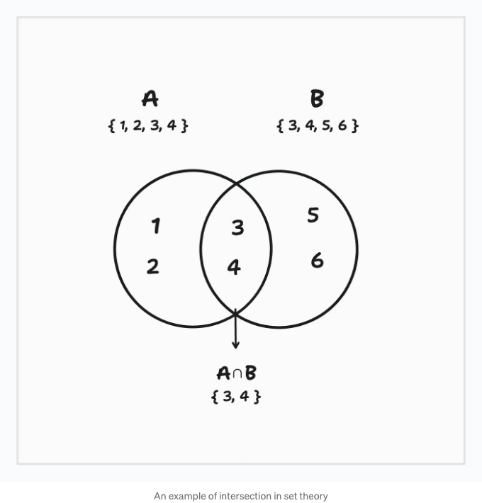
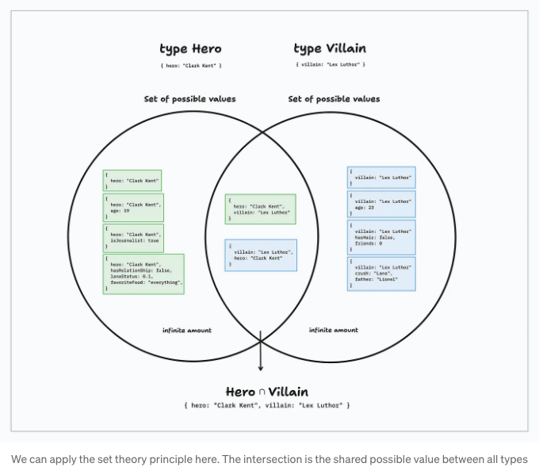
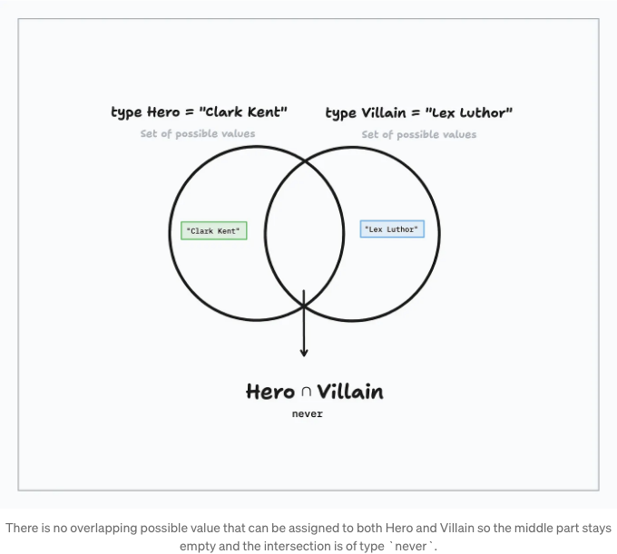

Typescript에서의 교차는 매우 쉬운 개념이에요. 여러 개의 타입을 하나로 결합하는 거죠? 음, 사실은 -그렇게- 간단하지 않아요. 왜 그런지 알아볼까요?

# 알림: 교차란 무엇인가요?

두 타입을 가져와서 &를 사용해 "결합"을 시도해봐요:

```js
type Person = { name: string; }
type Student = { grade: number; }

type Combined = Person & Student; // { name: string; grade: number; } 
```

<!-- ui-log 수평형 -->
<ins class="adsbygoogle"
  style="display:block"
  data-ad-client="ca-pub-4877378276818686"
  data-ad-slot="9743150776"
  data-ad-format="auto"
  data-full-width-responsive="true"></ins>
<component is="script">
(adsbygoogle = window.adsbygoogle || []).push({});
</component>

# 이름 교집합은 집합 이론에서 온 것이에요

수학의 집합 이론에서 사용되는 교집합은 두 개 이상의 집합 사이에 공통으로 포함된 멤버를 새로운 집합으로 만든다고 해요. 그 새로운 집합을 교집합이라고 부르죠.



# TypeScript에서 교집합이 어떻게 동작하는 걸까요?

<!-- ui-log 수평형 -->
<ins class="adsbygoogle"
  style="display:block"
  data-ad-client="ca-pub-4877378276818686"
  data-ad-slot="9743150776"
  data-ad-format="auto"
  data-full-width-responsive="true"></ins>
<component is="script">
(adsbygoogle = window.adsbygoogle || []).push({});
</component>

하지만 두 가지 객체 유형을 가져와 교차시켜 보겠습니다:

```js
type Hero = { hero: "Clark Kent" };
type Villain = { villain: "Lex Luthor" };
type Smallville = Hero & Villain;
```

이로써 다음과 같이 사용할 수 있는 값을 설명하는 유형이 생성됩니다:

```js
{ hero: "Clark Kent", villain: "Lex Luthor" };
```

<!-- ui-log 수평형 -->
<ins class="adsbygoogle"
  style="display:block"
  data-ad-client="ca-pub-4877378276818686"
  data-ad-slot="9743150776"
  data-ad-format="auto"
  data-full-width-responsive="true"></ins>
<component is="script">
(adsbygoogle = window.adsbygoogle || []).push({});
</component>

집합 이론 예시에서의 교집합과는 다르게, 영웅(Hero)과 악당(Villain)은 공유 멤버를 갖고 있지 않습니다. 두 유형 모두에서 사용 가능한 키가 없습니다. 그렇다면 어떻게 결과를 얻었을까요? 무슨 것을 교차했을까요? 필수 속성이었을까요? 사실 아닙니다. 다음 예제가 어떤 결과를 내는지 생각해보세요:

```js
type Example1 = "Clark Kent" & "Bruce Wayne";
type Example2 = { hero: string; hero: "Clark Kent" };
type Example3 = 23 & "Michael Jordan";
type Example4 = { number: 23; } & { number: 8; };
type Example5 = boolean & true;
type Example6 = false & boolean & true;
type Example7 = ("Clark Kent" | "Bruce Wayne") & ("Lex Luthor" | "Joker")
```

위 교차들의 결과를 정확히 알고 있다면: 축하합니다. 전문가일 수도 있습니다. 그렇지 않더라도, 이러한 유형에 대해 이해하려고 해 봅시다.

# 구조적 타이핑 이해하기

<!-- ui-log 수평형 -->
<ins class="adsbygoogle"
  style="display:block"
  data-ad-client="ca-pub-4877378276818686"
  data-ad-slot="9743150776"
  data-ad-format="auto"
  data-full-width-responsive="true"></ins>
<component is="script">
(adsbygoogle = window.adsbygoogle || []).push({});
</component>

인터섹션이 실제로 무엇을 하는지와 어떤 것을 교차하는지를 이해하려면 Typescript의 타입 시스템을 이해해야 합니다. Typescript는 구조적 타입 시스템을 가지고 있어서 타입은 클래스 또는 인터페이스의 이름이 아니라 데이터의 구조에 의해 결정됩니다 (명칭적 타이핑이 아닌 경우입니다). 하지만 이겯은 현재 단계에서는 아마 아무 의미가 없을 것입니다.

간단히 설명하면: 어떤 값이든 해당 타입에 맞추어 던져질 수 있고, 타입의 최소 요구 사항을 만족한다면 정상적인 것입니다.

아직까지 추상적이죠. 예시를 살펴보겠습니다:

```js
type Movie = { title: string };

function printMovie(movie: Movie) {
  return movie.title;
}

const movie = { title: "The Dark Knight" };
const hero = printMovie(movie); // ✅
```

<!-- ui-log 수평형 -->
<ins class="adsbygoogle"
  style="display:block"
  data-ad-client="ca-pub-4877378276818686"
  data-ad-slot="9743150776"
  data-ad-format="auto"
  data-full-width-responsive="true"></ins>
<component is="script">
(adsbygoogle = window.adsbygoogle || []).push({});
</component>

이해가 돼요. 여기서 이상한 점은 없네요. 하지만, 익명 객체 movie에 추가 속성을 넣는다고 생각해 봅시다:

```js
const movie = { title: "The Dark Knight", hero: "Batman" };
const hero = printMovie(movie); // ✅
```

이것도 여전히 유효합니다. 다음도 잘 작동합니다:

```js
const movie = {
  title: "The Dark Knight",
  hero: "Batman",
  hasGoodEnding: true,
  imdbGrade: 9
};

const hero = printMovie(movie); // ✅
```

<!-- ui-log 수평형 -->
<ins class="adsbygoogle"
  style="display:block"
  data-ad-client="ca-pub-4877378276818686"
  data-ad-slot="9743150776"
  data-ad-format="auto"
  data-full-width-responsive="true"></ins>
<component is="script">
(adsbygoogle = window.adsbygoogle || []).push({});
</component>

영화는 문자열 값이 있는 title 키를 가지고 있습니다. 따라서 영화 타입을 준수합니다. 다른 속성에 대해서는 신경쓰지 않습니다.

# 가능한 값의 집합으로서의 타입 생각하기

이전 예제를 분석해보면, 다음과 같은 타입을 생성할 때:

```js
type Movie = { title: string };
```

<!-- ui-log 수평형 -->
<ins class="adsbygoogle"
  style="display:block"
  data-ad-client="ca-pub-4877378276818686"
  data-ad-slot="9743150776"
  data-ad-format="auto"
  data-full-width-responsive="true"></ins>
<component is="script">
(adsbygoogle = window.adsbygoogle || []).push({});
</component>

해당 값이 최소한 { title: string } 키-값 쌍을 가지고 있다면 어떤 객체 값도 할당될 수 있다고 설명하고 있습니다. 아래 값들은 모두 type Movie에 대해 유효합니다:

```js
const movie = { title: "The Dark Knight" };
const movie = { title: "The Dark Knight", villain: "Joker" };
const movie = { title: "The Dark Knight", year: 2008, imdbUrl: "https://www.imdb.com/title/tt0468569/", hasGoodEnding: boolean, numberOfViewers: 13 };
```

당신이 유추할 수 있듯이, type Movie는 type Movie에 할당 가능한 무한한 양의 객체 값 (세트)을 설명합니다. 수천 개의 추가 키를 추가해도 여전히 유효합니다.

타입은 가능한 값의 집합을 설명합니다.

<!-- ui-log 수평형 -->
<ins class="adsbygoogle"
  style="display:block"
  data-ad-client="ca-pub-4877378276818686"
  data-ad-slot="9743150776"
  data-ad-format="auto"
  data-full-width-responsive="true"></ins>
<component is="script">
(adsbygoogle = window.adsbygoogle || []).push({});
</component>

# 교집합은 유형에 할당할 수 있는 가능한 값들의 교집합입니다.

이제 유형이 가능한 값들의 집합을 설명하는 것을 알았으니, 우리가 어떻게 교집합을 사용하는지 알아봅시다. 우리의 초기 Smallville 유형으로 돌아가 봅시다:

```js
type Hero = { hero: "Clark Kent" };
type Villain = { villain: "Lex Luthor" };
type Smallville = Hero & Villain;
```

이것은 Hero와 Villain 두 유형을 포함하는 교집합입니다. Hero는 할당할 수 있는 거의 무한한 양의 가능한 값들을 설명합니다:

<!-- ui-log 수평형 -->
<ins class="adsbygoogle"
  style="display:block"
  data-ad-client="ca-pub-4877378276818686"
  data-ad-slot="9743150776"
  data-ad-format="auto"
  data-full-width-responsive="true"></ins>
<component is="script">
(adsbygoogle = window.adsbygoogle || []).push({});
</component>

```js
const hero = { hero: "Clark Kent" };
const hero = { hero: "Clark Kent", age: 19};
const hero = { hero: "Clark Kent", isJournalist: true, movies: ["Man of Steel", "Superman 3"};
// 등등, 등등.
```

또한 가능한 값에 대해 다음을 설명할 것입니다:

```js
const hero = { hero: "Clark Kent", villain: "Lex Luthor" };
```

악당에 대해서도 마찬가지로:```

<!-- ui-log 수평형 -->
<ins class="adsbygoogle"
  style="display:block"
  data-ad-client="ca-pub-4877378276818686"
  data-ad-slot="9743150776"
  data-ad-format="auto"
  data-full-width-responsive="true"></ins>
<component is="script">
(adsbygoogle = window.adsbygoogle || []).push({});
</component>

```js
const villain = { villain: "Lex Luthor" };
const villain = { villain: "Lex Luthor", age: 24 };
const villain = { villain: "Lex Luthor", hair: false, friends: [], father: "Lionel" };

// 그러나 이렇게도 가능합니다:
const villain = { villain: "lex luthor", hero: "clark kent" }
```

그리고 보시다시피, 두 유형 사이의 공통 가능한 값을 찾았습니다:

```js
{ villain: "Lex Luthor", hero: "Clark Kent" }
```

그리고 그것이 교차하는 곳입니다. 그래서 교차점이라고 부릅니다.

<!-- ui-log 수평형 -->
<ins class="adsbygoogle"
  style="display:block"
  data-ad-client="ca-pub-4877378276818686"
  data-ad-slot="9743150776"
  data-ad-format="auto"
  data-full-width-responsive="true"></ins>
<component is="script">
(adsbygoogle = window.adsbygoogle || []).push({});
</component>



# 다른 유형에 동일한 원칙 적용

객체가 아닌 다른 유형을 교차시켜 보겠습니다. 먼저 문자열 유형부터 시작해 보겠습니다.

```js
type Hero = string;
``` 

<!-- ui-log 수평형 -->
<ins class="adsbygoogle"
  style="display:block"
  data-ad-client="ca-pub-4877378276818686"
  data-ad-slot="9743150776"
  data-ad-format="auto"
  data-full-width-responsive="true"></ins>
<component is="script">
(adsbygoogle = window.adsbygoogle || []).push({});
</component>

이것도 마찬가지로 해야 합니다; 문자열 유형을 가능한 값 집합으로 간주해야 합니다. 이 경우 무한한 양의 리터럴 문자열 집합입니다:

```js
type Hero = string;
const printHero = (hero: Hero) => hero;

// 이들은 모두 유효합니다, 왜냐하면 `string` 유형의 집합에 속하기 때문입니다
const hero = "s"
const hero = "spide"
const hero = "batm"
const hero = "aquaman"
// 등등
```

상상할 수 있는 모든 문자열(리터럴)은 문자열 집합 내의 가능한 값 중 일부입니다.

이제 문자열 리터럴 유형을 만들어 봅시다:

<!-- ui-log 수평형 -->
<ins class="adsbygoogle"
  style="display:block"
  data-ad-client="ca-pub-4877378276818686"
  data-ad-slot="9743150776"
  data-ad-format="auto"
  data-full-width-responsive="true"></ins>
<component is="script">
(adsbygoogle = window.adsbygoogle || []).push({});
</component>

```js
type Villain = "Lex Luthor"
```

우리는 악당 타입을 다시 한 번 가능한 값들의 집합으로 볼 수 있습니다. 하지만 이곳에 가능한 값은 `Lex Luthor` 하나 뿐입니다. 이건 하나뿐인 집합입니다:

```js
const printVillain = (villain: Villain) => villain;

// Villain에 할당할 수 있는 유일한 값:
const villain = "Lex Luthor";
```

우리는 이제 "Lex Luthor" 이외에 다른 값을 Villain에 할당할 수 없습니다. 왜냐하면 우리가 허용하는 가능한 값들의 집합이 단지 "Lex Luthor" 하나의 문자열 리터럴이라고 명시했기 때문입니다.

<!-- ui-log 수평형 -->
<ins class="adsbygoogle"
  style="display:block"
  data-ad-client="ca-pub-4877378276818686"
  data-ad-slot="9743150776"
  data-ad-format="auto"
  data-full-width-responsive="true"></ins>
<component is="script">
(adsbygoogle = window.adsbygoogle || []).push({});
</component>

우리가 교차하는 곳을 살펴봅시다:

```js
type Hero = string;
type Villain = "Lex Luthor"
type MovieIntersection = Hero & Villain; 
```

이전에 보았던 것처럼, 교차에서 모든 유형에 의해 설명된 가능한 값들을 교차시키려고 합니다. 악당은 'Lex Luthor'라는 하나의 문자열로 이루어진 집합이고, 영웅은 가능한 모든 문자열로 이루어진 집합이므로 'Lex Luthor' 문자열 상수에서 교차할 것입니다.

```js
type Hero = string;
type Villain = "Lex Luthor"
type MovieIntersection = Hero & Villain; // "Lex Luthor"
```

<!-- ui-log 수평형 -->
<ins class="adsbygoogle"
  style="display:block"
  data-ad-client="ca-pub-4877378276818686"
  data-ad-slot="9743150776"
  data-ad-format="auto"
  data-full-width-responsive="true"></ins>
<component is="script">
(adsbygoogle = window.adsbygoogle || []).push({});
</component>

# 빈 교집합 (집합)은 never 타입을 생성합니다

아마도 이미 never 타입을 보신 적이 있을 것입니다. 이것은 가능한 값들의 빈 집합을 나타냅니다. 교집합이 모든 전달된 타입들 사이에 공유 가능한 값이 없다면, 빈 집합인 never가 발생합니다.

```js
type Hero = "Clark Kent";
type Villain = "Lex Luthor"
type Characters = Hero & Villain; // never

type MinAge = 23;
type MaxAge = 50;
type Ages = MinAge & MaxAge; // never
```



<!-- ui-log 수평형 -->
<ins class="adsbygoogle"
  style="display:block"
  data-ad-client="ca-pub-4877378276818686"
  data-ad-slot="9743150776"
  data-ad-format="auto"
  data-full-width-responsive="true"></ins>
<component is="script">
(adsbygoogle = window.adsbygoogle || []).push({});
</component>

객체에도 동일한 규칙이 적용됩니다. 예를 들면; 문자열 상수를 키로 사용한 두 개의 세트는 일치하는 가능한 값이 결코 없을 것입니다.

```js
type Hero = { name: "Clark Kent" };
type Villain = { name: "Lex Luthor" };
type Characters = Hero & Villain; // 결코
```

# Typescript의 작은 예외: 초과 속성 검사

이론을 살펴보고 왜 그렇게 불리는지 및 작동 방식에 대해 이야기했습니다. 하지만 중요한 점 한 가지를 놓치지 마세요. Typescript는 구조적 타입의 표준 구현에서 특정한 예외를 만들었습니다: 주석이 달린 객체 리터럴에는 초과 속성이 검사될 것입니다.

<!-- ui-log 수평형 -->
<ins class="adsbygoogle"
  style="display:block"
  data-ad-client="ca-pub-4877378276818686"
  data-ad-slot="9743150776"
  data-ad-format="auto"
  data-full-width-responsive="true"></ins>
<component is="script">
(adsbygoogle = window.adsbygoogle || []).push({});
</component>

이렇게 설명할게요; 우리 이전 예제는 다음과 같아요:

```js
type Movie = { title: string; }
const printMovie = (movie: Movie) => movie.title;
```

그리고 printMovie에 전달할 무명 객체를 만들었을 때, 모든 것이 예상대로 작동했어요:

```js
const movie = { title: "The Dark Knight", hero: "Batman" };
const hero = printMovie(movie); ✅
```

<!-- ui-log 수평형 -->
<ins class="adsbygoogle"
  style="display:block"
  data-ad-client="ca-pub-4877378276818686"
  data-ad-slot="9743150776"
  data-ad-format="auto"
  data-full-width-responsive="true"></ins>
<component is="script">
(adsbygoogle = window.adsbygoogle || []).push({});
</component>

하지만 객체 리터럴을 삽입하려고 하면: 

```js
const hero = printMovie({ 
  title: "The Dark Knight", 
  hero: "Batman" 
}); ❌
```

Typescript는 오류를 표시할 것입니다: 

```js
❌ Object literal may only specify known properties, and 'hero' does not exist in type 'Movie'.(2353)
```

<!-- ui-log 수평형 -->
<ins class="adsbygoogle"
  style="display:block"
  data-ad-client="ca-pub-4877378276818686"
  data-ad-slot="9743150776"
  data-ad-format="auto"
  data-full-width-responsive="true"></ins>
<component is="script">
(adsbygoogle = window.adsbygoogle || []).push({});
</component>

그 이유는 TypeScript가 객체 리터럴에 대한 내장 초과 속성 확인을 가지고 있기 때문입니다. 명시적으로 Movie 유형과 정확히 일치하지 않는 값을 값으로 전달할 때 오류를 발생시켰다고 가정합니다.

그것은 이것도 실패하는 이유와 같습니다:

```js
type Movie = { title: string; };
const movie: Movie = { title: "Superman", villain: "Lex Luthor" };

// ❌ Object literal may only specify known properties, and 'villain' does not exist in type 'Movie'.(2353)
```

# 마무리말

<!-- ui-log 수평형 -->
<ins class="adsbygoogle"
  style="display:block"
  data-ad-client="ca-pub-4877378276818686"
  data-ad-slot="9743150776"
  data-ad-format="auto"
  data-full-width-responsive="true"></ins>
<component is="script">
(adsbygoogle = window.adsbygoogle || []).push({});
</component>

Typescript의 타입 시스템을 이해하는 것이 언어를 숙달하는 열쇠라고 생각합니다. 우리는 교차점에 초점을 맞추었지만, 동일한 원칙을 Typescript의 다른 부분에도 적용할 수 있습니다.

질문이 있으신가요? 메시지를 보내거나 댓글을 남겨주세요.