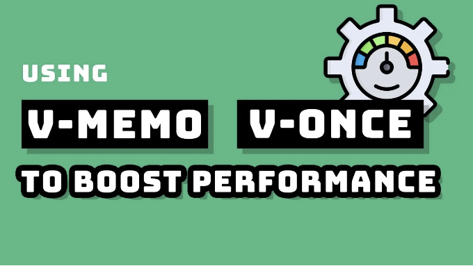

# Vue 시리즈 기사

- Vue3에서 v-memo 이해하기
- Vue3에서 Suspense 이해하기
- Vue3에서 reactive, isReactive 및 shallowReactive 이해하기
- Vue3에서 defineModel 이해하기
- Vue3에서 Fragment 이해하기
- Vue3에서 Teleport 이해하기
- Vue3에서 비동기 컴포넌트 이해하기
- Vue3에서 v-model 이해하기
- Vue3에서 watch 및 watchEffect 이해하기
- Vue3 구성 API의 이해 및 실습
- Vue3에서 Hooks 이해하기 (Hooks 사용하는 이유)
- Vue3에서 사용하는 커스텀 Hooks 함수의 사용 및 캡슐화 개념
- Vue3의 다양한 ref 이해하기: toRef, toRefs, isRef, unref 등
- Vue3 개발 솔루션(Ⅰ)
- Vue3 개발 솔루션(Ⅱ)
- 알지 못했던 Vue3의 세부 정보
- Vue3 개발 문서
- 자세한 설명이 포함된 28가지 Vue 인터뷰 질문

# 개요

<!-- ui-log 수평형 -->
<ins class="adsbygoogle"
  style="display:block"
  data-ad-client="ca-pub-4877378276818686"
  data-ad-slot="9743150776"
  data-ad-format="auto"
  data-full-width-responsive="true"></ins>
<component is="script">
(adsbygoogle = window.adsbygoogle || []).push({});
</component>

v-memo의 공식 정의는 다음과 같습니다:

템플릿의 하위 트리를 메모이즈합니다. 요소와 컴포넌트 모두에 사용할 수 있습니다. 이 디렉티브는 메모이제이션을 위해 비교할 고정 길이의 의존 값 배열을 예상합니다. 배열의 모든 값이 마지막 렌더링과 동일하다면 전체 하위 트리에 대한 업데이트는 건너뜁니다.

간단히 말하면, v-memo가 하는 일은 기존의 계산된 속성과 유사하지만, v-memo의 대상은 DOM입니다.

이 새로운 디렉티브는 제어하는 DOM 세그먼트를 캐싱하며, 특정 값이 변경되면 업데이트와 다시 랜더링만 실행합니다. 이러한 값은 수동으로 설정됩니다.

<!-- ui-log 수평형 -->
<ins class="adsbygoogle"
  style="display:block"
  data-ad-client="ca-pub-4877378276818686"
  data-ad-slot="9743150776"
  data-ad-format="auto"
  data-full-width-responsive="true"></ins>
<component is="script">
(adsbygoogle = window.adsbygoogle || []).push({});
</component>

```js
  <div v-memo="[valueA, valueB]">
    ...
  </div>
```

# 사용법

v-memo은 종속성 배열을 받습니다. 배열이 변경되면 v-memo에 해당하는 DOM과 해당 자식 요소가 다시 렌더링됩니다. 반대로, 종속성 배열이 변경되지 않으면 전체 컴포넌트가 재렌더링되더라도 v-memo에 해당하는 DOM 및 해당 자식 요소의 업데이트가 건너뛰어집니다.

또한, 종속성 배열은 v-memo="valueOne, valueTwo"와 같이 하나 이상의 값 또는 표현식(예: v-memo="myValue === true")을 받을 수 있습니다.

<!-- ui-log 수평형 -->
<ins class="adsbygoogle"
  style="display:block"
  data-ad-client="ca-pub-4877378276818686"
  data-ad-slot="9743150776"
  data-ad-format="auto"
  data-full-width-responsive="true"></ins>
<component is="script">
(adsbygoogle = window.adsbygoogle || []).push({});
</component>

## 예시 1: 빈 배열

만약 빈 배열이 전달되면, 항상 처음 렌더링 시에 캐시된 결과를 사용하므로 다시 렌더링되지 않습니다. 마치 v-once와 유사합니다.

```js
<template>  
    <div v-memo="[]">{ data }</div>
    <!-- equal to -->
    <div v-once>{ data }</div>
</template>
```

## 예시 2: 변수

<!-- ui-log 수평형 -->
<ins class="adsbygoogle"
  style="display:block"
  data-ad-client="ca-pub-4877378276818686"
  data-ad-slot="9743150776"
  data-ad-format="auto"
  data-full-width-responsive="true"></ins>
<component is="script">
(adsbygoogle = window.adsbygoogle || []).push({});
</component>

```js
<template>
  <div v-memo="[name]">
    <div>{ name }</div>
    <div>{ age }</div>
    <div>{ message }</div>
  </div>
  <button @click="handleBtnClick">change</button>
</template>
<script setup>
import { ref } from 'vue';

const name = ref('loftyamb')
const age = ref(24)

const handleBtnClick = () => {
  age.value++;
  // Changes to the age value will not be updated on the page unless the name changes.
}
</script>
```

특정 시나리오에서는 비즈니스 로직이 복잡할 때 전반적인 업데이트를 수동으로 제어함으로써 성능을 향상시킬 수 있습니다. 이것은 큰 컴포넌트가 다시 렌더링될 때 정확한 제어가 필요한 경우에 매우 유용합니다.

## 예제 3: v-for와 함께 사용하기

```js
<div v-for="item in list" :key="item.id" v-memo="[item.id === selected]">
  <p>ID: { item.id } - selected: { item.id === selected }</p>
  <p>...더 많은 자식 노드</p>
</div>
```

<!-- ui-log 수평형 -->
<ins class="adsbygoogle"
  style="display:block"
  data-ad-client="ca-pub-4877378276818686"
  data-ad-slot="9743150776"
  data-ad-format="auto"
  data-full-width-responsive="true"></ins>
<component is="script">
(adsbygoogle = window.adsbygoogle || []).push({});
</component>

위의 코드에서 v-memo가 사용되지 않으면 선택한 변수를 변경할 때마다 목록 전체가 완전히 다시 렌더링됩니다. 새 지시문이 제공하는 캐싱 기능은 표현식 item.id === selected이 변경되는 로우만 업데이트되도록 허용하며, 즉, 항목을 선택하거나 선택 취소할 때만 업데이트됩니다.

# 요약

v-memo의 사용은 다음과 같이 요약할 수 있습니다:

- 비어있는 목록에 의존하는 경우 v-memo를 사용하는 것이 권장되지 않습니다.
- 비즈니스 로직이 복잡할 때 일부 시나리오에서 전반적인 업데이트를 수동으로 제어하면 성능이 향상될 수 있습니다.
- 대규모 구성 요소의 다시 렌더링 시간을 제어해야 할 때 매우 유용합니다.
- 대규모 목록을 렌더링하는 최적화입니다.

<!-- ui-log 수평형 -->
<ins class="adsbygoogle"
  style="display:block"
  data-ad-client="ca-pub-4877378276818686"
  data-ad-slot="9743150776"
  data-ad-format="auto"
  data-full-width-responsive="true"></ins>
<component is="script">
(adsbygoogle = window.adsbygoogle || []).push({});
</component>

# Stackademic 🎓

끝까지 읽어 주셔서 감사합니다. 떠나시기 전에:

- 작가를 추종하고 박수 치는 것을 고려해주세요! 👏
- 우리를 팔로우해주세요 X | LinkedIn | YouTube | Discord
- 다른 플랫폼에 방문해주세요: In Plain English | CoFeed | Venture | Cubed
- 더 많은 콘텐츠는 Stackademic.com에서 확인해주세요.