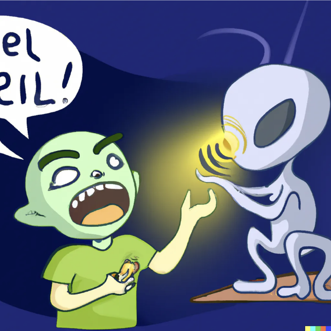

현대 웹 개발에서 교차 출처 통신은 서로 다른 도메인의 웹 페이지나 프레임이 안전하게 상호 작용할 수 있도록 하는 중요한 측면입니다. 이를 실현하는 인기 있는 메커니즘 중 하나는 JavaScript의 postMessage API를 사용하는 것입니다. 이 글에서는 window.postMessage와 window.parent.postMessage의 개념을 탐구하면서 웹 응용 프로그램 내에서 다른 컨텍스트 간 통신이 어떻게 가능해지는지 살펴볼 것입니다.

# 1. window.postMessage:

window.postMessage 메서드는 서로 다른 출처(도메인)에 속하는 두 창 또는 탭 간 통신을 활성화하는 안전한 방법입니다. 이를 통해 한 창의 스크립트가 다른 창으로 안전하게 메시지를 전달할 수 있도록 하여, 서로 다른 도메인에서 발생한 경우에도 가능합니다. 이는 제3자 위젯, 아이프레임 또는 웹 응용 프로그램 내에서 교차 출처 통신을 포함하는 데 특히 유용합니다.

<!-- ui-log 수평형 -->
<ins class="adsbygoogle"
  style="display:block"
  data-ad-client="ca-pub-4877378276818686"
  data-ad-slot="9743150776"
  data-ad-format="auto"
  data-full-width-responsive="true"></ins>
<component is="script">
(adsbygoogle = window.adsbygoogle || []).push({});
</component>

```js
otherWindow.postMessage(message, targetOrigin, [transfer]);
```

매개변수:

- message: 다른 창으로 전송할 데이터입니다. 문자열, 객체 또는 기타 JSON 직렬화할 수 있는 데이터가 될 수 있습니다.
- targetOrigin: 대상 창의 출처를 지정합니다. 보안을 강화하기 위해 이 매개변수는 대상 창의 특정 출처로 설정되어야 합니다 (예: "https://example.com"). "*"를 사용하여 모든 출처와 통신을 허용할 수도 있지만, 이 방법은 보안에 취약합니다.
- transfer (선택 사항): 다른 창으로 보내질 때 복제 대신 전달할 Transferable 객체들의 배열입니다 (예: ArrayBuffer, MessagePort). 이 매개변수는 대량 데이터를 처리할 때 성능을 향상시킬 때 유용합니다.

예시: 서로 다른 출처의 두 HTML 파일을 고려해 보겠습니다 (예: https://origin1.com 및 https://origin2.com):

<!-- ui-log 수평형 -->
<ins class="adsbygoogle"
  style="display:block"
  data-ad-client="ca-pub-4877378276818686"
  data-ad-slot="9743150776"
  data-ad-format="auto"
  data-full-width-responsive="true"></ins>
<component is="script">
(adsbygoogle = window.adsbygoogle || []).push({});
</component>

```js
<!--origin1.html-->

<!DOCTYPE html>
<html>
<head>
  <title>Origin 1</title>
</head>
<body>
  <button onclick="sendMessage()">Send Message</button>

  <script>
    function sendMessage() {
      const otherWindow = window.open('https://origin2.com/origin2.html');
      const message = 'Hello from Origin 1!';
      const targetOrigin = 'https://origin2.com';
      otherWindow.postMessage(message, targetOrigin);
    }
  </script>
</body>
</html>
```

```js
<!--origin2.html-->

<!DOCTYPE html>
<html>
<head>
  <title>Origin 2</title>
</head>
<body>
  <script>
    window.addEventListener('message', receiveMessage, false);

    function receiveMessage(event) {
      if (event.origin === 'https://origin1.com') {
        alert('Received message: ' + event.data);
      }
    }
  </script>
</body>
</html>
```

이 예시에서 origin1.html의 “Send Message” 버튼을 클릭하면, origin2.html을 연 다음 메시지 “Hello from Origin 1!”를 전송합니다. origin2.html 창은 메시지를 수신하고, 보안을 위해 오리진이 “https://origin1.com”과 일치할 경우에만 수신된 데이터와 함께 경고를 표시합니다.

# 1. window.parent.postMessage:

<!-- ui-log 수평형 -->
<ins class="adsbygoogle"
  style="display:block"
  data-ad-client="ca-pub-4877378276818686"
  data-ad-slot="9743150776"
  data-ad-format="auto"
  data-full-width-responsive="true"></ins>
<component is="script">
(adsbygoogle = window.adsbygoogle || []).push({});
</component>

window.parent.postMessage 방법은 window.postMessage와 유사하지만 임베디드된 iframe 내에서 부모 창과 통신하기 위해 특별히 사용됩니다.

```js
parent.postMessage(message, targetOrigin, [transfer]);
```

매개변수:

- message: 부모 창으로 보내질 데이터입니다.
- targetOrigin: 부모 창의 출처를 지정합니다.
- transfer (선택사항): window.postMessage와 마찬가지로, 이 매개변수를 사용하면 전송될 때 복제 대신 데이터 전송이 가능합니다.

<!-- ui-log 수평형 -->
<ins class="adsbygoogle"
  style="display:block"
  data-ad-client="ca-pub-4877378276818686"
  data-ad-slot="9743150776"
  data-ad-format="auto"
  data-full-width-responsive="true"></ins>
<component is="script">
(adsbygoogle = window.adsbygoogle || []).push({});
</component>

예시: 부모.html 파일이 다른 출처의 iframe(자식.html)를 내장하는 시나리오를 고려해 봅시다:

```js
<!--부모.html-->

<!DOCTYPE html>
<html>
<head>
  <title>부모 창</title>
</head>
<body>
  <iframe src="https://origin2.com/child.html"></iframe>
</body>
</html>
```

```js
<!--자식.html-->

<!DOCTYPE html>
<html>
<head>
  <title>자식 창</title>
</head>
<body>
  <button onclick="sendMessage()">부모에게 메시지 보내기</button>

  <script>
    function sendMessage() {
      const message = '자식 창에서 안녕하세요!';
      parent.postMessage(message, 'https://origin1.com');
    }
  </script>
</body>
</html>
```

이 예시에서 자식.html의 "부모에게 메시지 보내기" 버튼을 클릭하면 "자식 창에서 안녕하세요!" 메시지를 부모 창(origin1.html)으로 보냅니다. 부모.html 창은 이 메시지를 받아서 적절하게 처리할 수 있습니다.

<!-- ui-log 수평형 -->
<ins class="adsbygoogle"
  style="display:block"
  data-ad-client="ca-pub-4877378276818686"
  data-ad-slot="9743150776"
  data-ad-format="auto"
  data-full-width-responsive="true"></ins>
<component is="script">
(adsbygoogle = window.adsbygoogle || []).push({});
</component>

# window.parent.postMessage를 사용하여 객체 또는 배열과 같은 복잡한 데이터를 보낼 수 있나요?

네, window.parent.postMessage를 사용하여 객체 또는 배열과 같은 복잡한 데이터를 보낼 수 있습니다. 이 방법은 JSON 직렬화 가능한 데이터를 지원하므로 JavaScript 객체와 배열을 메시지 콘텐츠로 전달할 수 있습니다. 데이터가 안전하게 직렬화되고 역직렬화되어야 하므로 iframe과 상위 창 간에 데이터가 정확히 변환될 수 있도록하세요.