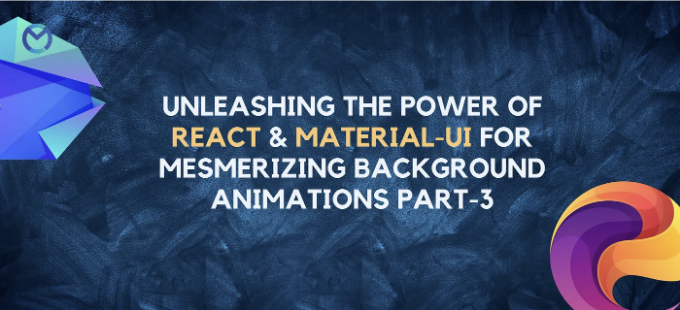

# 소개

웹 개발의 다이나믹한 세계에서 매혹적인 시각적 요소는 사용자 참여를 향상시키는 데 중요한 역할을 합니다. 이 포괄적인 안내서는 인기 있는 React 라이브러리와 Material-UI 프레임워크를 사용하여 매혹적인 배경 애니메이션을 만드는 기술을 탐구합니다.

# 그래디언트 색상 전환으로 아름다움 끌어올리기

<!-- ui-log 수평형 -->
<ins class="adsbygoogle"
  style="display:block"
  data-ad-client="ca-pub-4877378276818686"
  data-ad-slot="9743150776"
  data-ad-format="auto"
  data-full-width-responsive="true"></ins>
<component is="script">
(adsbygoogle = window.adsbygoogle || []).push({});
</component>

개념:

그라데이션 색상 전환은 여러 색상을 매끄럽게 섞어 시각적으로 멋진 배경을 만들어냅니다. 지속 시간 속성은 지정된 시간 동안 부드러운 전환을 보장하여 원하는 시각적 효과에 맞게 사용자 정의할 수 있도록 합니다.

```js
// 그라데이션 색상 전환
const TRANSITION = {
  duration: 5,
  ease: 'linear',
};
export const varColor2x = {
  animate: {
    background: ['#19dcea', '#b22cff'],
    transition: TRANSITION,
  },
};
// ... (varColor3x, varColor4x, varColor5x에 대한 유사한 스니펫이 있음)
```

# 켄 번스 효과로 동적 비주얼 생성

<!-- ui-log 수평형 -->
<ins class="adsbygoogle"
  style="display:block"
  data-ad-client="ca-pub-4877378276818686"
  data-ad-slot="9743150776"
  data-ad-format="auto"
  data-full-width-responsive="true"></ins>
<component is="script">
(adsbygoogle = window.adsbygoogle || []).push({});
</component>

Concept:

켄 번스 효과는 이미지를 동적으로 확대 및 이동시켜 카메라의 팬이나 줌을 모방합니다. varKenburnsTop과 같은 변형은 동적 시각적 경험을 위한 다양한 변환을 제공하여 정적 배경에 깊이와 움직임을 더합니다.

```js
// 켄 번스 효과
const TRANSITION = {
  duration: 5,
  ease: 'easeOut',
};
export const varKenburnsTop = {
  animate: {
    scale: [1, 1.25],
    y: [0, -15],
    transformOrigin: ['50% 16%', 'top'],
    transition: TRANSITION,
  },
};
// ... (varKenburnsBottom, varKenburnsLeft, varKenburnsRight에 대한 유사한 조각들)
```

# 그라디언트 배경 팬으로 매료되는 푸터

<!-- ui-log 수평형 -->
<ins class="adsbygoogle"
  style="display:block"
  data-ad-client="ca-pub-4877378276818686"
  data-ad-slot="9743150776"
  data-ad-format="auto"
  data-full-width-responsive="true"></ins>
<component is="script">
(adsbygoogle = window.adsbygoogle || []).push({});
</component>

개념:

그라데이션 배경 팬은 그라데이션 배경의 위치와 크기를 부드럽게 전환하여 전망 효과를 만들어냅니다. 이는 매료되는 팬 효과를 주어 사용자 경험을 더 몰입감 있고 시각적으로 매력적으로 만듭니다.

```js
// 그라데이션 배경 팬
const TRANSITION = {
  duration: 4,
  ease: 'linear',
};
const gradient = (deg) => `linear-gradient(${deg}deg, #ee7752, #e73c7e, #23a6d5, #23d5ab)`;
export const varPanTop = {
  animate: {
    backgroundImage: [gradient(0), gradient(0)],
    backgroundPosition: ['center 99%', 'center 1%'],
    backgroundSize: ['100% 600%', '100% 600%'],
    transition: TRANSITION,
  },
};
// ... (varPanBottom, varPanLeft, varPanRight에 대한 유사한 코드 샘플)
```

# React 애플리케이션에서 구현

<!-- ui-log 수평형 -->
<ins class="adsbygoogle"
  style="display:block"
  data-ad-client="ca-pub-4877378276818686"
  data-ad-slot="9743150776"
  data-ad-format="auto"
  data-full-width-responsive="true"></ins>
<component is="script">
(adsbygoogle = window.adsbygoogle || []).push({});
</component>

시작하기: React 앱 설정하기

# 단계 1: 새로운 React 앱 만들기

터미널을 열고 다음 명령어를 실행하세요:

```js
npx create-react-app my-background-app
```

<!-- ui-log 수평형 -->
<ins class="adsbygoogle"
  style="display:block"
  data-ad-client="ca-pub-4877378276818686"
  data-ad-slot="9743150776"
  data-ad-format="auto"
  data-full-width-responsive="true"></ins>
<component is="script">
(adsbygoogle = window.adsbygoogle || []).push({});
</component>

```js
cd my-background-app
```

# 단계 2: Material-UI 설치

Material-UI 라이브러리를 React 앱에 통합하세요:

```js
npm install @mui/material @emotion/react @emotion/styled
```

<!-- ui-log 수평형 -->
<ins class="adsbygoogle"
  style="display:block"
  data-ad-client="ca-pub-4877378276818686"
  data-ad-slot="9743150776"
  data-ad-format="auto"
  data-full-width-responsive="true"></ins>
<component is="script">
(adsbygoogle = window.adsbygoogle || []).push({});
</component>

# 단계 3: 컴포넌트 폴더 생성

src 폴더 내에 components라는 새 폴더를 만듭니다.

# 단계 4: 배경 애니메이션 컴포넌트 생성

components 폴더 안에 BackgroundAnimation.js라는 새 파일을 만듭니다. 제공된 배경 애니메이션 코드를 이 파일에 복사하여 붙여넣기합니다.

<!-- ui-log 수평형 -->
<ins class="adsbygoogle"
  style="display:block"
  data-ad-client="ca-pub-4877378276818686"
  data-ad-slot="9743150776"
  data-ad-format="auto"
  data-full-width-responsive="true"></ins>
<component is="script">
(adsbygoogle = window.adsbygoogle || []).push({});
</component>

```js
// BackgroundAnimation.js
import React from 'react';
import { motion } from 'framer-motion';
const TRANSITION = {
  duration: 5,
  ease: 'linear',
};
export const varColor2x = {
  animate: {
    background: ['#19dcea', '#b22cff'],
    transition: TRANSITION,
  },
};
// ... (other variants have similar code)
const BackgroundAnimation = ({ variant }) => {
  return (
    <motion.div
      style={{
        width: '100vw',
        height: '100vh',
        position: 'fixed',
        top: 0,
        left: 0,
        zIndex: -1,
      }}
      variants={variant}
      initial="initial"
      animate="animate"
    />
  );
};
export default BackgroundAnimation;
```

백그라운드 애니메이션을 React 앱에서 구현하기

# 단계 5: BackgroundAnimation을 App.js에 통합하기

<!-- ui-log 수평형 -->
<ins class="adsbygoogle"
  style="display:block"
  data-ad-client="ca-pub-4877378276818686"
  data-ad-slot="9743150776"
  data-ad-format="auto"
  data-full-width-responsive="true"></ins>
<component is="script">
(adsbygoogle = window.adsbygoogle || []).push({});
</component>

아래의 코드로 src/App.js 파일의 내용을 교체해주세요:

```js
// App.js
import React from 'react';
import BackgroundAnimation, { varColor2x, varColor3x, varKenburnsTop, varPanTop } from './components/BackgroundAnimation';
import { CssBaseline } from '@mui/material';
function App() {
  return (
    <div>
      <CssBaseline />
      {/* 선호하는 대로 다른 variant를 사용할 수 있습니다 */}
      <BackgroundAnimation variant={varColor2x} />
      {/* 다른 variant를 사용한 더 많은 BackgroundAnimation 컴포넌트 추가 가능 */}
    </div>
  );
}
export default App;
```

# 단계 6: 앱 실행하기

설정이 완료되면 React 앱을 실행해보세요.

<!-- ui-log 수평형 -->
<ins class="adsbygoogle"
  style="display:block"
  data-ad-client="ca-pub-4877378276818686"
  data-ad-slot="9743150776"
  data-ad-format="auto"
  data-full-width-responsive="true"></ins>
<component is="script">
(adsbygoogle = window.adsbygoogle || []).push({});
</component>

```js
npm start
```

이 명령어를 실행하면 개발 서버가 시작되고 React 앱에서 매혹적인 배경 애니메이션을 볼 수 있을 것입니다.

프로젝트 요구 사항에 따라 BackgroundAnimation 컴포넌트와 그 사용법을 App.js에서 자유롭게 수정해보세요. 또한 Material-UI의 추가 기능을 탐색하여 애플리케이션의 전체적인 스타일링과 구조를 개선해보세요.

# 결론: 몰입형 경험 제작하기

<!-- ui-log 수평형 -->
<ins class="adsbygoogle"
  style="display:block"
  data-ad-client="ca-pub-4877378276818686"
  data-ad-slot="9743150776"
  data-ad-format="auto"
  data-full-width-responsive="true"></ins>
<component is="script">
(adsbygoogle = window.adsbygoogle || []).push({});
</component>

React와 Material-UI에서 배경 애니메이션을 탐험하는 것으로 마무리하며, 이러한 애니메이션 기술을 활용하면 웹 응용 프로그램의 미적 요소와 사용자 참여도를 높일 수 있다는 것이 분명합니다. 부드러운 그래디언트 색상 전환, 다이내믹한 Ken Burns 효과 또는 매료되는 배경 팬 등, 몰입형 경험을 만들어낼 수 있는 가능성은 무한합니다.

다양한 조합을 실험하고, 애니메이션을 세밀하게 조정하여 응용 프로그램의 개성에 맞게 조합하고, 이러한 배경 애니메이션을 통해 React 응용 프로그램을 시각적 걸작으로 변화시킬 수 있는지 확인해보세요. React와 Material-UI의 힘을 받아 웹 응용 프로그램을 구축하는 것뿐만 아니라, 사용자에게 오래 남는 인상을 남길 수 있는 몰입형 디지턀 경험을 만들고 있습니다.