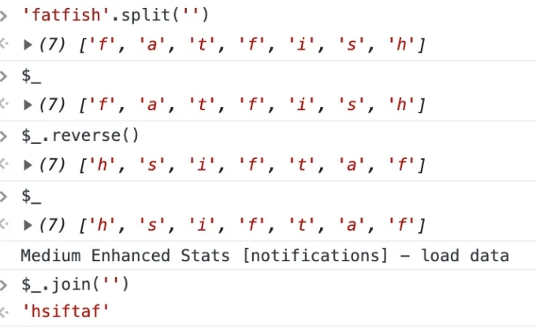

# 서문

프론트엔드 개발자들에게 가장 가까운 파트너인 Chrome 브라우저에 익숙하시리라고 믿습니다. Chrome을 사용하여 네트워크 요청을 확인하고 웹 페이지 성능을 분석하며 최신 JavaScript 기능을 디버깅할 수 있습니다.

이 외에도, Chrome은 다양한 강력하고 특이한 기능을 제공하는데, 이를 통해 개발 효율을 크게 향상시킬 수 있습니다.

<!-- ui-log 수평형 -->
<ins class="adsbygoogle"
  style="display:block"
  data-ad-client="ca-pub-4877378276818686"
  data-ad-slot="9743150776"
  data-ad-format="auto"
  data-full-width-responsive="true"></ins>
<component is="script">
(adsbygoogle = window.adsbygoogle || []).push({});
</component>

테이블 태그를 Markdown 형식으로 변경해 보겠습니다.

```markdown
| 순서 | 내용                     |
|------|--------------------------|
| 1.   | XHR 요청 재전송           |
| 2.   | 커뮤니케이션 효율 향상을 위한 디버깅|
| 3.   | 백엔드 개발자와의 인터페이스 문제 해결|
| 4.   | 도킹 효율성 향상 가능     |
``` 

아래와 같이 표를 Markdown 형식으로 바꿨어요!

<!-- ui-log 수평형 -->
<ins class="adsbygoogle"
  style="display:block"
  data-ad-client="ca-pub-4877378276818686"
  data-ad-slot="9743150776"
  data-ad-format="auto"
  data-full-width-responsive="true"></ins>
<component is="script">
(adsbygoogle = window.adsbygoogle || []).push({});
</component>

- 네트워크 패널을 선택하세요
- Fetch/XHR을 클릭하세요
- 다시 전송하고자 하는 요청을 선택하세요
- 오른쪽 클릭하고 XHR 재전송을 선택하세요


# 2. 콘솔에서 빠르게 요청 보내기

동일한 요청을 하는 경우 때로는 입력 매개변수를 수정하고 다시 보내야 할 수 있습니다. 이 때 단축키는 무엇인가요?

<!-- ui-log 수평형 -->
<ins class="adsbygoogle"
  style="display:block"
  data-ad-client="ca-pub-4877378276818686"
  data-ad-slot="9743150776"
  data-ad-format="auto"
  data-full-width-responsive="true"></ins>
<component is="script">
(adsbygoogle = window.adsbygoogle || []).push({});
</component>

그냥 이 단계들을 따르면 돼요:

- 네트워크 패널을 선택하세요.
- Fetch/XHR을 클릭하세요.
- 다시 전송하고 싶은 요청을 선택하세요.
- Fetch 패널로 복사를 선택하세요.
- 입력 매개변수를 수정하고 다시 전송하세요.


# 3. JavaScript 변수 복사

<!-- ui-log 수평형 -->
<ins class="adsbygoogle"
  style="display:block"
  data-ad-client="ca-pub-4877378276818686"
  data-ad-slot="9743150776"
  data-ad-format="auto"
  data-full-width-responsive="true"></ins>
<component is="script">
(adsbygoogle = window.adsbygoogle || []).push({});
</component>

복잡한 데이터를 클립보드로 복사하는 방법을 알고 계신가요?

진짜 놀라운데요! Chrome 브라우저에서 제공하는 복사 함수를 사용하면 가능합니다.


## 4. 콘솔에서 선택된 DOM 요소 가져오기

<!-- ui-log 수평형 -->
<ins class="adsbygoogle"
  style="display:block"
  data-ad-client="ca-pub-4877378276818686"
  data-ad-slot="9743150776"
  data-ad-format="auto"
  data-full-width-responsive="true"></ins>
<component is="script">
(adsbygoogle = window.adsbygoogle || []).push({});
</component>

“Elements” 패널을 통해 요소를 선택하면 JavaScript를 통해 너비, 높이, 위치 등 일부 속성을 출력하려면 어떻게 해야 하나요?

1. Elements 패널을 통해 DOM 요소를 선택합니다.
2. 콘솔에서 $0을 사용하여 해당 요소에 액세스합니다.


# 5. 전체 크기 스크린샷 캡처하기

<!-- ui-log 수평형 -->
<ins class="adsbygoogle"
  style="display:block"
  data-ad-client="ca-pub-4877378276818686"
  data-ad-slot="9743150776"
  data-ad-format="auto"
  data-full-width-responsive="true"></ins>
<component is="script">
(adsbygoogle = window.adsbygoogle || []).push({});
</component>

만약 화면 한 화면을 초과하는 페이지의 스크린샷을 찍고 싶다면 좋은 방법이 있을까요?

강력한 Chrome 브라우저는 이를 쉽게 할 수 있습니다.

- 캡처하고 싶은 페이지의 내용을 준비합니다.
- CMD + Shift + P를 눌러 명령어 실행
- 전체 크기 스크린샷 캡처를 입력하고 Enter 키를 누릅니다.

와우, 멋지네요!

<!-- ui-log 수평형 -->
<ins class="adsbygoogle"
  style="display:block"
  data-ad-client="ca-pub-4877378276818686"
  data-ad-slot="9743150776"
  data-ad-format="auto"
  data-full-width-responsive="true"></ins>
<component is="script">
(adsbygoogle = window.adsbygoogle || []).push({});
</component>

```markdown


Now there’s a new question. We just want to take a part of the screenshot page. What should we do?

It’s also very easy, just enter “Capture node screenshot” in the third step.


```

<!-- ui-log 수평형 -->
<ins class="adsbygoogle"
  style="display:block"
  data-ad-client="ca-pub-4877378276818686"
  data-ad-slot="9743150776"
  data-ad-format="auto"
  data-full-width-responsive="true"></ins>
<component is="script">
(adsbygoogle = window.adsbygoogle || []).push({});
</component>

# 6. 모든 하위 노드 확장하기

한 번에 DOM 요소의 모든 하위 노드를 확장하려면 어떻게 해야 할까요? 하나씩이 아닌 모두 한 번에 확장하고 싶어요.

"요소" 패널에서 "Alt + 클릭" 키 조합을 사용하여 모든 하위 노드를 한 번에 확장할 수 있습니다.


<!-- ui-log 수평형 -->
<ins class="adsbygoogle"
  style="display:block"
  data-ad-client="ca-pub-4877378276818686"
  data-ad-slot="9743150776"
  data-ad-format="auto"
  data-full-width-responsive="true"></ins>
<component is="script">
(adsbygoogle = window.adsbygoogle || []).push({});
</component>

# 7. 마지막 실행의 결과를 참조하기 위해 “$” 사용하기

이 장면을 한 번 살펴보자: 우리는 문자열에 대해 다양한 작업을 수행했고, 그런 다음 각 단계의 결과를 알고 싶을 때는 어떻게 해야할까요?

이렇게 할 수도 있습니다


<!-- ui-log 수평형 -->
<ins class="adsbygoogle"
  style="display:block"
  data-ad-client="ca-pub-4877378276818686"
  data-ad-slot="9743150776"
  data-ad-format="auto"
  data-full-width-responsive="true"></ins>
<component is="script">
(adsbygoogle = window.adsbygoogle || []).push({});
</component>

더 간편한 방법이 있어요:

“$”를 사용하면 매번 복사하지 않고 마지막 작업 결과를 얻을 수 있어요.



# 8. 테마 색상 빠르게 전환하기

<!-- ui-log 수평형 -->
<ins class="adsbygoogle"
  style="display:block"
  data-ad-client="ca-pub-4877378276818686"
  data-ad-slot="9743150776"
  data-ad-format="auto"
  data-full-width-responsive="true"></ins>
<component is="script">
(adsbygoogle = window.adsbygoogle || []).push({});
</component>

일부 사람들은 Chrome의 흰색 테마를 좋아하고, 다른 사람들은 검정색을 선호합니다. 두 테마 간에 빠르게 전환하기 위해 바로 가기 키를 사용할 수 있어요.

- cmd + shift + p를 눌러 Command 명령 실행
- "Switch to dark theme" 또는 "Switch to light theme"을 입력하여 테마 전환


## 9. DOM 요소를 빠르게 선택할 때 "$" 및 "$$"를 사용하세요.

<!-- ui-log 수평형 -->
<ins class="adsbygoogle"
  style="display:block"
  data-ad-client="ca-pub-4877378276818686"
  data-ad-slot="9743150776"
  data-ad-format="auto"
  data-full-width-responsive="true"></ins>
<component is="script">
(adsbygoogle = window.adsbygoogle || []).push({});
</component>

현재 페이지의 요소를 선택하려면 대부분 document.querySelector 및 document.querySelectorAll을 사용하는 것이 일반적입니다. 그러나 이것은 너무 길기 때문에 $ 및 $$를 대신 사용할 수 있습니다.


# 10. 콘솔에서 npm 패키지를 설치하려면 `$I`를 사용하세요

가끔 dayjs 또는 lodash와 같은 API를 사용하고 싶지만 공식 웹사이트로 이동하여 확인하기 귀찮다면 좋을 것입니다. 콘솔에서 직접 시도해 볼 수 있다면 좋을텐데요.

<!-- ui-log 수평형 -->
<ins class="adsbygoogle"
  style="display:block"
  data-ad-client="ca-pub-4877378276818686"
  data-ad-slot="9743150776"
  data-ad-format="auto"
  data-full-width-responsive="true"></ins>
<component is="script">
(adsbygoogle = window.adsbygoogle || []).push({});
</component>

- Console Importer 플러그인을 설치해보세요.
- $i('name') npm 패키지를 설치하세요.


# 11. 조건부 중단점 추가

다음 코드로 음식 이름이 🍫 인 경우에 중단점이 트리거되길 바랍니다. 어떻게 할 수 있을까요?

<!-- ui-log 수평형 -->
<ins class="adsbygoogle"
  style="display:block"
  data-ad-client="ca-pub-4877378276818686"
  data-ad-slot="9743150776"
  data-ad-format="auto"
  data-full-width-responsive="true"></ins>
<component is="script">
(adsbygoogle = window.adsbygoogle || []).push({});
</component>

```markdown


대량의 데이터를 다룰 때 조건부 중단점을 사용하는 것은 개발 작업에 매우 도움이 되며 효율성을 크게 향상시킬 수 있습니다.

# 마지막으로

읽어 주셔서 감사합니다. 앞으로도 여러분의 팔로우와 높은 품질의 기사를 더 많이 볼 수 있기를 기대합니다.
```  

<!-- ui-log 수평형 -->
<ins class="adsbygoogle"
  style="display:block"
  data-ad-client="ca-pub-4877378276818686"
  data-ad-slot="9743150776"
  data-ad-format="auto"
  data-full-width-responsive="true"></ins>
<component is="script">
(adsbygoogle = window.adsbygoogle || []).push({});
</component>

# 일반어로 표현한 내용

우리 커뮤니티의 일원이 되어 주셔서 감사합니다! 떠나시기 전에:

- 작가를 토끼하고 팔로우해 주세요! 👏
- PlainEnglish.io에서 더 많은 콘텐츠를 찾을 수 있어요! 🚀
- 무료 주간 뉴스레터를 구독해 주세요. 🗞️
- 트위터(X)를 팔로우하고, 링크드인, 유튜브, 디스코드도 팔로우해 주세요.