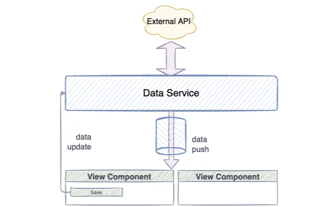
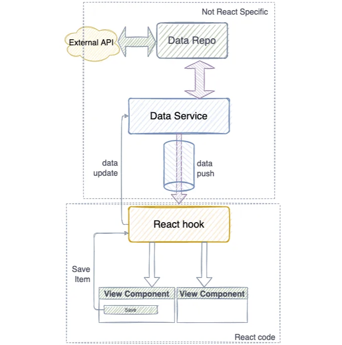
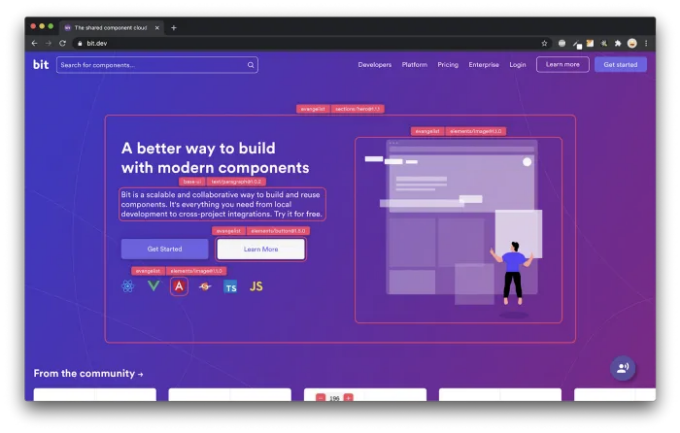

리액트 컴포넌트의 상태를 가장 우아하게 관리하는 방법은 무엇일까요? 유지보수가 쉽고 구현하기 쉽며 성능이 우수해야 합니다.


지난 한 해 동안 계속 발전해온 다음 패턴을 공유할 때가 온 것 같아요. 이 패턴은 스트림을 사용하여 리액트 컴포넌트를 렌더링하는 실험에서 시작되었지만, 대규모 스트림 라이브러리를 사용하는 것은 그다지 가치가 없었어요. Observables이 좋은 대안이 되었죠.

Observables을 사용하는 이유는 뭘까요? Observables은 현재 JavaScript 언어의 일부가 될 것으로 제안된 간단한 기능입니다. [링크](https://github.com/tc39/proposal-observable)를 확인해보세요.

<!-- ui-log 수평형 -->
<ins class="adsbygoogle"
  style="display:block"
  data-ad-client="ca-pub-4877378276818686"
  data-ad-slot="9743150776"
  data-ad-format="auto"
  data-full-width-responsive="true"></ins>
<component is="script">
(adsbygoogle = window.adsbygoogle || []).push({});
</component>

React 상태는 도메인별로 격리되어야 하며 컴포넌트는 대상지항적으로 다시 렌더링되어야 합니다; 데이터를 사용하는 컴포넌트만 업데이트되고 다른 컴포넌트는 업데이트되지 않아야 합니다. 우리는 성능에 영향을 미치는 데이터 비교나 변경 확인을 피하고 싶습니다.

우리는 데이터 소스를 서비스 계층으로 나누어서 이를 수행합니다. 각각의 데이터 형식에 대해 다른 서비스가 존재하게 됩니다. 예를 들어, 사용자 데이터를 업데이트하고 검색하는 UserService나 날씨 정보를 업데이트하는 WeatherService 같은 서비스가 있을 수 있습니다. 각 데이터 유형은 별도의 서비스를 가져야 합니다. 예를 들어, 블로깅 웹사이트는 ArticleService를 가질 수 있습니다.

이 패러다임에서 서비스는 데이터를 검색할 때는 ``Observable``을 반환하고 데이터를 변경할 때는 일반 동기 작업을 반환합니다. 이렇게 하면 단일 근본 데이터 소스를 보장할 수 있습니다.

예를 들어, TypeScript 메서드 타입은 다음과 같이 보일 것입니다:


| 함수 | 설명 |
|------|------|
| retrieveData() | 데이터를 검색하여 Observable 반환 |
| mutateData() | 데이터를 변경시키는 동기 작업 반환 |

<!-- ui-log 수평형 -->
<ins class="adsbygoogle"
  style="display:block"
  data-ad-client="ca-pub-4877378276818686"
  data-ad-slot="9743150776"
  data-ad-format="auto"
  data-full-width-responsive="true"></ins>
<component is="script">
(adsbygoogle = window.adsbygoogle || []).push({});
</component>

```js
class UserService {
   getUser(id:string):Observable<UserDTO | Error> {}
   updateUser(user:UserDto):void {}
}
```

사용자를 가져 오려면 옵저버블을 받게 되며, 이는 하나 이상의 사용자 데이터 객체 (UserDTOs)를 해결할 것입니다. 왜 하나 이상의 데이터 객체 일까요? 옵저버블은 우리가 구독을 취소할 때까지 한 번 이상 해결되도록 되어 있어요. updateUser 메서드가 호출될 때마다 새로 업데이트된 버전이 옵저버블을 통해 푸시됩니다.



useEffect 후크를 사용하여 보기 구성 요소에서 서비스 계층으로 직접 호출할 수 있지만, 이러한 경우 사용자 정의 후크를 사용하는 것이 더 좋습니다. 관심사 분리를 얻을 수 있고, 보기 계층, 후크를 컨트롤러로 사용하고, 구체적인 서비스를 서비스 계층으로 사용할 수 있습니다. 서비스와 뷰를 쉽게 결합할 수 있으며, 강력하게 연결을 해제한 구성 요소를 유지하면서 응집력을 유지할 수 있습니다.

<!-- ui-log 수평형 -->
<ins class="adsbygoogle"
  style="display:block"
  data-ad-client="ca-pub-4877378276818686"
  data-ad-slot="9743150776"
  data-ad-format="auto"
  data-full-width-responsive="true"></ins>
<component is="script">
(adsbygoogle = window.adsbygoogle || []).push({});
</component>

이 아키텍처는 다음 아키텍처 원칙을 준수합니다:

- 서비스와 뷰가 분리되어 있습니다.
- 높은 응집력을 가지고 있어 모든 것이 어떻게 작동하고 데이터가 흐르는지 간단히 볼 수 있습니다. 예를 들어 리듀서보다는 응집력이 높지만, 응집력이 부족합니다.
- 기술적 모듈; 각 구성 요소가 무엇을 하는지 식별하기 쉽습니다.
- 확장 가능하며, 서비스에 기능을 추가하는 것이 뷰나 훅을 불필요하게 부풀리지 않아도 됩니다. 비즈니스 로직은 그 곳에 추가됩니다.
- 데이터를 컴포넌트 간에 공유할 수 있으며, 간단한 페치 훅으로는 할 수 없는 일입니다.
- 어떤 백엔드도 사용할 수 있으며, 이 패턴은 웹소켓, HTTP 요청 및 심지어 로컬스토리지에도 적합합니다.



# 코드를 보여주세요

<!-- ui-log 수평형 -->
<ins class="adsbygoogle"
  style="display:block"
  data-ad-client="ca-pub-4877378276818686"
  data-ad-slot="9743150776"
  data-ad-format="auto"
  data-full-width-responsive="true"></ins>
<component is="script">
(adsbygoogle = window.adsbygoogle || []).push({});
</component>

자 코드를 보고 싶으세요? 아래 예시 사용자 서비스를 확인해보세요.

```js
class UserService {
  constructor() {
    this.observers = [];
    this.state = {};
    this.observable = new Observable((observer) => {
      this.observers.push(observer);
      observer.next(this.state);
      return () => {
        this.observers = this.observers.filter((obs) => obs !== observer);
      };
    });
  }

  write(state): void {
    this.state = state;
    this.observers.forEach((observer) => {
      if (observer && observer.next) observer.next(state);
    });
  }

  getUser(): Observable<ServiceStatus> {
    const shouldUpdate = !this.observers.length;
    if (shouldUpdate) {
      this.write({ ...this.state, status: Status.Loading });
      this.repo.getUser()
        .then((user) => {
          this.write({
            ...this.state,
            status: Status.Success,
            user,
          });
        })
        .catch((e) => {
          this.write({
            error: e.message,
            status: Status.Error,
            user: undefined,
          });
        });
    }
    return this.observable;
  }

  updateUser(data) {
    this.write({
      ...this.state,
      status: Status.Success,
      user,
    });
    await this.repo.updateUser();
    // 에러 처리 및 실패 시 업데이트된 사용자 데이터 롤백
  }
}
```

이 클래스에서 구독을 생성하는 메소드와 로컬 상태를 업데이트하는 메소드 두 가지가 있습니다. 여기서 구현한 설정은 매우 유연하며 필요에 따라 추가적인 메소드나 기능을 구현할 수 있습니다. 상태 만료, 상태 롤백, 낙관적 업데이트와 같은 기능을 추가하고 싶을 수 있습니다. 이러한 추가 기능을 믹스인을 사용해 만드는 것이 좋습니다.

## 예시 훅

<!-- ui-log 수평형 -->
<ins class="adsbygoogle"
  style="display:block"
  data-ad-client="ca-pub-4877378276818686"
  data-ad-slot="9743150776"
  data-ad-format="auto"
  data-full-width-responsive="true"></ins>
<component is="script">
(adsbygoogle = window.adsbygoogle || []).push({});
</component>

아래 코드는 사용자 서비스를 사용하는 예시 훅을 보여줍니다. 이 훅을 일반적이고 재사용 가능하게 만드는 것은 간단합니다. 이를 어떻게 구성할지는 개별 개발자가 결정하는 것이 가장 좋습니다.

```js
const useUserService = (userService) => {
  const [user, setUser] = useState({});
  const [status, setStatus] = useState(Status.Loading);
  
  const update = (newValue) => userService.updateUser(newValue);

  useEffect(() => {
    const observable = userService.getUser();
    const subscription = observable.subscribe((state) => {
      if (state.status === Status.Error) {
        setUser(null);
        setStatus(Status.Error);
      } else if (state.status === Status.Success) {
        setUser(state.user);
        setStatus(Status.Success);
      }
    });
    return () => {
      subscription.unsubscribe();
    };
  }, []);
  
  return { user, status, update };
};
```

이 훅은 비교적 간단합니다. 아래 React 컴포넌트와 서비스 사이의 연결 역할을 합니다.

마지막으로, 우리의 뷰 컴포넌트가 있습니다. 이것은 충분히 쉽게 처리될 수 있어야 합니다.

<!-- ui-log 수평형 -->
<ins class="adsbygoogle"
  style="display:block"
  data-ad-client="ca-pub-4877378276818686"
  data-ad-slot="9743150776"
  data-ad-format="auto"
  data-full-width-responsive="true"></ins>
<component is="script">
(adsbygoogle = window.adsbygoogle || []).push({});
</component>

```js
const UserView = (props) => {
  const { user, status, update} = useUserService();
  if(status.LOADING){
    return <LoadingIndicator /> 
  }
  return (
    <article> 
      <div>{user}</div>
      <button onClick={()=>update(user)} >Save</button>
    </article>
  );
};
```

우리는 어플리케이션의 여러 곳에서 이 훅을 사용할 수 있고 모두 동일한 데이터를 받게 될 거에요, 심지어 사용자가 업데이트되더라도 말이에요. 마술 같죠?

나는 이것이 어플리케이션 상태를 관리하는 꽤 깔끔한 방법이라고 생각해요. 다른 몇 가지 방법보다 더 많은 코드를 필요로 할 수도 있지만, 그런 대가로 데이터 흐름이 명확하고 매우 유연하며 확장 가능한 프레임워크를 얻을 수 있어요.


<!-- ui-log 수평형 -->
<ins class="adsbygoogle"
  style="display:block"
  data-ad-client="ca-pub-4877378276818686"
  data-ad-slot="9743150776"
  data-ad-format="auto"
  data-full-width-responsive="true"></ins>
<component is="script">
(adsbygoogle = window.adsbygoogle || []).push({});
</component>



Bit의 오픈 소스 도구는 25만 명 이상의 개발자들이 컴포넌트로 앱을 만드는 데 도움을 줍니다.

어떤 UI, 기능 또는 페이지든 재사용 가능한 컴포넌트로 변환하고 애플리케이션 전체에서 공유하세요. 협업하고 빠르게 개발하는 것이 더 쉬워집니다.

→ 더 알아보기

<!-- ui-log 수평형 -->
<ins class="adsbygoogle"
  style="display:block"
  data-ad-client="ca-pub-4877378276818686"
  data-ad-slot="9743150776"
  data-ad-format="auto"
  data-full-width-responsive="true"></ins>
<component is="script">
(adsbygoogle = window.adsbygoogle || []).push({});
</component>

앱을 구성 요소로 분할하여 앱 개발을 더 쉽게 만들고, 원하는 작업 흐름에 대한 최상의 경험을 즐기세요:

## → 마이크로 프론트엔드

## → 디자인 시스템

## → 코드 공유 및 재사용

<!-- ui-log 수평형 -->
<ins class="adsbygoogle"
  style="display:block"
  data-ad-client="ca-pub-4877378276818686"
  data-ad-slot="9743150776"
  data-ad-format="auto"
  data-full-width-responsive="true"></ins>
<component is="script">
(adsbygoogle = window.adsbygoogle || []).push({});
</component>

## → Monorepo

# 자세히 알아보기