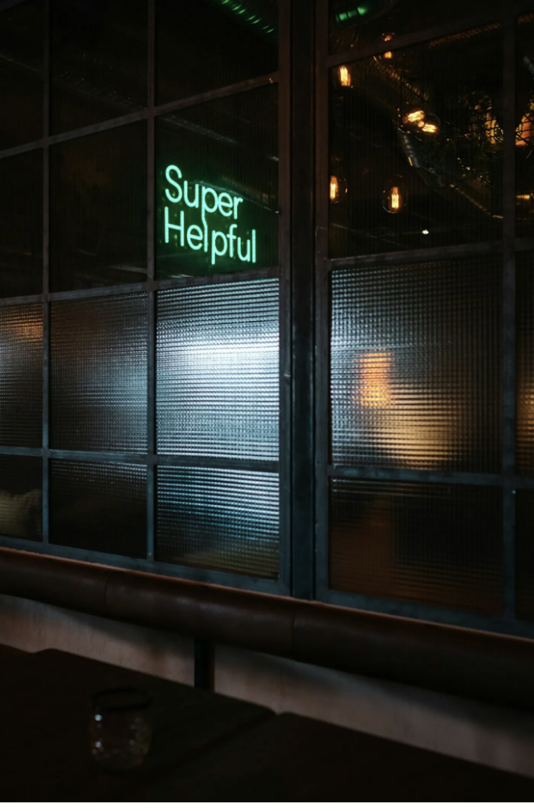

세상은 종종 친절과 지원을 찬양하지만, 주목받지 못하는 더 어두운 면이 존재합니다 - 덕택 뱀파이어주의와 동정심 악용 현상입니다. 이 용어들은 남을 도와준다는 이미지를 투영하면서 실제로 상대방의 취약성을 이용해 개인적 이득을 얻는 음침한 성격을 보여줍니다. 이 기사는 현실적인 예시와 그러한 행동의 파괴적인 영향에 대해 탐구합니다.

덕택 뱀파이어주의: 도움의 보장 속에서 취약성 악용

누군가가 여러분이 모르는 사이에 집을 사 주고 열쇠 복사본을 보관하며, 자기 마음대로 여러분의 사생활에 침입할 권리가 있다고 느낀다고 상상해보세요. 이것은 진정한 도움이 아니라, 개인의 욕망이나 자아를 충족시키기 위해 도움의 모습을 취하는 덕택 뱀파이어주의의 발현입니다. 젊은 엄마로 여러분을 묘사하거나 자신들을 구원자로 자처하는 것과 같이, 덕택 뱀파이어주의는 자비의 적막 속에서 취약성을 악용하는 데서 번성합니다.

<!-- ui-log 수평형 -->
<ins class="adsbygoogle"
  style="display:block"
  data-ad-client="ca-pub-4877378276818686"
  data-ad-slot="9743150776"
  data-ad-format="auto"
  data-full-width-responsive="true"></ins>
<component is="script">
(adsbygoogle = window.adsbygoogle || []).push({});
</component>

아니면 누군가가 중독으로 고뇌하는 개인에게 손길을 내밀 때 생각해보세요. 표면적으로 이는 이타적으로 보일 수 있습니다 - 지지에 관한 고귀한 행동입니다. 그러나 문을 닫고 친구들에게 도움의 부담에 대해 불평하거나 "중독자"나 "절망적인 케이스" 같은 라벨을 사용하여 도와준다고 주장하는 사람을 수소문하는 경우가 있습니다. 이게 행위자의 도움을 침해하는 스스로 위한 동기와 인정을 갈망함으로써 얼룩진 선행입니다. 그리고 이는 자신 스스로를 구해가고자 하는 사람을 고립시키는 결과를 초래합니다.

이왕점이성은 어떤 사람이 취약하고 상처받은 개인을 위한 옹호자로 자리 잡지만, 그 행동이 자기 이익을 위해 몰아넣고 다른 이의 고통을 이용한다는 점입니다. 이는 이타주의의 화장으로, 취약한 사람들에게 도움을 제공함으로써 자신의 부스름과 찬양을 얻으려는 것입니다. 이뿐만 아니라 그러한 개인들을 어떻게든 피해자상태에 머물게 하며 결코 그들의 자립을 할 수 있도록 지원하지 않습니다.

이 같은 동정심의 명분 아래의 이 형태의 착취는 "도와주는 이"가 성인 이미지를 유지할 수 있도록 하고, 의문됨 없이 그들이 도움을 하면서 진정으로 필요한 사람들의 목소리와 주체성을 약화시키는 것입니다. 누군가가 도와주기를 주장한 뒤에도 다른 사람을 "절망적인 경우"로 간주하거나 "미친 사람"으로 라벨 붙인 사람을 믿을 것입니까?

하지만 "도와주려 애쓰고 있는" 사람에게 공감과 연민을 표현할 수 있을 것입니다.

<!-- ui-log 수평형 -->
<ins class="adsbygoogle"
  style="display:block"
  data-ad-client="ca-pub-4877378276818686"
  data-ad-slot="9743150776"
  data-ad-format="auto"
  data-full-width-responsive="true"></ins>
<component is="script">
(adsbygoogle = window.adsbygoogle || []).push({});
</component>

진정한 지원이 아니라면, 이 행동은 선의의 피장을 덮고 주변의 관심을 끌려는 것과 같으며, 결국 도움을 받을 필요가 있는 사람들에게 해를 끼칩니다.

동정심 악용: 히어로의 표면

마찬가지로, 동정심 악용은 취약한 개인들을 이용하여 자신을 히어로로 포장하고, 도움을 받는 사람들의 실제 필요와 자주권을 무시하는 것을 말합니다. 이는 어려움을 겪은 뒤 누군가를 길 잃은 강아지처럼 대접하거나 "미친"이라는 레이블을 사용하여 비인간적인 대우를 정당화하는 방식으로 나타날 수 있습니다. 취약한 자들을 위한 옹호자임을 넘어서 종종 자신의 이익이나 인정을 얻기 위해 그들의 상황을 악용하는 현실을 가리키는 것이죠.

동정심 악용은 히어로와 구원자 복합 증후군의 영향과 유사합니다.

<!-- ui-log 수평형 -->
<ins class="adsbygoogle"
  style="display:block"
  data-ad-client="ca-pub-4877378276818686"
  data-ad-slot="9743150776"
  data-ad-format="auto"
  data-full-width-responsive="true"></ins>
<component is="script">
(adsbygoogle = window.adsbygoogle || []).push({});
</component>

히어로들에게 큰 관심이 없었어요. 그들은 종종 다른 이들의 복지보다 자신의 행동을 우선시하며 대중으로부터 인정과 칭찬을 받으려고 해요. 반면, 악당들은 자기 중심적인 이야기를 받아들이며 항상 더 스타일리시해요.

현실적인 영향과 해로운 효과

덕덕함 뱀파이어와 동정심 악용의 여파는 심각하고 널리 퍼져요. 이로 인해 신뢰, 자율성, 존엄성이 훼손되어 취약한 사람들은 더욱 테두리에 밀려나고 힘을 잃게 돼요. 도와준다는 이야기는 양날의 검이 되기도 하는데, 가장자리를 받은 사람은 칭찬을 받으면서 취약한 이의 대변이 상실되어요.

성모상의 모습에 도전: 진정한 권한 찾기

<!-- ui-log 수평형 -->
<ins class="adsbygoogle"
  style="display:block"
  data-ad-client="ca-pub-4877378276818686"
  data-ad-slot="9743150776"
  data-ad-format="auto"
  data-full-width-responsive="true"></ins>
<component is="script">
(adsbygoogle = window.adsbygoogle || []).push({});
</component>

우리는 덕독귀신론과 연민 이용이 만들어낸 성스러운 명백성에 도전해야 합니다. 진정한 권력은 경계를 존중하고 자율성을 육성하며 취약성을 이용하지 않고 진정한 지원 체계를 옹호함으로써 얻어집니다. 이를 위해서는 시각을 바꿔야 합니다 - 취약성을 인정을 얻는 수단으로 보는 것에서 진정한 공감, 이해, 의미 있는 지원의 부름으로 이해하는 방향으로 바뀌어야 합니다.

덕독귀신론과 연민 이용은 외면이 진정한 영향보다 더 중요한 환경에서 번식합니다. 이러한 "도움"의 어두운 면을 밝혀내면, 진정성, 공감, 진정한 권력을 존중하는 사회를 지향할 수 있습니다. 해를 끼치는 영웅 행위를 드러내어, 오히려 취약성을 이용하지 않고 진정히 격려하고 지원하는 관행을 채택할 때가 왔습니다.

다음 번에 누군가가 성스러운 얼굴을 내비칠 때, 또는 누군가가 노숙자의 잔에 동전을 넣는 것을 보았을 때, 그것이 좋은 인연 자판기인 것처럼 행복해해야 하는가? 스스로에게 물어보세요. 그들이 진짜로 도움이 되고 있는가? 아니면 그들이 그에 대해 이야기하는것에 주목하고 있는 것인 가요? 왜냐하면 당신은 다른 사람의 취약성을 희생으로 하는 세심함을 장려하는지도 모릅니다.